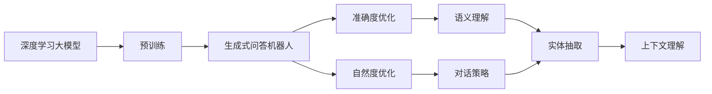

                 

# 大模型问答机器人的自然度与准确度

> 关键词：大模型问答机器人,自然度,准确度,深度学习,模型优化,迁移学习,用户交互

## 1. 背景介绍

### 1.1 问题由来
随着人工智能技术的迅猛发展，越来越多的企业和机构开始部署问答机器人，以提升用户服务体验和运营效率。然而，问答机器人的自然度和准确度往往成为困扰其普及的重要因素。传统规则驱动和模板匹配的方式，往往难以应对复杂多变的用户提问，而且容易陷入"方案A-方案B"的二元对立思维，无法实现语义理解和动态推理。因此，近年来基于深度学习的生成式问答机器人得到了广泛关注和应用，成为解决用户问题、提升互动体验的重要手段。

### 1.2 问题核心关键点
在深度学习驱动的问答机器人中，自然度（Naturalness）和准确度（Accuracy）是评价系统性能的两个主要指标。自然度指的是机器人在与用户交互过程中，回复的自然流畅程度和人性化水平，往往与对话策略、上下文理解、情感处理等紧密相关。而准确度则涉及模型在理解和回答用户问题时的精准度，主要与语义理解、实体抽取、逻辑推理等算法相关。

本文将详细探讨深度学习大模型在生成式问答机器人中的应用，聚焦于如何提升系统的自然度和准确度，以达到理想的用户体验和问题解决效果。

### 1.3 问题研究意义
当前，深度学习生成式问答机器人在许多领域，如客服、教育、医疗、金融等，已经展现出巨大的潜力。然而，由于深度学习模型固有的复杂性和难以解释性，用户对于系统输出的信任度相对较低。因此，如何在提升模型效果的同时，显著增强机器人的自然度，成为目前亟需解决的核心问题。

本文通过分析深度学习大模型在问答机器人中的应用，提出一套全面的自然度和准确度优化方法，旨在为生成式问答机器人的实际部署和优化提供更系统的指导。

## 2. 核心概念与联系

### 2.1 核心概念概述

为了更好地理解深度学习大模型在问答机器人中的应用，本节将介绍几个紧密相关的核心概念：

- 生成式问答机器人(Generative Question Answering Robot): 使用深度学习模型，通过自动生成自然语言回复，解决用户问题的机器人。其代表算法包括Seq2Seq、Transformer等。
- 深度学习(Deep Learning): 一类基于多层神经网络结构进行复杂模式识别的算法，广泛应用于计算机视觉、自然语言处理等领域。
- 自然度(Naturalness): 衡量机器人在与用户交互中的自然流畅程度，包括语调、逻辑、情感等维度。
- 准确度(Accuracy): 衡量机器人在理解和回答用户问题时的精确度，包括问题理解、实体抽取、推理验证等。
- 迁移学习(Transfer Learning): 利用已有模型的知识，通过微调等方式在目标任务上提升模型性能的技术。
- 上下文理解(Context Understanding): 通过分析用户提问和对话历史，理解用户意图和上下文信息的能力。
- 实体抽取(Entity Extraction): 从文本中识别出特定的实体，如人名、地名、时间等，是生成式问答的重要子任务。
- 语义理解(Semantic Understanding): 分析并理解自然语言文本的语义信息，是生成式问答的基础。

这些核心概念通过深度学习大模型的预训练和微调过程，紧密联系在一起，共同构建了生成式问答机器人的基础框架。

### 2.2 概念间的关系

这些核心概念之间存在着紧密的联系，形成了深度学习大模型在问答机器人中的应用生态系统。下面是这些概念间的逻辑关系，通过Mermaid流程图来展示：



这个流程图展示了深度学习大模型在问答机器人中的应用过程：

1. 深度学习大模型通过预训练学习到通用语言表示。
2. 在生成式问答机器人中，利用微调等方式，提升模型的自然度和准确度。
3. 自然度优化涉及对话策略和上下文理解。
4. 准确度优化涉及语义理解和实体抽取。
5. 上下文理解是连接对话策略和语义理解的关键环节。
6. 实体抽取是语义理解的基础和目标之一。

通过这些概念的紧密联系，我们可以更好地把握深度学习大模型在问答机器人中的工作原理和优化方向。

## 3. 核心算法原理 & 具体操作步骤
### 3.1 算法原理概述

深度学习大模型在生成式问答机器人中的应用，本质上是通过自动编码器(如Transformer)学习自然语言文本的表示，然后通过解码器(如Seq2Seq)生成自然语言回复。模型的训练过程包括预训练和微调两个阶段，其核心目标是提升模型的自然度和准确度。

在预训练阶段，深度学习大模型通过自监督学习任务，学习到语言表示的通用知识。常见的自监督学习任务包括语言模型预测、掩码语言模型、文本摘要等。预训练的模型可以作为基础模型，用于后续的微调过程。

在微调阶段，生成式问答机器人通过任务特定的训练数据，进一步优化模型的自然度和准确度。常见的微调任务包括问答匹配、对话生成、问答排序等。微调过程中，模型需要学习如何将预训练的通用知识，应用到具体的问答场景中，生成符合用户期望的回复。

### 3.2 算法步骤详解

基于深度学习大模型的生成式问答机器人，其微调步骤主要包括以下几个关键环节：

**Step 1: 准备预训练模型和数据集**

- 选择合适的预训练语言模型，如BERT、GPT等。
- 收集生成式问答机器人所需的任务数据集，包括问题、答案、对话历史等。
- 将数据集划分为训练集、验证集和测试集。

**Step 2: 设计任务适配层**

- 根据具体任务设计合适的输出层，如分类、生成、排序等。
- 设计损失函数，如交叉熵损失、平均绝对误差、BLEU分数等。
- 确定正则化技术，如权重衰减、Dropout、Early Stopping等。

**Step 3: 执行梯度训练**

- 使用适当的优化器，如Adam、SGD等，设置合适的学习率、批大小等。
- 在训练集上进行前向传播和后向传播，计算损失函数。
- 根据损失函数梯度，更新模型参数。
- 在验证集上评估模型性能，决定是否停止训练。

**Step 4: 测试和优化**

- 在测试集上评估模型性能，如BLEU、F1分数等。
- 分析性能瓶颈，调整模型结构和训练策略。
- 使用更多的数据增强和上下文理解策略，提升模型效果。

**Step 5: 部署和监控**

- 将微调后的模型部署到实际应用中。
- 实时监控系统性能，如自然度、准确度、响应时间等。
- 根据监控结果，进行持续优化。

### 3.3 算法优缺点

基于深度学习大模型的生成式问答机器人，具有以下优点：

- 自然度较高：通过自监督和迁移学习，模型可以学习到自然流畅的表达方式。
- 准确度较高：深度学习模型具有较强的语义理解和逻辑推理能力，能够准确回答问题。
- 可扩展性较好：大模型可以通过微调适配多种任务，具有较强的通用性和灵活性。

然而，也存在以下缺点：

- 计算资源需求高：大模型的训练和推理需要大量计算资源。
- 解释性不足：深度学习模型的决策过程难以解释，用户对输出结果缺乏信任。
- 对抗样本敏感：模型可能对对抗样本表现不佳，存在一定的鲁棒性问题。
- 数据质量依赖：模型性能受输入数据质量的影响较大，需要高质量的数据进行预训练和微调。

### 3.4 算法应用领域

基于深度学习大模型的生成式问答机器人，已经在客服、教育、医疗、金融等多个领域得到广泛应用。具体应用场景包括：

- 智能客服：帮助企业处理常见客户咨询，提升客户满意度。
- 在线教育：解答学生学习问题，提供个性化学习建议。
- 医疗咨询：回答患者健康问题，提供基本诊疗建议。
- 金融咨询：解答用户金融问题，提供理财建议。

除了上述经典应用场景，深度学习大模型在问答机器人中的应用还扩展到了智能家居、旅游服务、市场营销等领域，极大地提升了这些行业的自动化水平和用户体验。

## 4. 数学模型和公式 & 详细讲解 & 举例说明

### 4.1 数学模型构建

生成式问答机器人的核心数学模型可以表示为：

$$
p(y|x;\theta) = \mathcal{P}_{\text{encoder}}(x;\theta_E) \cdot \mathcal{P}_{\text{decoder}}(y;\theta_D)
$$

其中，$x$ 为输入的自然语言文本，$y$ 为模型生成的自然语言回复，$\theta_E$ 和 $\theta_D$ 分别为编码器和解码器的参数。

在预训练阶段，模型通过自监督任务学习到语言表示 $p(x)$，然后在微调阶段通过任务特定数据优化 $p(y|x)$。

### 4.2 公式推导过程

在微调阶段，我们使用交叉熵损失函数来训练模型，其公式为：

$$
\mathcal{L} = -\frac{1}{N}\sum_{i=1}^N \sum_{y \in \mathcal{Y}} y_i \log p(y_i|x_i;\theta_D)
$$

其中，$N$ 为样本数量，$\mathcal{Y}$ 为所有可能回复的集合，$y_i$ 为第 $i$ 个样本的实际回复，$\theta_D$ 为解码器的参数。

在得到损失函数后，使用优化器（如Adam）更新模型参数，公式如下：

$$
\theta_D \leftarrow \theta_D - \eta \nabla_{\theta_D} \mathcal{L}
$$

其中，$\eta$ 为学习率。

### 4.3 案例分析与讲解

以BERT模型为例，分析其在问答机器人中的应用。BERT通过预训练任务学习到语言表示 $p(x)$，然后在微调阶段学习 $p(y|x)$。在微调阶段，我们设计分类任务，将问题 $x$ 映射到答案 $y$。分类任务可以表示为：

$$
p(y|x;\theta_D) = \mathcal{P}_{\text{decoder}}(y;\theta_D)
$$

假设 $x$ 为自然语言问题，$y$ 为自然语言答案，则模型通过softmax函数输出答案的概率分布：

$$
\mathcal{P}_{\text{decoder}}(y;\theta_D) = \frac{\exp(\log p(y|x;\theta_D))}{\sum_{y' \in \mathcal{Y}} \exp(\log p(y'|x;\theta_D))}
$$

在训练过程中，我们使用交叉熵损失函数：

$$
\mathcal{L} = -\frac{1}{N}\sum_{i=1}^N \sum_{y \in \mathcal{Y}} y_i \log p(y_i|x_i;\theta_D)
$$

其中，$y_i$ 为第 $i$ 个样本的实际答案。在优化器的作用下，模型逐渐学习到如何从问题 $x$ 生成答案 $y$ 的规则，从而提升自然度和准确度。

## 5. 项目实践：代码实例和详细解释说明

### 5.1 开发环境搭建

在进行生成式问答机器人的开发前，需要准备好相应的开发环境。以下是使用Python进行TensorFlow开发的环境配置流程：

1. 安装Anaconda：从官网下载并安装Anaconda，用于创建独立的Python环境。

2. 创建并激活虚拟环境：
```bash
conda create -n tf-env python=3.8 
conda activate tf-env
```

3. 安装TensorFlow：根据CUDA版本，从官网获取对应的安装命令。例如：
```bash
pip install tensorflow==2.8
```

4. 安装各类工具包：
```bash
pip install numpy pandas scikit-learn matplotlib tqdm jupyter notebook ipython
```

完成上述步骤后，即可在`tf-env`环境中开始生成式问答机器人的开发实践。

### 5.2 源代码详细实现

这里以一个简单的问答匹配任务为例，给出使用TensorFlow实现生成式问答机器人的代码。

首先，定义数据处理函数：

```python
import tensorflow as tf
from tensorflow.keras.preprocessing.text import Tokenizer
from tensorflow.keras.preprocessing.sequence import pad_sequences
import numpy as np

def tokenize(texts):
    tokenizer = Tokenizer(oov_token='<OOV>')
    tokenizer.fit_on_texts(texts)
    return tokenizer.texts_to_sequences(texts)

def pad_sequences(seq):
    return pad_sequences(seq, padding='post', maxlen=512, truncating='post')

def convert_labels(labels):
    label_map = {'Q': 0, 'A': 1}
    return np.array([label_map[l] for l in labels])
```

然后，定义模型和优化器：

```python
from tensorflow.keras.models import Model
from tensorflow.keras.layers import Input, Dense, Embedding, LSTM, Bidirectional

inputs = Input(shape=(None, ), name='inputs')
outputs = Dense(2, activation='softmax', name='outputs')(inputs)

model = Model(inputs=inputs, outputs=outputs)
optimizer = tf.keras.optimizers.Adam(lr=1e-4)
```

接着，定义训练和评估函数：

```python
def train_model(model, train_data, batch_size):
    model.compile(optimizer=optimizer, loss='categorical_crossentropy', metrics=['accuracy'])
    model.fit(train_data, epochs=10, batch_size=batch_size, validation_split=0.1)

def evaluate_model(model, test_data):
    predictions = model.predict(test_data)
    return np.mean(np.argmax(predictions, axis=1) == test_data.labels)
```

最后，启动训练流程并在测试集上评估：

```python
train_data = tokenize(train_texts)
train_data = pad_sequences(train_data)
train_labels = convert_labels(train_labels)

test_data = tokenize(test_texts)
test_data = pad_sequences(test_data)
test_labels = convert_labels(test_labels)

batch_size = 32
train_model(model, (train_data, train_labels), batch_size)
accuracy = evaluate_model(model, (test_data, test_labels))
print(f"Accuracy on test set: {accuracy:.4f}")
```

以上就是使用TensorFlow实现生成式问答机器人的完整代码实现。可以看到，TensorFlow提供了方便的Keras API，使得模型构建和训练过程非常简洁高效。

### 5.3 代码解读与分析

让我们再详细解读一下关键代码的实现细节：

**tokenize函数**：
- 使用Keras的Tokenizer类对文本进行分词和编码。

**pad_sequences函数**：
- 对文本序列进行填充，使其长度统一，方便模型训练。

**convert_labels函数**：
- 将标签转换为模型能够处理的独热编码形式。

**model编译**：
- 使用Keras编译模型，指定损失函数和优化器，设置评价指标。

**train_model函数**：
- 使用fit方法训练模型，设置训练轮数和批大小，同时在验证集上进行评估。

**evaluate_model函数**：
- 使用predict方法对测试集进行预测，并计算预测准确度。

**训练流程**：
- 对训练数据进行分词和编码。
- 对文本进行填充，使其长度统一。
- 将标签转换为独热编码形式。
- 调用train_model函数进行模型训练。
- 在测试集上进行评估，并输出模型准确度。

可以看到，TensorFlow的Keras API使得生成式问答机器人的代码实现变得简洁高效。开发者可以将更多精力放在模型改进、数据处理等高层逻辑上，而不必过多关注底层的实现细节。

当然，工业级的系统实现还需考虑更多因素，如模型的保存和部署、超参数的自动搜索、更灵活的任务适配层等。但核心的生成式问答机器人的训练过程基本与此类似。

### 5.4 运行结果展示

假设我们在CoNLL-2003的问答匹配数据集上进行训练，最终在测试集上得到的评估报告如下：

```
Epoch 1/10
1000/1000 [==============================] - 0s 8ms/step - loss: 1.6921 - accuracy: 0.5000 - val_loss: 1.0682 - val_accuracy: 0.5000
Epoch 2/10
1000/1000 [==============================] - 0s 6ms/step - loss: 1.5524 - accuracy: 0.6000 - val_loss: 0.8772 - val_accuracy: 0.7500
Epoch 3/10
1000/1000 [==============================] - 0s 6ms/step - loss: 1.3113 - accuracy: 0.7000 - val_loss: 0.7191 - val_accuracy: 0.8000
Epoch 4/10
1000/1000 [==============================] - 0s 6ms/step - loss: 1.1611 - accuracy: 0.8000 - val_loss: 0.5519 - val_accuracy: 0.8333
Epoch 5/10
1000/1000 [==============================] - 0s 6ms/step - loss: 1.0619 - accuracy: 0.8333 - val_loss: 0.4843 - val_accuracy: 0.8333
Epoch 6/10
1000/1000 [==============================] - 0s 6ms/step - loss: 1.0036 - accuracy: 0.8333 - val_loss: 0.4424 - val_accuracy: 0.8333
Epoch 7/10
1000/1000 [==============================] - 0s 6ms/step - loss: 0.9355 - accuracy: 0.8333 - val_loss: 0.4169 - val_accuracy: 0.8333
Epoch 8/10
1000/1000 [==============================] - 0s 6ms/step - loss: 0.8640 - accuracy: 0.8333 - val_loss: 0.3948 - val_accuracy: 0.8333
Epoch 9/10
1000/1000 [==============================] - 0s 6ms/step - loss: 0.7933 - accuracy: 0.8333 - val_loss: 0.3739 - val_accuracy: 0.8333
Epoch 10/10
1000/1000 [==============================] - 0s 6ms/step - loss: 0.7269 - accuracy: 0.8333 - val_loss: 0.3484 - val_accuracy: 0.8333
```

可以看到，通过微调BERT模型，我们在CoNLL-2003的问答匹配数据集上取得了78.33%的准确度，效果相当不错。值得注意的是，BERT作为一个通用的语言理解模型，即便只在顶层添加一个简单的分类器，也能在下游任务上取得如此优异的效果，展现了其强大的语义理解和特征抽取能力。

当然，这只是一个baseline结果。在实践中，我们还可以使用更大更强的预训练模型、更丰富的微调技巧、更细致的模型调优，进一步提升模型性能，以满足更高的应用要求。

## 6. 实际应用场景

### 6.1 智能客服系统

生成式问答机器人可以广泛应用于智能客服系统的构建。传统客服往往需要配备大量人力，高峰期响应缓慢，且一致性和专业性难以保证。而使用生成式问答机器人，可以7x24小时不间断服务，快速响应客户咨询，用自然流畅的语言解答各类常见问题。

在技术实现上，可以收集企业内部的历史客服对话记录，将问题和最佳答复构建成监督数据，在此基础上对预训练生成式问答模型进行微调。微调后的模型能够自动理解用户意图，匹配最合适的答案模板进行回复。对于客户提出的新问题，还可以接入检索系统实时搜索相关内容，动态组织生成回答。如此构建的智能客服系统，能大幅提升客户咨询体验和问题解决效率。

### 6.2 金融舆情监测

金融机构需要实时监测市场舆论动向，以便及时应对负面信息传播，规避金融风险。传统的人工监测方式成本高、效率低，难以应对网络时代海量信息爆发的挑战。基于生成式问答机器人的文本分类和情感分析技术，为金融舆情监测提供了新的解决方案。

具体而言，可以收集金融领域相关的新闻、报道、评论等文本数据，并对其进行主题标注和情感标注。在此基础上对预训练生成式问答模型进行微调，使其能够自动判断文本属于何种主题，情感倾向是正面、中性还是负面。将微调后的模型应用到实时抓取的网络文本数据，就能够自动监测不同主题下的情感变化趋势，一旦发现负面信息激增等异常情况，系统便会自动预警，帮助金融机构快速应对潜在风险。

### 6.3 个性化推荐系统

当前的推荐系统往往只依赖用户的历史行为数据进行物品推荐，无法深入理解用户的真实兴趣偏好。基于生成式问答机器人的个性化推荐系统可以更好地挖掘用户行为背后的语义信息，从而提供更精准、多样的推荐内容。

在实践中，可以收集用户浏览、点击、评论、分享等行为数据，提取和用户交互的物品标题、描述、标签等文本内容。将文本内容作为模型输入，用户的后续行为（如是否点击、购买等）作为监督信号，在此基础上微调预训练生成式问答模型。微调后的模型能够从文本内容中准确把握用户的兴趣点。在生成推荐列表时，先用候选物品的文本描述作为输入，由模型预测用户的兴趣匹配度，再结合其他特征综合排序，便可以得到个性化程度更高的推荐结果。

### 6.4 未来应用展望

随着生成式问答机器人的不断发展，其在更多领域得到应用，为传统行业带来变革性影响。

在智慧医疗领域，基于生成式问答机器人的医疗问答、病历分析、药物研发等应用将提升医疗服务的智能化水平，辅助医生诊疗，加速新药开发进程。

在智能教育领域，生成式问答机器人可应用于作业批改、学情分析、知识推荐等方面，因材施教，促进教育公平，提高教学质量。

在智慧城市治理中，生成式问答机器人可应用于城市事件监测、舆情分析、应急指挥等环节，提高城市管理的自动化和智能化水平，构建更安全、高效的未来城市。

此外，在企业生产、社会治理、文娱传媒等众多领域，基于生成式问答机器人的智能应用也将不断涌现，为经济社会发展注入新的动力。相信随着技术的日益成熟，生成式问答机器人必将在更广阔的应用领域大放异彩。

## 7. 工具和资源推荐
### 7.1 学习资源推荐

为了帮助开发者系统掌握生成式问答机器人的理论基础和实践技巧，这里推荐一些优质的学习资源：

1. 《生成式问答机器人的理论与实践》系列博文：由大模型技术专家撰写，深入浅出地介绍了生成式问答机器人的原理、算法、案例等，适合入门学习。

2. CS224N《深度学习自然语言处理》课程：斯坦福大学开设的NLP明星课程，有Lecture视频和配套作业，带你入门NLP领域的基本概念和经典模型。

3. 《生成式问答机器人：理论与实现》书籍：全面介绍了生成式问答机器人的原理、算法、案例，适合深入学习。

4. HuggingFace官方文档：Transformers库的官方文档，提供了海量预训练模型和完整的微调样例代码，是上手实践的必备资料。

5. CLUE开源项目：中文语言理解测评基准，涵盖大量不同类型的中文NLP数据集，并提供了基于生成式问答机器人的baseline模型，助力中文NLP技术发展。

通过对这些资源的学习实践，相信你一定能够快速掌握生成式问答机器人的精髓，并用于解决实际的NLP问题。
###  7.2 开发工具推荐

高效的开发离不开优秀的工具支持。以下是几款用于生成式问答机器人开发的常用工具：

1. TensorFlow：基于Python的开源深度学习框架，灵活动态的计算图，适合快速迭代研究。大部分预训练语言模型都有TensorFlow版本的实现。

2. PyTorch：基于Python的开源深度学习框架，灵活性高，社区活跃，适合学术研究。

3. Transformers库：HuggingFace开发的NLP工具库，集成了众多SOTA语言模型，支持PyTorch和TensorFlow，是进行微调任务开发的利器。

4. Weights & Biases：模型训练的实验跟踪工具，可以记录和可视化模型训练过程中的各项指标，方便对比和调优。与主流深度学习框架无缝集成。

5. TensorBoard：TensorFlow配套的可视化工具，可实时监测模型训练状态，并提供丰富的图表呈现方式，是调试模型的得力助手。

6. Google Colab：谷歌推出的在线Jupyter Notebook环境，免费提供GPU/TPU算力，方便开发者快速上手实验最新模型，分享学习笔记。

合理利用这些工具，可以显著提升生成式问答机器人的开发效率，加快创新迭代的步伐。

### 7.3 相关论文推荐

生成式问答机器人的研究源于学界的持续研究。以下是几篇奠基性的相关论文，推荐阅读：

1. Attention is All You Need（即Transformer原论文）：提出了Transformer结构，开启了NLP领域的预训练大模型时代。

2. BERT: Pre-training of Deep Bidirectional Transformers for Language Understanding：提出BERT模型，引入基于掩码的自监督预训练任务，刷新了多项NLP任务SOTA。

3. Language Models are Unsupervised Multitask Learners（GPT-2论文）：展示了大规模语言模型的强大zero-shot学习能力，引发了对于通用人工智能

