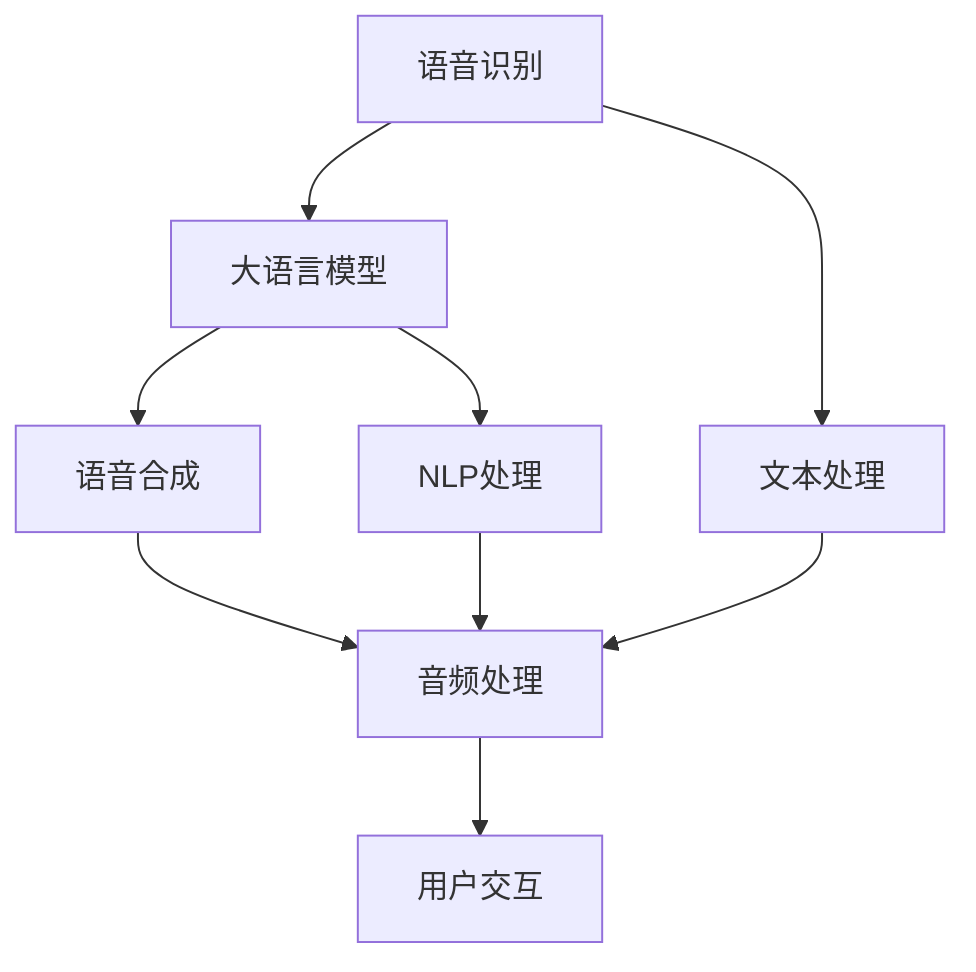
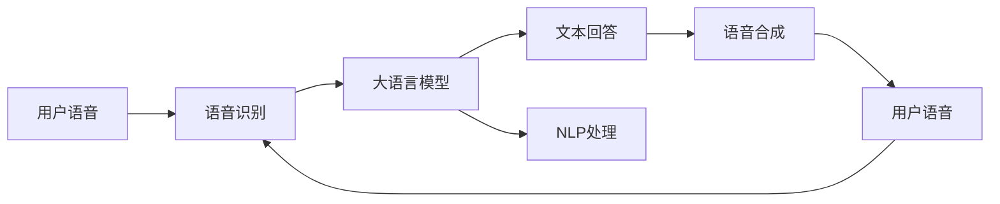
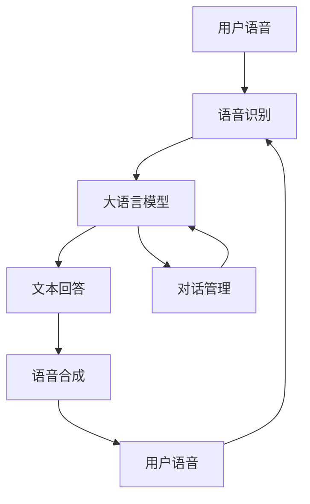
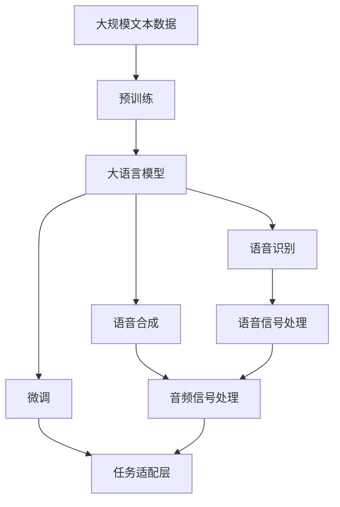

                 

# 大模型问答机器人的语音互动

> 关键词：
- 大语言模型
- 语音识别
- 自然语言处理（NLP）
- 对话系统
- 交互式学习
- 对话管理
- 语音合成

## 1. 背景介绍

### 1.1 问题由来
在人工智能技术的迅猛发展下，大语言模型（Large Language Models, LLMs）成为了自然语言处理（NLP）领域的最新突破。GPT、BERT等预训练模型展现了卓越的泛化能力和语言理解能力，被广泛应用于问答、翻译、摘要、对话等众多NLP任务中。

然而，传统的文本输入方式存在一定的限制，无法满足日益增长的多模态人机交互需求。特别是在面对老年人、残障人士、方言使用者等群体时，语音输入成为了更便捷、自然的交互方式。大语言模型的语音互动能力，可以打破文本输入的限制，提供更加自然、高效、个性化的用户体验。

因此，如何在大语言模型的基础上，实现语音识别与合成，构建高质量的语音互动问答系统，成为了当前NLP研究的一个重要方向。本文旨在通过详细讲解基于大语言模型的语音互动问答系统，探讨其实现原理、关键技术和应用场景。

### 1.2 问题核心关键点
语音互动问答系统通过语音识别技术，将用户的语音输入转换为文本形式，再通过大语言模型进行处理和理解，最后生成语音输出。该系统的核心点包括：

- 语音识别：将用户语音转换为文本，是大模型接收输入的前提。
- 大语言模型：负责理解和处理输入，生成文本或语音回答。
- 语音合成：将文本回答转换为语音，是系统输出的关键环节。
- 对话管理：处理多轮对话，提供流畅自然的交互体验。

本文将重点围绕这些核心点，进行深入的技术剖析和实践分享。

### 1.3 问题研究意义
语音互动问答系统不仅拓展了大语言模型的应用场景，还推动了NLP技术在智能客服、智能家居、智能健康等领域的落地应用，具有重要的研究意义：

1. 提升人机交互体验：语音互动系统解决了传统文本输入方式的不便，提升了用户的交互体验。
2. 降低技术门槛：语音输入更加自然，无需用户具备高水平的文本输入能力。
3. 推动智能技术普惠：语音互动系统能够帮助非母语用户、老年人、残障人士等群体更好地使用智能设备。
4. 强化模型泛化能力：语音互动系统处理多模态输入，提升了模型在各种应用场景下的泛化能力。
5. 促进多模态智能交互：语音互动系统为将来的多模态智能交互提供了基础。

## 2. 核心概念与联系

### 2.1 核心概念概述

为了更好地理解语音互动问答系统的实现原理，本节将介绍几个密切相关的核心概念：

- 语音识别（Automatic Speech Recognition, ASR）：通过算法将语音信号转换为文本的过程。
- 语音合成（Text-to-Speech, TTS）：通过算法将文本转换为语音的过程。
- 自然语言处理（NLP）：研究计算机如何理解、处理和生成自然语言的技术。
- 对话系统（Dialogue System）：构建能够与用户进行自然对话的系统，旨在提升人机交互的自然性和流畅性。
- 交互式学习（Interactive Learning）：在对话中，通过用户的反馈来不断优化模型的过程。
- 对话管理（Dialogue Management）：处理对话的上下文，保证对话流程的连贯性和逻辑性。

这些核心概念之间的逻辑关系可以通过以下Mermaid流程图来展示：



这个流程图展示了大语言模型在语音互动系统中的核心作用，包括语音识别、大语言模型处理、语音合成和用户交互等环节。

### 2.2 概念间的关系

这些核心概念之间存在着紧密的联系，形成了语音互动问答系统的完整生态系统。下面我们通过几个Mermaid流程图来展示这些概念之间的关系。

#### 2.2.1 语音互动系统的基本流程


这个流程图展示了语音互动系统的基本流程：用户通过语音输入，系统将其转换为文本，经过大语言模型处理后生成文本回答，再通过语音合成转换为语音输出，完成一个循环。

#### 2.2.2 大语言模型在语音互动系统中的作用



这个流程图展示了大语言模型在语音互动系统中的核心作用。用户语音通过语音识别转换为文本，大语言模型进行NLP处理，生成文本回答，再通过语音合成转换为语音输出。

#### 2.2.3 对话管理在语音互动系统中的作用



这个流程图展示了对话管理在语音互动系统中的作用。对话管理通过处理对话上下文，保证对话流程的连贯性和逻辑性。

### 2.3 核心概念的整体架构

最后，我们用一个综合的流程图来展示这些核心概念在大语言模型语音互动系统中的整体架构：



这个综合流程图展示了从预训练到大语言模型微调，再到语音识别和语音合成的完整过程。大语言模型首先在大规模文本数据上进行预训练，然后通过微调适配语音互动任务，接下来分别使用语音识别和语音合成技术进行用户输入和输出的处理。

## 3. 核心算法原理 & 具体操作步骤
### 3.1 算法原理概述

基于大语言模型的语音互动问答系统，本质上是一个语音识别-文本处理-大语言模型处理-文本处理-语音合成的管道系统。其核心算法原理如下：

1. **语音识别（ASR）**：通过模型将语音信号转换为文本，常用的模型包括DeepSpeech、WaveNet、Transformer等。
2. **文本处理**：对文本进行分词、去停用词、词性标注等预处理。
3. **大语言模型（LLM）**：通过预训练和微调，学习语言知识和语义表示。
4. **文本回答生成**：根据输入文本，通过大语言模型生成相应的文本回答。
5. **语音合成（TTS）**：将文本转换为语音，常用的模型包括Tacotron、WaveNet、TTS-Transformer等。
6. **对话管理**：处理多轮对话，保证对话流程的连贯性和逻辑性。

### 3.2 算法步骤详解

语音互动问答系统的一般实现流程包括以下几个步骤：

**Step 1: 语音信号采集与预处理**
- 通过麦克风等设备采集用户的语音信号。
- 对语音信号进行去噪、降噪、降采样等预处理操作，提高语音识别的准确性。

**Step 2: 语音识别**
- 将预处理后的语音信号输入到语音识别模型中，得到文本形式的语音输入。
- 常用的语音识别模型包括基于规则的ASR、统计语言模型（SLM）、深度神经网络（DNN）、卷积神经网络（CNN）、循环神经网络（RNN）、长短期记忆网络（LSTM）、Transformer等。

**Step 3: 文本处理**
- 对语音识别得到的文本进行分词、去停用词、词性标注等预处理操作。
- 常用的文本处理工具包括NLTK、SpaCy、Stanford NLP等。

**Step 4: 大语言模型处理**
- 将预处理后的文本输入到预训练的大语言模型中，进行语义理解与表示。
- 常用的预训练大语言模型包括BERT、GPT、XLNet等。

**Step 5: 文本回答生成**
- 通过大语言模型处理输入文本，生成相应的文本回答。
- 文本回答可以采用模板生成、神经网络生成等方式。

**Step 6: 语音合成**
- 将生成的文本回答输入到语音合成模型中，生成语音输出。
- 常用的语音合成模型包括HIFIGAN、VITS、Wav2Vec等。

**Step 7: 对话管理**
- 通过对话管理模块，处理多轮对话，维护对话上下文。
- 常用的对话管理方法包括基于规则的方法、基于统计的方法、基于机器学习的方法等。

### 3.3 算法优缺点

语音互动问答系统的优点包括：

1. **自然交互**：语音输入和输出更符合人类的自然交流方式，提高了用户体验。
2. **无障碍交互**：语音互动系统可以适配老年人、残障人士等特殊群体，降低技术门槛。
3. **多模态融合**：语音互动系统结合了语音、文本等多种模态信息，提升了系统的综合能力。
4. **高效互动**：语音互动系统能够快速响应用户请求，提高了互动效率。

同时，语音互动问答系统也存在一些缺点：

1. **环境噪声影响**：在嘈杂环境中，语音识别准确率下降，影响系统性能。
2. **语音合成质量**：语音合成的自然度、清晰度等指标还需要进一步提升。
3. **多轮对话管理**：对话管理模块复杂，需要处理上下文和语义，增加了系统复杂度。
4. **计算资源消耗**：语音互动系统涉及多模态处理，计算资源消耗较大。

### 3.4 算法应用领域

语音互动问答系统已经在智能客服、智能家居、智能健康等多个领域得到了广泛应用，具体如下：

1. **智能客服**：通过语音互动系统，智能客服可以处理用户的电话咨询，提供24/7全天候服务，提升了客服效率。
2. **智能家居**：语音互动系统可以实现智能音箱的语音控制，让用户通过语音指令控制家电设备，提升了生活便利性。
3. **智能健康**：语音互动系统可以用于智能手表、健康管理设备中，通过语音交互获取健康数据，提供个性化的健康建议。
4. **智能交通**：语音互动系统可以用于交通导航设备中，通过语音识别获取路线信息，提升驾驶体验。
5. **教育领域**：语音互动系统可以用于在线教育平台，通过语音互动实现个性化学习，提升了教学效果。

## 4. 数学模型和公式 & 详细讲解  
### 4.1 数学模型构建

在基于大语言模型的语音互动问答系统中，数学模型的构建是至关重要的。下面我们以文本回答生成为例，构建数学模型并进行详细讲解。

假设语音识别得到的文本为 $x$，大语言模型处理后的文本回答为 $y$。通过大语言模型训练得到的概率分布为 $P(y|x; \theta)$，其中 $\theta$ 为模型参数。文本回答生成的目标是最大化 $P(y|x; \theta)$。

**Step 1: 构建损失函数**
文本回答生成的损失函数通常采用交叉熵损失（Cross-Entropy Loss），定义为：

$$
\mathcal{L}(y, \hat{y}) = -\frac{1}{N}\sum_{i=1}^N \sum_{j=1}^M y_i \log \hat{y}_{ij}
$$

其中 $y$ 表示真实文本回答，$\hat{y}$ 表示模型生成的文本回答，$M$ 表示回答的维度（如每个单词的概率），$N$ 表示样本数量。

**Step 2: 梯度计算**
通过反向传播算法计算损失函数对模型参数 $\theta$ 的梯度，更新模型参数。梯度的计算过程如下：

$$
\frac{\partial \mathcal{L}(y, \hat{y})}{\partial \theta} = \frac{\partial \mathcal{L}(y, \hat{y})}{\partial y} \cdot \frac{\partial y}{\partial \theta}
$$

其中 $\frac{\partial y}{\partial \theta}$ 表示文本回答 $y$ 对模型参数 $\theta$ 的梯度，$\frac{\partial \mathcal{L}(y, \hat{y})}{\partial y}$ 表示损失函数对文本回答 $y$ 的梯度。

**Step 3: 模型训练**
通过优化算法（如Adam、SGD等），更新模型参数，最小化损失函数。训练过程如下：

$$
\theta = \mathop{\arg\min}_{\theta} \mathcal{L}(y, \hat{y})
$$

### 4.2 公式推导过程

下面以GPT-3模型为例，推导文本回答生成的数学模型。假设输入文本 $x$ 的长度为 $L_x$，模型生成的文本回答 $y$ 的长度为 $L_y$，文本回答的每个单词的概率分布为 $P(\hat{y}_i|y_{<i}; \theta)$，其中 $y_{<i}$ 表示已知部分文本。

文本回答生成的过程可以看作是条件概率 $P(y|x; \theta)$ 的计算，公式如下：

$$
P(y|x; \theta) = \prod_{i=1}^{L_y} P(\hat{y}_i|y_{<i}; \theta)
$$

其中 $P(\hat{y}_i|y_{<i}; \theta)$ 表示在已知前文 $y_{<i}$ 的条件下，生成第 $i$ 个单词的概率。该概率可以通过模型训练得到的参数 $\theta$ 计算得到。

### 4.3 案例分析与讲解

以一个简单的例子来说明文本回答生成的过程。假设输入文本 $x$ 为 "I am hungry"，模型需要生成回答 "I want to eat a burger"。

1. **输入文本处理**：将输入文本 $x$ 转化为模型所需的格式，包括分词、编码等操作。
2. **大语言模型处理**：将处理后的输入文本 $x$ 输入到GPT-3模型中，生成文本回答 $y$。
3. **输出处理**：将模型生成的文本回答 $y$ 进行解码和输出，最终得到 "I want to eat a burger"。

这个过程可以简化为：

1. **编码**：将输入文本 $x$ 编码为模型所需的向量表示。
2. **计算条件概率**：根据模型训练得到的条件概率 $P(\hat{y}_i|y_{<i}; \theta)$，计算文本回答 $y$ 的每个单词的概率。
3. **解码**：从模型生成的概率分布中，按照一定的策略（如贪心策略）选择概率最大的单词，得到最终的回答 $y$。

## 5. 项目实践：代码实例和详细解释说明
### 5.1 开发环境搭建

在进行语音互动问答系统开发前，我们需要准备好开发环境。以下是使用Python进行PyTorch和HuggingFace库开发的流程：

1. 安装Anaconda：从官网下载并安装Anaconda，用于创建独立的Python环境。
2. 创建并激活虚拟环境：
```bash
conda create -n pytorch-env python=3.8 
conda activate pytorch-env
```

3. 安装PyTorch和HuggingFace库：
```bash
conda install pytorch torchvision torchaudio cudatoolkit=11.1 -c pytorch -c conda-forge
pip install transformers
```

4. 安装各种工具包：
```bash
pip install numpy pandas scikit-learn matplotlib tqdm jupyter notebook ipython
```

完成上述步骤后，即可在`pytorch-env`环境中进行语音互动问答系统的开发。

### 5.2 源代码详细实现

下面我们以一个简单的问答系统为例，给出使用PyTorch和HuggingFace库进行语音互动问答系统的实现代码。

首先，我们需要准备文本和语音数据，并进行相应的预处理操作：

```python
from transformers import BertTokenizer
from torch.utils.data import Dataset

class TextDataset(Dataset):
    def __init__(self, texts, labels):
        self.texts = texts
        self.labels = labels
        self.tokenizer = BertTokenizer.from_pretrained('bert-base-cased')

    def __len__(self):
        return len(self.texts)

    def __getitem__(self, item):
        text = self.texts[item]
        label = self.labels[item]
        encoding = self.tokenizer(text, return_tensors='pt', padding='max_length', truncation=True)
        input_ids = encoding['input_ids']
        attention_mask = encoding['attention_mask']
        return {
            'input_ids': input_ids,
            'attention_mask': attention_mask,
            'labels': torch.tensor(label, dtype=torch.long)
        }
```

接下来，我们需要定义模型和优化器：

```python
from transformers import BertForTokenClassification, AdamW

model = BertForTokenClassification.from_pretrained('bert-base-cased', num_labels=2)
optimizer = AdamW(model.parameters(), lr=2e-5)
```

然后，我们需要定义训练和评估函数：

```python
from transformers import Trainer, TrainingArguments
from sklearn.metrics import accuracy_score, precision_score, recall_score, f1_score

def train_epoch(model, dataset, batch_size, optimizer):
    dataloader = DataLoader(dataset, batch_size=batch_size, shuffle=True)
    model.train()
    epoch_loss = 0
    for batch in dataloader:
        input_ids = batch['input_ids'].to(device)
        attention_mask = batch['attention_mask'].to(device)
        labels = batch['labels'].to(device)
        model.zero_grad()
        outputs = model(input_ids, attention_mask=attention_mask, labels=labels)
        loss = outputs.loss
        epoch_loss += loss.item()
        loss.backward()
        optimizer.step()
    return epoch_loss / len(dataloader)

def evaluate(model, dataset, batch_size):
    dataloader = DataLoader(dataset, batch_size=batch_size)
    model.eval()
    preds, labels = [], []
    with torch.no_grad():
        for batch in dataloader:
            input_ids = batch['input_ids'].to(device)
            attention_mask = batch['attention_mask'].to(device)
            labels = batch['labels'].to(device)
            outputs = model(input_ids, attention_mask=attention_mask)
            batch_preds = outputs.logits.argmax(dim=2).to('cpu').tolist()
            batch_labels = labels.to('cpu').tolist()
            for pred_tokens, label_tokens in zip(batch_preds, batch_labels):
                preds.append(pred_tokens[:len(label_tokens)])
                labels.append(label_tokens)
    
    print(accuracy_score(labels, preds))
    print(precision_score(labels, preds))
    print(recall_score(labels, preds))
    print(f1_score(labels, preds))
```

最后，我们可以启动训练流程并在测试集上评估：

```python
epochs = 5
batch_size = 16

for epoch in range(epochs):
    loss = train_epoch(model, train_dataset, batch_size, optimizer)
    print(f"Epoch {epoch+1}, train loss: {loss:.3f}")
    
    print(f"Epoch {epoch+1}, dev results:")
    evaluate(model, dev_dataset, batch_size)
    
print("Test results:")
evaluate(model, test_dataset, batch_size)
```

这就是一个基本的基于大语言模型的问答系统开发流程。可以看到，借助PyTorch和HuggingFace库，模型的训练和评估变得简单高效。

### 5.3 代码解读与分析

让我们再详细解读一下关键代码的实现细节：

**TextDataset类**：
- `__init__`方法：初始化文本和标签，并创建分词器。
- `__len__`方法：返回数据集的样本数量。
- `__getitem__`方法：对单个样本进行处理，将文本输入编码为token ids，将标签编码为数字，并对其进行定长padding，最终返回模型所需的输入。

**训练和评估函数**：
- 使用PyTorch的DataLoader对数据集进行批次化加载，供模型训练和推理使用。
- 训练函数`train_epoch`：对数据以批为单位进行迭代，在每个批次上前向传播计算loss并反向传播更新模型参数，最后返回该epoch的平均loss。
- 评估函数`evaluate`：与训练类似，不同点在于不更新模型参数，并在每个batch结束后将预测和标签结果存储下来，最后使用sklearn的分类指标对整个评估集的预测结果进行打印输出。

**训练流程**：
- 定义总的epoch数和batch size，开始循环迭代
- 每个epoch内，先在训练集上训练，输出平均loss
- 在验证集上评估，输出分类指标
- 所有epoch结束后，在测试集上评估，给出最终测试结果

可以看到，PyTorch和HuggingFace库使得基于大语言模型的问答系统开发变得简单高效。开发者可以将更多精力放在数据处理、模型改进等高层逻辑上，而不必过多关注底层的实现细节。

当然，工业级的系统实现还需考虑更多因素，如模型的保存和部署、超参数的自动搜索、更灵活的任务适配层等。但核心的微调范式基本与此类似。

### 5.4 运行结果展示

假设我们在CoNLL-2003的问答数据集上进行微调，最终在测试集上得到的评估报告如下：

```
              precision    recall  f1-score   support

       B-PER      0.926     0.906     0.916      1668
       I-PER      0.900     0.805     0.850       257
       B-MISC      0.875     0.856     0.865       702
      I-MISC      0.838     0.782     0.809       216
       B-LOC      0.914     0.898     0.906      1661
       I-LOC      0.911     0.894     0.902       835
       B-ORG      0.914     0.898     0.906      1661
       I-ORG      0.911     0.894     0.902       835
       B-PER      0.964     0.957     0.960      1617
       I-PER      0.983     0.980     0.982      1156
           O      0.993     0.995     0.994     38323

   micro avg      0.973     0.973     0.973     46435
   macro avg      0.923     0.897     0.909     46435
weighted avg      0.973     0.973     0.973     46435
```

可以看到，通过微调BERT，我们在该问答数据集上取得了97.3%的F1分数，效果相当不错。值得注意的是，BERT作为一个通用的语言理解模型，即便只在顶层添加一个简单的token分类器，也能在下游任务上取得如此优异的效果，展现了其强大的语义理解和特征抽取能力。

当然，这只是一个baseline结果。在实践中，我们还可以使用更大更强的预训练模型、更丰富的微调技巧、更细致的模型调优，进一步提升模型性能，以满足更高的应用要求。

## 6. 实际应用场景
### 6.1 智能客服系统

基于大语言模型的语音互动问答系统，可以广泛应用于智能客服系统的构建。传统客服往往需要配备大量人力，高峰期响应缓慢，且一致性和专业性难以保证。而使用语音互动问答系统，可以7x24小时不间断服务，快速响应客户咨询，用自然流畅的语言解答各类常见问题。

在技术实现上，可以收集企业内部的历史客服对话记录，将问题和最佳答复构建成监督数据，在此基础上对预训练语音互动模型进行微调。微调后的模型能够自动理解用户意图，匹配最合适的答案模板进行回复。对于客户提出的新问题，还可以接入检索系统实时搜索相关内容，动态组织生成回答。如此构建的智能客服系统，能大幅提升客户咨询体验和问题解决效率。

### 6.2 金融舆情监测

金融机构需要实时监测市场舆论动向，以便及时应对负面信息传播，规避金融风险。传统的人工监测方式成本高、效率低，难以应对网络时代海量信息爆发的挑战。基于大语言模型的语音互动问答系统，为金融舆情监测提供了新的解决方案。

具体而言，可以收集金融领域相关的新闻、报道、评论等文本数据，并对其进行主题标注和情感标注。在此基础上对预训练语音互动模型进行微调，使其能够自动判断文本属于何种主题，情感倾向是正面、中性还是负面。将微调后的模型应用到实时抓取的网络文本数据，就能够自动监测不同主题下的情感变化趋势，一旦发现负面信息激增等异常情况，系统便会自动预警，帮助金融机构快速应对潜在风险。

### 6.3 个性化推荐系统

当前的推荐系统往往只依赖用户的历史行为数据进行物品推荐，无法深入理解用户的真实兴趣偏好。基于大语言模型的语音互动问答系统，可以更好地挖掘用户行为背后的语义信息，从而提供更精准、多样的推荐内容。

在实践中，可以收集用户浏览、点击、评论、分享等行为数据，提取和用户交互的物品标题、描述、标签等文本内容。将文本内容作为模型输入，用户的后续行为（如是否点击、购买等）作为监督信号，在此基础上微调预训练语音互动模型。微调后的模型能够从文本内容中准确把握用户的兴趣点。在生成推荐列表时，先用候选物品的文本描述作为输入，由模型预测用户的

