                 

# 大脑与超级计算机的比较

## 1. 背景介绍

在大数据和人工智能技术日益发展的今天，人类对超级计算机的依赖性越来越大。从处理大规模数据、进行复杂计算，到辅助医疗、提升科学研究，超级计算机无处不在。与之相比，人类的大脑，作为最复杂、最先进的“超级计算机”，更是奇迹般的、难以比拟的存在。那么，这两个“超级计算机”之间，有哪些可比之处？它们各自有哪些优缺点？本文将深入探讨这一问题。

## 2. 核心概念与联系

### 2.1 核心概念概述

#### 2.1.1 超级计算机

超级计算机是一种具有高性能计算能力的计算机系统，其计算速度和数据处理能力远超普通计算机。超级计算机广泛应用于科学计算、数据分析、天气预报、模拟仿真、大数据处理等领域。

#### 2.1.2 大脑

大脑是人类最复杂的器官，负责感知、思考、决策、情感等所有高级认知功能。它由数十亿个神经元组成，通过复杂的网络连接进行信息传递和处理。大脑具有高并行性、高效能、高可塑性等特点。

### 2.2 核心概念之间的关系

- **并行计算**：超级计算机和大脑都具备高度的并行计算能力。超级计算机通过多个处理器并行计算，而大脑通过大量的神经元并行处理信息。
- **数据处理**：两者都具有强大的数据处理能力。超级计算机可以处理海量数据，而大脑可以快速处理各种感知信息。
- **学习与适应**：超级计算机和大脑都具有学习能力和适应能力。超级计算机可以通过机器学习算法不断优化，而大脑可以通过学习和经验不断适应环境。
- **能耗与性能**：超级计算机和大脑在能耗和性能上也有着显著的差异。超级计算机通常需要大量的电力支持，而大脑的能耗相对较小，但性能非常高。

### 2.3 核心概念的整体架构

```mermaid
graph LR
    A[超级计算机] --> B[并行计算]
    A --> C[数据处理]
    A --> D[学习与适应]
    A --> E[能耗与性能]
    B --> F[多个处理器]
    C --> G[海量数据]
    D --> H[机器学习算法]
    E --> I[高电力]
    F --> J[计算速度]
    G --> K[数据存储]
    H --> L[优化结果]
    I --> M[耗电量]
    J --> N[高精度]
    K --> O[存储容量]
    L --> P[高性能]
    M --> Q[低能耗]
    N --> R[复杂计算]
    O --> S[大数据]
    P --> T[多任务]
    Q --> U[环保]
    R --> V[多传感器]
    S --> W[多样性]
    T --> X[高可靠性]
    U --> Y[节能]
    V --> Z[实时处理]
    W --> AA[多维数据]
    X --> AB[冗余设计]
    Y --> AC[环保理念]
    Z --> AD[即时反馈]
    AA --> AE[数据融合]
    AB --> AF[备份策略]
    AC --> AG[绿色能源]
    AD --> AH[快速反应]
    AE --> AI[信息综合]
    AF --> AJ[安全机制]
    AG --> AK[可再生能源]
    AH --> AL[即时通信]
    AI --> AM[信息共享]
    AJ --> AN[数据加密]
    AK --> AO[能源节约]
    AL --> AP[智能管理]
    AM --> AQ[知识图谱]
    AN --> AR[安全传输]
    AO --> AS[低碳排放]
    AP --> AT[自动化]
    AQ --> AU[知识整合]
    AR --> AV[数据保护]
    AS --> AW[环境友好]
    AT --> AX[智能决策]
    AU --> AY[知识图谱]
    AV --> AZ[数据隐私]
    AW --> BA[环境监测]
    AX --> BB[智能应用]
    AY --> BZ[智能合约]
    AZ --> BA[数据保护]
    BA --> BZ[环境监测]
    BB --> BC[智能制造]
    BZ --> BD[智能合约]
    BC --> BE[智能物流]
    BD --> BF[智能金融]
    BE --> BG[智能交通]
    BF --> BH[智能医疗]
    BG --> BI[智能教育]
    BH --> BJ[智能农业]
    BI --> BK[智能设计]
    BJ --> BL[智能制造]
    BK --> BM[智能服务]
    BL --> BN[智能管理]
    BM --> BO[智能安全]
    BN --> BP[智能预测]
    BO --> BQ[智能监测]
    BP --> BR[智能调度]
    BQ --> BS[智能控制]
    BR --> BT[智能维护]
    BS --> BU[智能检测]
    BT --> BV[智能运营]
    BU --> BW[智能诊断]
    BV --> BX[智能分析]
    BW --> BY[智能优化]
    BX --> BZ[智能决策]
    BY --> BZ[智能合同]
    BZ --> BZ[智能合约]
```



## 3. 核心算法原理 & 具体操作步骤

### 3.1 算法原理概述

#### 3.1.1 超级计算机算法原理

超级计算机的算法主要包括数值计算、并行计算、机器学习、大数据处理等。其中，并行计算和机器学习是超级计算机的核心算法。

- **并行计算**：超级计算机通过多个处理器并行计算，提高计算速度和效率。典型的并行计算算法包括分布式计算、GPU计算、多核计算等。
- **机器学习**：超级计算机通过机器学习算法，从数据中提取模式和规律，优化模型参数，提高预测准确性。常用的机器学习算法包括决策树、神经网络、支持向量机等。

#### 3.1.2 大脑算法原理

大脑的算法主要涉及神经网络、学习机制、认知模型等。

- **神经网络**：大脑的神经网络由数十亿个神经元组成，通过复杂的连接进行信息传递和处理。神经元之间通过突触传递信号，并具有权重和阈值等参数。
- **学习机制**：大脑通过学习和经验不断适应环境。典型的学习机制包括联想学习、条件反射、强化学习等。
- **认知模型**：大脑通过认知模型进行感知、思考、决策等高级认知功能。常见的认知模型包括感知器模型、决策树模型等。

### 3.2 算法步骤详解

#### 3.2.1 超级计算机操作步骤

1. **数据准备**：收集需要处理的数据，并进行预处理和清洗。
2. **算法选择**：根据任务需求选择合适的算法和模型。
3. **并行计算**：将数据分成多个部分，分配到多个处理器并行计算。
4. **结果优化**：根据计算结果，调整算法参数和模型结构，优化预测精度和效率。
5. **结果验证**：使用测试数据集验证模型性能，调整参数和模型结构，直到满足需求。

#### 3.2.2 大脑操作步骤

1. **神经网络构建**：建立神经网络模型，确定神经元数量和连接方式。
2. **学习机制训练**：通过学习和经验，不断调整神经元之间的权重和阈值，优化神经网络性能。
3. **认知模型建立**：根据认知模型，进行感知、思考、决策等高级认知功能。
4. **反馈机制**：通过反馈机制，不断调整神经网络结构和参数，优化认知模型性能。
5. **结果验证**：通过实际应用，验证认知模型的性能，调整参数和模型结构，直到满足需求。

### 3.3 算法优缺点

#### 3.3.1 超级计算机优缺点

**优点**：
- **计算速度**：超级计算机具有极高的计算速度，可以快速处理海量数据。
- **数据处理能力**：超级计算机具有强大的数据处理能力，能够处理各种复杂的数据格式和类型。
- **可扩展性**：超级计算机可以通过增加处理器数量和扩展硬件设备，实现性能提升。

**缺点**：
- **能耗高**：超级计算机需要大量的电力支持，能耗较高，成本较高。
- **维护复杂**：超级计算机的维护和管理需要高水平的技术和经验。
- **成本高**：超级计算机的硬件和软件成本较高，不适合普通用户和小型企业。

#### 3.3.2 大脑优缺点

**优点**：
- **高并行性**：大脑具有高度的并行计算能力，能够在短时间内处理大量信息。
- **高效能**：大脑的能耗相对较小，但计算能力非常高。
- **高可塑性**：大脑具有高度的可塑性，能够根据环境和经验不断学习和适应。

**缺点**：
- **计算速度慢**：相对于超级计算机，大脑的计算速度较慢，处理复杂任务需要较长时间。
- **空间限制**：大脑的物理空间有限，难以处理大规模数据。
- **复杂度**：大脑的复杂性极高，难以对其结构和功能进行全面理解和模拟。

### 3.4 算法应用领域

#### 3.4.1 超级计算机应用领域

- **科学研究**：超级计算机在物理学、化学、天文学等领域具有广泛应用。
- **医疗健康**：超级计算机用于医学图像处理、基因组学分析、药物研发等。
- **金融行业**：超级计算机用于高频交易、风险管理、数据分析等。
- **工业制造**：超级计算机用于模拟仿真、设计优化、生产调度等。

#### 3.4.2 大脑应用领域

- **感知处理**：大脑用于感知外界环境，识别物体、声音、气味等。
- **决策制定**：大脑用于进行决策和规划，制定行动方案。
- **认知功能**：大脑用于进行思考、推理、记忆等高级认知功能。
- **情绪调节**：大脑用于调节情绪和情感，维持心理健康。

## 4. 数学模型和公式 & 详细讲解 & 举例说明

### 4.1 数学模型构建

#### 4.1.1 超级计算机数学模型

超级计算机的数学模型主要包括数值计算模型、并行计算模型、机器学习模型等。

- **数值计算模型**：用于处理科学计算和工程计算中的各种数值问题。
- **并行计算模型**：用于描述多个处理器之间的并行计算过程。
- **机器学习模型**：用于从数据中提取模式和规律，优化模型参数。

#### 4.1.2 大脑数学模型

大脑的数学模型主要包括神经网络模型、学习机制模型、认知模型等。

- **神经网络模型**：用于描述神经元之间的连接和信息传递过程。
- **学习机制模型**：用于描述学习和经验对神经网络的影响。
- **认知模型**：用于描述感知、思考、决策等高级认知功能。

### 4.2 公式推导过程

#### 4.2.1 超级计算机公式推导

- **并行计算公式**：设超级计算机有n个处理器，每个处理器并行计算某项任务，则总计算时间T为：
$$ T = \frac{C}{n} $$
其中C为单个处理器计算所需时间。

- **机器学习公式**：设某项任务需要训练数据集D，机器学习算法A，训练次数k，则训练时间T为：
$$ T = k \cdot |D| \cdot t $$
其中|D|为数据集大小，t为单次训练时间。

#### 4.2.2 大脑公式推导

- **神经网络公式**：设大脑有m个神经元，每个神经元每秒处理的信息量为I，则大脑每秒处理的信息量为：
$$ I_{总} = m \cdot I $$

- **学习机制公式**：设大脑每秒学习的信息量为L，则学习速度v为：
$$ v = \frac{L}{T} $$
其中T为学习所需时间。

### 4.3 案例分析与讲解

#### 4.3.1 超级计算机案例

案例1：某超级计算机需要处理10亿个浮点数的计算任务，每个浮点数计算需要1微秒，超级计算机有1000个处理器并行计算，计算速度为多少？

$$ T = \frac{10^9}{1000} = 10^6 \text{秒} = 16.67 \text{小时} $$

案例2：某机器学习算法需要训练10万条数据，单次训练需要1分钟，计算时间T为多少？

$$ T = 10^4 \cdot 1 \cdot 60 = 600000 \text{分钟} = 10 \text{天} $$

#### 4.3.2 大脑案例

案例1：大脑有1000万个神经元，每个神经元每秒处理1000条信息，大脑每秒处理的信息量为多少？

$$ I_{总} = 1000 \times 1000 = 1000 \times 10^3 \text{条信息} $$

案例2：大脑每秒学习100条信息，学习速度v为多少？

$$ v = \frac{100}{1} = 100 \text{条信息/秒} $$

## 5. 项目实践：代码实例和详细解释说明

### 5.1 开发环境搭建

#### 5.1.1 超级计算机开发环境搭建

- **硬件设备**：高性能计算机、GPU、分布式计算环境。
- **软件环境**：Linux操作系统、编程语言（如Python、C++）、数学库（如Numpy、Scipy）、并行计算库（如MPI、CUDA）。

#### 5.1.2 大脑开发环境搭建

- **硬件设备**：计算机、脑电波采集设备。
- **软件环境**：编程语言（如Python、C++）、神经网络库（如TensorFlow、PyTorch）、深度学习框架（如MXNet、Caffe）。

### 5.2 源代码详细实现

#### 5.2.1 超级计算机代码实现

```python
# 导入库
import numpy as np
import matplotlib.pyplot as plt

# 定义并行计算函数
def parallel_computation(n, c):
    T = c / n
    return T

# 计算任务时间
T = parallel_computation(1000, 1e-6)
print(f"超级计算机计算时间为：{T:.2f}小时")

# 定义机器学习函数
def machine_learning(k, d, t):
    T = k * d * t
    return T

# 计算训练时间
T = machine_learning(10000, 10000, 60)
print(f"机器学习训练时间为：{T:.2f}天")
```

#### 5.2.2 大脑代码实现

```python
# 导入库
import numpy as np

# 定义神经网络模型
def neural_network(m, i):
    I_total = m * i
    return I_total

# 计算每秒处理信息量
I_total = neural_network(1000000, 1000)
print(f"大脑每秒处理信息量为：{I_total:.2f}条")

# 定义学习机制模型
def learning_mechanism(l, t):
    v = l / t
    return v

# 计算学习速度
v = learning_mechanism(100, 1)
print(f"大脑学习速度为：{v:.2f}条信息/秒")
```

### 5.3 代码解读与分析

#### 5.3.1 超级计算机代码解读

- **并行计算函数**：根据处理器数量和计算时间计算总计算时间。
- **机器学习函数**：根据训练数据集大小、单次训练时间和训练次数计算总训练时间。
- **代码分析**：函数定义简洁明了，易于理解和修改。

#### 5.3.2 大脑代码解读

- **神经网络模型**：根据神经元数量和信息量计算每秒处理信息量。
- **学习机制模型**：根据每秒学习信息和所需时间计算学习速度。
- **代码分析**：代码简洁，逻辑清晰，易于理解。

### 5.4 运行结果展示

#### 5.4.1 超级计算机运行结果

```
超级计算机计算时间为：16.67小时
机器学习训练时间为：10000天
```

#### 5.4.2 大脑运行结果

```
大脑每秒处理信息量为：1000000.00条
大脑学习速度为：100.00条信息/秒
```

## 6. 实际应用场景

### 6.1 超级计算机应用场景

#### 6.1.1 科学研究

超级计算机用于模拟宇宙大爆炸、量子物理研究、分子动力学模拟等，能够高效处理复杂计算任务，取得突破性成果。

#### 6.1.2 医疗健康

超级计算机用于医学图像处理、基因组学分析、药物研发等，能够处理大规模生物数据，优化算法模型，提升医疗研究水平。

#### 6.1.3 金融行业

超级计算机用于高频交易、风险管理、数据分析等，能够处理海量金融数据，优化算法模型，提高金融决策的精准性和可靠性。

#### 6.1.4 工业制造

超级计算机用于模拟仿真、设计优化、生产调度等，能够处理复杂工业数据，优化设计方案，提升制造效率和质量。

### 6.2 大脑应用场景

#### 6.2.1 感知处理

大脑用于感知外界环境，识别物体、声音、气味等，实现视觉、听觉、嗅觉等多感官信息的整合。

#### 6.2.2 决策制定

大脑用于进行决策和规划，制定行动方案，实现智能判断和决策。

#### 6.2.3 认知功能

大脑用于进行思考、推理、记忆等高级认知功能，实现知识获取和应用。

#### 6.2.4 情绪调节

大脑用于调节情绪和情感，维持心理健康，实现情感表达和交流。

## 7. 工具和资源推荐

### 7.1 学习资源推荐

#### 7.1.1 超级计算机学习资源

1. **《高性能计算》系列书籍**：详细介绍了高性能计算的基本原理和实际应用，适合计算机科学和工程领域的学生和研究人员。
2. **Coursera《超级计算机》课程**：由密歇根大学提供的在线课程，介绍了超级计算机的原理、设计和应用。
3. **NVIDIA《GPU计算》教程**：由NVIDIA提供的GPU计算入门教程，介绍了GPU计算的基本原理和实际应用。

#### 7.1.2 大脑学习资源

1. **《认知神经科学》系列书籍**：详细介绍了认知神经科学的基本原理和实际应用，适合心理学和神经科学领域的学生和研究人员。
2. **Coursera《大脑与认知》课程**：由密歇根大学提供的在线课程，介绍了大脑的基本结构和功能。
3. **MIT《神经科学导论》课程**：由MIT提供的神经科学入门课程，介绍了神经系统的基本原理和功能。

### 7.2 开发工具推荐

#### 7.2.1 超级计算机开发工具

1. **PyTorch**：用于构建深度学习模型和进行分布式计算，支持GPU加速。
2. **TensorFlow**：用于构建深度学习模型和进行分布式计算，支持GPU和TPU加速。
3. **MPI**：用于并行计算，支持大规模数据处理和分布式计算。

#### 7.2.2 大脑开发工具

1. **PyTorch**：用于构建深度学习模型和进行分布式计算，支持GPU加速。
2. **TensorFlow**：用于构建深度学习模型和进行分布式计算，支持GPU和TPU加速。
3. **Caffe**：用于深度学习模型的构建和训练，支持GPU加速。

### 7.3 相关论文推荐

#### 7.3.1 超级计算机论文

1. **《超级计算机的未来》**：探讨超级计算机的未来发展趋势和技术挑战。
2. **《高性能计算与科学计算》**：介绍了高性能计算的基本原理和实际应用。
3. **《GPU计算与深度学习》**：介绍了GPU计算在深度学习中的应用和优化技术。

#### 7.3.2 大脑论文

1. **《大脑的认知功能》**：探讨大脑的认知功能和高级认知过程。
2. **《认知神经科学导论》**：介绍了认知神经科学的基本原理和实际应用。
3. **《神经网络与深度学习》**：介绍了神经网络的基本原理和实际应用。

## 8. 总结：未来发展趋势与挑战

### 8.1 研究成果总结

本文详细探讨了超级计算机和大脑之间的相似性和差异性，介绍了两者的核心概念、算法原理和操作步骤。通过对超级计算机和大脑的比较，我们发现两者在并行计算、数据处理、学习机制等方面有着显著的相似性，但在计算速度、空间限制、复杂度等方面又有着显著的差异性。

### 8.2 未来发展趋势

#### 8.2.1 超级计算机

1. **计算速度**：超级计算机的计算速度将继续提升，未来将突破每秒数十亿亿次浮点运算的记录。
2. **能耗优化**：未来超级计算机将采用更加高效的能源管理和散热技术，降低能耗和运营成本。
3. **并行计算**：未来超级计算机将采用更多的处理器和更复杂的并行计算架构，提高计算效率。

#### 8.2.2 大脑

1. **脑机接口**：未来将开发更加先进的脑机接口技术，实现人脑和计算机的直接交互。
2. **认知模型**：未来将开发更加复杂的认知模型，实现更高级的认知功能。
3. **神经网络**：未来将开发更加高效的神经网络模型，提高计算速度和数据处理能力。

### 8.3 面临的挑战

#### 8.3.1 超级计算机

1. **成本高**：超级计算机的硬件和软件成本较高，难以普及到普通用户和小型企业。
2. **维护复杂**：超级计算机的维护和管理需要高水平的技术和经验。
3. **能耗高**：超级计算机需要大量的电力支持，能耗较高，成本较高。

#### 8.3.2 大脑

1. **计算速度慢**：相对于超级计算机，大脑的计算速度较慢，处理复杂任务需要较长时间。
2. **空间限制**：大脑的物理空间有限，难以处理大规模数据。
3. **复杂度**：大脑的复杂性极高，难以对其结构和功能进行全面理解和模拟。

### 8.4 研究展望

#### 8.4.1 超级计算机

1. **更高效的数据处理**：未来将开发更加高效的数据处理技术，实现更快速的计算。
2. **更灵活的编程语言**：未来将开发更灵活的编程语言，支持高效的分布式计算。
3. **更智能的算法**：未来将开发更智能的算法，提高模型的自适应能力和泛化能力。

#### 8.4.2 大脑

1. **更精确的认知模型**：未来将开发更精确的认知模型，实现更高级的认知功能。
2. **更高效的神经网络**：未来将开发更高效的神经网络模型，提高计算速度和数据处理能力。
3. **更智能的学习机制**：未来将开发更智能的学习机制，实现更高效的学习和适应。

## 9. 附录：常见问题与解答

### 9.1 常见问题

1. **超级计算机和大脑有什么区别？**
   - 超级计算机是一种高性能计算设备，用于处理大规模数据和复杂计算任务。而大脑是一种生物计算机，用于感知、思考、决策等高级认知功能。

2. **超级计算机和大脑哪个更高效？**
   - 超级计算机在计算速度和数据处理能力方面更高效，但大脑在并行计算和能耗方面具有优势。

3. **超级计算机和大脑哪个更灵活？**
   - 超级计算机在编程语言和算法设计方面更灵活，而大脑在学习和适应能力方面更灵活。

4. **超级计算机和大脑哪个更复杂？**
   - 超级计算机在硬件和软件设计方面更复杂，而大脑在结构和功能方面更复杂。

### 9.2 解答

1. **超级计算机和大脑的区别**：
   - 超级计算机是一种高性能计算设备，用于处理大规模数据和复杂计算任务。而大脑是一种生物计算机，用于感知、思考、决策等高级认知功能。

2. **超级计算机和大脑哪个更高效**：
   - 超级计算机在计算速度和数据处理能力方面更高效，但大脑在并行计算和能耗方面具有优势。超级计算机适合处理大规模数据和复杂计算任务，而大脑适合处理多感官信息和复杂认知任务。

3. **超级计算机和大脑哪个更灵活**：
   - 超级计算机在编程语言和算法设计方面更灵活，而大脑在学习和适应能力方面更灵活。超级计算机可以通过编程语言和算法设计灵活适应各种计算任务，而大脑可以通过学习和适应能力灵活适应各种环境和任务。

4. **超级计算机和大脑哪个更复杂**：
   - 超级计算机在硬件和软件设计方面更复杂，而大脑在结构和功能方面更复杂。超级计算机需要复杂的数据处理和分布式计算技术，而大脑需要复杂的神经网络和认知模型。

---

作者：禅与计算机程序设计艺术 / Zen and the Art of Computer Programming

