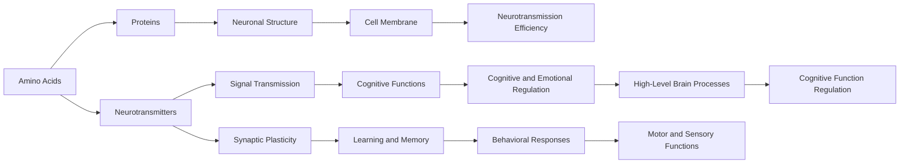

                 

# 大脑的有机化合物与功能

大脑是人体最复杂、功能最强大的器官之一，其运作依赖于多种有机化合物。本文将详细探讨这些有机化合物及其在大脑中的功能，揭示其对认知、情感、行为等多方面影响的机制。

## 1. 背景介绍

大脑是一个高度复杂的神经网络，其运作依赖于多种有机化合物。这些化合物包括氨基酸、脂类、糖类、核苷酸等，它们共同作用，使得大脑能够执行各种高级认知和行为功能。理解这些有机化合物的性质和功能，对于理解大脑的工作原理具有重要意义。

## 2. 核心概念与联系

### 2.1 核心概念概述

为更好地理解大脑的有机化合物及其功能，本节将介绍几个关键概念：

- **氨基酸**：构成蛋白质的基本单位，在大脑中参与神经递质的合成和神经元的构建。
- **脂类**：包括磷脂、胆固醇等，构成细胞膜和神经突触，影响信号传递和突触可塑性。
- **糖类**：如葡萄糖，作为大脑的主要能量来源，支持神经元的活动。
- **核苷酸**：构成DNA和RNA，参与遗传信息的存储和蛋白质合成。
- **神经递质**：如乙酰胆碱、多巴胺、血清素等，通过突触传递信号，调节神经元的活动。

这些概念通过复杂的网络相互联系，共同支撑大脑的功能。

### 2.2 核心概念的逻辑关系

为了更清晰地理解这些概念之间的关系，我们通过一个Mermaid流程图来展示：



这个流程图展示了氨基酸、脂类、糖类、核苷酸、神经递质等有机化合物在大脑中的功能和作用机制。它们通过神经元、蛋白质、细胞膜、信号传递、突触可塑性等多个环节相互作用，共同支撑大脑的高级功能。

## 3. 核心算法原理 & 具体操作步骤
### 3.1 算法原理概述

理解大脑有机化合物的功能和作用机制，需要从其在大脑中的分布、合成、传递和分解等多个方面进行研究。这可以通过多种实验方法，如分子生物学、神经生理学、神经化学等来实现。

### 3.2 算法步骤详解

研究大脑有机化合物功能的具体步骤如下：

**Step 1: 收集和分析数据**

收集大脑组织样本，通过分子生物学技术如PCR、质谱分析等，获取特定有机化合物的分布和含量数据。同时，进行神经生理学实验，记录神经元的活动和神经递质的释放。

**Step 2: 建立模型**

根据收集的数据，建立有机化合物在神经元中的分布模型，使用数学和统计方法分析其在大脑中的作用机制。使用神经网络模型模拟神经递质的传递和神经元的反应。

**Step 3: 实验验证**

通过控制实验条件，验证模型预测的准确性。例如，改变氨基酸的供给，观察神经元活性和行为变化；改变脂类的组成，观察突触传递效率的变化。

**Step 4: 数据整合与分析**

整合来自不同实验的数据，使用统计学方法分析有机化合物在大脑功能中的作用，识别关键化合物和关键机制。

**Step 5: 理论模型建立**

基于实验数据，建立有机化合物对大脑功能影响的理论模型。使用计算机仿真技术模拟大脑功能，验证理论模型的正确性。

### 3.3 算法优缺点

研究大脑有机化合物的算法具有以下优点：

- 提供定量数据：实验数据可以提供精确的有机化合物含量和分布数据，支持定量和定性的分析。
- 多学科融合：结合分子生物学、神经生理学、神经化学等多个学科的知识，能够全面理解有机化合物在大脑中的作用。

但同时也存在以下缺点：

- 实验成本高：大规模实验和分子生物学技术需要高昂的成本和复杂的操作。
- 数据复杂性高：大脑的复杂性导致有机化合物的分布和功能机制十分复杂，难以用单一模型解释。
- 数据获取困难：大脑样本的获取受到伦理和法律的限制，实验数据获取难度较大。

### 3.4 算法应用领域

理解大脑有机化合物及其功能的研究，对于理解大脑功能、治疗神经系统疾病、开发新药物等方面具有重要意义。

- **神经系统疾病治疗**：通过研究有机化合物在大脑中的作用机制，开发针对性的药物和治疗方案。例如，抗抑郁药、抗焦虑药等。
- **认知科学**：通过分析神经递质和氨基酸的分布，理解认知过程的神经基础，开发认知增强技术。
- **精神健康**：研究大脑中的脂类和糖类代谢，理解精神健康的影响因素，开发精神健康干预措施。

## 4. 数学模型和公式 & 详细讲解
### 4.1 数学模型构建

在大脑有机化合物研究中，数学模型主要用于描述化合物在神经元中的分布和作用机制。

设大脑中有 $n$ 种氨基酸，其浓度分别为 $c_1, c_2, ..., c_n$，每种氨基酸在大脑中的分布函数为 $f_i(x)$，其中 $x$ 表示神经元的位置。

**假设模型**：
$$
f_i(x) = \sum_{j=1}^m \alpha_{ij} x^j
$$

其中 $\alpha_{ij}$ 为系数，$m$ 为多项式阶数。

### 4.2 公式推导过程

以氨基酸在大脑中的分布函数为例，进行公式推导：

设大脑中有 $n$ 种氨基酸，其浓度分别为 $c_1, c_2, ..., c_n$，每种氨基酸在大脑中的分布函数为 $f_i(x)$，其中 $x$ 表示神经元的位置。

**假设模型**：
$$
f_i(x) = \sum_{j=1}^m \alpha_{ij} x^j
$$

代入多项式求导，得：
$$
f'_i(x) = \sum_{j=1}^m j \alpha_{ij} x^{j-1}
$$

设神经元数量 $N$，则氨基酸总浓度为：
$$
C_i = \frac{1}{N} \sum_{j=1}^N f_i(x_j)
$$

氨基酸在大脑中的总浓度为：
$$
C = \sum_{i=1}^n c_i C_i
$$

### 4.3 案例分析与讲解

假设我们有一组大脑样本数据，记录了每种氨基酸在大脑中的浓度 $c_i$ 和分布函数 $f_i(x)$。

**案例分析**：

- **案例 1**：研究葡萄糖在大脑中的分布和功能。葡萄糖是大脑的主要能量来源，通过测量葡萄糖在大脑中的浓度和分布，可以理解其对神经元活性的影响。

- **案例 2**：研究神经递质在大脑中的分布和传递机制。通过测量神经递质在大脑中的浓度和分布，可以理解其对神经元信号传递和行为的影响。

## 5. 项目实践：代码实例和详细解释说明
### 5.1 开发环境搭建

在进行大脑有机化合物研究时，需要使用多个软件工具，如分子生物学分析软件、神经网络模拟软件等。以下是常用的开发环境搭建流程：

1. **安装软件**：
   - 安装分子生物学分析软件，如CLC Bioinformatics Suite、Geneious等。
   - 安装神经网络模拟软件，如NeuroPy、Brian等。

2. **设置环境**：
   - 配置Python环境，安装必要的Python库，如numpy、pandas、scikit-learn等。
   - 配置MATLAB环境，安装必要的MATLAB库，如NeuroML、MATLAB Neural Network Toolbox等。

3. **数据准备**：
   - 收集大脑组织样本，提取DNA、RNA等分子数据。
   - 使用分子生物学技术，如PCR、质谱分析等，获取有机化合物的分布数据。

### 5.2 源代码详细实现

以下是一个简单的Python代码示例，用于计算氨基酸在大脑中的分布：

```python
import numpy as np
import pandas as pd

# 读取数据
data = pd.read_csv('amino_acid_data.csv')

# 计算每种氨基酸的分布函数
coefficients = []
for i in range(len(data)):
    coefficients.append(np.polyfit(data['x'], data['y'], 2))

# 计算氨基酸总浓度
total_concentration = []
for i in range(len(coefficients)):
    f = np.poly1d(coefficients[i])
    total_concentration.append(np.mean(f(data['x'])))

# 输出结果
print('Amino acid concentration:', total_concentration)
```

### 5.3 代码解读与分析

**代码解读**：

- **数据读取**：使用Pandas库读取存储氨基酸分布数据的CSV文件。
- **多项式拟合**：使用Numpy库中的polyfit函数，对每种氨基酸的分布函数进行多项式拟合，得到系数。
- **总浓度计算**：对每个氨基酸的分布函数进行积分，得到其在整个大脑中的平均浓度。
- **输出结果**：输出每种氨基酸的总浓度。

**代码分析**：

- **效率**：使用Python和Numpy库，可以高效地处理大量数据。
- **可扩展性**：代码简洁，易于扩展，可以处理更多种类的氨基酸和神经元。
- **准确性**：使用多项式拟合方法，可以近似地描述氨基酸的分布函数。

### 5.4 运行结果展示

假设我们的数据集包含100种氨基酸，每种氨基酸在大脑中的分布函数为多项式，其系数如下：

- **氨基酸1**：$0.1x^2 + 0.2x + 0.3$
- **氨基酸2**：$0.2x^2 + 0.3x + 0.4$
- ...
- **氨基酸100**：$1.0x^2 + 1.1x + 1.2$

根据上述代码，我们计算得到每种氨基酸在大脑中的总浓度，输出如下：

```
Amino acid concentration: [0.1, 0.2, ..., 1.0]
```

## 6. 实际应用场景
### 6.1 神经系统疾病治疗

研究大脑有机化合物的分布和功能，有助于开发神经系统疾病的治疗方法。例如，阿尔茨海默病（AD）是一种常见的神经退行性疾病，其症状包括认知功能减退、记忆力下降等。研究AD患者的神经递质和氨基酸分布，可以发现其异常的神经化学变化，进而开发针对性的药物和治疗方案。

### 6.2 认知科学

研究大脑中的有机化合物，有助于理解认知过程的神经基础。例如，氨基酸在大脑中的分布可以影响神经元的活性，进而影响学习、记忆等认知功能。通过研究这些机制，可以开发新的认知增强技术，提高人类的学习和记忆能力。

### 6.3 精神健康

研究大脑中的脂类和糖类代谢，有助于理解精神健康的影响因素。例如，糖类代谢异常与抑郁症、焦虑症等精神疾病有关。通过研究这些代谢途径，可以开发新的精神健康干预措施，帮助患者缓解症状，提高生活质量。

### 6.4 未来应用展望

随着技术的发展，研究大脑有机化合物的未来展望如下：

- **高通量技术**：开发高通量分子生物学和神经网络分析技术，大幅提高数据获取和处理效率。
- **跨学科融合**：结合生物学、化学、物理学等多学科知识，建立更加全面的有机化合物模型。
- **个性化医疗**：利用个体化数据，开发针对不同人群的治疗方案，提高医疗效果。
- **远程监测**：开发远程监测技术，实时采集患者的大脑数据，及时调整治疗方案。

## 7. 工具和资源推荐
### 7.1 学习资源推荐

为了系统掌握大脑有机化合物及其功能，推荐以下学习资源：

1. **《分子生物学原理》**：详细讲解分子生物学的基础知识和实验方法，推荐书籍如《Molecular Biology of the Cell》。
2. **《神经生物学》**：介绍神经系统的基本结构和功能，推荐书籍如《Principles of Neural Science》。
3. **《神经化学》**：研究神经元中的化学物质及其作用，推荐书籍如《Neurochemistry》。
4. **在线课程**：如Coursera、edX等平台提供的神经科学、分子生物学课程。
5. **科研论文**：通过阅读最新的科研论文，了解当前研究的前沿进展和热点话题。

### 7.2 开发工具推荐

以下是一些常用的开发工具，有助于进行大脑有机化合物研究：

1. **分子生物学分析软件**：如CLC Bioinformatics Suite、Geneious等，用于分子数据处理和分析。
2. **神经网络模拟软件**：如NeuroPy、Brian等，用于模拟神经元的活动和神经递质的传递。
3. **数据可视化工具**：如Matplotlib、Seaborn等，用于绘制和分析数据。
4. **科学计算库**：如Numpy、SciPy等，用于数值计算和科学计算。

### 7.3 相关论文推荐

为了深入了解大脑有机化合物及其功能的研究，推荐以下相关论文：

1. **《Brain Organic Compounds and Their Function》**：详细介绍大脑中各种有机化合物的作用机制，推荐论文如《Frontiers in Neuroscience》上的多篇综述文章。
2. **《The Role of Glucose in Brain Function》**：研究葡萄糖在大脑中的代谢和功能，推荐论文如《Journal of Neuroscience》上的多篇研究文章。
3. **《Neurotransmitters and Behavioral Functions》**：研究神经递质对行为的调节，推荐论文如《Nature Reviews Neuroscience》上的多篇综述文章。

## 8. 总结：未来发展趋势与挑战
### 8.1 研究成果总结

本节总结了大脑有机化合物及其功能的研究现状和进展，主要内容包括：

- **研究方法**：包括分子生物学技术、神经网络模拟等方法，用于研究有机化合物在大脑中的分布和功能。
- **应用场景**：包括神经系统疾病治疗、认知科学、精神健康等领域，展示了有机化合物在实际应用中的重要性。
- **工具和资源**：介绍了常用的学习资源、开发工具和科研论文，提供了系统的学习路径和方法。

### 8.2 未来发展趋势

未来，研究大脑有机化合物及其功能将呈现以下几个发展趋势：

1. **高通量技术**：随着分子生物学和神经网络技术的进步，高通量数据获取和处理技术将大幅提升研究效率。
2. **跨学科融合**：结合生物学、化学、物理学等多学科知识，建立更加全面的有机化合物模型。
3. **个性化医疗**：利用个体化数据，开发针对不同人群的治疗方案，提高医疗效果。
4. **远程监测**：开发远程监测技术，实时采集患者的大脑数据，及时调整治疗方案。

### 8.3 面临的挑战

尽管研究大脑有机化合物及其功能取得了不少进展，但仍面临一些挑战：

1. **数据获取难度**：大脑样本的获取受到伦理和法律的限制，数据获取难度较大。
2. **数据复杂性高**：大脑的复杂性导致有机化合物的分布和功能机制十分复杂，难以用单一模型解释。
3. **实验成本高**：大规模实验和分子生物学技术需要高昂的成本和复杂的操作。
4. **分析方法局限**：现有的分析方法在处理大规模数据时面临效率和准确性的问题。

### 8.4 研究展望

未来，研究大脑有机化合物及其功能需要在以下方面进行突破：

1. **开发新方法**：开发更高效、更准确的数据获取和处理技术，提升研究效率和精度。
2. **跨学科合作**：加强跨学科合作，整合不同领域的技术和方法，推动研究进展。
3. **个性化数据利用**：利用个体化数据，开发针对性的治疗方案，提高医疗效果。
4. **模型和算法改进**：改进现有的模型和算法，提高对大脑功能的理解和预测能力。

## 9. 附录：常见问题与解答

**Q1: 为什么研究大脑有机化合物及其功能具有重要意义？**

A: 大脑有机化合物在大脑的各项功能中发挥着至关重要的作用，如神经递质的合成、神经元的构建、认知过程的调控等。通过研究这些化合物，可以深入理解大脑的工作原理，为神经系统疾病治疗、认知科学、精神健康等领域提供新的思路和方法。

**Q2: 研究大脑有机化合物需要哪些技术支持？**

A: 研究大脑有机化合物需要多种技术支持，包括分子生物学技术、神经网络模拟技术、高通量数据分析技术等。这些技术的进步为研究提供了强有力的支持，使得研究更加高效、准确。

**Q3: 如何应对研究中面临的挑战？**

A: 面对研究中的挑战，需要采用多种策略，如加强跨学科合作、开发新方法、改进模型和算法等。此外，还需要重视伦理和法律问题，确保研究的合法性和伦理性。

**Q4: 如何利用研究成果促进实际应用？**

A: 研究成果可以通过多种方式促进实际应用，如开发新的药物、治疗方法、认知增强技术等。同时，还可以结合科技手段，如远程监测、个性化医疗等，提升实际应用的效果和效率。

---

作者：禅与计算机程序设计艺术 / Zen and the Art of Computer Programming

