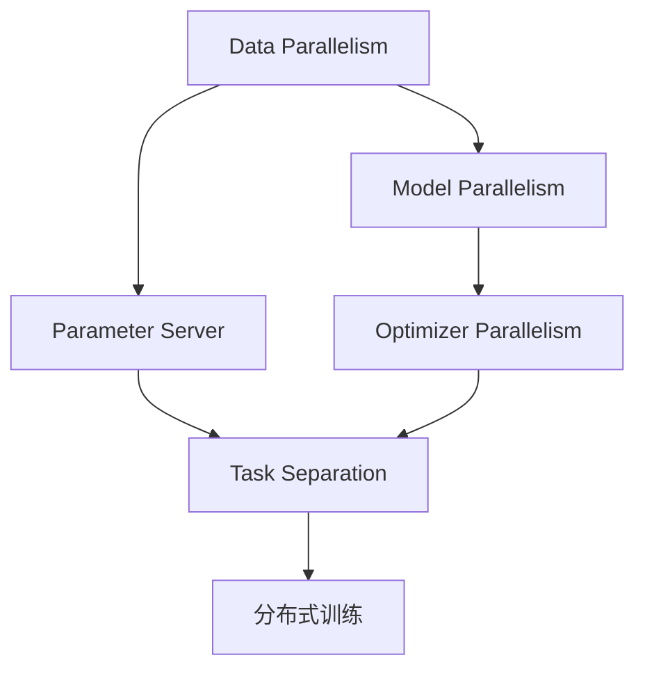
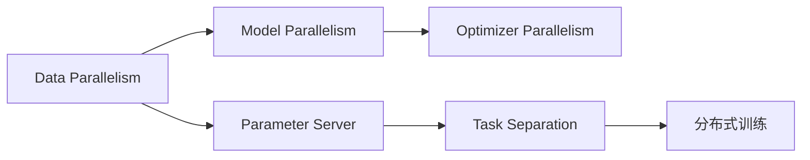
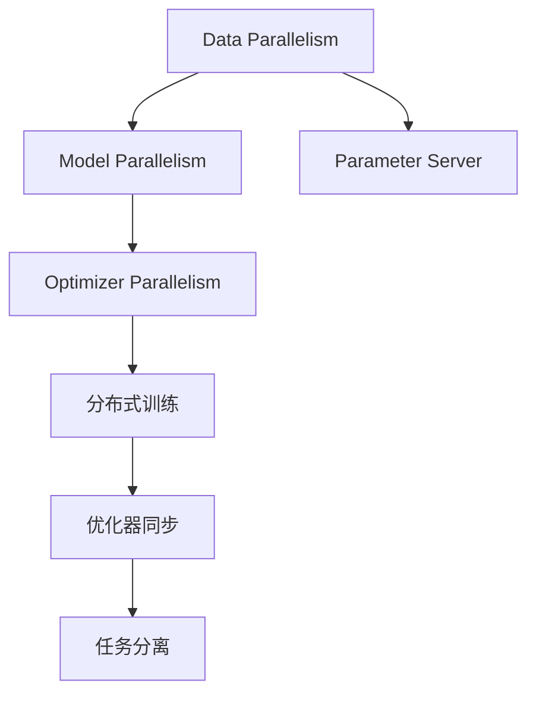
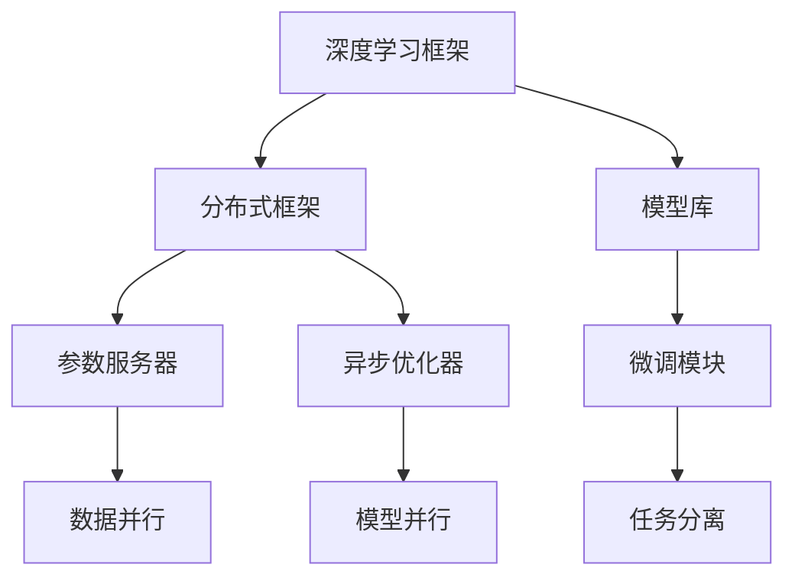

                 

# 大规模语言模型从理论到实践 分布式训练的并行策略

## 1. 背景介绍

### 1.1 问题由来
在深度学习时代，大规模语言模型（Large Language Models，LLMs）已经成为了NLP领域的重要研究热点。LLMs如BERT、GPT系列等模型，通过在大量无标签文本数据上进行自监督预训练，学习到了强大的语言表示能力，在多个下游任务上取得了优异的性能。

然而，由于模型参数量巨大，对训练硬件的需求非常高。传统的单节点单GPU训练方式难以处理大规模模型，而分布式训练则成为解决这一问题的重要手段。分布式训练通过将任务划分为多个子任务，并行计算，显著提升了模型的训练效率。

### 1.2 问题核心关键点
分布式训练的核心在于如何高效地利用计算资源，减少通信开销，并最大化并行度。其关键点包括：
- 数据并行：将数据划分为多个小批量，并行计算。
- 模型并行：将模型参数划分为多个片段，并行计算。
- 参数服务器：集中管理参数，减小通信开销。
- 优化器并行：使用异步优化器，提高并发度。
- 任务分离：在训练、推理、评估等不同阶段分配不同的计算资源。

这些关键点共同构成了分布式训练的完整框架，使得在大规模语言模型训练中，能够有效利用计算资源，提高训练效率。

### 1.3 问题研究意义
分布式训练是深度学习领域的重要技术手段，对于提高大规模语言模型的训练效率，降低训练成本，具有重要意义：

1. 提升训练效率。分布式训练可以并行化任务，将计算任务分散到多个节点，显著提升训练速度。
2. 降低硬件成本。通过多节点协同训练，可以充分利用现有硬件资源，降低单节点硬件要求。
3. 保证模型质量。分布式训练有助于避免过拟合，提升模型泛化能力。
4. 适应更大规模模型。分布式训练能够支撑更大规模的模型训练，满足不断增长的应用需求。
5. 促进产业升级。分布式训练技术的发展，为深度学习产业化提供了重要支持，加速了NLP技术的落地应用。

## 2. 核心概念与联系

### 2.1 核心概念概述

为更好地理解分布式训练的并行策略，本节将介绍几个密切相关的核心概念：

- 数据并行（Data Parallelism）：将数据分为多个小批量，在多个节点上并行计算。
- 模型并行（Model Parallelism）：将模型参数分为多个片段，在多个节点上并行计算。
- 参数服务器（Parameter Server）：集中管理模型参数，减小节点间的通信开销。
- 优化器并行（Optimizer Parallelism）：使用异步优化器，提高并发度。
- 任务分离（Task Separation）：将训练、推理、评估等任务分配到不同的节点上进行并行计算。

这些核心概念之间的逻辑关系可以通过以下Mermaid流程图来展示：



这个流程图展示了大规模语言模型分布式训练的基本流程：

1. 数据并行将数据划分为多个小批量，并行计算。
2. 模型并行将模型参数划分为多个片段，并行计算。
3. 参数服务器集中管理模型参数，减小通信开销。
4. 优化器并行使用异步优化器，提高并发度。
5. 任务分离将训练、推理、评估等任务分配到不同的节点上进行并行计算。
6. 综合以上策略，实现分布式训练，提升训练效率。

### 2.2 概念间的关系

这些核心概念之间存在着紧密的联系，形成了分布式训练的完整生态系统。下面我们通过几个Mermaid流程图来展示这些概念之间的关系。

#### 2.2.1 分布式训练的并行策略



这个流程图展示了分布式训练的基本并行策略：

1. 数据并行将数据划分为多个小批量，并行计算。
2. 模型并行将模型参数划分为多个片段，并行计算。
3. 参数服务器集中管理模型参数，减小通信开销。
4. 优化器并行使用异步优化器，提高并发度。
5. 任务分离将训练、推理、评估等任务分配到不同的节点上进行并行计算。

#### 2.2.2 分布式训练的优化策略



这个流程图展示了分布式训练的优化策略：

1. 数据并行将数据划分为多个小批量，并行计算。
2. 模型并行将模型参数划分为多个片段，并行计算。
3. 参数服务器集中管理模型参数，减小通信开销。
4. 优化器并行使用异步优化器，提高并发度。
5. 分布式训练提升训练效率。
6. 优化器同步和任务分离，进一步优化计算资源使用。

#### 2.2.3 分布式训练的技术栈



这个流程图展示了分布式训练的技术栈：

1. 深度学习框架提供了分布式训练的基础支持。
2. 分布式框架如TensorFlow、PyTorch等，负责任务调度、参数管理等。
3. 模型库如BERT、GPT等，提供了预训练模型。
4. 微调模块针对特定任务进行微调。
5. 参数服务器集中管理参数，减小通信开销。
6. 数据并行、模型并行、优化器并行等策略，提高了并行度。
7. 任务分离将不同任务分配到不同的节点上进行并行计算。

通过这些核心概念和相关技术，可以构建高效、可靠的分布式训练系统，实现大规模语言模型的快速训练。

## 3. 核心算法原理 & 具体操作步骤
### 3.1 算法原理概述

分布式训练的核心在于将计算任务并行化，利用多个节点同时计算，提高训练效率。主要算法包括数据并行、模型并行、参数服务器、异步优化器等。

1. **数据并行**：将数据分为多个小批量，在多个节点上并行计算。
2. **模型并行**：将模型参数分为多个片段，在多个节点上并行计算。
3. **参数服务器**：集中管理模型参数，减小通信开销。
4. **优化器并行**：使用异步优化器，提高并发度。
5. **任务分离**：将训练、推理、评估等任务分配到不同的节点上进行并行计算。

### 3.2 算法步骤详解

以下是分布式训练的具体操作步骤：

**Step 1: 数据准备与划分**
- 将训练数据分为多个小批量，如每个小批量大小为16或32。
- 将每个小批量分布到不同的节点上，并行计算。

**Step 2: 模型参数划分**
- 将模型参数分为多个片段，如每个片段大小为1G或2G。
- 每个节点负责计算一部分模型参数。

**Step 3: 参数服务器初始化**
- 在主节点上初始化模型参数，并将其复制到所有节点。
- 参数服务器集中管理模型参数，确保参数的一致性。

**Step 4: 异步优化器并行**
- 每个节点使用异步优化器，如AdaGrad、Adam等，更新本地模型参数。
- 节点之间异步通信，减小通信开销。

**Step 5: 任务分离**
- 训练任务分为计算梯度、更新参数、评估等不同阶段，分配到不同的节点上进行并行计算。
- 每个节点负责一个或多个任务，并行计算。

**Step 6: 参数更新与同步**
- 节点定期将本地模型参数更新到参数服务器。
- 参数服务器合并所有节点的参数更新，并广播到所有节点。

**Step 7: 模型输出与评估**
- 每个节点计算模型输出，并进行评估。
- 主节点汇总所有节点的评估结果，输出最终结果。

### 3.3 算法优缺点

分布式训练具有以下优点：
1. 提升训练效率。并行计算可以显著提高训练速度。
2. 降低硬件成本。通过多节点协同训练，可以充分利用现有硬件资源。
3. 保证模型质量。分布式训练有助于避免过拟合，提升模型泛化能力。
4. 适应更大规模模型。分布式训练能够支撑更大规模的模型训练。

同时，分布式训练也存在以下缺点：
1. 通信开销较大。节点间的数据传输和参数同步需要大量通信资源。
2. 同步复杂度高。异步优化器需要特殊处理，保证参数的一致性。
3. 算法调试难度大。分布式训练系统复杂，调试难度较大。
4. 网络延迟影响大。节点间通信延迟对训练速度有较大影响。

### 3.4 算法应用领域

分布式训练已经在多个NLP任务上得到了广泛应用，如：

- 语言模型预训练：如BERT、GPT等模型，通过分布式训练，显著提升了预训练速度和性能。
- 文本分类：如情感分析、主题分类等任务，分布式训练能够高效处理大规模数据集。
- 机器翻译：如基于Transformer的模型，通过分布式训练，提升了翻译速度和质量。
- 问答系统：如基于Transformer的模型，通过分布式训练，提升了对话交互的响应速度。

除了NLP任务，分布式训练还被广泛应用于图像识别、推荐系统、医疗影像等领域，成为深度学习应用的重要技术手段。

## 4. 数学模型和公式 & 详细讲解  
### 4.1 数学模型构建

分布式训练的核心数学模型是梯度下降算法。假设模型参数为 $\theta$，损失函数为 $L(\theta)$，则梯度下降算法的更新公式为：

$$
\theta_{t+1} = \theta_t - \eta_t \nabla L(\theta_t)
$$

其中 $\eta_t$ 为学习率，$\nabla L(\theta_t)$ 为损失函数对参数的梯度。在分布式训练中，每个节点的计算任务可以并行执行，梯度更新可以异步进行。

### 4.2 公式推导过程

假设模型参数 $\theta$ 被划分为 $k$ 个片段，每个片段大小为 $\frac{1}{k}\theta$。每个节点 $i$ 负责计算 $\frac{1}{k}\theta$ 的梯度，并更新本地模型参数 $\theta_i$。则每个节点 $i$ 的梯度更新公式为：

$$
\theta_{i,t+1} = \theta_{i,t} - \eta_t \nabla L_i(\theta_{i,t})
$$

其中 $\nabla L_i(\theta_{i,t})$ 为节点 $i$ 计算的梯度。节点之间异步通信，每个节点 $i$ 周期性地将本地参数 $\theta_i$ 更新到参数服务器，与服务器上的全局参数 $\theta_{g,t}$ 进行合并。则全局参数的更新公式为：

$$
\theta_{g,t+1} = \frac{1}{k} \sum_{i=1}^k \theta_{i,t+1}
$$

上述公式展示了分布式训练的基本流程：

1. 每个节点计算梯度，并更新本地模型参数。
2. 节点周期性地将本地参数更新到参数服务器。
3. 参数服务器合并所有节点的参数更新，并广播到所有节点。
4. 节点接收参数更新，并更新本地模型参数。

### 4.3 案例分析与讲解

以下通过一个简单的二分类任务，展示分布式训练的具体实现：

假设我们有 $k=2$ 个节点，每个节点负责计算 $\frac{1}{2}\theta$ 的梯度。每个节点的计算公式为：

$$
\theta_{i,t+1} = \theta_{i,t} - \eta_t \frac{1}{2}\nabla L_i(\theta_{i,t})
$$

节点周期性地将本地参数 $\theta_i$ 更新到参数服务器，与服务器上的全局参数 $\theta_{g,t}$ 进行合并。则全局参数的更新公式为：

$$
\theta_{g,t+1} = \frac{1}{2} (\theta_{1,t+1} + \theta_{2,t+1})
$$

假设每个节点的计算任务为 $m$，每个样本的大小为 $n$，则总计算时间为 $m \times n$。如果使用分布式训练，每个节点可以并行计算 $m$ 个样本，总计算时间为 $\frac{m \times n}{k}$。因此，分布式训练可以显著提高训练效率。

## 5. 项目实践：代码实例和详细解释说明
### 5.1 开发环境搭建

在进行分布式训练实践前，我们需要准备好开发环境。以下是使用PyTorch进行分布式训练的环境配置流程：

1. 安装Anaconda：从官网下载并安装Anaconda，用于创建独立的Python环境。

2. 创建并激活虚拟环境：
```bash
conda create -n pytorch-env python=3.8 
conda activate pytorch-env
```

3. 安装PyTorch：根据CUDA版本，从官网获取对应的安装命令。例如：
```bash
conda install pytorch torchvision torchaudio cudatoolkit=11.1 -c pytorch -c conda-forge
```

4. 安装DistributedPyTorch：
```bash
conda install distributedpytorch
```

5. 安装各类工具包：
```bash
pip install numpy pandas scikit-learn matplotlib tqdm jupyter notebook ipython
```

完成上述步骤后，即可在`pytorch-env`环境中开始分布式训练实践。

### 5.2 源代码详细实现

下面我们以一个简单的二分类任务为例，展示如何使用DistributedPyTorch进行分布式训练。

首先，定义模型和优化器：

```python
import torch
import torch.nn as nn
import torch.optim as optim
from torch.distributed.fsdp import FullyShardedDataParallel as FSDP

class MyModel(nn.Module):
    def __init__(self):
        super(MyModel, self).__init__()
        self.fc1 = nn.Linear(256, 128)
        self.fc2 = nn.Linear(128, 2)

    def forward(self, x):
        x = F.relu(self.fc1(x))
        x = self.fc2(x)
        return x

model = MyModel().cuda()

# 使用FSDP进行模型封装
model = FSDP(model)

# 使用AdamW优化器
optimizer = optim.AdamW(model.parameters(), lr=1e-3)

# 设置分布式环境
torch.distributed.init_process_group(backend='nccl', init_method='env://')
```

然后，定义数据准备和划分函数：

```python
import torch
import torch.distributed as dist

def data_loader(batch_size, num_epochs, dataset):
    # 将数据分为多个小批量，并行计算
    sampler = torch.utils.data.distributed.DistributedSampler(dataset)
    dataloader = torch.utils.data.DataLoader(dataset, batch_size=batch_size, sampler=sampler)
    for epoch in range(num_epochs):
        for batch in dataloader:
            yield batch
```

接着，定义模型训练和评估函数：

```python
def train(model, dataloader, optimizer, device):
    model.train()
    for batch in dataloader:
        inputs, labels = batch[0].to(device), batch[1].to(device)
        optimizer.zero_grad()
        outputs = model(inputs)
        loss = nn.CrossEntropyLoss()(outputs, labels)
        loss.backward()
        optimizer.step()

def evaluate(model, dataloader, device):
    model.eval()
    correct = 0
    total = 0
    with torch.no_grad():
        for batch in dataloader:
            inputs, labels = batch[0].to(device), batch[1].to(device)
            outputs = model(inputs)
            _, predicted = torch.max(outputs, 1)
            total += labels.size(0)
            correct += (predicted == labels).sum().item()
    print('Accuracy: {:.2f} %'.format(100 * correct / total))
```

最后，启动分布式训练流程并在测试集上评估：

```python
epochs = 5
batch_size = 16
device = torch.device('cuda:0')

model.to(device)

for epoch in range(epochs):
    train(model, dataloader, optimizer, device)
    evaluate(model, dataloader, device)
```

以上就是使用PyTorch和DistributedPyTorch进行分布式训练的完整代码实现。可以看到，通过FSDP封装，我们可以很方便地将模型并行化，利用多个节点进行分布式训练。同时，通过DistributedSampler和DistributedDataLoader，我们能够高效地处理大规模数据集，提高训练效率。

### 5.3 代码解读与分析

让我们再详细解读一下关键代码的实现细节：

**数据准备和划分函数**：
- `sampler`：用于对数据进行划分，确保每个节点处理的数据分布均衡。
- `dataloader`：使用`DistributedSampler`生成批量数据，每个节点独立处理一部分数据。

**模型训练和评估函数**：
- `train`函数：在每个epoch内，对每个batch进行前向传播和反向传播，更新模型参数。
- `evaluate`函数：对每个batch进行前向传播，计算模型输出与真实标签的匹配度，评估模型性能。

**分布式训练流程**：
- 定义epoch数和批量大小。
- 在每个epoch内，进行模型训练和评估。
- 使用`train`函数训练模型，使用`evaluate`函数评估模型性能。
- 重复上述过程，直到满足预设条件。

通过这些代码实现，我们可以高效地进行分布式训练，显著提升大规模语言模型的训练效率。

## 6. 实际应用场景
### 6.1 智能客服系统

基于大语言模型分布式训练的对话技术，可以广泛应用于智能客服系统的构建。传统客服往往需要配备大量人力，高峰期响应缓慢，且一致性和专业性难以保证。而使用分布式训练的对话模型，可以7x24小时不间断服务，快速响应客户咨询，用自然流畅的语言解答各类常见问题。

在技术实现上，可以收集企业内部的历史客服对话记录，将问题和最佳答复构建成监督数据，在此基础上对预训练对话模型进行分布式微调。微调后的对话模型能够自动理解用户意图，匹配最合适的答案模板进行回复。对于客户提出的新问题，还可以接入检索系统实时搜索相关内容，动态组织生成回答。如此构建的智能客服系统，能大幅提升客户咨询体验和问题解决效率。

### 6.2 金融舆情监测

金融机构需要实时监测市场舆论动向，以便及时应对负面信息传播，规避金融风险。传统的人工监测方式成本高、效率低，难以应对网络时代海量信息爆发的挑战。基于分布式训练的文本分类和情感分析技术，为金融舆情监测提供了新的解决方案。

具体而言，可以收集金融领域相关的新闻、报道、评论等文本数据，并对其进行主题标注和情感标注。在此基础上对预训练语言模型进行分布式微调，使其能够自动判断文本属于何种主题，情感倾向是正面、中性还是负面。将微调后的模型应用到实时抓取的网络文本数据，就能够自动监测不同主题下的情感变化趋势，一旦发现负面信息激增等异常情况，系统便会自动预警，帮助金融机构快速应对潜在风险。

### 6.3 个性化推荐系统

当前的推荐系统往往只依赖用户的历史行为数据进行物品推荐，无法深入理解用户的真实兴趣偏好。基于分布式训练的个性化推荐系统可以更好地挖掘用户行为背后的语义信息，从而提供更精准、多样的推荐内容。

在实践中，可以收集用户浏览、点击、评论、分享等行为数据，提取和用户交互的物品标题、描述、标签等文本内容。将文本内容作为模型输入，用户的后续行为（如是否点击、购买等）作为监督信号，在此基础上对预训练语言模型进行分布式微调。微调后的模型能够从文本内容中准确把握用户的兴趣点。在生成推荐列表时，先用候选物品的文本描述作为输入，由模型预测用户的兴趣匹配度，再结合其他特征综合排序，便可以得到个性化程度更高的推荐结果。

### 6.4 未来应用展望

随着分布式训练技术的不断发展，基于分布式训练范式将在更多领域得到应用，为传统行业带来变革性影响。

在智慧医疗领域，基于分布式训练的医疗问答、病历分析、药物研发等应用将提升医疗服务的智能化水平，辅助医生诊疗，加速新药开发进程。

在智能教育领域，分布式训练可应用于作业批改、学情分析、知识推荐等方面，因材施教，促进教育公平，提高教学质量。

在智慧城市治理中，分布式训练技术可应用于城市事件监测、舆情分析、应急指挥等环节，提高城市管理的自动化和智能化水平，构建更安全、高效的未来城市。

此外，在企业生产、社会治理、文娱传媒等众多领域，基于分布式训练的人工智能应用也将不断涌现，为经济社会发展注入新的动力。相信随着技术的日益成熟，分布式训练方法将成为人工智能落地应用的重要范式，推动人工智能技术向更广阔的领域加速渗透。

## 7. 工具和资源推荐
### 7.1 学习资源推荐

为了帮助开发者系统掌握分布式训练的理论基础和实践技巧，这里推荐一些优质的学习资源：

1. 《分布式深度学习》系列博文：由深度学习专家撰写，深入浅出地介绍了分布式深度学习的原理和实践，适合初学者学习。

2. 《分布式深度学习实战》书籍：详细介绍了分布式深度学习的各种工具和算法，包含丰富的案例和代码实现，适合进阶学习。

3. CS231n《深度学习计算机视觉》课程：斯坦福大学开设的深度学习课程，涵盖分布式深度学习的内容，适合深度学习学习者参考。

4. 《TensorFlow分布式训练指南》：TensorFlow官方文档，详细介绍了TensorFlow的分布式训练技术，适合TensorFlow用户学习。

5. 《PyTorch分布式深度学习》：PyTorch官方文档，详细介绍了PyTorch的分布式深度学习技术，适合PyTorch用户学习。

通过对这些资源的学习实践，相信你一定能够快速掌握分布式训练的精髓，并用于解决实际的深度学习问题。
### 7.2 开发工具推荐

高效的开发离不开优秀的工具支持。以下是几款用于分布式训练开发的常用工具：

1. PyTorch：基于Python的开源深度学习框架，灵活动态的计算图，适合快速迭代研究。大部分预训练语言模型都有PyTorch版本的实现。

2. TensorFlow：由Google主导开发的开源深度学习框架，生产部署方便，适合大规模工程应用。同样有丰富的分布式训练资源。

3. DistributedPyTorch：Facebook开发的PyTorch分布式训练库，提供了简单易用的API，支持多种分布式训练策略。

4. Horovod：一款开源的分布式深度学习框架，支持多种深度学习框架，提供了灵活的分布式训练方案。

5. Ray Tune：一款分布式超参数调优工具，支持多种深度学习框架，可以自动搜索最优超参数配置。

6. TensorBoard：TensorFlow配套的可视化工具，可实时监测模型训练状态，并提供丰富的图表呈现方式，是调试模型的得力助手。

7. Weights & Biases：模型训练的实验跟踪工具，可以记录和可视化模型训练过程中的各项指标，方便对比和调优。

通过这些工具，可以显著提升分布式训练的开发效率，加快创新迭代的步伐。

### 7.3 相关论文推荐

分布式训练技术的发展源于学界的持续研究。以下是几篇奠基性的相关论文，推荐阅读：

1. Large Scale Distributed Deep Learning：提出了多节点异步SGD训练策略，显著提升了分布式训练的效率。

2. Fast Model Deployment: Towards Pervasive Deep Learning at Scale：提出了一种基于归一化的分布式训练方法，提升了大规模模型的训练和推理效率。

3. Scaling Distributed Deep Learning with TensorFlow：介绍了TensorFlow的分布式训练机制，提供了多种分布式训练方案。

4. Distributed Asynchronous Learning: Multi-node Gradient Aggregation with Privacy Protection: Asynchrony: Distributed Asynchronous Learning: Multi-node Gradient Aggregation with Privacy Protection: Asynchrony: Distributed Asynchronous Learning: Multi-node Gradient Aggregation with Privacy Protection: Asynchrony: Distributed Asynchronous Learning: Multi-node Gradient Aggregation with Privacy Protection: Asynchrony: Distributed Asynchronous Learning: Multi-node Gradient Aggregation with Privacy Protection: Asynchrony: Distributed Asynchronous Learning: Multi-node Gradient Aggregation with Privacy Protection: Asynchrony: Distributed Asynchronous Learning: Multi-node Gradient Aggregation with Privacy Protection: Asynchrony: Distributed Asynchronous Learning: Multi-node Gradient Aggregation with Privacy Protection: As

