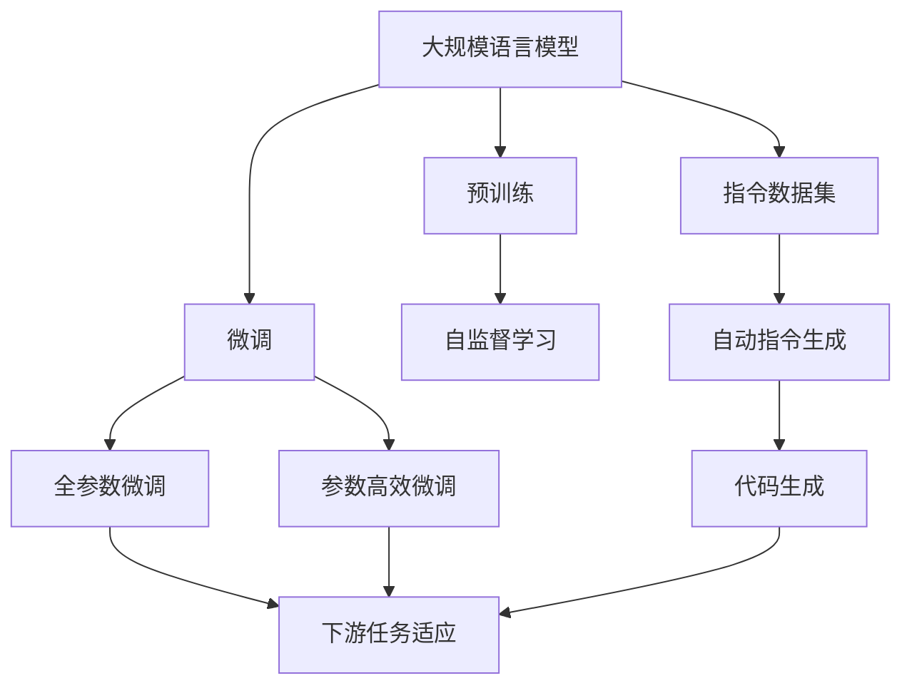
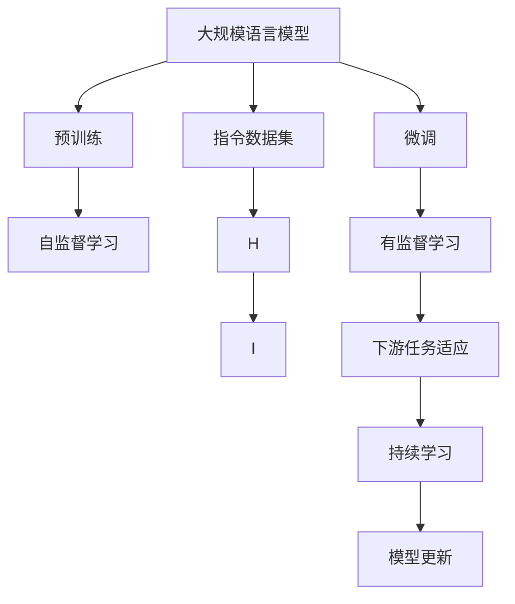
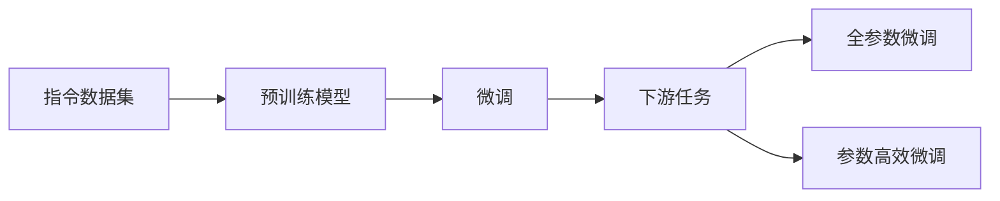
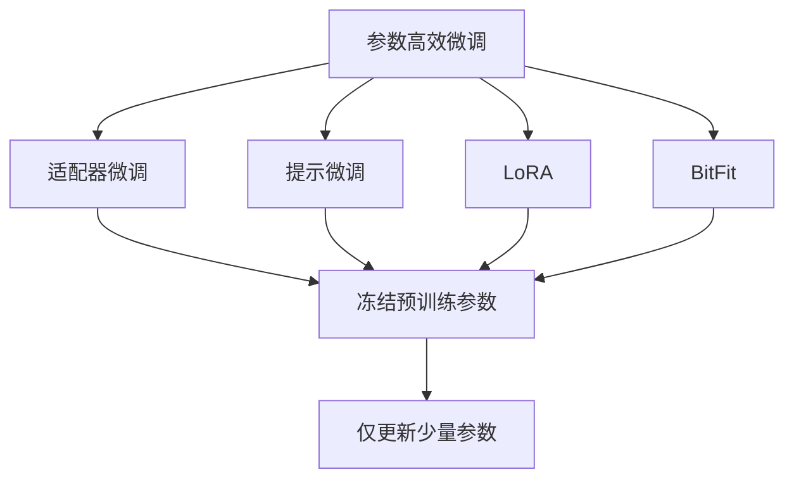
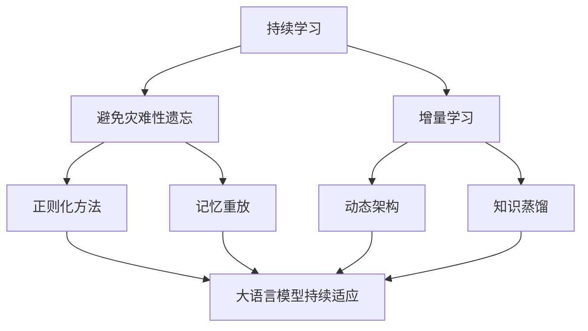
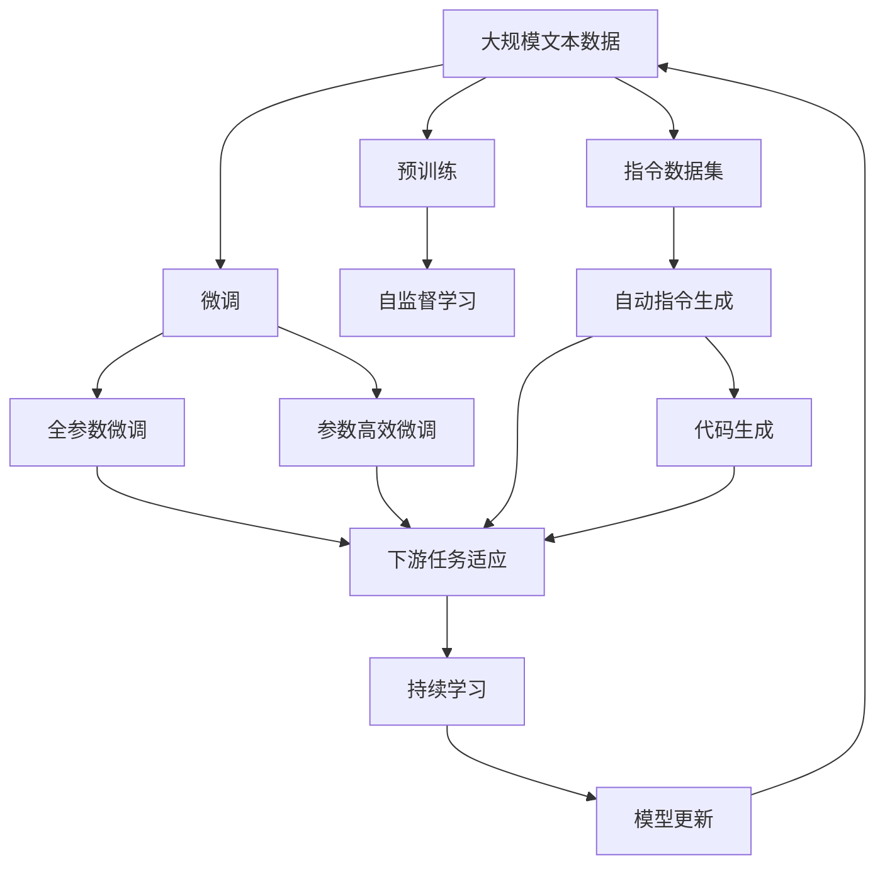

                 

# 大规模语言模型从理论到实践 开源指令数据集

> 关键词：大规模语言模型,指令数据集,自监督学习,自回归,自动指令生成,代码生成,自然语言处理(NLP)

## 1. 背景介绍

### 1.1 问题由来
近年来，深度学习技术在自然语言处理（NLP）领域取得了突破性进展，大规模语言模型（Large Language Models, LLMs）在理解自然语言和生成自然语言的能力上展现了巨大潜力。这些模型通过在大规模无标签文本数据上进行预训练，学习到通用的语言表示和知识，可以应用于各种自然语言任务，如文本分类、命名实体识别、机器翻译、对话系统等。

然而，尽管这些模型具有强大的通用能力，但在特定领域或任务上，模型的表现仍受限于其泛化能力，即模型在预训练数据集中学到的知识是否能够有效地转移到新任务上。这一问题成为大规模语言模型进一步发展的瓶颈，如何在大规模语言模型上实现针对特定任务的微调，提升模型性能，成为研究的热点。

### 1.2 问题核心关键点
1. **指令数据集**：指令数据集是指导模型如何执行特定任务的文本描述，这些指令通常包含具体的任务目标和操作步骤。通过构建和利用指令数据集，可以引导模型在特定领域或任务上获得更好的表现。
2. **自监督学习**：自监督学习是指在没有标注数据的情况下，通过模型自身对数据进行预测，从而学习到知识的方法。大规模语言模型通常通过自监督学习方法进行预训练，如掩码语言模型（Masked Language Modeling, MLM）和语言模型预测任务（Language Modeling, LM）等。
3. **自回归模型**：自回归模型是指模型在生成下一个词或字符时，只依赖前面的上下文信息。例如，GPT-3、GPT-4等模型均采用自回归方式进行语言生成。
4. **自动指令生成**：自动指令生成是指模型能够自动生成执行特定任务的指令，这些指令可以被直接用于引导模型进行任务执行。
5. **代码生成**：代码生成是大规模语言模型在特定领域（如软件工程）的一项重要应用，模型能够自动生成符合编程规范的代码。

### 1.3 问题研究意义
研究大规模语言模型在特定任务上的微调方法，具有重要的理论和实践意义：

1. **降低开发成本**：利用已有的大规模语言模型进行微调，可以显著减少从头开发所需的数据、计算和人力等成本。
2. **提升模型性能**：微调使得通用语言模型更好地适应特定任务，在应用场景中取得更优表现。
3. **加速开发进度**：微调过程比从头开发要快，可以快速部署新的功能和服务。
4. **带来技术创新**：微调范式促进了对预训练-微调的深入研究，催生了自动指令生成、少样本学习等新的研究方向。
5. **赋能产业升级**：微调方法使得NLP技术更容易被各行各业所采用，为传统行业数字化转型升级提供新的技术路径。

## 2. 核心概念与联系

### 2.1 核心概念概述

为了更好地理解大规模语言模型的微调方法，本节将介绍几个关键概念：

1. **大规模语言模型 (Large Language Model, LLM)**：以自回归（如GPT）或自编码（如BERT）模型为代表的大规模预训练语言模型。通过在大规模无标签文本语料上进行预训练，学习到通用的语言表示，具备强大的语言理解和生成能力。
2. **预训练 (Pre-training)**：指在大规模无标签文本语料上，通过自监督学习任务训练通用语言模型的过程。常见的预训练任务包括掩码语言模型（MLM）和语言模型预测任务（LM）等。
3. **微调 (Fine-tuning)**：指在预训练模型的基础上，使用下游任务的少量标注数据，通过有监督学习优化模型在特定任务上的性能。通常只需要调整顶层分类器或解码器，并以较小的学习率更新全部或部分的模型参数。
4. **指令数据集 (Instruction Data Set)**：包含执行各种自然语言任务的详细指令的数据集，用于指导大规模语言模型在特定任务上的执行。
5. **自动指令生成 (Automatic Instruction Generation)**：利用大规模语言模型自动生成特定任务的执行指令，这些指令可以直接用于微调，提高模型在特定任务上的性能。
6. **代码生成 (Code Generation)**：利用大规模语言模型自动生成符合编程规范的代码，适用于软件开发、自动化测试等场景。
7. **自然语言处理 (Natural Language Processing, NLP)**：研究如何使计算机能够理解、处理和生成自然语言，是人工智能领域的一个重要分支。

这些概念之间的逻辑关系可以通过以下Mermaid流程图来展示：



这个流程图展示了大语言模型的核心概念及其之间的关系：

1. 大语言模型通过预训练获得基础能力。
2. 微调是对预训练模型进行任务特定的优化，可以分为全参数微调和参数高效微调（PEFT）。
3. 指令数据集用于指导模型执行特定任务。
4. 自动指令生成和代码生成是微调中常用的技术手段。
5. 微调可以适应各种下游任务，包括分类、匹配、生成等。

### 2.2 概念间的关系

这些核心概念之间存在着紧密的联系，形成了大语言模型微调的完整生态系统。下面我们通过几个Mermaid流程图来展示这些概念之间的关系。

#### 2.2.1 大语言模型的学习范式



这个流程图展示了大语言模型的三种主要学习范式：预训练、微调和指令数据集。预训练主要采用自监督学习方法，而微调则是有监督学习的过程。指令数据集用于指导模型执行特定任务，微调使得通用语言模型更好地适应特定任务，持续学习技术则用于保持模型性能的长期稳定。

#### 2.2.2 指令数据集与微调的关系



这个流程图展示了指令数据集在大规模语言模型微调中的应用。指令数据集指导模型在特定任务上的执行，微调使得模型在特定任务上适应得更好。

#### 2.2.3 参数高效微调方法



这个流程图展示了几种常见的参数高效微调方法，包括适配器微调、提示微调、LoRA和BitFit。这些方法的共同特点是冻结大部分预训练参数，只更新少量参数，从而提高微调效率。

#### 2.2.4 持续学习在大语言模型中的应用



这个流程图展示了持续学习在大语言模型中的应用。持续学习旨在使模型能够不断学习新知识，同时保持已学习的知识，避免灾难性遗忘。

### 2.3 核心概念的整体架构

最后，我们用一个综合的流程图来展示这些核心概念在大语言模型微调过程中的整体架构：



这个综合流程图展示了从预训练到微调，再到持续学习的完整过程。大语言模型首先在大规模文本数据上进行预训练，然后通过微调（包括全参数微调和参数高效微调）或自动指令生成（包括代码生成）来适应下游任务。最后，通过持续学习技术，模型可以不断更新和适应新的任务和数据。 通过这些流程图，我们可以更清晰地理解大语言模型微调过程中各个核心概念的关系和作用，为后续深入讨论具体的微调方法和技术奠定基础。

## 3. 核心算法原理 & 具体操作步骤
### 3.1 算法原理概述

基于指令数据集的大语言模型微调，本质上是一种有监督的细粒度迁移学习过程。其核心思想是：将预训练的大语言模型视作一个强大的"特征提取器"，通过在指令数据集上进行有监督的微调，使得模型输出能够匹配指令描述的执行结果，从而获得针对特定任务优化的模型。

形式化地，假设预训练模型为 $M_{\theta}$，其中 $\theta$ 为预训练得到的模型参数。给定指令数据集 $D=\{(i_s, i_t, x_i)\}_{i=1}^N$，其中 $i_s$ 为指令索引，$i_t$ 为真实任务结果，$x_i$ 为模型输入（文本）。微调的目标是找到新的模型参数 $\hat{\theta}$，使得：

$$
\hat{\theta}=\mathop{\arg\min}_{\theta} \mathcal{L}(M_{\theta},D)
$$

其中 $\mathcal{L}$ 为针对指令数据集的损失函数，用于衡量模型输出与真实任务结果之间的差异。常见的损失函数包括交叉熵损失、均方误差损失等。

通过梯度下降等优化算法，微调过程不断更新模型参数 $\theta$，最小化损失函数 $\mathcal{L}$，使得模型输出逼近真实任务结果。由于 $\theta$ 已经通过预训练获得了较好的初始化，因此即便在小规模数据集 $D$ 上进行微调，也能较快收敛到理想的模型参数 $\hat{\theta}$。

### 3.2 算法步骤详解

基于指令数据集的大语言模型微调一般包括以下几个关键步骤：

**Step 1: 准备指令数据集**
- 收集目标任务的相关指令数据集 $D$，保证数据集的规模和质量。
- 清洗和预处理数据集，移除无关、重复、错误的信息。
- 将数据集划分为训练集、验证集和测试集，确保模型在各集上的表现。

**Step 2: 添加任务适配层**
- 根据任务类型，在预训练模型顶层设计合适的输出层和损失函数。
- 对于分类任务，通常在顶层添加线性分类器和交叉熵损失函数。
- 对于生成任务，通常使用语言模型的解码器输出概率分布，并以负对数似然为损失函数。

**Step 3: 设置微调超参数**
- 选择合适的优化算法及其参数，如 AdamW、SGD 等，设置学习率、批大小、迭代轮数等。
- 设置正则化技术及强度，包括权重衰减、Dropout、Early Stopping 等。
- 确定冻结预训练参数的策略，如仅微调顶层，或全部参数都参与微调。

**Step 4: 执行梯度训练**
- 将训练集数据分批次输入模型，前向传播计算损失函数。
- 反向传播计算参数梯度，根据设定的优化算法和学习率更新模型参数。
- 周期性在验证集上评估模型性能，根据性能指标决定是否触发 Early Stopping。
- 重复上述步骤直到满足预设的迭代轮数或 Early Stopping 条件。

**Step 5: 测试和部署**
- 在测试集上评估微调后模型 $M_{\hat{\theta}}$ 的性能，对比微调前后的精度提升。
- 使用微调后的模型对新指令进行推理预测，集成到实际的应用系统中。
- 持续收集新的指令数据，定期重新微调模型，以适应数据分布的变化。

以上是基于指令数据集的大语言模型微调的一般流程。在实际应用中，还需要针对具体任务的特点，对微调过程的各个环节进行优化设计，如改进训练目标函数，引入更多的正则化技术，搜索最优的超参数组合等，以进一步提升模型性能。

### 3.3 算法优缺点

基于指令数据集的大语言模型微调方法具有以下优点：

1. **简单高效**：指令数据集可以包含详细的任务描述和执行步骤，使得模型在微调过程中可以更好地理解任务目标和输入输出格式。
2. **通用适用**：指令数据集通常适用于各种NLP任务，包括分类、匹配、生成等，设计简单的任务适配层即可实现微调。
3. **参数高效**：利用参数高效微调技术，在固定大部分预训练参数的情况下，仍可取得不错的提升。
4. **效果显著**：在学术界和工业界的诸多任务上，基于指令数据集的微调方法已经刷新了最先进的性能指标。

同时，该方法也存在一定的局限性：

1. **依赖指令数据集**：微调的效果很大程度上取决于指令数据集的质量和数量，获取高质量指令数据的成本较高。
2. **迁移能力有限**：当指令数据集与预训练数据的分布差异较大时，微调的性能提升有限。
3. **负面效果传递**：预训练模型的固有偏见、有害信息等，可能通过微调传递到下游任务，造成负面影响。
4. **可解释性不足**：微调模型的决策过程通常缺乏可解释性，难以对其推理逻辑进行分析和调试。

尽管存在这些局限性，但就目前而言，基于指令数据集的微调方法仍是大语言模型应用的主流范式。未来相关研究的重点在于如何进一步降低微调对指令数据集的依赖，提高模型的少样本学习和跨领域迁移能力，同时兼顾可解释性和伦理安全性等因素。

### 3.4 算法应用领域

基于指令数据集的大语言模型微调方法在NLP领域已经得到了广泛的应用，覆盖了几乎所有常见任务，例如：

- **文本分类**：如情感分析、主题分类、意图识别等。通过指令数据集，模型可以学习文本-分类标签的映射。
- **命名实体识别**：识别文本中的人名、地名、机构名等特定实体。通过指令数据集，模型可以学习实体边界和类型。
- **关系抽取**：从文本中抽取实体之间的语义关系。通过指令数据集，模型可以学习实体-关系三元组。
- **问答系统**：对自然语言问题给出答案。通过指令数据集，模型可以学习问题-答案对的映射。
- **机器翻译**：将源语言文本翻译成目标语言。通过指令数据集，模型可以学习语言-语言映射。
- **文本摘要**：将长文本压缩成简短摘要。通过指令数据集，模型可以学习摘要生成。
- **对话系统**：使机器能够与人自然对话。通过指令数据集，模型可以学习对话历史与回复生成。

除了上述这些经典任务外，基于指令数据集的大语言模型微调也被创新性地应用到更多场景中，如可控文本生成、常识推理、代码生成、数据增强等，为NLP技术带来了全新的突破。随着预训练模型和微调方法的不断进步，相信NLP技术将在更广阔的应用领域大放异彩。

## 4. 数学模型和公式 & 详细讲解 & 举例说明
### 4.1 数学模型构建

本节将使用数学语言对基于指令数据集的大语言模型微调过程进行更加严格的刻画。

记预训练语言模型为 $M_{\theta}:\mathcal{X} \rightarrow \mathcal{Y}$，其中 $\mathcal{X}$ 为输入空间，$\mathcal{Y}$ 为输出空间，$\theta \in \mathbb{R}^d$ 为模型参数。假设微调任务的指令数据集为 $D=\{(i_s, i_t, x_i)\}_{i=1}^N$，其中 $i_s$ 为指令索引，$i_t$ 为真实任务结果，$x_i$ 为模型输入（文本）。

定义模型 $M_{\theta}$ 在指令数据集 $D$ 上的损失函数为：

$$
\mathcal{L}(\theta) = \frac{1}{N}\sum_{i=1}^N \ell(M_{\theta}(x_i), y_i)
$$

其中 $\ell$ 为针对指令数据集的损失函数，用于衡量模型输出与真实任务结果之间的差异。常见的损失函数包括交叉熵损失、均方误差损失等。

微调的优化目标是最小化损失函数，即找到最优参数：

$$
\theta^* = \mathop{\arg\min}_{\theta} \mathcal{L}(\theta)
$$

在实践中，我们通常使用基于梯度的优化算法（如SGD、Adam等）来近似求解上述最优化问题。设 $\eta$ 为学习率，$\lambda$ 为正则化系数，则参数的更新公式为：

$$
\theta \leftarrow \theta - \eta \nabla_{\theta}\mathcal{L}(\theta) - \eta\lambda\theta
$$

其中 $\nabla_{\theta}\mathcal{L}(\theta)$ 为损失函数对参数 $\theta$ 的梯度，可通过反向传播算法高效计算。

### 4.2 公式推导过程

以下我们以二分类任务为例，推导交叉熵损失函数及其梯度的计算公式。

假设模型 $M_{\theta}$ 在输入 $x$ 上的输出为 $\hat{y}=M_{\theta}(x) \in [0,1]$，表示样本属于正类的概率。真实标签 $y \in \{0,1\}$。则二分类交叉熵损失函数定义为：

$$
\ell(M_{\theta}(x),y) = -[y\log \hat{y} + (1-y)\log (1-\hat{y})]
$$

将其代入经验风险公式，得：

$$
\mathcal{L}(\theta) = -\frac{1}{N}\sum_{i=1}^N [y_i\log M_{\theta}(x_i)+(1-y_i)\log(1-M_{\theta}(x_i))]
$$

根据链式法则，损失函数对参数 $\theta_k$ 的梯度为：

$$
\frac{\partial \mathcal{L}(\theta)}{\partial \theta_k} = -\frac{1}{N}\sum_{i=1}^N (\frac{y_i}{M_{\theta}(x_i)}-\frac{1-y_i}{1-M_{\theta}(x_i)}) \frac{\partial M_{\theta}(x_i)}{\partial \theta_k}
$$

其中 $\frac{\partial M_{\theta}(x_i)}{\partial \theta_k}$ 可进一步递归展开，利用自动微分技术完成计算。

在得到损失函数的梯度后，即可带入参数更新公式，完成模型的迭代优化。重复上述过程直至收敛，最终得到适应指令数据集的最优模型参数 $\theta^*$。

## 5. 项目实践：代码实例和详细解释说明
### 5.1 开发环境搭建

在进行微调实践前，我们需要准备好开发环境。以下是使用Python进行PyTorch开发的环境配置流程：

1. 安装Anaconda：从官网下载并安装Anaconda，用于创建独立的Python环境。

2. 创建并激活虚拟环境：
```bash
conda create -n pytorch-env python=3.8 
conda activate pytorch-env
```

3. 安装PyTorch：根据CUDA版本，从官网获取对应的安装命令。例如：
```bash
conda install pytorch torchvision torchaudio cudatoolkit=11.1 -c pytorch -c conda-forge
```

4. 安装Transformers库：
```bash
pip install transformers
```

5. 安装各类工具包：
```bash
pip install numpy pandas scikit-learn matplotlib tqdm jupyter notebook ipython
```

完成上述步骤后，即可在`pytorch-env`环境中开始微调实践。

### 5.2 源代码详细实现

这里我们以命名实体识别(NER)任务为例，给出使用Transformers库对BERT模型进行微调的PyTorch代码实现。

首先，定义NER任务的数据处理函数：

```python
from transformers import BertTokenizer
from torch.utils.data import Dataset
import torch

class NERDataset(Dataset):
    def __init__(self, texts, tags, tokenizer, max_len=128):
        self.texts = texts
        self.tags = tags
        self.tokenizer = tokenizer
        self.max_len = max_len
        
    def __len__(self):
        return len(self.texts)
    
    def __getitem__(self, item):
        text = self.texts[item]
        tags = self.tags[item]
        
        encoding = self.tokenizer(text, return_tensors='pt', max_length=self.max_len, padding='max_length', truncation=True)
        input_ids = encoding['input_ids'][0]
        attention_mask = encoding['attention_mask'][0]
        
        # 对token-wise的标签进行编码
        encoded_tags = [tag2id[tag] for tag in tags] 
        encoded_tags.extend([tag2id['O']] * (self.max_len - len(encoded_tags)))
        labels = torch.tensor(encoded_tags, dtype=torch.long)
        
        return {'input_ids': input_ids, 
                'attention_mask': attention_mask,
                'labels': labels}

# 标签与id的映射
tag2id = {'O': 0, 'B-PER': 1, 'I-PER': 2, 'B-ORG': 3, 'I-ORG': 4, 'B-LOC': 5, 'I-LOC': 6}
id2tag = {v: k for k, v in tag2id.items()}

# 创建dataset
tokenizer = BertTokenizer.from_pretrained('bert-base-cased')

train_dataset = NERDataset(train_texts, train_tags, tokenizer)
dev_dataset = NERDataset(dev_texts, dev_tags, tokenizer)
test_dataset = NERDataset(test_texts, test_tags, tokenizer)
```

然后，定义模型和优化器：

```python
from transformers import BertForTokenClassification, AdamW

model = BertForTokenClassification.from_pretrained('bert-base-cased', num_labels=len(tag2id))

optimizer = AdamW(model.parameters(), lr=2e-5)
```

接着，定义训练和评估函数：

```python
from torch.utils.data import DataLoader
from tqdm import tqdm
from sklearn.metrics import classification_report

device = torch.device('cuda') if torch.cuda.is_available() else torch.device('cpu')
model.to(device)

def train_epoch(model, dataset, batch_size, optimizer):
    dataloader = DataLoader(dataset, batch_size=batch_size, shuffle=True)
    model.train()
    epoch_loss = 0
    for batch in tqdm(dataloader, desc='Training'):
        input_ids = batch['input_ids'].to(device)
        attention_mask = batch['attention_mask'].to(device)
        labels = batch['labels'].to(device)
        model.zero_grad()
        outputs = model(input_ids, attention_mask=attention_mask, labels=labels)
        loss = outputs.loss
        epoch_loss += loss.item()
        loss.backward()
        optimizer.step()
    return epoch_loss / len(dataloader)

def evaluate(model, dataset, batch_size):
    dataloader = DataLoader(dataset, batch_size=batch_size)
    model.eval()
    preds, labels = [], []
    with torch.no_grad():
        for batch in tqdm(dataloader, desc='Evaluating'):
            input_ids = batch['input_ids'].to(device)
            attention_mask = batch['attention_mask'].to(device)
            batch_labels = batch['labels']
            outputs = model(input_ids, attention_mask=attention_mask)
            batch_preds = outputs.logits.argmax(dim=2).to('cpu').tolist()
            batch_labels = batch_labels.to('cpu').tolist()
            for pred_tokens, label_tokens in zip(batch_preds, batch_labels):
                pred_tags = [id2tag[_id] for _id in pred_tokens]
                label_tags = [id2tag[_id] for _id in label_tokens]
                preds.append(pred_tags[:len(label_tokens)])
                labels.append(label_tags)
                
    print(classification_report(labels, preds))
```

最后，启动训练流程并在测试集上评估：

```python
epochs = 5
batch_size = 16

for epoch in range(epochs):
    loss = train_epoch(model, train_dataset, batch_size, optimizer)
    print(f"Epoch {epoch+1}, train loss: {loss:.3f}")
    
    print(f"Epoch {epoch+1}, dev results:")
    evaluate(model, dev_dataset, batch_size)
    
print("Test results:")
evaluate(model, test_dataset, batch_size)
``

