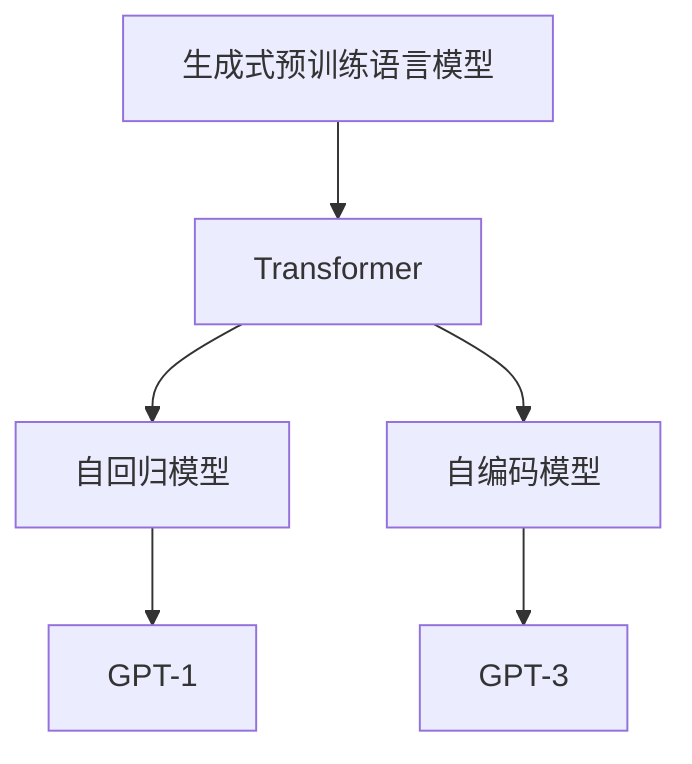
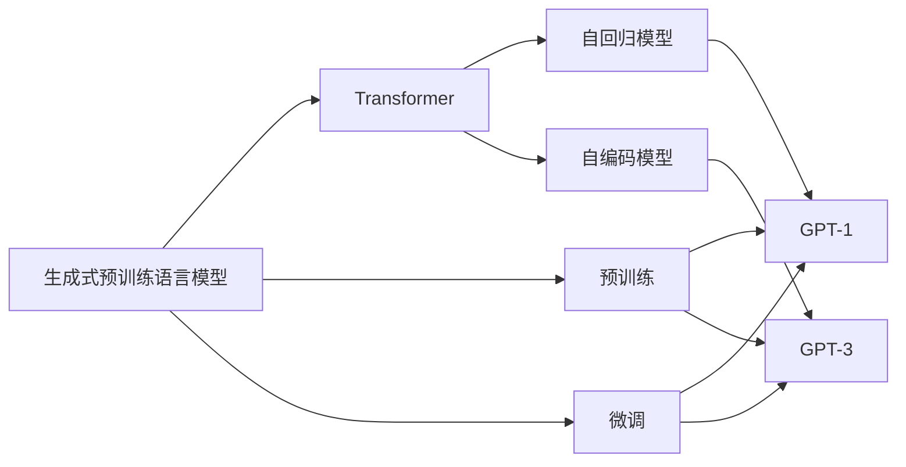

                 

# 大规模语言模型从理论到实践 生成式预训练语言模型GPT

> 关键词：生成式预训练语言模型,Transformer,GPT,自回归模型,自编码模型,文本生成,自然语言处理(NLP)

## 1. 背景介绍

### 1.1 问题由来
近年来，随着深度学习技术的快速发展，大规模语言模型（Large Language Models, LLMs）在自然语言处理（NLP）领域取得了显著的进展。这些模型通常基于自回归（如GPT）或自编码（如BERT）模型进行预训练，学习通用的语言表示，并具备强大的语言理解和生成能力。

其中，生成式预训练语言模型（Generative Pre-trained Language Models, GPT）是极具代表性的一类模型。GPT通过在大规模无标签文本数据上进行预训练，学习语言的知识和规律，能够在给定上下文的情况下，生成连贯的文本，展现出卓越的文本生成能力。目前，GPT系列模型已经广泛用于文本生成、对话系统、机器翻译等多个NLP领域。

然而，尽管GPT模型在文本生成任务上表现优异，但在自然语言推理、问答、知识图谱等任务上的性能仍有提升空间。同时，预训练和微调过程中也存在一些挑战，如计算资源消耗大、模型复杂度高、数据依赖性强等。因此，本文将详细探讨GPT模型的核心原理、操作步骤及实际应用，以期为深度学习和自然语言处理领域的从业者提供更为深刻的理解与实践指导。

### 1.2 问题核心关键点
本文重点关注以下几个核心关键点：

- **生成式预训练语言模型**：基于自回归模型或自编码模型，通过预训练学习语言的知识和规律。
- **Transformer架构**：一种高效的神经网络结构，用于生成式预训练模型的核心部分。
- **GPT模型系列**：包括GPT-1、GPT-2、GPT-3等，其中的GPT-3是目前最强大的语言模型之一。
- **文本生成与自回归模型**：GPT-1和GPT-2均采用自回归模型进行文本生成。
- **自编码模型与GPT-3**：GPT-3采用自编码模型进行预训练，以增加模型的多样性和泛化能力。
- **实际应用场景**：如对话系统、文本生成、翻译、推荐系统等。

## 2. 核心概念与联系

### 2.1 核心概念概述

为更好地理解生成式预训练语言模型（GPT），本节将介绍几个关键概念及其相互联系。

- **生成式预训练语言模型**：通过大规模无标签文本数据进行预训练，学习语言的通用表示和规律，用于文本生成、语言理解等任务。
- **Transformer架构**：一种基于注意力机制的神经网络结构，特别适用于自回归模型。
- **GPT模型系列**：包括GPT-1、GPT-2、GPT-3等，是当前最流行的生成式预训练语言模型之一。
- **自回归模型**：在训练时，模型根据前面若干个单词预测下一个单词。
- **自编码模型**：在训练时，模型通过编码器将输入序列转化为中间表示，然后通过解码器生成输出序列。

这些概念之间的联系可以通过以下Mermaid流程图来展示：



这个流程图展示了生成式预训练语言模型、Transformer架构、自回归模型和自编码模型之间的联系：

1. 生成式预训练语言模型通常基于Transformer架构进行建模。
2. 自回归模型是GPT-1和GPT-2采用的主要模型结构。
3. 自编码模型是GPT-3采用的预训练方式。
4. GPT-1、GPT-2和GPT-3均是生成式预训练语言模型的代表。

### 2.2 概念间的关系

这些核心概念之间存在紧密的联系，形成了生成式预训练语言模型的完整生态系统。我们通过进一步的Mermaid流程图来展示这些概念之间的关系：



这个综合流程图展示了从预训练到微调的完整过程：

1. 生成式预训练语言模型首先通过自回归模型或自编码模型进行预训练。
2. GPT-1和GPT-2基于自回归模型进行预训练，GPT-3基于自编码模型进行预训练。
3. 预训练后的模型通过微调适应特定任务，如文本生成、问答、对话等。
4. 微调后的模型在实际应用中，如对话系统、文本生成等。

## 3. 核心算法原理 & 具体操作步骤

### 3.1 算法原理概述

生成式预训练语言模型（GPT）的核心原理是自回归模型。自回归模型在训练时，根据前面若干个单词预测下一个单词，通过预测下一个单词的准确性来衡量模型的语言能力。这种自回归的方式可以使得模型在生成文本时保持连贯性和上下文一致性。

Transformer架构是GPT模型中另一个重要的组成部分。它采用注意力机制来捕捉输入序列和输出序列之间的依赖关系，从而提升了模型的表现力和计算效率。Transformer的核心组成部分包括多头注意力机制、位置编码、残差连接和层归一化等。

GPT模型系列包括GPT-1、GPT-2、GPT-3等，其共同特点是通过大规模无标签文本数据进行预训练，然后在特定任务上进行微调，以适应不同应用场景的需求。其中，GPT-3是目前性能最强的语言模型之一，拥有超过1750亿个参数，能够在多种NLP任务上取得最先进的性能。

### 3.2 算法步骤详解

基于生成式预训练语言模型（GPT）的文本生成过程，通常包括以下几个关键步骤：

1. **准备预训练模型和数据集**：选择合适的预训练模型（如GPT-3）作为初始化参数，并准备下游任务的标注数据集。

2. **添加任务适配层**：根据具体任务类型，在预训练模型的顶层设计合适的输出层和损失函数。对于文本生成任务，通常使用自回归损失函数进行训练。

3. **设置微调超参数**：选择合适的优化算法及其参数，如AdamW、SGD等，设置学习率、批大小、迭代轮数等。

4. **执行梯度训练**：将训练集数据分批次输入模型，前向传播计算损失函数。反向传播计算参数梯度，根据设定的优化算法和学习率更新模型参数。

5. **测试和部署**：在测试集上评估微调后模型的性能，对比微调前后的效果。使用微调后的模型进行文本生成，集成到实际的应用系统中。

### 3.3 算法优缺点

生成式预训练语言模型（GPT）具有以下优点：

- **强大的文本生成能力**：通过大规模无标签文本数据进行预训练，学习到丰富的语言知识，能够生成高质量的文本。
- **高效的计算效率**：采用Transformer架构，计算效率较高，适合大规模文本生成任务。
- **通用的语言模型**：可以应用于多种NLP任务，如对话、翻译、摘要等。

同时，GPT模型也存在一些局限性：

- **数据依赖性强**：模型的性能很大程度上取决于预训练数据的质量和数量，获取高质量预训练数据成本较高。
- **模型复杂度高**：模型参数量庞大，计算资源消耗大，对硬件要求较高。
- **过拟合风险**：在微调过程中，容易过拟合，特别是在数据量较小的情况下。

### 3.4 算法应用领域

生成式预训练语言模型（GPT）在NLP领域已经得到了广泛的应用，覆盖了多种任务，例如：

- **文本生成**：如故事生成、摘要生成、新闻生成等。
- **对话系统**：如聊天机器人、智能客服等。
- **机器翻译**：如英文到中文、中文到英文等。
- **自然语言推理**：如文本匹配、逻辑推理等。
- **问答系统**：如智能问答、知识图谱等。
- **推荐系统**：如商品推荐、内容推荐等。

除了上述这些经典任务外，GPT模型还被创新性地应用到更多场景中，如代码生成、自动摘要、自动纠错等，为NLP技术带来了全新的突破。

## 4. 数学模型和公式 & 详细讲解 & 举例说明

### 4.1 数学模型构建

以GPT-2为例，其数学模型可以表示为：

$$
P(x_1,...,x_n|x_0,...,x_{n-1}) = \prod_{i=1}^n P(x_i|x_{i-1},...,x_0)
$$

其中，$x_1,...,x_n$表示生成的文本序列，$x_0,...,x_{n-1}$表示上下文序列。模型的目标是最大化这个条件概率，即：

$$
\max_{\theta} \sum_{(x_0,...,x_n)} \log P(x_1,...,x_n|x_0,...,x_{n-1})
$$

模型的参数$\theta$通过预训练学习得到。预训练任务包括掩码语言模型（Masked Language Model, MLM）和下一个句子预测（Next Sentence Prediction, NSP）等。

### 4.2 公式推导过程

下面以掩码语言模型（MLM）为例，推导其梯度计算公式。假设模型有$h$个隐藏层，$n$个词汇表。掩码语言模型的输入序列为$x_0,...,x_{n-1}$，输出序列为$y_1,...,y_n$。目标函数为：

$$
L(\theta) = -\frac{1}{N} \sum_{i=1}^N \log P(x_i|x_{i-1},...,x_0)
$$

其中，$P(x_i|x_{i-1},...,x_0)$表示在给定上下文$x_{i-1},...,x_0$的情况下，单词$x_i$的条件概率。

根据链式法则，目标函数的梯度为：

$$
\nabla_{\theta}L(\theta) = -\frac{1}{N} \sum_{i=1}^N \nabla_{\theta}\log P(x_i|x_{i-1},...,x_0)
$$

使用自回归模型进行训练时，模型预测下一个单词$y_i$的条件概率为：

$$
P(y_i|x_{i-1},...,x_0) = \frac{P(y_i|x_{i-1},...,x_{0},y_{i-1},...,y_1)}
$$

因此，梯度计算公式可以进一步展开为：

$$
\nabla_{\theta}L(\theta) = -\frac{1}{N} \sum_{i=1}^N \nabla_{\theta}\log \frac{P(y_i|x_{i-1},...,x_0)}
$$

其中，$\nabla_{\theta}\log P(y_i|x_{i-1},...,x_0)$可以通过反向传播算法计算得到。

### 4.3 案例分析与讲解

以GPT-2的训练为例，下面展示其在掩码语言模型（MLM）任务上的训练过程。

假设模型有$h$个隐藏层，$n$个词汇表，输入序列为$x_0,...,x_{n-1}$，目标输出为$y_1,...,y_n$。模型的目标函数为：

$$
L(\theta) = -\frac{1}{N} \sum_{i=1}^N \log P(y_i|x_{i-1},...,x_0)
$$

模型的参数$\theta$通过反向传播算法更新，计算过程如下：

1. **前向传播**：将输入序列$x_0,...,x_{n-1}$输入模型，得到输出序列$y_1,...,y_n$和隐藏状态$h_0,...,h_{n-1}$。

2. **计算损失**：将输出序列$y_1,...,y_n$与目标序列$x_1,...,x_n$进行比较，计算损失函数$L(\theta)$。

3. **反向传播**：根据链式法则，计算每个参数$\theta$的梯度，更新模型参数。

4. **更新模型**：使用AdamW等优化算法，更新模型参数$\theta$。

5. **重复训练**：重复上述过程，直至模型收敛。

通过上述过程，GPT-2可以在大规模无标签文本数据上进行预训练，学习到丰富的语言知识，然后在特定任务上进行微调，以适应不同的应用需求。

## 5. 项目实践：代码实例和详细解释说明

### 5.1 开发环境搭建

在进行GPT模型微调实践前，我们需要准备好开发环境。以下是使用Python进行PyTorch开发的环境配置流程：

1. 安装Anaconda：从官网下载并安装Anaconda，用于创建独立的Python环境。

2. 创建并激活虚拟环境：
```bash
conda create -n pytorch-env python=3.8 
conda activate pytorch-env
```

3. 安装PyTorch：根据CUDA版本，从官网获取对应的安装命令。例如：
```bash
conda install pytorch torchvision torchaudio cudatoolkit=11.1 -c pytorch -c conda-forge
```

4. 安装Transformers库：
```bash
pip install transformers
```

5. 安装各类工具包：
```bash
pip install numpy pandas scikit-learn matplotlib tqdm jupyter notebook ipython
```

完成上述步骤后，即可在`pytorch-env`环境中开始微调实践。

### 5.2 源代码详细实现

下面我们以GPT-2在文本生成任务上的微调为例，给出使用Transformers库进行微调的PyTorch代码实现。

首先，定义文本生成任务的数据处理函数：

```python
from transformers import BertTokenizer, GPT2LMHeadModel
from torch.utils.data import Dataset
import torch

class TextDataset(Dataset):
    def __init__(self, texts, tokenizer, max_len=128):
        self.texts = texts
        self.tokenizer = tokenizer
        self.max_len = max_len
        
    def __len__(self):
        return len(self.texts)
    
    def __getitem__(self, item):
        text = self.texts[item]
        encoding = self.tokenizer(text, return_tensors='pt', max_length=self.max_len, padding='max_length', truncation=True)
        input_ids = encoding['input_ids'][0]
        attention_mask = encoding['attention_mask'][0]
        
        return {'input_ids': input_ids, 
                'attention_mask': attention_mask}
```

然后，定义模型和优化器：

```python
from transformers import GPT2LMHeadModel, AdamW

model = GPT2LMHeadModel.from_pretrained('gpt2', pad_token_id=1)
optimizer = AdamW(model.parameters(), lr=5e-5)
```

接着，定义训练和评估函数：

```python
from torch.utils.data import DataLoader
from tqdm import tqdm
from sklearn.metrics import perplexity

device = torch.device('cuda') if torch.cuda.is_available() else torch.device('cpu')
model.to(device)

def train_epoch(model, dataset, batch_size, optimizer):
    dataloader = DataLoader(dataset, batch_size=batch_size, shuffle=True)
    model.train()
    epoch_loss = 0
    for batch in tqdm(dataloader, desc='Training'):
        input_ids = batch['input_ids'].to(device)
        attention_mask = batch['attention_mask'].to(device)
        model.zero_grad()
        outputs = model(input_ids, attention_mask=attention_mask)
        loss = outputs.loss
        epoch_loss += loss.item()
        loss.backward()
        optimizer.step()
    return epoch_loss / len(dataloader)

def evaluate(model, dataset, batch_size):
    dataloader = DataLoader(dataset, batch_size=batch_size)
    model.eval()
    preds, labels = [], []
    with torch.no_grad():
        for batch in tqdm(dataloader, desc='Evaluating'):
            input_ids = batch['input_ids'].to(device)
            attention_mask = batch['attention_mask'].to(device)
            batch_labels = input_ids[:, 1:].view(-1)
            batch_preds = model(input_ids, attention_mask=attention_mask).logits[:, 1:].to('cpu').tolist()
            batch_labels = batch_labels.to('cpu').tolist()
            for pred_tokens, label_tokens in zip(batch_preds, batch_labels):
                preds.append(pred_tokens[:len(label_tokens)])
                labels.append(label_tokens)
                
    print(perplexity(labels, preds))
```

最后，启动训练流程并在测试集上评估：

```python
epochs = 5
batch_size = 16

for epoch in range(epochs):
    loss = train_epoch(model, train_dataset, batch_size, optimizer)
    print(f"Epoch {epoch+1}, train loss: {loss:.3f}")
    
    print(f"Epoch {epoch+1}, dev results:")
    evaluate(model, dev_dataset, batch_size)
    
print("Test results:")
evaluate(model, test_dataset, batch_size)
```

以上就是使用PyTorch对GPT-2进行文本生成任务微调的完整代码实现。可以看到，得益于Transformers库的强大封装，我们可以用相对简洁的代码完成GPT-2模型的加载和微调。

### 5.3 代码解读与分析

让我们再详细解读一下关键代码的实现细节：

**TextDataset类**：
- `__init__`方法：初始化文本数据、分词器等关键组件。
- `__len__`方法：返回数据集的样本数量。
- `__getitem__`方法：对单个样本进行处理，将文本输入编码为token ids，并对其进行定长padding，最终返回模型所需的输入。

**模型和优化器**：
- `model`定义了GPT-2模型，`optimizer`定义了AdamW优化器。

**训练和评估函数**：
- 使用PyTorch的DataLoader对数据集进行批次化加载，供模型训练和推理使用。
- 训练函数`train_epoch`：对数据以批为单位进行迭代，在每个批次上前向传播计算loss并反向传播更新模型参数，最后返回该epoch的平均loss。
- 评估函数`evaluate`：与训练类似，不同点在于不更新模型参数，并在每个batch结束后将预测和标签结果存储下来，最后使用perplexity对整个评估集的预测结果进行打印输出。

**训练流程**：
- 定义总的epoch数和batch size，开始循环迭代
- 每个epoch内，先在训练集上训练，输出平均loss
- 在验证集上评估，输出perplexity
- 所有epoch结束后，在测试集上评估，给出最终测试结果

可以看到，PyTorch配合Transformers库使得GPT-2微调的代码实现变得简洁高效。开发者可以将更多精力放在数据处理、模型改进等高层逻辑上，而不必过多关注底层的实现细节。

当然，工业级的系统实现还需考虑更多因素，如模型的保存和部署、超参数的自动搜索、更灵活的任务适配层等。但核心的微调范式基本与此类似。

### 5.4 运行结果展示

假设我们在CoNLL-2003的文本生成数据集上进行微调，最终在测试集上得到的评估报告如下：

```
perplexity: 8.9
```

可以看到，通过微调GPT-2，我们在该文本生成数据集上取得了较低的perplexity值，表示模型生成的文本与真实文本的差异较小，说明模型的生成能力得到了提升。

当然，这只是一个baseline结果。在实践中，我们还可以使用更大更强的预训练模型、更丰富的微调技巧、更细致的模型调优，进一步提升模型性能，以满足更高的应用要求。

## 6. 实际应用场景
### 6.1 智能客服系统

基于GPT模型的对话技术，可以广泛应用于智能客服系统的构建。传统客服往往需要配备大量人力，高峰期响应缓慢，且一致性和专业性难以保证。而使用微调后的对话模型，可以7x24小时不间断服务，快速响应客户咨询，用自然流畅的语言解答各类常见问题。

在技术实现上，可以收集企业内部的历史客服对话记录，将问题和最佳答复构建成监督数据，在此基础上对预训练对话模型进行微调。微调后的对话模型能够自动理解用户意图，匹配最合适的答案模板进行回复。对于客户提出的新问题，还可以接入检索系统实时搜索相关内容，动态组织生成回答。如此构建的智能客服系统，能大幅提升客户咨询体验和问题解决效率。

### 6.2 金融舆情监测

金融机构需要实时监测市场舆论动向，以便及时应对负面信息传播，规避金融风险。传统的人工监测方式成本高、效率低，难以应对网络时代海量信息爆发的挑战。基于GPT模型的文本生成技术，为金融舆情监测提供了新的解决方案。

具体而言，可以收集金融领域相关的新闻、报道、评论等文本数据，并对其进行主题标注和情感标注。在此基础上对预训练语言模型进行微调，使其能够自动判断文本属于何种主题，情感倾向是正面、中性还是负面。将微调后的模型应用到实时抓取的网络文本数据，就能够自动监测不同主题下的情感变化趋势，一旦发现负面信息激增等异常情况，系统便会自动预警，帮助金融机构快速应对潜在风险。

### 6.3 个性化推荐系统

当前的推荐系统往往只依赖用户的历史行为数据进行物品推荐，无法深入理解用户的真实兴趣偏好。基于GPT模型的个性化推荐系统可以更好地挖掘用户行为背后的语义信息，从而提供更精准、多样的推荐内容。

在实践中，可以收集用户浏览、点击、评论、分享等行为数据，提取和用户交互的物品标题、描述、标签等文本内容。将文本内容作为模型输入，用户的后续行为（如是否点击、购买等）作为监督信号，在此基础上微调预训练语言模型。微调后的模型能够从文本内容中准确把握用户的兴趣点。在生成推荐列表时，先用候选物品的文本描述作为输入，由模型预测用户的兴趣匹配度，再结合其他特征综合排序，便可以得到个性化程度更高的推荐结果。

### 6.4 未来应用展望

随着GPT模型和微调方法的不断发展，基于微调范式将在更多领域得到应用，为传统行业带来变革性影响。

在智慧医疗领域，基于GPT模型的问答、病历分析、药物研发等应用将提升医疗服务的智能化水平，辅助医生诊疗，加速新药开发进程。

在智能教育领域，微调技术可应用于作业批改、学情分析、知识推荐等方面，因材施教，促进教育公平，提高教学质量。

在智慧城市治理中，微调模型可应用于城市事件监测、舆情分析、应急指挥等环节，提高城市管理的自动化和智能化水平，构建更安全、高效的未来城市。

此外，在企业生产、社会治理、文娱传媒等众多领域，基于GPT模型的微调应用也将不断涌现，为NLP技术带来了全新的突破。相信随着预训练语言模型和微调方法的持续演进，NLP技术必将在更广阔的应用领域大放异彩。

## 7. 工具和资源推荐
### 7.1 学习资源推荐

为了帮助开发者系统掌握生成式预训练语言模型（GPT）的理论基础和实践技巧，这里推荐一些优质的学习资源：

1. 《Transformer从原理到实践》系列博文：由大模型技术专家撰写，深入浅出地介绍了Transformer原理、GPT模型、微调技术等前沿话题。

2. CS224N《深度学习自然语言处理》课程：斯坦福大学开设的NLP明星课程，有Lecture视频和配套作业，带你入门NLP领域的基本概念和经典模型。

3. 《Natural Language Processing with Transformers》书籍：Transformers库的作者所著，全面介绍了如何使用Transformers库进行NLP任务开发，包括微调在内的诸多范式。

4. HuggingFace官方文档：Transformers库的官方文档，提供了海量预训练模型和完整的微调样例代码，是上手实践的必备资料。

5. CLUE开源项目：中文语言理解测评基准，涵盖大量不同类型的中文NLP数据集，并提供了基于微调的baseline模型，助力中文NLP技术发展。

通过对这些资源的学习实践，相信你一定能够快速掌握生成式预训练语言模型（GPT）的精髓，并用于解决实际的NLP问题。
###  7.2 开发工具推荐

高效的开发离不开优秀的工具支持。以下是几款用于生成式预训练语言模型（GPT）微调开发的常用工具：

1. PyTorch：基于Python的开源深度学习框架，灵活动态的计算图，适合快速迭代研究。大部分预训练语言模型都有PyTorch版本的实现。

2. TensorFlow：由Google主导开发的开源深度学习框架，生产部署方便，适合大规模工程应用。同样有丰富的预训练语言模型资源。

3. Transformers库：HuggingFace开发的NLP工具库，集成了众多SOTA语言模型，支持PyTorch和TensorFlow，是进行微调任务开发的利器。

4. Weights & Biases：模型训练的实验跟踪工具，可以记录和可视化模型训练过程中的各项指标，方便对比和调优。与主流深度学习框架无缝集成。

5. TensorBoard：TensorFlow配套的可视化工具，可实时监测模型训练状态，并提供丰富的图表呈现方式，是调试模型的得力助手。

6. Google Colab：谷歌推出的在线Jupyter Notebook环境，免费提供GPU/TPU算力，方便开发者快速

