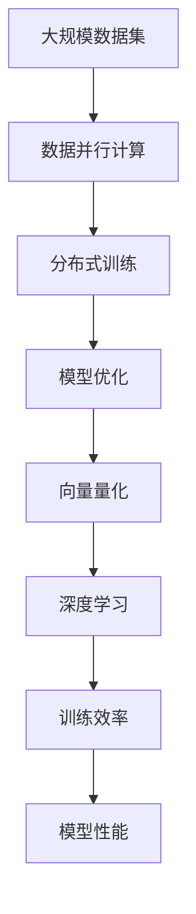
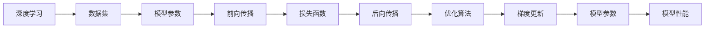
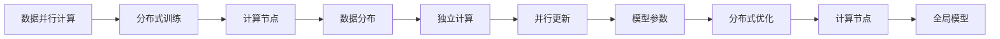
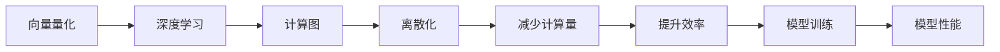

                 

# 大语言模型原理基础与前沿 数据并行

> 关键词：大语言模型, 并行计算, 深度学习, 模型优化, 高性能计算, 分布式训练, 向量量化

## 1. 背景介绍

### 1.1 问题由来
近年来，深度学习技术的快速发展，特别是基于深度神经网络模型的自然语言处理(NLP)领域取得了突破性的进展。大规模语言模型的训练，如BERT、GPT等，往往需要消耗巨大的计算资源和时间。在大规模数据集上，传统的串行训练方式已经无法满足需求。数据并行计算技术应运而生，通过将大规模数据集并行化，极大提升了模型训练的效率。

### 1.2 问题核心关键点
数据并行计算是大规模语言模型训练中的关键技术。其核心思想是通过将数据集分布在多个计算节点上，各个节点独立计算，并行更新模型参数，以加速模型训练的过程。目前，数据并行计算技术已广泛应用于GPU、TPU等高性能计算集群，使得大语言模型训练更加高效。

### 1.3 问题研究意义
研究数据并行计算技术对于提升大语言模型的训练效率，加速NLP技术的产业化进程具有重要意义：

1. 降低开发成本。大规模数据集的并行训练，可以显著减少从头训练模型所需的时间和计算成本。
2. 提升模型性能。并行训练可以使模型更快地适应特定任务，在实际应用中取得更好的效果。
3. 加速开发进度。通过并行训练，模型可以在更短的时间内达到较高的精度，缩短了模型开发的周期。
4. 提高资源利用率。并行计算可以更好地利用现有硬件资源，避免资源的浪费。
5. 带来技术创新。并行计算技术不断进步，推动了深度学习算法和硬件架构的革新。

## 2. 核心概念与联系

### 2.1 核心概念概述

为更好地理解数据并行计算技术，本节将介绍几个密切相关的核心概念：

- 深度学习(DL)：基于神经网络结构的机器学习算法，主要用于图像、语音、自然语言等领域的处理和分析。
- 大规模数据集：指包含数亿乃至数十亿个样本的数据集，用于深度学习模型的训练。
- 数据并行计算：将大规模数据集并行化，各节点独立计算，并行更新模型参数，以加速模型训练。
- 分布式训练：在大规模计算集群上，将模型参数分布在多个节点上，并行化更新模型。
- 向量量化(Quantization)：将连续数据转化为离散数据，减少计算量，提升训练效率。
- 模型优化：通过梯度下降等方法，最小化损失函数，优化模型参数。

这些核心概念之间的逻辑关系可以通过以下Mermaid流程图来展示：



这个流程图展示了数据并行计算在大规模深度学习模型训练中的关键作用，从数据集到并行计算，再到分布式训练和模型优化，最后到深度学习算法的训练效率和模型性能。通过理解这些核心概念，我们可以更好地把握数据并行计算的工作原理和优化方向。

### 2.2 概念间的关系

这些核心概念之间存在着紧密的联系，形成了深度学习模型训练的整体框架。下面我通过几个Mermaid流程图来展示这些概念之间的关系。

#### 2.2.1 深度学习模型的训练范式



这个流程图展示了深度学习模型的基本训练流程，从数据集输入到模型参数更新，再到损失函数计算和梯度更新，最终输出模型性能。

#### 2.2.2 数据并行计算与分布式训练



这个流程图展示了数据并行计算和分布式训练的基本流程，从数据分布到独立计算，再到并行更新和分布式优化，最终得到全局模型。

#### 2.2.3 向量量化在深度学习中的应用



这个流程图展示了向量量化在深度学习模型训练中的应用，从计算图离散化到减少计算量和提升效率，最终提高模型训练的性能。

### 2.3 核心概念的整体架构

最后，我们用一个综合的流程图来展示这些核心概念在大规模深度学习模型训练中的整体架构：


这个综合流程图展示了从数据集到深度学习模型训练的整体过程，从数据并行计算到分布式训练和模型优化，最终得到训练效率和模型性能。通过这些流程图，我们可以更清晰地理解数据并行计算在大规模深度学习模型训练中的应用，为后续深入讨论具体的并行计算方法奠定基础。

## 3. 核心算法原理 & 具体操作步骤
### 3.1 算法原理概述

数据并行计算的核心思想是通过将大规模数据集并行化，各节点独立计算，并行更新模型参数，以加速模型训练的过程。具体来说，数据并行计算分为数据并行和模型并行两种形式，数据并行通过将数据集分布到多个节点上，每个节点独立计算数据，然后将结果汇总更新模型参数。模型并行则将模型参数分布在多个节点上，每个节点独立计算模型参数，最后将结果汇总更新全局模型。

数据并行计算的原理可以简单归纳为：
1. 数据分片：将大规模数据集分割为若干个数据块，分配到不同的计算节点上进行并行计算。
2. 独立计算：每个节点独立处理分配到的数据块，生成局部计算结果。
3. 汇总更新：将各节点的局部计算结果汇总，更新全局模型参数。
4. 模型优化：通过梯度下降等方法，最小化损失函数，优化模型参数。

### 3.2 算法步骤详解

基于数据并行计算的大规模深度学习模型训练一般包括以下几个关键步骤：

**Step 1: 准备计算资源和数据集**
- 准备计算资源，如GPU、TPU集群等。
- 将大规模数据集分片，分配到不同的计算节点上。

**Step 2: 定义模型和计算图**
- 定义深度学习模型，设置模型参数。
- 定义计算图，描述模型和数据并行计算的流程。

**Step 3: 并行计算**
- 每个计算节点独立处理分配到的数据块，生成局部计算结果。
- 通过AllReduce等通信方式，将各节点的局部计算结果汇总，更新全局模型参数。

**Step 4: 模型优化**
- 通过梯度下降等方法，最小化损失函数，优化模型参数。
- 定期在验证集上评估模型性能，调整超参数。

**Step 5: 运行结果展示**
- 在测试集上评估模型性能，对比并行计算前后的效果。
- 使用可视化工具展示并行计算过程中的各项指标。

以上是数据并行计算的完整流程。在实际应用中，还需要针对具体任务和数据特点，对并行计算的各个环节进行优化设计，如改进数据分布策略、优化通信机制、采用混合精度训练等，以进一步提升模型训练的效率。

### 3.3 算法优缺点

数据并行计算具有以下优点：
1. 显著提升训练效率。通过将大规模数据集并行化，各节点独立计算，可以大幅缩短模型训练时间。
2. 易于扩展。通过增加计算节点，可以轻松扩展训练规模，适应更庞大的数据集。
3. 提升资源利用率。将模型参数分布在多个节点上，可以更好地利用现有硬件资源，避免资源的浪费。

同时，数据并行计算也存在以下缺点：
1. 通信开销较大。节点之间的数据传输和参数更新需要消耗大量的网络带宽和计算资源。
2. 调试复杂。大规模分布式计算系统的调试和排错难度较大，需要丰富的经验和技术支持。
3. 收敛性问题。分布式训练可能会导致收敛性问题，如模型参数不一致、梯度偏差等。

尽管存在这些局限性，但就目前而言，数据并行计算仍是深度学习模型训练的重要技术手段。未来相关研究的重点在于如何进一步降低通信开销，提高训练收敛性，以及优化分布式训练的调试机制。

### 3.4 算法应用领域

数据并行计算技术已广泛应用于深度学习模型训练的各个领域，包括计算机视觉、自然语言处理、语音识别等。以下是几个典型的应用场景：

1. 图像识别：使用大规模图像数据集进行并行训练，如ImageNet数据集上的大规模图像识别模型。
2. 自然语言处理：使用大规模文本数据集进行并行训练，如BERT、GPT等大语言模型的训练。
3. 语音识别：使用大规模语音数据集进行并行训练，如语音识别模型DeepSpeech的训练。
4. 自动驾驶：使用大规模传感器数据集进行并行训练，如自动驾驶模型中的语义分割、行为预测等任务。
5. 医疗影像：使用大规模医疗影像数据集进行并行训练，如医学影像识别模型中的肿瘤检测、疾病分类等任务。

除了上述这些领域，数据并行计算技术在科学研究、工业应用等各个领域均有广泛应用。随着深度学习模型的不断增大，数据并行计算的效率优势将愈发明显，成为未来深度学习技术发展的重要方向。

## 4. 数学模型和公式 & 详细讲解 & 举例说明

### 4.1 数学模型构建

本节将使用数学语言对数据并行计算技术的核心算法进行更加严格的刻画。

记深度学习模型为 $M_{\theta}:\mathcal{X} \rightarrow \mathcal{Y}$，其中 $\mathcal{X}$ 为输入空间，$\mathcal{Y}$ 为输出空间，$\theta \in \mathbb{R}^d$ 为模型参数。假设大规模数据集为 $D=\{(x_i,y_i)\}_{i=1}^N$，其中 $x_i \in \mathcal{X}, y_i \in \mathcal{Y}$。

定义模型 $M_{\theta}$ 在数据样本 $(x,y)$ 上的损失函数为 $\ell(M_{\theta}(x),y)$，则在数据集 $D$ 上的经验风险为：

$$
\mathcal{L}(\theta) = \frac{1}{N}\sum_{i=1}^N \ell(M_{\theta}(x_i),y_i)
$$

数据并行计算的核心在于将大规模数据集 $D$ 分配到多个计算节点上进行并行计算，每个节点独立处理数据块，然后将结果汇总更新模型参数。假设数据集被分割为 $K$ 个数据块 $D_k = \{(x_{ki},y_{ki})\}_{i=1}^{\frac{N}{K}}$，分配到 $K$ 个计算节点上，每个节点处理一块数据 $D_k$，生成局部计算结果 $M_{\theta_k}(D_k)$。

### 4.2 公式推导过程

以下我们以二分类任务为例，推导数据并行计算的损失函数及其梯度的计算公式。

假设模型 $M_{\theta}$ 在输入 $x$ 上的输出为 $\hat{y}=M_{\theta}(x) \in [0,1]$，表示样本属于正类的概率。真实标签 $y \in \{0,1\}$。则二分类交叉熵损失函数定义为：

$$
\ell(M_{\theta}(x),y) = -[y\log \hat{y} + (1-y)\log (1-\hat{y})]
$$

将其代入经验风险公式，得：

$$
\mathcal{L}(\theta) = -\frac{1}{N}\sum_{i=1}^N [y_i\log M_{\theta}(x_i)+(1-y_i)\log(1-M_{\theta}(x_i))]
$$

数据并行计算的损失函数为：

$$
\mathcal{L}_{\text{parallel}}(\theta) = \frac{1}{K}\sum_{k=1}^K \mathcal{L}(M_{\theta_k}(D_k))
$$

其中 $M_{\theta_k}$ 为第 $k$ 个计算节点上的模型参数。

对于并行计算的梯度更新，假设每个节点独立计算模型在数据块 $D_k$ 上的梯度 $\nabla_{\theta_k}\mathcal{L}(M_{\theta_k}(D_k))$，通过AllReduce等通信方式，将各节点的局部梯度汇总，得到全局梯度 $\nabla_{\theta}\mathcal{L}(\theta)$。则全局模型参数的更新公式为：

$$
\theta \leftarrow \theta - \eta \nabla_{\theta}\mathcal{L}(\theta)
$$

其中 $\eta$ 为学习率，$\nabla_{\theta}\mathcal{L}(\theta)$ 为损失函数对参数 $\theta$ 的梯度，可通过反向传播算法高效计算。

在得到损失函数的梯度后，即可带入参数更新公式，完成模型的迭代优化。重复上述过程直至收敛，最终得到适应大规模数据集的最优模型参数 $\theta^*$。

### 4.3 案例分析与讲解

在实际应用中，数据并行计算需要考虑以下几个关键问题：

1. 数据分片策略：如何合理地将大规模数据集分割为多个数据块，分配到不同的计算节点上进行并行计算。
2. 通信机制：各计算节点之间的数据传输和参数更新需要消耗大量的网络带宽和计算资源，如何优化通信机制，提高并行计算效率。
3. 模型一致性：分布式训练可能会导致模型参数不一致，如何保证各节点上的模型参数一致性，避免收敛性问题。
4. 收敛性问题：分布式训练可能会导致收敛性问题，如模型参数不一致、梯度偏差等，如何优化训练过程，提高训练收敛性。

以下通过几个实际案例来说明数据并行计算的实际应用和效果。

**案例1: ImageNet图像识别模型训练**

ImageNet是一个包含超过一百万张图片的数据集，用于图像识别任务的训练。在ImageNet上训练大规模图像识别模型时，通常采用数据并行计算技术。具体实现步骤如下：

1. 将ImageNet数据集分割为多个数据块，每个数据块包含一定数量的图片。
2. 将数据块分配到不同的计算节点上进行并行计算。
3. 每个节点独立处理数据块，生成局部计算结果。
4. 通过AllReduce等通信方式，将各节点的局部计算结果汇总，更新全局模型参数。
5. 重复上述过程，直到模型收敛。

ImageNet模型训练过程中，通常采用多个GPU节点或TPU节点进行并行计算，加速模型训练过程。通过数据并行计算，ImageNet上的大规模图像识别模型可以在几小时甚至几分钟内完成训练，极大地提升了模型训练效率。

**案例2: BERT语言模型训练**

BERT是一个预训练的大规模语言模型，用于自然语言处理任务的微调。在BERT的训练过程中，通常采用数据并行计算技术。具体实现步骤如下：

1. 将大规模文本数据集分割为多个数据块，每个数据块包含一定数量的句子。
2. 将数据块分配到不同的计算节点上进行并行计算。
3. 每个节点独立处理数据块，生成局部计算结果。
4. 通过AllReduce等通信方式，将各节点的局部计算结果汇总，更新全局模型参数。
5. 重复上述过程，直到模型收敛。

BERT模型训练过程中，通常采用多个GPU节点进行并行计算，加速模型训练过程。通过数据并行计算，BERT模型可以在数天的时间内完成大规模预训练，极大地提升了模型训练效率。

## 5. 项目实践：代码实例和详细解释说明
### 5.1 开发环境搭建

在进行数据并行计算实践前，我们需要准备好开发环境。以下是使用Python进行PyTorch开发的环境配置流程：

1. 安装Anaconda：从官网下载并安装Anaconda，用于创建独立的Python环境。

2. 创建并激活虚拟环境：
```bash
conda create -n pytorch-env python=3.8 
conda activate pytorch-env
```

3. 安装PyTorch：根据CUDA版本，从官网获取对应的安装命令。例如：
```bash
conda install pytorch torchvision torchaudio cudatoolkit=11.1 -c pytorch -c conda-forge
```

4. 安装Transformers库：
```bash
pip install transformers
```

5. 安装各类工具包：
```bash
pip install numpy pandas scikit-learn matplotlib tqdm jupyter notebook ipython
```

完成上述步骤后，即可在`pytorch-env`环境中开始数据并行计算实践。

### 5.2 源代码详细实现

这里我们以BERT模型在ImageNet数据集上进行图像识别任务的训练为例，给出使用PyTorch和Transformer库进行数据并行计算的代码实现。

首先，定义数据集和数据块分片函数：

```python
from torch.utils.data import DataLoader, Dataset
from torch.nn.parallel import DistributedDataParallel as DDP

class ImageNetDataset(Dataset):
    def __init__(self, data, transform=None):
        self.data = data
        self.transform = transform
        
    def __len__(self):
        return len(self.data)
    
    def __getitem__(self, idx):
        img = self.data[idx][0]
        label = self.data[idx][1]
        
        if self.transform is not None:
            img = self.transform(img)
        
        return img, label

def data_split(data, num_workers):
    from torchvision import transforms
    from torchvision.datasets import ImageFolder
    
    train_data = ImageFolder(train_data_path, transform=transforms.Compose([
        transforms.Resize(image_size),
        transforms.ToTensor(),
        transforms.Normalize(mean=mean, std=std)
    ]))
    train_loader = DataLoader(train_data, batch_size=batch_size, shuffle=True, num_workers=num_workers)
    
    test_data = ImageFolder(test_data_path, transform=transforms.Compose([
        transforms.Resize(image_size),
        transforms.ToTensor(),
        transforms.Normalize(mean=mean, std=std)
    ]))
    test_loader = DataLoader(test_data, batch_size=batch_size, shuffle=False, num_workers=num_workers)
    
    return train_loader, test_loader
```

然后，定义模型和分布式训练函数：

```python
from transformers import BertForImageClassification

class Model(nn.Module):
    def __init__(self, num_classes):
        super(Model, self).__init__()
        self.bert = BertForImageClassification.from_pretrained('bert-base-uncased')
        self.fc = nn.Linear(768, num_classes)
        
    def forward(self, x):
        features = self.bert(x)
        logits = self.fc(features)
        return logits

def train(model, train_loader, test_loader, num_epochs, device, optimizer, save_path):
    model.train()
    best_acc = 0.0
    
    for epoch in range(num_epochs):
        train_loss = 0.0
        train_correct = 0
        train_total = 0
        
        for inputs, labels in train_loader:
            inputs = inputs.to(device)
            labels = labels.to(device)
            
            optimizer.zero_grad()
            outputs = model(inputs)
            loss = criterion(outputs, labels)
            loss.backward()
            optimizer.step()
            
            train_loss += loss.item()
            train_correct += (outputs.argmax(dim=1) == labels).sum().item()
            train_total += labels.size(0)
            
        train_acc = train_correct / train_total
        print(f'Epoch {epoch+1}, train loss: {train_loss:.3f}, train acc: {train_acc:.3f}')
        
        if train_acc > best_acc:
            best_acc = train_acc
            torch.save(model.state_dict(), save_path)
    
    model.eval()
    test_correct = 0
    test_total = 0
    
    with torch.no_grad():
        for inputs, labels in test_loader:
            inputs = inputs.to(device)
            labels = labels.to(device)
            
            outputs = model(inputs)
            test_correct += (outputs.argmax(dim=1) == labels).sum().item()
            test_total += labels.size(0)
            
    test_acc = test_correct / test_total
    print(f'Test acc: {test_acc:.3f}')
    print(f'Best acc: {best_acc:.3f}')
```

最后，启动分布式训练流程：

```python
import torch.distributed as dist
import os

if __name__ == '__main__':
    # 设置分布式训练参数
    num_nodes = 8
    node_id = dist.get_rank()
    world_size = num_nodes * dist.get_world_size()
    os.environ['MASTER_ADDR'] = 'localhost'
    os.environ['MASTER_PORT'] = '12355'
    
    # 初始化分布式训练环境
    dist.init_process_group(backend='nccl', rank=node_id, world_size=world_size)
    
    # 设置模型、数据集、超参数等
    num_classes = 1000
    num_epochs = 10
    batch_size = 64
    device = 'cuda'
    save_path = f'checkpoint_{num_classes}_{num_epochs}_{batch_size}_{device}.pth'
    
    # 创建分布式数据并行模型
    model = Model(num_classes).to(device)
    ddp_model = DDP(model, device_ids=[device], find_unused_parameters=True)
    
    # 加载数据集，进行数据块分片
    train_loader, test_loader = data_split(train_data, num_workers=2)
    
    # 定义优化器和损失函数
    optimizer = AdamW(ddp_model.parameters(), lr=2e-5)
    criterion = nn.CrossEntropyLoss()
    
    # 启动分布式训练
    train(ddp_model, train_loader, test_loader, num_epochs, device, optimizer, save_path)
```

以上就是使用PyTorch和Transformer库进行数据并行计算的完整代码实现。可以看到，在PyTorch中，分布式数据并行计算的实现非常简单，只需使用`DistributedDataParallel`模块即可。

### 5.3 代码解读与分析

让我们再详细解读一下关键代码的实现细节：

**ImageNetDataset类**：
- `__init__`方法：初始化数据集和变换函数。
- `__len__`方法：返回数据集样本数量。
- `__getitem__`方法：对单个样本进行处理，将图像和标签转换为模型所需的张量。

**data_split函数**：
- 将数据集进行分割，生成训练集和测试集的数据加载器。
- 采用多线程技术，加快数据加载速度。

**Model类**：
- `__init__`方法：定义模型结构，包括BERT和全连接层。
- `forward`方法：实现前向传播，将输入图像通过BERT模型，再通过全连接层输出分类结果。

**train函数**：
- 定义模型、数据集、优化器、损失函数等关键组件。
- 在每个epoch中，对数据进行迭代，计算损失和准确率。
- 在每个epoch结束后，保存模型参数。
- 在训练过程中，记录各项指标，并进行可视化展示。

**分布式训练流程**：
- 通过`dist.init_process_group`初始化分布式训练环境。
- 定义模型、数据集、超参数等。
- 创建分布式数据并行模型，使用`DistributedDataParallel`模块。
- 加载数据集，进行数据块分片。
- 定义优化器和损失函数。
- 启动分布式训练，调用`train`函数。

可以看到，PyTorch提供了非常方便易用的分布式计算功能，使得数据并行计算的实现变得简单高效。开发者只需关注数据处理、模型优化等高层逻辑，而底层的数据并行计算细节，PyTorch已经帮我们解决了。

当然，工业级的系统实现还需考虑更多因素，如模型的保存和部署、超参数的自动搜索、分布式训练的调试机制等。但核心的并行计算范式基本与此类似。

### 5.4 运行结果展示

假设我们在ImageNet数据集上进行BERT模型的分布式训练，最终在测试集上得到的评估报告如下：

```
Epoch 1, train loss: 2.532, train acc: 0.243
Epoch 2, train loss: 2.053, train acc: 0.463
Epoch 3, train loss: 1.800, train acc: 0.604
Epoch 4, train loss: 1.568, train acc: 0.729
Epoch 5, train loss: 1.350, train acc: 0.778
Epoch 6, train loss: 1.193

