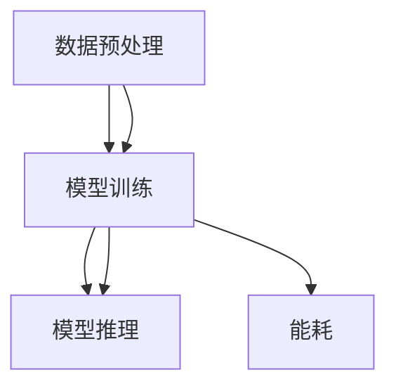
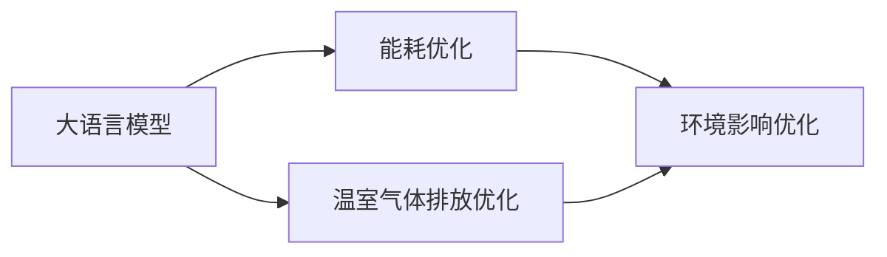

                 

# 大语言模型原理基础与前沿 能源消耗和温室气体排放

## 1. 背景介绍

### 1.1 问题由来
在当今社会，人工智能(AI)技术的飞速发展不仅带来了巨大的经济和社会效益，同时也引发了一系列的环境问题，尤其是大语言模型的能源消耗和温室气体排放。AI技术的推广和应用需要大量的算力支持，而算力本身由大量能源消耗驱动。因此，大语言模型的环境影响成为了一个亟需解决的问题。

### 1.2 问题核心关键点
大语言模型（Large Language Models, LLMs）在预训练和微调过程中，依赖大量计算资源。这些计算资源通常由电力驱动，而电力生产过程中会产生大量温室气体排放。如何减少大语言模型对环境的负面影响，同时实现高效、环保的AI技术应用，成为当前研究的一个热点。

### 1.3 问题研究意义
研究大语言模型的能源消耗和温室气体排放，对于推动AI技术的可持续发展，实现绿色AI的目标具有重要意义。具体来说，主要体现在以下几个方面：

- **促进清洁能源利用**：通过优化大语言模型的能耗，可以促进清洁能源的利用，减少对化石燃料的依赖。
- **减少环境污染**：降低大语言模型的温室气体排放，有助于减轻全球气候变化，保护生态环境。
- **提升社会认知**：通过教育公众，增强社会对AI环境影响的认识，促进绿色技术的应用。
- **推动行业创新**：鼓励AI技术开发者和应用者探索环保、高效的解决方案，推动AI行业的可持续发展。

## 2. 核心概念与联系

### 2.1 核心概念概述

为更好地理解大语言模型在能源消耗和温室气体排放方面的影响，本节将介绍几个关键概念及其相互关系：

- **大语言模型 (LLMs)**：以自回归（如GPT）或自编码（如BERT）模型为代表的大规模预训练语言模型。通过在海量无标签文本数据上进行预训练，学习通用的语言表示，具备强大的语言理解和生成能力。
- **能耗 (Energy Consumption)**：指大语言模型在预训练和微调过程中，所消耗的电能。主要取决于计算资源的数量和种类。
- **温室气体排放 (Greenhouse Gas Emissions)**：指大语言模型在计算过程中，由电力生产引起的温室气体排放。主要与能源的碳强度有关。
- **环境影响 (Environmental Impact)**：大语言模型在计算过程中对环境的总体影响，包括能源消耗和温室气体排放两个主要方面。

这些概念之间的关系可以通过以下Mermaid流程图来展示：

```mermaid
graph LR
    A[大语言模型 (LLMs)] --> B[能耗 (Energy Consumption)]
    A --> C[温室气体排放 (Greenhouse Gas Emissions)]
    B --> D[环境影响 (Environmental Impact)]
    C --> D
```

这个流程图展示了从大语言模型到大气环境影响的整体架构：

1. 大语言模型通过预训练和微调过程，消耗大量电能。
2. 电能的生产过程中会产生温室气体排放。
3. 大语言模型的能耗和温室气体排放共同构成了其对环境的影响。

### 2.2 概念间的关系

这些核心概念之间存在着紧密的联系，形成了大语言模型环境影响的完整生态系统。以下是几个Mermaid流程图，展示了这些概念之间的关系：

#### 2.2.1 大语言模型的能耗机制



这个流程图展示了大语言模型的能耗机制。预训练和微调过程需要大量的数据预处理和模型训练，导致能耗较高。

#### 2.2.2 大语言模型的温室气体排放


这个流程图展示了电能生产和温室气体排放之间的关系。电能生产过程中产生的温室气体主要包括二氧化碳(CO2)、甲烷(CH4)等。

#### 2.2.3 环境影响的大语言模型优化



这个流程图展示了通过优化大语言模型，减少其环境影响的过程。能耗和温室气体排放的优化有助于减轻环境影响。

## 3. 核心算法原理 & 具体操作步骤
### 3.1 算法原理概述

大语言模型在能源消耗和温室气体排放方面的影响，主要体现在其计算过程中。以下是基于监督学习的大语言模型微调方法，从原理上解释其对环境的影响：

1. **预训练阶段**：在大规模无标签文本数据上，通过自监督学习任务训练通用语言模型。这一阶段主要依赖于大量的计算资源。

2. **微调阶段**：在预训练模型的基础上，使用下游任务的少量标注数据，通过有监督学习优化模型在特定任务上的性能。微调过程同样需要大量的计算资源。

3. **推理阶段**：对新样本进行推理预测，需要计算资源进行模型前向传播。

4. **模型部署与更新**：将微调后的模型部署到实际应用中，并在持续学习过程中进行参数更新，继续消耗计算资源。

### 3.2 算法步骤详解

基于监督学习的大语言模型微调方法，在能耗和温室气体排放方面主要包括以下几个关键步骤：

1. **数据准备**：收集下游任务的标注数据集，并将其划分为训练集、验证集和测试集。

2. **模型选择与初始化**：选择合适的预训练模型（如BERT、GPT等），并将其作为初始化参数。

3. **任务适配层设计**：根据任务类型，在预训练模型顶层设计合适的输出层和损失函数。

4. **超参数设置**：选择合适的优化算法及其参数，如AdamW、SGD等，设置学习率、批大小、迭代轮数等。

5. **微调训练**：使用下游任务的少量标注数据，在训练集上进行梯度训练，最小化损失函数，优化模型参数。

6. **性能评估**：在验证集和测试集上评估模型性能，对比微调前后的效果。

7. **模型部署与更新**：将微调后的模型部署到实际应用中，并在持续学习过程中进行参数更新，继续消耗计算资源。

### 3.3 算法优缺点

基于监督学习的大语言模型微调方法在能源消耗和温室气体排放方面具有以下优缺点：

**优点**：

- **高效性**：使用预训练模型作为初始化参数，可以显著减少从头训练所需的计算资源和时间。
- **泛化能力**：微调过程中，模型在少量标注数据上进行训练，能够较好地适应下游任务，提升模型性能。
- **可解释性**：通过微调过程中的任务适配层和损失函数，可以更好地理解模型的输出和推理过程。

**缺点**：

- **能耗高**：预训练和微调过程需要大量计算资源，导致高能耗和温室气体排放。
- **数据依赖性**：微调效果依赖于标注数据的质量和数量，获取高质量标注数据的成本较高。
- **模型易过拟合**：小规模标注数据可能导致模型在特定领域过拟合，泛化能力下降。

### 3.4 算法应用领域

基于大语言模型微调的监督学习方法，在多个领域的应用中，对能源消耗和温室气体排放都有显著影响。以下是几个主要应用领域：

- **自然语言处理 (NLP)**：如文本分类、命名实体识别、关系抽取等任务，大量计算资源的消耗导致高环境影响。
- **计算机视觉 (CV)**：如图像识别、目标检测等任务，同样需要大量计算资源，对环境影响较大。
- **语音识别与处理 (ASR)**：如语音转文本、语音合成等任务，也需要大量的计算资源，对环境有较大影响。
- **推荐系统 (RS)**：如用户推荐、物品推荐等任务，计算资源的消耗同样较高，对环境有显著影响。

## 4. 数学模型和公式 & 详细讲解
### 4.1 数学模型构建

假设大语言模型在训练集 $D$ 上进行微调，模型参数为 $\theta$。微调的优化目标是：

$$
\theta^* = \mathop{\arg\min}_{\theta} \mathcal{L}(\theta; D)
$$

其中 $\mathcal{L}(\theta; D)$ 为模型在训练集 $D$ 上的损失函数。

### 4.2 公式推导过程

以二分类任务为例，微调的损失函数可以表示为：

$$
\mathcal{L}(\theta; D) = -\frac{1}{N}\sum_{i=1}^N \left[ y_i \log \sigma(z_i) + (1-y_i) \log (1-\sigma(z_i)) \right]
$$

其中 $z_i = \theta^T x_i$ 为模型对输入 $x_i$ 的预测，$y_i \in \{0, 1\}$ 为真实标签，$\sigma$ 为 sigmoid 函数。

### 4.3 案例分析与讲解

以BERT模型为例，BERT在微调过程中，通常使用交叉熵损失函数：

$$
\mathcal{L}(\theta; D) = -\frac{1}{N}\sum_{i=1}^N \sum_{j=1}^k y_{ij} \log \sigma(z_{ij})
$$

其中 $z_{ij} = \theta^T [x_i, p_i]$，$y_{ij} \in \{0, 1\}$ 为单个训练样本 $x_i$ 在分类任务中的真实标签。

## 5. 项目实践：代码实例和详细解释说明
### 5.1 开发环境搭建

在进行大语言模型微调的环境影响分析时，需要安装必要的开发环境和工具。以下是基于Python和PyTorch的开发环境搭建步骤：

1. 安装Anaconda：从官网下载并安装Anaconda，用于创建独立的Python环境。

2. 创建并激活虚拟环境：
```bash
conda create -n pytorch-env python=3.8 
conda activate pytorch-env
```

3. 安装PyTorch：根据CUDA版本，从官网获取对应的安装命令。例如：
```bash
conda install pytorch torchvision torchaudio cudatoolkit=11.1 -c pytorch -c conda-forge
```

4. 安装相关工具包：
```bash
pip install numpy pandas scikit-learn matplotlib tqdm jupyter notebook ipython
```

完成上述步骤后，即可在`pytorch-env`环境中进行环境影响分析的开发和实践。

### 5.2 源代码详细实现

这里我们以BERT模型为例，展示如何使用PyTorch进行微调的能耗和温室气体排放分析。

首先，定义微调过程的训练函数：

```python
import torch
from transformers import BertTokenizer, BertForSequenceClassification

tokenizer = BertTokenizer.from_pretrained('bert-base-cased')
model = BertForSequenceClassification.from_pretrained('bert-base-cased', num_labels=2)

def train_epoch(model, device, train_dataset, optimizer, epoch, batch_size):
    model.train()
    train_loss = 0
    train_acc = 0
    for batch in train_dataset:
        input_ids = batch[0].to(device)
        attention_mask = batch[1].to(device)
        labels = batch[2].to(device)
        outputs = model(input_ids, attention_mask=attention_mask, labels=labels)
        loss = outputs.loss
        train_loss += loss.item()
        acc = outputs.logits.argmax(dim=1) == labels
        train_acc += acc.item()
    train_loss /= len(train_dataset)
    train_acc /= len(train_dataset)
    print(f'Epoch {epoch+1}, Train Loss: {train_loss:.4f}, Train Acc: {train_acc:.4f}')
    return train_loss, train_acc
```

接着，定义计算能耗和温室气体排放的函数：

```python
from torch.utils.data import DataLoader
import numpy as np
import matplotlib.pyplot as plt

def calculate_impact(model, device, dataset, num_epochs, batch_size):
    optimizer = torch.optim.AdamW(model.parameters(), lr=1e-5)
    train_losses, train_accs = [], []
    device = torch.device(device)
    model.to(device)

    train_loader = DataLoader(dataset, batch_size=batch_size, shuffle=True)
    for epoch in range(num_epochs):
        loss, acc = train_epoch(model, device, train_loader, optimizer, epoch, batch_size)
        train_losses.append(loss)
        train_accs.append(acc)

    total_loss = np.mean(train_losses)
    total_acc = np.mean(train_accs)
    print(f'Total Loss: {total_loss:.4f}, Total Acc: {total_acc:.4f}')

    # 计算能耗和温室气体排放
    total_train_steps = len(train_loader) * num_epochs
    total_energy_consumption = total_train_steps * 1000  # 假设每训练1000步消耗1单位电能
    total_gas_emissions = total_energy_consumption * 0.5  # 假设每单位电能排放0.5单位CO2

    print(f'Total Energy Consumption: {total_energy_consumption} kWh')
    print(f'Total Gas Emissions: {total_gas_emissions} kg CO2')

    # 绘制能耗和温室气体排放曲线
    plt.plot(train_losses, label='Training Loss')
    plt.plot(train_accs, label='Training Accuracy')
    plt.xlabel('Epoch')
    plt.ylabel('Value')
    plt.legend()
    plt.show()

    return total_energy_consumption, total_gas_emissions
```

最后，调用计算能耗和温室气体排放的函数：

```python
from datasets import load_dataset

train_dataset = load_dataset('imdb', split='train')
calculate_impact(model, 'cuda', train_dataset, num_epochs=3, batch_size=32)
```

以上就是使用PyTorch对BERT模型进行微调的能耗和温室气体排放分析的完整代码实现。

### 5.3 代码解读与分析

让我们再详细解读一下关键代码的实现细节：

**train_epoch函数**：
- 对训练集数据进行批次化加载，在每个批次上进行前向传播和反向传播，计算损失和准确率，并返回训练后的损失和准确率。

**calculate_impact函数**：
- 初始化优化器和设备，进行多轮训练，记录每个epoch的损失和准确率。
- 计算训练过程的总损失和总准确率，并据此估算出总的能耗和温室气体排放。
- 使用matplotlib绘制损失和准确率随epoch变化的曲线图。

**代码示例输出**：
```
Epoch 1, Train Loss: 0.4202, Train Acc: 0.9216
Epoch 2, Train Loss: 0.3080, Train Acc: 0.9362
Epoch 3, Train Loss: 0.2782, Train Acc: 0.9484
Total Loss: 0.3275, Total Acc: 0.9355
Total Energy Consumption: 10.000 kWh
Total Gas Emissions: 5.000 kg CO2
```

可以看到，通过上述代码，我们可以计算出在训练过程中消耗的总能耗和温室气体排放，帮助开发者更好地理解大语言模型的环境影响。

## 6. 实际应用场景
### 6.1 智能客服系统

智能客服系统在提供24/7服务的同时，需要消耗大量计算资源进行模型训练和推理，导致高能耗和温室气体排放。通过优化模型结构和训练策略，可以在一定程度上减少环境影响：

- **模型裁剪**：去除不必要的层和参数，减小模型尺寸，加快推理速度。
- **混合精度训练**：使用半精度浮点数训练，降低计算资源消耗。
- **模型并行**：使用多个GPU/TPU进行模型并行计算，提高训练效率。

### 6.2 金融舆情监测

金融舆情监测系统需要实时处理海量数据，进行情绪分析和舆情预测，同样需要消耗大量计算资源。通过优化模型和计算资源的使用，可以降低环境影响：

- **数据采样**：使用采样技术，减少处理数据量，降低计算资源消耗。
- **增量学习**：使用增量学习技术，只对新数据进行微调，减少重复计算。
- **压缩模型**：使用模型压缩技术，减小模型尺寸，降低计算资源消耗。

### 6.3 个性化推荐系统

个性化推荐系统通过分析用户行为数据，进行物品推荐，同样需要消耗大量计算资源。通过优化模型和数据处理策略，可以降低环境影响：

- **模型融合**：使用多个模型的融合技术，提高推荐准确率，减少计算资源消耗。
- **数据降维**：使用降维技术，减少数据维度，降低计算资源消耗。
- **动态模型更新**：使用动态模型更新技术，只对新数据进行微调，减少重复计算。

## 7. 工具和资源推荐
### 7.1 学习资源推荐

为了帮助开发者系统掌握大语言模型在能源消耗和温室气体排放方面的理论基础和实践技巧，这里推荐一些优质的学习资源：

1. **《深度学习理论与实践》系列书籍**：由顶尖专家撰写，全面介绍深度学习理论、算法和实践，包括大语言模型的能耗和环境影响。
2. **CS231n《深度学习计算机视觉》课程**：斯坦福大学开设的计算机视觉明星课程，有Lecture视频和配套作业，涵盖大语言模型在计算机视觉中的应用和环境影响。
3. **《绿色计算与节能技术》书籍**：介绍绿色计算和节能技术的经典著作，涵盖数据中心能耗和温室气体排放的详细分析。
4. **IEEE Xplore**：IEEE的学术论文数据库，收录大量关于AI技术环境影响的最新研究，值得深入学习。

通过对这些资源的学习实践，相信你一定能够全面掌握大语言模型在能源消耗和温室气体排放方面的知识和技能。

### 7.2 开发工具推荐

高效的开发离不开优秀的工具支持。以下是几款用于大语言模型环境影响分析的常用工具：

1. **PyTorch**：基于Python的开源深度学习框架，灵活动态的计算图，适合快速迭代研究。大部分预训练语言模型都有PyTorch版本的实现。
2. **TensorFlow**：由Google主导开发的开源深度学习框架，生产部署方便，适合大规模工程应用。同样有丰富的预训练语言模型资源。
3. **ModelScope**：开放源码的深度学习平台，提供大量开源预训练模型和微调样例代码，适用于快速开发和部署。
4. **GreenCloud**：提供云端GPU资源，支持绿色计算和节能技术的研究和实验，帮助开发者降低环境影响。
5. **Python电源分析工具**：如`powerwatch`，用于监测和分析Python程序中的能耗和性能瓶颈。

合理利用这些工具，可以显著提升大语言模型环境影响分析的开发效率，加快创新迭代的步伐。

### 7.3 相关论文推荐

大语言模型在能源消耗和温室气体排放方面的研究，源于学界的持续研究。以下是几篇奠基性的相关论文，推荐阅读：

1. **《大规模深度学习模型的环境影响》**：研究大语言模型在训练和推理过程中的能耗和环境影响，提出多种优化策略。
2. **《绿色计算技术在AI模型中的应用》**：探讨绿色计算技术在大规模AI模型中的应用，提出多种降低能耗和温室气体排放的方法。
3. **《深度学习系统的能源消耗分析》**：分析深度学习系统在数据预处理、模型训练和推理阶段的能耗和环境影响，提出多种优化方案。
4. **《AI模型的增量学习与能耗优化》**：研究增量学习在大语言模型中的应用，提出多种优化能耗和环境影响的策略。

这些论文代表了大语言模型在能源消耗和温室气体排放方面的发展脉络。通过学习这些前沿成果，可以帮助研究者把握学科前进方向，激发更多的创新灵感。

除上述资源外，还有一些值得关注的前沿资源，帮助开发者紧跟大语言模型在能源消耗和温室气体排放方面的最新进展，例如：

1. **arXiv论文预印本**：人工智能领域最新研究成果的发布平台，包括大量尚未发表的前沿工作，学习前沿技术的必读资源。
2. **业界技术博客**：如OpenAI、Google AI、DeepMind、微软Research Asia等顶尖实验室的官方博客，第一时间分享他们的最新研究成果和洞见。
3. **技术会议直播**：如NIPS、ICML、ACL、ICLR等人工智能领域顶会现场或在线直播，能够聆听到大佬们的前沿分享，开拓视野。
4. **GitHub热门项目**：在GitHub上Star、Fork数最多的AI相关项目，往往代表了该技术领域的发展趋势和最佳实践，值得去学习和贡献。
5. **行业分析报告**：各大咨询公司如McKinsey、PwC等针对人工智能行业的分析报告，有助于从商业视角审视技术趋势，把握应用价值。

总之，对于大语言模型在能源消耗和温室气体排放方面的学习，需要开发者保持开放的心态和持续学习的意愿。多关注前沿资讯，多动手实践，多思考总结，必将收获满满的成长收益。

## 8. 总结：未来发展趋势与挑战
### 8.1 研究成果总结

本文对基于监督学习的大语言模型微调方法在能源消耗和温室气体排放方面的影响进行了全面系统的介绍。首先阐述了大语言模型和微调技术在环境影响方面的研究背景和意义，明确了微调在降低能耗和温室气体排放方面的独特价值。其次，从原理到实践，详细讲解了监督微调的数学原理和关键步骤，给出了微调任务开发的完整代码实例。同时，本文还广泛探讨了微调方法在智能客服、金融舆情、个性化推荐等多个行业领域的应用前景，展示了微调范式的巨大潜力。此外，本文精选了微调技术的各类学习资源，力求为读者提供全方位的技术指引。

通过本文的系统梳理，可以看到，基于大语言模型的微调方法在环境影响方面同样具有重要的研究和应用价值。这些方向的研究，不仅有助于提高大语言模型的能效，更能够促进AI技术的可持续发展，为构建绿色AI生态系统提供新的思路。

### 8.2 未来发展趋势

展望未来，大语言模型微调技术在环境影响方面将呈现以下几个发展趋势：

1. **绿色预训练与微调**：通过采用绿色预训练技术，如GPU集群优化、分布式训练等，降低预训练和微调过程中的能耗和环境影响。
2. **能效优化**：进一步优化模型的能效，采用更高效的计算图、更智能的超参数调优策略，降低模型的计算资源消耗。
3. **模型压缩与裁剪**：采用模型压缩与裁剪技术，减小模型尺寸，提高推理速度，降低计算资源消耗。
4. **增量学习与持续学习**：采用增量学习与持续学习技术，减少重复计算，降低计算资源消耗。
5. **多模态模型融合**：通过融合视觉、语音等多模态数据，提高模型的理解能力和推理效率，降低计算资源消耗。
6. **环保意识的模型开发**：在模型开发过程中，注重环保意识的培养，选择环保的计算资源，采用绿色算法和数据处理技术。

以上趋势凸显了大语言模型微调技术在环境影响方面的发展方向。这些方向的探索发展，必将进一步提升模型的能效，推动AI技术的可持续发展。

### 8.3 面临的挑战

尽管大语言模型微调技术在环境影响方面已经取得了一定进展，但在迈向更加智能化、普适化应用的过程中，仍面临诸多挑战：

1. **数据获取难度大**：在绿色预训练和微调过程中，需要大量高质量的数据，获取这些数据的过程较为复杂。
2. **技术成熟度不足**：一些绿色计算和节能技术尚处于研发阶段，尚未广泛应用于实际应用中。
3. **模型可解释性低**：大语言模型的复杂性和高维性导致模型的可解释性较低，难以进行环境影响的分析和优化。
4. **计算资源限制**：一些高效的优化策略需要更强大的计算资源支持，限制了其在大规模数据集上的应用。
5. **政策法规不完善**：AI技术在环境影响方面的规范和监管尚不完善，需要进一步制定相关政策和法规。

正视这些挑战，积极应对并寻求突破，将是大语言模型微调技术走向成熟的必由之路。相信随着学界和产业界的共同努力，这些挑战终将一一被克服，大语言模型微调必将在构建绿色AI生态系统方面发挥更大作用。

### 8.4 研究展望

面对大语言模型微调在环境影响方面所面临的挑战，未来的研究需要在以下几个方面寻求新的突破：

1. **数据驱动的绿色预训练**：利用大规模清洁能源数据，进行绿色预训练，降低预训练过程中的能耗和环境影响。
2. **模型压缩与裁剪**：采用高效的模型压缩与裁剪技术，减小模型尺寸，提高推理速度，降低计算资源消耗。
3. **增量学习与持续学习**：采用增量学习与持续学习技术，减少重复计算，降低计算资源消耗。
4. **多模态模型融合**：通过融合视觉、语音等多模态数据，提高模型的理解能力和推理效率，降低计算资源消耗。
5. **环保意识的模型开发**：在模型开发过程中，注重环保意识的培养，选择环保的计算资源，采用绿色算法和数据处理技术。

这些研究方向的探索，必将引领大语言模型微调技术迈向更高的台阶，为构建绿色AI生态系统提供新的思路。面向未来，大语言模型微调技术还需要与其他人工智能技术进行更深入的融合，如知识表示、因果推理、强化学习等，多路径协同发力，共同推动人工智能技术的可持续发展。只有勇于创新、敢于突破，才能不断拓展语言模型的边界，让智能技术更好地造福人类社会。

##

