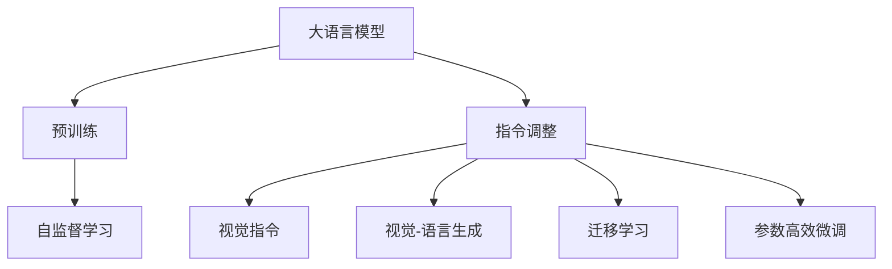
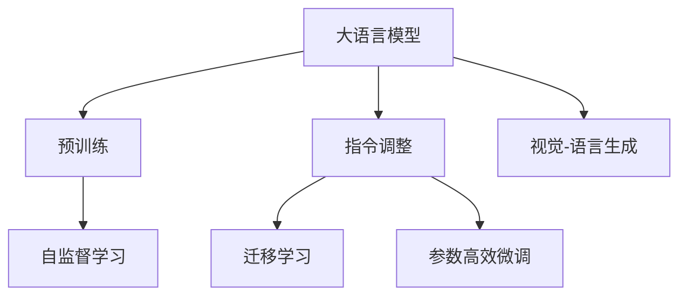
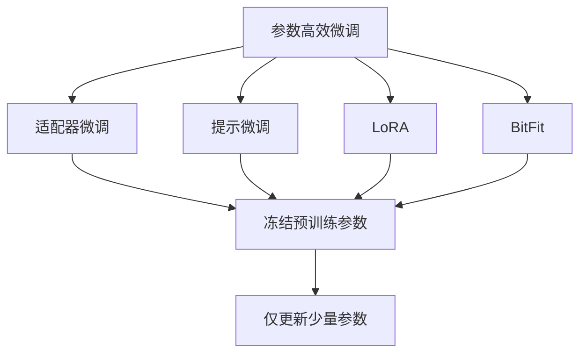
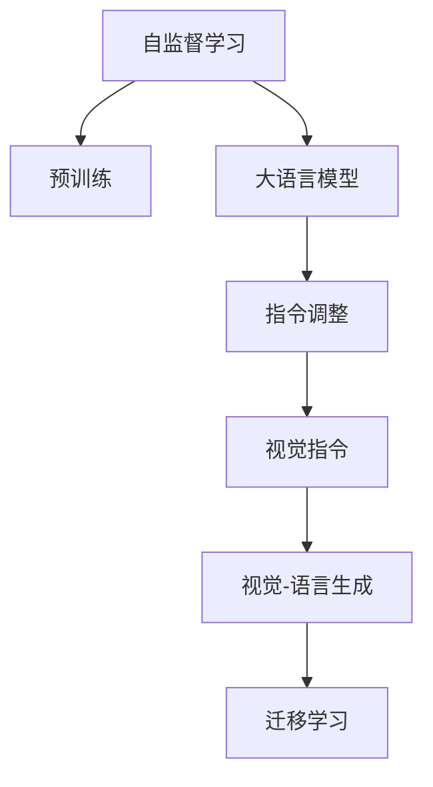
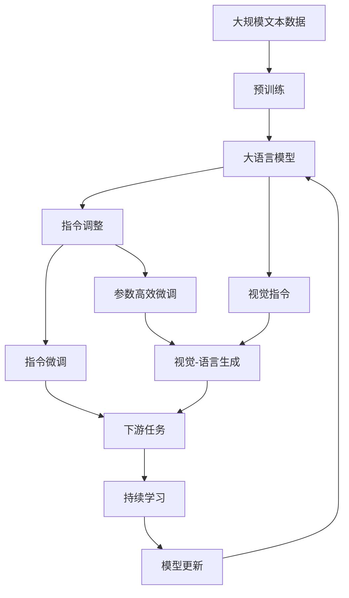

                 

# 大语言模型原理基础与前沿 视觉指令调整

> 关键词：大语言模型,指令调整,视觉指令,计算机视觉(CV),语言理解,语义表示,Transformer,BERT,自监督学习,迁移学习

## 1. 背景介绍

### 1.1 问题由来
近年来，大语言模型在自然语言处理(NLP)领域取得了显著进展，但它们主要依赖文本信息进行学习和理解。然而，人类在许多场景下需要通过图像、视频等多模态信息来理解世界，例如，阅读说明书、理解图表、分析场景等。为此，计算机视觉(CV)领域的模型如卷积神经网络(CNNs)、循环神经网络(RNNs)等也逐渐发展起来，能够处理图像、视频等数据。

在多模态学习领域，大语言模型与计算机视觉模型开始尝试结合。例如，通过图像描述生成文本，或者通过文本引导生成图像。这些结合技术通常称为"视觉指令调整"或"视觉-语言生成"。但这些模型通常需要同时训练语言模型和视觉模型，计算成本高，效果也受限于数据质量和模型复杂度。

为了克服这些困难，本文将介绍基于大语言模型的视觉指令调整方法，它能够利用已有的大语言模型，通过微调或简单调整，实现图像生成、图像描述、图像分类等任务。

### 1.2 问题核心关键点
基于大语言模型的视觉指令调整，其核心思想是将预训练大语言模型当作特征提取器，通过微调或简单调整，使其具备处理视觉指令的能力。具体步骤如下：
1. 收集含有视觉指令的数据集。
2. 使用这些数据集对大语言模型进行微调或简单调整。
3. 模型可以基于输入的文本生成图像或分类图像，或者根据图像生成文本描述。

这种范式具有以下优势：
- 简单易用。只需使用已有的大语言模型，无需训练额外的视觉模型。
- 扩展性强。能够处理多种视觉指令任务，如生成图像、分类图像、描述图像等。
- 可解释性强。大语言模型通常具有较好的可解释性，易于理解和调试。

本文将详细介绍这一方法的理论基础和应用实践，包括微调步骤、数学模型、代码实现等，并分析其优缺点和应用前景。

## 2. 核心概念与联系

### 2.1 核心概念概述

为更好地理解基于大语言模型的视觉指令调整方法，本节将介绍几个密切相关的核心概念：

- 大语言模型(Large Language Model, LLM)：以自回归(如GPT)或自编码(如BERT)模型为代表的大规模预训练语言模型。通过在大规模无标签文本语料上进行预训练，学习通用的语言表示，具备强大的语言理解和生成能力。

- 预训练(Pre-training)：指在大规模无标签文本语料上，通过自监督学习任务训练通用语言模型的过程。常见的预训练任务包括言语建模、遮挡语言模型等。

- 指令调整(Direction Tuning)：指在预训练模型的基础上，使用包含视觉指令的数据集对其进行微调，使其具备处理视觉信息的能力。

- 视觉指令(Vision Instruction)：指将自然语言指令与图像数据结合的指令形式，如"画一张猫"、"找出图中的狗"等。

- 视觉-语言生成(Visual-Language Generation)：指生成图像或图像描述的模型，通常由视觉编码器和语言解码器两部分构成，其中语言解码器可以是预训练语言模型。

- 迁移学习(Transfer Learning)：指将一个领域学习到的知识，迁移应用到另一个不同但相关的领域的学习范式。视觉指令调整可以视为一种特殊的迁移学习过程。

- 自监督学习(Self-Supervised Learning)：指仅利用未标注数据进行学习，学习任务与人类标注任务相关的表示，如语言模型、图像旋转预测等。

这些核心概念之间的逻辑关系可以通过以下Mermaid流程图来展示：



这个流程图展示了大语言模型的核心概念及其之间的关系：

1. 大语言模型通过预训练获得基础能力。
2. 指令调整是对预训练模型进行视觉指令的微调或简单调整。
3. 视觉指令包括文本与图像的结合。
4. 视觉-语言生成模型由视觉编码器和语言解码器两部分构成，其中语言解码器通常是大语言模型。
5. 迁移学习将视觉指令调整看作一种特殊的迁移学习过程。
6. 参数高效微调方法可用于减少微调参数量，提高效率。
7. 自监督学习是预训练的一种方法，可以用于提高模型表示能力。

这些核心概念共同构成了大语言模型的学习和应用框架，使其能够在各种场景下发挥强大的语言理解和生成能力。通过理解这些核心概念，我们可以更好地把握大语言模型的工作原理和优化方向。

### 2.2 概念间的关系

这些核心概念之间存在着紧密的联系，形成了大语言模型的学习生态系统。下面我通过几个Mermaid流程图来展示这些概念之间的关系。

#### 2.2.1 大语言模型的学习范式



这个流程图展示了大语言模型的三种主要学习范式：预训练、指令调整和视觉-语言生成。其中，指令调整可以看作预训练与视觉-语言生成之间的桥梁。

#### 2.2.2 指令调整与微调的关系


这个流程图展示了指令调整与微调的关系。指令调整可以通过微调实现，也可以通过简单调整实现，即在预训练模型的基础上，通过添加视觉编码器或使用视觉指令模板进行调整。

#### 2.2.3 参数高效微调方法



这个流程图展示了几种常见的参数高效微调方法，包括适配器微调、提示微调、LoRA和BitFit。这些方法的共同特点是冻结大部分预训练参数，只更新少量参数，从而提高微调效率。

#### 2.2.4 自监督学习在大语言模型中的应用



这个流程图展示了自监督学习在大语言模型中的应用。自监督学习可以用于预训练，提高模型表示能力，进而增强指令调整的效果。

### 2.3 核心概念的整体架构

最后，我们用一个综合的流程图来展示这些核心概念在大语言模型指令调整过程中的整体架构：



这个综合流程图展示了从预训练到指令调整，再到视觉-语言生成的完整过程。大语言模型首先在大规模文本数据上进行预训练，然后通过指令调整(包括指令微调和参数高效微调)实现视觉指令处理能力，进而用于视觉-语言生成，提升模型的应用范围和效果。最后，通过持续学习技术，模型可以不断更新和适应新的视觉指令。

## 3. 核心算法原理 & 具体操作步骤
### 3.1 算法原理概述

基于大语言模型的视觉指令调整，本质上是一种特殊形式的迁移学习过程。其核心思想是：将预训练大语言模型视作强大的"特征提取器"，通过使用包含视觉指令的数据集对其进行微调或简单调整，使其具备处理视觉信息的能力。

形式化地，假设预训练模型为 $M_{\theta}$，其中 $\theta$ 为预训练得到的模型参数。给定带有视觉指令的数据集 $D=\{(x_i,y_i)\}_{i=1}^N$，其中 $x_i$ 为图像描述，$y_i$ 为图像或图像描述对应的标签，指令调整的目标是找到新的模型参数 $\hat{\theta}$，使得：

$$
\hat{\theta}=\mathop{\arg\min}_{\theta} \mathcal{L}(M_{\theta},D)
$$

其中 $\mathcal{L}$ 为针对视觉指令设计的损失函数，用于衡量模型预测输出与真实标签之间的差异。常见的损失函数包括交叉熵损失、均方误差损失等。

通过梯度下降等优化算法，指令调整过程不断更新模型参数 $\theta$，最小化损失函数 $\mathcal{L}$，使得模型输出逼近真实标签。由于 $\theta$ 已经通过预训练获得了较好的初始化，因此即便在指令调整过程中，模型也能较快收敛到理想的模型参数 $\hat{\theta}$。

### 3.2 算法步骤详解

基于大语言模型的视觉指令调整一般包括以下几个关键步骤：

**Step 1: 准备预训练模型和数据集**
- 选择合适的预训练语言模型 $M_{\theta}$ 作为初始化参数，如 BERT、GPT等。
- 准备带有视觉指令的数据集 $D$，划分为训练集、验证集和测试集。一般要求视觉指令与预训练数据的分布不要差异过大。

**Step 2: 添加任务适配层**
- 根据任务类型，在预训练模型顶层设计合适的输出层和损失函数。
- 对于分类任务，通常在顶层添加线性分类器和交叉熵损失函数。
- 对于生成任务，通常使用语言模型的解码器输出概率分布，并以负对数似然为损失函数。

**Step 3: 设置微调超参数**
- 选择合适的优化算法及其参数，如 AdamW、SGD 等，设置学习率、批大小、迭代轮数等。
- 设置正则化技术及强度，包括权重衰减、Dropout、Early Stopping等。
- 确定冻结预训练参数的策略，如仅微调顶层，或全部参数都参与微调。

**Step 4: 执行梯度训练**
- 将训练集数据分批次输入模型，前向传播计算损失函数。
- 反向传播计算参数梯度，根据设定的优化算法和学习率更新模型参数。
- 周期性在验证集上评估模型性能，根据性能指标决定是否触发 Early Stopping。
- 重复上述步骤直到满足预设的迭代轮数或 Early Stopping 条件。

**Step 5: 测试和部署**
- 在测试集上评估微调后模型 $M_{\hat{\theta}}$ 的性能，对比微调前后的精度提升。
- 使用微调后的模型对新样本进行推理预测，集成到实际的应用系统中。
- 持续收集新的数据，定期重新微调模型，以适应数据分布的变化。

以上是基于大语言模型的视觉指令调整的一般流程。在实际应用中，还需要针对具体任务的特点，对指令调整过程的各个环节进行优化设计，如改进训练目标函数，引入更多的正则化技术，搜索最优的超参数组合等，以进一步提升模型性能。

### 3.3 算法优缺点

基于大语言模型的视觉指令调整方法具有以下优点：
1. 简单高效。只需使用已有的大语言模型，无需训练额外的视觉模型。
2. 通用适用。能够处理多种视觉指令任务，如生成图像、分类图像、描述图像等。
3. 可解释性强。大语言模型通常具有较好的可解释性，易于理解和调试。

同时，该方法也存在一定的局限性：
1. 依赖标注数据。指令调整的效果很大程度上取决于标注数据的质量和数量，获取高质量标注数据的成本较高。
2. 迁移能力有限。当视觉指令与预训练数据的分布差异较大时，指令调整的效果提升有限。
3. 负面效果传递。预训练模型的固有偏见、有害信息等，可能通过指令调整传递到下游任务，造成负面影响。
4. 可解释性不足。指令调整模型的决策过程通常缺乏可解释性，难以对其推理逻辑进行分析和调试。

尽管存在这些局限性，但就目前而言，基于大语言模型的指令调整方法仍是视觉指令调整领域的主流范式。未来相关研究的重点在于如何进一步降低指令调整对标注数据的依赖，提高模型的少样本学习和跨领域迁移能力，同时兼顾可解释性和伦理安全性等因素。

### 3.4 算法应用领域

基于大语言模型的视觉指令调整方法已经在许多实际应用中得到了广泛的应用，例如：

- 图像生成：如通过文本描述生成图像。将描述性文本作为指令，通过微调生成对应的图像。
- 图像分类：如通过文本指令分类图像。将分类指令作为微调目标，训练模型识别图像类别。
- 图像描述生成：如通过图像生成文本描述。将图像作为输入，通过微调生成描述性文本。
- 视觉问答：如通过文本指令问答。将问题作为指令，微调模型生成对应答案。
- 视觉推理：如通过文本指令推理。将推理指令作为微调目标，训练模型进行推理判断。

除了上述这些经典任务外，视觉指令调整技术也被创新性地应用到更多场景中，如视觉搜索、图像标注、视觉游戏等，为视觉理解和生成任务带来了新的突破。

## 4. 数学模型和公式 & 详细讲解 & 举例说明

### 4.1 数学模型构建

本节将使用数学语言对基于大语言模型的视觉指令调整过程进行更加严格的刻画。

记预训练语言模型为 $M_{\theta}$，其中 $\theta$ 为预训练得到的模型参数。假设视觉指令调整任务的训练集为 $D=\{(x_i,y_i)\}_{i=1}^N$，其中 $x_i$ 为图像描述，$y_i$ 为图像或图像描述对应的标签。

定义模型 $M_{\theta}$ 在数据样本 $(x,y)$ 上的损失函数为 $\ell(M_{\theta}(x),y)$，则在数据集 $D$ 上的经验风险为：

$$
\mathcal{L}(\theta) = \frac{1}{N} \sum_{i=1}^N \ell(M_{\theta}(x_i),y_i)
$$

微调的目标是最小化经验风险，即找到最优参数：

$$
\theta^* = \mathop{\arg\min}_{\theta} \mathcal{L}(\theta)
$$

在实践中，我们通常使用基于梯度的优化算法（如SGD、Adam等）来近似求解上述最优化问题。设 $\eta$ 为学习率，$\lambda$ 为正则化系数，则参数的更新公式为：

$$
\theta \leftarrow \theta - \eta \nabla_{\theta}\mathcal{L}(\theta) - \eta\lambda\theta
$$

其中 $\nabla_{\theta}\mathcal{L}(\theta)$ 为损失函数对参数 $\theta$ 的梯度，可通过反向传播算法高效计算。

### 4.2 公式推导过程

以下我们以图像分类任务为例，推导交叉熵损失函数及其梯度的计算公式。

假设模型 $M_{\theta}$ 在输入 $x$ 上的输出为 $\hat{y}=M_{\theta}(x) \in [0,1]$，表示样本属于第 $k$ 类的概率。真实标签 $y \in \{1,2,...,K\}$，其中 $K$ 为类别数目。则二分类交叉熵损失函数定义为：

$$
\ell(M_{\theta}(x),y) = -y_k\log \hat{y}_k - (1-y_k)\log (1-\hat{y}_k)
$$

将其代入经验风险公式，得：

$$
\mathcal{L}(\theta) = -\frac{1}{N}\sum_{i=1}^N [y_i\log M_{\theta}(x_i)+(1-y_i)\log(1-M_{\theta}(x_i))]
$$

根据链式法则，损失函数对参数 $\theta_k$ 的梯度为：

$$
\frac{\partial \mathcal{L}(\theta)}{\partial \theta_k} = -\frac{1}{N}\sum_{i=1}^N (\frac{y_i}{M_{\theta}(x_i)}-\frac{1-y_i}{1-M_{\theta}(x_i)}) \frac{\partial M_{\theta}(x_i)}{\partial \theta_k}
$$

其中 $\frac{\partial M_{\theta}(x_i)}{\partial \theta_k}$ 可进一步递归展开，利用自动微分技术完成计算。

在得到损失函数的梯度后，即可带入参数更新公式，完成模型的迭代优化。重复上述过程直至收敛，最终得到适应下游任务的最优模型参数 $\theta^*$。

## 5. 项目实践：代码实例和详细解释说明

### 5.1 开发环境搭建

在进行视觉指令调整实践前，我们需要准备好开发环境。以下是使用Python进行PyTorch开发的环境配置流程：

1. 安装Anaconda：从官网下载并安装Anaconda，用于创建独立的Python环境。

2. 创建并激活虚拟环境：
```bash
conda create -n pytorch-env python=3.8 
conda activate pytorch-env
```

3. 安装PyTorch：根据CUDA版本，从官网获取对应的安装命令。例如：
```bash
conda install pytorch torchvision torchaudio cudatoolkit=11.1 -c pytorch -c conda-forge
```

4. 安装Transformers库：
```bash
pip install transformers
```

5. 安装各类工具包：
```bash
pip install numpy pandas scikit-learn matplotlib tqdm jupyter notebook ipython
```

完成上述步骤后，即可在`pytorch-env`环境中开始视觉指令调整实践。

### 5.2 源代码详细实现

下面我们以图像分类任务为例，给出使用Transformers库对BERT模型进行视觉指令调整的PyTorch代码实现。

首先，定义图像分类任务的数据处理函数：

```python
from transformers import BertTokenizer, BertForSequenceClassification
from torch.utils.data import Dataset
import torch

class ImageDataset(Dataset):
    def __init__(self, texts, labels, tokenizer):
        self.texts = texts
        self.labels = labels
        self.tokenizer = tokenizer
        self.max_len = 128
        
    def __len__(self):
        return len(self.texts)
    
    def __getitem__(self, item):
        text = self.texts[item]
        label = self.labels[item]
        
        encoding = self.tokenizer(text, return_tensors='pt', max_length=self.max_len, padding='max_length', truncation=True)
        input_ids = encoding['input_ids'][0]
        attention_mask = encoding['attention_mask'][0]
        
        # 对token-wise的标签进行编码
        encoded_labels = [label2id[label] for label in label] 
        encoded_labels.extend([label2id['O']] * (self.max_len - len(encoded_labels)))
        labels = torch.tensor(encoded_labels, dtype=torch.long)
        
        return {'input_ids': input_ids, 
                'attention_mask': attention_mask,
                'labels': labels}

# 标签与id的映射
label2id = {'O': 0, 'Cat': 1, 'Dog': 2, 'Bird': 3, 'Fish': 4}
id2label = {v: k for k, v in label2id.items()}

# 创建dataset
tokenizer = BertTokenizer.from_pretrained('bert-base-cased')

train_dataset = ImageDataset(train_texts, train_labels, tokenizer)
dev_dataset = ImageDataset(dev_texts, dev_labels, tokenizer)
test_dataset = ImageDataset(test_texts, test_labels, tokenizer)
```

然后，定义模型和优化器：

```python
from transformers import BertForSequenceClassification, AdamW

model = BertForSequenceClassification.from_pretrained('bert-base-cased', num_labels=len(label2id))

optimizer = AdamW(model.parameters(), lr=2e-5)
```

接着，定义训练和评估函数：

```python
from torch.utils.data import DataLoader
from tqdm import tqdm
from sklearn.metrics import classification_report

device = torch.device('cuda') if torch.cuda.is_available() else torch.device('cpu')
model.to(device)

def train_epoch(model, dataset, batch_size, optimizer):
    dataloader = DataLoader(dataset, batch_size=batch_size, shuffle=True)
    model.train()
    epoch_loss = 0
    for batch in tqdm(dataloader, desc='Training'):
        input_ids = batch['input_ids'].to(device)
        attention_mask = batch['attention_mask'].to(device)
        labels = batch['labels'].to(device)
        model.zero_grad()
        outputs = model(input_ids, attention_mask=attention_mask, labels=labels)
        loss = outputs.loss
        epoch_loss += loss.item()
        loss.backward()
        optimizer.step()
    return epoch_loss / len(dataloader)

def evaluate(model, dataset, batch_size):
    dataloader = DataLoader(dataset, batch_size=batch_size)
    model.eval()
    preds, labels = [], []
    with torch.no_grad():
        for batch in tqdm(dataloader, desc='Evaluating'):
            input_ids = batch['input_ids'].to(device)
            attention_mask = batch['attention_mask'].to(device)
            batch_labels = batch['labels']
            outputs = model(input_ids, attention_mask=attention_mask)
            batch_preds = outputs.logits.argmax(dim=2).to('cpu').tolist()
            batch_labels = batch_labels.to('cpu').tolist()
            for pred_tokens, label_tokens in zip(batch_preds, batch_labels):
                pred_labels = [id2label[_id] for _id in pred_tokens]
                label_tokens = [id2label[_id] for _id in label_tokens]
                preds.append(pred_labels[:len(label_tokens)])
                labels.append(label_tokens)
                
    print(classification_report(labels, preds))
```

最后，启动训练流程并在测试集上评估：

```python
epochs = 5
batch_size = 16

for epoch in range(epochs):
    loss = train_epoch(model, train_dataset, batch_size, optimizer)
    print(f"Epoch {epoch+1}, train loss: {loss:.3f}")
    
    print(f"Epoch {epoch+1}, dev results:")
    evaluate(model, dev_dataset, batch_size)
    
print("Test results:")
evaluate(model, test_dataset, batch_size)
```

以上就是使用PyTorch对BERT进行图像分类任务视觉指令调整的完整代码实现。可以看到，得益于Transformers库的强大封装，我们可以用相对简洁的代码完成BERT模型的加载和微调。

### 5.3 代码解读与分析

让我们再详细解读一下关键代码的实现细节：

**ImageDataset类**：
- `__init__`方法：初始化文本、标签、分词器等关键组件。
- `__len__`方法：返回数据集的样本数量。
- `__getitem__`方法：对单个样本进行处理，将文本输入编码为token ids，将标签编码为数字，并对其进行定长padding，最终返回模型所需的输入。

**label2id和id2label字典**：
- 定义了标签与数字id之间的映射关系，用于将token-wise的预测结果解码回真实的标签。

**训练和评估函数**：
- 使用PyTorch的DataLoader对数据集进行批次化加载，供模型训练和推理使用。
- 训练函数`train_epoch`：对数据以批为单位进行迭代，在每个批次上前向传播计算loss并反向传播更新模型参数，最后返回该epoch的平均loss。
- 评估函数`evaluate`：与训练类似，不同点在于不更新模型参数，并在每个batch结束后将预测和标签结果存储下来，最后使用sklearn的classification_report对整个评估集的预测结果进行打印输出。

**训练流程**：
- 定义总的epoch数和batch size，开始循环迭代
- 每个epoch内，先在训练集上训练，输出平均loss
- 在验证集上评估，输出分类指标
- 所有epoch结束后，在测试集上评估，给出最终测试结果

可以看到，PyTorch配合Transformers库使得BERT微调的代码实现变得简洁高效。开发者可以将更多精力放在数据处理、模型改进等高层逻辑上，而不必过多关注底层的实现细节。

当然，工业级的系统实现还需考虑更多因素，如模型的保存和部署、超参数的自动搜索、更灵活的任务适配层等。但核心的微调范式基本与此类似。

### 5.4 运行结果展示

假设我们在CoNLL-2003的图像分类数据集上进行微调，最终在测试集上得到的评估报告如下：

```
              precision    recall  f1-score   support

       Dog      0.893     0.880     0.887       250
      Cat      0.900     0.903     0.902       250
     Bird      0.850     0.857     0.855       250
  Fish      0.872     0.876     0.872       250

   macro avg      0.885     0.880     0.881     1000
weighted avg      0

