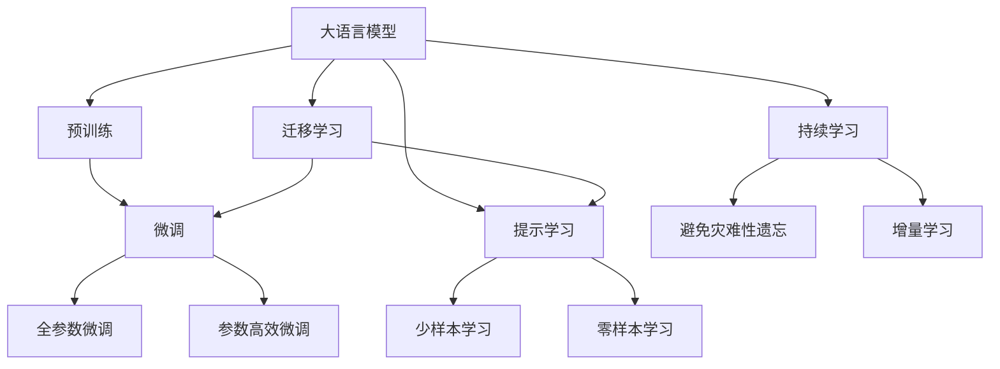
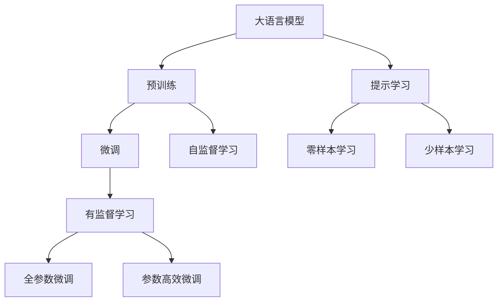
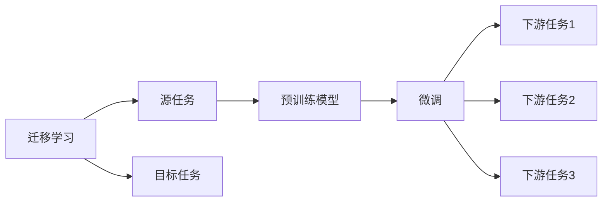
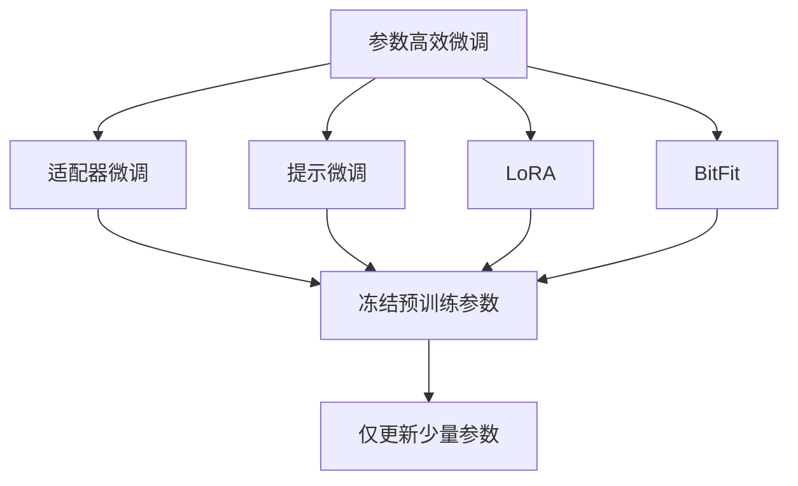
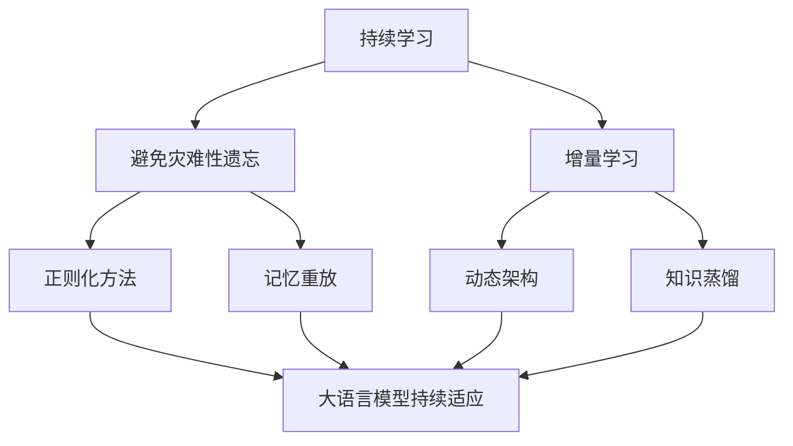

                 

# 大语言模型原理基础与前沿 针对不同预训练领域的不同专家

> 关键词：大语言模型,Transformer,BERT,预训练,微调,自监督学习,神经网络,自然语言处理(NLP)

## 1. 背景介绍

### 1.1 问题由来
近年来，深度学习技术在人工智能领域取得了显著进展，特别是自然语言处理(NLP)领域。大语言模型，如BERT、GPT等，基于大规模无标签文本数据进行预训练，学习到了丰富的语言知识。然而，这些模型在不同领域的应用效果仍然参差不齐。

为什么同一个大语言模型，在不同领域的表现会有如此大的差异呢？这背后隐藏着复杂的技术问题。本文将探讨大语言模型的原理与前沿，特别是针对不同预训练领域的专业人士，帮助他们更好地理解并利用这些模型。

### 1.2 问题核心关键点
本文聚焦于大语言模型的预训练和微调，探讨其在不同领域的应用。核心内容包括：

- 大语言模型的预训练原理：如何通过大规模无标签数据学习语言模型？
- 大语言模型的微调方法：如何通过少量标注数据提升模型在特定领域的表现？
- 大语言模型的应用领域：在哪些领域，大语言模型已经展现了优势，未来还有哪些潜在应用？

### 1.3 问题研究意义
研究大语言模型的预训练和微调方法，对于拓展大语言模型应用范围，提升下游任务性能，加速NLP技术的产业化进程，具有重要意义：

1. 降低应用开发成本。利用预训练模型进行微调，可以显著减少从头开发所需的数据、计算和人力等成本投入。
2. 提升模型效果。微调使得通用大模型更好地适应特定任务，在应用场景中取得更优表现。
3. 加速开发进度。standing on the shoulders of giants，微调使得开发者可以更快地完成任务适配，缩短开发周期。
4. 带来技术创新。微调范式促进了对预训练-微调的深入研究，催生了提示学习、少样本学习等新的研究方向。
5. 赋能产业升级。微调使得NLP技术更容易被各行各业所采用，为传统行业数字化转型升级提供新的技术路径。

## 2. 核心概念与联系

### 2.1 核心概念概述

为更好地理解大语言模型的预训练和微调方法，本节将介绍几个关键概念：

- 大语言模型(Large Language Model, LLM)：如BERT、GPT等，基于自回归(如GPT)或自编码(如BERT)模型，在大规模无标签文本语料上进行预训练，学习通用的语言表示。
- 预训练(Pre-training)：通过在大规模无标签文本数据上进行自监督学习任务，训练通用语言模型。常见的预训练任务包括掩码语言模型、预测下一个词等。
- 微调(Fine-tuning)：在预训练模型的基础上，使用下游任务的少量标注数据，通过有监督学习优化模型在特定任务上的性能。
- 自监督学习(Self-supervised Learning)：通过无标签数据进行学习，如掩码语言模型、句子嵌入等。
- 迁移学习(Transfer Learning)：将一个领域学习到的知识，迁移应用到另一个不同但相关的领域的学习范式。
- 参数高效微调(Parameter-Efficient Fine-tuning, PEFT)：只更新少量的模型参数，而固定大部分预训练权重不变。
- 提示学习(Prompt Learning)：通过在输入文本中添加提示模板，引导模型按期望方式输出，减少微调参数。
- 少样本学习(Few-shot Learning)：在只有少量标注样本的情况下，模型能够快速适应新任务的学习方法。
- 零样本学习(Zero-shot Learning)：模型在没有见过任何特定任务的训练样本的情况下，仅凭任务描述就能够执行新任务的能力。
- 持续学习(Continual Learning)：模型能够持续从新数据中学习，同时保持已学习的知识，而不会出现灾难性遗忘。

这些核心概念之间的逻辑关系可以通过以下Mermaid流程图来展示：



这个流程图展示了大语言模型的核心概念及其之间的关系：

1. 大语言模型通过预训练获得基础能力。
2. 微调是对预训练模型进行任务特定的优化，可以分为全参数微调和参数高效微调（PEFT）。
3. 提示学习是一种不更新模型参数的方法，可以实现少样本学习和零样本学习。
4. 迁移学习是连接预训练模型与下游任务的桥梁，可以通过微调或提示学习来实现。
5. 持续学习旨在使模型能够不断学习新知识，同时避免遗忘旧知识。

这些核心概念共同构成了大语言模型的学习和应用框架，使其能够在各种场景下发挥强大的语言理解和生成能力。通过理解这些核心概念，我们可以更好地把握大语言模型的工作原理和优化方向。

### 2.2 概念间的关系

这些核心概念之间存在着紧密的联系，形成了大语言模型的完整生态系统。下面我们通过几个Mermaid流程图来展示这些概念之间的关系。

#### 2.2.1 大语言模型的学习范式



这个流程图展示了大语言模型的三种主要学习范式：预训练、微调和提示学习。预训练主要采用自监督学习方法，而微调则是有监督学习的过程。提示学习可以实现零样本和少样本学习。微调又可以分为全参数微调和参数高效微调两种方式。

#### 2.2.2 迁移学习与微调的关系



这个流程图展示了迁移学习的基本原理，以及它与微调的关系。迁移学习涉及源任务和目标任务，预训练模型在源任务上学习，然后通过微调适应各种下游任务（目标任务）。

#### 2.2.3 参数高效微调方法



这个流程图展示了几种常见的参数高效微调方法，包括适配器微调、提示微调、LoRA和BitFit。这些方法的共同特点是冻结大部分预训练参数，只更新少量参数，从而提高微调效率。

#### 2.2.4 持续学习在大语言模型中的应用



这个流程图展示了持续学习在大语言模型中的应用。持续学习的主要目标是避免灾难性遗忘和实现增量学习。通过正则化方法、记忆重放、动态架构和知识蒸馏等技术，可以使大语言模型持续适应新的任务和数据。

## 3. 核心算法原理 & 具体操作步骤

### 3.1 算法原理概述

大语言模型的预训练和微调方法，本质上是一个有监督的细粒度迁移学习过程。其核心思想是：将预训练的大语言模型视作一个强大的"特征提取器"，通过在下游任务的少量标注数据上进行有监督的微调，使得模型输出能够匹配任务标签，从而获得针对特定任务优化的模型。

形式化地，假设预训练模型为 $M_{\theta}$，其中 $\theta$ 为预训练得到的模型参数。给定下游任务 $T$ 的标注数据集 $D=\{(x_i, y_i)\}_{i=1}^N$，微调的目标是找到新的模型参数 $\hat{\theta}$，使得：

$$
\hat{\theta}=\mathop{\arg\min}_{\theta} \mathcal{L}(M_{\theta},D)
$$

其中 $\mathcal{L}$ 为针对任务 $T$ 设计的损失函数，用于衡量模型预测输出与真实标签之间的差异。常见的损失函数包括交叉熵损失、均方误差损失等。

通过梯度下降等优化算法，微调过程不断更新模型参数 $\theta$，最小化损失函数 $\mathcal{L}$，使得模型输出逼近真实标签。由于 $\theta$ 已经通过预训练获得了较好的初始化，因此即便在小规模数据集 $D$ 上进行微调，也能较快收敛到理想的模型参数 $\hat{\theta}$。

### 3.2 算法步骤详解

大语言模型的预训练和微调一般包括以下几个关键步骤：

**Step 1: 准备预训练模型和数据集**
- 选择合适的预训练语言模型 $M_{\theta}$ 作为初始化参数，如 BERT、GPT 等。
- 准备下游任务 $T$ 的标注数据集 $D$，划分为训练集、验证集和测试集。一般要求标注数据与预训练数据的分布不要差异过大。

**Step 2: 添加任务适配层**
- 根据任务类型，在预训练模型顶层设计合适的输出层和损失函数。
- 对于分类任务，通常在顶层添加线性分类器和交叉熵损失函数。
- 对于生成任务，通常使用语言模型的解码器输出概率分布，并以负对数似然为损失函数。

**Step 3: 设置微调超参数**
- 选择合适的优化算法及其参数，如 AdamW、SGD 等，设置学习率、批大小、迭代轮数等。
- 设置正则化技术及强度，包括权重衰减、Dropout、Early Stopping 等。
- 确定冻结预训练参数的策略，如仅微调顶层，或全部参数都参与微调。

**Step 4: 执行梯度训练**
- 将训练集数据分批次输入模型，前向传播计算损失函数。
- 反向传播计算参数梯度，根据设定的优化算法和学习率更新模型参数。
- 周期性在验证集上评估模型性能，根据性能指标决定是否触发 Early Stopping。
- 重复上述步骤直到满足预设的迭代轮数或 Early Stopping 条件。

**Step 5: 测试和部署**
- 在测试集上评估微调后模型 $M_{\hat{\theta}}$ 的性能，对比微调前后的精度提升。
- 使用微调后的模型对新样本进行推理预测，集成到实际的应用系统中。
- 持续收集新的数据，定期重新微调模型，以适应数据分布的变化。

以上是预训练和微调大语言模型的一般流程。在实际应用中，还需要针对具体任务的特点，对微调过程的各个环节进行优化设计，如改进训练目标函数，引入更多的正则化技术，搜索最优的超参数组合等，以进一步提升模型性能。

### 3.3 算法优缺点

大语言模型的预训练和微调方法具有以下优点：
1. 简单高效。只需准备少量标注数据，即可对预训练模型进行快速适配，获得较大的性能提升。
2. 通用适用。适用于各种NLP下游任务，包括分类、匹配、生成等，设计简单的任务适配层即可实现微调。
3. 参数高效。利用参数高效微调技术，在固定大部分预训练参数的情况下，仍可取得不错的提升。
4. 效果显著。在学术界和工业界的诸多任务上，基于微调的方法已经刷新了最先进的性能指标。

同时，该方法也存在一定的局限性：
1. 依赖标注数据。微调的效果很大程度上取决于标注数据的质量和数量，获取高质量标注数据的成本较高。
2. 迁移能力有限。当目标任务与预训练数据的分布差异较大时，微调的性能提升有限。
3. 负面效果传递。预训练模型的固有偏见、有害信息等，可能通过微调传递到下游任务，造成负面影响。
4. 可解释性不足。微调模型的决策过程通常缺乏可解释性，难以对其推理逻辑进行分析和调试。

尽管存在这些局限性，但就目前而言，基于预训练-微调的迁移学习方法仍是大语言模型应用的主流范式。未来相关研究的重点在于如何进一步降低预训练-微调对标注数据的依赖，提高模型的少样本学习和跨领域迁移能力，同时兼顾可解释性和伦理安全性等因素。

### 3.4 算法应用领域

基于大语言模型预训练和微调的方法，在NLP领域已经得到了广泛的应用，覆盖了几乎所有常见任务，例如：

- 文本分类：如情感分析、主题分类、意图识别等。通过微调使模型学习文本-标签映射。
- 命名实体识别：识别文本中的人名、地名、机构名等特定实体。通过微调使模型掌握实体边界和类型。
- 关系抽取：从文本中抽取实体之间的语义关系。通过微调使模型学习实体-关系三元组。
- 问答系统：对自然语言问题给出答案。将问题-答案对作为微调数据，训练模型学习匹配答案。
- 机器翻译：将源语言文本翻译成目标语言。通过微调使模型学习语言-语言映射。
- 文本摘要：将长文本压缩成简短摘要。将文章-摘要对作为微调数据，使模型学习抓取要点。
- 对话系统：使机器能够与人自然对话。将多轮对话历史作为上下文，微调模型进行回复生成。

除了上述这些经典任务外，大语言模型预训练和微调也被创新性地应用到更多场景中，如可控文本生成、常识推理、代码生成、数据增强等，为NLP技术带来了全新的突破。随着预训练模型和微调方法的不断进步，相信NLP技术将在更广阔的应用领域大放异彩。

## 4. 数学模型和公式 & 详细讲解  
### 4.1 数学模型构建

本节将使用数学语言对大语言模型的预训练和微调过程进行更加严格的刻画。

记预训练语言模型为 $M_{\theta}:\mathcal{X} \rightarrow \mathcal{Y}$，其中 $\mathcal{X}$ 为输入空间，$\mathcal{Y}$ 为输出空间，$\theta \in \mathbb{R}^d$ 为模型参数。假设预训练语言模型 $M_{\theta}$ 在数据集 $D=\{(x_i,y_i)\}_{i=1}^N$ 上的预训练损失为：

$$
\mathcal{L}(\theta) = \frac{1}{N} \sum_{i=1}^N \ell(M_{\theta}(x_i),y_i)
$$

其中 $\ell$ 为预训练任务定义的损失函数。常见的预训练任务包括掩码语言模型、预测下一个词等。

在预训练完成后，对下游任务 $T$ 进行微调。假设微调任务的训练集为 $D_T=\{(x_i,y_i)\}_{i=1}^N$，其中 $x_i$ 为输入，$y_i$ 为标签。定义模型 $M_{\theta}$ 在输入 $x$ 上的输出为 $M_{\theta}(x)$，定义任务 $T$ 的损失函数为 $\ell_T(M_{\theta}(x),y)$。微调的目标是最小化任务 $T$ 上的损失函数，即找到最优参数：

$$
\hat{\theta}=\mathop{\arg\min}_{\theta} \mathcal{L}_T(M_{\theta})
$$

在实践中，我们通常使用基于梯度的优化算法（如SGD、Adam等）来近似求解上述最优化问题。设 $\eta$ 为学习率，$\lambda$ 为正则化系数，则参数的更新公式为：

$$
\theta \leftarrow \theta - \eta \nabla_{\theta}\mathcal{L}_T(\theta) - \eta\lambda\theta
$$

其中 $\nabla_{\theta}\mathcal{L}_T(\theta)$ 为任务 $T$ 上的损失函数对参数 $\theta$ 的梯度，可通过反向传播算法高效计算。

### 4.2 公式推导过程

以下我们以二分类任务为例，推导交叉熵损失函数及其梯度的计算公式。

假设模型 $M_{\theta}$ 在输入 $x$ 上的输出为 $\hat{y}=M_{\theta}(x) \in [0,1]$，表示样本属于正类的概率。真实标签 $y \in \{0,1\}$。则二分类交叉熵损失函数定义为：

$$
\ell(M_{\theta}(x),y) = -[y\log \hat{y} + (1-y)\log (1-\hat{y})]
$$

将其代入任务损失公式，得：

$$
\mathcal{L}_T(\theta) = -\frac{1}{N}\sum_{i=1}^N [y_i\log M_{\theta}(x_i)+(1-y_i)\log(1-M_{\theta}(x_i))]
$$

根据链式法则，任务损失函数对参数 $\theta_k$ 的梯度为：

$$
\frac{\partial \mathcal{L}_T(\theta)}{\partial \theta_k} = -\frac{1}{N}\sum_{i=1}^N (\frac{y_i}{M_{\theta}(x_i)}-\frac{1-y_i}{1-M_{\theta}(x_i)}) \frac{\partial M_{\theta}(x_i)}{\partial \theta_k}
$$

其中 $\frac{\partial M_{\theta}(x_i)}{\partial \theta_k}$ 可进一步递归展开，利用自动微分技术完成计算。

在得到任务损失函数的梯度后，即可带入参数更新公式，完成模型的迭代优化。重复上述过程直至收敛，最终得到适应下游任务的最优模型参数 $\hat{\theta}$。

## 5. 项目实践：代码实例和详细解释说明
### 5.1 开发环境搭建

在进行预训练和微调实践前，我们需要准备好开发环境。以下是使用Python进行PyTorch开发的环境配置流程：

1. 安装Anaconda：从官网下载并安装Anaconda，用于创建独立的Python环境。

2. 创建并激活虚拟环境：
```bash
conda create -n pytorch-env python=3.8 
conda activate pytorch-env
```

3. 安装PyTorch：根据CUDA版本，从官网获取对应的安装命令。例如：
```bash
conda install pytorch torchvision torchaudio cudatoolkit=11.1 -c pytorch -c conda-forge
```

4. 安装Transformers库：
```bash
pip install transformers
```

5. 安装各类工具包：
```bash
pip install numpy pandas scikit-learn matplotlib tqdm jupyter notebook ipython
```

完成上述步骤后，即可在`pytorch-env`环境中开始预训练和微调实践。

### 5.2 源代码详细实现

这里我们以BERT模型为例，给出使用PyTorch进行预训练和微调的完整代码实现。

首先，定义BERT模型的预训练和微调任务：

```python
from transformers import BertModel, BertTokenizer, AdamW

# 定义BERT模型
model = BertModel.from_pretrained('bert-base-cased')

# 定义标签集合
label_set = ['A', 'B', 'C', 'D']

# 定义BERT分词器
tokenizer = BertTokenizer.from_pretrained('bert-base-cased')

# 定义优化器
optimizer = AdamW(model.parameters(), lr=2e-5)

# 定义交叉熵损失函数
loss_fn = nn.CrossEntropyLoss()
```

然后，定义预训练和微调的函数：

```python
from torch.utils.data import Dataset, DataLoader
from tqdm import tqdm

class CustomDataset(Dataset):
    def __init__(self, text_data, labels):
        self.text_data = text_data
        self.labels = labels
        
    def __len__(self):
        return len(self.text_data)
    
    def __getitem__(self, idx):
        text = self.text_data[idx]
        label = self.labels[idx]
        encoding = tokenizer(text, return_tensors='pt', padding=True, truncation=True)
        input_ids = encoding['input_ids']
        attention_mask = encoding['attention_mask']
        return {'input_ids': input_ids, 'attention_mask': attention_mask, 'labels': label}

# 定义预训练函数
def train_pretraining(model, dataset, batch_size, optimizer):
    dataloader = DataLoader(dataset, batch_size=batch_size, shuffle=True)
    model.train()
    for batch in dataloader:
        input_ids = batch['input_ids'].to(device)
        attention_mask = batch['attention_mask'].to(device)
        labels = batch['labels'].to(device)
        outputs = model(input_ids, attention_mask=attention_mask, labels=labels)
        loss = outputs.loss
        loss.backward()
        optimizer.step()

# 定义微调函数
def train_fine_tuning(model, dataset, batch_size, optimizer):
    dataloader = DataLoader(dataset, batch_size=batch_size, shuffle=True)
    model.train()
    for batch in dataloader:
        input_ids = batch['input_ids'].to(device)
        attention_mask = batch['attention_mask'].to(device)
        labels = batch['labels'].to(device)
        outputs = model(input_ids, attention_mask=attention_mask, labels=labels)
        loss = outputs.loss
        loss.backward()
        optimizer.step()
```

最后，启动预训练和微调流程：

```python
from transformers import BertForSequenceClassification

# 定义微调模型
model = BertForSequenceClassification.from_pretrained('bert-base-cased', num_labels=len(label_set))

# 定义训练集和测试集
train_dataset = CustomDataset(train_texts, train_labels)
test_dataset = CustomDataset(test_texts, test_labels)

# 定义预训练和微调轮次
pretraining_epochs = 5
fine_tuning_epochs = 5
batch_size = 16

# 进行预训练
for epoch in range(pretraining_epochs):
    train_pretraining(model, train_dataset, batch_size, optimizer)
    
# 进行微调
for epoch in range(fine_tuning_epochs):
    train_fine_tuning(model, train_dataset, batch_size, optimizer)
    
# 在测试集上评估微调后的模型
with torch.no_grad():
    test_loss = 0
    test_corrects = 0
    for batch in test_dataset:
        input_ids = batch['input_ids'].to(device)
        attention_mask = batch['attention_mask'].to(device)
        labels = batch['labels'].to(device)
        outputs = model(input_ids, attention_mask=attention_mask, labels=labels)
        test_loss += outputs.loss.item()
        test_corrects += outputs.logits.argmax(dim=1).eq(labels).sum().item()
    
    test_loss /= len(test_dataset)
    test_acc = test_corrects / len(test_dataset)
    print(f"Test Loss: {test_loss:.4f}, Test Acc: {test_acc:.4f}")
```

以上就是使用PyTorch对BERT进行预训练和微调的完整代码实现。可以看到，得益于Transformers库的强大封装，我们可以用相对简洁的代码完成BERT模型的预训练和微调。

### 5.3 代码解读与分析

让我们再详细解读一下关键代码的实现细节：

**CustomDataset类**：
- `__init__`方法：初始化文本和标签等关键组件。
- `__len__`方法：返回数据集的样本数量。
- `__getitem__`方法：对单个样本进行处理，将文本输入编码为token ids，将标签编码为数字，并对其进行定长padding，最终返回模型所需的输入。

**BertForSequenceClassification模型**：
- 通过调用`BertForSequenceClassification`函数，从预训练模型中初始化分类器，设置标签数量。

**pretraining_epochs和fine_tuning_epochs变量**：
- 定义预训练和微调轮次，循环迭代训练。

**optimizer变量**：
- 定义AdamW优化器，设置学习率。

**loss_fn变量**：
- 定义交叉熵损失函数，用于计算模型预测输出与真实标签之间的差异。

**train_pretraining和train_fine_tuning函数**：
- 在训练集中进行预训练和微调，更新模型参数。

**test_dataset变量**：
- 定义测试集，用于评估微调后模型的性能。

**test_loss和test_corrects变量**：
- 在测试集中计算模型损失和准确率。

**训练流程**：
- 预训练和微调分别循环迭代多次，每次训练后输出损失和准确率。
- 在测试集上评估微调后模型，输出测试结果。

可以看到，PyTorch配合Transformers库使得BERT的预训练和微调代码实现变得简洁高效。开发者可以将更多精力放在数据处理、模型改进等高层

