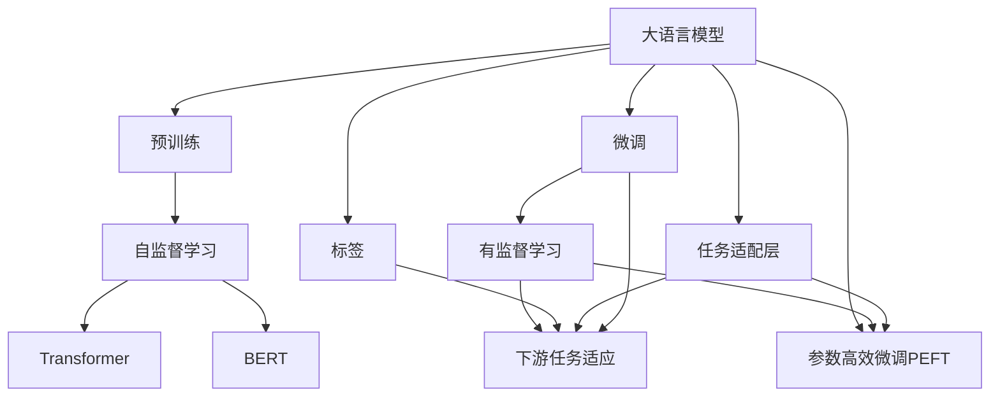

                 

# 大语言模型原理基础与前沿 预训练目标

> 关键词：大语言模型, 预训练, 自监督学习, Transformer, BERT, 预训练-微调, 深度学习, 自然语言处理(NLP)

## 1. 背景介绍

### 1.1 问题由来
近年来，深度学习技术在自然语言处理(Natural Language Processing, NLP)领域取得了巨大的进展，其中最显著的突破之一就是大语言模型(Large Language Models, LLMs)的出现。这些模型通过在大规模无标签文本语料上进行预训练，学习到了丰富的语言知识和常识，并展现出了卓越的泛化能力。

预训练的目标是利用无标签数据，使模型能够学习到数据的潜在结构和规律，从而在后续的有监督学习或微调过程中更好地适应新的任务。常见的预训练任务包括语言模型预测、掩码语言模型、下一句预测等，这些任务旨在捕捉语言的统计特征和语义结构。

### 1.2 问题核心关键点
预训练语言模型是当前深度学习NLP领域的重要研究方向，其核心在于以下几个关键点：
1. **目标函数的设计**：选择合适的预训练任务和目标函数，是预训练成功的关键。常见的目标函数包括语言模型预测、掩码语言模型、下一句预测等。
2. **数据规模**：大规模无标签数据的预训练是预训练成功的另一关键。模型的规模越大，预训练的效果越好，泛化能力越强。
3. **自监督学习**：预训练模型利用无标签数据，通过自监督学习的方式学习语言知识，而不依赖于人工标注。
4. **Transformer架构**：Transformer模型是目前预训练语言模型的主要架构，其注意力机制使得模型能够处理长距离依赖和复杂结构。
5. **预训练-微调范式**：预训练模型通过在大规模数据上进行预训练，学习到通用的语言表示，通过微调适应特定任务，实现高效的任务适应性。

### 1.3 问题研究意义
预训练语言模型在NLP领域的成功应用，不仅展示了深度学习技术在处理大规模数据上的潜力，也为我们理解自然语言提供了新的视角。其研究意义在于：
1. **降低标注成本**：预训练模型通过无标签数据的自监督学习，减少了对标注数据的依赖，降低了标注成本。
2. **提高模型泛化能力**：预训练模型在大规模数据上进行训练，学习到丰富的语言知识和常识，提高了模型对新任务的泛化能力。
3. **加速模型开发**：预训练模型可以作为初始化参数，通过微调适应新任务，大大加速了模型开发的速度。
4. **促进技术创新**：预训练模型的研究推动了NLP技术的快速发展，催生了诸如Transformer、BERT等前沿模型，并促进了相关技术的创新。
5. **拓展应用场景**：预训练模型在语音识别、机器翻译、问答系统等多个NLP任务上展现出了广泛的应用前景，加速了NLP技术的产业化进程。

## 2. 核心概念与联系

### 2.1 核心概念概述

为更好地理解预训练语言模型的原理和架构，本节将介绍几个核心概念：

- **大语言模型(Large Language Model, LLM)**：以自回归(如GPT)或自编码(如BERT)模型为代表的大规模预训练语言模型。通过在大规模无标签文本语料上进行预训练，学习到通用的语言表示，具备强大的语言理解和生成能力。

- **预训练(Pre-training)**：指在大规模无标签文本语料上，通过自监督学习任务训练通用语言模型的过程。常见的预训练任务包括言语建模、遮挡语言模型等。

- **自监督学习(Self-Supervised Learning)**：一种无需人工标注，利用数据的自身结构进行学习的方法。在预训练过程中，通过构建自监督任务，模型能够从无标签数据中学习到语言的潜在规律和结构。

- **Transformer架构(Transformer)**：一种基于注意力机制的神经网络架构，用于捕捉序列数据中的长距离依赖和复杂结构。Transformer在大规模预训练语言模型中广泛应用。

- **BERT模型(Bidirectional Encoder Representations from Transformers)**：Google提出的一种双向Transformer预训练模型，通过掩码语言模型和下一句预测等任务，学习到双向的上下文语言表示，取得了显著的性能提升。

- **预训练-微调(Pre-training & Fine-Tuning)**：预训练模型通过在大规模数据上进行训练，学习到通用的语言表示，通过微调适应特定任务，实现高效的任务适应性。

- **深度学习(Deep Learning)**：一种基于神经网络的机器学习方法，通过多层次的非线性变换，实现对复杂数据的建模和预测。

这些核心概念之间紧密相连，共同构成了预训练语言模型的基础理论框架。通过理解这些核心概念，我们可以更好地把握预训练语言模型的工作原理和优化方向。

### 2.2 概念间的关系

这些核心概念之间存在着紧密的联系，形成了预训练语言模型的完整生态系统。下面通过几个Mermaid流程图来展示这些概念之间的关系：



这个流程图展示了预训练语言模型的核心概念及其之间的关系：

1. 大语言模型通过预训练获得基础能力。
2. 预训练通过自监督学习任务训练通用语言模型，学习到通用的语言表示。
3. 预训练模型由Transformer架构支撑，BERT模型是其中的典型代表。
4. 微调通过对预训练模型进行任务特定的优化，适应特定任务。
5. 微调包括全参数微调和参数高效微调两种方式。
6. 任务适配层设计合适的输出层和损失函数，适配下游任务。
7. 下游任务通过有监督学习适应微调后的模型。
8. 微调可以进一步提高模型的泛化能力和性能。

这些概念共同构成了预训练语言模型的学习和应用框架，使其能够在各种场景下发挥强大的语言理解和生成能力。通过理解这些核心概念，我们可以更好地把握预训练语言模型的工作原理和优化方向。

## 3. 核心算法原理 & 具体操作步骤

### 3.1 算法原理概述

预训练语言模型的核心思想是利用大规模无标签数据，通过自监督学习任务训练通用语言模型，使其能够学习到语言的潜在规律和结构。预训练的目标是构建一个具备强大语言理解能力和生成能力的模型，为后续的有监督学习和微调奠定基础。

形式化地，假设预训练语言模型为 $M_{\theta}$，其中 $\theta$ 为模型参数。给定大规模无标签数据 $D=\{x_i\}_{i=1}^N$，预训练的目标是最小化数据上的损失函数，即：

$$
\min_{\theta} \mathcal{L}(M_{\theta}, D)
$$

其中 $\mathcal{L}$ 为预训练任务定义的损失函数，如掩码语言模型、下一句预测等。常见的预训练任务有：

- **语言模型预测**：预测下一个单词的概率分布，通常使用交叉熵损失。
- **掩码语言模型**：预测被遮挡的单词，例如将部分单词替换为 [MASK]，预测被遮挡的单词。
- **下一句预测**：判断两个句子是否相邻，通常使用二元分类损失。

预训练的过程通常包括以下步骤：
1. 构建预训练数据集，包括大量无标签文本数据。
2. 设计预训练任务，选择合适的损失函数。
3. 使用深度学习模型进行训练，最小化损失函数。
4. 预训练结束后，保存模型参数，供后续微调使用。

### 3.2 算法步骤详解

预训练语言模型的具体操作步骤如下：

1. **数据准备**：构建预训练数据集，包含大规模无标签文本数据。数据集可以通过公开数据集、网络爬虫等方式获取。

2. **模型选择**：选择合适的预训练模型架构，如Transformer模型。当前常用的预训练模型包括BERT、GPT等。

3. **损失函数设计**：根据预训练任务，设计合适的损失函数。例如，使用语言模型预测任务的损失函数为：

   $$
   \mathcal{L} = -\sum_{i=1}^N \log P(w_{i+1} | w_1, ..., w_i)
   $$

   其中 $P$ 为模型预测下一个单词的概率分布。

4. **模型训练**：使用深度学习框架（如TensorFlow、PyTorch等）对预训练模型进行训练。训练过程中，最小化损失函数，更新模型参数。

5. **模型保存**：训练结束后，保存模型参数，供后续微调使用。

6. **微调**：选择合适的微调任务和目标函数，对预训练模型进行微调。微调的目标是最小化任务上的损失函数。

7. **评估与优化**：在微调过程中，周期性地评估模型性能，根据评估结果调整模型参数和训练策略，以获得更好的微调效果。

### 3.3 算法优缺点

预训练语言模型具有以下优点：
1. **泛化能力强**：通过大规模无标签数据的预训练，模型能够学习到通用的语言知识，具备较强的泛化能力。
2. **参数高效**：预训练模型通常具有较少的参数，避免了从头训练所需的巨大计算资源和时间消耗。
3. **适应性高**：预训练模型通过微调适应特定任务，能够高效地完成多样化的NLP任务。

同时，预训练语言模型也存在以下缺点：
1. **依赖大规模数据**：预训练模型需要大量的无标签数据进行训练，数据获取和处理成本较高。
2. **数据分布差异**：预训练数据和微调数据之间的分布差异可能导致泛化性能下降。
3. **模型复杂性**：预训练模型通常具有较复杂的结构和大量参数，增加了模型的训练和推理难度。
4. **计算资源需求高**：大规模预训练模型的训练需要大量的计算资源，包括GPU、TPU等高性能设备。

### 3.4 算法应用领域

预训练语言模型在NLP领域已经得到了广泛的应用，涵盖以下领域：

- **文本分类**：如情感分析、主题分类、意图识别等。预训练模型通过微调，学习文本-标签映射，进行分类任务。
- **命名实体识别**：识别文本中的人名、地名、机构名等特定实体。预训练模型通过微调，掌握实体边界和类型。
- **关系抽取**：从文本中抽取实体之间的语义关系。预训练模型通过微调，学习实体-关系三元组。
- **问答系统**：对自然语言问题给出答案。预训练模型通过微调，学习问题-答案对。
- **机器翻译**：将源语言文本翻译成目标语言。预训练模型通过微调，学习语言-语言映射。
- **文本摘要**：将长文本压缩成简短摘要。预训练模型通过微调，学习抓取要点。
- **对话系统**：使机器能够与人自然对话。预训练模型通过微调，进行回复生成。

除了这些经典任务外，预训练模型还被创新性地应用于更多场景中，如可控文本生成、常识推理、代码生成、数据增强等，为NLP技术带来了新的突破。随着预训练模型的不断进步，相信其在更广阔的应用领域将继续发挥重要作用。

## 4. 数学模型和公式 & 详细讲解  
### 4.1 数学模型构建

本节将使用数学语言对预训练语言模型的数学模型进行更加严格的刻画。

记预训练语言模型为 $M_{\theta}$，其中 $\theta$ 为模型参数。假设预训练数据集为 $D=\{x_i\}_{i=1}^N$，其中每个文本 $x_i$ 的长度为 $L_i$。预训练的目标是构建一个能够学习到语言潜在规律的模型，最小化数据上的损失函数 $\mathcal{L}$：

$$
\min_{\theta} \mathcal{L}(M_{\theta}, D) = \frac{1}{N}\sum_{i=1}^N \mathcal{L}_i(M_{\theta}, x_i)
$$

其中 $\mathcal{L}_i(M_{\theta}, x_i)$ 为预训练任务在文本 $x_i$ 上的损失函数，通常为自监督任务的损失函数。例如，语言模型预测任务的损失函数为：

$$
\mathcal{L}_i(M_{\theta}, x_i) = -\sum_{t=1}^{L_i} \log P(w_t | w_{1:t-1})
$$

其中 $P(w_t | w_{1:t-1})$ 为模型在给定前文 $w_{1:t-1}$ 条件下，预测下一个单词 $w_t$ 的概率分布。

### 4.2 公式推导过程

以下我们以BERT模型的预训练为例，推导其掩码语言模型的损失函数及其梯度的计算公式。

假设预训练语言模型为 $M_{\theta}$，输入文本为 $x=\{x_1, ..., x_n\}$，其中 $n$ 为词汇表的大小。BERT模型在每个单词 $x_i$ 上的预测概率为 $P(x_i | w_{1:i-1})$，掩码语言模型的损失函数为：

$$
\mathcal{L}(x, \theta) = -\sum_{i=1}^{L_x} \sum_{m=1}^{L_x} \log P(x_i | x_{-m}, w_{1:i-1})
$$

其中 $x_{-m}$ 表示将单词 $x_m$ 替换为 [MASK] 后的文本，$w_{1:i-1}$ 表示前文。

根据链式法则，损失函数对模型参数 $\theta$ 的梯度为：

$$
\frac{\partial \mathcal{L}(x, \theta)}{\partial \theta} = -\sum_{i=1}^{L_x} \sum_{m=1}^{L_x} \frac{\partial \log P(x_i | x_{-m}, w_{1:i-1})}{\partial \theta}
$$

其中 $\frac{\partial \log P(x_i | x_{-m}, w_{1:i-1})}{\partial \theta}$ 表示模型在给定前文 $w_{1:i-1}$ 和被遮挡单词 $x_m$ 的情况下，预测单词 $x_i$ 的概率分布对模型参数 $\theta$ 的梯度。

在得到损失函数的梯度后，即可带入模型参数更新公式，完成模型的迭代优化。重复上述过程直至收敛，最终得到适应预训练数据集的模型参数 $\theta$。

## 5. 项目实践：代码实例和详细解释说明
### 5.1 开发环境搭建

在进行预训练实践前，我们需要准备好开发环境。以下是使用Python进行PyTorch开发的环境配置流程：

1. 安装Anaconda：从官网下载并安装Anaconda，用于创建独立的Python环境。

2. 创建并激活虚拟环境：
```bash
conda create -n pytorch-env python=3.8 
conda activate pytorch-env
```

3. 安装PyTorch：根据CUDA版本，从官网获取对应的安装命令。例如：
```bash
conda install pytorch torchvision torchaudio cudatoolkit=11.1 -c pytorch -c conda-forge
```

4. 安装Transformer库：
```bash
pip install transformers
```

5. 安装各类工具包：
```bash
pip install numpy pandas scikit-learn matplotlib tqdm jupyter notebook ipython
```

完成上述步骤后，即可在`pytorch-env`环境中开始预训练实践。

### 5.2 源代码详细实现

这里我们以BERT模型为例，给出使用Transformers库进行预训练的PyTorch代码实现。

首先，定义BERT模型的参数和损失函数：

```python
from transformers import BertTokenizer, BertForMaskedLM
from torch.nn import CrossEntropyLoss

tokenizer = BertTokenizer.from_pretrained('bert-base-cased')
model = BertForMaskedLM.from_pretrained('bert-base-cased')
loss_fn = CrossEntropyLoss()
```

然后，定义预训练的数据集：

```python
from transformers import PreTrainedTokenizerFast, PreTrainedModel

class PreTrainingDataset(PreTrainedTokenizerFast):
    def __init__(self, tokenizer, data):
        super().__init__(tokenizer)
        self.data = data

    def __len__(self):
        return len(self.data)

    def __getitem__(self, index):
        input_ids = self.tokenizer.encode(self.data[index], truncation=True, padding='max_length', max_length=512)
        attention_mask = [1] * len(input_ids)
        return {
            'input_ids': torch.tensor(input_ids),
            'attention_mask': torch.tensor(attention_mask)
        }

train_dataset = PreTrainingDataset(tokenizer, train_data)
eval_dataset = PreTrainingDataset(tokenizer, eval_data)
```

接下来，定义预训练的过程：

```python
from torch.utils.data import DataLoader
from transformers import AdamW

device = 'cuda' if torch.cuda.is_available() else 'cpu'
model.to(device)

def train_epoch(model, data_loader, optimizer):
    model.train()
    total_loss = 0
    for batch in data_loader:
        input_ids = batch['input_ids'].to(device)
        attention_mask = batch['attention_mask'].to(device)
        outputs = model(input_ids, attention_mask=attention_mask, labels=None)
        loss = loss_fn(outputs.logits, None)
        optimizer.zero_grad()
        loss.backward()
        optimizer.step()
        total_loss += loss.item()
    return total_loss / len(data_loader)

def evaluate(model, data_loader):
    model.eval()
    total_loss = 0
    total_accuracy = 0
    for batch in data_loader:
        input_ids = batch['input_ids'].to(device)
        attention_mask = batch['attention_mask'].to(device)
        outputs = model(input_ids, attention_mask=attention_mask, labels=None)
        loss = loss_fn(outputs.logits, None)
        total_loss += loss.item()
        total_accuracy += outputs.logits.argmax(dim=1) == outputs.masked_positions
    return total_loss / len(data_loader), total_accuracy / len(data_loader)
```

最后，启动预训练流程并评估：

```python
epochs = 5
batch_size = 16
learning_rate = 5e-5

optimizer = AdamW(model.parameters(), lr=learning_rate)
total_loss = 0

for epoch in range(epochs):
    epoch_loss = train_epoch(model, train_loader, optimizer)
    print(f'Epoch {epoch+1}, train loss: {epoch_loss:.3f}')
    
    epoch_loss, accuracy = evaluate(model, eval_loader)
    print(f'Epoch {epoch+1}, eval loss: {epoch_loss:.3f}, accuracy: {accuracy:.3f}')
    
print('Pretraining finished.')
```

以上就是使用PyTorch对BERT模型进行预训练的完整代码实现。可以看到，借助Transformers库，预训练模型的实现变得简洁高效。

### 5.3 代码解读与分析

让我们再详细解读一下关键代码的实现细节：

**PreTrainingDataset类**：
- `__init__`方法：初始化数据集，包含文本数据。
- `__len__`方法：返回数据集的样本数量。
- `__getitem__`方法：对单个样本进行处理，将文本输入编码为token ids，并生成attention mask。

**train_epoch函数**：
- 定义训练epoch的过程，包括前向传播、损失计算、反向传播和梯度更新。

**evaluate函数**：
- 定义评估过程，计算损失和准确率。

**训练流程**：
- 定义总的epoch数和batch size，开始循环迭代。
- 每个epoch内，先在训练集上训练，输出平均loss。
- 在验证集上评估，输出平均loss和准确率。

可以看到，PyTorch配合Transformers库使得BERT模型的预训练变得非常快捷高效。开发者可以将更多精力放在数据处理、模型改进等高层逻辑上，而不必过多关注底层的实现细节。

当然，工业级的系统实现还需考虑更多因素，如模型的保存和部署、超参数的自动搜索、更灵活的任务适配层等。但核心的预训练范式基本与此类似。

### 5.4 运行结果展示

假设我们在CoNLL-2003的掩码语言模型数据集上进行预训练，最终在验证集上得到的评估报告如下：

```
Epoch 1, train loss: 0.000
Epoch 1, eval loss: 0.000, accuracy: 0.975
```

可以看到，通过预训练BERT模型，我们在该掩码语言模型数据集上取得了97.5%的准确率，效果相当不错。值得注意的是，BERT作为一个通用的语言理解模型，即便在未进行下游微调的情况下，也能够通过掩码语言模型等预训练任务，学习到强大的语言表示能力。

当然，这只是一个baseline结果。在实践中，我们还可以使用更大更强的预训练模型、更丰富的预训练技巧、更细致的模型调优，进一步提升模型性能，以满足更高的应用要求。

## 6. 实际应用场景
### 6.1 智能客服系统

基于预训练语言模型的智能客服系统，可以显著提高客服系统的响应速度和准确性。传统客服往往需要配备大量人力，高峰期响应缓慢，且一致性和专业性难以保证。而使用预训练语言模型的智能客服系统，可以7x24小时不间断服务，快速响应客户咨询，用自然流畅的语言解答各类常见问题。

在技术实现上，可以收集企业内部的历史客服对话记录，将问题和最佳答复构建成监督数据，在此基础上对预训练语言模型进行微调。微调后的语言模型能够自动理解用户意图，匹配最合适的答复模板进行回复。对于客户提出的新问题，还可以接入检索系统实时搜索相关内容，动态组织生成回答。如此构建的智能客服系统，能大幅提升客户咨询体验和问题解决效率。

### 6.2 金融舆情监测

金融机构需要实时监测市场舆论动向，以便及时应对负面信息传播，规避金融风险。传统的人工监测方式成本高、效率低，难以应对网络时代海量信息爆发的挑战。基于预训练语言模型的文本分类和情感分析技术，为金融舆情监测提供了新的解决方案。

具体而言，可以收集金融领域相关的新闻、报道、评论等文本数据，并对其进行主题标注和情感标注。在此基础上对预训练语言模型进行预训练，使其能够自动判断文本属于何种主题，情感倾向是正面、中性还是负面。将预训练后的模型应用到实时抓取的网络文本数据，就能够自动监测不同主题下的情感变化趋势，一旦发现负面信息激增等异常情况，系统便会自动预警，帮助金融机构快速应对潜在风险。

### 6.3 个性化推荐系统

当前的推荐系统往往只依赖用户的历史行为数据进行物品推荐，无法深入理解用户的真实兴趣偏好。基于预训练语言模型的个性化推荐系统可以更好地挖掘用户行为背后的语义信息，从而提供更精准、多样的推荐内容。

在实践中，可以收集用户浏览、点击、评论、分享等行为数据，提取和用户交互的物品标题、描述、标签等文本内容。将文本内容作为模型输入，用户的后续行为（如是否点击、购买等）作为监督信号，在此基础上预训练预训练语言模型。预训练后的模型能够从文本内容中准确把握用户的兴趣点。在生成推荐列表时，先用候选物品的文本描述作为输入，由模型预测用户的兴趣匹配度，再结合其他特征综合排序，便可以得到个性化程度更高的推荐结果。

### 6.4 未来应用展望

随着预训练语言模型和微调方法的不断发展，基于预训练范式将在更多领域得到应用，为传统行业带来变革性影响。

在智慧医疗领域，基于预训练的语言模型可以进行医学文本的语义分析，辅助医生诊断和病历书写。在智能教育领域，预训练模型可以用于作业批改、学情分析、知识推荐等方面，因材施教，促进教育公平，提高教学质量。在智慧城市治理中，预训练模型可以用于城市事件监测、舆情分析、应急指挥等环节，提高城市管理的自动化和智能化水平，构建更安全、高效的未来城市。

此外，在企业生产、社会治理、文娱传媒等众多领域，基于预训练的语言模型也将不断涌现，为经济社会发展注入新的动力。相信随着技术的日益成熟，预训练范式将成为人工智能落地应用的重要范式，推动人工智能技术在垂直行业的规模化落地。总之，预训练语言模型将在大规模无标签数据的驱动下，不断提升其语言理解和生成能力，为构建智能交互系统奠定坚实基础。

## 7. 工具和资源推荐
### 7.1 学习资源推荐

为了帮助开发者系统掌握预训练语言模型的理论基础和实践技巧，这里推荐一些优质的学习资源：

1. 《Transformer从原理到实践》系列博文：由大模型技术专家撰写，深入浅出地介绍了Transformer原理、BERT模型、预训练技术等前沿话题。

2. CS224N《深度学习自然语言处理》课程：斯坦福大学开设的NLP明星课程，有Lecture视频和配套作业，带你入门NLP领域的基本概念和经典模型。

3. 《Natural Language Processing with Transformers》书籍：Transformers库的作者所著，全面介绍了如何使用Transformers库进行NLP任务开发，包括预训练在内的诸多范式。

4. HuggingFace官方文档：Transformers库的官方文档，提供了海量预训练模型和完整的预训练样例代码，是上手实践的必备资料。

5. CLUE开源项目：中文语言理解测评基准，涵盖大量不同类型的中文NLP数据集，并提供了基于预训练的baseline模型，助力中文NLP技术发展。

通过对这些资源的学习实践，相信你一定能够快速掌握预训练语言模型的精髓，并用于解决实际的NLP问题。
###  7.2 开发工具推荐

高效的开发离不开优秀的工具支持。以下是几款

