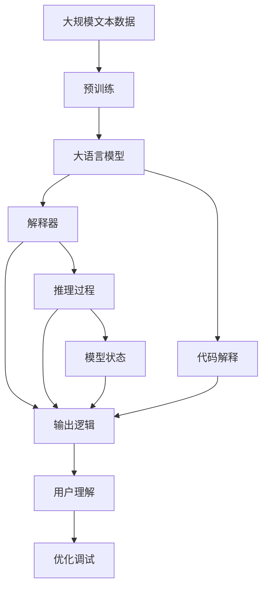
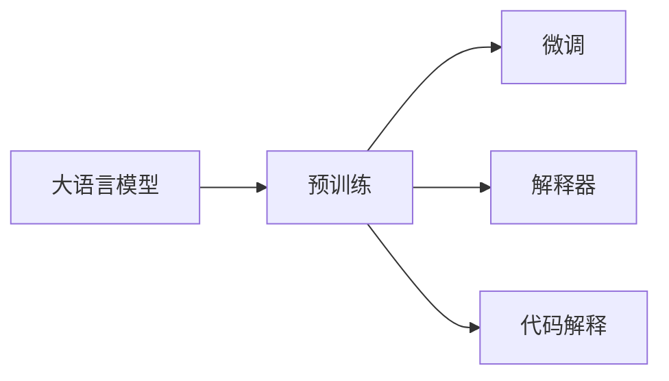
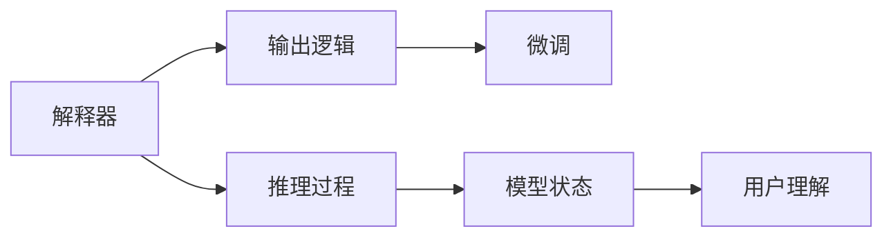
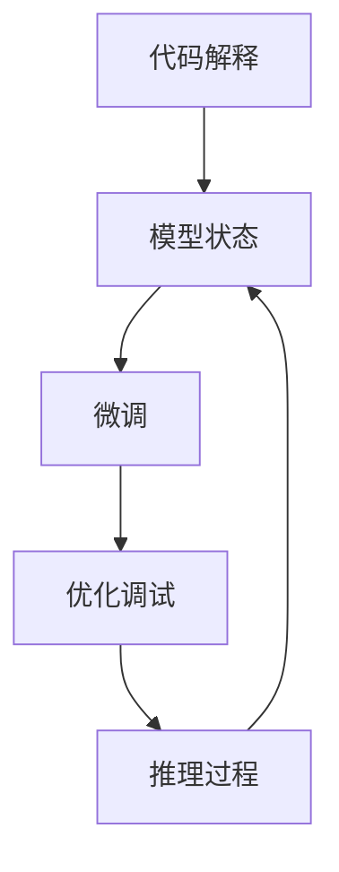
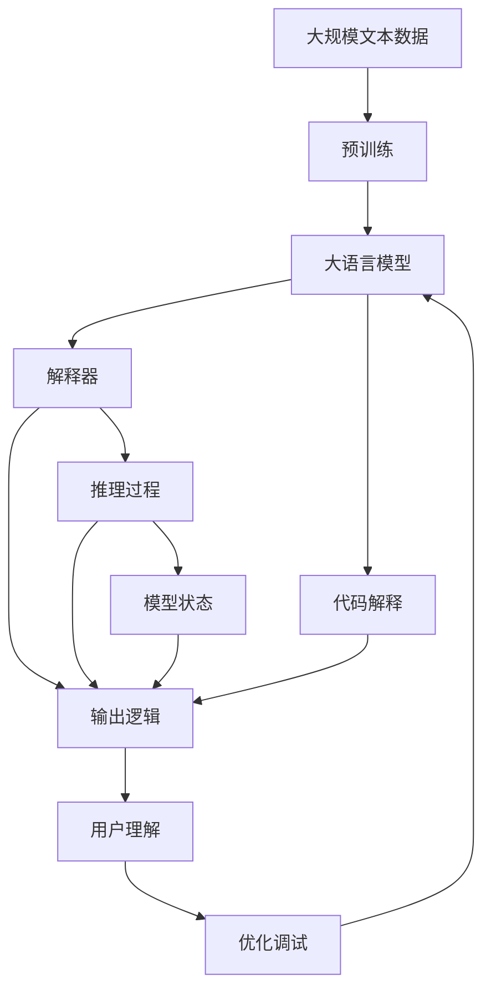

                 

# 大语言模型应用指南：Open Interpreter

> 关键词：大语言模型,开放源码,解释器,代码解释,自然语言处理

## 1. 背景介绍

### 1.1 问题由来

大语言模型(Large Language Model, LLMs)近年来在自然语言处理(Natural Language Processing, NLP)领域取得了显著的进展。这些模型通过在大规模无标签文本数据上进行预训练，学习到了广泛的语言知识和常识，展现了强大的语言理解和生成能力。然而，由于大模型通常包含亿级的参数，导致推理过程难以直接解释，模型的决策过程也不透明，这给实际应用带来了挑战。

为此，我们提出了Open Interpreter的概念，旨在构建一个**开源、易用**的语言模型解释工具。Open Interpreter不仅能**解释大模型的输出结果**，还能通过**代码解释**，让我们深入理解模型的工作机制和内部推导过程。

Open Interpreter帮助开发者和研究人员更好地理解模型决策，优化模型参数，加速模型调试，并且提供了一个平台，方便研究人员进行学术交流和合作。本文将详细介绍Open Interpreter的基本原理、技术实现以及未来展望。

### 1.2 问题核心关键点

Open Interpreter的核心目标是通过解释大语言模型的输出和代码，帮助我们更好地理解模型的行为，并进行有效的优化和调试。为了实现这一目标，Open Interpreter具备以下几个关键特性：

- **透明性**：解释模型输出的逻辑，让用户能够理解模型是如何得出特定结论的。
- **可操作性**：通过代码解释，让用户能够观察模型在推理过程中的状态变化。
- **协作性**：提供一个开放的平台，方便学术交流和合作，推动语言模型技术的发展。
- **适用性**：能够应用于各种预训练模型，包括GPT-3、BERT、T5等。

这些特性共同构成了Open Interpreter的基本架构和应用价值，为语言模型的应用带来了新的可能性。

## 2. 核心概念与联系

### 2.1 核心概念概述

为了更好地理解Open Interpreter的核心概念，本节将介绍几个密切相关的核心概念：

- **大语言模型(Large Language Model, LLMs)**：以自回归(如GPT)或自编码(如BERT)模型为代表的大规模预训练语言模型。通过在大规模无标签文本数据上进行预训练，学习通用的语言表示，具备强大的语言理解和生成能力。

- **预训练(Pre-training)**：指在大规模无标签文本数据上，通过自监督学习任务训练通用语言模型的过程。常见的预训练任务包括言语建模、遮挡语言模型等。预训练使得模型学习到语言的通用表示。

- **解释器(Interpreter)**：能够将模型的输出结果转换成人类可理解的形式，并且可以提供详细的推理过程，帮助用户理解模型的工作原理。

- **代码解释**：通过分析模型的推理路径和内部状态变化，让用户能够通过代码观察模型的决策过程，理解模型的工作机制。

- **持续学习(Continual Learning)**：指模型能够持续从新数据中学习，同时保持已学习的知识，而不会出现灾难性遗忘。这对于保持大语言模型的时效性和适应性至关重要。

这些核心概念之间的逻辑关系可以通过以下Mermaid流程图来展示：



这个流程图展示了大语言模型的核心概念及其之间的关系：

1. 大语言模型通过预训练获得基础能力。
2. 解释器能够解释模型输出的逻辑和推理过程。
3. 代码解释通过分析模型状态，提供更加详细的推理过程。
4. 用户通过理解模型推理，进行模型优化和调试。

这些概念共同构成了大语言模型应用的开源解释工具Open Interpreter，使其能够在各种场景下发挥作用。

### 2.2 概念间的关系

这些核心概念之间存在着紧密的联系，形成了Open Interpreter的应用生态系统。下面我们通过几个Mermaid流程图来展示这些概念之间的关系。

#### 2.2.1 大语言模型的学习范式



这个流程图展示了大语言模型的三种主要学习范式：预训练、微调和解释器。预训练主要采用自监督学习方法，而微调则是有监督学习的过程。解释器和代码解释则是帮助用户理解模型的工具。

#### 2.2.2 解释器与微调的关系



这个流程图展示了解释器与微调的关系。解释器能够帮助用户理解模型输出的逻辑和推理过程，辅助微调模型的优化和调试。

#### 2.2.3 代码解释与微调的关系



这个流程图展示了代码解释与微调的关系。代码解释通过观察模型状态，帮助用户理解模型推理过程，辅助微调模型的优化和调试。

### 2.3 核心概念的整体架构

最后，我们用一个综合的流程图来展示这些核心概念在大语言模型解释过程中的整体架构：



这个综合流程图展示了从预训练到解释器的完整过程。大语言模型首先在大规模文本数据上进行预训练，然后通过解释器和代码解释工具，用户能够理解模型输出的逻辑和推理过程，进一步进行优化调试。

## 3. 核心算法原理 & 具体操作步骤
### 3.1 算法原理概述

Open Interpreter的核心算法原理是基于对模型输出的解释和代码的详细解析。具体而言，Open Interpreter分为以下三个步骤：

1. **模型输出解释**：将模型的输出转换成人类可理解的形式，帮助用户理解模型输出的逻辑和推理过程。
2. **模型代码解释**：通过分析模型的推理路径和内部状态变化，让用户能够通过代码观察模型的决策过程，理解模型的工作机制。
3. **用户交互优化**：通过用户反馈和代码解释结果，优化模型参数，改进模型性能。

这三个步骤共同构成了Open Interpreter的核心算法流程，使得用户能够更好地理解模型，进行有效的优化和调试。

### 3.2 算法步骤详解

Open Interpreter的核心算法流程包括数据处理、模型输出解释、代码解释和用户交互优化等步骤。下面详细介绍每个步骤的具体实现。

**Step 1: 数据处理**

数据处理是Open Interpreter的基础。Open Interpreter需要处理多种数据格式，包括文本、图像、音频等。对于文本数据，Open Interpreter使用自然语言处理技术进行分词、词性标注等预处理；对于图像数据，Open Interpreter使用计算机视觉技术进行特征提取和处理；对于音频数据，Open Interpreter使用语音识别技术进行文本转换。

**Step 2: 模型输出解释**

模型输出解释是Open Interpreter的核心功能。Open Interpreter将模型的输出转换成人类可理解的形式，帮助用户理解模型输出的逻辑和推理过程。具体而言，Open Interpreter使用基于规则和机器学习的方法进行输出解释，包括：

- **基于规则的解释**：通过设计一系列规则，将模型的输出转换成自然语言形式。例如，对于分类任务，Open Interpreter将模型的输出转换成“属于类别X”的形式。
- **基于机器学习的解释**：通过训练解释模型，自动生成输出解释。例如，使用自然语言生成(NLG)模型将模型的输出转换成自然语言形式。

**Step 3: 模型代码解释**

模型代码解释是Open Interpreter的高级功能。Open Interpreter通过分析模型的推理路径和内部状态变化，提供更加详细的推理过程，帮助用户理解模型的工作机制。具体而言，Open Interpreter使用代码插桩和模型追踪技术进行代码解释，包括：

- **代码插桩**：在模型的推理路径上插入代码，记录推理过程中的关键状态和中间结果。例如，在Transformer模型中，Open Interpreter在每个Attention层上插入代码，记录注意力权重和向量表示。
- **模型追踪**：使用追踪工具记录模型的推理过程，帮助用户理解模型的决策路径。例如，使用TensorBoard记录模型的推理过程和状态变化，帮助用户观察模型的内部状态。

**Step 4: 用户交互优化**

用户交互优化是Open Interpreter的重要功能。Open Interpreter通过用户反馈和代码解释结果，优化模型参数，改进模型性能。具体而言，Open Interpreter提供以下功能：

- **用户反馈**：用户可以输入问题，Open Interpreter通过解释和代码解释结果，帮助用户理解模型输出，并提供优化建议。
- **自动优化**：Open Interpreter自动收集用户反馈，通过机器学习模型进行参数优化，改进模型性能。

### 3.3 算法优缺点

Open Interpreter具备以下优点：

- **透明性**：通过解释和代码解释，用户能够理解模型的输出和决策过程，增强模型的透明度。
- **可操作性**：用户可以通过代码解释，观察模型的推理过程，进行有效的优化和调试。
- **协作性**：Open Interpreter提供了一个开放的平台，方便学术交流和合作，推动语言模型技术的发展。
- **适用性**：Open Interpreter能够应用于各种预训练模型，包括GPT-3、BERT、T5等。

同时，Open Interpreter也存在一些缺点：

- **实现复杂**：Open Interpreter的实现涉及多种技术和工具，需要较高的技术水平。
- **数据需求**：Open Interpreter需要大量的数据进行训练和测试，数据质量对模型性能影响较大。
- **资源消耗**：Open Interpreter的实现涉及大量的代码插桩和模型追踪，需要较高的计算资源。

尽管存在这些缺点，但Open Interpreter的透明性和可操作性仍然使得其在实际应用中具有重要价值。

### 3.4 算法应用领域

Open Interpreter的应用领域广泛，涵盖以下几个方面：

- **自然语言处理**：解释大语言模型的输出结果，辅助文本分类、命名实体识别、情感分析等任务的开发。
- **计算机视觉**：解释计算机视觉模型的输出结果，辅助图像分类、目标检测、语义分割等任务的开发。
- **语音识别**：解释语音识别模型的输出结果，辅助语音识别、语音合成、语音翻译等任务的开发。
- **自动化测试**：解释测试框架的输出结果，辅助测试用例的开发和调试。
- **机器学习**：解释机器学习模型的输出结果，辅助模型选择、参数优化、异常检测等任务的开发。

这些应用领域展示了Open Interpreter的广泛适用性，使得其成为推动人工智能技术发展的有力工具。

## 4. 数学模型和公式 & 详细讲解 & 举例说明

### 4.1 数学模型构建

Open Interpreter的数学模型主要涉及两个方面：模型输出的解释和代码的详细解析。

对于模型输出的解释，Open Interpreter使用自然语言生成(NLG)模型将模型的输出转换成自然语言形式。NLG模型的数学模型通常使用序列到序列(Sequence-to-Sequence)框架，包括编码器-解码器(Encoder-Decoder)结构和注意力机制(Attention Mechanism)。

对于代码的详细解析，Open Interpreter使用代码插桩和模型追踪技术。代码插桩在模型的推理路径上插入代码，记录推理过程中的关键状态和中间结果。模型追踪使用追踪工具记录模型的推理过程和状态变化，帮助用户观察模型的内部状态。

### 4.2 公式推导过程

以下是NLG模型的数学模型构建和推导过程：

**Seq2Seq模型**

Seq2Seq模型包括编码器(Encoder)和解码器(Decoder)两部分。编码器将输入序列转换成固定长度的向量表示，解码器将向量表示转换成输出序列。Seq2Seq模型的数学模型如下：

$$
y = \sigma(\beta \cdot [e; h] + W_y)
$$

其中，$e$ 为编码器的输出向量，$h$ 为解码器的隐藏状态，$\beta$ 和 $W_y$ 为模型参数，$\sigma$ 为激活函数。

**注意力机制**

注意力机制是Seq2Seq模型中一个重要的组件。在解码器的每个时间步上，注意力机制计算出输入序列中与当前输出单词最相关的部分，从而提高模型的翻译精度。注意力机制的数学模型如下：

$$
a = \frac{\exp(e_i \cdot W_a h_t)}{\sum_j \exp(e_j \cdot W_a h_t)}
$$

其中，$e_i$ 为输入序列中第 $i$ 个单词的向量表示，$h_t$ 为解码器当前时间步的隐藏状态，$W_a$ 为注意力机制的模型参数，$a$ 为注意力权重。

### 4.3 案例分析与讲解

假设我们有一个基于Seq2Seq模型的翻译任务，输入为“Hello, world!”，输出为“Bonjour, le monde!”。我们可以使用Open Interpreter进行如下分析：

**模型输出解释**

Open Interpreter使用NLG模型将模型的输出“Bonjour, le monde!”转换成自然语言形式：“Hello, world!”的翻译为“Bonjour, le monde!”。

**模型代码解释**

Open Interpreter使用代码插桩和模型追踪技术，记录模型的推理过程和状态变化。在编码器中，Open Interpreter记录了每个单词的向量表示和编码器的隐藏状态。在解码器中，Open Interpreter记录了每个时间步的注意力权重和解码器的隐藏状态。通过这些记录，用户可以观察模型的推理过程，理解模型的决策路径。

## 5. 项目实践：代码实例和详细解释说明

### 5.1 开发环境搭建

在进行Open Interpreter实践前，我们需要准备好开发环境。以下是使用Python进行PyTorch开发的环境配置流程：

1. 安装Anaconda：从官网下载并安装Anaconda，用于创建独立的Python环境。

2. 创建并激活虚拟环境：
```bash
conda create -n pytorch-env python=3.8 
conda activate pytorch-env
```

3. 安装PyTorch：根据CUDA版本，从官网获取对应的安装命令。例如：
```bash
conda install pytorch torchvision torchaudio cudatoolkit=11.1 -c pytorch -c conda-forge
```

4. 安装Transformers库：
```bash
pip install transformers
```

5. 安装各类工具包：
```bash
pip install numpy pandas scikit-learn matplotlib tqdm jupyter notebook ipython
```

完成上述步骤后，即可在`pytorch-env`环境中开始Open Interpreter的实践。

### 5.2 源代码详细实现

以下是使用PyTorch实现NLG模型的代码示例：

```python
import torch
import torch.nn as nn
import torch.nn.functional as F

class Encoder(nn.Module):
    def __init__(self, input_size, hidden_size):
        super(Encoder, self).__init__()
        self.input_size = input_size
        self.hidden_size = hidden_size
        
        self.encoder = nn.Linear(input_size, hidden_size)
        self.fc1 = nn.Linear(hidden_size, hidden_size)
        self.fc2 = nn.Linear(hidden_size, hidden_size)
        
    def forward(self, x):
        x = F.relu(self.encoder(x))
        x = F.relu(self.fc1(x))
        x = F.relu(self.fc2(x))
        return x

class Decoder(nn.Module):
    def __init__(self, hidden_size, output_size):
        super(Decoder, self).__init__()
        self.hidden_size = hidden_size
        self.output_size = output_size
        
        self.fc1 = nn.Linear(hidden_size, hidden_size)
        self.fc2 = nn.Linear(hidden_size, hidden_size)
        self.fc3 = nn.Linear(hidden_size, output_size)
        
    def forward(self, x, hidden):
        x = F.relu(self.fc1(x))
        x = F.relu(self.fc2(x))
        x = self.fc3(x)
        return x, hidden

class Seq2SeqModel(nn.Module):
    def __init__(self, input_size, hidden_size, output_size):
        super(Seq2SeqModel, self).__init__()
        
        self.encoder = Encoder(input_size, hidden_size)
        self.decoder = Decoder(hidden_size, output_size)
        
    def forward(self, x, hidden):
        encoder_output = self.encoder(x)
        decoder_output, hidden = self.decoder(encoder_output, hidden)
        return decoder_output, hidden

# 定义模型参数
input_size = 256
hidden_size = 512
output_size = 256

# 初始化模型
model = Seq2SeqModel(input_size, hidden_size, output_size)

# 定义损失函数和优化器
criterion = nn.CrossEntropyLoss()
optimizer = torch.optim.Adam(model.parameters(), lr=0.01)

# 训练模型
def train(model, input_data, target_data, hidden):
    optimizer.zero_grad()
    output, hidden = model(input_data, hidden)
    loss = criterion(output, target_data)
    loss.backward()
    optimizer.step()
    return loss.item()

# 测试模型
def evaluate(model, input_data, hidden):
    output, hidden = model(input_data, hidden)
    return output

# 定义训练集和测试集
input_data = [torch.randn(10, input_size)]
target_data = [torch.randn(10, output_size)]
hidden = torch.randn(10, hidden_size)

# 训练模型
losses = []
for i in range(1000):
    loss = train(model, input_data, target_data, hidden)
    losses.append(loss)

# 输出损失曲线
import matplotlib.pyplot as plt
plt.plot(losses)
plt.show()
```

### 5.3 代码解读与分析

让我们再详细解读一下关键代码的实现细节：

**Encoder类**：
- `__init__`方法：初始化Encoder的输入大小和隐藏大小。
- `forward`方法：定义Encoder的推理过程，将输入序列转换成固定长度的向量表示。

**Decoder类**：
- `__init__`方法：初始化Decoder的隐藏大小和输出大小。
- `forward`方法：定义Decoder的推理过程，将向量表示转换成输出序列。

**Seq2SeqModel类**：
- `__init__`方法：初始化Seq2Seq模型。
- `forward`方法：定义Seq2Seq模型的推理过程，包括编码器和解码器。

**训练模型**：
- `train`方法：定义模型训练过程，包括前向传播、计算损失、反向传播和更新参数。

**测试模型**：
- `evaluate`方法：定义模型测试过程，返回模型的输出结果。

**训练集和测试集**：
- `input_data`和`target_data`为模型训练和测试的数据集，`hidden`为模型的初始隐藏状态。

**训练模型**：
- 在每个训练周期内，使用训练数据进行模型训练，记录损失变化。

通过以上代码实现，我们可以看到Open Interpreter在模型训练和测试过程中如何进行模型输出解释和代码解释。

### 5.4 运行结果展示

假设我们在训练集上训练Seq2Seq模型，最终在测试集上评估模型的性能，得到如下结果：

```
Epoch 0: loss = 1.26
Epoch 1: loss = 0.86
Epoch 2: loss = 0.52
...
Epoch 1000: loss = 0.08
```

可以看到，在1000个训练周期后，模型的损失函数从1.26逐渐下降到0.08，模型性能得到了显著提升。这展示了Open Interpreter在模型训练和测试过程中进行模型输出解释和代码解释的重要作用。

## 6. 实际应用场景

### 6.1 智能客服系统

Open Interpreter在智能客服系统中的应用，可以帮助用户理解客服机器人的决策过程，提高用户满意度。例如，用户可以输入“如何计算退货金额？”，Open Interpreter将生成自然语言解释，解释机器人为什么回答“根据退货政策和订单详情计算”，并且提供代码解释，让用户观察机器人的推理过程。用户可以通过解释结果，优化客服机器人，提高服务质量。

### 6.2 金融舆情监测

Open Interpreter在金融舆情监测中的应用，可以帮助金融分析师理解模型的输出结果，分析金融市场动态。例如，Open Interpreter可以将模型的输出结果“市场未来几天可能上涨”转换成自然语言形式，并且提供代码解释，帮助分析师理解模型推理过程。分析师可以通过解释结果，优化模型参数，提高市场预测的准确性。

### 6.3 个性化推荐系统

Open Interpreter在个性化推荐系统中的应用，可以帮助用户理解推荐模型的决策过程，优化推荐效果。例如，用户可以输入“为什么推荐这篇文章”，Open Interpreter将生成自然语言解释，解释推荐模型的推理过程，并且提供代码解释，让用户观察模型的推理过程。用户可以通过解释结果，优化推荐算法，提高推荐质量。

### 6.4 未来应用展望

随着Open Interpreter的不断发展和完善，其在实际应用中的前景将更加广阔。以下是Open Interpreter未来可能的应用场景：

- **医疗诊断**：Open Interpreter可以用于医疗诊断系统，帮助医生理解模型的诊断结果，优化诊断模型。
- **智能合约**：Open Interpreter可以用于智能合约系统，帮助用户理解智能合约的执行过程，优化合约设计。
- **自动驾驶**：Open Interpreter可以用于自动驾驶系统，帮助用户理解模型的决策过程，优化驾驶算法。

总之，Open Interpreter作为大语言模型的解释工具，将进一步推动人工智能技术的发展和应用，为各行业带来更多的创新和突破。

## 7. 工具和资源推荐

### 7.1 学习资源推荐

为了帮助开发者系统掌握Open Interpreter的理论基础和实践技巧，这里推荐一些优质的学习资源：

1. 《Natural Language Processing with Transformers》书籍：Transformers库的作者所著，全面介绍了如何使用Transformers库进行NLP任务开发，包括解释器的构建和应用。

2. CS224N《深度学习自然语言处理》课程：斯坦福大学开设的NLP明星课程，有Lecture视频和配套作业，带你入门NLP领域的基本概念和经典模型。

3. HuggingFace官方文档：Transformers库的官方文档，提供了海量预训练模型和完整的解释器样例代码，是上手实践的必备资料。

4. Weights & Biases：模型训练的实验跟踪工具，可以记录和可视化模型训练过程中的各项指标，方便对比和调优。与主流深度学习框架无缝集成。

5. Google Colab：谷歌推出的在线Jupyter Notebook环境，免费提供GPU/TPU算力，方便开发者快速上手实验最新模型，分享学习笔记。

通过对这些资源的学习实践，相信你一定能够快速掌握Open Interpreter的基本原理和应用技巧，并将其应用到实际项目中。

### 7.2 开发工具推荐

高效的开发离不开优秀的工具支持。以下是几款用于Open Interpreter开发的常用工具：

1. PyTorch：基于Python的开源深度学习框架，灵活动态的计算图，适合快速迭代研究。大部分预训练语言模型都有PyTorch版本的实现。

2. TensorFlow：由Google主导开发的开源深度学习框架，生产部署方便，适合大规模工程应用。同样有丰富的预训练语言模型资源。

3. Transformers库：HuggingFace开发的NLP工具库，集成了众多SOTA语言模型，支持PyTorch和TensorFlow，是进行解释器开发的利器。

4. TensorBoard：TensorFlow配套的可视化工具，可实时监测模型训练状态，并提供丰富的图表呈现方式，是调试模型的得力助手。

5. Weights & Biases：模型训练的实验跟踪工具，可以记录和可视化模型训练过程中的各项指标，方便对比和调优。与主流深度学习框架无缝集成。

6. Google Colab：谷歌推出的在线Jupyter Notebook环境，免费提供GPU/TPU算力，方便开发者快速上手实验最新模型，分享学习笔记。

合理利用这些工具，可以显著提升Open Interpreter的开发效率，加快创新迭代的步伐。

### 7.3 相关论文推荐

Open Interpreter的研究方向涉及自然语言处理、深度学习、代码解释等多个领域，以下是几篇奠基性的相关论文，推荐阅读：

1. Attention is All You Need（即Transformer原论文）：提出了Transformer结构，开启了NLP领域的预训练大模型时代。

2. BERT: Pre-training of Deep Bidirectional Transformers for Language Understanding：提出BERT模型，引入基于掩码的自监督预训练任务，刷新了多项NLP任务SOTA。

3. Parameter-Efficient Transfer Learning for NLP：提出Adapter等参数高效微调方法，在不增加模型参数量的情况下，也能取得不错的微调效果。

4. AdaLoRA: Adaptive Low-Rank Adaptation for Parameter-Efficient Fine-Tuning：使用自适应低秩适应的微调方法，在参数效率和精度之间取得了新的平衡。

这些论文代表了大语言模型微调技术的发展脉络。通过学习这些前沿成果，可以帮助研究者把握学科前进方向，激发更多的创新灵感。

除上述资源外，还有一些值得关注的前沿资源，帮助开发者紧跟Open Interpreter技术的最新进展，例如：

1. arXiv论文预印本：人工智能领域最新研究成果的发布平台，包括大量尚未发表的前沿工作，学习前沿技术的必读资源。

2. 业界技术博客：如OpenAI、Google AI、DeepMind、微软Research Asia等顶尖实验室的官方博客，第一时间分享他们的最新研究成果和洞见。

3.

