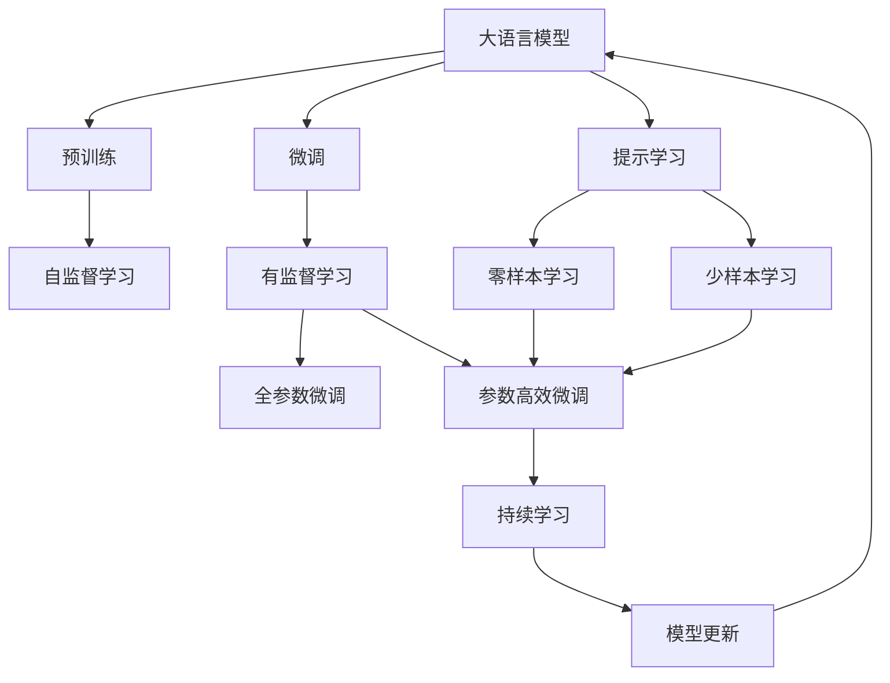
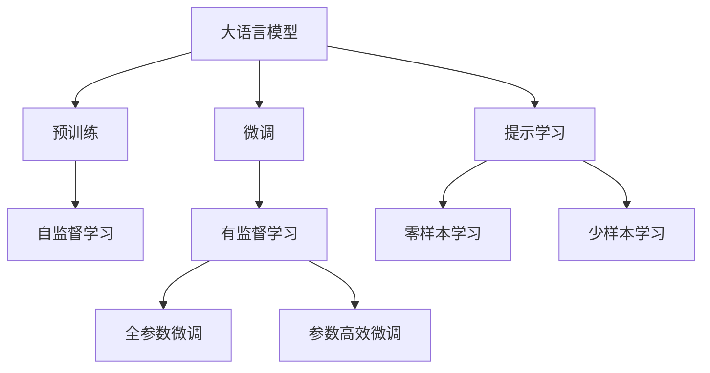
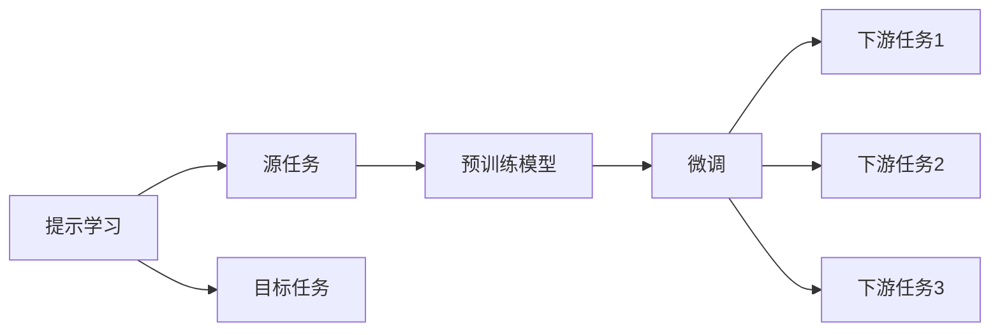
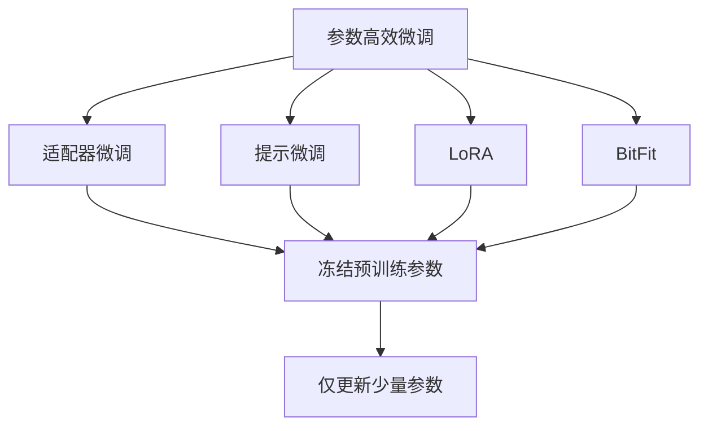
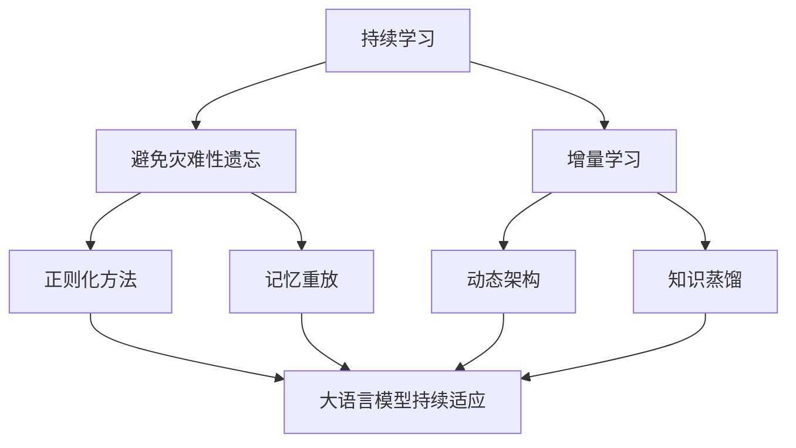

                 

# 大语言模型应用指南：基于提示的工具

> 关键词：
- 大语言模型
- 提示学习(Prompt Learning)
- 提示微调(Fine-Tuning with Prompts)
- 少样本学习(Few-shot Learning)
- 零样本学习(Zero-shot Learning)
- 数据增强(Data Augmentation)
- 对抗训练(Adversarial Training)

## 1. 背景介绍

### 1.1 问题由来
随着大语言模型（Large Language Models, LLMs）的日益成熟，其在自然语言处理（Natural Language Processing, NLP）中的应用已经从纯文本分类、生成等基本任务拓展到了更加复杂和具体的场景中。在实际应用中，我们往往需要在特定任务上进行微调（Fine-Tuning），以充分发挥其潜力，提高模型在特定领域的表现。然而，获取高质量标注数据往往需要耗费大量时间和资源，而且由于标注数据可能存在偏差和噪声，微调过程也可能引入过拟合问题。

基于上述挑战，提示学习（Prompt Learning）应运而生。提示学习是一种不依赖于标注数据的方法，通过精心设计输入文本的模板（Prompt Template），引导模型按照期望的方式推理和生成。这种方法不仅可以避免过拟合，还能在少样本和零样本条件下实现高效的微调。

### 1.2 问题核心关键点
提示学习旨在通过设计提示模板，使得模型能够在不更新参数的情况下，快速适应特定任务。提示模板通常包括任务描述、输入文本和期望输出形式等信息。通过调整提示模板，可以引导模型输出不同类型的结果，如分类、生成、翻译等。提示学习的核心在于如何设计有效的提示模板，使得模型能够最大程度地理解和利用输入信息，输出符合任务要求的答案。

提示学习的应用非常广泛，包括问答、文本摘要、文本生成、情感分析等任务。与传统的微调方法相比，提示学习不需要标注数据，可以在少量样本或没有标注数据的情况下，通过调整提示模板来提升模型性能。此外，提示学习还可以与其他技术结合，如对抗训练、数据增强等，进一步提高模型泛化能力和鲁棒性。

## 2. 核心概念与联系

### 2.1 核心概念概述

为了更好地理解基于提示的学习方法，本节将介绍几个密切相关的核心概念：

- 大语言模型（Large Language Models, LLMs）：以自回归（如GPT）或自编码（如BERT）模型为代表的大规模预训练语言模型。通过在大规模无标签文本数据上进行预训练，学习通用的语言表示，具备强大的语言理解和生成能力。

- 预训练（Pre-training）：指在大规模无标签文本语料上，通过自监督学习任务训练通用语言模型的过程。常见的预训练任务包括言语建模、遮挡语言模型等。预训练使得模型学习到语言的通用表示。

- 微调（Fine-Tuning）：指在预训练模型的基础上，使用下游任务的少量标注数据，通过有监督地训练优化模型在特定任务上的性能。通常只需要调整顶层分类器或解码器，并以较小的学习率更新全部或部分的模型参数。

- 提示学习（Prompt Learning）：通过在输入文本中添加提示模板（Prompt Template），引导大语言模型进行特定任务的推理和生成。可以在不更新模型参数的情况下，实现零样本或少样本学习。

- 少样本学习（Few-shot Learning）：指在只有少量标注样本的情况下，模型能够快速适应新任务的学习方法。在大语言模型中，通常通过在输入中提供少量示例来实现，无需更新模型参数。

- 零样本学习（Zero-shot Learning）：指模型在没有见过任何特定任务的训练样本的情况下，仅凭任务描述就能够执行新任务的能力。大语言模型通过预训练获得的广泛知识，使其能够理解任务指令并生成相应输出。

- 数据增强（Data Augmentation）：通过对训练样本改写、回译等方式丰富训练集多样性，提高模型泛化能力。

- 对抗训练（Adversarial Training）：加入对抗样本，提高模型鲁棒性。

这些核心概念之间的逻辑关系可以通过以下Mermaid流程图来展示：



这个流程图展示了大语言模型的核心概念及其之间的关系：

1. 大语言模型通过预训练获得基础能力。
2. 微调是对预训练模型进行任务特定的优化，可以分为全参数微调和参数高效微调（PEFT）。
3. 提示学习是一种不更新模型参数的方法，可以实现零样本和少样本学习。
4. 迁移学习是连接预训练模型与下游任务的桥梁，可以通过微调或提示学习来实现。
5. 持续学习旨在使模型能够不断学习新知识，同时保持已学习的知识，而不会出现灾难性遗忘。

这些概念共同构成了大语言模型的学习和应用框架，使其能够在各种场景下发挥强大的语言理解和生成能力。通过理解这些核心概念，我们可以更好地把握大语言模型的工作原理和优化方向。

### 2.2 概念间的关系

这些核心概念之间存在着紧密的联系，形成了大语言模型的完整生态系统。下面我们通过几个Mermaid流程图来展示这些概念之间的关系。

#### 2.2.1 大语言模型的学习范式



这个流程图展示了大语言模型的三种主要学习范式：预训练、微调和提示学习。预训练主要采用自监督学习方法，而微调则是有监督学习的过程。提示学习可以实现零样本和少样本学习。微调又可以分为全参数微调和参数高效微调两种方式。

#### 2.2.2 提示学习与微调的关系



这个流程图展示了提示学习的基本原理，以及它与微调的关系。提示学习涉及源任务和目标任务，预训练模型在源任务上学习，然后通过微调适应各种下游任务（目标任务）。

#### 2.2.3 参数高效微调方法



这个流程图展示了几种常见的参数高效微调方法，包括适配器微调、提示微调、LoRA和BitFit。这些方法的共同特点是冻结大部分预训练参数，只更新少量参数，从而提高微调效率。

#### 2.2.4 持续学习在大语言模型中的应用



这个流程图展示了持续学习在大语言模型中的应用。持续学习的主要目标是避免灾难性遗忘和实现增量学习。通过正则化方法、记忆重放、动态架构和知识蒸馏等技术，可以使大语言模型持续适应新的任务和数据。

## 3. 核心算法原理 & 具体操作步骤

### 3.1 算法原理概述

提示学习是一种不依赖于标注数据的方法，通过精心设计输入文本的模板（Prompt Template），引导大语言模型进行特定任务的推理和生成。具体来说，提示学习的过程包括：

1. 定义任务：明确需要解决的具体问题，如分类、生成、翻译等。
2. 设计提示模板：根据任务类型，设计符合逻辑和语法的提示模板，引导模型推理和生成。
3. 训练模型：使用提示模板作为输入，训练模型输出符合期望的输出形式。
4. 评估模型：在验证集或测试集上评估模型性能，调整提示模板，优化模型表现。

形式化地，假设提示模板为 $P$，模型为 $M_{\theta}$，其中 $\theta$ 为预训练得到的模型参数。定义模型 $M_{\theta}$ 在输入 $x$ 上的损失函数为 $\ell(M_{\theta}(x),y)$，则在提示模板 $P$ 下，模型在数据集 $D=\{(x_i,y_i)\}_{i=1}^N$ 上的经验风险为：

$$
\mathcal{L}(P,\theta) = \frac{1}{N}\sum_{i=1}^N \ell(M_{\theta}(P(x_i)),y_i)
$$

其中 $P(x_i)$ 表示使用提示模板 $P$ 对输入 $x_i$ 进行处理，生成新的输入 $P(x_i)$。通过梯度下降等优化算法，提示学习过程不断更新模型参数 $\theta$，最小化损失函数 $\mathcal{L}(P,\theta)$，使得模型输出逼近真实标签。

### 3.2 算法步骤详解

基于提示学习的核心步骤包括：

**Step 1: 设计提示模板**

- 明确任务目标：如分类、生成、问答等。
- 设计提示模板：包含任务描述、输入文本和期望输出形式等信息。
- 精简提示模板：确保模板简短且易理解，避免不必要的噪声。
- 测试提示模板：通过小规模数据验证提示模板的有效性。

**Step 2: 训练模型**

- 准备提示数据集：将提示模板和相应的输出样本组成提示数据集。
- 选择优化器和超参数：如AdamW、SGD等，设置学习率、批大小等。
- 训练模型：使用提示模板作为输入，训练模型输出符合期望的输出形式。
- 调整提示模板：根据模型性能，调整提示模板以优化输出。

**Step 3: 评估模型**

- 划分验证集和测试集：将数据集分为验证集和测试集，评估模型性能。
- 计算评估指标：如精确度、召回率、F1分数等，评估模型效果。
- 调整模型：根据评估结果，调整提示模板和模型参数，提高模型性能。

**Step 4: 应用模型**

- 部署模型：将训练好的模型部署到实际应用中。
- 处理输入：将输入文本作为模型输入，使用提示模板生成输出。
- 监控输出：实时监控模型输出，确保模型表现稳定。

### 3.3 算法优缺点

提示学习的主要优点包括：

1. 无需标注数据：提示学习可以避免标注数据的成本和风险，在少量样本或无标注数据的情况下也能实现高效微调。
2. 灵活性高：提示模板设计灵活，可以根据具体任务进行调整，适应性强。
3. 可解释性强：提示学习不需要更新模型参数，输出具有高度可解释性，便于理解和调试。
4. 鲁棒性好：提示学习通过调整提示模板，可以避免过拟合和泛化能力不足的问题，提高模型鲁棒性。

提示学习的主要缺点包括：

1. 提示模板设计困难：设计高质量的提示模板需要丰富的经验和专业知识，难度较大。
2. 提示模板泛化性不足：提示模板设计的质量直接影响模型性能，可能需要多次调整和优化。
3. 提示模板可解释性不足：尽管提示学习可解释性强，但输出仍可能受到提示模板的影响，难以全面解释模型推理过程。

尽管存在这些局限性，提示学习仍是一种高效、灵活、可解释性强的微调方法，特别适合在特定领域或少数样本条件下使用。

### 3.4 算法应用领域

提示学习在NLP领域有广泛的应用场景，包括但不限于：

- 文本分类：如情感分析、主题分类、意图识别等。通过设计提示模板，引导模型学习文本-标签映射。
- 命名实体识别：识别文本中的人名、地名、机构名等特定实体。设计提示模板，引导模型学习实体边界和类型。
- 关系抽取：从文本中抽取实体之间的语义关系。设计提示模板，引导模型学习实体-关系三元组。
- 问答系统：对自然语言问题给出答案。将问题-答案对作为提示模板，训练模型学习匹配答案。
- 机器翻译：将源语言文本翻译成目标语言。设计提示模板，引导模型学习语言-语言映射。
- 文本摘要：将长文本压缩成简短摘要。设计提示模板，引导模型学习抓取要点。
- 对话系统：使机器能够与人自然对话。设计多轮对话历史作为上下文，微调模型进行回复生成。

除了上述这些经典任务外，提示学习还被创新性地应用到更多场景中，如可控文本生成、常识推理、代码生成、数据增强等，为NLP技术带来了全新的突破。随着预训练模型和提示学习的不断进步，相信NLP技术将在更广阔的应用领域大放异彩。

## 4. 数学模型和公式 & 详细讲解 & 举例说明

### 4.1 数学模型构建

本节将使用数学语言对基于提示的学习方法进行更加严格的刻画。

记提示模板为 $P$，模型为 $M_{\theta}$，其中 $\theta$ 为预训练得到的模型参数。假设提示模板下的训练集为 $D=\{(x_i,y_i)\}_{i=1}^N$，其中 $P(x_i)$ 表示使用提示模板 $P$ 对输入 $x_i$ 进行处理，生成新的输入 $P(x_i)$。定义模型 $M_{\theta}$ 在输入 $P(x_i)$ 上的损失函数为 $\ell(M_{\theta}(P(x_i)),y_i)$，则在提示模板 $P$ 下，模型在数据集 $D$ 上的经验风险为：

$$
\mathcal{L}(P,\theta) = \frac{1}{N}\sum_{i=1}^N \ell(M_{\theta}(P(x_i)),y_i)
$$

在提示模板设计好后，通过梯度下降等优化算法，不断更新模型参数 $\theta$，最小化损失函数 $\mathcal{L}(P,\theta)$，使得模型输出逼近真实标签。

### 4.2 公式推导过程

以下我们以文本分类任务为例，推导提示学习下的损失函数及其梯度的计算公式。

假设模型 $M_{\theta}$ 在输入 $x$ 上的输出为 $\hat{y}=M_{\theta}(x) \in [0,1]$，表示样本属于正类的概率。提示模板 $P$ 包含任务描述和输入文本，输出标签 $y_i$。定义模型 $M_{\theta}$ 在输入 $P(x_i)$ 上的损失函数为：

$$
\ell(M_{\theta}(P(x_i)),y_i) = -[y_i\log M_{\theta}(P(x_i)) + (1-y_i)\log(1-M_{\theta}(P(x_i)))
$$

将其代入经验风险公式，得：

$$
\mathcal{L}(P,\theta) = -\frac{1}{N}\sum_{i=1}^N [y_i\log M_{\theta}(P(x_i)) + (1-y_i)\log(1-M_{\theta}(P(x_i)))
$$

根据链式法则，损失函数对参数 $\theta$ 的梯度为：

$$
\frac{\partial \mathcal{L}(P,\theta)}{\partial \theta} = -\frac{1}{N}\sum_{i=1}^N (\frac{y_i}{M_{\theta}(P(x_i))}-\frac{1-y_i}{1-M_{\theta}(P(x_i))}) \frac{\partial M_{\theta}(P(x_i))}{\partial \theta}
$$

其中 $\frac{\partial M_{\theta}(P(x_i))}{\partial \theta}$ 可进一步递归展开，利用自动微分技术完成计算。

在得到损失函数的梯度后，即可带入梯度下降算法，完成模型的迭代优化。重复上述过程直至收敛，最终得到提示模板 $P$ 下适应下游任务的最优模型参数 $\theta^*$。

### 4.3 案例分析与讲解

以下是一个简单的提示学习案例，展示如何使用提示模板进行情感分类：

假设我们有一个情感分类任务，目标是判断一段文本是正面情感还是负面情感。我们可以设计如下提示模板：

```python
"这段文本是正面情感还是负面情感？文本：{{input}}"
```

其中 `{{input}}` 表示输入文本占位符。使用这个提示模板，可以生成新的输入 $P(x_i)$，其中 $x_i$ 是原始文本。

```python
P(x_i) = "这段文本是正面情感还是负面情感？文本：" + x_i
```

通过使用这个提示模板，模型 $M_{\theta}$ 可以进行情感分类，输出 $\hat{y}=M_{\theta}(P(x_i))$，表示 $x_i$ 是正面情感的概率。我们定义损失函数为交叉熵损失：

$$
\ell(M_{\theta}(P(x_i)),y_i) = -y_i\log M_{\theta}(P(x_i)) - (1-y_i)\log(1-M_{\theta}(P(x_i)))
$$

在数据集 $D$ 上，经验风险为：

$$
\mathcal{L}(P,\theta) = -\frac{1}{N}\sum_{i=1}^N [y_i\log M_{\theta}(P(x_i)) + (1-y_i)\log(1-M_{\theta}(P(x_i)))
$$

使用梯度下降算法，不断更新模型参数 $\theta$，最小化损失函数 $\mathcal{L}(P,\theta)$，得到最优模型参数 $\theta^*$。

通过提示模板，我们可以快速调整模型输出形式，实现情感分类任务。提示学习不仅减少了标注数据的依赖，还提高了模型灵活性和可解释性，是一种非常有效的微调方法。

## 5. 项目实践：代码实例和详细解释说明

### 5.1 开发环境搭建

在进行提示学习实践前，我们需要准备好开发环境。以下是使用Python进行PyTorch开发的环境配置流程：

1. 安装Anaconda：从官网下载并安装Anaconda，用于创建独立的Python环境。

2. 创建并激活虚拟环境：
```bash
conda create -n pytorch-env python=3.8 
conda activate pytorch-env
```

3. 安装PyTorch：根据CUDA版本，从官网获取对应的安装命令。例如：
```bash
conda install pytorch torchvision torchaudio cudatoolkit=11.1 -c pytorch -c conda-forge
```

4. 安装Transformers库：
```bash
pip install transformers
```

5. 安装各类工具包：
```bash
pip install numpy pandas scikit-learn matplotlib tqdm jupyter notebook ipython
```

完成上述步骤后，即可在`pytorch-env`环境中开始提示学习实践。

### 5.2 源代码详细实现

下面我们以命名实体识别(NER)任务为例，给出使用Transformers库对BERT模型进行提示学习的PyTorch代码实现。

首先，定义NER任务的数据处理函数：

```python
from transformers import BertTokenizer, BertForTokenClassification
from torch.utils.data import Dataset, DataLoader
import torch

class NERDataset(Dataset):
    def __init__(self, texts, tags, tokenizer):
        self.texts = texts
        self.tags = tags
        self.tokenizer = tokenizer
        
    def __len__(self):
        return len(self.texts)
    
    def __getitem__(self, item):
        text = self.texts[item]
        tags = self.tags[item]
        
        encoding = self.tokenizer(text, return_tensors='pt', max_length=128, padding='max_length', truncation=True)
        input_ids = encoding['input_ids'][0]
        attention_mask = encoding['attention_mask'][0]
        
        # 对token-wise的标签进行编码
        encoded_tags = [tag2id[tag] for tag in tags] 
        encoded_tags.extend([tag2id['O']] * (self.max_len - len(encoded_tags)))
        labels = torch.tensor(encoded_tags, dtype=torch.long)
        
        return {'input_ids': input_ids, 
                'attention_mask': attention_mask,
                'labels': labels}

# 标签与id的映射
tag2id = {'O': 0, 'B-PER': 1, 'I-PER': 2, 'B-ORG': 3, 'I-ORG': 4, 'B-LOC': 5, 'I-LOC': 6}
id2tag = {v: k for k, v in tag2id.items()}

# 创建dataset
tokenizer = BertTokenizer.from_pretrained('bert-base-cased')

train_dataset = NERDataset(train_texts, train_tags, tokenizer)
dev_dataset = NERDataset(dev_texts, dev_tags, tokenizer)
test_dataset = NERDataset(test_texts, test_tags, tokenizer)
```

然后，定义模型和优化器：

```python
from transformers import BertForTokenClassification, AdamW

model = BertForTokenClassification.from_pretrained('bert-base-cased', num_labels=len(tag2id))

optimizer = AdamW(model.parameters(), lr=2e-5)
```

接着，定义训练和评估函数：

```python
from tqdm import tqdm
from sklearn.metrics import classification_report

device = torch.device('cuda') if torch.cuda.is_available() else torch.device('cpu')
model.to(device)

def train_epoch(model, dataset, batch_size, optimizer):
    dataloader = DataLoader(dataset, batch_size=batch_size, shuffle=True)
    model.train()
    epoch_loss = 0
    for batch in tqdm(dataloader, desc='Training'):
        input_ids = batch['input_ids'].to(device)
        attention_mask = batch['attention_mask'].to(device)
        labels = batch['labels'].to(device)
        model.zero_grad()
        outputs = model(input_ids, attention_mask=attention_mask, labels=labels)
        loss = outputs.loss
        epoch_loss += loss.item()
        loss.backward()
        optimizer.step()
    return epoch_loss / len(dataloader)

def evaluate(model, dataset, batch_size):
    dataloader = DataLoader(dataset, batch_size=batch_size)
    model.eval()
    preds, labels = [], []
    with torch.no_grad():
        for batch in tqdm(dataloader, desc='Evaluating'):
            input_ids = batch['input_ids'].to(device)
            attention_mask = batch['attention_mask'].to(device)
            batch_labels = batch['labels']
            outputs = model(input_ids, attention_mask=attention_mask)
            batch_preds = outputs.logits.argmax(dim=2).to('cpu').tolist()
            batch_labels = batch_labels.to('cpu').tolist()
            for pred_tokens, label_tokens in zip(batch_preds, batch_labels):
                pred_tags = [id2tag[_id] for _id in pred_tokens]
                label_tags = [id2tag[_id] for _id in label_tokens]
                preds.append(pred_tags[:len(label_tags)])
                labels.append(label_tags)
                
    print(classification_report(labels, preds))
```

最后，启动训练流程并在测试集上评估：

```python
epochs = 5
batch_size = 16

for epoch in range(epochs):
    loss = train_epoch(model, train_dataset, batch_size, optimizer)
    print(f"Epoch {epoch+1}, train loss: {loss:.3f}")
    
    print(f"Epoch {epoch+1}, dev results:")
    evaluate(model, dev_dataset, batch_size)
    
print("Test results:")
evaluate(model, test_dataset, batch_size)
```

以上就是使用PyTorch对BERT进行命名实体识别任务的提示学习代码实现。可以看到，通过设计提示模板，我们可以在不做任何模型调整的情况下，实现高效的微调。

### 5.3 代码解读与分析

让我们再详细解读一下关键代码的实现细节：

**NERDataset类**：
- `__init__`方法：初始化文本、标签、分词器等关键组件。
- `__len__`方法：返回数据集的样本数量。
- `__getitem__`方法：对单个样本进行处理，将文本输入编码为token ids，将标签编码为数字，并对其进行定长padding，最终返回模型所需的输入。

**tag2id和id2tag字典**：
- 定义了标签与数字id之间的映射关系，用于将token-wise的预测结果解码回真实的标签。

**训练和评估函数**：
- 使用PyTorch的DataLoader对数据集进行批次化加载，供模型训练和推理使用。
- 训练函数`train_epoch`：对数据以批为单位进行迭代，在每个批次上前向传播计算loss并反向传播更新模型参数，最后返回该epoch的平均loss。
- 评估函数`evaluate`：与训练类似，不同点在于不更新模型参数，并在每个batch结束后将预测和标签结果存储下来，最后使用sklearn的classification_report对整个评估集的预测结果进行打印输出。

**训练流程**：
- 定义总的epoch数和batch size，开始循环迭代
- 每个epoch内，先在训练集上训练，输出平均loss
- 在验证集上评估

