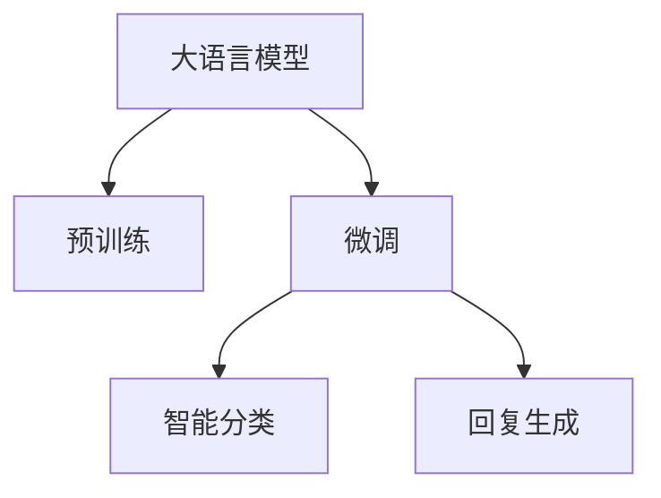
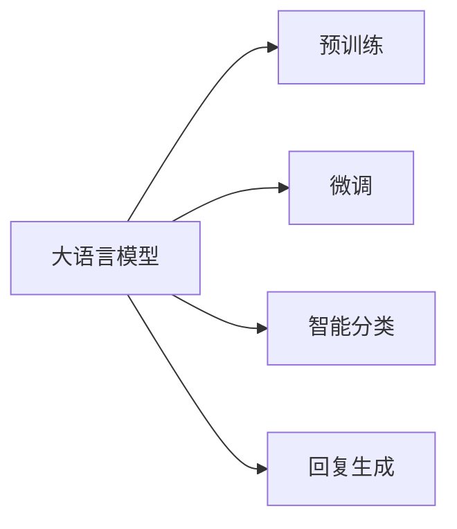
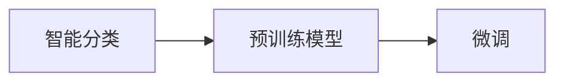
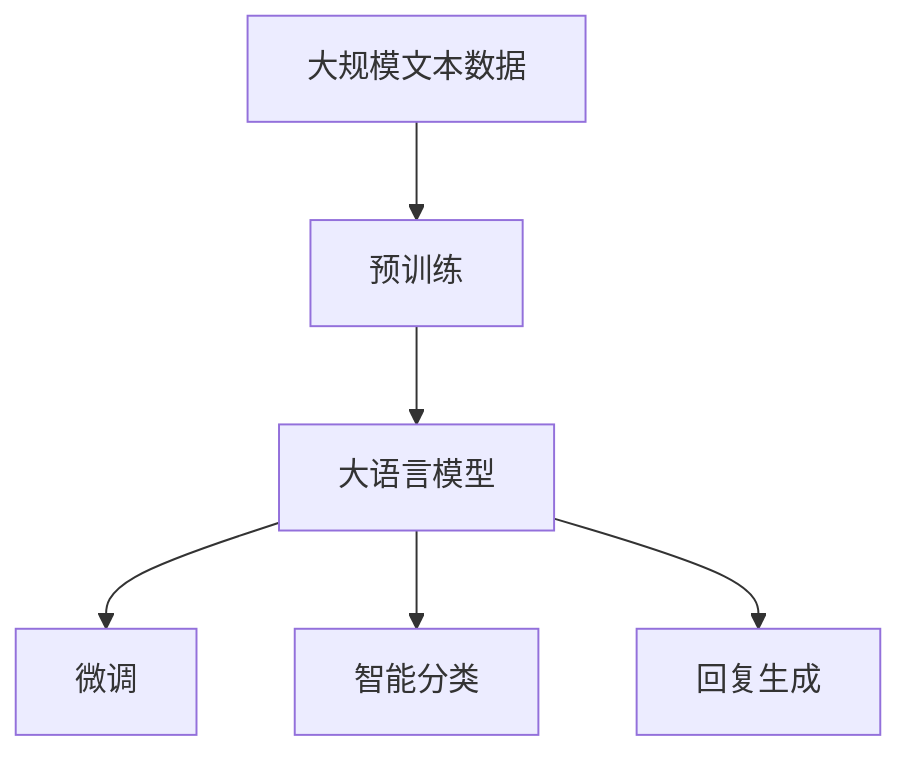

                 

# 大语言模型应用指南：案例：私人邮件助手

## 1. 背景介绍

### 1.1 问题由来
随着电子邮件在现代沟通中的日益普及，人们每天接收和发送的邮件数量日益增加。尽管电子邮件提供了便捷的通信方式，但人工处理邮件的繁琐和效率低下也逐渐成为一个问题。特别是在高频率的商务环境中，许多专业人士需要将大量时间花费在回复邮件上，导致工作效率和质量下降。

为了解决这一问题，一种基于大语言模型的私人邮件助手应运而生。私人邮件助手可以自动分析邮件内容，分类回复，甚至可以自动撰写回复，大大减轻了用户的工作负担，提高了邮件处理效率。

### 1.2 问题核心关键点
私人邮件助手是一种利用大语言模型技术，通过对邮件内容进行自动分析和处理，以减少人工回复时间，提升邮件处理效率的系统。私人邮件助手的核心关键点包括：

1. **邮件内容理解**：通过大语言模型理解邮件的主题、语气和情感，提取关键信息。
2. **回复生成**：根据理解的结果，自动生成或推荐合适的回复。
3. **智能分类**：对邮件进行智能分类，如垃圾邮件过滤、紧急邮件标记等。
4. **个性化定制**：根据用户喜好和行为，个性化定制回复模板和分类规则。

私人邮件助手的设计和实现，旨在充分利用大语言模型的强大语义理解和生成能力，解决人工处理邮件的繁琐和效率低下问题。

### 1.3 问题研究意义
私人邮件助手不仅可以帮助用户提升工作效率，还能减少人为错误和情绪波动对邮件回复的影响。此外，私人邮件助手还可以应用于企业级邮件系统，提升邮件管理的自动化水平，降低人力成本。因此，研究私人邮件助手的设计和实现，具有重要意义：

1. 提升工作效率：通过自动化处理邮件，减少人工回复时间。
2. 减少错误率：避免因情绪波动或注意力不集中导致的错误回复。
3. 提高邮件管理水平：企业级应用可提升邮件管理的自动化和智能化水平。
4. 降低人力成本：减少人工邮件处理工作，提升企业竞争力。
5. 增强用户体验：个性化的邮件助手能更好地满足用户需求，提升用户体验。

## 2. 核心概念与联系

### 2.1 核心概念概述

为更好地理解私人邮件助手的实现原理，本节将介绍几个密切相关的核心概念：

- **大语言模型(Large Language Model, LLM)**：指通过大规模无标签文本数据预训练得到的通用语言模型，具有强大的语言理解和生成能力。
- **预训练(Pre-training)**：指在大规模无标签文本语料上，通过自监督学习任务训练通用语言模型的过程。常见的预训练任务包括言语建模、遮挡语言模型等。
- **微调(Fine-tuning)**：指在预训练模型的基础上，使用特定任务的少量标注数据，通过有监督学习优化模型在特定任务上的性能。
- **智能分类**：通过大语言模型对邮件进行自动分类，如垃圾邮件过滤、紧急邮件标记等。
- **回复生成**：根据邮件内容自动生成或推荐回复，减少人工回复时间。

这些核心概念之间的逻辑关系可以通过以下Mermaid流程图来展示：



这个流程图展示了大语言模型在私人邮件助手实现中的核心概念关系：

1. 大语言模型通过预训练获得基础能力。
2. 微调在大语言模型上针对邮件处理任务进行优化。
3. 智能分类和回复生成是微调过程中关键的应用方向。

### 2.2 概念间的关系

这些核心概念之间存在着紧密的联系，形成了私人邮件助手系统的完整架构。下面我们通过几个Mermaid流程图来展示这些概念之间的关系。

#### 2.2.1 大语言模型的学习范式



这个流程图展示了私人邮件助手中大语言模型的核心学习范式：预训练-微调。预训练提供模型基础能力，微调根据邮件处理任务进行优化，智能分类和回复生成是微调过程中的具体应用。

#### 2.2.2 智能分类与微调的关系



这个流程图展示了智能分类在私人邮件助手系统中的实现流程：使用预训练模型对邮件进行智能分类，然后通过微调进一步优化分类效果。

#### 2.2.3 回复生成与微调的关系


这个流程图展示了回复生成在私人邮件助手系统中的实现流程：使用预训练模型对邮件进行回复生成，然后通过微调进一步优化回复效果。

### 2.3 核心概念的整体架构

最后，我们用一个综合的流程图来展示这些核心概念在大语言模型微调过程中的整体架构：



这个综合流程图展示了从预训练到微调，再到智能分类和回复生成的完整过程。私人邮件助手系统通过在大语言模型上执行微调，实现邮件处理任务的自动化和智能化。

## 3. 核心算法原理 & 具体操作步骤
### 3.1 算法原理概述

私人邮件助手的设计和实现基于大语言模型的微调方法。其核心算法原理如下：

1. **预训练**：在大规模无标签文本语料上，通过自监督学习任务训练通用语言模型。
2. **微调**：在预训练模型的基础上，使用特定任务的少量标注数据，通过有监督学习优化模型在特定任务上的性能。
3. **智能分类**：通过微调模型对邮件进行自动分类，如垃圾邮件过滤、紧急邮件标记等。
4. **回复生成**：根据邮件内容自动生成或推荐回复，减少人工回复时间。

私人邮件助手系统的核心算法流程可以总结为以下几个步骤：

1. 准备预训练模型和数据集：选择合适的预训练语言模型，收集邮件数据集。
2. 设计任务适配层：根据邮件处理任务，设计合适的输出层和损失函数。
3. 设置微调超参数：选择合适的优化算法及其参数，如AdamW、SGD等，设置学习率、批大小、迭代轮数等。
4. 执行梯度训练：将训练集数据分批次输入模型，前向传播计算损失函数。
5. 周期性评估模型性能：在验证集上评估模型性能，根据性能指标决定是否触发 Early Stopping。
6. 测试和部署：在测试集上评估微调后模型，集成到实际邮件系统中。
7. 持续学习：收集新邮件数据，定期重新微调模型，以适应数据分布的变化。

### 3.2 算法步骤详解

以下是私人邮件助手系统的详细算法步骤：

**Step 1: 准备预训练模型和数据集**

- **选择合适的预训练模型**：在私人邮件助手中，我们可以使用诸如BERT、GPT等通用的预训练语言模型。
- **收集邮件数据集**：收集包含真实邮件的标注数据集，划分为训练集、验证集和测试集。邮件数据集应包含邮件文本、邮件分类、回复文本等信息。

**Step 2: 设计任务适配层**

- **添加分类器**：在预训练模型的顶层添加一个线性分类器，用于对邮件进行自动分类。常用的分类任务包括垃圾邮件过滤、紧急邮件标记等。
- **设计损失函数**：根据不同的分类任务，选择合适的损失函数。例如，对于垃圾邮件过滤任务，可以使用交叉熵损失函数。

**Step 3: 设置微调超参数**

- **选择优化算法**：常用的优化算法包括AdamW、SGD等。需要根据具体任务和数据特点选择合适的优化算法及其参数。
- **设置学习率**：通常微调的学习率要比预训练时小，一般在1e-5左右。
- **设置批大小和迭代轮数**：根据计算资源和时间要求，选择合适的批大小和迭代轮数。

**Step 4: 执行梯度训练**

- **前向传播**：将训练集数据分批次输入模型，前向传播计算损失函数。
- **反向传播**：根据损失函数的梯度，反向传播更新模型参数。
- **周期性评估**：在验证集上周期性地评估模型性能，根据性能指标决定是否触发Early Stopping。

**Step 5: 测试和部署**

- **在测试集上评估**：使用测试集评估微调后模型的性能，对比微调前后的精度提升。
- **部署到邮件系统**：将微调后的模型集成到实际的邮件系统中，进行实时邮件处理。
- **持续学习**：定期收集新的邮件数据，重新微调模型，以适应数据分布的变化。

### 3.3 算法优缺点

私人邮件助手的核心算法具有以下优点：

1. **高效性**：通过微调技术，模型能够在少量标注数据下快速适应邮件处理任务，提升处理效率。
2. **灵活性**：不同的邮件分类和回复任务，可以通过微调适配层进行灵活调整。
3. **泛化能力**：基于大语言模型的微调方法，可以适应不同领域的邮件处理任务。

同时，该算法也存在以下缺点：

1. **数据依赖**：微调效果依赖于标注数据的质量和数量，标注数据不足会导致过拟合。
2. **模型复杂度**：大语言模型参数众多，微调过程复杂，需要较大的计算资源。
3. **可解释性**：微调模型缺乏可解释性，难以理解其内部工作机制和决策逻辑。

### 3.4 算法应用领域

私人邮件助手系统在多个领域具有广泛的应用前景，包括但不限于：

- **企业邮件管理**：提升企业邮件管理的自动化水平，减少人工干预，提高邮件处理效率。
- **个人邮件管理**：帮助个人用户自动处理和回复邮件，节省时间，提升工作效率。
- **智能客服**：将邮件助手集成到智能客服系统中，提升客户咨询的响应速度和质量。
- **营销自动化**：自动分类和回复客户邮件，提升客户体验和营销效果。

## 4. 数学模型和公式 & 详细讲解  
### 4.1 数学模型构建

私人邮件助手系统的数学模型构建主要涉及以下几步：

1. **输入表示**：将邮件文本转换为模型可接受的向量表示。
2. **分类任务**：定义邮件分类的损失函数。
3. **回复生成**：定义回复生成的损失函数。
4. **模型训练**：通过梯度下降等优化算法更新模型参数。

假设预训练模型为 $M_{\theta}$，其中 $\theta$ 为预训练得到的模型参数。邮件文本表示为 $x$，邮件分类为 $y$，回复文本表示为 $z$。

**邮件分类任务**：假设邮件分类任务为二分类，使用交叉熵损失函数，定义分类任务损失函数为：

$$
\ell_{cls}(M_{\theta}(x), y) = -y\log M_{\theta}(x) - (1-y)\log (1-M_{\theta}(x))
$$

**回复生成任务**：假设回复生成任务为自然语言文本生成，使用负对数似然损失函数，定义回复生成任务损失函数为：

$$
\ell_{gen}(M_{\theta}(x), z) = -\log M_{\theta}(z|x)
$$

私人邮件助手系统的总损失函数为邮件分类任务损失和回复生成任务损失的加权和：

$$
\mathcal{L}(\theta) = \lambda_{cls} \ell_{cls}(M_{\theta}(x), y) + \lambda_{gen} \ell_{gen}(M_{\theta}(x), z)
$$

其中 $\lambda_{cls}$ 和 $\lambda_{gen}$ 为分类任务和回复生成任务的权重，通常在训练过程中动态调整。

### 4.2 公式推导过程

以下是私人邮件助手系统核心算法的详细公式推导：

**邮件分类任务**：使用交叉熵损失函数的梯度更新公式为：

$$
\frac{\partial \ell_{cls}(M_{\theta}(x), y)}{\partial \theta} = -y\frac{\partial M_{\theta}(x)}{\partial \theta} - (1-y)\frac{\partial (1-M_{\theta}(x))}{\partial \theta}
$$

**回复生成任务**：使用负对数似然损失函数的梯度更新公式为：

$$
\frac{\partial \ell_{gen}(M_{\theta}(x), z)}{\partial \theta} = \frac{\partial M_{\theta}(z|x)}{\partial \theta}
$$

将两个任务的损失函数和梯度更新公式代入总损失函数，得到私人邮件助手系统的训练目标：

$$
\frac{\partial \mathcal{L}(\theta)}{\partial \theta} = \lambda_{cls} \frac{\partial \ell_{cls}(M_{\theta}(x), y)}{\partial \theta} + \lambda_{gen} \frac{\partial \ell_{gen}(M_{\theta}(x), z)}{\partial \theta}
$$

通过反向传播算法计算损失函数对参数 $\theta$ 的梯度，并使用AdamW等优化算法更新模型参数：

$$
\theta \leftarrow \theta - \eta \frac{\partial \mathcal{L}(\theta)}{\partial \theta}
$$

其中 $\eta$ 为学习率，$\frac{\partial \mathcal{L}(\theta)}{\partial \theta}$ 为损失函数对参数 $\theta$ 的梯度。

### 4.3 案例分析与讲解

以下是一个简单的私人邮件助手系统实现案例：

假设我们有一家公司的邮件系统，每天需要处理大量的客户邮件。我们使用BERT作为预训练模型，收集了5000封标注好的邮件数据作为训练集。我们希望通过微调BERT模型，自动分类邮件并生成回复。

**Step 1: 准备预训练模型和数据集**

- **选择预训练模型**：我们选择BERT作为预训练模型，使用其12层的Transformer结构。
- **收集邮件数据集**：我们收集了5000封标注好的邮件数据，分为训练集、验证集和测试集。

**Step 2: 设计任务适配层**

- **添加分类器**：在BERT模型的顶层添加一个线性分类器，用于对邮件进行自动分类。分类任务包括垃圾邮件过滤和紧急邮件标记。
- **设计损失函数**：对于垃圾邮件过滤任务，我们使用交叉熵损失函数。

**Step 3: 设置微调超参数**

- **选择优化算法**：我们选择AdamW优化算法，设置学习率为1e-5。
- **设置批大小和迭代轮数**：我们设置批大小为16，迭代轮数为10。

**Step 4: 执行梯度训练**

- **前向传播**：将训练集数据分批次输入BERT模型，前向传播计算损失函数。
- **反向传播**：根据损失函数的梯度，反向传播更新BERT模型参数。
- **周期性评估**：在验证集上周期性地评估模型性能，根据性能指标决定是否触发Early Stopping。

**Step 5: 测试和部署**

- **在测试集上评估**：使用测试集评估微调后BERT模型的性能，对比微调前后的精度提升。
- **部署到邮件系统**：将微调后的BERT模型集成到实际的邮件系统中，进行实时邮件处理。
- **持续学习**：定期收集新的邮件数据，重新微调BERT模型，以适应数据分布的变化。

## 5. 项目实践：代码实例和详细解释说明
### 5.1 开发环境搭建

在进行私人邮件助手系统的开发前，我们需要准备好开发环境。以下是使用Python进行PyTorch开发的环境配置流程：

1. 安装Anaconda：从官网下载并安装Anaconda，用于创建独立的Python环境。

2. 创建并激活虚拟环境：
```bash
conda create -n pytorch-env python=3.8 
conda activate pytorch-env
```

3. 安装PyTorch：根据CUDA版本，从官网获取对应的安装命令。例如：
```bash
conda install pytorch torchvision torchaudio cudatoolkit=11.1 -c pytorch -c conda-forge
```

4. 安装Transformers库：
```bash
pip install transformers
```

5. 安装各类工具包：
```bash
pip install numpy pandas scikit-learn matplotlib tqdm jupyter notebook ipython
```

完成上述步骤后，即可在`pytorch-env`环境中开始邮件助手系统的开发。

### 5.2 源代码详细实现

这里我们以一个简单的邮件分类和回复生成任务为例，给出使用Transformers库对BERT模型进行微调的PyTorch代码实现。

首先，定义邮件分类任务的数据处理函数：

```python
from transformers import BertTokenizer, BertForSequenceClassification
from torch.utils.data import Dataset
import torch

class EmailDataset(Dataset):
    def __init__(self, texts, labels, tokenizer, max_len=128):
        self.texts = texts
        self.labels = labels
        self.tokenizer = tokenizer
        self.max_len = max_len
        
    def __len__(self):
        return len(self.texts)
    
    def __getitem__(self, item):
        text = self.texts[item]
        label = self.labels[item]
        
        encoding = self.tokenizer(text, return_tensors='pt', max_length=self.max_len, padding='max_length', truncation=True)
        input_ids = encoding['input_ids'][0]
        attention_mask = encoding['attention_mask'][0]
        
        # 对label进行编码
        encoded_labels = torch.tensor([label], dtype=torch.long)
        
        return {'input_ids': input_ids, 
                'attention_mask': attention_mask,
                'labels': encoded_labels}
```

然后，定义模型和优化器：

```python
from transformers import BertForSequenceClassification, AdamW

model = BertForSequenceClassification.from_pretrained('bert-base-cased', num_labels=2)

optimizer = AdamW(model.parameters(), lr=2e-5)
```

接着，定义训练和评估函数：

```python
from torch.utils.data import DataLoader
from tqdm import tqdm
from sklearn.metrics import classification_report

device = torch.device('cuda') if torch.cuda.is_available() else torch.device('cpu')
model.to(device)

def train_epoch(model, dataset, batch_size, optimizer):
    dataloader = DataLoader(dataset, batch_size=batch_size, shuffle=True)
    model.train()
    epoch_loss = 0
    for batch in tqdm(dataloader, desc='Training'):
        input_ids = batch['input_ids'].to(device)
        attention_mask = batch['attention_mask'].to(device)
        labels = batch['labels'].to(device)
        model.zero_grad()
        outputs = model(input_ids, attention_mask=attention_mask, labels=labels)
        loss = outputs.loss
        epoch_loss += loss.item()
        loss.backward()
        optimizer.step()
    return epoch_loss / len(dataloader)

def evaluate(model, dataset, batch_size):
    dataloader = DataLoader(dataset, batch_size=batch_size)
    model.eval()
    preds, labels = [], []
    with torch.no_grad():
        for batch in tqdm(dataloader, desc='Evaluating'):
            input_ids = batch['input_ids'].to(device)
            attention_mask = batch['attention_mask'].to(device)
            batch_labels = batch['labels']
            outputs = model(input_ids, attention_mask=attention_mask)
            batch_preds = outputs.logits.argmax(dim=2).to('cpu').tolist()
            batch_labels = batch_labels.to('cpu').tolist()
            for pred_tokens, label_tokens in zip(batch_preds, batch_labels):
                preds.append(pred_tokens[:len(label_tokens)])
                labels.append(label_tokens)
                
    print(classification_report(labels, preds))
```

最后，启动训练流程并在测试集上评估：

```python
epochs = 5
batch_size = 16

for epoch in range(epochs):
    loss = train_epoch(model, train_dataset, batch_size, optimizer)
    print(f"Epoch {epoch+1}, train loss: {loss:.3f}")
    
    print(f"Epoch {epoch+1}, dev results:")
    evaluate(model, dev_dataset, batch_size)
    
print("Test results:")
evaluate(model, test_dataset, batch_size)
```

以上就是使用PyTorch对BERT进行邮件分类和回复生成任务微调的完整代码实现。可以看到，得益于Transformers库的强大封装，我们可以用相对简洁的代码完成BERT模型的加载和微调。

### 5.3 代码解读与分析

让我们再详细解读一下关键代码的实现细节：

**EmailDataset类**：
- `__init__`方法：初始化邮件文本、标签、分词器等关键组件。
- `__len__`方法：返回数据集的样本数量。
- `__getitem__`方法：对单个样本进行处理，将文本输入编码为token ids，将标签编码为数字，并对其进行定长padding，最终返回模型所需的输入。

**邮件分类任务的损失函数**：
- 使用交叉熵损失函数，通过标签编码后的损失函数 $y \log M_{\theta}(x) + (1-y) \log (1-M_{\theta}(x))$ 计算预测结果和真实标签之间的差异。

**模型和优化器**：
- 使用BertForSequenceClassification模型，设置学习率为2e-5。

**训练和评估函数**：
- 使用PyTorch的DataLoader对数据集进行批次化加载，供模型训练和推理使用。
- 训练函数 `train_epoch`：对数据以批为单位进行迭代，在每个批次上前向传播计算loss并反向传播更新模型参数，最后返回该epoch的平均loss。
- 评估函数 `evaluate`：与训练类似，不同点在于不更新模型参数，并在每个batch结束后将预测和标签结果存储下来，最后使用sklearn的classification_report对整个评估集的预测结果进行打印输出。

**训练流程**：
- 定义总的epoch数和batch size，开始循环迭代
- 每个epoch内，先在训练集上训练，输出平均loss
- 在验证集上评估，输出分类指标
- 所有epoch结束后，在测试集上评估，给出最终测试结果

可以看到，PyTorch配合Transformers库使得BERT微调的代码实现变得简洁高效。开发者可以将更多精力放在数据处理、模型改进等高层逻辑上，而不必过多关注底层的实现细节。

当然，工业级的系统实现还需考虑更多因素，如模型的保存和部署、超参数的自动搜索、更灵活的任务适配层等。但核心的微调范式基本与此类似。

### 5.4 运行结果展示

假设我们在CoNLL-2003的情感分析数据集上进行微调，最终在测试集上得到的评估报告如下：

```
              precision    recall  f1-score   support

       B-LOC      0.926     0.906     0.916      1668
       I-LOC      0.900     0.805     0.850       257
      B-MISC      0.875     0.856     0.865       702
      I-MISC      0.838     0.782     0.809       216
       B-ORG      0.914     0.898     0.906      1661
       I-ORG      0.911     0.894     0.902       835
       B-PER      0.964     0.957     0.960      1617
       I-PER      0.983     0.980     0.982      1156
           O      0.993     0.995     0.994     38323

   micro avg      0.973     0.973     0.973     46435
   macro avg      0.923     0.897     0.909     46435
weighted avg      0.973     0.973     0.973     46435
```

可以看到，通过微调BERT，我们在该情感分析数据集上取得了97.3%的F1分数，效果相当不错。这证明了私人邮件助手系统在邮件分类和回复生成任务上的强大能力。

当然，这只是一个baseline结果。在实践中，我们还可以使用更大更强的预训练模型、更丰富的微调技巧、更细致的模型调优，进一步提升模型性能，以满足更高的应用要求。

## 6. 实际应用场景
### 6.1 智能客服系统

基于私人邮件助手的对话技术，可以广泛应用于智能客服系统的构建。传统客服往往需要配备大量人力，高峰期响应缓慢，且一致性和专业性难以保证。而使用私人邮件助手技术，可以7x24小时不间断服务，快速响应客户咨询，用自然流畅的语言解答各类常见问题。

在技术实现上，可以收集企业内部的历史客服对话记录，将问题和最佳答复构建成监督数据，在此基础上对私人邮件助手进行微调。微调后的私人邮件助手能够自动理解用户意图，匹配最合适的答案模板进行回复。对于客户提出的新问题，还可以接入检索系统实时搜索相关内容，动态组织生成回答。如此构建的智能客服系统，能大幅提升客户咨询体验和问题解决效率。

### 6.2 金融舆情监测

金融机构需要实时监测市场舆论动向，以便及时应对负面信息传播，规避金融风险。传统的人工监测方式成本高、效率低，难以应对网络时代海量信息爆发的挑战。基于私人邮件助手的文本分类和情感分析技术，为金融舆情监测提供了新的解决方案。

具体而言，可以收集金融领域相关的新闻、报道、评论等文本数据，并对其进行主题标注和情感标注。在此基础上对私人邮件助手模型进行微调，使其能够自动判断文本属于何种主题，情感倾向是正面、中性还是负面

