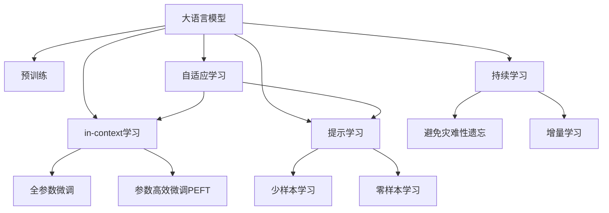
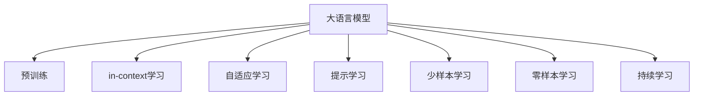
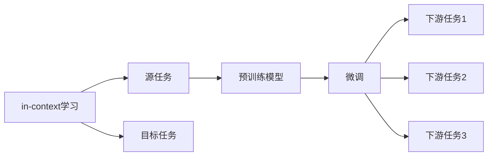
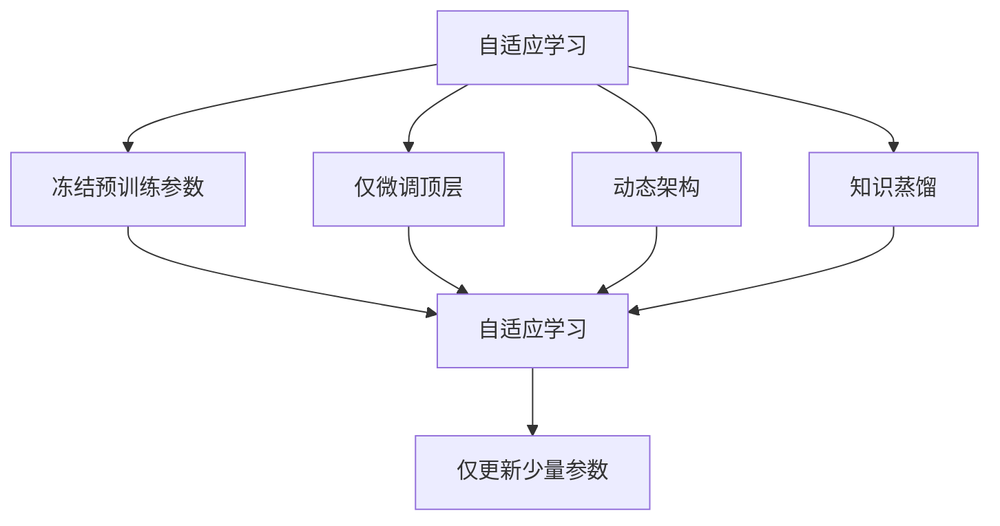
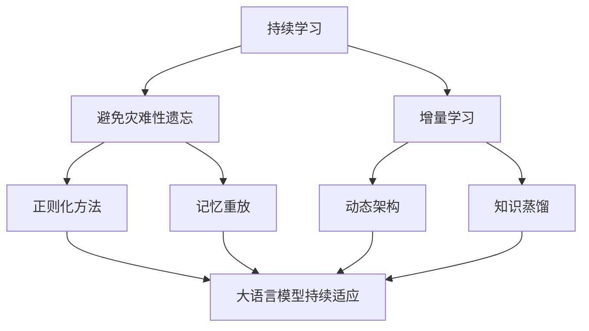
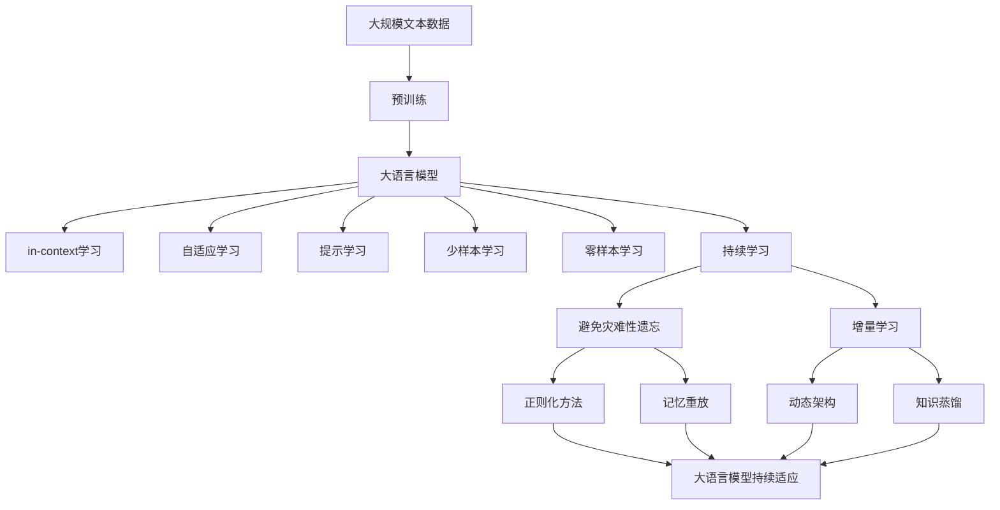

                 

# 大语言模型的in-context学习原理与代码实例讲解

> 关键词：大语言模型,in-context学习,自监督学习,监督学习,Transformer,BERT,自适应学习,微调(Fine-Tuning)

## 1. 背景介绍

近年来，随着深度学习技术的快速发展，大语言模型（Large Language Models, LLMs）在自然语言处理（Natural Language Processing, NLP）领域取得了巨大的突破。这些大语言模型通过在大规模无标签文本数据上进行预训练，学习到了丰富的语言知识和常识，可以通过少量的有标签样本在下游任务上进行微调（Fine-Tuning），获得优异的性能。其中最具代表性的大模型包括OpenAI的GPT系列模型、Google的BERT、T5等。

然而，由于预训练语料的广泛性和泛化能力的不足，这些通用的大语言模型在特定领域应用时，效果往往难以达到实际应用的要求。因此，如何针对特定任务进行大模型微调，提升模型性能，成为了当前大语言模型研究和应用的一个热点问题。本文聚焦于大语言模型的in-context学习（In-Context Learning）方法，但同时也会兼顾参数高效微调和提示学习等前沿技术，以期对大语言模型微调实践提供更全面的指导。

## 2. 核心概念与联系

### 2.1 核心概念概述

为更好地理解大语言模型的in-context学习，本节将介绍几个密切相关的核心概念：

- 大语言模型（Large Language Model, LLM）：以自回归（如GPT）或自编码（如BERT）模型为代表的大规模预训练语言模型。通过在大规模无标签文本语料上进行预训练，学习通用的语言表示，具备强大的语言理解和生成能力。

- 预训练（Pre-training）：指在大规模无标签文本语料上，通过自监督学习任务训练通用语言模型的过程。常见的预训练任务包括言语建模、遮挡语言模型等。预训练使得模型学习到语言的通用表示。

- in-context学习（In-Context Learning）：指在预训练模型的基础上，使用下游任务的少量标注数据，通过有监督地训练优化模型在该任务上的性能。在in-context学习中，模型会根据输入文本中的少量上下文信息（in-context prompts），直接生成输出，无需微调过程。

- 自适应学习（Adaptive Learning）：指模型能够根据输入的不同上下文信息，自动调整输出策略，无需微调参数。自适应学习可以显著降低微调成本，提高模型的实时性和泛化能力。

- 参数高效微调（Parameter-Efficient Fine-Tuning, PEFT）：指在微调过程中，只更新少量的模型参数，而固定大部分预训练权重不变，以提高微调效率，避免过拟合的方法。

- 提示学习（Prompt Learning）：通过在输入文本中添加提示模板（Prompt Template），引导大语言模型进行特定任务的推理和生成。可以在不更新模型参数的情况下，实现零样本或少样本学习。

- 少样本学习（Few-shot Learning）：指在只有少量标注样本的情况下，模型能够快速适应新任务的学习方法。在大语言模型中，通常通过在输入中提供少量示例来实现，无需更新模型参数。

- 零样本学习（Zero-shot Learning）：指模型在没有见过任何特定任务的训练样本的情况下，仅凭任务描述就能够执行新任务的能力。大语言模型通过预训练获得的广泛知识，使其能够理解任务指令并生成相应输出。

- 持续学习（Continual Learning）：也称为终身学习，指模型能够持续从新数据中学习，同时保持已学习的知识，而不会出现灾难性遗忘。这对于保持大语言模型的时效性和适应性至关重要。

这些核心概念之间的逻辑关系可以通过以下Mermaid流程图来展示：



这个流程图展示了大语言模型的核心概念及其之间的关系：

1. 大语言模型通过预训练获得基础能力。
2. in-context学习利用预训练模型的强大表示能力，直接通过上下文信息生成输出，无需微调。
3. 自适应学习进一步优化了in-context学习的效果，使其能够更好地适应不同上下文信息。
4. 微调方法包括全参数微调和参数高效微调，以适应特定任务的精度要求。
5. 提示学习可以在不更新模型参数的情况下，实现零样本或少样本学习。
6. 少样本学习和零样本学习利用输入中的少量样本，进行高效适应。
7. 持续学习使模型能够不断学习新知识，同时保持已学习的知识。

这些核心概念共同构成了大语言模型的学习和应用框架，使其能够在各种场景下发挥强大的语言理解和生成能力。通过理解这些核心概念，我们可以更好地把握大语言模型的工作原理和优化方向。

### 2.2 概念间的关系

这些核心概念之间存在着紧密的联系，形成了大语言模型的in-context学习完整生态系统。下面我通过几个Mermaid流程图来展示这些概念之间的关系。

#### 2.2.1 大语言模型的学习范式



这个流程图展示了大语言模型的三种主要学习范式：预训练、in-context学习和自适应学习。in-context学习利用预训练模型的强大表示能力，直接通过上下文信息生成输出，无需微调。自适应学习进一步优化了in-context学习的效果，使其能够更好地适应不同上下文信息。提示学习可以在不更新模型参数的情况下，实现零样本或少样本学习。少样本学习和零样本学习利用输入中的少量样本，进行高效适应。持续学习使模型能够不断学习新知识，同时保持已学习的知识。

#### 2.2.2 in-context学习与微调的关系



这个流程图展示了in-context学习的基本原理，以及它与微调的关系。in-context学习涉及源任务和目标任务，预训练模型在源任务上学习，然后通过自适应学习适应各种下游任务（目标任务）。

#### 2.2.3 自适应学习方法



这个流程图展示了几种常见的自适应学习方法，包括冻结预训练参数、仅微调顶层、动态架构和知识蒸馏等。这些方法的共同特点是冻结大部分预训练参数，只更新少量参数，从而提高自适应学习效率。

#### 2.2.4 持续学习在大语言模型中的应用



这个流程图展示了持续学习在大语言模型中的应用。持续学习的主要目标是避免灾难性遗忘和实现增量学习。通过正则化方法、记忆重放、动态架构和知识蒸馏等技术，可以使大语言模型持续适应新的任务和数据。

### 2.3 核心概念的整体架构

最后，我们用一个综合的流程图来展示这些核心概念在大语言模型的in-context学习过程中的整体架构：



这个综合流程图展示了从预训练到in-context学习，再到持续学习的完整过程。大语言模型首先在大规模文本数据上进行预训练，然后通过in-context学习利用预训练模型的强大表示能力，直接通过上下文信息生成输出，无需微调。自适应学习进一步优化了in-context学习的效果，使其能够更好地适应不同上下文信息。提示学习可以在不更新模型参数的情况下，实现零样本或少样本学习。持续学习使模型能够不断学习新知识，同时保持已学习的知识。

## 3. 核心算法原理 & 具体操作步骤
### 3.1 算法原理概述

大语言模型的in-context学习，本质上是一种基于自适应学习（Adaptive Learning）的微调（Fine-Tuning）方法。其核心思想是：将预训练的大语言模型视作一个强大的"特征提取器"，通过下游任务的少量标注数据，利用上下文信息（in-context prompts），优化模型在该任务上的性能。

形式化地，假设预训练模型为 $M_{\theta}$，其中 $\theta$ 为预训练得到的模型参数。给定下游任务 $T$ 的标注数据集 $D=\{(x_i, y_i)\}_{i=1}^N$，in-context学习的目标是在训练集上通过有监督地训练优化模型输出，使得模型对每个输入 $x$ 的预测输出 $\hat{y}$ 逼近真实标签 $y$。

in-context学习过程不需要对模型参数进行显式更新，而是通过上下文信息引导模型进行推理和生成。这种方法的优点在于，它可以显著降低微调成本，提高模型的实时性和泛化能力，尤其适用于数据量较少或无法获得标注数据的场景。

### 3.2 算法步骤详解

基于监督学习的大语言模型的in-context学习一般包括以下几个关键步骤：

**Step 1: 准备预训练模型和数据集**
- 选择合适的预训练语言模型 $M_{\theta}$ 作为初始化参数，如 BERT、GPT 等。
- 准备下游任务 $T$ 的标注数据集 $D$，划分为训练集、验证集和测试集。一般要求标注数据与预训练数据的分布不要差异过大。

**Step 2: 添加任务适配层**
- 根据任务类型，在预训练模型顶层设计合适的输出层和损失函数。
- 对于分类任务，通常在顶层添加线性分类器和交叉熵损失函数。
- 对于生成任务，通常使用语言模型的解码器输出概率分布，并以负对数似然为损失函数。

**Step 3: 设置in-context学习超参数**
- 选择合适的优化算法及其参数，如 AdamW、SGD 等，设置学习率、批大小、迭代轮数等。
- 设置正则化技术及强度，包括权重衰减、Dropout、Early Stopping等。
- 确定冻结预训练参数的策略，如仅微调顶层，或全部参数都参与in-context学习。

**Step 4: 执行in-context学习**
- 将训练集数据分批次输入模型，前向传播计算损失函数。
- 根据设定的优化算法和上下文信息（in-context prompts），优化模型输出。
- 周期性在验证集上评估模型性能，根据性能指标决定是否触发 Early Stopping。
- 重复上述步骤直到满足预设的迭代轮数或 Early Stopping 条件。

**Step 5: 测试和部署**
- 在测试集上评估in-context学习后的模型 $M_{\theta}$ 的性能，对比in-context学习和微调前后的精度提升。
- 使用in-context学习后的模型对新样本进行推理预测，集成到实际的应用系统中。
- 持续收集新的数据，定期重新进行in-context学习，以适应数据分布的变化。

以上是基于监督学习的in-context学习的一般流程。在实际应用中，还需要针对具体任务的特点，对in-context学习过程的各个环节进行优化设计，如改进训练目标函数，引入更多的正则化技术，搜索最优的超参数组合等，以进一步提升模型性能。

### 3.3 算法优缺点

基于监督学习的大语言模型的in-context学习具有以下优点：
1. 简单高效。仅需要准备少量标注数据，即可对预训练模型进行快速适配，获得较大的性能提升。
2. 通用适用。适用于各种NLP下游任务，包括分类、匹配、生成等，设计简单的任务适配层即可实现in-context学习。
3. 参数高效。利用in-context学习技术，在固定大部分预训练参数的情况下，仍可取得不错的提升。
4. 效果显著。在学术界和工业界的诸多任务上，基于in-context学习的方法已经刷新了最先进的性能指标。

同时，该方法也存在一定的局限性：
1. 依赖标注数据。in-context学习的性能很大程度上取决于标注数据的质量和数量，获取高质量标注数据的成本较高。
2. 迁移能力有限。当目标任务与预训练数据的分布差异较大时，in-context学习的性能提升有限。
3. 负面效果传递。预训练模型的固有偏见、有害信息等，可能通过in-context学习传递到下游任务，造成负面影响。
4. 可解释性不足。in-context学习模型的决策过程通常缺乏可解释性，难以对其推理逻辑进行分析和调试。

尽管存在这些局限性，但就目前而言，基于监督学习的in-context学习仍是大语言模型应用的最主流范式。未来相关研究的重点在于如何进一步降低in-context学习对标注数据的依赖，提高模型的少样本学习和跨领域迁移能力，同时兼顾可解释性和伦理安全性等因素。

### 3.4 算法应用领域

基于大语言模型的in-context学习，在NLP领域已经得到了广泛的应用，覆盖了几乎所有常见任务，例如：

- 文本分类：如情感分析、主题分类、意图识别等。通过上下文信息引导模型学习文本-标签映射。
- 命名实体识别：识别文本中的人名、地名、机构名等特定实体。通过上下文信息引导模型掌握实体边界和类型。
- 关系抽取：从文本中抽取实体之间的语义关系。通过上下文信息引导模型学习实体-关系三元组。
- 问答系统：对自然语言问题给出答案。将问题-答案对作为上下文信息，in-context学习模型学习匹配答案。
- 机器翻译：将源语言文本翻译成目标语言。通过上下文信息引导模型学习语言-语言映射。
- 文本摘要：将长文本压缩成简短摘要。通过上下文信息引导模型抓取要点。
- 对话系统：使机器能够与人自然对话。通过对话历史作为上下文信息，in-context学习模型进行回复生成。

除了上述这些经典任务外，in-context学习还被创新性地应用到更多场景中，如可控文本生成、常识推理、代码生成、数据增强等，为NLP技术带来了全新的突破。随着in-context学习方法的不断进步，相信NLP技术将在更广阔的应用领域大放异彩。

## 4. 数学模型和公式 & 详细讲解  
### 4.1 数学模型构建

本节将使用数学语言对基于监督学习的大语言模型的in-context学习过程进行更加严格的刻画。

记预训练语言模型为 $M_{\theta}$，其中 $\theta$ 为预训练得到的模型参数。假设微调任务的训练集为 $D=\{(x_i, y_i)\}_{i=1}^N, x_i \in \mathcal{X}, y_i \in \mathcal{Y}$。

定义模型 $M_{\theta}$ 在输入 $x$ 上的输出为 $\hat{y}=M_{\theta}(x)$，表示模型对输入的预测。在in-context学习中，我们通常通过上下文信息（in-context prompts）引导模型进行推理和生成，这些上下文信息可以是一个问题、一个段落、一个实例等。

在in-context学习中，我们通常使用交叉熵损失函数（Cross-Entropy Loss），定义为：

$$
\ell(M_{\theta}(x),y) = -y\log M_{\theta}(x)
$$

将其代入经验风险公式，得：

$$
\mathcal{L}(\theta) = -\frac{1}{N}\sum_{i=1}^N y_i\log M_{\theta}(x_i)
$$

in-context学习的过程不需要对模型参数进行显式更新，而是通过上下文信息引导模型进行推理和生成。这种方法的优点在于，它可以显著降低微调成本，提高模型的实时性和泛化能力，尤其适用于数据量较少或无法获得标注数据的场景。

### 4.2 公式推导过程

以下我们以二分类任务为例，推导交叉熵损失函数及其梯度的计算公式。

假设模型 $M_{\theta}$ 在输入 $x$ 上的输出为 $\hat{y}=M_{\theta}(x) \in [0,1]$，表示样本属于正类的概率。真实标签 $y \in \{0,1\}$。则二分类交叉熵损失函数定义为：

$$
\ell(M_{\theta}(x),y) = -[y\log \hat{y} + (1-y)\log (1-\hat{y})]
$$

将其代入经验风险公式，得：

$$
\mathcal{L}(\theta) = -\frac{1}{N}\sum_{i=1}^N [y_i\log M_{\theta}(x_i)+(1-y_i)\log(1-M_{\theta}(x_i))]
$$

在in-context学习中，我们通常将输入 $x$ 作为一个完整的句子或段落，其中包含了上下文信息。模型的输出 $\hat{y}$ 是一个概率分布，表示模型预测每个词属于正类的概率。在实际应用中，我们可以使用语言模型的解码器输出概率分布，并以负对数似然为损失函数。

### 4.3 案例分析与讲解

为了更好地理解in-context学习的过程，让我们以一个简单的示例进行分析：

假设我们有一个问答系统，需要回答用户提出的自然语言问题。我们可以通过预先收集大量的问答对，将这些对作为上下文信息（in-context prompts），将问题作为模型的输入，利用in-context学习模型进行推理和生成，得到答案。

具体步骤如下：

1. 收集大量的问答对，其中包含了问题和对应的答案。
2. 将问题和答案拼接成一个完整的句子，作为模型的输入。
3. 在模型上进行前向传播，计算输出概率分布。
4. 使用交叉熵损失函数计算模型输出的误差。
5. 通过上下文信息引导模型进行推理和生成，得到答案。

这个简单的示例展示了in-context学习的基本流程。在实际应用中，我们可以利用这个流程解决更多的NLP问题，如命名实体识别、关系抽取等。通过合理设计上下文信息，in-context学习可以有效地利用预训练模型的强大表示能力，直接通过上下文信息生成输出，无需微调过程。

## 5. 项目实践：代码实例和详细解释说明
### 5.1 开发环境搭建

在进行in-context学习实践前，我们需要准备好开发环境。以下是使用Python进行PyTorch开发的环境配置流程：

1. 安装Anaconda：从官网下载并安装Anaconda，用于创建独立的Python环境。

2. 创建并激活虚拟环境：
```bash
conda create -n pytorch-env python=3.8 
conda activate pytorch-env
```

3. 安装PyTorch：根据CUDA版本，从官网获取对应的安装命令。例如：
```bash
conda install pytorch torchvision torchaudio cudatoolkit=11.1 -c pytorch -c conda-forge
```

4. 安装Transformers库：
```bash
pip install transformers
```

5. 安装各类工具包：
```bash
pip install numpy pandas scikit-learn matplotlib tqdm jupyter notebook ipython
```

完成上述步骤后，即可在`pytorch-env`环境中开始in-context学习实践。

### 5.2 源代码详细实现

下面我们以命名实体识别(NER)任务为例，给出使用Transformers库对BERT模型进行in-context学习的PyTorch代码实现。

首先，定义NER任务的数据处理函数：

```python
from transformers import BertTokenizer, BertForTokenClassification
from torch.utils.data import Dataset
import torch

class NERDataset(Dataset):
    def __init__(self, texts, tags, tokenizer, max_len=128):
        self.texts = texts
        self.tags = tags
        self.tokenizer = tokenizer
        self.max_len = max_len
        
    def __len__(self):
        return len(self.texts)
    
    def __getitem__(self, item):
        text = self.texts[item]
        tags = self.tags[item]
        
        encoding = self.tokenizer(text, return_tensors='pt', max_length=self.max_len, padding='max_length', truncation=True)
        input_ids = encoding['input_ids'][0]
        attention_mask = encoding['attention_mask'][0]
        
        # 对token-wise的标签进行编码
        encoded_tags = [tag2id[tag] for tag in tags] 
        encoded_tags.extend([tag2id['O']] * (self.max_len - len(encoded_tags)))
        labels = torch.tensor(encoded_tags, dtype=torch.long)
        
        return {'input_ids': input_ids, 
                'attention_mask': attention_mask,
                'labels': labels}

# 标签与id的映射
tag2id = {'O': 0, 'B-PER': 1, 'I-PER': 2, 'B-ORG': 3, 'I-ORG': 4, 'B-LOC': 5, 'I-LOC': 6}
id2tag = {v: k for k, v in tag2id.items()}

# 创建dataset
tokenizer = BertTokenizer.from_pretrained('bert-base-cased')

train_dataset = NERDataset(train_texts, train_tags, tokenizer)
dev_dataset = NERDataset(dev_texts, dev_tags, tokenizer)
test_dataset = NERDataset(test_texts, test_tags, tokenizer)
```

然后，定义模型和优化器：

```python
from transformers import BertForTokenClassification, AdamW

model = BertForTokenClassification.from_pretrained('bert-base-cased', num_labels=len(tag2id))

optimizer = AdamW(model.parameters(), lr=2e-5)
```

接着，定义训练和评估函数：

```python
from torch.utils.data import DataLoader
from tqdm import tqdm
from sklearn.metrics import classification_report

device = torch.device('cuda') if torch.cuda.is_available() else torch.device('cpu')
model.to(device)

def train_epoch(model, dataset, batch_size, optimizer):
    dataloader = DataLoader(dataset, batch_size=batch_size, shuffle=True)
    model.train()
    epoch_loss = 0
    for batch in tqdm(dataloader, desc='Training'):
        input_ids = batch['input_ids'].to(device)
        attention_mask = batch['attention_mask'].to(device)
        labels = batch['labels'].to(device)
        model.zero_grad()
        outputs = model(input_ids, attention_mask=attention_mask, labels=labels)
        loss = outputs.loss
        epoch_loss += loss.item()
        loss.backward()
        optimizer.step()
    return epoch_loss / len(dataloader)

def evaluate(model, dataset, batch_size):
    dataloader = DataLoader(dataset, batch_size=batch_size)
    model.eval()
    preds, labels = [], []
    with torch.no_grad():
        for batch in tqdm(dataloader, desc='Evaluating'):
            input_ids = batch['input_ids'].to(device)
            attention_mask = batch['attention_mask'].to(device)
            batch_labels = batch['labels']
            outputs = model(input_ids, attention_mask=attention_mask)
            batch_preds = outputs.logits.argmax(dim=2).to('cpu').tolist()
            batch_labels = batch_labels.to('cpu').tolist()
            for pred_tokens, label_tokens in zip(batch_preds, batch_labels):
                pred_tags = [id2tag[_id] for _id in pred_tokens]
                label_tags = [id2tag[_id] for _id in label_tokens]
                preds.append(pred_tags[:len(label_tags)])
                labels.append(label_tags)
                
    print(classification_report(labels, preds))
```

最后，启动训练流程并在测试集上评估：

```python
epochs = 5
batch_size = 16

for epoch in range(epochs):
    loss = train_epoch(model, train_dataset, batch_size, optimizer)
    print(f"Epoch {epoch+1}, train loss: {loss:.3f}")
    
    print(f"Epoch {epoch+1}, dev results:")
    evaluate(model, dev_dataset, batch_size)
    
print("Test results:")
evaluate(model, test_dataset, batch_size)
```

以上就是使用PyTorch对BERT进行命名实体识别任务in-context学习的完整代码实现。可以看到，得益于Transformers库的强大

