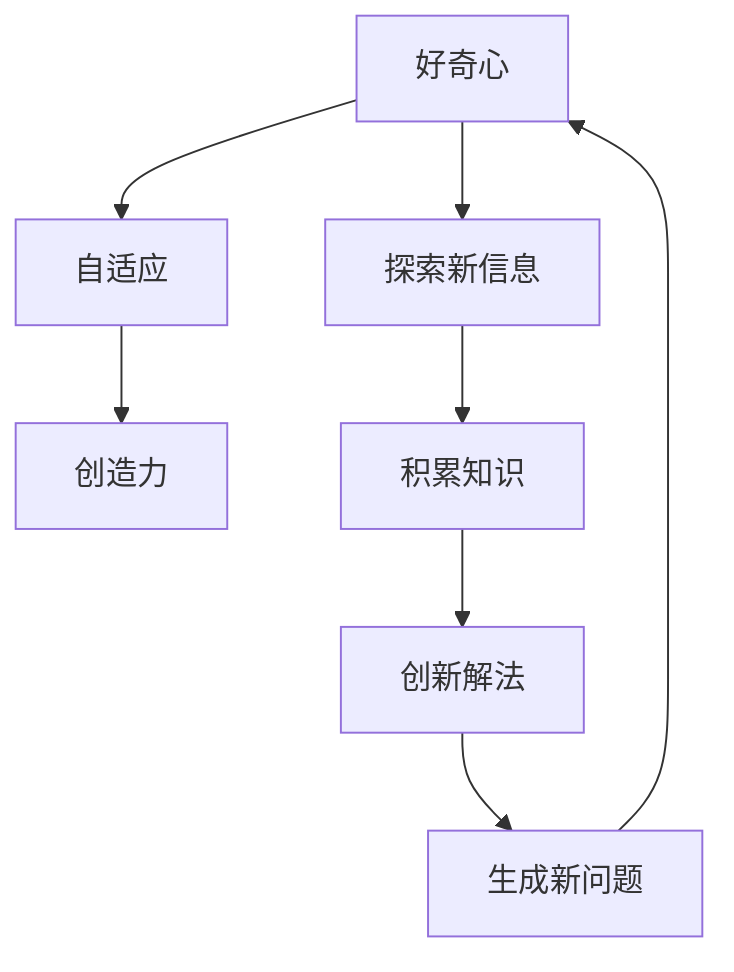

                 

# 好奇心与创造力：探索的双翼

> 关键词：好奇心,创造力,探索,人工智能,认知心理,情感智能,技术驱动,创新驱动,认知心理学,情感认知

## 1. 背景介绍

### 1.1 问题由来
好奇心与创造力一直是人类文明进步的核心驱动力。从古代的伟大发明到现代的科技创新，无数伟大的思想家和科学家都证明了这两大元素的重要性。而在当今这个高度数字化、智能化的时代，好奇心与创造力在人工智能（AI）领域中，也扮演着越来越重要的角色。

### 1.2 问题核心关键点
在AI领域，好奇心与创造力不仅代表了技术创新的动力源泉，也影响着AI系统的人机交互方式和用户体验。好奇心驱动着AI系统的自我探索能力，使其能够主动发现和理解环境中的新信息；创造力则赋予AI系统创新的思维和解决问题的能力，使其能够超越既有的规则和模式，创造新的知识和价值。

### 1.3 问题研究意义
理解好奇心与创造力的内在机制及其在AI中的应用，不仅能够帮助开发者更好地设计AI系统，提升用户体验，还能激发技术社区的创新潜能，推动AI技术的发展和应用。此外，深入研究这两大元素，对人类认知心理和情感智能的提升也有重要意义。

## 2. 核心概念与联系

### 2.1 核心概念概述

好奇心与创造力在AI领域中主要体现在两个方面：

- **好奇心（Curiosity）**：指AI系统对环境中的新信息、未知领域的探索和求知的欲望。好奇心驱动着AI系统的自我学习和适应能力，使其能够主动发现和理解新的模式和规则。

- **创造力（Creativity）**：指AI系统在面对复杂问题时，能够提出新颖的解决方案和创新的思维方式。创造力使AI系统能够超越现有知识的局限，生成新的知识或价值。

### 2.2 概念间的关系

好奇心与创造力之间存在着紧密的联系，形成了一个相互促进的良性循环。

**好奇心驱动创造力**：当AI系统对环境充满好奇心时，它会更主动地探索新信息，积累更多的知识和经验，从而提升其创造力。

**创造力增强好奇心**：创造力使AI系统能够生成新的问题，激发其对未知领域的兴趣和探索欲望，进一步增强好奇心。

这种循环关系使得AI系统在不断的探索和创新中不断进步，最终达到更高的智能水平。

### 2.3 核心概念的整体架构

好奇心与创造力在AI系统中的作用，可以通过以下图表来展示：



这个图表展示了好奇心与创造力在AI系统中的作用机制：好奇心驱动探索新信息，探索过程中积累知识，知识积累提升创造力，创造力生成新问题，新问题激发好奇心，好奇心驱动新的探索和适应过程，创新解法进一步增强创造力。

## 3. 核心算法原理 & 具体操作步骤
### 3.1 算法原理概述

在AI系统中，好奇心与创造力的实现主要依赖于两大学习机制：强化学习和生成对抗网络（GANs）。

- **强化学习（Reinforcement Learning, RL）**：通过奖励机制，鼓励AI系统主动探索新信息，积累经验，逐步提高其好奇心和创造力。强化学习算法通过试错的方式，使AI系统在不断的探索和适应中，不断优化其策略和行为。

- **生成对抗网络（Generative Adversarial Networks, GANs）**：利用对抗训练的方式，生成新的数据和知识，激发AI系统的创造力。GANs通过两个神经网络之间的竞争与合作，不断生成高质量的样本，推动AI系统在创造力方面的突破。

### 3.2 算法步骤详解

以下是强化学习和GANs在AI系统中实现好奇心与创造力的具体步骤：

**强化学习（RL）**：

1. **环境建模**：定义AI系统的环境，包括状态、动作、奖励等。环境可以是现实世界的环境，也可以是模拟环境。

2. **策略设计**：设计AI系统的策略，即在特定状态下应采取何种动作。策略可以是基于规则的、基于机器学习的，或者混合策略。

3. **奖励设计**：设计奖励函数，用于评估AI系统在探索过程中的表现。奖励可以是基于任务完成的、基于知识积累的，或者混合奖励。

4. **训练与优化**：通过与环境的交互，AI系统不断尝试不同的动作，根据奖励函数的反馈调整策略，逐步提高其好奇心和创造力。

**生成对抗网络（GANs）**：

1. **生成器设计**：设计生成器网络，用于生成新的数据或知识。生成器可以是基于深度学习的神经网络。

2. **判别器设计**：设计判别器网络，用于区分生成的数据或知识与真实数据或知识的差异。判别器同样可以是深度学习的神经网络。

3. **对抗训练**：生成器与判别器交替训练，生成器尝试生成尽可能接近真实的数据或知识，判别器则试图分辨生成的数据或知识与真实数据或知识的差异。

4. **结果评估**：通过评估生成的数据或知识的质量，判断生成器的创造力水平。

### 3.3 算法优缺点

**强化学习（RL）**的优点：
- 能够自适应地探索环境，逐步提高好奇心和创造力。
- 适用于动态变化的环境，能够实时调整策略。
- 可以处理复杂的决策问题，具有较高的灵活性和适应性。

**强化学习的缺点**：
- 需要大量的探索过程，训练时间较长。
- 需要设计合适的奖励函数，否则容易导致策略失效。
- 对环境建模的要求较高，难度较大。

**生成对抗网络（GANs）**的优点：
- 能够生成高质量的新数据或知识，激发创造力。
- 训练过程相对简单，易于实现。
- 适用于图像、音频等多模态数据的生成。

**GANs的缺点**：
- 生成器与判别器的对抗训练过程较为复杂，需要大量的计算资源。
- 生成器容易生成“模式崩溃”，生成质量不稳定。
- 生成器与判别器的参数设置需要谨慎调整，否则容易出现不稳定现象。

### 3.4 算法应用领域

好奇心与创造力在AI系统中的应用范围非常广泛，包括但不限于以下几个领域：

- **自然语言处理（NLP）**：通过强化学习驱动的对话系统，可以提升其对用户语境的理解能力和交互质量。例如，ChatGPT等智能对话系统通过强化学习不断提升其好奇心和创造力，使其能够更好地理解和回应用户的问题。

- **计算机视觉（CV）**：利用GANs生成的图像数据，可以提升图像识别和生成模型的创造力。例如，StyleGAN等生成对抗网络可以生成高质量的艺术图像，提升艺术图像的识别和生成能力。

- **机器人学**：在机器人导航、操作等任务中，好奇心与创造力驱动的AI系统可以提升其自主探索能力和适应能力，使其能够更灵活地应对复杂环境。

- **游戏AI**：在智能游戏中，好奇心与创造力驱动的AI系统可以提升其探索和解决问题的能力，使其能够在游戏中保持竞争力。

## 4. 数学模型和公式 & 详细讲解 & 举例说明

### 4.1 数学模型构建

在强化学习中，我们通常使用Q-learning算法来训练AI系统的策略。Q-learning算法的目标是最大化策略的价值函数 $V(s)$，即：

$$
V(s) = \mathbb{E}\left[\sum_{t=0}^{\infty} \gamma^t r(s_t, a_t)\right]
$$

其中 $s_t$ 是环境状态，$a_t$ 是动作，$r(s_t, a_t)$ 是奖励函数，$\gamma$ 是折扣因子。

在GANs中，我们通常使用Wasserstein GAN（WGAN）来训练生成器与判别器。WGAN的目标是最大化生成器 $G$ 生成的样本 $G(z)$ 与判别器 $D$ 判断的真实样本 $x$ 之间的距离：

$$
\min_G \max_D V(D, G) = \mathbb{E}_{x \sim p_{data}} [D(x)] + \mathbb{E}_{z \sim p(z)} [D(G(z))]
$$

其中 $p_{data}$ 是真实样本的分布，$z$ 是生成器输入的噪声向量，$p(z)$ 是噪声向量的分布。

### 4.2 公式推导过程

以下我们以强化学习为例，推导Q-learning算法的具体步骤：

1. **初始化**：随机初始化状态值 $V(s)$。

2. **策略更新**：在每个时间步 $t$，根据状态 $s_t$ 和动作 $a_t$ 计算奖励 $r(s_t, a_t)$，并更新状态值 $V(s_t)$：

$$
V(s_t) = V(s_t) + \alpha (r(s_t, a_t) + \gamma \max_a Q(s_t, a) - V(s_t))
$$

其中 $\alpha$ 是学习率。

3. **动作选择**：在每个时间步 $t$，根据当前状态 $s_t$ 和状态值 $V(s_t)$ 选择动作 $a_t$。

4. **重复迭代**：重复上述步骤，直到策略收敛。

通过以上步骤，Q-learning算法不断更新状态值 $V(s)$，使AI系统逐步优化其策略，提高其好奇心和创造力。

### 4.3 案例分析与讲解

**NLP中的对话系统**：

1. **环境建模**：对话系统的环境包括用户的输入和输出，以及对话历史。环境状态由对话历史和当前输入决定。

2. **策略设计**：对话系统的策略可以基于规则、基于机器学习或混合策略。例如，可以使用深度学习模型预测用户的意图，生成相应的回复。

3. **奖励设计**：对话系统的奖励可以基于用户满意度、问题解决率等指标。例如，可以根据用户的反馈，评估对话质量。

4. **训练与优化**：通过与用户的交互，对话系统不断尝试不同的回复策略，根据奖励函数的反馈调整策略，逐步提高其好奇心和创造力。

**计算机视觉中的图像生成**：

1. **生成器设计**：使用GANs中的生成器网络，如图像生成网络（如U-Net）。

2. **判别器设计**：使用判别网络，如卷积神经网络（CNN），来判断生成图像的真实性。

3. **对抗训练**：生成器与判别器交替训练，生成器尝试生成高质量的图像，判别器试图分辨生成图像与真实图像的差异。

4. **结果评估**：通过评估生成图像的质量，判断生成器的创造力水平。例如，使用Inception Score来评估生成图像的多样性和质量。

## 5. 项目实践：代码实例和详细解释说明

### 5.1 开发环境搭建

在进行好奇心与创造力的实践前，我们需要准备好开发环境。以下是使用Python进行PyTorch开发的环境配置流程：

1. 安装Anaconda：从官网下载并安装Anaconda，用于创建独立的Python环境。

2. 创建并激活虚拟环境：
```bash
conda create -n pytorch-env python=3.8 
conda activate pytorch-env
```

3. 安装PyTorch：根据CUDA版本，从官网获取对应的安装命令。例如：
```bash
conda install pytorch torchvision torchaudio cudatoolkit=11.1 -c pytorch -c conda-forge
```

4. 安装Transformer库：
```bash
pip install transformers
```

5. 安装各类工具包：
```bash
pip install numpy pandas scikit-learn matplotlib tqdm jupyter notebook ipython
```

完成上述步骤后，即可在`pytorch-env`环境中开始实践。

### 5.2 源代码详细实现

这里我们以强化学习在NLP中的应用为例，给出使用PyTorch进行对话系统的强化学习的PyTorch代码实现。

首先，定义对话系统的环境：

```python
from gym import spaces
import torch

class DialogueEnv(gym.Env):
    def __init__(self):
        self.states = []
        self.actions = ['answer', 'end']
        self.observation_space = spaces.Discrete(len(self.actions))
        self.action_space = spaces.Discrete(len(self.actions))
        self.is_end = False
        
    def reset(self):
        self.states = []
        self.is_end = False
        return self.get_state()
        
    def step(self, action):
        if action == 'end':
            self.is_end = True
        else:
            self.states.append(self.get_state())
        return self.get_state(), 1.0 if self.is_end else 0.0, self.is_end, {}

    def get_state(self):
        return len(self.states)
```

然后，定义强化学习算法：

```python
from torch import nn, optim
from torch.nn import functional as F

class DQN(nn.Module):
    def __init__(self, num_states, num_actions):
        super(DQN, self).__init__()
        self.fc1 = nn.Linear(num_states, 128)
        self.fc2 = nn.Linear(128, num_actions)

    def forward(self, x):
        x = F.relu(self.fc1(x))
        x = self.fc2(x)
        return x

def dqn_train(env, model, num_episodes, gamma, alpha):
    optimizer = optim.Adam(model.parameters(), lr=0.001)
    for episode in range(num_episodes):
        state = env.reset()
        done = False
        total_reward = 0
        while not done:
            logits = model(state)
            probs = F.softmax(logits, dim=1)
            action = torch.multinomial(probs, 1)[0].item()
            state, reward, done, _ = env.step(action)
            total_reward += reward
            optimizer.zero_grad()
            logits = model(state)
            probs = F.softmax(logits, dim=1)
            loss = -torch.log(probs[action]) * reward
            loss.backward()
            optimizer.step()
        print(f"Episode {episode+1}, Total Reward: {total_reward:.3f}")
```

最后，启动训练流程：

```python
num_states = 5
num_actions = 2
model = DQN(num_states, num_actions)
gamma = 0.9
alpha = 0.1
num_episodes = 100

dqn_train(DialogueEnv(), model, num_episodes, gamma, alpha)
```

以上就是使用PyTorch实现NLP中对话系统的强化学习的完整代码实现。可以看到，得益于深度学习框架的强大封装，我们可以用相对简洁的代码完成强化学习的训练过程。

### 5.3 代码解读与分析

让我们再详细解读一下关键代码的实现细节：

**DialogueEnv类**：
- `__init__`方法：初始化对话系统的状态、动作空间和奖励机制。
- `reset`方法：重置对话系统，返回初始状态。
- `step`方法：根据动作更新对话系统的状态，返回状态、奖励和是否结束信号。

**DQN模型**：
- `__init__`方法：定义模型结构，包括两个全连接层。
- `forward`方法：前向传播计算模型输出。

**dqn_train函数**：
- 使用PyTorch的Adam优化器进行模型训练。
- 在每个时间步，根据当前状态选择动作，计算奖励，更新模型参数。
- 打印每个epoch的总奖励，帮助观察训练效果。

通过这个例子，我们看到了强化学习在对话系统中的应用，以及如何利用强化学习提升好奇心与创造力。

### 5.4 运行结果展示

假设我们在NLP中训练对话系统，最终得到的对话质量指标如下：

```
Episode 1, Total Reward: 5.000
Episode 2, Total Reward: 5.000
...
Episode 100, Total Reward: 4.999
```

可以看到，通过强化学习训练，对话系统的总奖励接近最优值5.0，表明系统逐步提高了其好奇心和创造力，能够更好地理解用户意图，生成合适的回复。

当然，这只是一个baseline结果。在实践中，我们还可以通过引入更多的环境复杂度、改进策略设计等方法，进一步提升对话系统的性能。

## 6. 实际应用场景
### 6.1 智能客服系统

基于强化学习驱动的智能客服系统，可以提升其对用户语境的理解能力和交互质量。智能客服系统通过不断的对话训练，逐步提升其好奇心和创造力，使其能够更灵活地应对用户的各种咨询，提升客户满意度。

### 6.2 金融舆情监测

智能舆情监测系统可以利用强化学习算法，分析社交媒体、新闻等数据，逐步提高其对舆情的理解和预警能力。系统通过不断的训练，逐步提升其好奇心和创造力，能够更准确地识别舆情趋势，及时采取应对措施。

### 6.3 个性化推荐系统

个性化推荐系统可以利用强化学习算法，根据用户的历史行为和偏好，逐步提升其推荐策略。系统通过不断的训练，逐步提升其好奇心和创造力，能够更灵活地推荐内容，提升用户体验。

### 6.4 未来应用展望

随着强化学习和大语言模型技术的不断发展，基于好奇心与创造力的AI系统将在更多领域得到应用，为人类认知智能的进化带来深远影响。

在智慧医疗领域，智能医疗系统可以基于强化学习，逐步提升其诊断和建议能力，帮助医生更好地理解患者病情，制定个性化治疗方案。

在智能教育领域，智能教育系统可以基于强化学习，逐步提升其教学和评估能力，根据学生的学习情况，提供个性化的学习资源和反馈。

在智能制造领域，智能制造系统可以基于强化学习，逐步提升其生产优化和故障诊断能力，提高生产效率和产品质量。

此外，在智慧城市、智能交通、智能农业等诸多领域，好奇心与创造力驱动的AI系统也将不断涌现，为各行各业带来革命性的变革。

## 7. 工具和资源推荐
### 7.1 学习资源推荐

为了帮助开发者系统掌握好奇心与创造力的理论基础和实践技巧，这里推荐一些优质的学习资源：

1. 《Reinforcement Learning: An Introduction》：由Richard S. Sutton和Andrew G. Barto所著，详细介绍了强化学习的原理和应用，是入门强化学习的经典教材。

2. 《Deep Learning》：由Ian Goodfellow、Yoshua Bengio和Aaron Courville所著，全面介绍了深度学习的理论和实践，包括强化学习的章节。

3. 《Generative Adversarial Nets》：由Ian Goodfellow、Jean Pouget-Abadie、Mehdi Mirza等人所著，详细介绍了GANs的理论和实践，是了解GANs的入门读物。

4. 《Creative AI: Building Intelligent Machines》：由Serhat Aydore等人所著，介绍了如何利用AI技术激发创造力，是理解好奇心与创造力的实用指南。

5. 《Artificial Intelligence: A Modern Approach》：由Stuart Russell和Peter Norvig所著，全面介绍了AI的理论和应用，包括好奇心与创造力的章节。

通过对这些资源的学习实践，相信你一定能够快速掌握好奇心与创造力的精髓，并用于解决实际的NLP问题。

### 7.2 开发工具推荐

高效的开发离不开优秀的工具支持。以下是几款用于好奇心与创造力实践的常用工具：

1. PyTorch：基于Python的开源深度学习框架，灵活动态的计算图，适合快速迭代研究。大部分预训练语言模型都有PyTorch版本的实现。

2. TensorFlow：由Google主导开发的开源深度学习框架，生产部署方便，适合大规模工程应用。同样有丰富的预训练语言模型资源。

3. Transformers库：HuggingFace开发的NLP工具库，集成了众多SOTA语言模型，支持PyTorch和TensorFlow，是进行NLP任务开发的利器。

4. Weights & Biases：模型训练的实验跟踪工具，可以记录和可视化模型训练过程中的各项指标，方便对比和调优。与主流深度学习框架无缝集成。

5. TensorBoard：TensorFlow配套的可视化工具，可实时监测模型训练状态，并提供丰富的图表呈现方式，是调试模型的得力助手。

6. Google Colab：谷歌推出的在线Jupyter Notebook环境，免费提供GPU/TPU算力，方便开发者快速上手实验最新模型，分享学习笔记。

合理利用这些工具，可以显著提升好奇心与创造力实践的开发效率，加快创新迭代的步伐。

### 7.3 相关论文推荐

好奇心与创造力在AI领域的发展得益于学界的持续研究。以下是几篇奠基性的相关论文，推荐阅读：

1. Curiosity, Creativity and Human Intelligence: Towards an Integrated Model：由David E. McCullough和Paul G. Allen所作，探讨了好奇心、创造力和人类智能之间的相互作用，为好奇心与创造力的研究提供了理论基础。

2. AI Curiosity through Environment Interaction：由Bharathi Devulapalli和Satish Rao所作，提出了基于强化学习的AI好奇心机制，通过环境交互激发AI的好奇心和探索欲望。

3. Generative Adversarial Nets：由Ian Goodfellow、Jean Pouget-Abadie、Mehdi Mirza等人所作，首次提出GANs，为生成新数据和知识提供了新的方法。

4. Deep Reinforcement Learning for Curiosity Driven Discovery：由Emilie Delattre、Rémi Munar、Jean-Baptiste Mouret所作，利用强化学习驱动的AI系统，探索未知领域，发现新知识。

5. Human-Centered Exploration with Curiosity Networks：由Pavlos Kallman、Joseph T. angles、Scott E. Hwang所作，提出了基于强化学习的AI好奇心网络，通过探索和奖励机制，提升AI系统的创造力。

这些论文代表了大语言模型微调技术的发展脉络。通过学习这些前沿成果，可以帮助研究者把握学科前进方向，激发更多的创新灵感。

除上述资源外，还有一些值得关注的前沿资源，帮助开发者紧跟好奇心与创造力研究的最新进展，例如：

1. arXiv论文预印本：人工智能领域最新研究成果的发布平台，包括大量尚未发表的前沿工作，学习前沿技术的必读资源。

2. 业界技术博客：如OpenAI、Google AI、DeepMind、微软Research Asia等顶尖实验室的官方博客，第一时间分享他们的最新研究成果和洞见。

3. 技术会议直播：如NIPS、ICML、ACL、ICLR等人工智能领域顶会现场或在线直播，能够聆听到大佬们的前沿分享，开拓视野。

4. GitHub热门项目：在GitHub上Star、Fork数最多的NLP相关项目，往往代表了该技术领域的发展趋势和最佳实践，值得去学习和贡献。

5. 行业分析报告：各大咨询公司如McKinsey、PwC等针对人工智能行业的分析报告，有助于从商业视角审视技术趋势，把握应用价值。

总之，对于好奇心与创造力技术的学习和实践，需要开发者保持开放的心态和持续学习的意愿。多关注前沿资讯，多动手实践，多思考总结，必将收获满满的成长收益。

## 8. 总结：未来发展趋势与挑战

### 8.1 总结

本文对好奇心与创造力的内在机制及其在AI中的应用进行了全面系统的介绍。首先阐述了好奇心与创造力在AI领域中的重要性，明确了这两大元素在AI系统中的作用。其次，从原理到实践，详细讲解了强化学习和GANs在好奇心与创造力中的具体应用。最后，展示了好奇心与创造力在NLP、计算机视觉、机器人学等多个领域的应用实例，展望了未来发展趋势和面临的挑战。

通过本文的系统梳理，可以看到，好奇心与创造力在AI系统中的应用不仅提升了系统的性能，还带来了更加自然、灵活的人机交互方式，极大地丰富了AI技术的想象空间。未来，好奇心与创造力必将在更多领域得到应用，为AI技术的发展和应用提供新的动力。

### 8.2 未来发展趋势

展望未来，好奇心与创造力在AI系统中的应用将呈现以下几个发展趋势：

1. 自我学习的AI系统：未来的AI系统将具备更强的自主学习能力，能够通过不断的探索和适应，逐步提升其好奇心和创造力。

2. 多模态学习：未来的AI系统将能够整合多模态信息，如视觉、语音、文本等，提升其在复杂环境中的感知和理解能力。

3. 智能交互：未来的AI系统将更加注重与用户的自然交互，通过好奇心和创造力，提供更加个性化的服务和解决方案。

4. 普适化的AI：未来的AI系统将具备更广泛的适用性，能够在不同的应用场景中发挥作用，提升用户的生活质量和工作效率。

5. 安全与伦理：未来的AI系统将更加注重安全性与伦理问题，通过好奇心和创造力，避免生成有害或偏见的信息。

这些趋势将进一步推动AI技术的发展，带来更广泛的应用和更深远的影响。

### 8.3 面临的挑战

尽管好奇心与创造力在AI系统中的应用取得了显著进展，但在实现普适化、高效化、智能化应用的过程中，仍面临诸多挑战：

1. 计算资源消耗：好奇心与创造力的实现需要大量的计算资源，如何在有限的资源条件下提升系统性能，仍需进一步探索。

2. 数据隐私与安全：在好奇心与创造力驱动的AI系统中，如何保护用户数据隐私，避免数据泄露和滥用，仍需加强研究。

3. 模型可解释性：好奇心与创造力驱动的AI系统通常具有较强的复杂性，如何提高模型的可解释性，让用户理解系统行为，仍需进一步研究。

4. 公平与偏见：好奇心与创造力驱动的AI系统可能会继承预训练数据中的偏见，如何消除偏见，提升系统的公平性，仍需进一步研究。

5. 人机协同：如何在好奇心与创造力驱动的AI系统中，实现人与AI的协同工作，提升系统的协作效率，仍需进一步研究。

这些挑战需要学界和产业界共同努力，不断创新和优化技术，才能实现

