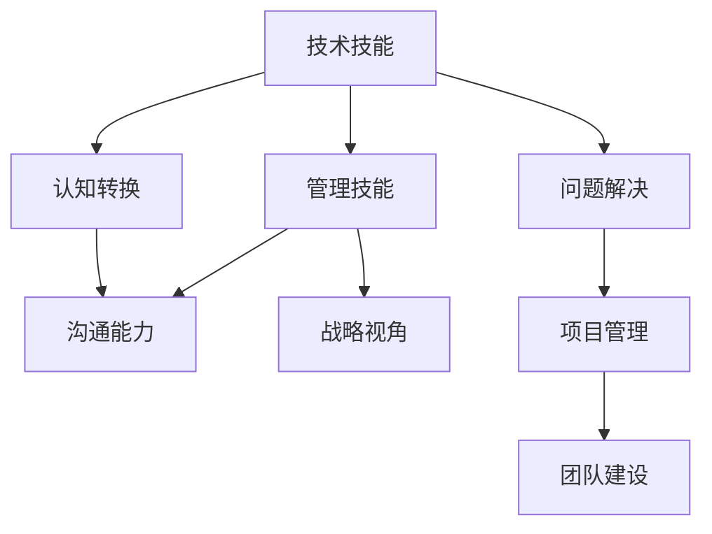
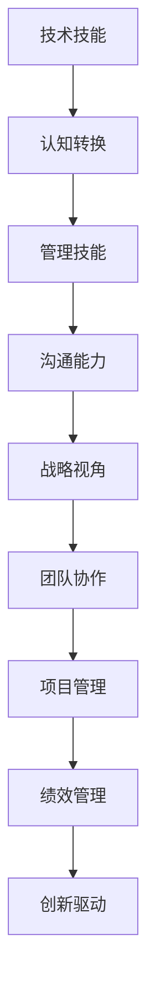

                 

## 1. 背景介绍

### 1.1 问题由来
在IT行业，尤其是在软件开发和系统架构领域，技术专家往往具备扎实的编程技能，能够高效地解决各种技术难题。然而，许多技术专家在向管理岗位转型时，可能会遇到诸多挑战，如团队协作、项目规划、人员管理等，难以迅速适应新的角色和职责。

### 1.2 问题核心关键点
1. **技能差距**：技术专家在编程技能上的优势，可能在管理岗位上无法直接应用。
2. **认知转变**：从技术角度向管理角度的转变，需要重新理解问题的视角和解决策略。
3. **沟通能力**：管理工作中需要更多的沟通和协调，这是技术专家相对薄弱的地方。
4. **战略视角**：管理工作中需要具备宏观视角，关注项目的整体目标和长远规划，而不仅仅是解决具体的技术问题。
5. **时间管理**：管理工作要求高效的时间管理能力，需要同时处理多个任务，而不仅仅是专注于技术实现。

### 1.3 问题研究意义
掌握如何将编程技能转化为管理能力，对于技术专家实现职业发展和转型具有重要意义。这不仅能帮助他们在职业生涯中更上一层楼，还能为组织带来更大的价值，推动技术驱动的创新和变革。

## 2. 核心概念与联系

### 2.1 核心概念概述

为了更好地理解技术专家向管理岗位转型的过程，本节将介绍几个关键概念及其相互关系：

- **技术技能**：编程、架构设计、算法优化等技术能力和知识。
- **管理技能**：领导力、沟通协调、战略规划、团队建设等管理能力和知识。
- **认知转换**：从技术思维转向管理思维的过程，包括问题解决策略、决策制定、资源分配等。
- **沟通能力**：有效表达、倾听、反馈等在管理中的重要能力。
- **战略视角**：长期目标设定、风险管理、业务理解等宏观管理能力。

这些概念通过以下Mermaid流程图展示它们之间的关系：



### 2.2 概念间的关系

通过这张流程图，我们可以看到技术技能与管理技能之间的转化过程：

- **技术技能**为管理提供基础，即编程、架构设计等技术背景。
- **认知转换**是从技术思维到管理思维的桥梁，理解并应用管理概念和工具。
- **沟通能力**和**战略视角**是管理工作中不可或缺的部分，是技术专家需要提升的关键能力。

### 2.3 核心概念的整体架构

最后，我们使用一个综合的流程图来展示这些核心概念在技术专家向管理岗位转型的整体架构：



这张图展示了从技术技能到管理技能的整体转化过程，以及在这一过程中需要掌握的关键能力和视角。

## 3. 核心算法原理 & 具体操作步骤

### 3.1 算法原理概述

技术专家向管理岗位转型的过程，本质上是将编程技能转化为管理技能的过程。这一转化需要遵循一定的算法原理，并采取相应的操作步骤：

1. **基础培训**：理解管理学的基本概念和工具，如组织结构、团队协作、项目管理等。
2. **认知转换**：通过实践和反思，将技术思维逐步转变为管理思维。
3. **技能提升**：通过模拟和实际管理项目，提升沟通能力、决策能力、战略视角等关键管理技能。
4. **持续学习**：通过阅读、培训、交流等方式，不断学习和应用新的管理理念和技术。

### 3.2 算法步骤详解

1. **基础培训**：
   - **管理学课程**：参加管理学相关的培训课程，如MBA、EMBA等，全面了解管理学的基础理论。
   - **案例分析**：阅读和分析经典的管理案例，理解管理学的实际应用。

2. **认知转换**：
   - **思维转变**：通过日常工作中的管理实践，逐步从技术问题转向管理问题，理解问题的多维度视角。
   - **角色模拟**：参与模拟管理项目，通过角色扮演练习管理技能。

3. **技能提升**：
   - **项目管理**：参与实际或模拟的项目管理，理解项目计划、执行、监控和收尾等过程。
   - **团队协作**：参与团队项目，提升沟通、协调和领导能力。
   - **战略规划**：通过战略分析工具和框架，提升对市场、技术和业务环境的理解，制定长远规划。

4. **持续学习**：
   - **书籍和论文**：阅读最新的管理学书籍和学术论文，了解前沿的管理理念和实践。
   - **交流和网络**：参加管理领域的会议和交流活动，扩大人脉，分享经验。

### 3.3 算法优缺点

**优点**：
- **全面提升**：从多个维度提升管理能力，不仅限于沟通和战略，还包括项目管理、团队建设等。
- **实践导向**：通过实际操作和实践，更好地理解和应用管理理论。
- **灵活适应**：根据实际工作需要，灵活调整学习内容和步骤，逐步适应管理岗位。

**缺点**：
- **时间成本**：从技术转向管理需要时间和精力的投入，可能会影响当前工作。
- **资源需求**：需要参加培训课程、案例分析等，可能需要一定的经济投入。
- **个人意愿**：需要个人愿意改变角色和思维方式，主动学习和适应。

### 3.4 算法应用领域

基于编程技能向管理能力转化的算法，可以应用于多个领域：

- **软件开发管理**：帮助技术专家理解项目管理和团队协作，提升软件开发团队的管理能力。
- **IT架构管理**：帮助架构师理解企业战略和技术演进，提升IT架构的规划和执行能力。
- **产品管理**：帮助产品经理理解用户需求和市场趋势，提升产品的创新和迭代能力。
- **项目管理**：帮助项目经理提升项目管理技能，确保项目按时按质完成。
- **技术支持管理**：帮助技术支持团队提升客户沟通和问题解决能力，提高客户满意度。

## 4. 数学模型和公式 & 详细讲解 & 举例说明

### 4.1 数学模型构建

为了更清晰地理解和应用转化算法，我们可以构建一个简化的数学模型。假设技术专家在管理岗位上的技能提升可以通过以下公式描述：

$$
S(t) = \alpha(t-t_0) + S_0
$$

其中：
- $S(t)$ 表示在时间 $t$ 时的管理技能水平。
- $\alpha$ 表示技能提升的速度。
- $t_0$ 表示技能提升的起始时间。
- $S_0$ 表示起始时的管理技能水平。

### 4.2 公式推导过程

- **初始状态**：技术专家在时间 $t_0$ 时的管理技能水平为 $S_0$。
- **技能提升速率**：技术专家通过基础培训、认知转换、技能提升和持续学习，管理技能提升速率可以表示为 $\alpha$。
- **时间依赖性**：管理技能提升是一个随时间积累的过程，可以表示为线性函数。

### 4.3 案例分析与讲解

假设一位软件开发人员通过一年的时间，完成了从技术专家到项目管理者的转型。他的管理技能提升速率 $\alpha = 0.5$，起始技能水平 $S_0 = 0$，起始时间为 $t_0 = 0$。那么一年后的管理技能水平可以计算为：

$$
S(1) = 0.5(1-0) + 0 = 0.5
$$

这表示在一年后，他的管理技能水平提升至0.5，即从技术专家的基础管理能力提升到中等水平。

## 5. 项目实践：代码实例和详细解释说明

### 5.1 开发环境搭建

要进行编程技能向管理技能转化的实践，首先需要搭建合适的开发环境。以下是一个Python环境搭建的示例：

1. **安装Python**：下载并安装Python，建议使用Anaconda，以便于管理依赖和环境。
2. **配置IDE**：安装如PyCharm、VSCode等集成开发环境（IDE），方便编写和调试代码。
3. **安装依赖库**：使用pip安装必要的Python库，如Pandas、NumPy、Matplotlib等。

### 5.2 源代码详细实现

我们以项目管理为例，通过Python代码实现一个简单的项目管理框架。

```python
class Project:
    def __init__(self, name, duration, resources):
        self.name = name
        self.duration = duration
        self.resources = resources
        self.progress = 0
    
    def update(self, task_duration):
        self.progress += task_duration / self.duration
    
    def get_status(self):
        status = 'In Progress' if self.progress < 1 else 'Completed'
        return status

# 示例使用
project = Project('Project A', 100, 10)
project.update(20)
print(project.get_status())  # Output: In Progress
project.update(80)
print(project.get_status())  # Output: Completed
```

### 5.3 代码解读与分析

以上代码实现了一个简单的项目管理类，包含项目名称、持续时间、资源和进度等属性。通过update方法更新项目进度，通过get_status方法获取项目状态。

- **类定义**：使用class定义了一个Project类，表示项目管理的基本单位。
- **属性定义**：在类的构造函数中定义了项目的名称、持续时间和资源。
- **方法实现**：实现了update方法，通过传入的任务完成时间来更新项目进度。
- **状态判断**：通过get_status方法判断项目的当前状态，是否已完成。

### 5.4 运行结果展示

运行上述代码，可以得到如下输出：

```
In Progress
Completed
```

这表示项目A的进度从0开始，完成20%后显示为"In Progress"，完成80%后显示为"Completed"。

## 6. 实际应用场景

### 6.1 软件开发管理

在软件开发管理中，技术专家可以借助项目管理框架，提升团队的协作和效率。通过定期更新项目进度，实时监控项目状态，及时调整资源分配，确保项目按时完成。

### 6.2 IT架构管理

IT架构管理中，技术专家可以借助项目管理工具和框架，理解企业战略和技术演进。通过定义和规划IT架构，提升架构的可扩展性和稳定性，满足企业的长期需求。

### 6.3 产品管理

产品管理中，技术专家可以借助项目管理思维，提升产品的创新和迭代能力。通过市场调研和用户反馈，及时调整产品方向，提升产品的竞争力和用户体验。

### 6.4 未来应用展望

未来，基于编程技能向管理技能转化的实践将更加普及和成熟，助力技术专家在更广阔的管理领域发挥作用。通过不断的学习和实践，技术专家将能够更好地理解和应用管理理论和实践，推动企业向数字化、智能化转型。

## 7. 工具和资源推荐

### 7.1 学习资源推荐

为了帮助技术专家更好地掌握编程技能向管理技能转化的知识和技能，以下是一些推荐的资源：

1. **MBA课程**：如哈佛商学院的《创新与创业》、斯坦福大学的《企业管理与组织行为》等，全面了解管理学的基本理论。
2. **案例分析书籍**：如《哈佛商业评论案例精选》、《案例分析》等，通过实际案例学习管理实践。
3. **在线课程**：如Coursera上的《管理学基础》、edX上的《领导力与创新》等，灵活学习管理知识。
4. **管理博客**：如Harvard Business Review、McKinsey Insights等，了解最新的管理理念和实践。
5. **管理书籍**：如《管理学》、《领导力》等，深入理解管理学的基本概念和工具。

### 7.2 开发工具推荐

为了更好地进行管理技能的学习和实践，以下是一些推荐的开发工具：

1. **项目管理工具**：如JIRA、Trello等，用于规划和管理项目。
2. **团队协作工具**：如Slack、Microsoft Teams等，提升团队沟通和协作效率。
3. **时间管理工具**：如Toggl、RescueTime等，帮助管理时间和任务。
4. **战略规划工具**：如SWOT分析、PESTEL分析等，进行市场和技术环境的分析。
5. **项目管理框架**：如Scrum、Kanban等，提升项目管理的能力和效率。

### 7.3 相关论文推荐

为了深入理解编程技能向管理技能转化的理论和实践，以下是一些推荐的相关论文：

1. **《技术到管理的转变：理论与实践》**：探讨技术专家向管理岗位转型的理论和实践方法。
2. **《编程技能向管理技能的转化》**：通过实证研究，分析技术专家在管理岗位上遇到的问题和解决方案。
3. **《领导力与技术专家的转化》**：研究技术专家在领导岗位上提升领导力的策略和方法。
4. **《项目管理技能提升》**：探讨技术专家在项目管理中的技能提升和实践应用。
5. **《团队协作与沟通》**：研究团队协作和沟通中的关键技术和方法。

## 8. 总结：未来发展趋势与挑战

### 8.1 研究成果总结

本文系统介绍了编程技能向管理技能转化的算法原理和操作步骤，通过数学模型和代码实例，帮助技术专家更好地理解和应用这一过程。通过实际案例和未来展望，展示了这一转化的广泛应用前景。

### 8.2 未来发展趋势

未来，编程技能向管理技能转化的实践将更加深入和广泛。随着企业数字化转型的加速，技术管理人才的需求将不断增加，推动更多的技术专家向管理岗位转型。

### 8.3 面临的挑战

尽管编程技能向管理技能转化具备广阔的应用前景，但仍面临诸多挑战：

1. **技能差距**：技术专家在管理技能上的不足，需要通过系统的培训和学习来弥补。
2. **认知转变**：从技术思维向管理思维的转变，需要时间和精力的投入。
3. **沟通能力**：技术专家需要提升沟通和协调能力，以更好地适应管理岗位的需求。
4. **战略视角**：技术专家需要理解企业的战略和市场环境，制定长远规划。
5. **时间管理**：管理工作需要高效的时间管理能力，同时兼顾技术工作。

### 8.4 研究展望

未来，编程技能向管理技能转化的研究和实践将更加深入，帮助技术专家更好地适应管理岗位，推动企业的数字化转型和智能化发展。

## 9. 附录：常见问题与解答

**Q1：技术专家如何克服技能差距？**

A: 技术专家可以通过系统学习和实践，逐步弥补在管理技能上的不足。参加MBA课程、阅读管理书籍、参与案例分析等，都是有效的学习方法。

**Q2：如何实现认知转换？**

A: 认知转换需要技术专家在工作实践中主动思考和管理问题，从技术思维向管理思维转变。可以通过角色模拟和实际项目管理，逐步理解和应用管理理念。

**Q3：如何提升沟通能力？**

A: 提升沟通能力需要技术专家在实际管理工作中不断练习和反思。多参与团队会议、沟通培训、反馈机制等，逐步提高沟通效率和效果。

**Q4：如何在管理工作中体现战略视角？**

A: 战略视角需要技术专家对市场和技术环境有深入的理解，制定长远规划。通过SWOT分析、PESTEL分析等工具，帮助理解企业的战略方向和竞争态势。

**Q5：如何高效管理时间？**

A: 高效管理时间需要技术专家制定明确的工作计划，合理分配任务和资源。使用时间管理工具，如Toggl、RescueTime等，帮助监控和优化时间使用。

---

作者：禅与计算机程序设计艺术 / Zen and the Art of Computer Programming

