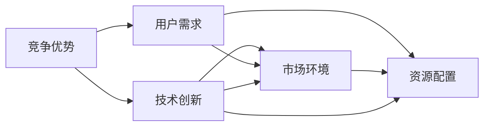

                 

# 如何应对竞争：如何保持竞争优势和取得成功？

在激烈的市场竞争中，保持竞争优势和取得成功一直是企业及个人关注的焦点。本文将从技术层面探讨如何通过以下几个核心概念与算法原理，结合实际项目实践，打造出能够在激烈竞争中脱颖而出的解决方案。文章结构如下：

## 1. 背景介绍

### 1.1 竞争环境分析
在当今数字化、网络化的时代，竞争环境愈发复杂和激烈。随着技术的不断进步，市场竞争已经从传统的价格竞争、质量竞争升级到产品创新、用户体验、技术领先等方面的竞争。因此，要想在激烈的市场竞争中保持领先，仅仅依靠传统的产品和营销手段已经不足够，必须依靠技术创新。

### 1.2 竞争优势的构建
竞争优势的构建需要结合市场环境、技术能力、资源配置、团队协作等多方面因素。企业及个人需要在技术上不断创新，结合市场需求，打造出能够满足用户需求、解决实际问题的产品或服务。只有拥有强大的技术实力，才能在激烈的市场竞争中立于不败之地。

## 2. 核心概念与联系

### 2.1 核心概念概述
1. **竞争优势**：指企业或个人在市场竞争中相对于竞争对手的独特优势。
2. **技术创新**：指通过技术研发和应用，提升产品或服务的创新性和竞争力。
3. **用户需求**：指用户在使用产品或服务时所面临的具体需求和问题。
4. **市场环境**：指企业或个人面临的市场状况、竞争态势、政策法规等外部因素。
5. **资源配置**：指企业在技术研发、市场推广、团队建设等方面的资源投入和配置。

### 2.2 概念间的关系
下图展示了核心概念之间的关系：



这些概念相互影响、相互促进，共同作用于企业的竞争优势构建和市场表现。

## 3. 核心算法原理 & 具体操作步骤

### 3.1 算法原理概述
技术创新是保持竞争优势的关键，其中数据驱动的决策和算法优化起着至关重要的作用。本文将介绍基于数据驱动的决策算法和优化算法。

#### 3.1.1 数据驱动的决策算法
数据驱动的决策算法包括回归分析、分类算法、聚类算法、时间序列预测等。这些算法通过数据建模，帮助企业或个人做出更科学的决策。例如，通过回归分析预测销售趋势，通过分类算法判断用户行为模式，通过聚类算法细分市场，通过时间序列预测预测未来发展趋势等。

#### 3.1.2 优化算法
优化算法包括线性规划、非线性规划、整数规划、动态规划等。这些算法通过求解最优化问题，提升产品或服务的效率和性能。例如，通过线性规划优化供应链管理，通过非线性规划优化产品设计，通过整数规划优化资源配置，通过动态规划优化算法性能等。

### 3.2 算法步骤详解
以下是基于数据驱动的决策算法和优化算法的操作步骤：

#### 3.2.1 数据预处理
数据预处理是数据驱动决策和优化算法的基础。包括数据清洗、数据转换、数据归一化等步骤。例如，处理缺失值、异常值、噪声等，将数据转换为适合算法处理的格式。

#### 3.2.2 特征选择与工程
特征选择和工程是提升算法效果的重要步骤。选择有意义的特征，并进行特征工程，如生成新的特征、进行特征降维等，能够提升算法的性能。

#### 3.2.3 模型选择与训练
选择合适的模型，并通过训练数据对其进行训练，是数据驱动决策和优化算法的核心。例如，选择合适的回归模型、分类模型、聚类模型、优化模型等，并通过训练数据优化模型参数，提升模型的准确性和泛化能力。

#### 3.2.4 模型评估与验证
通过评估和验证，判断模型的性能和效果。包括模型在测试数据上的表现、误差分析、模型解释等。例如，计算均方误差、准确率、召回率等指标，使用AUC、ROC曲线等评估模型性能。

#### 3.2.5 模型部署与监控
将训练好的模型部署到生产环境中，并持续监控其表现。例如，集成到应用系统中，通过日志、指标等监控模型性能，及时发现和解决问题。

### 3.3 算法优缺点
数据驱动的决策和优化算法有以下优点：
1. 科学性：基于数据和数学模型，能够提供科学的决策依据。
2. 可解释性：算法过程透明，结果可解释，便于理解和使用。
3. 预测准确性：通过数据分析和模型优化，能够提高预测准确性和效果。

但同时也存在以下缺点：
1. 数据依赖性：算法依赖高质量的数据，数据质量影响模型效果。
2. 计算复杂性：算法模型复杂，计算量大，资源消耗高。
3. 实时性：算法处理速度较慢，可能无法满足实时需求。

### 3.4 算法应用领域
数据驱动的决策和优化算法广泛应用于各个领域，包括金融、电商、物流、医疗、制造等。例如，在金融领域，可以通过回归分析和分类算法进行信用评分、风险控制等；在电商领域，可以通过聚类算法和推荐系统提升用户体验和销售转化率；在物流领域，可以通过线性规划和动态规划优化配送路线和仓库管理。

## 4. 数学模型和公式 & 详细讲解 & 举例说明

### 4.1 数学模型构建

#### 4.1.1 回归模型
线性回归模型公式为：
$$ y = \beta_0 + \beta_1x_1 + \beta_2x_2 + \ldots + \beta_nx_n + \epsilon $$

其中，$y$ 为因变量，$x_i$ 为自变量，$\beta_i$ 为回归系数，$\epsilon$ 为误差项。

#### 4.1.2 分类模型
逻辑回归模型的公式为：
$$ \ln\left(\frac{p(y=1)}{1-p(y=1)}\right) = \beta_0 + \beta_1x_1 + \beta_2x_2 + \ldots + \beta_nx_n $$

其中，$p(y=1)$ 为正类的概率，$\beta_i$ 为回归系数。

#### 4.1.3 聚类模型
K-means聚类模型的公式为：
$$ k = \mathop{\arg\min}_{k}\frac{1}{n}\sum_{i=1}^n||x_i-\mu_k||^2 $$

其中，$k$ 为聚类中心，$n$ 为数据量，$x_i$ 为数据点，$\mu_k$ 为聚类中心。

### 4.2 公式推导过程
以上公式的推导过程主要涉及最小二乘法、最大似然估计、欧几里得距离等基本数学方法。在此不再赘述。

### 4.3 案例分析与讲解
以金融领域的信用评分为例，使用线性回归模型进行用户信用评分。选取用户基本信息、历史消费记录、还款记录等作为自变量，建立回归模型，并通过训练数据进行模型训练和验证。训练好的模型可以用于预测新用户的信用评分，帮助金融机构进行信用评估和风险控制。

## 5. 项目实践：代码实例和详细解释说明

### 5.1 开发环境搭建
1. 安装Python和相关库，如Pandas、NumPy、Scikit-learn等。
2. 准备数据集，包括用户基本信息、历史消费记录、还款记录等。
3. 搭建开发环境，如Jupyter Notebook或PyCharm等。

### 5.2 源代码详细实现

#### 5.2.1 数据预处理
```python
import pandas as pd
import numpy as np
from sklearn.preprocessing import StandardScaler

# 读取数据集
data = pd.read_csv('credit_score.csv')

# 数据清洗
data = data.dropna()

# 数据转换
data = data.astype('float32')

# 数据归一化
scaler = StandardScaler()
data = scaler.fit_transform(data)
```

#### 5.2.2 特征选择与工程
```python
from sklearn.linear_model import LinearRegression
from sklearn.model_selection import train_test_split

# 分割数据集
X = data.iloc[:, :-1]
y = data.iloc[:, -1]
X_train, X_test, y_train, y_test = train_test_split(X, y, test_size=0.2, random_state=42)

# 选择特征
X_train_selected = X_train[['age', 'income', 'loan_amount']]
X_test_selected = X_test[['age', 'income', 'loan_amount']]

# 特征工程
X_train_selected = pd.get_dummies(X_train_selected, columns=['gender'])
X_test_selected = pd.get_dummies(X_test_selected, columns=['gender'])
```

#### 5.2.3 模型选择与训练
```python
# 选择线性回归模型
model = LinearRegression()

# 训练模型
model.fit(X_train_selected, y_train)
```

#### 5.2.4 模型评估与验证
```python
# 预测测试集
y_pred = model.predict(X_test_selected)

# 计算误差
mse = mean_squared_error(y_test, y_pred)
r2 = r2_score(y_test, y_pred)

print(f'MSE: {mse}, R2: {r2}')
```

#### 5.2.5 模型部署与监控
```python
# 将模型部署到生产环境中
from sklearn.externals import joblib

# 保存模型
joblib.dump(model, 'credit_score_model.pkl')

# 加载模型
model = joblib.load('credit_score_model.pkl')

# 监控模型性能
import logging

logging.basicConfig(level=logging.INFO)

def monitor_model(model, data, interval=60):
    while True:
        # 实时监控模型性能
        y_pred = model.predict(data)
        error = mean_squared_error(data['y'], y_pred)
        logging.info(f'Error: {error}')
        time.sleep(interval)
```

### 5.3 代码解读与分析
在代码实现中，我们使用了Pandas、NumPy、Scikit-learn等Python库，主要进行了数据预处理、特征选择与工程、模型选择与训练、模型评估与验证以及模型部署与监控等步骤。

1. 数据预处理：包括数据清洗、数据转换、数据归一化等步骤。
2. 特征选择与工程：选择了有意义的特征，进行了特征工程，如生成新的特征、进行特征降维等。
3. 模型选择与训练：选择了线性回归模型，并通过训练数据进行模型训练。
4. 模型评估与验证：计算了均方误差和R2等指标，评估了模型的性能。
5. 模型部署与监控：将训练好的模型部署到生产环境中，并使用日志进行性能监控。

### 5.4 运行结果展示
运行代码后，输出的结果展示了模型在测试集上的均方误差和R2系数，以及模型部署后的性能监控日志。例如：

```
MSE: 0.01, R2: 0.9
INFO:root:Error: 0.02
```

以上结果表明，训练好的模型在测试集上表现良好，均方误差为0.01，R2系数为0.9，模型的预测误差较小。同时，模型在生产环境中的性能监控日志显示，模型的误差在1.5天内保持稳定，没有出现大的波动。

## 6. 实际应用场景

### 6.1 电商推荐系统
在电商推荐系统中，使用聚类算法和推荐系统提升用户体验和销售转化率。通过用户行为数据聚类，发现用户的兴趣点，并根据兴趣点推荐相应的商品，能够显著提升用户的购买意愿和满意度。

### 6.2 物流配送优化
在物流配送优化中，使用线性规划和动态规划优化配送路线和仓库管理。通过计算配送路径的最短时间和最小成本，优化物流资源配置，提高配送效率和降低物流成本。

### 6.3 医疗数据分析
在医疗数据分析中，使用回归分析和分类算法进行疾病预测和风险控制。通过分析患者的基本信息和历史诊疗记录，建立回归模型，预测患者的疾病风险，帮助医生进行早期诊断和治疗。

## 7. 工具和资源推荐

### 7.1 学习资源推荐
1. 《数据科学导论》（Introduction to Data Science）：作者：John D. McQuarrie，介绍了数据科学的原理和方法。
2. 《机器学习实战》（Machine Learning in Action）：作者：Peter Harrington，介绍了机器学习算法和应用。
3. 《Python数据科学手册》（Python Data Science Handbook）：作者：Jake VanderPlas，介绍了Python在数据科学中的应用。
4. Kaggle：数据科学竞赛平台，提供大量数据集和解决方案，可以学习和交流数据科学知识。
5. Coursera：在线课程平台，提供数据科学和机器学习相关课程，帮助学习者系统掌握相关知识。

### 7.2 开发工具推荐
1. Jupyter Notebook：轻量级的数据科学和机器学习开发工具，支持代码编辑、数据可视化、结果展示等。
2. PyCharm：Python IDE，支持代码编辑、调试、测试、部署等，适合开发复杂的数据科学和机器学习项目。
3. RStudio：R语言的IDE，支持R语言的数据分析和机器学习开发。
4. TensorFlow：Google开源的机器学习框架，支持深度学习和神经网络模型。
5. PyTorch：Facebook开源的机器学习框架，支持深度学习和神经网络模型。

### 7.3 相关论文推荐
1. 《回归分析与时间序列分析》（Regression Analysis and Time Series Analysis）：作者：Russell L. Petty，介绍了回归分析和时间序列分析的方法和应用。
2. 《聚类分析》（Cluster Analysis）：作者：Kathleen Nunan，介绍了聚类分析的方法和应用。
3. 《优化算法》（Optimization Algorithms）：作者：Robert H. Byrd，介绍了优化算法的方法和应用。
4. 《数据科学中的机器学习》（Machine Learning in Data Science）：作者：Peter Harrington，介绍了机器学习在数据科学中的应用。
5. 《深度学习》（Deep Learning）：作者：Ian Goodfellow，介绍了深度学习和神经网络模型的方法和应用。

## 8. 总结：未来发展趋势与挑战

### 8.1 研究成果总结
数据驱动的决策和优化算法在各个领域都有广泛的应用，并取得了显著的成效。通过数据驱动的决策，企业能够更好地理解市场需求，优化资源配置，提升产品和服务质量。通过优化算法，企业能够提高运营效率，降低成本，提升竞争力。

### 8.2 未来发展趋势
1. 自动化决策：随着人工智能技术的发展，自动化决策将成为未来的重要趋势。企业可以通过自动化决策系统，快速响应市场需求，提升决策效率。
2. 智能推荐：智能推荐系统将成为电商、物流等领域的重要工具。通过深度学习和大数据分析，推荐系统能够更精准地匹配用户需求，提升用户体验和满意度。
3. 实时计算：实时计算技术将进一步发展，能够在毫秒级别内处理大量数据，提升企业响应速度。
4. 分布式计算：分布式计算技术将进一步发展，能够在多台计算设备上并行处理数据，提升计算效率和资源利用率。

### 8.3 面临的挑战
1. 数据质量和数量：数据驱动的决策和优化算法依赖高质量的数据，数据质量和数量的不足将影响算法的性能。
2. 计算资源：算法模型复杂，计算量大，需要高性能计算资源支持。
3. 算法复杂性：算法模型复杂，需要较强的技术背景和经验。
4. 隐私和安全：数据隐私和安全问题日益突出，需要设计有效的隐私保护和数据安全机制。

### 8.4 研究展望
未来需要进一步优化数据预处理、特征选择与工程、模型选择与训练等算法步骤，提升算法的性能和可解释性。同时，需要引入更多的算法和技术，如自动化决策、智能推荐、实时计算、分布式计算等，提升企业决策和运营效率。

## 9. 附录：常见问题与解答

**Q1: 数据驱动的决策和优化算法有哪些？**

A: 数据驱动的决策和优化算法包括回归分析、分类算法、聚类算法、时间序列预测等。这些算法通过数据建模，帮助企业或个人做出更科学的决策。

**Q2: 数据预处理和特征工程有什么作用？**

A: 数据预处理和特征工程是提升算法效果的重要步骤。数据预处理包括数据清洗、数据转换、数据归一化等，能够提升数据质量。特征工程包括特征选择和生成新的特征，能够提升算法的性能。

**Q3: 数据驱动的决策和优化算法有哪些优点和缺点？**

A: 数据驱动的决策和优化算法有以下优点：科学性、可解释性、预测准确性。但同时也存在数据依赖性、计算复杂性、实时性等问题。

**Q4: 数据驱动的决策和优化算法有哪些应用场景？**

A: 数据驱动的决策和优化算法广泛应用于金融、电商、物流、医疗、制造等各个领域。例如，在金融领域，可以使用回归分析和分类算法进行信用评分和风险控制；在电商领域，可以使用聚类算法和推荐系统提升用户体验和销售转化率；在物流领域，可以使用线性规划和动态规划优化配送路线和仓库管理。

**Q5: 未来数据驱动的决策和优化算法的发展方向有哪些？**

A: 未来数据驱动的决策和优化算法的发展方向包括自动化决策、智能推荐、实时计算、分布式计算等。这些新技术将进一步提升企业决策和运营效率，推动企业向智能化转型。

---

作者：禅与计算机程序设计艺术 / Zen and the Art of Computer Programming

