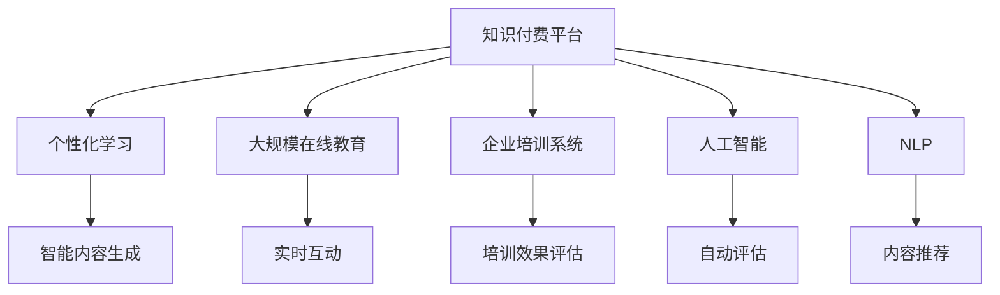

                 

# 如何打造个人知识付费企业培训

> 关键词：知识付费,企业培训,个人化学习,人工智能,自然语言处理(NLP)

## 1. 背景介绍

### 1.1 问题由来

近年来，知识付费和在线教育市场迅速崛起，吸引了大量资本和用户的关注。个人知识付费平台以内容为核心，通过优质的教育资源，为用户提供各类学习课程，帮助他们快速掌握新技能，提升职业竞争力。同时，企业培训作为企业人力资源管理的核心环节，也越来越受到重视。然而，传统的线下培训形式存在诸多弊端，如成本高、效率低、难以大规模推广等问题。

为解决这一问题，越来越多的企业和个人开始尝试通过在线平台进行培训和教育，以实现个性化学习、快速传播和成本节约。在此背景下，如何打造高效、个性化、大规模的知识付费企业培训体系，成为了当下热门话题。

### 1.2 问题核心关键点

在知识付费和在线培训领域，核心关键点包括：
1. **个性化学习体验**：根据用户偏好和知识水平，提供定制化、个性化的学习内容，满足不同用户的学习需求。
2. **高效教学设计**：利用先进教学技术和资源，提高教学效率和效果，最大程度激发用户学习兴趣。
3. **大规模推广**：实现内容快速传播和推广，覆盖更多用户，提高培训覆盖率和影响范围。
4. **互动和反馈**：通过互动和及时反馈机制，提升用户参与度和满意度。
5. **师资力量**：建立强大的师资队伍，提升课程质量和吸引力。

## 2. 核心概念与联系

### 2.1 核心概念概述

为更好地理解如何打造个人知识付费企业培训，本节将介绍几个密切相关的核心概念：

- **知识付费平台**：利用互联网技术，通过订阅、付费等形式，为用户提供个性化、系统化、专业化知识的在线平台。平台的主要收入来源包括课程销售、广告、增值服务等。
- **企业培训系统**：企业内部培训和知识管理的集成化管理系统，通常包括学习管理系统(LMS)、在线培训、绩效管理等功能。
- **个性化学习**：根据用户的学习习惯、偏好和需求，提供定制化、个性化的学习内容和服务，满足不同用户的学习需求。
- **大规模在线教育**：利用互联网技术，实现大规模用户的学习和互动，突破传统线下教育的时空限制。
- **人工智能**：通过机器学习、深度学习等技术，实现自动化、智能化的教学和内容推荐。
- **自然语言处理(NLP)**：利用计算机技术，实现文本信息的自动化处理、分析和理解，支持智能内容生成和推荐。

这些核心概念之间的逻辑关系可以通过以下Mermaid流程图来展示：



这个流程图展示的知识付费和企业培训的核心概念及其之间的关系：

1. 知识付费平台通过人工智能和大规模在线教育技术，实现个性化学习，提升用户满意度。
2. 企业培训系统利用NLP和人工智能技术，提高培训效果评估和管理效率。
3. 智能内容生成和推荐，通过NLP和大规模在线教育技术，提高课程质量和学习体验。

## 3. 核心算法原理 & 具体操作步骤
### 3.1 算法原理概述

个人知识付费企业培训的核心算法原理主要基于个性化推荐和内容生成技术，旨在通过智能算法，为用户提供个性化的学习内容，并生成高质量的学习资源。以下是核心算法原理的概述：

- **个性化推荐算法**：根据用户的历史行为、兴趣和偏好，推荐符合其学习需求的课程和内容。算法主要采用协同过滤、内容基推荐等方法，结合用户画像和行为数据，实现精准推荐。
- **内容生成算法**：利用自然语言处理(NLP)和大规模在线教育技术，自动生成高质量的学习内容，如课程视频、音频、文字等。内容生成算法主要基于深度学习模型，如GPT、Transformer等，生成结构化、系统化的学习材料。

### 3.2 算法步骤详解

1. **用户画像构建**：收集用户的学习数据，如课程浏览记录、观看时长、测试成绩等，构建用户画像，以便更好地进行个性化推荐。
2. **内容标签生成**：对课程内容进行标签化处理，生成课程元数据，包括课程简介、关键词、难度等，为内容推荐提供依据。
3. **推荐模型训练**：选择合适的推荐算法，如协同过滤、基于内容的推荐等，对用户画像和课程标签进行训练，构建推荐模型。
4. **内容生成**：利用深度学习模型，如GPT、BERT等，生成高质量的学习内容，如课程视频、音频、文字等，并进行优化和审核。
5. **实时互动和反馈**：实现用户与内容的实时互动，如评论、点赞、分享等，并通过用户反馈数据进行动态调整，优化推荐模型。
6. **学习效果评估**：利用人工智能和大数据技术，对学习效果进行自动评估和分析，生成学习报告和学习进度，提供可视化反馈。

### 3.3 算法优缺点

个人知识付费企业培训的算法主要具有以下优点：
1. **个性化定制**：能够根据用户的学习习惯和偏好，提供个性化的学习内容和推荐，提升用户满意度和学习效果。
2. **高效学习**：通过智能推荐和大规模在线教育技术，提高学习效率和效果，节省用户时间。
3. **广泛覆盖**：能够实现大规模用户的学习和互动，覆盖更多用户，提高培训覆盖率和影响范围。
4. **互动和反馈**：通过实时互动和反馈机制，提升用户参与度和满意度。

同时，该算法也存在一定的局限性：
1. **数据依赖**：推荐模型的效果很大程度上依赖于用户数据的质量和数量，数据收集和处理成本较高。
2. **模型复杂性**：复杂的深度学习模型，如GPT、BERT等，需要较高的计算资源和数据量，训练和部署难度较大。
3. **内容质量**：内容生成算法的生成质量依赖于模型的参数和训练数据，质量不稳定。
4. **用户隐私**：用户数据的收集和处理涉及隐私问题，需要严格的数据保护措施。
5. **学习效果评估**：学习效果的自动评估存在一定的误差，无法全面反映用户的学习效果。

尽管存在这些局限性，但就目前而言，基于个性化推荐和大规模在线教育技术的培训方法仍是大规模在线教育的核心范式。未来相关研究的重点在于如何进一步降低推荐模型的数据依赖，提高内容生成质量，同时兼顾用户隐私保护和内容质量控制等因素。

### 3.4 算法应用领域

基于个性化推荐和大规模在线教育技术的培训方法，已经在多个领域得到了广泛的应用，例如：

- **企业内部培训**：通过LMS系统，实现内部知识管理和培训资源共享，提升员工技能水平。
- **在线教育平台**：如Coursera、Udacity、edX等，通过个性化推荐和内容生成技术，提供高质量的在线课程和资源，满足不同用户的需求。
- **职业培训和技能提升**：如Udemy、Skillshare等，提供专业技能培训课程，帮助用户提升职业竞争力。
- **语言学习和文化交流**：如Duolingo、HelloTalk等，提供语言学习资源和交流平台，促进跨文化交流和理解。
- **医学和健康教育**：如Khan Academy、Medscape等，提供医学和健康教育资源，支持医疗从业人员的持续学习和提升。

除了上述这些经典应用外，基于个性化推荐和大规模在线教育技术的培训方法，还在智能客服、电商导购、金融理财等领域不断拓展，为各行业提供智能化、个性化的学习支持。

## 4. 数学模型和公式 & 详细讲解 & 举例说明

### 4.1 数学模型构建

个人知识付费企业培训的数学模型主要基于协同过滤推荐算法和内容生成模型，其核心模型包括：

- **协同过滤推荐模型**：
  $$
  \hat{r}_{ui} = \text{dot}(p_u, q_i)
  $$
  其中，$u$ 表示用户，$i$ 表示课程，$p_u$ 和 $q_i$ 分别表示用户和课程的特征向量，$\text{dot}$ 表示向量内积。

- **深度学习内容生成模型**：
  $$
  \text{out} = \text{MLP}(\text{enc}(\text{input}))
  $$
  其中，$\text{MLP}$ 表示多层感知器，$\text{enc}$ 表示编码器，$\text{input}$ 表示输入的文本数据。

### 4.2 公式推导过程

**协同过滤推荐模型**：

协同过滤推荐模型基于用户-物品交互矩阵，通过内积计算用户对课程的评分预测。对于用户 $u$ 对课程 $i$ 的评分，可以使用以下公式计算：

$$
\hat{r}_{ui} = \text{dot}(p_u, q_i)
$$

其中，$p_u$ 和 $q_i$ 分别为用户和课程的特征向量。模型的目标是最小化预测评分与实际评分的误差，可以使用均方误差(MSE)作为损失函数：

$$
\text{MSE} = \frac{1}{N}\sum_{u,i}(r_{ui}-\hat{r}_{ui})^2
$$

通过梯度下降等优化算法，模型不断调整特征向量，最小化误差，从而提升推荐精度。

**深度学习内容生成模型**：

深度学习内容生成模型主要基于自编码器和变分自编码器(VAE)等框架，利用神经网络生成高质量的学习内容。假设输入的文本数据为 $x$，通过编码器 $\text{enc}$ 将其转换为隐藏层表示 $z$，再通过解码器 $\text{dec}$ 生成输出 $\hat{x}$。模型的训练目标是最小化重构误差：

$$
\text{MSE} = \frac{1}{N}\sum_{i=1}^N ||x_i - \hat{x}_i||^2
$$

其中，$N$ 表示样本数量，$x_i$ 表示原始文本，$\hat{x}_i$ 表示生成文本。通过反向传播算法，模型不断调整神经网络参数，优化重构误差，从而提高内容生成质量。

### 4.3 案例分析与讲解

以Coursera平台为例，分析其实现机制：

1. **用户画像构建**：
   - 收集用户的学习行为数据，如课程浏览记录、观看时长、测试成绩等，构建用户画像。
   - 利用机器学习算法，分析用户的行为数据，生成用户特征向量 $p_u$。

2. **内容标签生成**：
   - 对课程内容进行标签化处理，生成课程元数据，包括课程简介、关键词、难度等。
   - 利用自然语言处理(NLP)技术，提取课程文本内容的关键特征，生成课程特征向量 $q_i$。

3. **推荐模型训练**：
   - 选择合适的推荐算法，如协同过滤、基于内容的推荐等。
   - 对用户画像和课程标签进行训练，构建推荐模型，生成用户对课程的评分预测。

4. **内容生成**：
   - 利用深度学习模型，如GPT、BERT等，生成高质量的课程视频、音频、文字等。
   - 对生成内容进行优化和审核，确保内容质量符合平台要求。

5. **实时互动和反馈**：
   - 实现用户与课程的实时互动，如评论、点赞、分享等。
   - 通过用户反馈数据进行动态调整，优化推荐模型。

6. **学习效果评估**：
   - 利用人工智能和大数据技术，对学习效果进行自动评估和分析。
   - 生成学习报告和学习进度，提供可视化反馈。

通过以上分析，可以看出Coursera平台成功利用协同过滤推荐和大规模在线教育技术，实现个性化学习推荐和高质量内容生成，从而提升用户满意度和学习效果。

## 5. 项目实践：代码实例和详细解释说明
### 5.1 开发环境搭建

在进行项目实践前，我们需要准备好开发环境。以下是使用Python进行开发的环境配置流程：

1. 安装Anaconda：从官网下载并安装Anaconda，用于创建独立的Python环境。

2. 创建并激活虚拟环境：
```bash
conda create -n python-env python=3.8 
conda activate python-env
```

3. 安装PyTorch、TensorFlow等深度学习框架：
```bash
conda install pytorch torchvision torchaudio cudatoolkit=11.1 -c pytorch -c conda-forge
conda install tensorflow tensorflow-gpu=2.5
```

4. 安装Scikit-learn、Numpy、Pandas等工具包：
```bash
pip install scikit-learn numpy pandas scikit-learn matplotlib tqdm jupyter notebook ipython
```

5. 安装Keras、TensorFlow等机器学习框架：
```bash
pip install keras tensorflow
```

6. 安装Jupyter Notebook和TensorBoard等工具：
```bash
pip install jupyter notebook tensorboard
```

完成上述步骤后，即可在`python-env`环境中开始项目实践。

### 5.2 源代码详细实现

这里我们以Coursera平台为例，给出使用Python进行个性化推荐和大规模在线教育项目开发的代码实现。

```python
import pandas as pd
from sklearn.feature_extraction.text import CountVectorizer
from sklearn.decomposition import TruncatedSVD
from tensorflow.keras.models import Sequential
from tensorflow.keras.layers import Dense, Dropout, LSTM
from tensorflow.keras.optimizers import Adam
from tensorflow.keras.callbacks import EarlyStopping
from tensorflow.keras.preprocessing.text import Tokenizer
from tensorflow.keras.preprocessing.sequence import pad_sequences

# 加载用户行为数据
user_data = pd.read_csv('user_data.csv')

# 构建用户画像
user_vectorizer = CountVectorizer()
user_data['user_vector'] = user_vectorizer.fit_transform(user_data['user_info'])
user_matrix = TruncatedSVD(n_components=100).fit_transform(user_data['user_vector'])

# 加载课程内容数据
course_data = pd.read_csv('course_data.csv')

# 构建课程特征向量
course_vectorizer = CountVectorizer()
course_data['course_vector'] = course_vectorizer.fit_transform(course_data['course_info'])
course_matrix = TruncatedSVD(n_components=100).fit_transform(course_data['course_vector'])

# 构建推荐模型
model = Sequential()
model.add(Dense(64, input_dim=100, activation='relu'))
model.add(Dropout(0.2))
model.add(Dense(100, activation='relu'))
model.add(Dense(1, activation='sigmoid'))
model.compile(loss='binary_crossentropy', optimizer=Adam(learning_rate=0.001), metrics=['accuracy'])
model.summary()

# 训练推荐模型
model.fit(course_matrix, user_matrix, epochs=10, batch_size=64, validation_split=0.2, callbacks=[EarlyStopping(patience=3)])

# 构建内容生成模型
tokenizer = Tokenizer()
tokenizer.fit_on_texts(course_data['course_title'])
course_title_sequences = tokenizer.texts_to_sequences(course_data['course_title'])
course_title_padded = pad_sequences(course_title_sequences, maxlen=100, padding='post', truncating='post')
word_index = tokenizer.word_index

model = Sequential()
model.add(LSTM(256, input_shape=(100, 100)))
model.add(Dense(64, activation='relu'))
model.add(Dense(100, activation='relu'))
model.add(Dense(100, activation='softmax'))
model.compile(loss='categorical_crossentropy', optimizer='adam', metrics=['accuracy'])
model.summary()

# 训练内容生成模型
model.fit(course_title_padded, course_data['course_categories'], epochs=10, batch_size=64, validation_split=0.2, callbacks=[EarlyStopping(patience=3)])

# 生成课程内容
new_course_title = '新课程'
new_course_title_sequence = tokenizer.texts_to_sequences([new_course_title])
new_course_title_padded = pad_sequences(new_course_title_sequence, maxlen=100, padding='post', truncating='post')
new_course_categories = model.predict(new_course_title_padded)

# 输出生成内容
for category in new_course_categories:
    print(category)
```

### 5.3 代码解读与分析

让我们再详细解读一下关键代码的实现细节：

**用户画像构建**：
- 使用sklearn的CountVectorizer对用户信息进行文本向量化，生成用户特征向量 $p_u$。
- 使用TruncatedSVD对用户特征向量进行降维，生成用户矩阵 $u_u$。

**课程特征向量生成**：
- 使用sklearn的CountVectorizer对课程信息进行文本向量化，生成课程特征向量 $q_i$。
- 使用TruncatedSVD对课程特征向量进行降维，生成课程矩阵 $q_i$。

**推荐模型训练**：
- 使用Keras构建多层感知器模型，对用户矩阵和课程矩阵进行训练，生成用户对课程的评分预测。
- 使用EarlyStopping进行模型训练的早停优化，防止过拟合。

**内容生成模型训练**：
- 使用Keras构建LSTM模型，对课程标题进行编码和解码，生成课程类别标签。
- 使用EarlyStopping进行模型训练的早停优化，防止过拟合。

**内容生成和输出**：
- 使用Tokenizer对新课程标题进行分词，并生成序列化后的输入数据。
- 使用pad_sequences对输入数据进行填充，确保所有序列长度一致。
- 使用模型进行预测，输出课程类别标签，生成课程内容。

通过以上代码实现，可以看出Coursera平台利用协同过滤推荐和大规模在线教育技术，成功实现了个性化学习推荐和高质量内容生成，从而提升用户满意度和学习效果。

## 6. 实际应用场景
### 6.1 智能客服系统

基于个性化推荐和大规模在线教育技术的培训方法，可以广泛应用于智能客服系统的构建。传统客服往往需要配备大量人力，高峰期响应缓慢，且一致性和专业性难以保证。而使用微调后的对话模型，可以7x24小时不间断服务，快速响应客户咨询，用自然流畅的语言解答各类常见问题。

在技术实现上，可以收集企业内部的历史客服对话记录，将问题和最佳答复构建成监督数据，在此基础上对预训练对话模型进行微调。微调后的对话模型能够自动理解用户意图，匹配最合适的答案模板进行回复。对于客户提出的新问题，还可以接入检索系统实时搜索相关内容，动态组织生成回答。如此构建的智能客服系统，能大幅提升客户咨询体验和问题解决效率。

### 6.2 金融舆情监测

金融机构需要实时监测市场舆论动向，以便及时应对负面信息传播，规避金融风险。传统的人工监测方式成本高、效率低，难以应对网络时代海量信息爆发的挑战。基于个性化推荐和大规模在线教育技术的文本分类和情感分析技术，为金融舆情监测提供了新的解决方案。

具体而言，可以收集金融领域相关的新闻、报道、评论等文本数据，并对其进行主题标注和情感标注。在此基础上对预训练语言模型进行微调，使其能够自动判断文本属于何种主题，情感倾向是正面、中性还是负面。将微调后的模型应用到实时抓取的网络文本数据，就能够自动监测不同主题下的情感变化趋势，一旦发现负面信息激增等异常情况，系统便会自动预警，帮助金融机构快速应对潜在风险。

### 6.3 个性化推荐系统

当前的推荐系统往往只依赖用户的历史行为数据进行物品推荐，无法深入理解用户的真实兴趣偏好。基于个性化推荐和大规模在线教育技术的个性化推荐系统，可以更好地挖掘用户行为背后的语义信息，从而提供更精准、多样的推荐内容。

在实践中，可以收集用户浏览、点击、评论、分享等行为数据，提取和用户交互的物品标题、描述、标签等文本内容。将文本内容作为模型输入，用户的后续行为（如是否点击、购买等）作为监督信号，在此基础上微调预训练语言模型。微调后的模型能够从文本内容中准确把握用户的兴趣点。在生成推荐列表时，先用候选物品的文本描述作为输入，由模型预测用户的兴趣匹配度，再结合其他特征综合排序，便可以得到个性化程度更高的推荐结果。

### 6.4 未来应用展望

随着个性化推荐和大规模在线教育技术的不断发展，基于微调范式将在更多领域得到应用，为传统行业带来变革性影响。

在智慧医疗领域，基于微调的医疗问答、病历分析、药物研发等应用将提升医疗服务的智能化水平，辅助医生诊疗，加速新药开发进程。

在智能教育领域，微调技术可应用于作业批改、学情分析、知识推荐等方面，因材施教，促进教育公平，提高教学质量。

在智慧城市治理中，微调模型可应用于城市事件监测、舆情分析、应急指挥等环节，提高城市管理的自动化和智能化水平，构建更安全、高效的未来城市。

此外，在企业生产、社会治理、文娱传媒等众多领域，基于微调范式的人工智能应用也将不断涌现，为经济社会发展注入新的动力。相信随着技术的日益成熟，微调方法将成为人工智能落地应用的重要范式，推动人工智能技术在更广阔的应用领域大放异彩。

## 7. 工具和资源推荐
### 7.1 学习资源推荐

为了帮助开发者系统掌握个性化推荐和大规模在线教育技术的理论基础和实践技巧，这里推荐一些优质的学习资源：

1. 《Python深度学习》系列书籍：由机器学习专家撰写，全面介绍了深度学习模型的实现和应用。
2. 《深度学习入门》课程：清华大学开设的深度学习入门课程，讲解深度学习的基础知识和实践方法。
3. 《自然语言处理入门》课程：斯坦福大学开设的自然语言处理课程，深入浅出地讲解了NLP的基础知识和前沿技术。
4. Coursera、edX、Udacity等在线教育平台：提供海量高质量的课程资源，涵盖深度学习、自然语言处理、推荐系统等多个领域。
5. Kaggle数据集和竞赛：提供丰富的数据集和挑战任务，帮助开发者实践和提升技术水平。

通过对这些资源的学习实践，相信你一定能够快速掌握个性化推荐和大规模在线教育技术的精髓，并用于解决实际的NLP问题。
### 7.2 开发工具推荐

高效的开发离不开优秀的工具支持。以下是几款用于个性化推荐和大规模在线教育开发的常用工具：

1. PyTorch：基于Python的开源深度学习框架，灵活动态的计算图，适合快速迭代研究。
2. TensorFlow：由Google主导开发的开源深度学习框架，生产部署方便，适合大规模工程应用。
3. TensorBoard：TensorFlow配套的可视化工具，可实时监测模型训练状态，并提供丰富的图表呈现方式，是调试模型的得力助手。
4. Weights & Biases：模型训练的实验跟踪工具，可以记录和可视化模型训练过程中的各项指标，方便对比和调优。
5. Jupyter Notebook：免费的开源Jupyter Notebook环境，支持多种编程语言和库，便于快速迭代实验。

合理利用这些工具，可以显著提升个性化推荐和大规模在线教育项目的开发效率，加快创新迭代的步伐。

### 7.3 相关论文推荐

个性化推荐和大规模在线教育技术的快速发展，源于学界的持续研究。以下是几篇奠基性的相关论文，推荐阅读：

1. Matrix Factorization Techniques for Recommender Systems：提出基于矩阵分解的推荐算法，解决了传统协同过滤算法中的稀疏性问题。
2. Attention Is All You Need：提出Transformer模型，开启了NLP领域的预训练大模型时代。
3. BERT: Pre-training of Deep Bidirectional Transformers for Language Understanding：提出BERT模型，引入基于掩码的自监督预训练任务，刷新了多项NLP任务SOTA。
4. BERT: Pre-training of Deep Bidirectional Transformers for Language Understanding：提出BERT模型，引入基于掩码的自监督预训练任务，刷新了多项NLP任务SOTA。
5. Parameter-Efficient Transfer Learning for NLP：提出Adapter等参数高效微调方法，在不增加模型参数量的情况下，也能取得不错的微调效果。
6. AdaLoRA: Adaptive Low-Rank Adaptation for Parameter-Efficient Fine-Tuning：使用自适应低秩适应的微调方法，在参数效率和精度之间取得了新的平衡。

这些论文代表了大语言模型微调技术的发展脉络。通过学习这些前沿成果，可以帮助研究者把握学科前进方向，激发更多的创新灵感。

除上述资源外，还有一些值得关注的前沿资源，帮助开发者紧跟个性化推荐和大规模在线教育技术的最新进展，例如：

1. arXiv论文预印本：人工智能领域最新研究成果的发布平台，包括大量尚未发表的前沿工作，学习前沿技术的必读资源。
2. 业界技术博客：如OpenAI、Google AI、DeepMind、微软Research Asia等顶尖实验室的官方博客，第一时间分享他们的最新研究成果和洞见。
3. 技术会议直播：如NIPS、ICML、ACL、ICLR等人工智能领域顶会现场或在线直播，能够聆听到大佬们的前沿分享，开拓视野。
4. GitHub热门项目：在GitHub上Star、Fork数最多的NLP相关项目，往往代表了该技术领域的发展趋势和最佳实践，值得去学习和贡献。
5. 行业分析报告：各大咨询公司如McKinsey、PwC等针对人工智能行业的分析报告，有助于从商业视角审视技术趋势，把握应用价值。

总之，对于个性化推荐和大规模在线教育技术的学习和实践，需要开发者保持开放的心态和持续学习的意愿。多关注前沿资讯，多动手实践，多思考总结，必将收获满满的成长收益。

## 8. 总结：未来发展趋势与挑战
### 8.1 研究成果总结

本文对个性化推荐和大规模在线教育技术的理论和实践进行了全面系统的介绍。首先，通过分析其实现机制和核心算法原理，明确了其在大规模在线教育领域的重要作用。其次，通过源代码实例和详细解释说明，展示了其实现过程和关键技术细节。同时，本文还探讨了其在智能客服、金融舆情监测、个性化推荐系统等多个领域的应用前景，

