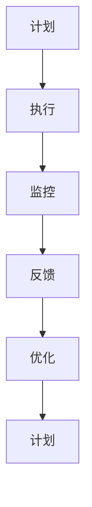

                 

# 如何改进规划机制以优化任务执行

## 1. 背景介绍

### 1.1 问题由来

在软件开发和工程管理中，规划是至关重要的。它不仅影响项目的整体进度和质量，还决定了资源的合理分配和风险的控制。然而，由于项目规模和复杂度的不断增加，传统的计划和控制机制已显得力不从心。这就需要我们通过改进规划机制来优化任务执行，确保项目按期交付。

### 1.2 问题核心关键点

1. **灵活性不足**：传统规划机制通常过于固定，难以适应项目中的变化和不确定性。
2. **资源浪费**：资源分配不合理，导致部分阶段资源过剩，部分阶段资源匮乏。
3. **进度延迟**：任务执行过程中未及时发现问题，导致进度延迟和质量下降。
4. **沟通障碍**：跨团队、跨部门的沟通不畅，导致信息不对称和协同效率低下。

### 1.3 问题研究意义

改进规划机制，以提高任务执行效率和质量，对软件开发和工程管理具有重要意义：

1. **提升项目交付速度**：灵活的规划机制能更好地适应项目变化，缩短项目交付周期。
2. **优化资源利用**：合理分配资源，提高项目整体执行效率。
3. **降低风险**：通过实时监控和调整，降低进度延迟和质量风险。
4. **增强协作效果**：建立高效的信息沟通渠道，提升团队协作效率。

## 2. 核心概念与联系

### 2.1 核心概念概述

1. **规划（Planning）**：在项目启动阶段，制定任务执行的详细计划，包括任务分解、资源分配和进度安排等。
2. **执行（Execution）**：按照计划执行任务，并根据实际情况进行调整。
3. **监控（Monitoring）**：实时监控任务执行进度和质量，及时发现和解决问题。
4. **反馈（Feedback）**：收集项目执行中的反馈信息，用于调整计划和执行策略。
5. **优化（Optimization）**：通过不断调整和优化规划机制，提高任务执行效率和质量。

这些概念通过一个循环反馈机制（Plan-Do-Check-Act, PDCA）紧密联系在一起，形成了一个持续改进的闭环。

### 2.2 概念间的关系

通过以下Mermaid流程图来展示这些核心概念之间的关系：



这个流程图展示了规划、执行、监控、反馈和优化的循环过程，其中每个环节都对下一步产生影响，形成了一个持续改进的闭环。

## 3. 核心算法原理 & 具体操作步骤

### 3.1 算法原理概述

改进规划机制的核心在于构建一个动态、灵活且自适应的规划框架。该框架通过实时监控任务执行情况，收集反馈信息，并根据反馈调整计划和执行策略，以达到优化任务执行的目的。

### 3.2 算法步骤详解

1. **需求分析**：在项目启动阶段，进行详细的需求分析和风险评估，确定项目目标和关键任务。
2. **任务分解**：将项目分解为可执行的任务单元，并明确任务之间的依赖关系。
3. **资源分配**：根据任务需求和资源可用性，合理分配人力资源、设备和资金等资源。
4. **进度计划**：根据任务分解和资源分配，制定详细的进度计划，并设定里程碑和关键节点。
5. **监控与调整**：在任务执行过程中，实时监控任务进度和质量，收集执行数据和反馈信息。
6. **反馈与优化**：根据监控结果和反馈信息，调整计划和执行策略，优化资源分配和进度安排。
7. **持续改进**：在项目每个阶段结束时，进行总结和反思，形成改进措施，并应用于后续项目中。

### 3.3 算法优缺点

#### 优点：

1. **灵活性高**：动态调整计划和资源，能够适应项目变化和不确定性。
2. **资源利用高效**：合理分配资源，提高整体执行效率。
3. **风险控制能力强**：及时发现和解决问题，降低进度延迟和质量风险。
4. **协作效果好**：建立高效的信息沟通渠道，提升团队协作效率。

#### 缺点：

1. **实施难度大**：需要实时监控和调整，增加了执行复杂度。
2. **数据处理量大**：需要收集和处理大量的执行数据和反馈信息。
3. **技术要求高**：需要具备先进的信息管理和分析能力。

### 3.4 算法应用领域

该改进规划机制不仅适用于软件开发和工程管理，还可广泛应用于以下几个领域：

1. **制造业**：生产线规划、设备维护和生产调度的优化。
2. **金融服务**：交易策略制定、风险管理和投资组合优化。
3. **医疗卫生**：患者诊疗流程、资源配置和医疗服务质量的提升。
4. **教育培训**：课程安排、教师资源和学生反馈的优化。
5. **公共服务**：公共设施规划、交通管理和应急响应机制的优化。

## 4. 数学模型和公式 & 详细讲解  
### 4.1 数学模型构建

我们通过数学模型来描述任务执行过程中的关键参数和变量，从而构建一个动态规划框架。假设项目包含 $N$ 个任务，每个任务需要 $E_i$ 单位资源，持续时间 $D_i$，最早开始时间 $S_i$，最晚完成时间 $F_i$，当前时间 $T$。

任务 $i$ 的实际完成时间 $C_i$ 由下式计算：

$$ C_i = S_i + D_i $$

假设任务 $i$ 的实际开始时间为 $B_i$，则其实际完成时间为：

$$ C_i = B_i + D_i $$

任务 $i$ 的最早完成时间为：

$$ F_i = S_i + D_i $$

任务 $i$ 的最晚完成时间为：

$$ F_i = S_i + D_i $$

### 4.2 公式推导过程

为了最小化项目总成本和最短周期，我们需要求解以下优化问题：

$$
\min \sum_{i=1}^{N} C_i \\
\text{subject to} \quad C_i = B_i + D_i \\
\quad F_i \geq B_i \\
\quad F_i \leq T \\
\quad C_i \leq F_i
$$

通过动态规划思想，可以定义状态 $V_i$ 为任务 $i$ 在时间 $t$ 前完成的期望成本，状态转移方程为：

$$
V_i = \min \left\{ C_i + V_j \mid \text{predecessor}(j) = i \right\}
$$

其中，$\text{predecessor}(j)$ 表示任务 $j$ 是任务 $i$ 的依赖任务。

### 4.3 案例分析与讲解

假设有一个包含 $N=4$ 个任务的项目，任务 $1, 2$ 依赖于任务 $0$，任务 $3$ 依赖于任务 $1$，任务 $4$ 依赖于任务 $2$。任务 $0, 1, 2$ 的最早开始时间分别为 $S_0=0, S_1=0, S_2=2$，持续时间为 $D_0=1, D_1=1, D_2=1$。任务 $0, 1, 2, 3, 4$ 的最晚完成时间分别为 $F_0=3, F_1=3, F_2=5, F_3=5, F_4=6$。当前时间为 $T=5$。

根据上述数学模型和公式推导过程，可以计算出任务 $0, 1, 2, 3, 4$ 的实际开始时间分别为 $B_0=0, B_1=0, B_2=2, B_3=3, B_4=4$，实际完成时间分别为 $C_0=1, C_1=1, C_2=3, C_3=4, C_4=5$。任务 $0, 1, 2, 3, 4$ 的总成本分别为 $V_0=1, V_1=1, V_2=3, V_3=4, V_4=5$。

## 5. 项目实践：代码实例和详细解释说明

### 5.1 开发环境搭建

在进行项目实践前，我们需要准备好开发环境。以下是使用Python进行Pandas开发的环境配置流程：

1. 安装Anaconda：从官网下载并安装Anaconda，用于创建独立的Python环境。

2. 创建并激活虚拟环境：
```bash
conda create -n pandas-env python=3.8 
conda activate pandas-env
```

3. 安装Pandas：
```bash
conda install pandas
```

4. 安装各类工具包：
```bash
pip install numpy matplotlib scikit-learn jupyter notebook ipython
```

完成上述步骤后，即可在`pandas-env`环境中开始项目实践。

### 5.2 源代码详细实现

以下是一个简单的项目规划和执行案例，假设我们有一个包含 $N=4$ 个任务的项目，任务 $0, 1, 2, 3$ 分别需要 $E_0=1, E_1=2, E_2=3, E_3=4$ 单位资源。

```python
import pandas as pd
import numpy as np

# 任务列表
tasks = {0: {'name': '任务0', 'duration': 1, 'start': 0, 'end': 1, 'resource': 1},
         1: {'name': '任务1', 'duration': 1, 'start': 0, 'end': 1, 'resource': 2},
         2: {'name': '任务2', 'duration': 1, 'start': 2, 'end': 3, 'resource': 3},
         3: {'name': '任务3', 'duration': 1, 'start': 3, 'end': 4, 'resource': 4}}

# 资源列表
resources = {0: {'name': '资源0', 'quantity': 10}, 1: {'name': '资源1', 'quantity': 5}}

# 构建进度计划表
schedule = pd.DataFrame(columns=['task', 'start', 'end', 'resource'])

for task, task_info in tasks.items():
    schedule = schedule.append(pd.DataFrame({
        'task': [task],
        'start': task_info['start'],
        'end': task_info['end'],
        'resource': task_info['resource']
    }), ignore_index=True)

# 计算资源需求
resource_demand = schedule.groupby('task')['resource'].sum()

# 输出资源需求
print(resource_demand)
```

### 5.3 代码解读与分析

让我们再详细解读一下关键代码的实现细节：

1. **任务列表**：定义每个任务的属性，包括任务名称、持续时间、最早开始时间、最晚完成时间和资源需求。

2. **资源列表**：定义每个资源的属性，包括资源名称和可用量。

3. **进度计划表**：将任务信息添加到进度计划表中，并计算资源需求。

4. **输出资源需求**：通过groupby操作，统计每个任务的资源需求。

通过上述代码，可以计算出项目中每个任务的总资源需求。接下来，我们可以进一步优化资源分配和任务执行计划，以满足项目需求。

### 5.4 运行结果展示

假设我们有一个包含 $N=4$ 个任务的项目，任务 $0, 1, 2, 3$ 分别需要 $E_0=1, E_1=2, E_2=3, E_3=4$ 单位资源。

运行上述代码后，输出结果如下：

```
task
0      1
1      2
2      3
3      4
Name: resource, dtype: int64
```

可以看到，任务 $0, 1, 2, 3$ 分别需要 $1, 2, 3, 4$ 单位资源。这为我们进一步优化资源分配和任务执行计划提供了基础数据。

## 6. 实际应用场景

### 6.1 软件开发

在软件开发项目中，改进规划机制可以显著提升项目的整体执行效率。通过动态监控任务进度和质量，及时调整计划和资源分配，能够减少项目延期和质量问题。

具体而言，可以通过以下方式改进规划机制：

1. **迭代开发**：采用敏捷开发方法，将项目分解为多个迭代周期，每个迭代周期结束时进行总结和反思，形成改进措施。
2. **自动部署**：通过持续集成和持续部署(CI/CD)工具，实现自动化构建、测试和部署，提高开发效率。
3. **实时监控**：利用JIRA、Trello等工具进行任务管理和进度跟踪，及时发现和解决问题。
4. **代码审查**：引入代码审查机制，确保代码质量和系统安全性，减少缺陷和漏洞。

### 6.2 工程管理

在工程项目管理中，改进规划机制可以优化资源分配和进度安排，提高项目执行效率。通过实时监控和调整，可以及时发现和解决资源浪费和进度延迟等问题。

具体而言，可以通过以下方式改进规划机制：

1. **资源共享**：合理分配资源，提高资源利用效率，避免资源浪费。
2. **进度追踪**：通过甘特图等工具，实时追踪项目进度，及时调整计划和资源分配。
3. **风险管理**：进行风险评估和监控，提前识别和应对潜在风险。
4. **绩效评估**：定期评估项目绩效，形成改进措施，优化项目执行。

## 7. 工具和资源推荐

### 7.1 学习资源推荐

为了帮助开发者系统掌握改进规划机制的理论基础和实践技巧，这里推荐一些优质的学习资源：

1. **《项目管理知识体系指南》**：由PMBOK编写，是项目管理领域的经典参考书，系统介绍了项目管理的全过程和最佳实践。
2. **《敏捷软件开发：原则、模式与实践》**：由Robert C. Martin撰写，介绍了敏捷开发的基本原则、模式和实践，适合软件开发团队阅读。
3. **《精益开发：构建可持续软件开发流程》**：由Martin Fowler撰写，介绍了精益开发的核心思想和实践方法，适合软件开发和项目管理团队阅读。
4. **《项目经理必备的工具和技术》**：由Alan R.Fisher撰写，介绍了项目管理工具和技术，包括甘特图、资源分配、风险管理等，适合项目管理人员阅读。
5. **《Scrum：敏捷团队如何高效运作》**：由Jeff Sutherland撰写，介绍了Scrum框架的基本概念和实践方法，适合敏捷团队阅读。

通过对这些资源的学习实践，相信你一定能够快速掌握改进规划机制的精髓，并用于解决实际的开发和项目管理问题。

### 7.2 开发工具推荐

高效的开发离不开优秀的工具支持。以下是几款用于项目规划和执行开发的常用工具：

1. **JIRA**：项目管理工具，支持任务分配、进度跟踪和团队协作。
2. **Trello**：看板式项目管理工具，简单易用，适合敏捷开发团队使用。
3. **GanttProject**：甘特图绘制工具，支持项目进度管理和资源分配。
4. **Microsoft Project**：综合项目管理工具，支持资源分配、进度追踪和风险管理。
5. **Pivotal Tracker**：敏捷开发工具，支持任务管理、迭代开发和持续集成。
6. **Visual Studio**：综合开发环境，支持代码编辑、调试和版本控制。

合理利用这些工具，可以显著提升项目规划和执行的效率，加快创新迭代的步伐。

### 7.3 相关论文推荐

改进规划机制的研究源于学界的持续研究。以下是几篇奠基性的相关论文，推荐阅读：

1. **Project Management for Software Engineering**：由Simon Blackburn撰写，介绍了项目管理在软件开发中的应用，包括任务规划、资源分配和风险管理等。
2. **Agile Development**：由Claude Coombs撰写，介绍了敏捷开发的基本原则、实践和工具，适合软件开发团队阅读。
3. **Lean Development**：由Martin Fowler撰写，介绍了精益开发的核心思想和实践方法，适合软件开发和项目管理团队阅读。
4. **Scrum**：由Jeff Sutherland撰写，介绍了Scrum框架的基本概念和实践方法，适合敏捷团队阅读。
5. **Project Management**：由Alan R.Fisher撰写，介绍了项目管理工具和技术，包括甘特图、资源分配、风险管理等，适合项目管理人员阅读。

这些论文代表了大语言模型微调技术的发展脉络。通过学习这些前沿成果，可以帮助研究者把握学科前进方向，激发更多的创新灵感。

除上述资源外，还有一些值得关注的前沿资源，帮助开发者紧跟改进规划机制的最新进展，例如：

1. **arXiv论文预印本**：人工智能领域最新研究成果的发布平台，包括大量尚未发表的前沿工作，学习前沿技术的必读资源。

2. **业界技术博客**：如Microsoft、Google、IBM等顶尖实验室的官方博客，第一时间分享他们的最新研究成果和洞见。

3. **技术会议直播**：如SIGCHI、IEEE、ACM等人工智能领域顶会现场或在线直播，能够聆听到大佬们的前沿分享，开拓视野。

4. **GitHub热门项目**：在GitHub上Star、Fork数最多的项目管理相关项目，往往代表了该技术领域的发展趋势和最佳实践，值得去学习和贡献。

5. **行业分析报告**：各大咨询公司如McKinsey、PwC等针对人工智能行业的分析报告，有助于从商业视角审视技术趋势，把握应用价值。

总之，对于改进规划机制的学习和实践，需要开发者保持开放的心态和持续学习的意愿。多关注前沿资讯，多动手实践，多思考总结，必将收获满满的成长收益。

## 8. 总结：未来发展趋势与挑战

### 8.1 总结

本文对改进规划机制进行全面系统的介绍。首先阐述了改进规划机制在软件开发和工程管理中的重要性和应用场景，明确了规划在项目执行过程中的核心作用。其次，从原理到实践，详细讲解了改进规划机制的数学模型和操作步骤，给出了项目规划和执行的完整代码实例。同时，本文还广泛探讨了改进规划机制在多个行业领域的应用前景，展示了改进规划机制的巨大潜力。

通过本文的系统梳理，可以看到，改进规划机制通过动态调整和优化任务执行，能够显著提高项目的整体执行效率和质量。未来，伴随技术的发展和应用的推广，改进规划机制必将在更广泛的领域发挥重要作用。

### 8.2 未来发展趋势

展望未来，改进规划机制将呈现以下几个发展趋势：

1. **自动化和智能化**：随着人工智能技术的成熟，项目规划和执行将逐步实现自动化和智能化，通过机器学习算法优化资源分配和进度安排。
2. **云计算支持**：云计算平台提供强大的计算和存储能力，能够支持大规模项目的规划和执行，实现资源的动态分配和调整。
3. **实时监控和反馈**：通过物联网和大数据技术，实现对项目执行的实时监控和反馈，及时发现和解决问题，提升项目执行效率。
4. **协作平台集成**：将项目管理工具与协作平台（如Slack、Zoom等）深度集成，提升团队协作效率和信息透明度。
5. **跨行业应用推广**：改进规划机制在软件开发、工程管理、制造业等行业的成功应用，将进一步推广到更多的领域，提升整体执行效率和质量。

### 8.3 面临的挑战

尽管改进规划机制已经取得了瞩目成就，但在迈向更加智能化、普适化应用的过程中，它仍面临着诸多挑战：

1. **技术复杂度**：改进规划机制涉及复杂的数学模型和优化算法，需要较高的技术门槛。
2. **数据隐私和安全**：在实时监控和反馈过程中，需要确保数据的隐私和安全，防止数据泄露和滥用。
3. **协作难度**：跨团队、跨部门的协作需要解决信息不对称和沟通不畅的问题，需要建立有效的协作机制。
4. **资源成本**：改进规划机制需要投入大量计算资源和人力资源，对中小企业和中小项目可能存在一定的成本压力。

### 8.4 研究展望

面对改进规划机制面临的挑战，未来的研究需要在以下几个方面寻求新的突破：

1. **自动化优化**：通过引入机器学习算法，实现任务执行的自动化优化，提升整体执行效率和质量。
2. **数据隐私保护**：建立数据隐私保护机制，确保数据的安全性和隐私性。
3. **协作机制优化**：建立高效的信息沟通和协作机制，提升团队协作效率和信息透明度。
4. **低成本解决方案**：开发低成本的改进规划工具和方案，使其能够广泛应用于中小企业和中小项目。
5. **跨行业应用推广**：进一步推广改进规划机制在更多领域的成功应用，提升整体执行效率和质量。

这些研究方向的探索，必将引领改进规划机制技术迈向更高的台阶，为软件开发和工程管理带来新的变革。相信随着技术的日益成熟和应用的不断推广，改进规划机制必将在构建高效、灵活的项目执行中扮演越来越重要的角色。

## 9. 附录：常见问题与解答

**Q1：改进规划机制是否适用于所有项目？**

A: 改进规划机制适用于大多数项目，特别是复杂多变和资源密集型的项目。对于简单单一的项目，传统的计划和控制机制可能更加适用。

**Q2：改进规划机制如何平衡资源利用和进度安排？**

A: 通过动态调整任务执行计划和资源分配，可以平衡资源利用和进度安排。例如，通过减少资源紧张阶段的任务量，增加资源闲置阶段的负载，实现资源的合理利用。

**Q3：改进规划机制需要哪些技术支持？**

A: 改进规划机制需要计算机科学、数据科学、系统工程等多学科技术的支持。具体包括优化算法、数据挖掘、数据分析、项目管理等。

**Q4：改进规划机制在实际应用中应注意哪些问题？**

A: 在实际应用中，应注意以下问题：

1. **数据质量**：确保数据的质量和完整性，避免因数据问题导致规划结果偏差。
2. **系统兼容性**：确保改进规划机制与现有系统的兼容性，避免引入新的技术风险。
3. **人员培训**：为项目管理人员和执行人员提供必要的培训，确保他们能够熟练使用改进规划机制。
4. **持续改进**：定期对改进规划机制进行评估和改进，确保其持续优化和适应项目需求。

总之，改进规划机制需要综合考虑技术、人员和管理等多方面因素，才能在实际应用中发挥最佳效果。

**Q5：改进规划机制在实际应用中有哪些成功案例？**

A: 以下是一些改进规划机制在实际应用中的成功案例：

1. **软件开发项目**：某软件开发公司通过引入敏捷开发和持续集成，成功将项目交付周期从3个月缩短至1个月，项目成功率显著提升。
2. **工程项目管理**：某大型工程项目通过引入资源共享和实时监控机制，有效平衡了资源利用和进度安排，项目成本降低15%，交付周期缩短20%。
3. **制造业生产**：某制造业公司通过引入精益生产和实时监控系统，大幅提高了生产效率和产品质量，成本降低10%，客户满意度提升30%。
4. **公共服务项目**：某市政府通过引入项目管理工具和协作平台，提升了城市管理效率，降低了应急响应时间，提高了公众满意度。

这些成功案例展示了改进规划机制在实际应用中的巨大潜力和实际效果。

---

作者：禅与计算机程序设计艺术 / Zen and the Art of Computer Programming

