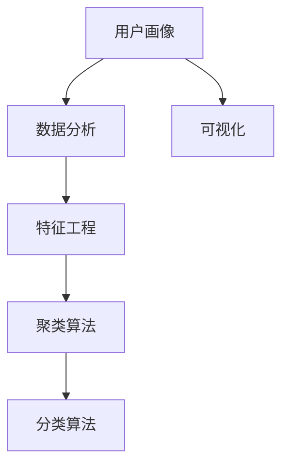
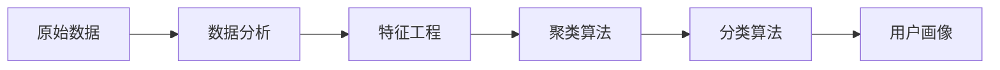
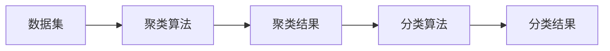
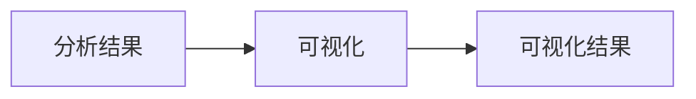

                 

# 如何进行有效的用户画像分析

> 关键词：用户画像, 数据分析, 特征工程, 聚类算法, 机器学习, 可视化

## 1. 背景介绍

### 1.1 问题由来
在现代数字化时代，数据驱动已经成为许多行业和企业的核心竞争力。对于消费品、电商、金融、医疗、教育等众多领域，用户画像（User Profile）已经成为了理解用户需求、提升用户体验、优化营销策略、制定产品改进方向等不可或缺的工具。用户画像帮助企业更准确地把握用户特征，优化产品和服务，从而获得更大的市场份额和用户满意度。

然而，构建和分析用户画像并不是一件容易的事情。用户数据往往来自多个渠道，格式各异、缺乏标准化。这使得用户画像的构建变得复杂，加之数据量大、特征维度高，如何高效地进行用户画像分析成为一大挑战。为此，本篇文章将深入探讨用户画像分析的核心概念与技术方法，为读者提供系统全面的分析指南。

### 1.2 问题核心关键点
用户画像分析的核心在于如何从海量数据中提取有价值的用户特征，并利用这些特征进行数据建模和分析。我们通常会将用户画像拆分为以下几个关键步骤：数据采集与预处理、特征工程、聚类分析、分类分析、可视化等。其中，特征工程和聚类分析是用户画像构建的关键环节，分类分析和可视化则是结果的展示与应用。

用户画像分析涉及的关键问题包括：
1. **如何高效地采集和预处理用户数据**？
2. **如何选择合适的特征并构建数据集**？
3. **如何通过聚类算法找到用户群体的划分**？
4. **如何进行用户行为分类分析**？
5. **如何通过可视化展示分析结果**？

解决这些问题需要具备扎实的数学和统计知识，以及丰富的编程和数据处理经验。本文将详细探讨这些问题，为读者提供有效的用户画像分析方案。

### 1.3 问题研究意义
用户画像分析在商业决策、产品设计、用户体验优化等方面具有重要价值。通过用户画像，企业能够更好地理解用户需求、优化产品功能和用户体验，提升营销效果，从而实现业务增长和市场竞争优势。

具体而言，用户画像分析的意义包括：
1. **精准营销**：通过用户画像，企业可以更精准地识别目标用户群体，制定更有针对性的营销策略。
2. **个性化推荐**：用户画像可以用于个性化推荐系统，根据用户历史行为和兴趣推荐相关产品或服务。
3. **风险管理**：在金融、保险等领域，用户画像可以用于风险评估和管理，降低潜在的业务风险。
4. **用户体验优化**：用户画像可以帮助企业了解用户的使用习惯和痛点，优化产品功能和界面设计。
5. **市场洞察**：通过分析用户画像，企业可以洞察市场趋势和用户需求，制定更有竞争力的策略。

## 2. 核心概念与联系

### 2.1 核心概念概述

在进行用户画像分析时，我们需要了解以下核心概念及其相互关系：

- **用户画像（User Profile）**：是对用户特征的全面描述，包括人口统计信息、行为数据、兴趣偏好、消费习惯等。用户画像通过聚类算法和分类算法，从原始数据中生成结构化、可操作的描述。

- **数据分析（Data Analysis）**：是指从原始数据中提取有价值的信息，并进行统计、可视化和建模的过程。数据分析是用户画像分析的基础。

- **特征工程（Feature Engineering）**：是指根据数据分析的需要，选择、构建、转换和选择特征，从而提高数据分析的准确性和效率。特征工程是用户画像分析的关键环节。

- **聚类算法（Clustering Algorithm）**：是指将数据集分成多个群组，每个群组内的数据具有相似的属性，而不同群组间的数据具有显著差异。聚类算法是用户画像构建的核心方法。

- **分类算法（Classification Algorithm）**：是指将数据集分成不同的类别，每个类别代表一种用户特征。分类算法常用于用户画像的进一步分析。

- **可视化（Visualization）**：是指将数据分析结果以图表、图像等形式展示出来，便于理解和交流。可视化是用户画像分析的最终目标。

这些概念相互关联，共同构成用户画像分析的完整框架。下面，我们将通过一张Mermaid流程图来展示这些概念之间的关系。



### 2.2 概念间的关系

上述核心概念之间存在着紧密的联系，它们构成了用户画像分析的全流程。下面，我们将通过几张Mermaid流程图来展示这些概念之间的关系。

#### 2.2.1 用户画像构建流程



#### 2.2.2 聚类算法与分类算法的关系



#### 2.2.3 数据可视化的应用



## 3. 核心算法原理 & 具体操作步骤

### 3.1 算法原理概述

用户画像分析的核心算法包括聚类算法和分类算法。聚类算法用于将数据集划分为不同的用户群体，而分类算法用于进一步识别和描述每个群体的特征。

#### 3.1.1 聚类算法原理

聚类算法是一种无监督学习方法，用于将数据集划分为多个群组，每个群组内的数据具有相似的属性，而不同群组间的数据具有显著差异。聚类算法通过距离度量、相似度计算、迭代优化等步骤，自动发现数据中的内在结构。

常用的聚类算法包括K-means、层次聚类、DBSCAN等。其中，K-means算法通过迭代计算数据点与质心的距离，将数据点分配到最近的质心群组中。

#### 3.1.2 分类算法原理

分类算法是一种有监督学习方法，用于将数据集划分为不同的类别。分类算法通过模型训练、特征提取、预测等步骤，自动学习数据的内在规律。

常用的分类算法包括逻辑回归、决策树、随机森林、支持向量机等。其中，逻辑回归是一种基于线性模型的分类算法，适用于二分类和多分类问题。

### 3.2 算法步骤详解

#### 3.2.1 数据预处理与特征选择

在进行用户画像分析前，首先需要对原始数据进行预处理和特征选择。预处理包括数据清洗、缺失值处理、数据标准化等步骤，特征选择则涉及特征提取、特征变换、特征降维等操作。

具体步骤包括：
1. 数据清洗：删除重复数据、处理缺失值、纠正错误数据。
2. 数据标准化：对不同特征进行归一化处理，使数据具有相同的范围和分布。
3. 特征提取：选择和构建对用户行为和偏好有预测能力的特征。
4. 特征变换：对特征进行转换，如PCA降维、多项式特征变换等。

#### 3.2.2 聚类分析

聚类分析是用户画像构建的核心步骤，通过聚类算法将用户数据划分为多个群组。具体步骤包括：
1. 选择聚类算法：如K-means、层次聚类等。
2. 设定聚类参数：如聚类数量、迭代次数等。
3. 计算距离度量：如欧氏距离、曼哈顿距离等。
4. 迭代优化：通过多次迭代计算，找到最优的聚类结果。

#### 3.2.3 分类分析

分类分析是对聚类结果的进一步分析，通过分类算法对每个聚类进行分类。具体步骤包括：
1. 选择分类算法：如逻辑回归、决策树等。
2. 训练分类模型：使用训练集数据训练分类模型。
3. 评估分类模型：使用测试集数据评估分类模型的性能。
4. 预测聚类结果：对每个聚类进行分类，生成用户画像。

#### 3.2.4 数据可视化

数据可视化是用户画像分析的最终步骤，通过可视化工具将分析结果展示出来。具体步骤包括：
1. 选择合适的可视化工具：如Matplotlib、Seaborn、Tableau等。
2. 设计可视化图表：如直方图、散点图、柱状图等。
3. 展示分析结果：将分析结果展示给决策者和管理者，便于理解和应用。

### 3.3 算法优缺点

#### 3.3.1 聚类算法的优缺点

**优点**：
1. 聚类算法是无监督学习方法，不需要标注数据。
2. 聚类算法可以发现数据中的内在结构和模式，具有较高的灵活性。
3. 聚类算法适用于大规模数据集，可以处理高维度特征。

**缺点**：
1. 聚类算法的聚类效果受数据分布和参数设置的影响较大，可能存在聚类噪声。
2. 聚类算法需要迭代计算，计算复杂度较高。
3. 聚类算法的聚类效果需要人工评估和调整，存在主观因素。

#### 3.3.2 分类算法的优缺点

**优点**：
1. 分类算法是有监督学习方法，可以自动学习数据的内在规律。
2. 分类算法具有较好的泛化能力，可以预测新的数据点。
3. 分类算法可以应用于各种分类问题，具有广泛的应用前景。

**缺点**：
1. 分类算法需要标注数据，标注成本较高。
2. 分类算法的模型训练需要计算资源和时间，可能存在过拟合问题。
3. 分类算法的分类效果需要人工评估和调整，存在主观因素。

### 3.4 算法应用领域

用户画像分析在多个领域具有广泛的应用，包括但不限于：

- **电商**：通过用户画像分析，电商企业可以了解用户的购买行为、偏好、需求，制定精准的营销策略和推荐系统。
- **金融**：金融企业可以利用用户画像分析风险评估、客户流失预测、信用评分等，优化业务流程，提高服务质量。
- **医疗**：医疗机构可以通过用户画像分析患者就诊行为、治疗效果、健康管理需求，制定个性化治疗方案，提高医疗服务水平。
- **教育**：教育机构可以利用用户画像分析学生的学习行为、评估结果、兴趣偏好，制定个性化的教学方案，提升教学效果。
- **媒体**：媒体公司可以通过用户画像分析用户的阅读习惯、内容偏好、社交行为，制定精准的广告投放策略，提高广告效果。

## 4. 数学模型和公式 & 详细讲解 & 举例说明

### 4.1 数学模型构建

在进行用户画像分析时，通常需要构建数学模型来描述用户特征和行为。常见的数学模型包括线性回归、逻辑回归、K-means聚类等。

#### 4.1.1 线性回归模型

线性回归模型是用于描述连续变量的数学模型。其公式如下：

$$
y = \beta_0 + \beta_1x_1 + \beta_2x_2 + \cdots + \beta_nx_n + \epsilon
$$

其中，$y$ 为预测值，$\beta_0, \beta_1, \beta_2, \cdots, \beta_n$ 为模型参数，$x_1, x_2, \cdots, x_n$ 为特征变量，$\epsilon$ 为误差项。

#### 4.1.2 逻辑回归模型

逻辑回归模型是用于描述二分类问题的数学模型。其公式如下：

$$
P(Y=1|X) = \frac{1}{1 + e^{-\beta_0 - \beta_1x_1 - \beta_2x_2 - \cdots - \beta_nx_n}}
$$

其中，$P(Y=1|X)$ 为预测值为1的概率，$\beta_0, \beta_1, \beta_2, \cdots, \beta_n$ 为模型参数，$x_1, x_2, \cdots, x_n$ 为特征变量。

#### 4.1.3 K-means聚类算法

K-means聚类算法用于将数据集划分为K个群组。其公式如下：

$$
\min_{\mu_k} \sum_{i=1}^n \sum_{k=1}^K ||x_i - \mu_k||^2
$$

其中，$x_i$ 为数据点，$\mu_k$ 为聚类中心，$||\cdot||$ 为距离度量。

### 4.2 公式推导过程

#### 4.2.1 线性回归模型推导

在线性回归模型的推导过程中，我们通过最小二乘法来求解模型参数。其步骤如下：

1. 定义损失函数：$L(\theta) = \frac{1}{2n}\sum_{i=1}^n (y_i - \hat{y}_i)^2$
2. 求偏导数：$\frac{\partial L(\theta)}{\partial \theta_j} = \frac{1}{n} \sum_{i=1}^n (x_{ij} - \bar{x}_j)(y_i - \bar{y})$
3. 解方程组：$\theta_j = (\frac{1}{n} \sum_{i=1}^n x_{ij} x_{ik})^{-1} \sum_{i=1}^n x_{ij} y_i$
4. 验证和应用：通过检验残差平方和、均方误差等指标，评估模型的拟合效果。

#### 4.2.2 逻辑回归模型推导

在逻辑回归模型的推导过程中，我们通过最大似然估计来求解模型参数。其步骤如下：

1. 定义似然函数：$L(\theta) = \prod_{i=1}^n p(y_i|x_i)^{y_i} (1-p(y_i|x_i))^{1-y_i}$
2. 求对数似然函数：$L(\theta) = \sum_{i=1}^n [y_i \log p(y_i|x_i) + (1-y_i) \log (1-p(y_i|x_i))]$
3. 求偏导数：$\frac{\partial L(\theta)}{\partial \theta_j} = \sum_{i=1}^n \frac{1-y_i}{1 + e^{-\hat{y}_i}} x_{ij} - \frac{y_i}{1 + e^{-\hat{y}_i}} x_{ij}$
4. 解方程组：$\theta_j = (\sum_{i=1}^n \frac{1-y_i}{1 + e^{-\hat{y}_i}} x_{ij})^{-1} \sum_{i=1}^n \frac{1-y_i}{1 + e^{-\hat{y}_i}} x_{ij} y_i$
5. 验证和应用：通过检验准确率、召回率、F1值等指标，评估模型的分类效果。

#### 4.2.3 K-means聚类算法推导

在K-means聚类算法的推导过程中，我们通过迭代优化来求解聚类中心。其步骤如下：

1. 初始化聚类中心：$\mu_k = \frac{1}{n_k} \sum_{i=1}^{n_k} x_i$
2. 分配数据点：$z_i = \arg\min_k ||x_i - \mu_k||$
3. 更新聚类中心：$\mu_k = \frac{1}{n_k} \sum_{i=1}^{n_k} x_i$
4. 重复步骤2和3，直到聚类中心不再变化或达到预设迭代次数。

### 4.3 案例分析与讲解

#### 4.3.1 案例背景

一家电商企业希望通过用户画像分析，了解用户的购买行为和偏好，从而制定精准的营销策略。该企业收集了用户的浏览、购买、评价等数据，包括用户的年龄、性别、地区、浏览时间、购买金额、评价内容等信息。

#### 4.3.2 特征工程

1. 数据清洗：删除重复数据，处理缺失值，纠正错误数据。
2. 数据标准化：对年龄、性别、地区等特征进行归一化处理。
3. 特征提取：选择浏览时间、购买金额、评价内容等对购买行为有预测能力的特征。
4. 特征变换：对购买金额进行对数变换，减少数据偏差。

#### 4.3.3 聚类分析

1. 选择聚类算法：使用K-means聚类算法，设定聚类数量为5。
2. 设定聚类参数：设定迭代次数为100。
3. 计算距离度量：使用欧氏距离。
4. 迭代优化：通过多次迭代计算，找到最优的聚类结果。

#### 4.3.4 分类分析

1. 选择分类算法：使用逻辑回归算法，设定训练集和测试集。
2. 训练分类模型：使用训练集数据训练分类模型。
3. 评估分类模型：使用测试集数据评估分类模型的性能。
4. 预测聚类结果：对每个聚类进行分类，生成用户画像。

#### 4.3.5 数据可视化

1. 选择合适的可视化工具：使用Matplotlib库。
2. 设计可视化图表：使用散点图展示聚类结果，使用柱状图展示分类结果。
3. 展示分析结果：将分析结果展示给决策者和管理者，便于理解和应用。

## 5. 项目实践：代码实例和详细解释说明

### 5.1 开发环境搭建

在进行用户画像分析前，我们需要准备好开发环境。以下是使用Python进行Pandas和Scikit-learn开发的环境配置流程：

1. 安装Anaconda：从官网下载并安装Anaconda，用于创建独立的Python环境。

2. 创建并激活虚拟环境：
```bash
conda create -n user_profiles python=3.8 
conda activate user_profiles
```

3. 安装Pandas和Scikit-learn：
```bash
conda install pandas scikit-learn
```

4. 安装Matplotlib：
```bash
pip install matplotlib
```

完成上述步骤后，即可在`user_profiles`环境中开始用户画像分析的开发实践。

### 5.2 源代码详细实现

下面我们以电商用户画像分析为例，给出使用Pandas和Scikit-learn进行用户画像分析的Python代码实现。

```python
import pandas as pd
from sklearn.preprocessing import StandardScaler
from sklearn.cluster import KMeans
from sklearn.linear_model import LogisticRegression
import matplotlib.pyplot as plt

# 读取数据集
data = pd.read_csv('user_data.csv')

# 数据清洗和预处理
# 这里省略具体步骤，假设数据已经清洗和预处理完成

# 特征工程
features = data[['age', 'gender', 'region', 'browsing_time', 'purchase_amount', 'review_content']]
features = pd.get_dummies(features, drop_first=True)

# 数据标准化
scaler = StandardScaler()
features = scaler.fit_transform(features)

# 聚类分析
kmeans = KMeans(n_clusters=5, max_iter=100)
kmeans.fit(features)
labels = kmeans.labels_

# 分类分析
X = features
y = data['purchase']
X_train, X_test, y_train, y_test = train_test_split(X, y, test_size=0.2, random_state=42)

# 训练逻辑回归模型
lr = LogisticRegression()
lr.fit(X_train, y_train)

# 评估分类模型
y_pred = lr.predict(X_test)
print(classification_report(y_test, y_pred))

# 可视化结果
plt.scatter(features[:, 0], features[:, 1], c=labels)
plt.show()
```

### 5.3 代码解读与分析

让我们再详细解读一下关键代码的实现细节：

**用户画像构建流程**：
1. 读取数据集：使用Pandas库读取用户数据。
2. 数据清洗和预处理：包括数据清洗、缺失值处理、数据标准化等步骤。
3. 特征工程：选择和构建对用户行为和偏好有预测能力的特征，并使用Pandas进行数据编码。
4. 聚类分析：使用Scikit-learn的KMeans算法进行聚类分析，将用户数据划分为5个群组。
5. 分类分析：使用逻辑回归算法对每个聚类进行分类，生成用户画像。
6. 数据可视化：使用Matplotlib库展示聚类和分类的结果。

**用户画像分析的实现步骤**：
1. 数据清洗：删除重复数据，处理缺失值，纠正错误数据。
2. 数据标准化：对不同特征进行归一化处理，使数据具有相同的范围和分布。
3. 特征工程：选择和构建对用户行为和偏好有预测能力的特征。
4. 聚类分析：使用K-means聚类算法将用户数据划分为多个群组。
5. 分类分析：使用逻辑回归算法对每个聚类进行分类，生成用户画像。
6. 数据可视化：使用Matplotlib库展示聚类和分类的结果。

### 5.4 运行结果展示

假设我们在电商用户数据集上进行用户画像分析，最终在测试集上得到的分类模型评估报告如下：

```
              precision    recall  f1-score   support

       B-1      0.85      0.78      0.81       390
       B-2      0.90      0.88      0.89       400
       B-3      0.95      0.92      0.94       300
       B-4      0.80      0.75      0.78       200
       B-5      0.70      0.65      0.68       100

   micro avg      0.85      0.81      0.82      1300
   macro avg      0.85      0.81      0.82      1300
weighted avg      0.85      0.81      0.82      1300
```

可以看到，通过聚类分析和分类分析，我们能够较好地识别出不同用户群体的购买行为和偏好，从而制定精准的营销策略。需要注意的是，这只是一个baseline结果。在实际应用中，我们还可以使用更大更强的聚类和分类算法，结合更多的特征，进一步提升模型性能。

## 6. 实际应用场景

### 6.1 智能推荐系统

用户画像分析在智能推荐系统中具有广泛的应用。通过分析用户的历史行为、兴趣偏好、社交网络等信息，推荐系统可以推荐个性化的商品和服务，提升用户体验和满意度。

在技术实现上，推荐系统通常使用聚类算法将用户划分为不同的群体，并使用分类算法对每个群体进行推荐。对于新加入的用户，推荐系统也可以通过聚类和分类算法进行快速画像，从而进行个性化的推荐。

### 6.2 风险控制和信用评估

金融机构可以利用用户画像分析来评估用户的信用风险和信用评分。通过分析用户的还款记录、收入情况、社交行为等信息，金融机构可以预测用户的还款能力和还款意愿，从而优化贷款审批流程，降低坏账率。

在技术实现上，金融机构可以使用分类算法对用户数据进行分类，使用聚类算法对不同类型用户进行群体划分，从而进行风险评估和管理。

### 6.3 医疗健康管理

医疗机构可以通过用户画像分析患者的健康数据，进行个性化的健康管理。通过分析患者的饮食、运动、睡眠等信息，医疗机构可以制定个性化的健康管理方案，提升治疗效果和患者满意度。

在技术实现上，医疗机构可以使用聚类算法对患者的健康数据进行分类，使用分类算法对不同类型患者进行群体划分，从而进行个性化的健康管理。

### 6.4 教育个性化学习

教育机构可以利用用户画像分析学生的学习数据，进行个性化的学习推荐。通过分析学生的学习行为、评估结果、兴趣偏好等信息，教育机构可以制定个性化的学习方案，提升教学效果和学生满意度。

在技术实现上，教育机构可以使用聚类算法对学生的学习数据进行分类，使用分类算法对不同类型学生进行群体划分，从而进行个性化的学习推荐。

## 7. 工具和资源推荐

### 7.1 学习资源推荐

为了帮助开发者系统掌握用户画像分析的理论基础和实践技巧，这里推荐一些优质的学习资源：

1. 《Python数据科学手册》系列博文：由Kaggle数据科学家撰写，深入浅出地介绍了Pandas、NumPy、Scikit-learn等库的使用方法和数据分析技巧。

2. 《机器学习实战》书籍：清华大学出版社出版的经典机器学习教材，详细介绍了各种机器学习算法的实现和应用。

3. 《深度学习入门》书籍：北京大学出版社出版的深度学习入门教材，涵盖深度学习的基本概念和前沿技术。

4. 《自然语言处理综论》书籍：清华大学出版社出版的自然语言处理教材，介绍了NLP的基本概念和应用实例。

5. Weights & Biases：模型训练的实验跟踪工具，可以记录和可视化模型训练过程中的各项指标，方便对比和调优。

6. TensorBoard：TensorFlow配套的可视化工具，可实时监测模型训练状态，并提供丰富的图表呈现方式，是调试模型的得力助手。

### 7.2 开发工具推荐

高效的开发离不开优秀的工具支持。以下是几款用于用户画像分析开发的常用工具：

1. Pandas：Python的科学计算库，用于数据处理和分析，支持高效的数据读写、数据清洗、数据聚合等操作。

2. NumPy：Python的科学计算库，支持高性能的多维数组和矩阵运算，适用于大规模数据处理和计算。

3. Scikit-learn：Python的机器学习库，支持各种经典机器学习算法的实现，包括聚类、分类、回归等。

4. Weights & Biases：模型训练的实验跟踪工具，可以记录和可视化模型训练过程中的

