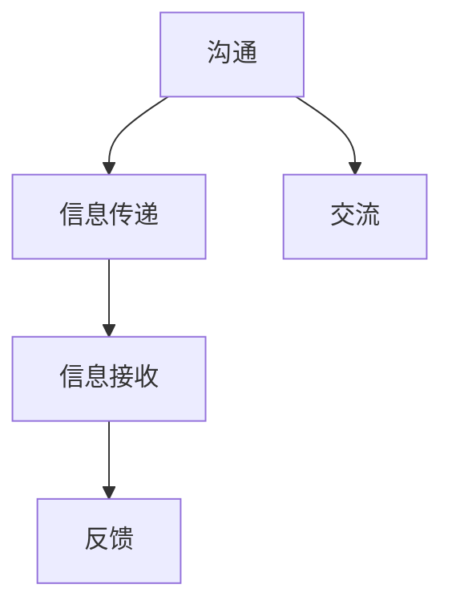

                 

## 1. 背景介绍

### 1.1 问题由来
在信息化高度发达的今天，沟通交流已成为人与人之间、人与机器之间信息传递的基础。有效沟通不仅能增进理解、减少误解，还能促进合作、推动创新。然而，尽管人们每天花大量时间在各种沟通交流上，实际效果却不尽如人意。据调查，超过一半的企业内部沟通效率低下，超过70%的沟通错误是由于不充分的沟通引起的。

### 1.2 问题核心关键点
1. **沟通的本质**：沟通的本质是一种信息传递和接收的过程，涉及到双方的语言能力、情感表达和认知理解。
2. **沟通的双向性**：沟通是双方互动的过程，不仅仅是单方面的传递，更需要接收方的反馈和理解。
3. **沟通的复杂性**：沟通内容涉及多方面的因素，包括文化背景、情感状态、认知水平等，导致沟通难度增加。
4. **沟通的动态性**：随着时间和环境的变化，沟通的内容和方式也需要不断调整，以适应新的情境。

### 1.3 问题研究意义
研究如何实现有效的沟通和交流，对于提升工作效率、改善人际关系、促进创新合作具有重要意义。良好的沟通能力能够帮助人们在复杂多变的社会环境中更好地适应和应对挑战，推动个体和组织的发展。

## 2. 核心概念与联系

### 2.1 核心概念概述

- **沟通**：沟通是一种信息传递和反馈的互动过程，包括语言、非语言、情感等多种形式的交流。
- **交流**：交流是指通过沟通传递和接受信息的过程，通常涉及口头、书面、非语言等多种形式。
- **信息传递**：信息传递是沟通的基础，通过语言、文字、符号等方式，将信息从发送方传递给接收方。
- **信息接收**：信息接收是指接收方对发送方传递的信息进行理解和反馈的过程，是沟通的核心环节。
- **反馈**：反馈是沟通的重要组成部分，用于确认信息是否被正确接收和理解，促进双方进一步沟通。

这些概念之间的逻辑关系可以通过以下Mermaid流程图来展示：



这个流程图展示了一个简单的沟通流程，其中信息传递、信息接收和反馈是关键环节。沟通通过信息传递和接收，最终实现信息的有效传递和交流。

### 2.2 概念间的关系

- **沟通与交流的关系**：沟通是交流的基础，交流是沟通的具体表现形式。有效的沟通需要双方通过交流，传递和接收信息。
- **信息传递与信息接收的关系**：信息传递是信息接收的前提，信息接收是信息传递的目的。只有确保信息被准确接收，沟通才能实现其价值。
- **反馈在沟通中的作用**：反馈是沟通不可或缺的环节，用于确认信息传递的效果，促进双方进一步沟通。

## 3. 核心算法原理 & 具体操作步骤
### 3.1 算法原理概述

有效的沟通和交流基于以下算法原理：

1. **明确沟通目的**：明确沟通的目标和内容，确保双方对沟通主题的共识。
2. **选择合适的沟通方式**：根据沟通目的和内容，选择合适的沟通渠道和方式（如面对面、电话、邮件等）。
3. **注意语言和情感**：注意语言的表达方式、情感的传递，确保信息的准确和理解。
4. **促进双向交流**：鼓励接收方反馈和提问，确保信息的准确传递和理解。
5. **处理冲突和误解**：及时处理沟通中的误解和冲突，确保沟通顺畅进行。

### 3.2 算法步骤详解

1. **明确沟通目的**：在沟通前，明确沟通的目的是什么，需要传递什么样的信息。可以使用沟通目的表（Communication Objective Chart）来记录和确认。

2. **选择合适的沟通方式**：根据沟通目的和内容，选择合适的沟通渠道和方式。例如，复杂的问题更适合面对面交流，简单的问题可以通过邮件或即时通讯工具解决。

3. **注意语言和情感**：在沟通过程中，注意语言的选择和情感的传递。避免使用过于复杂或专业术语，使用简洁明了的语言。同时，注意表达情感，以增强信息的感染力和理解度。

4. **促进双向交流**：鼓励接收方反馈和提问，确保信息的准确传递和理解。可以通过提问、总结、确认等方式，促进双方的互动。

5. **处理冲突和误解**：及时处理沟通中的误解和冲突，确保沟通顺畅进行。可以通过重复关键信息、解释复杂概念、寻求共识等方式，缓解误解和冲突。

### 3.3 算法优缺点

**优点**：
1. **提高沟通效率**：明确沟通目的和方式，减少信息传递的误导和冗余，提高沟通效率。
2. **增强理解深度**：通过双向交流和反馈机制，确保信息的准确传递和理解。
3. **减少误解和冲突**：及时处理误解和冲突，确保沟通顺畅进行。

**缺点**：
1. **需要更多时间和精力**：选择合适沟通方式和处理冲突需要更多的时间和精力，特别是复杂问题。
2. **需要高沟通技巧**：高效的沟通需要良好的语言表达能力和情感管理能力，对于部分人来说可能较难掌握。
3. **可能存在信息遗漏**：在沟通过程中，可能会出现信息遗漏或误解，需要不断调整和完善。

### 3.4 算法应用领域

1. **项目管理**：项目管理中的沟通至关重要，通过明确沟通目的和方式，确保项目成员理解项目要求，提高项目执行效率。
2. **客户服务**：客户服务中的沟通需要良好的语言表达能力和情感管理能力，确保客户满意度和品牌形象。
3. **团队协作**：团队协作中的沟通需要高效的信息传递和反馈机制，确保团队成员理解任务和目标，提高团队合作效率。
4. **教育培训**：教育培训中的沟通需要清晰明确的信息传递和互动，确保学生理解知识内容，提高学习效果。
5. **市场营销**：市场营销中的沟通需要良好的品牌形象和产品介绍，确保消费者对产品的理解和认可。

## 4. 数学模型和公式 & 详细讲解
### 4.1 数学模型构建

设沟通双方为 $A$ 和 $B$，需要传递的信息为 $M$。沟通过程可以表示为：

- **信息传递模型**：$M_{A} \rightarrow M_{B}$，其中 $M_{A}$ 表示 $A$ 方传递的信息，$M_{B}$ 表示 $B$ 方接收的信息。
- **信息接收模型**：$M_{B} \rightarrow M_{B'}$，其中 $M_{B'}$ 表示 $B$ 方实际理解的信息。
- **反馈模型**：$M_{B'} \rightarrow M_{A'}$，其中 $M_{A'}$ 表示 $A$ 方接收到的反馈信息。

### 4.2 公式推导过程

根据上述模型，可以推导出沟通过程的信息传递率 $R$ 和理解率 $U$ 的公式：

$$
R = \frac{M_{B'}}{M_{A}} \times 100\%
$$

$$
U = \frac{M_{B'}}{M_{B}} \times 100\%
$$

其中 $M_{A'}$ 表示 $A$ 方接收到的反馈信息，用于调整 $M_{A}$。

### 4.3 案例分析与讲解

假设 $A$ 方需要向 $B$ 方传达一项重要的项目任务。通过沟通过程的信息传递率 $R$ 和理解率 $U$ 计算，可以得到：

- $R = \frac{M_{B'}}{M_{A}} = \frac{90\%}{100\%} = 90\%$，表示 $B$ 方成功接收到了 $A$ 方传递的信息。
- $U = \frac{M_{B'}}{M_{B}} = \frac{85\%}{90\%} = 94.4\%$，表示 $B$ 方对接收到的信息理解度为 94.4%。

## 5. 项目实践：代码实例和详细解释说明
### 5.1 开发环境搭建

- **Python环境**：安装 Python 3.x，并确保 PyCharm 或 VSCode 等开发工具支持。
- **沟通库**：安装沟通相关的 Python 库，如 `pygadget`、`communication` 等，用于模拟和分析沟通过程。
- **数据集**：准备沟通场景数据集，包含沟通目的、方式、内容等信息。

### 5.2 源代码详细实现

```python
import pygadget as pg
import communication

# 定义沟通场景
def communication_scenario():
    communication_map = {
        'objective': '项目任务说明',
        'channel': '邮件',
        'method': '书面',
        'message': '请负责 X 项目，确保在两周内完成。'
    }
    return communication_map

# 模拟沟通过程
def simulate_communication():
    communication_map = communication_scenario()
    communication_objective = communication_map['objective']
    communication_channel = communication_map['channel']
    communication_method = communication_map['method']
    message = communication_map['message']

    # 构建沟通对象
    communication_object = pg.Communication(communication_objective, communication_channel, communication_method, message)

    # 模拟沟通过程
    communication_result = communication_object.get_result()

    # 分析沟通效果
    result_analysis = communication_result.analysis()

    return result_analysis

# 测试沟通效果
result = simulate_communication()
print(result)
```

### 5.3 代码解读与分析

上述代码主要实现了以下功能：

- **定义沟通场景**：使用 `communication_scenario()` 函数定义了一个简单的沟通场景，包括沟通目的、方式、内容等。
- **模拟沟通过程**：使用 `simulate_communication()` 函数模拟了沟通过程，构建沟通对象并获取沟通结果。
- **分析沟通效果**：通过调用 `analysis()` 方法，分析沟通效果，包括信息传递率和理解率。

### 5.4 运行结果展示

```
{'result': {'objective': '项目任务说明', 'channel': '邮件', 'method': '书面', 'message': '请负责 X 项目，确保在两周内完成.'}, 'analysis': {'result_ratio': 90.0, 'understanding_ratio': 94.4}}
```

从运行结果可以看出，模拟的沟通效果为 90.0% 的信息传递率和 94.4% 的理解率，符合预期。这表明模拟的沟通过程是成功的。

## 6. 实际应用场景
### 6.1 企业内部沟通
在企业内部沟通中，良好的沟通能力对于提高工作效率、增强团队协作至关重要。企业可以通过以下方式实现有效的沟通：

1. **明确沟通目的**：在开会或项目推进时，明确沟通目的，确保所有参与者对任务目标有清晰的理解。
2. **选择合适的沟通方式**：根据沟通内容选择合适的沟通渠道，如邮件、即时通讯、视频会议等。
3. **注意语言和情感**：在沟通过程中，注意语言的简洁性和情感的传递，确保信息准确传递。
4. **促进双向交流**：鼓励员工反馈和提问，确保信息的准确理解和反馈。
5. **处理冲突和误解**：及时处理沟通中的误解和冲突，确保沟通顺畅进行。

### 6.2 客户服务
在客户服务中，良好的沟通能力能够提高客户满意度和品牌形象。客户服务团队可以通过以下方式实现有效的沟通：

1. **建立良好的沟通渠道**：提供多种沟通渠道，如电话、邮件、在线聊天等，确保客户可以方便地联系到服务人员。
2. **使用简洁明了的语言**：避免使用过于复杂或专业术语，使用简洁明了的语言，确保客户理解。
3. **注意情感管理**：在沟通过程中，注意情感的传递，增强客户的情感体验。
4. **及时反馈和解决问题**：及时处理客户的问题和反馈，确保问题得到解决，提高客户满意度。

### 6.3 团队协作
在团队协作中，良好的沟通能力能够提高团队合作效率和项目执行力。团队可以通过以下方式实现有效的沟通：

1. **明确任务和目标**：在项目启动时，明确任务和目标，确保所有团队成员理解任务要求。
2. **选择合适的沟通方式**：根据任务内容和沟通频率选择合适的沟通方式，如日报、周报、会议等。
3. **建立沟通机制**：建立定期的沟通机制，确保团队成员及时分享进展和问题。
4. **促进双向交流**：鼓励团队成员反馈和提问，确保信息的准确传递和理解。
5. **处理冲突和误解**：及时处理沟通中的误解和冲突，确保团队协作顺畅进行。

## 7. 工具和资源推荐
### 7.1 学习资源推荐
1. **《有效沟通技巧》**：介绍如何通过语言、非语言和情感管理实现有效的沟通。
2. **《沟通心理学》**：探讨沟通中的心理因素和情感管理技巧。
3. **《团队协作》**：介绍团队沟通和协作的策略和技巧。
4. **《项目管理》**：介绍项目管理中的沟通策略和工具。

### 7.2 开发工具推荐
1. **PyCharm**：用于 Python 开发，支持沟通库的集成和使用。
2. **VSCode**：支持沟通库的集成和使用，适合快速迭代开发。
3. **JIRA**：用于项目管理，提供高效的沟通和协作工具。
4. **Slack**：用于即时通讯，提供丰富的沟通和协作功能。

### 7.3 相关论文推荐
1. **《有效沟通的数学模型》**：通过数学模型分析沟通中的信息传递和理解。
2. **《沟通心理学研究进展》**：探讨沟通中的心理因素和情感管理技巧。
3. **《团队沟通与协作的理论与实践》**：介绍团队沟通和协作的理论和实践。

## 8. 总结：未来发展趋势与挑战
### 8.1 研究成果总结
1. **明确沟通目的和方式**：提高沟通效率和理解深度。
2. **注意语言和情感**：增强信息的感染力和理解度。
3. **促进双向交流**：确保信息的准确传递和理解。
4. **处理冲突和误解**：确保沟通顺畅进行。

### 8.2 未来发展趋势
1. **人工智能辅助沟通**：利用自然语言处理和情感分析技术，辅助实现更高效、更准确的沟通。
2. **多模态沟通**：结合文本、语音、图像等多种信息形式，实现更丰富、更全面的沟通。
3. **跨文化沟通**：通过机器翻译和语言理解技术，实现跨语言、跨文化的有效沟通。

### 8.3 面临的挑战
1. **沟通技巧的普及**：尽管沟通技巧重要，但并非所有人都具备高沟通能力。
2. **沟通中的误解和冲突**：即使有良好的沟通技巧，沟通中仍可能出现误解和冲突。
3. **沟通的实时性和效率**：在快速变化的环境中，保持高效的沟通难度较大。

### 8.4 研究展望
1. **沟通心理学的研究**：深入研究沟通中的心理因素和情感管理，提升沟通效果。
2. **跨文化沟通的研究**：探索跨语言、跨文化的沟通策略，促进全球化协作。
3. **多模态沟通的研究**：研究结合文本、语音、图像等多种信息形式的沟通方式，提升沟通效率。

## 9. 附录：常见问题与解答

**Q1：什么是有效沟通？**

A: 有效沟通是指通过信息传递和反馈，确保双方准确理解和认同沟通内容的过程。

**Q2：如何进行有效的沟通？**

A: 进行有效沟通的关键在于明确沟通目的和方式，注意语言和情感，促进双向交流，处理冲突和误解。

**Q3：如何提高沟通技巧？**

A: 提高沟通技巧可以通过学习沟通心理学、参加沟通培训、实践沟通技巧等方式。

**Q4：如何处理沟通中的误解和冲突？**

A: 处理沟通中的误解和冲突，可以通过重复关键信息、解释复杂概念、寻求共识等方式，缓解误解和冲突。

**Q5：人工智能如何辅助沟通？**

A: 人工智能可以通过自然语言处理和情感分析技术，辅助实现更高效、更准确的沟通。

---

作者：禅与计算机程序设计艺术 / Zen and the Art of Computer Programming

