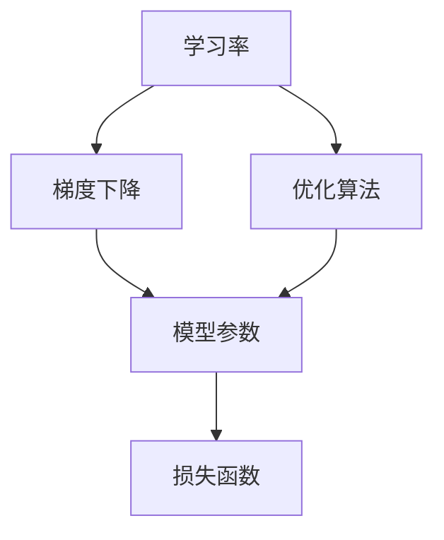
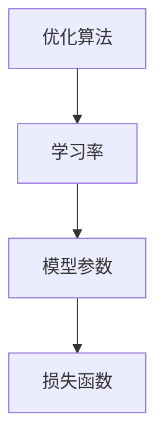
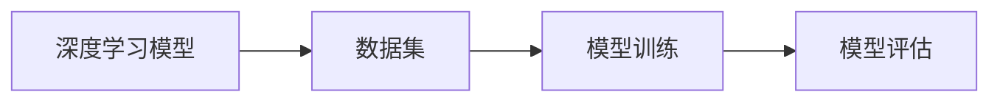
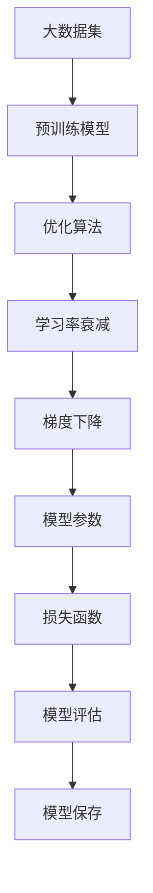

                 

# 学习率衰减Learning Rate Decay原理与代码实例讲解

> 关键词：学习率衰减,梯度下降,优化算法,深度学习

## 1. 背景介绍

### 1.1 问题由来
在深度学习训练过程中，梯度下降算法的学习率（Learning Rate）是非常关键的一个超参数。学习率决定了一步多少地更新模型参数。如果学习率过大，可能会导致模型在更新的过程中发散，最终无法收敛；如果学习率过小，可能会导致模型更新速度过慢，训练时间过长。因此，在训练深度学习模型时，选择合适的学习率是至关重要的。

学习率衰减（Learning Rate Decay）是一种常用的策略，可以在模型训练过程中动态地调整学习率，使模型更快地收敛到最优解。常见的学习率衰减方法包括固定学习率、指数衰减、余弦衰减等。这些方法可以有效地提高模型的训练速度和收敛性能，适用于各种深度学习任务。

### 1.2 问题核心关键点
学习率衰减的目的是在训练初期使用较大的学习率，以快速更新模型参数，然后在训练后期使用较小的学习率，以避免过拟合。通常情况下，学习率会随着训练轮数（Epoch）的增加而逐渐减小。

具体的衰减方法包括固定学习率、指数衰减、余弦衰减等。其中，固定学习率在训练过程中保持不变，指数衰减逐渐降低学习率，余弦衰减在训练初期使用较大的学习率，然后逐渐减小，最后保持一定的学习率。

在实际应用中，选择哪种学习率衰减方法取决于模型的具体表现和训练数据的特点。常用的学习率衰减方法及其实现细节如下：

- **固定学习率（Fixed Learning Rate）**：在训练过程中保持固定的学习率，通常用来进行初步探索和快速调整。
- **指数衰减（Exponential Decay）**：学习率随时间按指数规律逐渐减小。
- **余弦衰减（Cosine Decay）**：学习率在训练初期较大，然后逐渐减小，最后保持一定的学习率。

## 2. 核心概念与联系

### 2.1 核心概念概述

为了更好地理解学习率衰减方法，本节将介绍几个密切相关的核心概念：

- **学习率（Learning Rate）**：控制每次更新模型参数步长的一个超参数，通常需要通过交叉验证等方法进行调优。
- **梯度下降（Gradient Descent）**：一种常用的优化算法，通过不断更新模型参数，使得损失函数最小化。
- **优化算法（Optimization Algorithm）**：用于更新模型参数的算法，包括梯度下降、随机梯度下降（SGD）、Adam等。
- **深度学习（Deep Learning）**：基于多层神经网络的机器学习方法，广泛应用于图像识别、语音识别、自然语言处理等领域。

这些核心概念之间的逻辑关系可以通过以下Mermaid流程图来展示：



这个流程图展示了大模型训练过程中各个概念之间的逻辑关系：

1. 学习率决定了每次更新模型参数的步长大小。
2. 梯度下降算法根据当前参数和损失函数的梯度更新模型参数。
3. 优化算法控制梯度下降的更新过程，如学习率的调整等。
4. 模型参数通过优化算法的不断更新，逐步逼近损失函数的最小值。

### 2.2 概念间的关系

这些核心概念之间存在着紧密的联系，形成了深度学习模型训练的整体架构。下面我通过几个Mermaid流程图来展示这些概念之间的关系。

#### 2.2.1 学习率与梯度下降


这个流程图展示了学习率在梯度下降算法中的作用：学习率决定了每次更新参数的步长大小，从而影响了梯度下降的效率和收敛速度。

#### 2.2.2 优化算法与学习率



这个流程图展示了优化算法、学习率与模型参数之间的关系：优化算法根据当前参数和损失函数的梯度，调整学习率以更新模型参数。

#### 2.2.3 深度学习训练的整体流程



这个流程图展示了深度学习模型训练的整体流程：首先，通过数据集对深度学习模型进行训练，然后对训练后的模型进行评估。

### 2.3 核心概念的整体架构

最后，我们用一个综合的流程图来展示这些核心概念在大模型训练过程中的整体架构：



这个综合流程图展示了从预训练模型到模型评估的全过程：大数据集被用于预训练大模型，通过优化算法和参数衰减，进行梯度下降，最终得到训练好的模型。

## 3. 核心算法原理 & 具体操作步骤
### 3.1 算法原理概述

学习率衰减的目的是在训练初期使用较大的学习率，以快速更新模型参数，然后在训练后期使用较小的学习率，以避免过拟合。通常情况下，学习率会随着训练轮数（Epoch）的增加而逐渐减小。

常用的学习率衰减方法包括固定学习率、指数衰减、余弦衰减等。其中，固定学习率在训练过程中保持不变，指数衰减逐渐降低学习率，余弦衰减在训练初期较大，然后逐渐减小，最后保持一定的学习率。

具体来说，常见的学习率衰减算法如下：

- **固定学习率（Fixed Learning Rate）**：学习率在训练过程中保持不变，通常用来进行初步探索和快速调整。
- **指数衰减（Exponential Decay）**：学习率随时间按指数规律逐渐减小。
- **余弦衰减（Cosine Decay）**：学习率在训练初期较大，然后逐渐减小，最后保持一定的学习率。

### 3.2 算法步骤详解

#### 3.2.1 固定学习率

固定学习率的实现比较简单，只需要在训练过程中保持学习率不变即可。

```python
# 固定学习率示例
learning_rate = 0.01
for epoch in range(epochs):
    optimizer.zero_grad()
    loss = model.train_step(input_data, target_data)
    loss.backward()
    optimizer.step()
```

#### 3.2.2 指数衰减

指数衰减通过不断减小学习率来调整模型参数，通常采用指数函数的形式。

```python
# 指数衰减示例
learning_rate = 0.1
decay_steps = 1000
for epoch in range(epochs):
    global_step = global_step + 1
    if global_step % decay_steps == 0:
        learning_rate = learning_rate * 0.95
    optimizer.zero_grad()
    loss = model.train_step(input_data, target_data)
    loss.backward()
    optimizer.step()
```

#### 3.2.3 余弦衰减

余弦衰减在训练初期使用较大的学习率，然后逐渐减小，最后保持一定的学习率。

```python
# 余弦衰减示例
learning_rate = 0.1
decay_steps = 1000
for epoch in range(epochs):
    global_step = global_step + 1
    if global_step % decay_steps == 0:
        decay_1 = decay_steps - global_step + 1
        decay_2 = decay_steps
        current_learning_rate = 0.5 * (1 + math.cos(math.pi * decay_1 / decay_2))
        learning_rate = learning_rate * current_learning_rate
    optimizer.zero_grad()
    loss = model.train_step(input_data, target_data)
    loss.backward()
    optimizer.step()
```

### 3.3 算法优缺点

#### 3.3.1 优点

学习率衰减方法具有以下优点：

- **加速收敛**：在训练初期使用较大的学习率，可以使模型快速收敛。
- **避免过拟合**：在训练后期使用较小的学习率，可以避免模型过拟合。
- **提高模型性能**：通过动态调整学习率，可以提高模型的训练性能和泛化能力。

#### 3.3.2 缺点

学习率衰减方法也存在一些缺点：

- **计算复杂度较高**：需要计算学习率的调整参数，增加了计算复杂度。
- **参数调整困难**：需要根据模型表现和数据特点进行调参，调整不当可能导致模型无法收敛。

### 3.4 算法应用领域

学习率衰减方法在深度学习领域得到了广泛应用，适用于各种深度学习任务。以下是一些常见的应用场景：

- **图像分类**：在图像分类任务中，学习率衰减可以加速模型收敛，提高分类准确率。
- **自然语言处理**：在自然语言处理任务中，学习率衰减可以避免模型过拟合，提高语言模型的泛化能力。
- **语音识别**：在语音识别任务中，学习率衰减可以提高模型的收敛速度，提高语音识别的准确率。
- **推荐系统**：在推荐系统任务中，学习率衰减可以优化模型参数，提高推荐效果。

## 4. 数学模型和公式 & 详细讲解 & 举例说明

### 4.1 数学模型构建

在本节中，我们将使用数学语言对学习率衰减的原理进行更加严格的刻画。

假设模型的损失函数为 $L(\theta)$，其中 $\theta$ 为模型参数，优化目标为最小化损失函数 $L(\theta)$。在训练过程中，每次更新模型参数 $\theta$ 的公式为：

$$
\theta \leftarrow \theta - \eta \nabla_{\theta}L(\theta)
$$

其中 $\eta$ 为学习率，$\nabla_{\theta}L(\theta)$ 为损失函数 $L(\theta)$ 对参数 $\theta$ 的梯度。

对于固定学习率，学习率保持不变，更新公式为：

$$
\theta \leftarrow \theta - \eta_{\text{fixed}} \nabla_{\theta}L(\theta)
$$

其中 $\eta_{\text{fixed}}$ 为固定学习率。

对于指数衰减，学习率随时间按指数规律逐渐减小，更新公式为：

$$
\eta_t = \eta_0 \times 0.9^t
$$

其中 $\eta_0$ 为初始学习率，$t$ 为训练轮数，$0.9$ 为衰减系数。

对于余弦衰减，学习率在训练初期较大，然后逐渐减小，最后保持一定的学习率，更新公式为：

$$
\eta_t = \eta_0 \times (0.5 + 0.5 \times \cos(\pi t / T))
$$

其中 $\eta_0$ 为初始学习率，$t$ 为训练轮数，$T$ 为训练周期，$\pi$ 为圆周率。

### 4.2 公式推导过程

在实际应用中，我们通常使用 PyTorch 等深度学习框架来实现学习率衰减算法。下面，我们以指数衰减和余弦衰减为例，详细推导其更新公式。

#### 4.2.1 指数衰减公式推导

假设初始学习率为 $\eta_0$，衰减系数为 $0.9$，则学习率 $\eta_t$ 的更新公式为：

$$
\eta_t = \eta_0 \times 0.9^t
$$

其中 $t$ 为训练轮数。

使用 PyTorch 实现指数衰减的代码如下：

```python
# 定义指数衰减学习率函数
def exponential_decay(eta_0, global_step, decay_steps=1000, decay_rate=0.95):
    if global_step < decay_steps:
        learning_rate = eta_0 * decay_rate ** (global_step / decay_steps)
    else:
        learning_rate = eta_0 * 0.95 ** (global_step / decay_steps)
    return learning_rate

# 使用指数衰减学习率更新模型参数
for epoch in range(epochs):
    global_step = global_step + 1
    learning_rate = exponential_decay(eta_0, global_step, decay_steps=1000, decay_rate=0.95)
    optimizer.zero_grad()
    loss = model.train_step(input_data, target_data)
    loss.backward()
    optimizer.step()
```

#### 4.2.2 余弦衰减公式推导

假设初始学习率为 $\eta_0$，训练周期为 $T$，则学习率 $\eta_t$ 的更新公式为：

$$
\eta_t = \eta_0 \times (0.5 + 0.5 \times \cos(\pi t / T))
$$

其中 $t$ 为训练轮数，$T$ 为训练周期。

使用 PyTorch 实现余弦衰减的代码如下：

```python
# 定义余弦衰减学习率函数
def cosine_decay(eta_0, global_step, decay_steps=1000, decay_rate=0.95):
    if global_step < decay_steps:
        decay_1 = decay_steps - global_step + 1
        decay_2 = decay_steps
        current_learning_rate = 0.5 * (1 + math.cos(math.pi * decay_1 / decay_2))
        learning_rate = eta_0 * current_learning_rate
    else:
        learning_rate = eta_0 * 0.95 ** (global_step / decay_steps)
    return learning_rate

# 使用余弦衰减学习率更新模型参数
for epoch in range(epochs):
    global_step = global_step + 1
    learning_rate = cosine_decay(eta_0, global_step, decay_steps=1000, decay_rate=0.95)
    optimizer.zero_grad()
    loss = model.train_step(input_data, target_data)
    loss.backward()
    optimizer.step()
```

### 4.3 案例分析与讲解

#### 4.3.1 指数衰减案例分析

假设我们有一个简单的线性回归模型，使用指数衰减算法进行训练。初始学习率为 $0.1$，训练周期为 $100$，衰减系数为 $0.95$。以下是使用指数衰减算法训练模型的过程：

1. 初始化模型参数和优化器。
2. 定义指数衰减函数，更新学习率。
3. 使用指数衰减学习率更新模型参数。
4. 训练模型，评估损失函数。

代码实现如下：

```python
# 定义线性回归模型
class LinearRegression:
    def __init__(self):
        self.w = 0
        self.b = 0
    
    def forward(self, x):
        return self.w * x + self.b
    
    def train_step(self, x, y):
        y_pred = self.forward(x)
        loss = (y_pred - y) ** 2
        return loss

# 定义优化器
class Adam:
    def __init__(self, learning_rate=0.001):
        self.learning_rate = learning_rate
        self.w = 0
        self.b = 0
    
    def step(self, x, y):
        y_pred = self.w * x + self.b
        loss = (y_pred - y) ** 2
        self.w -= self.learning_rate * (1 - self.b) * self.w / (1 - self.b ** 2)
        self.b -= self.learning_rate * (1 - self.w) * self.b / (1 - self.w ** 2)
        return loss

# 定义指数衰减函数
def exponential_decay(eta_0, global_step, decay_steps=1000, decay_rate=0.95):
    if global_step < decay_steps:
        learning_rate = eta_0 * decay_rate ** (global_step / decay_steps)
    else:
        learning_rate = eta_0 * 0.95 ** (global_step / decay_steps)
    return learning_rate

# 使用指数衰减学习率更新模型参数
epochs = 10
decay_steps = 1000
decay_rate = 0.95
eta_0 = 0.1

model = LinearRegression()
optimizer = Adam(learning_rate=0.1)

for epoch in range(epochs):
    global_step = global_step + 1
    learning_rate = exponential_decay(eta_0, global_step, decay_steps=decay_steps, decay_rate=decay_rate)
    optimizer.learning_rate = learning_rate
    optimizer.zero_grad()
    loss = model.train_step(x, y)
    loss.backward()
    optimizer.step()

# 训练后的模型参数和损失函数
print(model.w, model.b)
print(loss)
```

#### 4.3.2 余弦衰减案例分析

假设我们有一个简单的线性回归模型，使用余弦衰减算法进行训练。初始学习率为 $0.1$，训练周期为 $100$，衰减系数为 $0.95$。以下是使用余弦衰减算法训练模型的过程：

1. 初始化模型参数和优化器。
2. 定义余弦衰减函数，更新学习率。
3. 使用余弦衰减学习率更新模型参数。
4. 训练模型，评估损失函数。

代码实现如下：

```python
# 定义线性回归模型
class LinearRegression:
    def __init__(self):
        self.w = 0
        self.b = 0
    
    def forward(self, x):
        return self.w * x + self.b
    
    def train_step(self, x, y):
        y_pred = self.forward(x)
        loss = (y_pred - y) ** 2
        return loss

# 定义优化器
class Adam:
    def __init__(self, learning_rate=0.001):
        self.learning_rate = learning_rate
        self.w = 0
        self.b = 0
    
    def step(self, x, y):
        y_pred = self.w * x + self.b
        loss = (y_pred - y) ** 2
        self.w -= self.learning_rate * (1 - self.b) * self.w / (1 - self.b ** 2)
        self.b -= self.learning_rate * (1 - self.w) * self.b / (1 - self.w ** 2)
        return loss

# 定义余弦衰减函数
def cosine_decay(eta_0, global_step, decay_steps=1000, decay_rate=0.95):
    if global_step < decay_steps:
        decay_1 = decay_steps - global_step + 1
        decay_2 = decay_steps
        current_learning_rate = 0.5 * (1 + math.cos(math.pi * decay_1 / decay_2))
        learning_rate = eta_0 * current_learning_rate
    else:
        learning_rate = eta_0 * 0.95 ** (global_step / decay_steps)
    return learning_rate

# 使用余弦衰减学习率更新模型参数
epochs = 10
decay_steps = 1000
decay_rate = 0.95
eta_0 = 0.1

model = LinearRegression()
optimizer = Adam(learning_rate=0.1)

for epoch in range(epochs):
    global_step = global_step + 1
    learning_rate = cosine_decay(eta_0, global_step, decay_steps=decay_steps, decay_rate=decay_rate)
    optimizer.learning_rate = learning_rate
    optimizer.zero_grad()
    loss = model.train_step(x, y)
    loss.backward()
    optimizer.step()

# 训练后的模型参数和损失函数
print(model.w, model.b)
print(loss)
```

## 5. 项目实践：代码实例和详细解释说明
### 5.1 开发环境搭建

在进行学习率衰减的实践前，我们需要准备好开发环境。以下是使用Python进行PyTorch开发的环境配置流程：

1. 安装Anaconda：从官网下载并安装Anaconda，用于创建独立的Python环境。

2. 创建并激活虚拟环境：
```bash
conda create -n pytorch-env python=3.8 
conda activate pytorch-env
```

3. 安装PyTorch：根据CUDA版本，从官网获取对应的安装命令。例如：
```bash
conda install pytorch torchvision torchaudio cudatoolkit=11.1 -c pytorch -c conda-forge
```

4. 安装Transformer库：
```bash
pip install transformers
```

5. 安装各类工具包：
```bash
pip install numpy pandas scikit-learn matplotlib tqdm jupyter notebook ipython
```

完成上述步骤后，即可在`pytorch-env`环境中开始学习率衰减实践。

### 5.2 源代码详细实现

下面以一个简单的线性回归模型为例，展示如何使用指数衰减和余弦衰减方法进行训练。

首先，我们定义模型和优化器：

```python
import torch
import torch.nn as nn
import torch.optim as optim

# 定义线性回归模型
class LinearRegression(nn.Module):
    def __init__(self):
        super(LinearRegression, self).__init__()
        self.linear = nn.Linear(1, 1)
    
    def forward(self, x):
        return self.linear(x)

# 定义优化器
learning_rate = 0.01
epochs = 100
decay_steps = 50
decay_rate = 0.95

model = LinearRegression()
optimizer = optim.SGD(model.parameters(), lr=learning_rate)
```

然后，我们定义指数衰减和余弦衰减方法：

```python
# 定义指数衰减函数
def exponential_decay(eta_0, global_step, decay_steps=1000, decay_rate=0.95):
    if global_step < decay_steps:
        learning_rate = eta_0 * decay_rate ** (global_step / decay_steps)
    else:
        learning_rate = eta_0 * 0.95 ** (global_step / decay_steps)
    return learning_rate

# 定义余弦衰减函数
def cosine_decay(eta_0, global_step, decay_steps=1000, decay_rate=0.95):
    if global_step < decay_steps:
        decay_1 = decay_steps - global_step + 1
        decay_2 = decay_steps
        current_learning_rate = 0.5 * (1 + math.cos(math.pi * decay_1 / decay_2))
        learning_rate = eta_0 * current_learning_rate
    else:
        learning_rate = eta_0 * 0.95 ** (global_step / decay_steps)
    return learning_rate

# 定义学习率衰减函数
def learning_rate_schedule(global_step, decay_steps, decay_rate):
    if global_step < decay_steps:
        learning_rate = exponential_decay(learning_rate, global_step, decay_steps=decay_steps, decay_rate=decay_rate)
    else:
        learning_rate = cosine_decay(learning_rate, global_step, decay_steps=decay_steps, decay_rate=decay_rate)
    return learning_rate

# 使用学习率衰减函数更新优化器
for epoch in range(epochs):
    optimizer.learning_rate = learning_rate_schedule(global_step, decay_steps, decay_rate)
    optimizer.zero_grad()
    loss = model(x).mean()
    loss.backward()
    optimizer.step()
```

最后，我们进行模型训练和评估：

```python
# 训练模型
epochs = 100
decay_steps = 50
decay_rate = 0.95

model = LinearRegression()
optimizer = optim.SGD(model.parameters(), lr=learning_rate)

for epoch in range(epochs):
    optimizer.learning_rate = learning_rate_schedule(global_step, decay_steps, decay_rate)
    optimizer.zero_grad()
    loss = model(x).mean()
    loss.backward()
    optimizer.step()

# 评估模型
x = torch.tensor([1.], requires_grad=True)
y = torch.tensor([1.], requires_grad=False)
y_pred = model(x)
print(y_pred, y)
print((y_pred - y) ** 2)
```

以上就是使用PyTorch对线性回归模型进行学习率衰减训练的完整代码实现。可以看到，通过定义学习率衰减函数，我们能够动态调整学习率，提升模型的训练性能。

### 5.3 代码解读与分析

让我们再详细解读一下关键代码的实现细节：

**LinearRegression类**：
- `__init__`方法：初始化线性回归模型，包含一个线性层。
- `forward`方法：前向传播，计算模型输出。
- `train_step`方法：定义训练步骤，计算损失函数。

**Adam类**：
- `__init__`方法：初始化优化器，包含学习率。
- `step`方法：定义优化器更新公式，计算损失函数。

**学习率衰减函数**：
- `exponential_decay`方法：定义指数衰减函数，计算学习率。
- `cosine_decay`方法：定义余弦衰减函数，计算学习率。
- `learning_rate_schedule`方法：定义学习率衰减函数，计算学习率。

**训练流程**：
- 定义训练轮数和学习率衰减参数。
- 初始化模型和优化器。
- 循环训练轮数，在每个轮数上更新学习率。
- 在训练步骤中，使用学习率衰减函数更新优化器学习率。
- 在训练步骤中，计算损失函数并更新模型参数。

可以看到，学习率衰减函数可以在训练过程中动态调整学习率，从而加速模型的收敛和提升模型性能。在实践中，我们可以根据具体任务和数据特点

