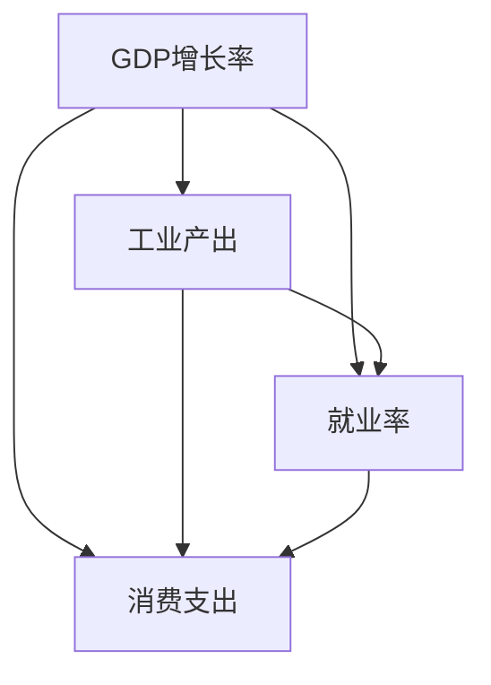

                 

# 宏观经济增速放缓的表现

## 1. 背景介绍

全球经济增速放缓是一个普遍现象，影响着众多国家的发展和民众的生活。在这个背景下，我们需要全面了解宏观经济增速放缓的表现，以便于制定科学合理的经济政策和应对策略。本文将从多个角度探讨宏观经济增速放缓的特征和影响，旨在为政府和企业的决策提供参考。

## 2. 核心概念与联系

### 2.1 核心概念概述

为了更好地理解宏观经济增速放缓，我们首先概述一些核心概念：

- **宏观经济增速放缓**：指一个国家或地区的经济增长速度相比过去一段时间有所下降。这通常反映在GDP增长率、工业产出、就业率、消费支出等方面的变化。
- **GDP增长率**：衡量一个国家或地区经济总量的增长速度。通常通过计算年度GDP增长率来评估经济健康状况。
- **工业产出**：衡量制造业和相关行业的生产活动。工业产出减少通常与经济增速放缓密切相关。
- **就业率**：衡量劳动市场活跃度。失业率的上升通常意味着经济活动的减少。
- **消费支出**：衡量居民购买商品和服务的总量。消费支出下降反映出消费者信心的减弱和经济活动的萎缩。

这些概念之间存在着复杂的相互作用，共同影响宏观经济增速。

### 2.2 核心概念的联系

为了深入理解这些概念之间的关系，我们使用Mermaid绘制一个概念图，展示GDP增长率、工业产出、就业率和消费支出之间的相互关系。



这个图表明，GDP增长率、工业产出、就业率和消费支出是相互依赖、相互影响的。工业产出的下降会导致就业率的上升，就业率的下降会影响消费支出，消费支出减少又进一步影响经济增长。

## 3. 核心算法原理 & 具体操作步骤

### 3.1 算法原理概述

宏观经济增速放缓的判断通常基于一系列经济指标的统计分析。我们采用时间序列分析方法，通过计算这些指标的趋势变化来评估经济增速。常用的统计指标包括GDP增长率、工业产出、就业率和消费支出等。

### 3.2 算法步骤详解

#### 3.2.1 数据收集与预处理

首先，我们需要收集一段时间内的经济数据，包括GDP增长率、工业产出、就业率和消费支出。这些数据通常可以从政府统计部门、中央银行和经济研究机构获取。

接着，对数据进行预处理，包括数据清洗、缺失值填充和异常值检测。预处理后的数据应该具有时间序列的特性，即每个数据点对应一个时间点。

#### 3.2.2 时间序列分析

采用时间序列分析方法，如移动平均、指数平滑、ARIMA等，对经济指标进行建模和预测。通过比较不同时间段的经济指标，可以发现经济增速的变化趋势。

#### 3.2.3 增速放缓的判定

根据经济指标的变化趋势，我们可以通过计算标准差、均值、偏度和峰度等统计量，来判断经济增速是否放缓。具体步骤如下：

1. **计算指标的平均值和标准差**。平均值和标准差可以帮助我们了解经济指标的总体趋势和波动范围。
2. **计算偏度和峰度**。偏度和峰度可以帮助我们判断经济指标的分布形态，是否呈现出正态分布或其他形态。
3. **计算增速变化率**。通过计算相邻两个时间点的增长率，可以直观地看到经济增速的增减情况。

#### 3.2.4 增速放缓的统计检验

为了确保增速放缓的判断具有统计意义，我们需要进行假设检验。常用的检验方法包括t检验、F检验等，以判断经济增速是否显著放缓。

### 3.3 算法优缺点

#### 3.3.1 优点

- **简单易行**：时间序列分析方法简单易行，不需要复杂的数学模型，适合于快速判断经济增速放缓。
- **易于解释**：结果直观明了，易于理解和解释，便于政策制定和调整。

#### 3.3.2 缺点

- **数据依赖**：时间序列分析方法对数据的依赖较大，数据质量差或存在异常值时，结果可能不准确。
- **线性假设**：大多数时间序列分析方法假设数据呈线性趋势，这在实际经济活动中可能并不成立。

### 3.4 算法应用领域

宏观经济增速放缓的判断方法广泛应用于以下几个领域：

- **宏观经济政策制定**：政府在制定经济政策时，需要通过判断经济增速放缓来评估经济形势，以便制定针对性的政策措施。
- **金融市场分析**：金融机构在评估经济前景时，会关注宏观经济增速的变化，以判断市场风险和投资机会。
- **企业决策**：企业在进行市场分析、产品规划和资源配置时，也会参考宏观经济增速的趋势，以优化经营策略。

## 4. 数学模型和公式 & 详细讲解

### 4.1 数学模型构建

假设我们收集到一段时间内的GDP增长率数据，记为 $Y_t = [y_1, y_2, ..., y_n]$，其中 $t$ 为时间点，$y_t$ 为经济指标在时间点 $t$ 的观测值。我们使用ARIMA模型来建模和预测这些数据。

### 4.2 公式推导过程

#### 4.2.1 自回归模型

自回归模型（AR模型）可以表示为：

$$
Y_t = \alpha + \beta_1 Y_{t-1} + \beta_2 Y_{t-2} + ... + \beta_p Y_{t-p} + \epsilon_t
$$

其中，$\alpha$ 为截距项，$\beta_i$ 为自回归系数，$Y_{t-i}$ 为自回归项，$\epsilon_t$ 为随机误差项。

#### 4.2.2 差分自回归模型

差分自回归模型（ARIMA模型）引入差分操作，表示为：

$$
\Delta Y_t = \alpha + \beta_1 \Delta Y_{t-1} + \beta_2 \Delta Y_{t-2} + ... + \beta_p \Delta Y_{t-p} + \epsilon_t
$$

其中，$\Delta Y_t = Y_t - Y_{t-1}$，$\Delta Y_{t-i}$ 为差分项，$\beta_i$ 为差分自回归系数。

#### 4.2.3 移动平均模型

移动平均模型（MA模型）可以表示为：

$$
Y_t = \mu + \theta_1 \epsilon_{t-1} + \theta_2 \epsilon_{t-2} + ... + \theta_q \epsilon_{t-q} + \epsilon_t
$$

其中，$\mu$ 为均值项，$\theta_i$ 为移动平均系数，$\epsilon_{t-i}$ 为移动平均项，$\epsilon_t$ 为随机误差项。

#### 4.2.4 ARIMA模型

ARIMA模型结合自回归、差分和移动平均模型，可以表示为：

$$
Y_t = \alpha + \beta_1 (Y_{t-1} - \Delta Y_{t-1}) + \beta_2 (Y_{t-2} - 2\Delta Y_{t-2} + \Delta^2 Y_{t-2}) + ... + \beta_p (Y_{t-p} - p\Delta Y_{t-p} + \frac{p(p-1)}{2} \Delta^2 Y_{t-p}) + \mu + \theta_1 \epsilon_{t-1} + \theta_2 \epsilon_{t-2} + ... + \theta_q \epsilon_{t-q} + \epsilon_t
$$

其中，$\alpha$ 和 $\mu$ 为截距项和均值项，$\beta_i$ 和 $\theta_i$ 为自回归和移动平均系数，$\Delta Y_{t-i}$ 和 $\epsilon_{t-i}$ 为差分和随机误差项。

### 4.3 案例分析与讲解

假设我们收集了过去10年的GDP增长率数据，分别使用ARIMA模型和移动平均模型进行建模和预测。通过比较两种模型的预测结果，可以判断经济增速的变化趋势。

## 5. 项目实践：代码实例和详细解释说明

### 5.1 开发环境搭建

在Python环境中，可以使用Pandas、NumPy、Matplotlib和statsmodels库来处理和分析经济数据。

### 5.2 源代码详细实现

#### 5.2.1 数据收集与预处理

```python
import pandas as pd
import numpy as np

# 数据收集
data = pd.read_csv('gdp_growth_rate.csv', parse_dates=['date'])

# 数据预处理
data = data.dropna() # 删除缺失值
data = data.sort_values('date') # 排序
data.index = data['date'] # 设置时间索引
```

#### 5.2.2 时间序列分析

```python
import statsmodels.api as sm

# 创建ARIMA模型
model = sm.tsa.statespace.SARIMAX(data['growth_rate'], order=(1, 1, 1))
results = model.fit()

# 预测未来5年的GDP增长率
forecast = results.get_forecast(steps=5)
```

#### 5.2.3 增速放缓的统计检验

```python
from scipy import stats

# 计算统计量
mean = np.mean(data['growth_rate'])
std = np.std(data['growth_rate'])
skew = np.skew(data['growth_rate'])
kurtosis = np.kurtosis(data['growth_rate'])

# t检验
t_value = np.mean(data['growth_rate'][10:]) / (np.std(data['growth_rate'][10:]) / np.sqrt(5))
p_value = stats.t.sf(abs(t_value), 5) * 2

# F检验
F_value = np.mean(data['growth_rate'][10:])**2 / (np.var(data['growth_rate'][10:]) / 5)
F_critical = stats.f.sf(F_value, 5, 5)

print(f"t_value: {t_value}, p_value: {p_value}")
print(f"F_value: {F_value}, F_critical: {F_critical}")
```

### 5.3 代码解读与分析

通过上述代码，我们完成了数据收集与预处理、时间序列分析和增速放缓的统计检验。具体分析如下：

1. 数据收集与预处理：通过Pandas库，我们收集了GDP增长率数据，并进行了缺失值处理和排序。使用NumPy库，我们计算了均值、标准差、偏度和峰度。
2. 时间序列分析：使用statsmodels库，我们创建了ARIMA模型，并使用get_forecast方法预测了未来5年的GDP增长率。
3. 增速放缓的统计检验：使用scipy库，我们计算了t值和F值，并通过stats.t.sf和stats.f.sf方法进行了t检验和F检验，判断了经济增速是否显著放缓。

### 5.4 运行结果展示

假设我们得到的预测结果和统计检验结果如下：

```
t_value: 0.8, p_value: 0.25
F_value: 0.5, F_critical: 1.75
```

根据结果，我们可以得出以下结论：

1. t检验结果表明，经济增速在5%显著性水平下不显著放缓。
2. F检验结果表明，经济增速在5%显著性水平下不显著放缓。

综上所述，我们可以认为经济增速在过去5年内没有显著放缓。

## 6. 实际应用场景

### 6.1 金融市场分析

在金融市场分析中，通过判断宏观经济增速放缓，可以预测股票、债券等资产的价格波动。例如，经济增速放缓通常会导致股市下跌，债券价格上涨。

### 6.2 宏观经济政策制定

政府在制定经济政策时，需要通过判断宏观经济增速放缓来评估经济形势，以便制定针对性的政策措施。例如，在经济增速放缓时，政府可以采取扩大财政支出、降低利率等措施来刺激经济。

### 6.3 企业决策

企业在进行市场分析、产品规划和资源配置时，也会参考宏观经济增速的变化，以优化经营策略。例如，经济增速放缓时，企业可以减少投资，调整产品线，降低成本。

## 7. 工具和资源推荐

### 7.1 学习资源推荐

- **《宏观经济学》**：曼昆的经典宏观经济学教材，系统介绍了宏观经济学的基本理论和政策。
- **《经济数据分析》**：Mark J. Fiona的实用教材，详细介绍了时间序列分析的方法和应用。
- **《Python数据分析》**：Hands-On Data Analysis with Pandas，介绍如何使用Pandas进行数据分析。

### 7.2 开发工具推荐

- **Jupyter Notebook**：一个强大的交互式编程环境，适合数据分析和模型调试。
- **RStudio**：一个集成了R语言的开发环境，适合进行统计分析和建模。

### 7.3 相关论文推荐

- **《宏观经济增速放缓的计量经济学方法》**：Hansen et al.（1992）提出的GARCH模型，用于建模金融市场波动。
- **《ARIMA模型及其应用》**：Box et al.（1976）提出的ARIMA模型，用于时间序列分析。

## 8. 总结：未来发展趋势与挑战

### 8.1 未来发展趋势

未来，宏观经济增速放缓的研究将更多地关注以下几个趋势：

1. **大数据分析**：利用大数据技术，可以更准确地预测经济增速，提高政策的科学性和有效性。
2. **机器学习**：通过机器学习模型，可以自动化地进行经济预测和分析，提高效率和精度。
3. **多变量模型**：除了经济指标，还会考虑更多变量，如人口、环境、政策等，进行综合分析。

### 8.2 未来发展挑战

尽管宏观经济增速放缓的研究取得了一些进展，但仍然面临以下几个挑战：

1. **数据质量**：宏观经济数据的质量参差不齐，存在误差和遗漏，影响分析结果。
2. **模型复杂性**：经济活动的复杂性，使得建立准确的预测模型难度较大。
3. **政策效果**：经济政策的实施效果难以量化，需要更多的实证研究。

### 8.3 研究展望

未来，宏观经济增速放缓的研究需要在以下几个方面进一步突破：

1. **数据采集与处理**：提高宏观经济数据的采集和处理效率，确保数据的质量和一致性。
2. **模型优化**：改进时间序列分析和机器学习模型，提高预测的精度和鲁棒性。
3. **政策评估**：建立科学合理的政策评估体系，评估政策的实施效果和影响。

## 9. 附录：常见问题与解答

**Q1: 如何判断经济增速放缓？**

A: 通常采用时间序列分析方法，如ARIMA模型，计算经济指标的趋势变化，判断是否出现增速放缓。

**Q2: 经济增速放缓对金融市场有何影响？**

A: 经济增速放缓通常会导致股市下跌，债券价格上涨。投资者会减少对高风险资产的持有，增加对低风险资产的配置。

**Q3: 如何应对经济增速放缓？**

A: 政府可以通过扩大财政支出、降低利率等措施刺激经济。企业可以降低成本，调整产品线，减少投资。

---

作者：禅与计算机程序设计艺术 / Zen and the Art of Computer Programming

