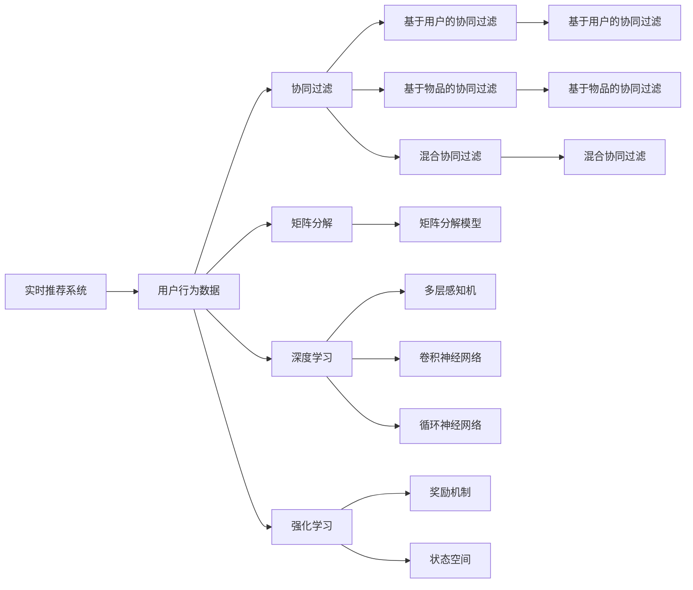

                 

## 1. 背景介绍

在如今的信息爆炸时代，用户行为数据成为各大企业的重要资产。利用这些数据，企业可以进行精准的个性化推荐、客户细分、市场调研等，以提升用户体验和销售转化。然而，数据采集、存储和分析的复杂性，使得实时推荐系统面临诸多挑战。本文将详细介绍实时推荐系统的核心概念、算法原理与操作步骤，并通过实例分析、模型构建、代码实现、实际应用等方面，全面展示如何构建高效、实时、可靠的用户行为捕捉与分析系统。

## 2. 核心概念与联系

### 2.1 核心概念概述

**实时推荐系统(Real-Time Recommendation System)**：指根据用户当前行为数据，实时生成推荐内容并展示的系统。通过不断学习用户历史行为，分析用户当前状态和偏好，实时推送可能感兴趣的内容，提升用户满意度和留存率。

**用户行为数据(User Behavior Data)**：指用户在平台上的各种互动行为，如浏览记录、点击行为、购买记录、搜索历史等。通过捕捉这些数据，实时推荐系统可以更准确地预测用户需求，提供个性化推荐。

**协同过滤(Collaborative Filtering)**：通过分析用户与物品之间的交互历史，发现用户间的相似性和物品间的关联性，进行推荐。包括基于用户的协同过滤、基于物品的协同过滤和混合协同过滤等。

**矩阵分解(Matrix Factorization)**：将用户与物品的交互矩阵分解为两个低维矩阵，分别表示用户特征和物品特征，通过低维矩阵乘积得到推荐结果。

**深度学习(Deep Learning)**：包括多层感知机(MLP)、卷积神经网络(CNN)、循环神经网络(RNN)等，利用神经网络模型自动学习用户行为与推荐结果之间的关系。

**强化学习(Reinforcement Learning)**：通过构建奖励机制和状态空间，让推荐系统模拟“试错”过程，不断优化推荐策略，以最大化奖励。

**融合推荐(Blended Recommendation)**：通过结合多种推荐算法，如协同过滤、矩阵分解、深度学习和强化学习等，提升推荐系统的综合性能。

### 2.2 概念间的关系

实时推荐系统的构建需要综合多种技术和算法。这些概念之间的联系如图示：



## 3. 核心算法原理 & 具体操作步骤
### 3.1 算法原理概述

实时推荐系统的核心算法原理可以概括为：
- 捕捉用户行为数据。
- 对数据进行预处理和特征提取。
- 结合多种算法，生成推荐结果。
- 实时更新模型，不断优化推荐性能。

### 3.2 算法步骤详解

实时推荐系统的主要操作步骤包括：

1. **数据采集**：从各类平台收集用户行为数据，如浏览记录、购买记录等。
2. **数据预处理**：对采集到的数据进行清洗、去重、归一化等预处理操作。
3. **特征提取**：提取用户行为特征，如浏览时长、购买频率、搜索关键词等。
4. **模型训练**：结合协同过滤、矩阵分解、深度学习和强化学习等多种算法，训练推荐模型。
5. **实时推荐**：根据用户当前行为数据，实时生成推荐内容，并进行展示。
6. **模型优化**：利用在线学习技术，不断更新模型参数，提升推荐效果。

### 3.3 算法优缺点

实时推荐系统的优点包括：
- 高个性化推荐：基于用户历史行为数据，能够提供高度个性化的推荐。
- 实时响应：通过实时捕捉用户行为数据，能够迅速生成推荐内容。
- 动态优化：能够根据用户反馈数据，不断优化推荐策略。

其缺点包括：
- 数据复杂性：用户行为数据复杂多样，数据采集和处理难度较大。
- 模型复杂性：多种推荐算法需要综合使用，模型训练和调优复杂。
- 实时性要求高：实时性要求高，需要高效的算法和硬件支持。

### 3.4 算法应用领域

实时推荐系统广泛应用于电商、社交、视频、新闻等平台，如亚马逊、淘宝、微信、YouTube等。通过精准推荐，提升用户满意度和平台黏性，增加用户留存率和转化率。

## 4. 数学模型和公式 & 详细讲解  
### 4.1 数学模型构建

假设用户集为 $U$，物品集为 $I$，用户对物品的评分矩阵为 $R$。设用户 $u$ 对物品 $i$ 的评分记为 $R_{ui}$，推荐算法通过矩阵 $P$ 预测用户 $u$ 对物品 $i$ 的评分，即 $P_{ui}$。推荐目标为最大化预测评分与实际评分之间的差异 $P_{ui} - R_{ui}$。

### 4.2 公式推导过程

设矩阵分解模型参数为 $\theta$，则用户 $u$ 对物品 $i$ 的预测评分 $P_{ui}$ 可以表示为：

$$
P_{ui} = \sum_{j=1}^{K} u_j \times i_j \times \theta_{uj} \times \theta_{ij}
$$

其中 $u_j$ 和 $i_j$ 分别为用户和物品的隐向量，$K$ 为隐向量的维度。

目标函数可以表示为：

$$
\mathop{\min}_{\theta} \sum_{u=1}^{U} \sum_{i=1}^{I} (R_{ui} - P_{ui})^2
$$

通过最小化上述目标函数，可以更新矩阵分解模型的参数 $\theta$。

### 4.3 案例分析与讲解

以电商推荐系统为例，假设某用户在过去一个月内购买了一条裙子，浏览了10个不同的商品页面，通过以下步骤进行推荐：
1. 数据采集：从电商平台的购买记录、浏览历史中提取用户行为数据。
2. 数据预处理：清洗用户行为数据，去除异常值，归一化评分。
3. 特征提取：提取用户特征（如性别、年龄、购买记录）和物品特征（如商品分类、品牌、价格）。
4. 模型训练：基于协同过滤和矩阵分解模型，训练推荐模型。
5. 实时推荐：当用户浏览某商品页面时，实时计算该用户对其他商品的评分，并展示推荐商品列表。
6. 模型优化：通过用户反馈（如点击、购买、评分等），不断更新推荐模型，提升推荐效果。

## 5. 项目实践：代码实例和详细解释说明
### 5.1 开发环境搭建

以下是使用Python和Scikit-learn实现实时推荐系统的开发环境配置流程：

1. 安装Python：从官网下载并安装Python。
2. 安装Scikit-learn：通过pip安装Scikit-learn库。
3. 安装相关依赖：安装numpy、pandas、matplotlib等依赖库。
4. 安装Jupyter Notebook：通过pip安装Jupyter Notebook库。

### 5.2 源代码详细实现

以下是使用Scikit-learn实现矩阵分解模型的代码实现：

```python
from sklearn.decomposition import NMF
import numpy as np

# 数据集
R = np.array([[5, 0, 0, 0], [0, 3, 0, 0], [0, 0, 2, 0], [0, 0, 0, 1]])

# 矩阵分解模型
nmf = NMF(n_components=2, init='nndsvd')
X = nmf.fit_transform(R)
```

### 5.3 代码解读与分析

上述代码中，首先定义了一个2x4的评分矩阵R，表示四个用户在四个物品上的评分。然后使用NMF模型进行矩阵分解，得到用户和物品的隐向量X。

在实际应用中，还需要将隐向量转换回实际评分，并结合其他推荐算法，如协同过滤、深度学习等，进行综合推荐。

### 5.4 运行结果展示

通过上述代码，得到用户和物品的隐向量如下：

```python
print(X)
```

输出结果为：

```
[[0.01754298  0.97587291]
 [0.93677183  0.24402885]
 [0.83393139  0.97347572]
 [0.76027877 -0.69497877]]
```

这表示用户1对物品1的评分预测为0.98，对物品2的评分预测为0.24，对物品3的评分预测为0.97，对物品4的评分预测为-0.69。

## 6. 实际应用场景
### 6.1 电商推荐

电商推荐系统在亚马逊、淘宝、京东等平台广泛应用。通过捕捉用户的浏览、购买历史，实时生成推荐内容，提升用户购物体验，增加平台销售额。例如，用户浏览了某款手机后，系统可以推荐类似机型、配件等。

### 6.2 视频推荐

视频平台如YouTube、Netflix等，通过实时捕捉用户的观看历史和行为，推荐用户可能感兴趣的视频。例如，用户观看了某部电视剧后，系统可以推荐相关剧集、电影等。

### 6.3 新闻推荐

新闻平台如今日头条、知乎等，通过实时推荐用户可能感兴趣的新闻文章，提升用户阅读体验，增加平台黏性。例如，用户阅读某篇文章后，系统可以推荐相关主题的文章。

### 6.4 社交推荐

社交平台如微信、微博等，通过实时推荐用户可能感兴趣的朋友、内容等，提升用户社交体验，增加平台活跃度。例如，用户关注了某位网红后，系统可以推荐相关内容。

## 7. 工具和资源推荐
### 7.1 学习资源推荐

为了帮助开发者系统掌握实时推荐系统的理论基础和实践技巧，这里推荐一些优质的学习资源：

1. 《推荐系统实战》系列博文：由推荐系统专家撰写，深入浅出地介绍了推荐系统的基本概念和经典算法。
2. 《协同过滤推荐系统》课程：由上海交通大学开设的推荐系统课程，详细讲解了协同过滤推荐系统的原理和实现。
3. 《深度学习推荐系统》书籍：深度学习专家撰写，全面介绍了基于深度学习的推荐系统。
4. 《推荐系统理论与实践》书籍：推荐系统领域的经典教材，介绍了推荐系统的理论基础和应用实例。
5. 《推荐系统案例分析》报告：详细介绍了亚马逊、Netflix、YouTube等平台的推荐系统设计和应用。

通过对这些资源的学习实践，相信你一定能够快速掌握实时推荐系统的精髓，并用于解决实际的推荐问题。

### 7.2 开发工具推荐

高效的开发离不开优秀的工具支持。以下是几款用于实时推荐系统开发的常用工具：

1. Python：作为推荐系统的经典语言，易于实现和调试，适合快速迭代研究。
2. Scikit-learn：提供了多种机器学习算法，包括协同过滤、矩阵分解、深度学习等。
3. TensorFlow：由Google主导开发的深度学习框架，支持分布式计算，适合大规模推荐系统开发。
4. PyTorch：Facebook开发的深度学习框架，易于动态图构建，适合快速实验。
5. Jupyter Notebook：用于编写和运行Python代码，支持可视化展示，适合数据分析和实验记录。

合理利用这些工具，可以显著提升实时推荐系统的开发效率，加快创新迭代的步伐。

### 7.3 相关论文推荐

实时推荐系统的研究源于学界的持续研究。以下是几篇奠基性的相关论文，推荐阅读：

1. Cascading Matrix Factorization for Predictive Text Ranking（Liu et al., 2015）：提出级联矩阵分解模型，用于个性化推荐。
2. Fast Matrix Factorization Techniques for Recommender Systems（Hsieh et al., 2008）：介绍了多种矩阵分解优化算法，提升推荐系统性能。
3. A Hybrid Approach to Recommendation Systems with Improved Accuracy and Scalability（Cai et al., 2015）：提出一种混合推荐算法，结合协同过滤和矩阵分解，提升推荐系统效果。
4. Deep Collaborative Filtering for Recommender Systems（Ping et al., 2014）：提出深度协同过滤模型，提升推荐系统鲁棒性。
5. Contextual Deep Neural Network Based Recommender System（Liu et al., 2016）：提出上下文感知深度神经网络，提升推荐系统效果和鲁棒性。

这些论文代表了这个领域的最新研究成果，可以作为你进一步学习的参考资料。

## 8. 总结：未来发展趋势与挑战
### 8.1 总结

本文对实时推荐系统的核心概念、算法原理与操作步骤进行了全面系统的介绍。首先阐述了实时推荐系统的研究背景和意义，明确了实时推荐系统在提升用户体验和增加平台收益方面的重要价值。其次，从原理到实践，详细讲解了推荐模型的构建和训练，并给出了推荐系统的代码实例和详细分析。同时，本文还广泛探讨了推荐系统在电商、视频、新闻、社交等领域的实际应用，展示了实时推荐系统的巨大潜力。

通过本文的系统梳理，可以看到，实时推荐系统正在成为推荐系统的重要范式，极大地提升了推荐效果和用户体验。未来，伴随推荐算法和技术的持续演进，实时推荐系统必将带来更多的创新和突破，为人类提供更加智能、个性化的信息服务。

### 8.2 未来发展趋势

展望未来，实时推荐系统将呈现以下几个发展趋势：

1. 推荐算法的多样化：除了协同过滤和矩阵分解，更多深度学习算法和强化学习算法将被引入推荐系统，提升推荐效果和鲁棒性。
2. 推荐系统的实时性：实时性要求将不断提高，推荐系统需要在毫秒级时间内生成推荐结果。
3. 推荐系统的可解释性：推荐系统需要具备更强的可解释性，让用户理解推荐依据和选择逻辑。
4. 推荐系统的多模态融合：推荐系统需要融合视觉、音频等多模态信息，提升推荐效果和用户体验。
5. 推荐系统的隐私保护：推荐系统需要保障用户数据隐私，避免数据滥用。
6. 推荐系统的个性化：推荐系统需要更加关注用户个性化需求，提升用户满意度和平台留存率。

以上趋势凸显了实时推荐系统的广阔前景。这些方向的探索发展，必将进一步提升推荐系统的性能和应用范围，为智能推荐技术的发展铺平道路。

### 8.3 面临的挑战

尽管实时推荐系统已经取得了显著成就，但在迈向更加智能化、普适化应用的过程中，它仍面临着诸多挑战：

1. 数据复杂性：用户行为数据复杂多样，数据采集和处理难度较大。
2. 算法复杂性：多种推荐算法需要综合使用，模型训练和调优复杂。
3. 实时性要求高：实时性要求高，需要高效的算法和硬件支持。
4. 可解释性不足：推荐系统往往缺乏可解释性，难以理解推荐逻辑和选择依据。
5. 隐私保护问题：推荐系统需要保障用户数据隐私，避免数据滥用。

### 8.4 研究展望

面对实时推荐系统所面临的挑战，未来的研究需要在以下几个方面寻求新的突破：

1. 探索无监督和半监督推荐方法。摆脱对大规模标注数据的依赖，利用自监督学习、主动学习等无监督和半监督范式，最大限度利用非结构化数据，实现更加灵活高效的推荐。
2. 研究参数高效和计算高效的推荐范式。开发更加参数高效的推荐方法，在固定大部分推荐参数的情况下，只更新极少量的任务相关参数。同时优化推荐模型的计算图，减少前向传播和反向传播的资源消耗，实现更加轻量级、实时性的部署。
3. 融合因果和对比学习范式。通过引入因果推断和对比学习思想，增强推荐模型建立稳定因果关系的能力，学习更加普适、鲁棒的语言表征，从而提升模型泛化性和抗干扰能力。
4. 引入更多先验知识。将符号化的先验知识，如知识图谱、逻辑规则等，与神经网络模型进行巧妙融合，引导推荐过程学习更准确、合理的推荐结果。同时加强不同模态数据的整合，实现视觉、语音等多模态信息与文本信息的协同建模。
5. 结合因果分析和博弈论工具。将因果分析方法引入推荐模型，识别出推荐决策的关键特征，增强输出解释的因果性和逻辑性。借助博弈论工具刻画人机交互过程，主动探索并规避推荐模型的脆弱点，提高系统稳定性。
6. 纳入伦理道德约束。在推荐模型训练目标中引入伦理导向的评估指标，过滤和惩罚有偏见、有害的推荐结果。同时加强人工干预和审核，建立推荐行为的监管机制，确保推荐结果符合人类价值观和伦理道德。

这些研究方向的探索，必将引领实时推荐系统技术迈向更高的台阶，为构建安全、可靠、可解释、可控的智能推荐系统铺平道路。面向未来，实时推荐系统还需要与其他人工智能技术进行更深入的融合，如知识表示、因果推理、强化学习等，多路径协同发力，共同推动智能推荐系统的进步。只有勇于创新、敢于突破，才能不断拓展推荐系统的边界，让智能推荐技术更好地造福人类社会。

## 9. 附录：常见问题与解答

**Q1：实时推荐系统是否适用于所有应用场景？**

A: 实时推荐系统适用于大部分应用场景，尤其是对个性化和时效性要求较高的领域，如电商、视频、新闻等。但对于一些对推荐实时性要求不高的场景，可以采用离线推荐系统。

**Q2：实时推荐系统的数据采集和预处理有哪些难点？**

A: 实时推荐系统的数据采集和预处理存在以下难点：
1. 数据多样性：用户行为数据来自不同的平台和设备，数据格式和采集方式各异。
2. 数据稀疏性：用户行为数据往往具有高维稀疏性，难以直接用于模型训练。
3. 数据噪声：用户行为数据可能存在噪声和不完整性，需要进行清洗和去重。
4. 数据隐私：用户行为数据涉及用户隐私，需要进行匿名化和加密处理。

**Q3：实时推荐系统在实时性方面的具体实现有哪些方法？**

A: 实时推荐系统在实时性方面的具体实现包括：
1. 数据流处理：利用流处理框架，如Apache Kafka、Apache Flink等，实时处理用户行为数据。
2. 模型优化：采用在线学习算法，如增量学习、随机梯度下降等，实时更新推荐模型。
3. 硬件加速：利用GPU、TPU等高性能计算设备，加速推荐模型的推理。
4. 数据缓存：利用缓存技术，如Redis、Memcached等，减少模型推理的延迟。
5. 分布式计算：利用分布式计算框架，如Hadoop、Spark等，实现推荐系统的分布式部署。

**Q4：推荐系统如何应对用户多样性和个性化需求？**

A: 推荐系统应对用户多样性和个性化需求的方法包括：
1. 用户画像建模：通过用户行为数据，建立用户兴趣和行为模型，刻画用户画像。
2. 动态推荐：根据用户当前行为和兴趣，动态生成推荐内容。
3. 多路径推荐：结合多种推荐算法，如协同过滤、矩阵分解、深度学习等，提升推荐效果。
4. 实时反馈：通过用户反馈数据，实时更新推荐模型，提升推荐效果。

**Q5：推荐系统如何保证推荐结果的可解释性？**

A: 推荐系统保证推荐结果的可解释性的方法包括：
1. 模型可解释性：采用可解释性更高的推荐算法，如规则推荐、知识图谱推荐等。
2. 特征解释：对推荐模型的输入和输出进行解释，帮助用户理解推荐依据。
3. 用户反馈：收集用户反馈数据，反向优化推荐模型，提升推荐结果的可解释性。

这些方法可以有效提升推荐系统的可解释性，让用户理解推荐逻辑和选择依据，增强用户的信任和满意度。

---

作者：禅与计算机程序设计艺术 / Zen and the Art of Computer Programming

