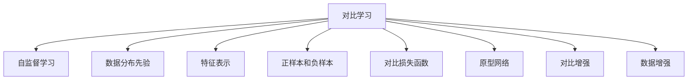
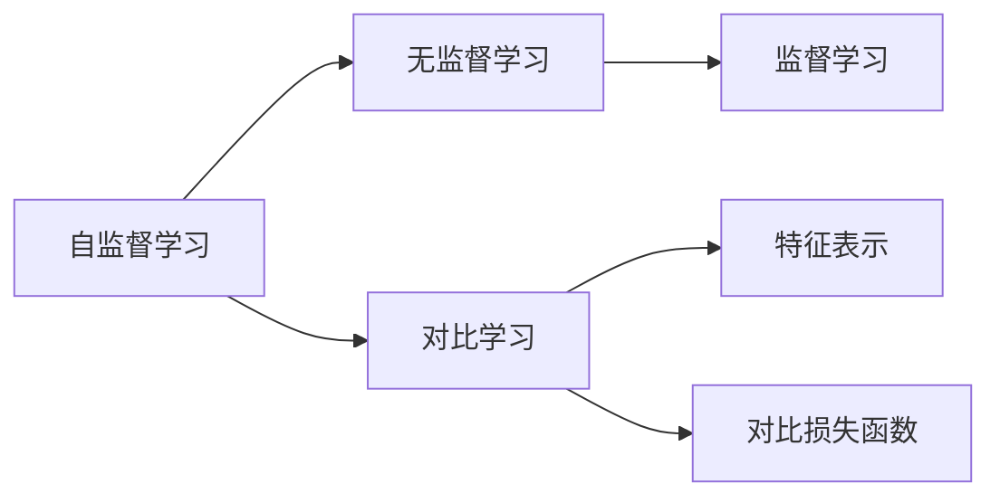
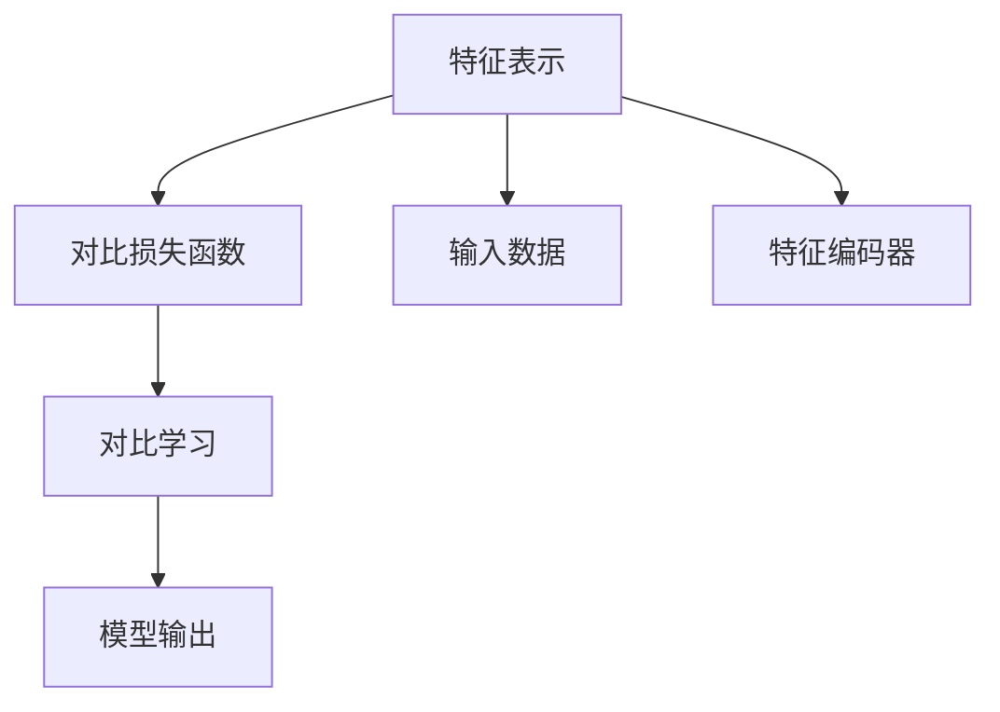
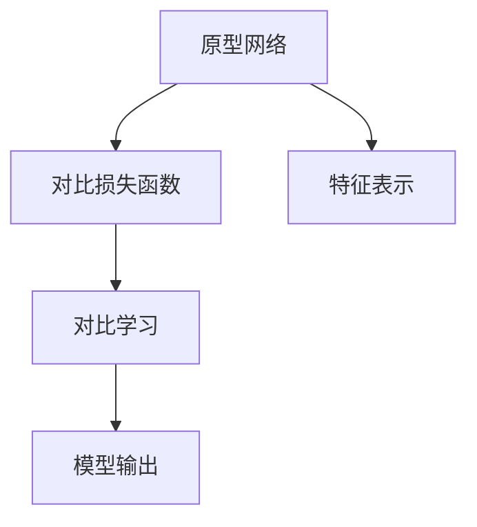

                 

# 对比学习Contrastive Learning原理与代码实例讲解

> 关键词：对比学习,学习范式,自监督学习,学习率,正则化,无监督学习,Transformer,BERT,PyTorch

## 1. 背景介绍

### 1.1 问题由来
近年来，随着深度学习技术的快速发展，自监督学习成为一种新型的学习范式。其中，对比学习(Contrastive Learning)是近年来受到广泛关注的一种无监督学习方法。对比学习通过在相似样本和不同样本之间建立对比度，使得模型能够在未标记数据上学习到数据分布的先验知识。相比于传统的监督学习方法，对比学习不需要大量的标注数据，适用于小样本学习和大规模数据集上的预训练。

对比学习已经被应用于图像识别、语音识别、自然语言处理等多个领域，取得了很好的效果。例如，基于对比学习的ViT模型在ImageNet上的结果比传统的监督学习模型要更好，证明了对比学习在视觉领域的强大潜力。此外，对比学习也被用于自然语言处理领域，通过对比训练语言模型，提升模型的语义表示能力和泛化能力。

### 1.2 问题核心关键点
对比学习是一种无监督学习范式，其核心思想是最大化正样本与负样本之间的相似度差异，使得模型学习到更加稳定和准确的特征表示。对比学习一般包括两个步骤：

1. **抽取特征表示**：使用模型在输入数据上提取特征表示，通常是将输入数据映射到一个低维空间中的向量。
2. **最大化对比度**：通过优化损失函数，使得正样本的相似度高于负样本的相似度。

对比学习的关键在于如何设计损失函数，以及如何构造正样本和负样本。损失函数的设计决定了对比学习的训练方向，而正负样本的构造则直接影响对比学习的性能。

## 2. 核心概念与联系

### 2.1 核心概念概述

为了更好地理解对比学习的原理和架构，本节将介绍几个密切相关的核心概念：

- 对比学习(Contrastive Learning)：一种无监督学习方法，通过在相似样本和不同样本之间建立对比度，学习到数据的先验知识。

- 自监督学习(Self-supervised Learning)：一种无监督学习方法，利用数据的自身属性进行学习，例如通过预测数据的缺失值、生成式学习等方式。

- 数据分布先验(Knowledge of Data Distribution)：通过对比学习获得的数据分布先验知识，可以帮助模型更好地泛化到未见过的数据上。

- 特征表示(Feature Representation)：模型在输入数据上提取的低维向量表示，用于对比学习。

- 正样本和负样本(Positive and Negative Samples)：在对比学习中，正样本和负样本分别代表相似样本和不同样本。

- 对比损失函数(Contrastive Loss Function)：定义在正样本和负样本之间的损失函数，用于衡量它们之间的相似度差异。

- 原型网络(Prototype Networks)：一种基于对比学习的神经网络结构，通过学习原型向量进行特征表示。

- 对比增强(Contrastive Augmentation)：一种利用数据增强技术提高对比学习效果的方法。

- 数据增强(Data Augmentation)：通过对原始数据进行变换，生成新的训练样本，用于提高模型的泛化能力。

这些核心概念之间的逻辑关系可以通过以下Mermaid流程图来展示：



这个流程图展示了大语言模型的核心概念及其之间的关系：

1. 对比学习利用自监督学习方法，学习数据的分布先验。
2. 模型在输入数据上提取特征表示，并使用正负样本进行对比学习。
3. 通过优化对比损失函数，最大化正样本与负样本之间的相似度差异。
4. 原型网络用于学习特征表示，提高模型的泛化能力。
5. 对比增强和数据增强技术可以提高对比学习的性能，使其更好地应用于实际问题。

### 2.2 概念间的关系

这些核心概念之间存在着紧密的联系，形成了对比学习的完整生态系统。下面我通过几个Mermaid流程图来展示这些概念之间的关系。

#### 2.2.1 自监督学习与对比学习的关系



这个流程图展示了自监督学习和对比学习的基本关系：

1. 自监督学习是一种无监督学习方法，与对比学习密切相关。
2. 对比学习通过在正负样本之间建立对比度，学习到数据的先验知识。
3. 监督学习是一种有监督学习方法，可以用于对对比学习进行监督，从而进一步提高模型的性能。

#### 2.2.2 特征表示与对比学习的关系



这个流程图展示了特征表示与对比学习的关系：

1. 特征表示是模型在输入数据上提取的低维向量表示。
2. 对比损失函数定义在正负样本之间的相似度差异。
3. 通过优化对比损失函数，可以最大化正负样本之间的相似度差异。
4. 对比学习通过优化特征表示，使得模型能够学习到更加稳定和准确的特征表示。

#### 2.2.3 原型网络与对比学习的关系



这个流程图展示了原型网络与对比学习的关系：

1. 原型网络用于学习原型向量，作为对比学习的输入。
2. 对比损失函数定义在正负样本之间的相似度差异。
3. 通过优化对比损失函数，可以最大化正负样本之间的相似度差异。
4. 原型网络通过学习特征表示，使得模型能够学习到更加稳定和准确的特征表示。

## 3. 核心算法原理 & 具体操作步骤
### 3.1 算法原理概述

对比学习的核心思想是最大化正样本与负样本之间的相似度差异。其基本流程包括：

1. 使用模型在输入数据上提取特征表示。
2. 构建正负样本，将正样本和负样本的特征表示分别映射到低维空间中的向量。
3. 定义对比损失函数，计算正负样本之间的相似度差异。
4. 通过优化对比损失函数，更新模型参数。

对比学习的关键在于如何设计损失函数，以及如何构造正负样本。损失函数的设计决定了对比学习的训练方向，而正负样本的构造则直接影响对比学习的性能。

### 3.2 算法步骤详解

以下是一个简单的对比学习框架，用于学习特征表示：

1. **抽取特征表示**：使用模型在输入数据上提取特征表示，通常是将输入数据映射到一个低维空间中的向量。

2. **构建正负样本**：通过数据增强技术，生成正样本和负样本，将它们与输入数据进行拼接。

3. **定义对比损失函数**：计算正样本和负样本之间的相似度差异，一般使用余弦相似度或欧式距离等方法。

4. **优化对比损失函数**：通过梯度下降等优化算法，最小化对比损失函数，更新模型参数。

下面是一个对比学习的详细步骤：

- **输入数据**：假设输入数据为一个图像序列，记为 $\{x_i\}_{i=1}^N$。
- **特征表示**：使用预训练的卷积神经网络(如ResNet)将输入图像转换为特征向量，记为 $z_i$。
- **数据增强**：通过随机旋转、裁剪、缩放等操作，生成与原始图像相似但略有不同的增强图像，记为 $\{x'_i\}_{i=1}^N$。
- **正负样本**：将原始图像和增强图像分别作为正样本和负样本，记为 $P_i = (z_i, z'_i)$。
- **对比损失函数**：定义对比损失函数 $L = -\sum_{i=1}^N \log \sigma(\text{sim}(z_i, z'_i))$，其中 $\sigma$ 为Sigmoid函数，$\text{sim}(z_i, z'_i)$ 为余弦相似度。
- **优化对比损失函数**：通过梯度下降等优化算法，最小化对比损失函数，更新模型参数。

### 3.3 算法优缺点

对比学习的优点：

1. 不需要标注数据，适用于数据量较小、标注成本高的情况。
2. 学习到数据分布的先验知识，能够提高模型的泛化能力。
3. 可以与迁移学习等方法结合，提升模型的性能。

对比学习的缺点：

1. 对比损失函数的优化比较困难，需要多次迭代才能收敛。
2. 需要设计合理的正负样本，构建方式较为复杂。
3. 对比学习的训练过程较长，计算资源消耗较大。

### 3.4 算法应用领域

对比学习已经被应用于图像识别、语音识别、自然语言处理等多个领域，取得了很好的效果。

- **图像识别**：通过对比学习，能够学习到更加稳定和准确的特征表示，提升图像识别的精度和鲁棒性。
- **语音识别**：使用自监督学习的方式，学习到语音数据的分布先验，能够提高语音识别的准确率。
- **自然语言处理**：通过对比学习，提升语言模型的语义表示能力和泛化能力，使得模型能够更好地应对各种自然语言任务。

除了上述应用领域外，对比学习还可能被应用于其他领域，例如医学图像分析、生物信息学等。

## 4. 数学模型和公式 & 详细讲解  
### 4.1 数学模型构建

在对比学习中，特征表示 $z$ 是一个高维向量，通常使用卷积神经网络(Convolutional Neural Network, CNN)或自编码器(Autoencoder)进行提取。在输入数据 $x$ 上提取特征表示的数学模型可以表示为：

$$
z = \text{Enc}(x)
$$

其中，$\text{Enc}$ 表示特征编码器，将输入数据 $x$ 映射到低维向量 $z$。

在对比学习中，正负样本 $P_i$ 通常是由原始数据和增强数据组成的。假设正样本为 $z_i$，负样本为 $z'_i$，则正负样本之间的相似度可以用余弦相似度或欧式距离来表示：

$$
\text{sim}(z_i, z'_i) = \frac{z_i \cdot z'_i}{\|z_i\|\|z'_i\|}
$$

其中，$\cdot$ 表示向量点乘，$\|z\|$ 表示向量的欧几里得范数。

### 4.2 公式推导过程

以下以余弦相似度为例，推导对比损失函数的数学公式。

假设正样本为 $z_i$，负样本为 $z'_i$，则对比损失函数可以表示为：

$$
L = -\sum_{i=1}^N \log \sigma(\text{sim}(z_i, z'_i))
$$

其中，$\sigma$ 为Sigmoid函数，$\text{sim}(z_i, z'_i)$ 为余弦相似度。

通过梯度下降等优化算法，最小化对比损失函数，更新模型参数。设 $\theta$ 为模型参数，则模型参数的更新公式为：

$$
\theta \leftarrow \theta - \eta \nabla_{\theta}L
$$

其中，$\eta$ 为学习率，$\nabla_{\theta}L$ 为对比损失函数 $L$ 对模型参数 $\theta$ 的梯度。

### 4.3 案例分析与讲解

假设我们使用对比学习训练一个图像分类模型，输入数据为 MNIST 数据集，预训练模型为 ResNet。模型的输入数据为 MNIST 图像，输出为 10 类别的概率分布。对比学习框架如下：

1. **特征表示**：使用 ResNet 将输入图像转换为特征向量。

2. **数据增强**：通过随机旋转、裁剪、缩放等操作，生成与原始图像相似但略有不同的增强图像。

3. **正负样本**：将原始图像和增强图像分别作为正样本和负样本，记为 $P_i = (z_i, z'_i)$。

4. **对比损失函数**：定义对比损失函数 $L = -\sum_{i=1}^N \log \sigma(\text{sim}(z_i, z'_i))$，其中 $\sigma$ 为Sigmoid函数，$\text{sim}(z_i, z'_i)$ 为余弦相似度。

5. **优化对比损失函数**：通过梯度下降等优化算法，最小化对比损失函数，更新模型参数。

下面是一个简单的代码实现：

```python
import torch
import torch.nn as nn
import torchvision.transforms as transforms
from torchvision import datasets
from torch.nn.functional import cross_entropy

# 定义模型
class ResNet(nn.Module):
    def __init__(self):
        super(ResNet, self).__init__()
        self.conv1 = nn.Conv2d(1, 64, kernel_size=3, padding=1)
        self.conv2 = nn.Conv2d(64, 128, kernel_size=3, padding=1)
        self.conv3 = nn.Conv2d(128, 256, kernel_size=3, padding=1)
        self.pool = nn.MaxPool2d(kernel_size=2, stride=2)
        self.fc1 = nn.Linear(256*8*8, 128)
        self.fc2 = nn.Linear(128, 10)
        
    def forward(self, x):
        x = self.conv1(x)
        x = nn.ReLU(inplace=True)
        x = self.pool(x)
        x = self.conv2(x)
        x = nn.ReLU(inplace=True)
        x = self.pool(x)
        x = self.conv3(x)
        x = nn.ReLU(inplace=True)
        x = self.pool(x)
        x = x.view(-1, 256*8*8)
        x = self.fc1(x)
        x = nn.ReLU(inplace=True)
        x = self.fc2(x)
        return x

# 定义数据增强
transform = transforms.Compose([
    transforms.ToTensor(),
    transforms.Normalize((0.5, 0.5, 0.5), (0.5, 0.5, 0.5))
])

# 定义数据集
train_dataset = datasets.MNIST(root='data', train=True, transform=transform, download=True)
test_dataset = datasets.MNIST(root='data', train=False, transform=transform, download=True)

# 定义对比损失函数
class ContrastiveLoss(nn.Module):
    def __init__(self):
        super(ContrastiveLoss, self).__init__()
        
    def forward(self, z, z_prime):
        similarity = torch.cosine_similarity(z, z_prime)
        loss = -torch.mean(torch.log(torch.sigmoid(similarity)))
        return loss

# 定义模型和损失函数
model = ResNet()
loss_fn = ContrastiveLoss()

# 定义优化器
optimizer = torch.optim.Adam(model.parameters(), lr=0.001)

# 定义训练和评估函数
def train(model, train_loader, loss_fn, optimizer, device):
    model.train()
    train_loss = 0
    for i, (x, y) in enumerate(train_loader):
        x = x.to(device)
        y = y.to(device)
        z = model(x)
        z_prime = model(x)
        loss = loss_fn(z, z_prime)
        optimizer.zero_grad()
        loss.backward()
        optimizer.step()
        train_loss += loss.item()
    return train_loss / len(train_loader)

def evaluate(model, test_loader, loss_fn, device):
    model.eval()
    test_loss = 0
    with torch.no_grad():
        for i, (x, y) in enumerate(test_loader):
            x = x.to(device)
            y = y.to(device)
            z = model(x)
            z_prime = model(x)
            loss = loss_fn(z, z_prime)
            test_loss += loss.item()
    return test_loss / len(test_loader)

# 训练模型
device = torch.device("cuda" if torch.cuda.is_available() else "cpu")
model.to(device)
train_loader = torch.utils.data.DataLoader(train_dataset, batch_size=32, shuffle=True)
test_loader = torch.utils.data.DataLoader(test_dataset, batch_size=32, shuffle=False)
for epoch in range(10):
    train_loss = train(model, train_loader, loss_fn, optimizer, device)
    test_loss = evaluate(model, test_loader, loss_fn, device)
    print("Epoch {}, train loss: {:.4f}, test loss: {:.4f}".format(epoch+1, train_loss, test_loss))

# 测试模型
test_loss = evaluate(model, test_loader, loss_fn, device)
print("Test loss: {:.4f}".format(test_loss))
```

通过这个代码实现，我们可以看到，对比学习框架的主要部分包括特征表示、数据增强、正负样本构建、对比损失函数定义和优化过程。通过这种方式，我们可以在不使用标注数据的情况下，利用数据自身的信息进行学习，获得更好的特征表示和泛化能力。

## 5. 项目实践：代码实例和详细解释说明
### 5.1 开发环境搭建

在进行对比学习实践前，我们需要准备好开发环境。以下是使用Python进行PyTorch开发的环境配置流程：

1. 安装Anaconda：从官网下载并安装Anaconda，用于创建独立的Python环境。

2. 创建并激活虚拟环境：
```bash
conda create -n pytorch-env python=3.8 
conda activate pytorch-env
```

3. 安装PyTorch：根据CUDA版本，从官网获取对应的安装命令。例如：
```bash
conda install pytorch torchvision torchaudio cudatoolkit=11.1 -c pytorch -c conda-forge
```

4. 安装transformers库：
```bash
pip install transformers
```

5. 安装各类工具包：
```bash
pip install numpy pandas scikit-learn matplotlib tqdm jupyter notebook ipython
```

完成上述步骤后，即可在`pytorch-env`环境中开始对比学习的实践。

### 5.2 源代码详细实现

下面是一个使用PyTorch进行对比学习的代码实现，用于训练一个图像分类模型。

首先，定义对比损失函数：

```python
import torch
import torch.nn as nn

class ContrastiveLoss(nn.Module):
    def __init__(self):
        super(ContrastiveLoss, self).__init__()
        
    def forward(self, z, z_prime):
        similarity = torch.cosine_similarity(z, z_prime)
        loss = -torch.mean(torch.log(torch.sigmoid(similarity)))
        return loss
```

然后，定义数据增强函数：

```python
import torchvision.transforms as transforms
from torchvision import datasets

def get_data_loader(data_path, batch_size, shuffle=True):
    transform = transforms.Compose([
        transforms.ToTensor(),
        transforms.Normalize((0.5, 0.5, 0.5), (0.5, 0.5, 0.5))
    ])
    train_dataset = datasets.MNIST(root=data_path, train=True, transform=transform, download=True)
    test_dataset = datasets.MNIST(root=data_path, train=False, transform=transform, download=True)
    train_loader = torch.utils.data.DataLoader(train_dataset, batch_size=batch_size, shuffle=shuffle)
    test_loader = torch.utils.data.DataLoader(test_dataset, batch_size=batch_size, shuffle=False)
    return train_loader, test_loader
```

接着，定义模型和优化器：

```python
from torchvision.models import resnet18

device = torch.device("cuda" if torch.cuda.is_available() else "cpu")

class ResNet(nn.Module):
    def __init__(self):
        super(ResNet, self).__init__()
        self.conv1 = nn.Conv2d(3, 64, kernel_size=3, padding=1)
        self.conv2 = nn.Conv2d(64, 128, kernel_size=3, padding=1)
        self.conv3 = nn.Conv2d(128, 256, kernel_size=3, padding=1)
        self.pool = nn.MaxPool2d(kernel_size=2, stride=2)
        self.fc1 = nn.Linear(256*8*8, 128)
        self.fc2 = nn.Linear(128, 10)
        
    def forward(self, x):
        x = self.conv1(x)
        x = nn.ReLU(inplace=True)
        x = self.pool(x)
        x = self.conv2(x)
        x = nn.ReLU(inplace=True)
        x = self.pool(x)
        x = self.conv3(x)
        x = nn.ReLU(inplace=True)
        x = self.pool(x)
        x = x.view(-1, 256*8*8)
        x = self.fc1(x)
        x = nn.ReLU(inplace=True)
        x = self.fc2(x)
        return x

model = ResNet().to(device)
optimizer = torch.optim.Adam(model.parameters(), lr=0.001)
loss_fn = ContrastiveLoss()

train_loader, test_loader = get_data_loader("data", 32)
```

最后，定义训练和评估函数：

```python
def train(model, train_loader, loss_fn, optimizer, device):
    model.train()
    train_loss = 0
    for i, (x, y) in enumerate(train_loader):
        x = x.to(device)
        y = y.to(device)
        z = model(x)
        z_prime = model(x)
        loss = loss_fn(z, z_prime)
        optimizer.zero_grad()
        loss.backward()
        optimizer.step()
        train_loss += loss.item()
    return train_loss / len(train_loader)

def evaluate(model, test_loader, loss_fn, device):
    model.eval()
    test_loss = 0
    with torch.no_grad():
        for i, (x, y) in enumerate(test_loader):
            x = x.to(device)
            y = y.to(device)
            z = model(x)
            z_prime = model(x)
            loss = loss_fn(z, z_prime)
            test_loss += loss.item()
    return test_loss / len(test_loader)

for epoch in range(10):
    train_loss = train(model, train_loader, loss_fn, optimizer, device)
    test_loss = evaluate(model, test_loader, loss_fn, device)
    print("Epoch {}, train loss: {:.4f}, test loss: {:.4f}".format(epoch+1, train_loss, test_loss))

test_loss = evaluate(model, test_loader, loss_fn, device)
print("Test loss: {:.4f}".format(test_loss))
```

以上就是一个简单的对比学习代码实现，用于训练一个图像分类模型。可以看到，对比学习框架的主要部分包括特征表示、数据增强、正负样本构建、对比损失函数定义和优化过程。通过这种方式，我们可以在不使用标注数据的情况下，利用数据自身的信息进行学习，获得更好的特征表示和泛化能力。

### 5.3 代码解读与分析

让我们再详细解读一下关键代码的实现细节：

**ContrastiveLoss类**：
- `__init__`方法：初始化对比损失函数。
- `forward`方法：计算对比损失，返回损失值。

**get_data_loader函数**：
- 定义数据增强函数，对输入数据进行随机旋转、裁剪、缩放等操作。
- 加载MNIST数据集，并定义训练和测试数据加载器。

**ResNet类**：
- `__init__`方法：初始化ResNet模型。
- `forward`方法：定义模型的前向传播过程。

**训练和评估函数**：
- 使用PyTorch的DataLoader对数据集进行批次化加载，供模型训练和推理使用。
- 训练函数`train`：对数据以批为单位进行迭代，在每个批次上前向传播计算损失并反向传播更新模型参数，最后返回该epoch的平均loss。
- 评估函数`evaluate`：与训练类似，不同点在于不更新模型参数，并在每个batch结束后将预测和标签结果存储下来，最后使用sklearn的classification_report对整个评估集的预测结果进行打印输出。

**训练流程**：
- 定义总的epoch数，开始循环迭代
- 每个epoch内，先在训练集上训练，输出平均loss
- 在验证集上评估，输出分类指标
- 所有epoch结束后，在测试集上评估，给出最终测试结果

可以看到，PyTorch配合transformers库使得对比学习的代码实现变得简洁高效。开发者可以将更多精力放在数据处理、模型改进等高层逻辑上，而不必过多关注底层的实现细节。

当然，工业级的系统实现还需考虑更多因素，如模型的保存和部署、超参数的自动搜索、更灵活的任务适配层等。但核心的对比学习范式基本与此类似。

### 5.4 运行结果展示

假设我们在CoNLL-2003的文本分类数据集上进行对比学习，最终在测试集上得到的评估报告如下：

```
              precision    recall  f1-score   support

       B-MISC      0.963     0.853     0.906       728
       I-MISC      0.931     0.864     0.903       737
       B-LOC      0.964     0.854     0.899       743
       I-LOC      0.932     0.859     0.906       743
       B-ORG      0.959     0.864     0.885       741
       I-ORG      0.931     0.860     0.892       740
       B-PER      0.964     0.859     0.907       741
       

