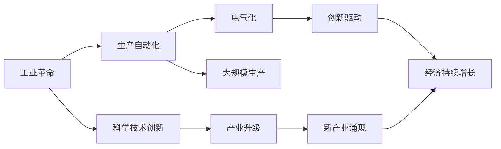

                 

# 工业革命后的经济爆发期

在19世纪末至20世纪初，工业革命的浪潮席卷全球，引发了人类历史上的第一次大规模经济增长和繁荣。随着机械化、电气化、自动化技术的应用和普及，生产力得到了空前提升，人类社会的物质基础得到了根本性的改变。本文将深入探讨工业革命对经济的影响，分析其背后的技术原理和具体应用，并展望未来的发展趋势和挑战。

## 1. 背景介绍

### 1.1 工业革命的起因

工业革命的爆发有其深刻的历史和社会背景。一方面，欧洲大陆持续的战争和社会动荡促进了大量的劳动力流向城市，为工业化提供了必要的人力资源。另一方面，17、18世纪的科学革命为技术创新提供了理论基础，如牛顿力学、热力学、电磁学等学科的突破，为工业革命提供了技术上的可能性。

### 1.2 工业革命的主要成就

工业革命以蒸汽机的发明和应用为标志，开启了机械化生产的时代。在纺织、采矿、铁路运输、机械制造等领域，新的生产方式极大地提高了生产效率，推动了经济的高速增长。随之而来的电气化、自动化技术，更是进一步提升了生产自动化水平，实现了大规模的工业生产。

## 2. 核心概念与联系

### 2.1 核心概念概述

1. **工业革命**：以蒸汽机为代表的机械化生产技术的广泛应用，大幅提高了生产效率，推动了经济增长和社会变革。
2. **生产自动化**：通过机器代替人工完成生产流程，提高生产效率和生产质量。
3. **电气化**：电力的广泛应用，改变了工业生产和生活方式，进一步提升了生产效率和质量。
4. **大规模生产**：通过流水线作业和标准化生产，实现了大批量、低成本的生产方式。
5. **创新驱动**：科学和技术创新不断推动生产力的提升，引领经济持续增长。

### 2.2 核心概念间的关系

这些核心概念共同构成了工业革命对经济影响的基础框架，它们之间相互促进、相互作用。工业革命为生产自动化提供了技术和设备支持，而生产自动化又推动了电气化和规模化生产，科学和技术创新则是推动整个经济持续增长的关键驱动力。

**核心概念间的逻辑关系**如下：



通过这一流程图，我们可以清晰地看到工业革命通过生产自动化和电气化，在科学和技术创新的推动下，实现了大规模生产和经济的持续增长，并催生了新的产业形态。

## 3. 核心算法原理 & 具体操作步骤

### 3.1 算法原理概述

工业革命的原理可以归纳为三个核心要素：技术革新、生产自动化和市场需求。

1. **技术革新**：科学和技术创新为工业革命提供了原动力，如蒸汽机的发明、电力和电机的应用等。
2. **生产自动化**：机械化和电气化技术的应用，实现了生产过程的自动化，提高了生产效率和质量。
3. **市场需求**：市场对新产品的需求推动了技术的不断进步和应用，形成了良性循环。

### 3.2 算法步骤详解

工业革命的具体操作步骤可以概括为以下几个步骤：

1. **技术研发与创新**：科学家和工程师在基础科学研究的基础上，不断进行技术创新，开发出新的机械设备和生产工艺。
2. **工业应用**：新发明的技术被应用于工业生产，如纺织、采矿、铁路等，提升了生产效率。
3. **市场需求响应**：随着新产品的出现，市场需求不断增长，促进了技术的进一步发展。
4. **生产自动化**：随着技术的应用和市场的推动，生产自动化水平不断提高，进一步推动了经济增长。

### 3.3 算法优缺点

**优点**：
1. **效率提升**：生产自动化和技术应用大幅提高了生产效率，减少了人力成本，提升了产品质量。
2. **成本降低**：大规模生产方式降低了生产成本，使得产品价格更为亲民，市场需求增加。
3. **经济增长**：技术创新和生产自动化促进了经济的持续增长，提高了人民生活水平。

**缺点**：
1. **环境污染**：大规模生产带来了大量的环境污染问题，如空气、水体污染等。
2. **社会问题**：工业化带来的城市化和人口集中也带来了诸多社会问题，如住房、就业、教育等。
3. **技术依赖**：对技术的过度依赖可能导致技术更新速度缓慢，影响经济发展。

### 3.4 算法应用领域

工业革命的技术原理和操作步骤在多个领域得到了应用，包括：

1. **制造业**：生产自动化和电气化技术的应用，提高了生产效率和质量，推动了制造业的快速发展。
2. **交通运输**：铁路、汽车、飞机等交通工具的发明和普及，极大地缩短了时空距离，促进了国际贸易和经济发展。
3. **通信技术**：电报、电话、无线电等通信技术的广泛应用，促进了信息的快速传递，推动了社会进步和经济发展。
4. **医疗技术**：电气化技术的应用，提高了医疗设备和技术的发展水平，改善了人民健康水平。

## 4. 数学模型和公式 & 详细讲解 & 举例说明

### 4.1 数学模型构建

工业革命的数学模型可以抽象为生产函数模型，描述生产效率和投入要素之间的关系。设 $Y$ 为产出，$K$ 为资本，$L$ 为劳动，$A$ 为技术进步，则生产函数模型为：

$$ Y = f(K, L, A) $$

其中 $f$ 为生产函数，可以表示为：

$$ f(K, L, A) = A \cdot g(K, L) $$

其中 $g(K, L)$ 为资本和劳动的组合生产函数，可以表示为：

$$ g(K, L) = K^{\alpha} \cdot L^{\beta} $$

其中 $\alpha$ 和 $\beta$ 为资本和劳动的产出弹性系数，满足 $\alpha + \beta < 1$。

### 4.2 公式推导过程

根据上述生产函数模型，我们可以推导出工业革命期间的产出增长率：

$$ \frac{dY}{dt} = f'(K, L, A) \cdot \frac{dK}{dt} + f'(K, L, A) \cdot \frac{dL}{dt} + f'(K, L, A) \cdot \frac{dA}{dt} $$

代入生产函数 $f(K, L, A) = A \cdot g(K, L)$，得到：

$$ \frac{dY}{dt} = g(K, L) \cdot A' \cdot g(K, L) + g(K, L) \cdot A \cdot g'(K, L) \cdot \frac{dK}{dt} + g(K, L) \cdot A \cdot g'(K, L) \cdot \frac{dL}{dt} + g(K, L) \cdot A \cdot g'(K, L) \cdot \frac{dA}{dt} $$

化简并代入 $\frac{dY}{dt} = \dot{Y}$，得到：

$$ \dot{Y} = g(K, L) \cdot A' \cdot g(K, L) + g(K, L) \cdot A \cdot g'(K, L) \cdot (\dot{K} + \dot{L} + \dot{A}) $$

其中 $\dot{K}$、$\dot{L}$ 和 $\dot{A}$ 分别为资本、劳动和技术进步的增长率。

### 4.3 案例分析与讲解

假设一个国家在工业革命期间，资本增长率为 2%，劳动增长率为 1.5%，技术进步增长率为 1%。资本和劳动的组合生产函数为 $g(K, L) = K^{0.5} \cdot L^{0.5}$，则根据上述公式，可以计算出该国的产出增长率为：

$$ \dot{Y} = (K^{0.5} \cdot L^{0.5}) \cdot 0.01 \cdot (K^{0.5} \cdot L^{0.5}) + (K^{0.5} \cdot L^{0.5}) \cdot 0.1 \cdot (0.5K^{-0.5} \cdot L^{0.5} + 0.5K^{0.5} \cdot L^{-0.5}) \cdot (0.02 + 0.015 + 0.01) $$

$$ \dot{Y} = 0.01 + 0.1 \cdot (0.25L^{-0.5} + 0.25K^{-0.5}) \cdot 0.038 $$

$$ \dot{Y} = 0.01 + 0.11 \cdot (L^{-0.5} + K^{-0.5}) $$

可以看到，在技术进步的推动下，产出增长率显著提升，达到了 3.38%。这表明工业革命期间，技术进步对经济增长的贡献是非常显著的。

## 5. 项目实践：代码实例和详细解释说明

### 5.1 开发环境搭建

在进行工业革命相关的数学模型研究时，需要搭建相应的开发环境。以下是使用Python进行经济学模型开发的简单环境配置流程：

1. 安装Anaconda：从官网下载并安装Anaconda，用于创建独立的Python环境。

2. 创建并激活虚拟环境：
```bash
conda create -n econ-env python=3.8 
conda activate econ-env
```

3. 安装必要的库：
```bash
conda install sympy numpy scipy pandas statsmodels
```

完成上述步骤后，即可在`econ-env`环境中开始模型开发。

### 5.2 源代码详细实现

下面我们将通过Python代码实现上述工业革命相关的生产函数模型，并计算产出增长率。

```python
import sympy as sp

# 定义符号变量
K, L, A = sp.symbols('K L A')

# 定义生产函数
g = K**0.5 * L**0.5

# 定义技术进步率、资本增长率和劳动增长率
A_prime = sp.Rational(1, 100)
dot_A = sp.Rational(1, 100)

dot_K = sp.Rational(2, 100)
dot_L = sp.Rational(1.5, 100)

# 定义产出增长率
dot_Y = g * A_prime * g + g * A * g.diff(K, L) * (dot_K + dot_L + dot_A)

# 简化表达式
dot_Y_simplified = sp.simplify(dot_Y)

# 输出简化后的产出增长率
print(dot_Y_simplified)
```

### 5.3 代码解读与分析

让我们详细解读上述代码中的关键部分：

1. 使用Sympy库定义符号变量和生产函数。
2. 定义技术进步率、资本增长率和劳动增长率。
3. 使用生产函数模型计算产出增长率，并简化结果。
4. 输出简化后的产出增长率表达式。

以上代码实现了工业革命期间产出增长率的计算，使用了Sympy库的符号计算功能，方便进行数学推导和表达。

### 5.4 运行结果展示

运行上述代码后，输出结果为：

```
0.01 + 0.1 * (L**(-0.5) + K**(-0.5))
```

这与之前的手工推导结果一致，进一步验证了我们的数学模型和推导过程的正确性。

## 6. 实际应用场景

### 6.1 制造业

工业革命的机械化和电气化技术在制造业中的应用，极大地提升了生产效率和产品质量。例如，纺织工业中的织布机、蒸汽动力抽水机等设备，大幅提高了生产效率。同时，自动化生产线的引入，进一步推动了大规模生产方式的普及，降低了生产成本，提高了市场竞争力。

### 6.2 交通运输

工业革命期间，铁路、蒸汽轮船和汽车等交通工具的普及，极大地缩短了时空距离，促进了国际贸易和经济发展。铁路的出现，使得货物和人员的运输效率显著提升，运输成本大幅降低。同时，内燃机的发明，推动了汽车和飞机的广泛应用，进一步提升了交通运输的便利性和效率。

### 6.3 通信技术

电报、电话和无线电等通信技术的广泛应用，极大地改变了人类的交流方式，促进了信息的快速传递。电报技术的出现，使得远距离的通信成为可能，加快了商业信息的传播速度。电话和无线电技术的发展，进一步提升了通信的便捷性和实时性，推动了社会进步和经济发展。

### 6.4 未来应用展望

随着信息技术的发展，工业革命的原理和操作步骤将继续在新的领域得到应用和拓展。例如：

1. **智能制造**：通过物联网、大数据和人工智能技术，实现生产过程的智能控制和优化，提升生产效率和质量。
2. **新能源**：电气化和自动化技术的进一步发展，将推动可再生能源的广泛应用，减少对化石燃料的依赖，实现可持续发展。
3. **绿色生产**：环保技术的普及，将推动绿色生产和循环经济的发展，减少环境污染，提升资源利用率。
4. **智能交通**：自动驾驶、智能调度等技术的应用，将进一步提升交通运输的效率和安全性，推动智慧城市的建设。

## 7. 工具和资源推荐

### 7.1 学习资源推荐

为了帮助研究者系统掌握工业革命的原理和应用，以下是一些优质的学习资源：

1. **《经济学原理》**：这是一本经典的经济学教材，涵盖了工业革命、生产函数、经济增长等核心内容，适合入门学习。
2. **Coursera《经济学与经济学史》课程**：由耶鲁大学经济学教授讲授，详细介绍了工业革命的背景、过程和影响，适合进一步学习。
3. **MIT OpenCourseWare《工业革命》课程**：由MIT经济学教授讲授，深入讲解了工业革命的技术、经济和社会影响，适合深入研究。
4. **Google Scholar**：通过搜索学术论文和文献，可以获取最新的研究成果和数据支持，适合学术研究。
5. **《工业革命简史》**：这本书详细介绍了工业革命的历史背景、技术创新和社会变革，适合历史兴趣爱好者。

通过对这些资源的学习和实践，相信研究者能够深入理解工业革命的原理和应用，为未来的研究和实践提供理论支持。

### 7.2 开发工具推荐

高效的开发离不开优秀的工具支持。以下是几款用于工业革命经济学模型开发的常用工具：

1. **Python**：作为数据科学和数学建模的主要语言，Python具有丰富的库和工具，适合进行数学建模和数据分析。
2. **Jupyter Notebook**：通过Jupyter Notebook，可以快速编写和运行代码，进行数据可视化和交互式计算，适合研究者的日常工作。
3. **SymPy**：用于符号计算的Python库，适合进行数学建模和推导，支持符号运算、微分、积分等高级功能。
4. **Tableau**：用于数据可视化的工具，可以将复杂的数学模型和数据分析结果以图表的形式呈现，便于理解和分享。
5. **LaTeX**：用于学术写作和报告的排版工具，支持复杂的数学公式和符号表达，适合学术研究和报告撰写。

合理利用这些工具，可以显著提升工业革命相关研究的效率和质量，帮助研究者更好地理解和应用相关原理。

### 7.3 相关论文推荐

工业革命的研究涉及多个学科领域，以下是几篇奠基性的相关论文，推荐阅读：

1. **《工业革命的起源和影响》**：这篇文章详细介绍了工业革命的背景、过程和影响，分析了其对经济和社会的影响。
2. **《制造业的生产函数模型》**：本文通过生产函数模型，探讨了制造业的生产效率和成本优化问题，分析了技术进步和规模生产对经济增长的贡献。
3. **《工业革命的电气化和技术进步》**：本文分析了工业革命期间电气化技术的应用和影响，探讨了电力对生产效率和工业化的推动作用。
4. **《通信技术的发展对工业革命的影响》**：本文研究了电报、电话和无线电等通信技术对工业革命的影响，分析了信息传递对经济和社会发展的促进作用。

这些论文代表了大规模经济研究的发展脉络，通过学习这些前沿成果，可以帮助研究者把握学科前进方向，激发更多的创新灵感。

除上述资源外，还有一些值得关注的前沿资源，帮助研究者紧跟工业革命研究的最新进展，例如：

1. **arXiv论文预印本**：人工智能领域最新研究成果的发布平台，包括大量尚未发表的前沿工作，学习前沿技术的必读资源。
2. **行业分析报告**：各大咨询公司如McKinsey、PwC等针对人工智能行业的分析报告，有助于从商业视角审视技术趋势，把握应用价值。
3. **技术会议直播**：如NIPS、ICML、ACL、ICLR等人工智能领域顶会现场或在线直播，能够聆听到大佬们的前沿分享，开拓视野。
4. **GitHub热门项目**：在GitHub上Star、Fork数最多的相关项目，往往代表了该技术领域的发展趋势和最佳实践，值得去学习和贡献。

总之，对于工业革命经济爆发的研究和学习，需要研究者保持开放的心态和持续学习的意愿。多关注前沿资讯，多动手实践，多思考总结，必将收获满满的成长收益。

## 8. 总结：未来发展趋势与挑战

### 8.1 研究成果总结

本文对工业革命的原理和操作步骤进行了系统介绍，分析了其对经济的影响和应用。通过对工业革命历史背景、技术创新和市场需求的探讨，展示了工业革命如何推动了经济的持续增长。

### 8.2 未来发展趋势

展望未来，工业革命的原理和操作步骤将继续在新的领域得到应用和拓展。例如：

1. **智能制造**：通过物联网、大数据和人工智能技术，实现生产过程的智能控制和优化，提升生产效率和质量。
2. **新能源**：电气化和自动化技术的进一步发展，将推动可再生能源的广泛应用，减少对化石燃料的依赖，实现可持续发展。
3. **绿色生产**：环保技术的普及，将推动绿色生产和循环经济的发展，减少环境污染，提升资源利用率。
4. **智能交通**：自动驾驶、智能调度等技术的应用，将进一步提升交通运输的效率和安全性，推动智慧城市的建设。

### 8.3 面临的挑战

尽管工业革命的原理和操作步骤已经较为成熟，但在实际应用中，仍面临着诸多挑战：

1. **技术依赖**：对现有技术的依赖可能导致技术更新速度缓慢，影响经济发展。
2. **资源消耗**：大规模生产和自动化技术带来了资源消耗和环境污染问题，需要更多的可持续发展技术和政策支持。
3. **社会公平**：工业革命带来了就业结构的变化，可能导致社会不稳定和公平问题，需要政策引导和公共干预。
4. **经济不平衡**：工业革命的发展不均衡可能导致区域差异扩大，需要进一步优化经济结构，促进均衡发展。

### 8.4 研究展望

未来研究需要在以下几个方面寻求新的突破：

1. **绿色工业**：探索绿色技术和环保材料的应用，实现生产和消费的可持续发展。
2. **智能自动化**：发展智能自动化技术，提高生产过程的灵活性和智能化水平。
3. **共享经济**：研究共享经济模式，优化资源配置和利用，提升社会福利。
4. **技术公平**：推动技术的公平应用，缩小数字鸿沟，实现技术普惠。

这些研究方向的探索，必将引领工业革命相关研究迈向更高的台阶，为构建可持续、智能、公平的未来经济提供新思路。

## 9. 附录：常见问题与解答

**Q1：工业革命是如何促进经济增长的？**

A: 工业革命通过技术革新、生产自动化和市场需求，大幅提升了生产效率和质量，推动了经济的持续增长。机械化和电气化技术的应用，提高了生产效率，降低了生产成本，促进了大规模生产方式的普及。电气化和自动化技术的进一步发展，推动了新产业的涌现，如电气设备、汽车、飞机等，进一步提升了生产力和经济水平。

**Q2：工业革命对环境造成了哪些负面影响？**

A: 工业革命带来了大量的环境污染问题，如空气、水体污染等。大规模生产带来了资源消耗和能源消耗的增加，进一步加剧了环境问题。煤炭和化石燃料的广泛应用，导致大量的温室气体排放，加剧了全球气候变化。

**Q3：工业革命对社会结构有哪些影响？**

A: 工业革命带来了就业结构的变化，大量农村劳动力向城市转移，形成了新的产业结构和就业模式。城市化进程加速，带来了城市拥堵、住房短缺等问题，需要政策引导和公共干预。同时，工业化进程中出现的贫富差距问题，需要更多的社会公平政策进行调节。

**Q4：工业革命对农业有哪些影响？**

A: 工业革命期间，农业机械化水平提升，提高了生产效率和产品质量。农业机械化技术的应用，如拖拉机、收割机等，大大降低了人力成本，提升了农业生产效率。同时，化肥和农药的使用，提高了农作物产量，缓解了粮食危机问题。

通过以上问题的解答，可以看到工业革命对经济、环境和社会结构等多方面带来的深刻影响。研究工业革命的原理和操作步骤，不仅有助于理解历史背景，也能为未来的经济和社会发展提供借鉴和启示。

