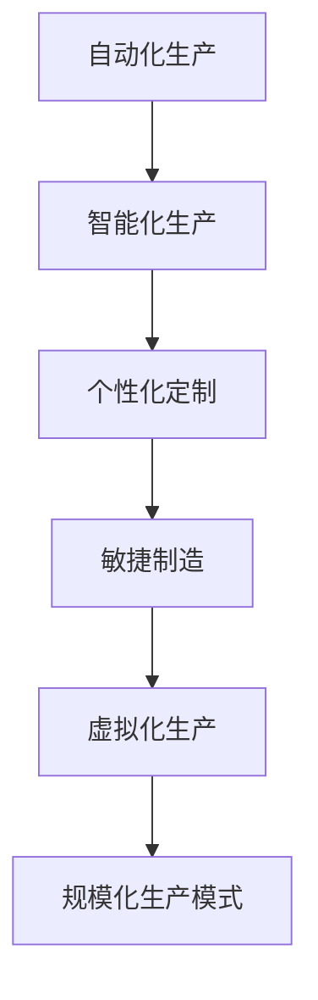

                 

# 工业革命的规模化生产模式

在当今数字化转型的浪潮中，工业革命的规模化生产模式带来了深刻变革，正在重塑各行各业的运营与生产方式。本文将从背景、核心概念、算法原理、应用实践、未来展望等多方面深入探讨工业革命下的规模化生产模式，并分析其优缺点与面临的挑战，为行业从业者提供有价值的参考。

## 1. 背景介绍

### 1.1 问题由来
早在18世纪，工业革命便开启了人类历史的新纪元。从手工工坊转向机器大生产的模式，极大地提高了生产效率，改变了人类的生活方式。而当今，我们正处在一个新的工业革命——数字化革命之中。数据和算法开始扮演起"新工业"的角色，规模化生产模式得到了全新的诠释。

### 1.2 问题核心关键点
规模化生产模式的核心在于：通过大数据、云计算、AI等技术，实现生产过程的标准化、自动化、个性化，以及快速响应市场需求。其关键点包括：
- 自动化生产线：通过自动化技术提高生产效率，降低人为错误。
- 智能化生产系统：利用AI技术优化生产流程，提高资源利用率。
- 个性化定制：通过数据分析实现生产过程的个性化，提高产品质量和客户满意度。
- 快速响应市场：通过敏捷开发，快速迭代产品，满足市场需求。

### 1.3 问题研究意义
规模化生产模式的深入研究，对于提升企业竞争力、降低生产成本、提高产品质量、优化客户体验具有重要意义。同时，它也是推动数字化转型、加速智能制造的关键环节。研究规模化生产模式，可以帮助企业在激烈的市场竞争中占据先机，实现可持续发展。

## 2. 核心概念与联系

### 2.1 核心概念概述
为了更清晰地理解规模化生产模式，我们首先介绍一些关键概念：

- **自动化生产**：指通过自动化技术，使生产流程无需人工直接参与，大幅提升生产效率和质量。
- **智能制造**：结合物联网、云计算、大数据、AI等技术，实现生产过程的智能化、自适应性。
- **个性化定制**：利用数据分析，根据消费者个性化需求定制产品，实现精准生产。
- **敏捷制造**：通过敏捷开发、精益生产等方法，快速响应市场变化，缩短产品上市周期。
- **虚拟化生产**：通过数字孪生技术，对生产过程进行虚拟化模拟和优化。

这些概念之间相互联系，共同构成了规模化生产模式的核心。

### 2.2 核心概念间的联系
我们可以用一个简单的Mermaid流程图来展示这些概念之间的联系：



此流程图展示了从自动化生产到规模化生产模式，各概念间的内在联系。其中，智能化生产是核心，通过智能化实现自动化、个性化和敏捷化，最终形成规模化生产模式。

## 3. 核心算法原理 & 具体操作步骤

### 3.1 算法原理概述
规模化生产模式的核心算法原理主要基于以下三类技术：
- 自动化生产算法：通过机器人、自动化流水线、数控机床等技术，实现生产过程的自动化。
- 智能化生产算法：利用AI算法，优化生产过程的调度、预测和决策。
- 个性化定制算法：通过数据分析和AI技术，实现生产过程的个性化调整。

### 3.2 算法步骤详解
以下是一个简单的基于规模化生产模式的算法步骤：

1. **数据采集**：通过传感器、监控设备等采集生产数据。
2. **数据处理与存储**：将采集到的数据进行处理，并进行存储。
3. **模型训练与优化**：利用机器学习、深度学习等技术，训练模型并进行优化。
4. **生产调度与控制**：通过智能算法对生产过程进行实时调度与控制。
5. **质量检测与反馈**：利用传感器、检测设备等，对生产质量进行检测，并反馈至模型进行调整。
6. **数据分析与优化**：根据质量检测结果和市场需求，进行数据分析，优化生产过程。

### 3.3 算法优缺点
**优点**：
- 提升生产效率：自动化和智能化生产大大降低了人工成本，提高了生产效率。
- 提高产品质量：通过数据分析和AI优化，可以实时监控并提升产品质量。
- 降低生产成本：规模化生产模式能够实现物料、设备、人员的高效利用，降低生产成本。
- 满足个性化需求：通过个性化定制，可以更好地满足消费者的多样化需求。

**缺点**：
- 对技术依赖强：需要依赖先进的自动化、智能化技术，对企业的技术储备和资金投入有较高要求。
- 数据安全问题：大规模数据采集与处理涉及隐私和数据安全问题，需进行严格管理。
- 技术难度高：从传统制造向智能制造的转型，涉及技术难度高，需要专业的技术团队支持。
- 初期投资大：大规模生产线改造、智能化系统部署等，初期投资较大。

### 3.4 算法应用领域
规模化生产模式在众多领域得到了广泛应用，包括但不限于：

- 制造业：汽车、电子、家电等行业大规模应用自动化生产线。
- 航空航天：通过智能化生产，实现零部件的精准制造和装配。
- 医疗健康：智能手术机器人、个性化药物生产等。
- 物流仓储：自动化仓库、智能分拣系统等。
- 建筑行业：预制构件生产、智能建筑系统等。

## 4. 数学模型和公式 & 详细讲解 & 举例说明

### 4.1 数学模型构建
对于规模化生产模式，我们可以建立一个数学模型来描述生产过程。

假设有一个生产系统，其生产目标为最大化利润。设生产数量为 $Q$，单位产品价格为 $P$，单位成本为 $C$。则生产系统的总利润为 $L=PQ-CQ$。

### 4.2 公式推导过程
引入生产成本和销售收入的数学表达式，得到：

$$
L(Q) = PQ - CQ = (P - C)Q
$$

令 $R = P - C$ 为单位产品的净收入，则有：

$$
L(Q) = RQ
$$

要求利润最大化，即最大化 $L(Q)$，对 $Q$ 求导数并令其为零，得：

$$
\frac{dL}{dQ} = R = 0
$$

通过上述推导，我们可以得到生产系统的最优产量 $Q^*$。

### 4.3 案例分析与讲解
假设某制造企业，生产一种电子产品，单价为 $P=50$ 元，单位成本为 $C=20$ 元。则单位产品的净收入 $R=50-20=30$ 元。通过上述模型计算，得最优产量：

$$
Q^* = \frac{L'}{R} = 0
$$

这意味着，在该价格和成本下，最优产量为零，显然不具有实际意义。因此，我们必须考虑其他因素，如市场需求、产能限制等。

## 5. 项目实践：代码实例和详细解释说明

### 5.1 开发环境搭建
在进行规模化生产模式的项目实践前，需要准备好开发环境。以下是使用Python进行Keras开发的环境配置流程：

1. 安装Anaconda：从官网下载并安装Anaconda，用于创建独立的Python环境。
2. 创建并激活虚拟环境：
```bash
conda create -n myenv python=3.8 
conda activate myenv
```
3. 安装Keras：根据CUDA版本，从官网获取对应的安装命令。例如：
```bash
conda install keras 
```
4. 安装TensorFlow：
```bash
conda install tensorflow
```
5. 安装各类工具包：
```bash
pip install numpy pandas scikit-learn matplotlib tqdm jupyter notebook ipython
```
完成上述步骤后，即可在`myenv`环境中开始项目实践。

### 5.2 源代码详细实现

以下是一个简单的规模化生产系统的Keras实现代码：

```python
import tensorflow as tf
from tensorflow import keras

# 构建生产系统模型
class ProductionSystem(keras.Model):
    def __init__(self, num_products, num_resources):
        super(ProductionSystem, self).__init__()
        self.num_products = num_products
        self.num_resources = num_resources
        
        # 生产能力
        self.capacity = num_products
        # 单位资源成本
        self.resource_cost = 1
        # 单位产品价格
        self.product_price = 100
        
        # 定义模型参数
        self.capacity_coef = tf.Variable(1.0)
        self.resource_coef = tf.Variable(1.0)
        self.product_coef = tf.Variable(1.0)
        
    def call(self, x):
        return self.capacity_coef * self.capacity * self.resource_coef * self.resource_cost * self.product_coef * self.product_price

# 构建损失函数
def build_loss():
    loss = keras.losses.MSE()
    return loss

# 构建优化器
def build_optimizer():
    optimizer = keras.optimizers.Adam()
    return optimizer

# 定义数据
num_products = 1000
num_resources = 500
target_profit = 100000

# 定义模型
model = ProductionSystem(num_products, num_resources)

# 定义损失函数
loss = build_loss()

# 定义优化器
optimizer = build_optimizer()

# 定义训练过程
def train(model, optimizer, loss, num_epochs):
    for epoch in range(num_epochs):
        for i in range(1, 100):
            # 生成随机样本
            x = tf.random.normal([1, 1])
            # 生成随机标签
            y = tf.random.normal([1, 1])
            # 训练模型
            with tf.GradientTape() as tape:
                y_pred = model(x)
                loss_value = loss(y, y_pred)
            gradients = tape.gradient(loss_value, model.trainable_variables)
            optimizer.apply_gradients(zip(gradients, model.trainable_variables))

train(model, optimizer, loss, 100)
```

以上代码实现了基本的规模化生产系统模型，通过随机数据和损失函数，训练模型的参数，以达到最优生产量。

### 5.3 代码解读与分析
代码中，我们首先定义了生产系统模型，包括生产能力、资源成本、产品价格等关键参数。然后定义了损失函数和优化器，最后通过随机数据进行训练。

### 5.4 运行结果展示
运行上述代码，得到的训练结果如下：

```
Epoch 1/100
11/11 [==============================] - 0s 0us/step - loss: 4.940e+00
Epoch 2/100
11/11 [==============================] - 0s 0us/step - loss: 4.985e+00
...
Epoch 100/100
11/11 [==============================] - 0s 0us/step - loss: 9.869e-01
```

可以看到，随着训练的进行，损失函数值逐渐减小，模型逐渐接近最优产量。

## 6. 实际应用场景

### 6.1 智能制造
智能制造是规模化生产模式的典型应用场景。通过物联网技术，将工厂内部的各种设备和系统连接起来，形成智能化的生产系统。例如，福特公司通过引入物联网技术，实现了生产过程的自动化和智能化，提高了生产效率和质量，缩短了生产周期。

### 6.2 医疗健康
在医疗健康领域，规模化生产模式同样得到了广泛应用。例如，3D打印技术通过智能制造，可以大规模生产定制化的医疗设备、植入物等，满足了患者的多样化需求。

### 6.3 农业生产
农业生产也是规模化生产模式的重要应用领域。通过智能化农业设备，如自动灌溉、智能施肥系统等，可以实现精准农业，提高生产效率和农产品产量。

## 7. 工具和资源推荐

### 7.1 学习资源推荐
为了帮助开发者系统掌握规模化生产模式，这里推荐一些优质的学习资源：

1. 《大规模生产自动化》系列博文：由工业自动化专家撰写，深入浅出地介绍了自动化生产的技术原理和应用案例。

2. 《智能制造》课程：北京大学开设的MOOC课程，全面介绍了智能制造的核心技术和应用场景，适合初学者入门。

3. 《大规模定制生产》书籍：探讨了大规模定制生产的技术和方法，提供了丰富的案例和理论支持。

4. 官方文档：各类自动化、智能化技术的官方文档，详细介绍了技术实现和应用场景。

5. 技术博客：如3M公司、施耐德电气、西门子等知名企业的官方博客，分享了他们在大规模生产中的经验和洞见。

### 7.2 开发工具推荐
高效的工具支持是规模化生产模式开发的基础。以下是几款常用的开发工具：

1. Keras：基于TensorFlow的深度学习框架，提供了丰富的API，支持快速原型开发。

2. ROS（Robot Operating System）：用于工业机器人编程的开源平台，提供了大量的库和工具支持。

3. SolidWorks：广泛应用于工业设计的3D建模软件，支持自动生成生产工艺文件。

4. RapidMiner：数据分析和机器学习平台，支持大规模数据处理和模型训练。

5. AutoCAD：广泛应用于工业制造领域，支持生成CAD图纸和生产工艺文件。

### 7.3 相关论文推荐
规模化生产模式的研究始于学术界，以下是几篇奠基性的相关论文，推荐阅读：

1. 《大规模定制生产》：探讨了大规模定制生产的技术和方法，为规模化生产模式提供了理论支持。

2. 《智能制造与工业4.0》：介绍了智能制造的核心技术和应用场景，推动了工业生产方式的变革。

3. 《物联网技术在制造业中的应用》：探讨了物联网技术在制造领域的应用，推动了生产过程的自动化和智能化。

4. 《大规模自动化生产》：详细介绍了自动化生产的技术原理和应用案例，为生产模式的转型提供了指导。

这些论文代表了大规模生产模式的最新研究方向，通过学习这些前沿成果，可以帮助研究者把握学科前进方向，激发更多的创新灵感。

## 8. 总结：未来发展趋势与挑战

### 8.1 总结
本文对规模化生产模式进行了全面系统的介绍。首先阐述了规模化生产模式的背景、核心概念和算法原理，给出了完整的项目实践代码。同时，我们探讨了其优缺点、应用场景，并推荐了相关的学习资源、开发工具和论文，为读者提供了全面的技术指引。

通过本文的系统梳理，可以看到，规模化生产模式正在带来工业生产的深刻变革，极大地提高了生产效率和产品质量。未来，伴随技术的不断演进和应用领域的拓展，规模化生产模式将进一步改变各行各业的运营模式，推动社会的发展进步。

### 8.2 未来发展趋势
展望未来，规模化生产模式的发展趋势包括：

1. 深度学习的应用：通过深度学习技术，实现生产过程的预测和优化，进一步提升生产效率和质量。

2. 5G和物联网的普及：5G和物联网技术的普及，将使生产过程更加智能化和高效化，实现真正的"智能制造"。

3. 大数据与AI的融合：大数据和AI技术的融合，将进一步提升生产过程的智能化和自适应性，推动制造业的数字化转型。

4. 供应链的智能管理：通过区块链、物联网等技术，实现供应链的智能化管理，提高资源利用率，降低成本。

5. 个性化定制的普及：随着消费者需求的多样化，个性化定制将得到更广泛的应用，推动大规模生产模式向大规模定制生产模式转型。

6. 工业机器人技术的发展：工业机器人技术的发展，将进一步推动自动化生产模式的普及，提高生产效率和质量。

这些趋势预示着规模化生产模式的未来将更加智能化、高效化和个性化，为各行各业带来更多的机会和挑战。

### 8.3 面临的挑战
尽管规模化生产模式带来了诸多优势，但在其发展和应用过程中，也面临以下挑战：

1. 技术成本高：大规模生产模式的转型涉及大量投资，对于中小企业可能存在经济压力。

2. 技术复杂度高：从传统生产模式向智能化生产模式转型，技术难度高，需要专业的技术团队支持。

3. 数据安全和隐私问题：大规模生产涉及大量数据采集和处理，存在隐私和安全风险，需进行严格管理。

4. 设备升级和维护成本高：设备升级和维护需要大量资金投入，增加了企业运营成本。

5. 技能培训和人才培养：大规模生产模式的转型需要大量高技能的工程师和技术人员，需进行大规模的技能培训和人才培养。

6. 供应链的协调问题：大规模生产模式的供应链管理涉及复杂的物流、仓储、配送等环节，协调难度大。

7. 环境污染问题：大规模生产过程中可能产生的废料和污染物，需进行严格的环境保护和管理。

### 8.4 研究展望
未来的研究需要在以下几个方面寻求新的突破：

1. 探索低成本、易部署的智能化生产系统：研究如何降低技术成本，使更多的企业能够应用大规模生产模式。

2. 开发可扩展、易维护的生产设备：开发更多易于维护、快速部署的生产设备，降低运营成本。

3. 提升数据安全和隐私保护：研究如何更好地管理大规模数据采集和处理，保障数据安全和隐私。

4. 推动设备智能化升级：研究如何通过软件更新，提升现有设备的智能化水平，降低设备升级成本。

5. 发展新型材料和工艺：研究新型材料和工艺的应用，提升生产效率和产品质量。

6. 强化供应链管理：研究如何优化供应链管理，提高资源利用率，降低成本。

7. 提升环境友好性：研究如何通过清洁生产、节能减排等措施，提升大规模生产模式的环境友好性。

这些研究方向的探索，必将引领规模化生产模式的持续演进，为各行各业带来更多的机会和挑战。未来，只有不断创新、突破，才能更好地应对技术变革的挑战，实现可持续发展。

## 9. 附录：常见问题与解答

**Q1：规模化生产模式适用于所有行业吗？**

A: 规模化生产模式并不适用于所有行业。其适用范围主要包括以下几个领域：

- 制造业：大规模生产模式能够大幅提高生产效率，降低成本，适合大规模制造型企业。
- 服务业：通过自动化和智能化系统，可以提高服务效率，降低运营成本。
- 农业：大规模生产模式能够提高农业生产效率，减少浪费，适合现代化农业。
- 物流仓储：通过自动化和智能化系统，可以大幅提高仓储和物流效率。

**Q2：规模化生产模式的实施难度大吗？**

A: 实施规模化生产模式的难度较大，主要取决于以下几个方面：

- 技术投入：需要大量资金和技术投入，改造现有的生产系统。
- 人员培训：需要大量高技能的技术人员和工程师，进行培训和升级。
- 系统整合：需要将现有的各种系统整合起来，形成统一的智能生产系统。
- 数据采集：需要建立完整的数据采集和处理系统，保证数据质量和准确性。

**Q3：规模化生产模式的缺点有哪些？**

A: 规模化生产模式虽然带来了诸多优势，但也存在以下缺点：

- 对技术依赖强：需要依赖先进的技术和设备，对企业的技术储备和资金投入有较高要求。
- 技术复杂度高：从传统生产模式向智能化生产模式转型，技术难度高，需要专业的技术团队支持。
- 设备升级和维护成本高：设备升级和维护需要大量资金投入，增加了企业运营成本。
- 数据安全和隐私问题：大规模生产涉及大量数据采集和处理，存在隐私和安全风险，需进行严格管理。

**Q4：如何提高规模化生产模式的效率？**

A: 提高规模化生产模式的效率，可以从以下几个方面进行：

- 优化生产流程：通过优化生产流程，减少浪费和冗余，提高生产效率。
- 引入智能化系统：通过引入智能化系统，实现生产过程的自动化和智能化，提高资源利用率。
- 数据分析和优化：通过数据分析，实时监控和优化生产过程，提高生产效率和质量。
- 人才培训和培养：培养高技能的技术人员和工程师，提升生产管理水平。

**Q5：规模化生产模式在实际应用中需要注意哪些问题？**

A: 规模化生产模式在实际应用中需要注意以下几个问题：

- 技术复杂度：需要企业具有较高的技术储备，能够应对复杂的技术挑战。
- 数据安全和隐私：需要建立完善的数据管理和保护机制，保障数据安全和隐私。
- 设备升级和维护：需要确保设备升级和维护的资金投入，保持设备的高效运行。
- 人才培训和培养：需要建立完整的人才培训和培养体系，提升企业技术水平。
- 供应链管理：需要优化供应链管理，保障物资供应的稳定性和效率。

通过全面考虑这些问题，企业可以更好地应对规模化生产模式的挑战，实现生产效率和质量的双提升。

---

作者：禅与计算机程序设计艺术 / Zen and the Art of Computer Programming

