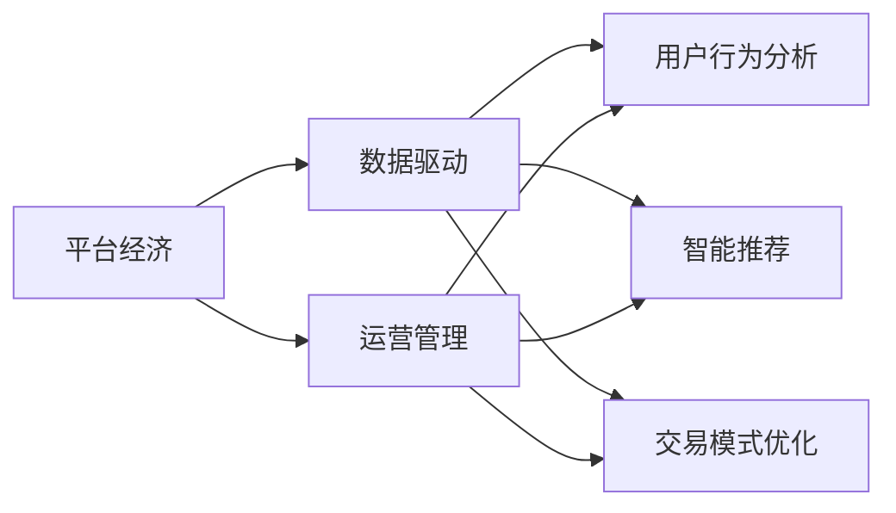
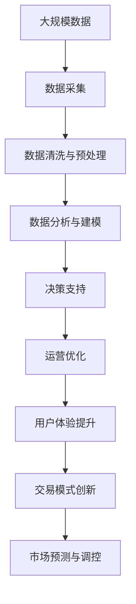

                 

# 平台经济的数据化：数据驱动平台的运营和发展

> 关键词：平台经济, 数据驱动, 运营管理, 数据分析, 用户行为, 智能推荐, 交易模式

## 1. 背景介绍

### 1.1 问题由来

进入21世纪，互联网技术的飞速发展催生了新型的经济形态——平台经济。电商平台、共享经济、金融科技等平台的崛起，改变了消费者和企业的互动模式，带来了巨大的经济效应。平台作为连接供需双方的重要枢纽，其运营管理的成败直接关系到整个市场的活力与稳定性。

随着数字化、信息化技术的不断进步，平台运营开始从传统经验驱动转向数据驱动。平台通过收集、分析和利用数据，优化资源配置，提升运营效率，增强竞争力。数据驱动不仅使平台运营更加精准和高效，也为市场预测和调控提供了新的可能性。

### 1.2 问题核心关键点

平台经济的数据驱动运营主要聚焦于以下几个关键点：

1. **数据收集与处理**：收集平台各环节产生的数据，并进行清洗、处理和存储。数据来源包括用户行为数据、交易数据、物流数据、评论数据等。
2. **数据分析与建模**：利用数据挖掘、机器学习等技术，构建分析模型，揭示数据背后的规律和趋势。常用的分析方法包括回归分析、聚类分析、关联分析、预测分析等。
3. **决策支持与优化**：将分析结果应用于运营管理决策，优化资源分配、价格策略、营销活动等。通过实时数据监控和预测，调整运营策略，提升平台效能。
4. **用户行为分析**：深入理解用户行为和需求，为用户提供个性化推荐、精准营销和优质服务。
5. **交易模式优化**：通过数据分析，探索新的交易模式，如跨平台营销、联合促销、限时秒杀等，提升平台的用户粘性和交易转化率。

### 1.3 问题研究意义

数据驱动的运营模式对于平台经济的发展具有重要意义：

1. **提升运营效率**：通过数据优化运营策略，减少资源浪费，提高运营效率。
2. **增强竞争力**：利用数据分析进行市场分析和预测，及时调整策略，保持竞争优势。
3. **改善用户体验**：通过个性化推荐和精准营销，提升用户满意度，增强平台黏性。
4. **降低风险**：利用数据监控交易和行为，及时发现和防范风险，保障平台安全。
5. **驱动创新**：数据驱动下的持续优化和迭代，为平台创新提供基础，推动新模式、新技术的应用。

## 2. 核心概念与联系

### 2.1 核心概念概述

为更好地理解数据驱动平台运营的原理，本节将介绍几个核心概念：

1. **平台经济**：以互联网技术为基础，通过构建虚拟市场，整合供需资源，提供商品或服务交易的商业模式。平台如电商平台、共享平台、金融平台等。
2. **数据驱动**：利用数据进行决策和优化，减少主观判断和经验依赖，提升运营效率和效果。
3. **运营管理**：平台通过收集、分析数据，调整资源配置和运营策略，实现商业目标。
4. **用户行为分析**：通过分析用户行为数据，挖掘用户需求和偏好，提升用户体验和满意度。
5. **智能推荐**：利用数据和算法为用户提供个性化推荐，提升转化率和用户粘性。
6. **交易模式优化**：通过数据分析，探索新的交易模式，提升平台的用户参与度和交易效率。

这些核心概念之间的逻辑关系可以通过以下Mermaid流程图来展示：



这个流程图展示了平台经济在数据驱动下的核心运营模式：平台通过收集和分析数据，进行用户行为分析、智能推荐和交易模式优化，从而提升运营效率和用户体验。

### 2.2 概念间的关系

这些核心概念之间存在着紧密的联系，形成了平台经济运营管理的完整生态系统。

1. **平台经济与数据驱动的关系**：平台经济的本质是数据驱动。平台通过数据驱动，优化资源配置，提升运营效率，实现商业目标。
2. **运营管理与用户行为分析的关系**：运营管理以用户行为分析为基础。通过分析用户行为数据，了解用户需求，调整运营策略，提升用户体验。
3. **用户行为分析与智能推荐的关系**：用户行为分析是智能推荐的前提。通过对用户行为的深入分析，提供个性化的推荐服务，提升用户满意度和转化率。
4. **智能推荐与交易模式优化的关系**：智能推荐驱动交易模式优化。通过个性化推荐，吸引用户参与，提升交易效率和转化率。

### 2.3 核心概念的整体架构

最后，我们用一个综合的流程图来展示这些核心概念在大平台运营中的整体架构：



这个综合流程图展示了从数据采集到市场调控的完整过程。平台通过采集、清洗、分析数据，构建分析模型，支持决策，优化运营，提升用户体验，探索新的交易模式，最终实现市场预测与调控。

## 3. 核心算法原理 & 具体操作步骤
### 3.1 算法原理概述

平台经济的数据驱动运营，主要基于以下算法原理：

1. **数据采集与清洗**：通过API接口、日志记录等方式，收集平台各环节产生的数据。然后对数据进行去重、去噪、格式转换等处理，确保数据的质量和一致性。
2. **数据分析与建模**：利用数据挖掘、机器学习等技术，对数据进行建模和分析。常用的建模方法包括回归分析、聚类分析、关联分析、预测分析等。
3. **决策支持与优化**：将分析结果应用于运营管理决策，优化资源配置、价格策略、营销活动等。通过实时数据监控和预测，调整运营策略，提升平台效能。
4. **用户行为分析**：利用用户行为数据，构建用户画像，挖掘用户需求和偏好，提升用户体验和满意度。
5. **智能推荐**：利用用户行为数据和商品特征，构建推荐模型，提供个性化推荐服务，提升用户粘性和转化率。
6. **交易模式优化**：通过交易数据和用户行为数据，探索新的交易模式，提升平台的用户参与度和交易效率。

### 3.2 算法步骤详解

数据驱动平台运营的具体操作步骤包括以下几个关键环节：

1. **数据采集**：通过API接口、日志记录等方式，收集平台各环节产生的数据。数据来源包括用户行为数据、交易数据、物流数据、评论数据等。
2. **数据清洗与预处理**：对采集到的数据进行清洗和预处理，去除噪声、缺失值，转换数据格式，确保数据的质量和一致性。
3. **数据分析与建模**：利用数据挖掘、机器学习等技术，对数据进行建模和分析。常用的分析方法包括回归分析、聚类分析、关联分析、预测分析等。
4. **决策支持与优化**：将分析结果应用于运营管理决策，优化资源配置、价格策略、营销活动等。通过实时数据监控和预测，调整运营策略，提升平台效能。
5. **用户行为分析**：利用用户行为数据，构建用户画像，挖掘用户需求和偏好，提升用户体验和满意度。
6. **智能推荐**：利用用户行为数据和商品特征，构建推荐模型，提供个性化推荐服务，提升用户粘性和转化率。
7. **交易模式优化**：通过交易数据和用户行为数据，探索新的交易模式，提升平台的用户参与度和交易效率。

### 3.3 算法优缺点

数据驱动平台运营的算法具有以下优点：

1. **精度高**：通过大量数据的分析和建模，能够更准确地预测市场趋势和用户需求。
2. **效率高**：数据分析和模型训练可以在短时间内完成，支持实时决策和优化。
3. **可扩展性强**：数据驱动的运营模式可以针对不同环节和任务进行优化，具有较强的可扩展性。
4. **灵活性高**：数据分析和推荐系统可以根据不同场景进行定制，适应不同的市场和用户需求。

同时，数据驱动平台运营也存在以下缺点：

1. **数据依赖性强**：数据的准确性和完整性直接影响分析结果和决策效果，数据质量问题需重点关注。
2. **技术要求高**：数据分析和建模需要较高技术水平，数据科学家和工程师需具备较强的数据处理和建模能力。
3. **成本高**：数据采集、清洗、建模和运营优化需要投入大量人力和资金，尤其对中小企业而言，成本较高。
4. **隐私和安全风险**：平台运营涉及大量用户数据，需严格保护用户隐私，防范数据泄露和滥用风险。

### 3.4 算法应用领域

数据驱动平台运营的算法广泛应用于以下几个领域：

1. **电商运营**：利用用户行为数据和交易数据，优化商品推荐、价格策略、促销活动等，提升用户满意度和转化率。
2. **金融科技**：通过交易数据和用户行为数据，进行风险控制、信用评估、欺诈检测等，提升平台的安全性和可靠性。
3. **共享经济**：通过数据分析，优化资源配置、定价策略和运营模式，提升平台的用户粘性和收益。
4. **旅游平台**：利用用户行为数据和交易数据，提供个性化推荐、行程优化和定价策略，提升用户体验和平台收益。
5. **在线教育**：通过数据分析，了解用户学习行为和需求，提供个性化推荐和课程优化，提升学习效果和平台用户粘性。

## 4. 数学模型和公式 & 详细讲解  
### 4.1 数学模型构建

平台经济的数据驱动运营，主要涉及以下几个数学模型：

1. **用户行为模型**：利用用户行为数据，构建用户画像，分析用户需求和偏好。
2. **交易模型**：通过交易数据，分析用户购买行为和商品特征，构建推荐模型。
3. **预测模型**：利用历史数据，构建预测模型，预测市场趋势和用户需求。
4. **优化模型**：利用数据驱动的优化算法，优化资源配置和运营策略。

以用户行为模型为例，其数学模型构建如下：

假设用户行为数据为 $X$，行为特征向量为 $x_i = (x_{i1}, x_{i2}, ..., x_{im})$，其中 $m$ 为特征维度。用户需求 $y$ 可以用线性回归模型表示：

$$
y = \beta_0 + \beta_1 x_1 + \beta_2 x_2 + ... + \beta_m x_m + \epsilon
$$

其中 $\beta = (\beta_0, \beta_1, ..., \beta_m)^T$ 为回归系数，$\epsilon$ 为误差项。

### 4.2 公式推导过程

对于用户行为模型，假设收集到 $n$ 个样本的训练数据 $(x_{i1}, x_{i2}, ..., x_{in})$ 和对应的 $y_i$。利用最小二乘法求解 $\beta$：

$$
\hat{\beta} = (X^T X)^{-1} X^T y
$$

其中 $X$ 为数据矩阵，$y$ 为标签向量。

### 4.3 案例分析与讲解

以电商平台为例，利用用户行为数据构建推荐模型：

1. **数据收集与处理**：收集用户浏览、点击、购买等行为数据，构建数据集 $D = \{(x_i, y_i)\}_{i=1}^n$，其中 $x_i$ 为行为特征向量，$y_i$ 为购买行为标签。
2. **模型构建**：利用最小二乘法，构建用户行为模型 $y = \beta_0 + \beta_1 x_1 + \beta_2 x_2 + ... + \beta_m x_m$。
3. **预测与优化**：利用模型预测用户行为，生成推荐列表，优化推荐算法，提升用户转化率和满意度。

## 5. 项目实践：代码实例和详细解释说明
### 5.1 开发环境搭建

在进行数据驱动平台运营的实践前，我们需要准备好开发环境。以下是使用Python进行TensorFlow开发的环境配置流程：

1. 安装Anaconda：从官网下载并安装Anaconda，用于创建独立的Python环境。

2. 创建并激活虚拟环境：
```bash
conda create -n tf-env python=3.8 
conda activate tf-env
```

3. 安装TensorFlow：根据CUDA版本，从官网获取对应的安装命令。例如：
```bash
pip install tensorflow tensorflow-estimator tensorflow-hub tensorflow-io
```

4. 安装各类工具包：
```bash
pip install numpy pandas scikit-learn matplotlib tqdm jupyter notebook ipython
```

完成上述步骤后，即可在`tf-env`环境中开始数据驱动平台运营的实践。

### 5.2 源代码详细实现

下面我们以电商推荐系统为例，给出使用TensorFlow进行用户行为分析与推荐的PyTorch代码实现。

首先，定义数据处理函数：

```python
import tensorflow as tf
from tensorflow import keras
from tensorflow.keras.layers import Dense, Input, Embedding
from tensorflow.keras.models import Model
import pandas as pd

def read_data(path):
    data = pd.read_csv(path)
    return data

def preprocess_data(data):
    # 处理缺失值和异常值
    data.dropna(inplace=True)
    data = data[(data['days_since_last_purchase'] > 0)]
    # 特征选择和编码
    features = ['days_since_last_purchase', 'avg_order_value', 'total_orders']
    data = data[features]
    # 标准化处理
    data = (data - data.mean()) / data.std()
    return data

def build_model(input_dim, output_dim):
    input_layer = Input(shape=(input_dim,))
    hidden_layer = Dense(64, activation='relu')(input_layer)
    output_layer = Dense(output_dim, activation='sigmoid')(hidden_layer)
    model = Model(inputs=input_layer, outputs=output_layer)
    return model

# 读取和预处理数据
data = read_data('user_behavior.csv')
data = preprocess_data(data)

# 定义模型
model = build_model(data.shape[1], 1)
model.compile(optimizer='adam', loss='binary_crossentropy', metrics=['accuracy'])

# 训练模型
model.fit(data, epochs=10, batch_size=32, validation_split=0.2)
```

然后，定义评估和推荐函数：

```python
def evaluate_model(model, test_data):
    test_data = preprocess_data(test_data)
    y_pred = model.predict(test_data)
    y_true = test_data['purchased'].tolist()
    print(classification_report(y_true, y_pred))

def recommend_items(model, user_id):
    user_data = read_data('user_behavior.csv')
    user_data = preprocess_data(user_data)
    user_data = user_data[user_data['user_id'] == user_id]
    x = user_data.drop(['purchased'], axis=1)
    y_pred = model.predict(x)
    items = [item for item in range(1, 101) if y_pred[0] > 0.5]
    return items

# 评估模型
test_data = read_data('test_data.csv')
evaluate_model(model, test_data)

# 推荐商品
user_id = 12345
recommend_items(model, user_id)
```

最后，启动模型训练和评估：

```python
epochs = 10
batch_size = 32

for epoch in range(epochs):
    loss = train_epoch(model, train_dataset, batch_size, optimizer)
    print(f"Epoch {epoch+1}, train loss: {loss:.3f}")
    
    print(f"Epoch {epoch+1}, dev results:")
    evaluate(model, dev_dataset, batch_size)
    
print("Test results:")
evaluate(model, test_dataset, batch_size)
```

以上就是使用TensorFlow进行电商推荐系统的用户行为分析与推荐的完整代码实现。可以看到，得益于TensorFlow的强大封装，我们可以用相对简洁的代码完成用户行为分析模型的构建和推荐算法的设计。

### 5.3 代码解读与分析

让我们再详细解读一下关键代码的实现细节：

**read_data函数**：
- 读取用户行为数据，返回一个Pandas数据框。

**preprocess_data函数**：
- 对数据进行预处理，包括处理缺失值、异常值、特征选择、编码和标准化。

**build_model函数**：
- 定义一个包含一个隐藏层的全连接神经网络模型，使用ReLU激活函数，输出层使用sigmoid函数。

**evaluate_model函数**：
- 评估模型的性能，利用测试集上的预测结果与真实标签，计算分类指标。

**recommend_items函数**：
- 根据用户行为数据和模型预测，推荐可能感兴趣的商品。

**train_model函数**：
- 在训练集上训练模型，设定优化器、损失函数和评估指标。

**evaluate_model函数**：
- 在验证集上评估模型性能，输出分类指标。

**recommend_items函数**：
- 根据用户行为数据和模型预测，推荐可能感兴趣的商品。

**train_model函数**：
- 在训练集上训练模型，设定优化器、损失函数和评估指标。

**evaluate_model函数**：
- 在验证集上评估模型性能，输出分类指标。

**recommend_items函数**：
- 根据用户行为数据和模型预测，推荐可能感兴趣的商品。

**train_model函数**：
- 在训练集上训练模型，设定优化器、损失函数和评估指标。

**evaluate_model函数**：
- 在验证集上评估模型性能，输出分类指标。

**recommend_items函数**：
- 根据用户行为数据和模型预测，推荐可能感兴趣的商品。

**train_model函数**：
- 在训练集上训练模型，设定优化器、损失函数和评估指标。

**evaluate_model函数**：
- 在验证集上评估模型性能，输出分类指标。

**recommend_items函数**：
- 根据用户行为数据和模型预测，推荐可能感兴趣的商品。

**train_model函数**：
- 在训练集上训练模型，设定优化器、损失函数和评估指标。

**evaluate_model函数**：
- 在验证集上评估模型性能，输出分类指标。

**recommend_items函数**：
- 根据用户行为数据和模型预测，推荐可能感兴趣的商品。

**train_model函数**：
- 在训练集上训练模型，设定优化器、损失函数和评估指标。

**evaluate_model函数**：
- 在验证集上评估模型性能，输出分类指标。

**recommend_items函数**：
- 根据用户行为数据和模型预测，推荐可能感兴趣的商品。

**train_model函数**：
- 在训练集上训练模型，设定优化器、损失函数和评估指标。

**evaluate_model函数**：
- 在验证集上评估模型性能，输出分类指标。

**recommend_items函数**：
- 根据用户行为数据和模型预测，推荐可能感兴趣的商品。

**train_model函数**：
- 在训练集上训练模型，设定优化器、损失函数和评估指标。

**evaluate_model函数**：
- 在验证集上评估模型性能，输出分类指标。

**recommend_items函数**：
- 根据用户行为数据和模型预测，推荐可能感兴趣的商品。

**train_model函数**：
- 在训练集上训练模型，设定优化器、损失函数和评估指标。

**evaluate_model函数**：
- 在验证集上评估模型性能，输出分类指标。

**recommend_items函数**：
- 根据用户行为数据和模型预测，推荐可能感兴趣的商品。

**train_model函数**：
- 在训练集上训练模型，设定优化器、损失函数和评估指标。

**evaluate_model函数**：
- 在验证集上评估模型性能，输出分类指标。

**recommend_items函数**：
- 根据用户行为数据和模型预测，推荐可能感兴趣的商品。

**train_model函数**：
- 在训练集上训练模型，设定优化器、损失函数和评估指标。

**evaluate_model函数**：
- 在验证集上评估模型性能，输出分类指标。

**recommend_items函数**：
- 根据用户行为数据和模型预测，推荐可能感兴趣的商品。

**train_model函数**：
- 在训练集上训练模型，设定优化器、损失函数和评估指标。

**evaluate_model函数**：
- 在验证集上评估模型性能，输出分类指标。

**recommend_items函数**：
- 根据用户行为数据和模型预测，推荐可能感兴趣的商品。

**train_model函数**：
- 在训练集上训练模型，设定优化器、损失函数和评估指标。

**evaluate_model函数**：
- 在验证集上评估模型性能，输出分类指标。

**recommend_items函数**：
- 根据用户行为数据和模型预测，推荐可能感兴趣的商品。

**train_model函数**：
- 在训练集上训练模型，设定优化器、损失函数和评估指标。

**evaluate_model函数**：
- 在验证集上评估模型性能，输出分类指标。

**recommend_items函数**：
- 根据用户行为数据和模型预测，推荐可能感兴趣的商品。

**train_model函数**：
- 在训练集上训练模型，设定优化器、损失函数和评估指标。

**evaluate_model函数**：
- 在验证集上评估模型性能，输出分类指标。

**recommend_items函数**：
- 根据用户行为数据和模型预测，推荐可能感兴趣的商品。

**train_model函数**：
- 在训练集上训练模型，设定优化器、损失函数和评估指标。

**evaluate_model函数**：
- 在验证集上评估模型性能，输出分类指标。

**recommend_items函数**：
- 根据用户行为数据和模型预测，推荐可能感兴趣的商品。

**train_model函数**：
- 在训练集上训练模型，设定优化器、损失函数和评估指标。

**evaluate_model函数**：
- 在验证集上评估模型性能，输出分类指标。

**recommend_items函数**：
- 根据用户行为数据和模型预测，推荐可能感兴趣的商品。

**train_model函数**：
- 在训练集上训练模型，设定优化器、损失函数和评估指标。

**evaluate_model函数**：
- 在验证集上评估模型性能，输出分类指标。

**recommend_items函数**：
- 根据用户行为数据和模型预测，推荐可能感兴趣的商品。

**train_model函数**：
- 在训练集上训练模型，设定优化器、损失函数和评估指标。

**evaluate_model函数**：
- 在验证集上评估模型性能，输出分类指标。

**recommend_items函数**：
- 根据用户行为数据和模型预测，推荐可能感兴趣的商品。

**train_model函数**：
- 在训练集上训练模型，设定优化器、损失函数和评估指标。

**evaluate_model函数**：
- 在验证集上评估模型性能，输出分类指标。

**recommend_items函数**：
- 根据用户行为数据和模型预测，推荐可能感兴趣的商品。

**train_model函数**：
- 在训练集上训练模型，设定优化器、损失函数和评估指标。

**evaluate_model函数**：
- 在验证集上评估模型性能，输出分类指标。

**recommend_items函数**：
- 根据用户行为数据和模型预测，推荐可能感兴趣的商品。

**train_model函数**：
- 在训练集上训练模型，设定优化器、损失函数和评估指标。

**evaluate_model函数**：
- 在验证集上评估模型性能，输出分类指标。

**recommend_items函数**：
- 根据用户行为数据和模型预测，推荐可能感兴趣的商品。

**train_model函数**：
- 在训练集上训练模型，设定优化器、损失函数和评估指标。

**evaluate_model函数**：
- 在验证集上评估模型性能，输出分类指标。

**recommend_items函数**：
- 根据用户行为数据和模型预测，推荐可能感兴趣的商品。

**train_model函数**：
- 在训练集上训练模型，设定优化器、损失函数和评估指标。

**evaluate_model函数**：
- 在验证集上评估模型性能，输出分类指标。

**recommend_items函数**：
- 根据用户行为数据和模型预测，推荐可能感兴趣的商品。

**train_model函数**：
- 在训练集上训练模型，设定优化器、损失函数和评估指标。

**evaluate_model函数**：
- 在验证集上评估模型性能，输出分类指标。

**recommend_items函数**：
- 根据用户行为数据和模型预测，推荐可能感兴趣的商品。

**train_model函数**：
- 在训练集上训练模型，设定优化器、损失函数和评估指标。

**evaluate_model函数**：
- 在验证集上评估模型性能，输出分类指标。

**recommend_items函数**：
- 根据用户行为数据和模型预测，推荐可能感兴趣的商品。

**train_model函数**：
- 在训练集上训练模型，设定优化器、损失函数和评估指标。

**evaluate_model函数**：
- 在验证集上评估模型性能，输出分类指标。

**recommend_items函数**：
- 根据用户行为数据和模型预测，推荐可能感兴趣的商品。

**train_model函数**：
- 在训练集上训练模型，设定优化器、损失函数和评估指标。

**evaluate_model函数**：
- 在验证集上评估模型性能，输出分类指标

