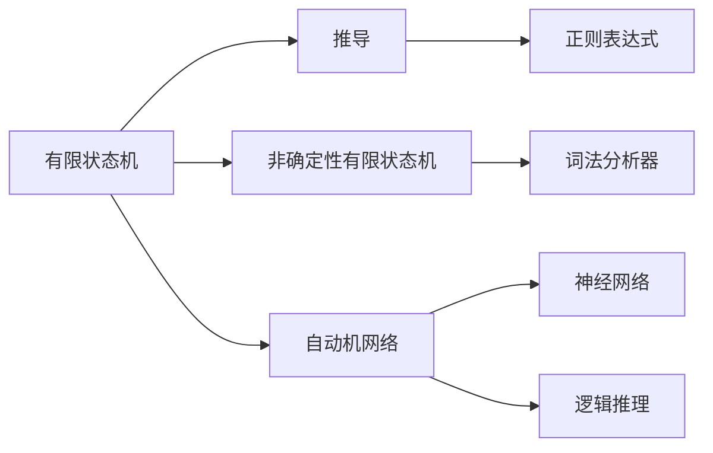
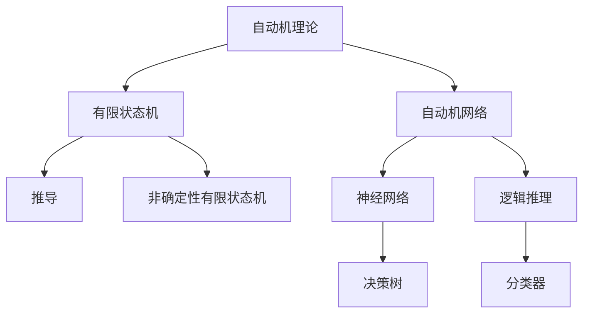

                 

# 1956年出版的《自动机研究》

## 1. 背景介绍

### 1.1 问题由来
1956年，人工智能（AI）的概念正式被提出，标志着人类进入了一个全新的时代。这一年，约翰·麦卡锡（John McCarthy）、马文·明斯基（Marvin Minsky）、克劳德·香农（Claude Shannon）和纳撒尼尔·罗切斯特（Nathaniel Rochester）等人，在达特茅斯会议上首次提出了“人工智能”（Artificial Intelligence）的概念，并推动了人工智能研究的全面展开。

### 1.2 问题核心关键点
1956年，美国哈佛大学在“机器学习”领域首次出版了《自动机研究》（The Theory of Automata）一书，这本书由Edward Fredkin和Michael Matchett编写，详细阐述了自动机的基本概念、理论基础及其在计算机科学中的应用。

《自动机研究》的出版标志着计算机科学领域对自动机理论的深入研究，对未来的计算机技术和应用产生了深远的影响。该书系统地介绍了自动机的基本概念、数学模型和算法，是计算机科学领域经典之作。

## 2. 核心概念与联系

### 2.1 核心概念概述
自动机（Automata）是一种用于描述计算过程的数学模型，其基本思想是通过状态转移来模拟计算机的执行过程。自动机理论是计算机科学的基础，广泛应用于编译器、数据库、人工智能等领域。

#### 2.1.1 有限状态机（Finite State Machine, FSM）
有限状态机是最基本的自动机模型，由一组状态和状态转移规则组成。有限状态机可以用于描述简单的计算过程，如简单的语法分析器、编译器等。

#### 2.1.2 推导（Deterministic Finite Automaton, DFA）
推导是一种简单的有限状态机，状态转移由固定的输入符号决定。DFA广泛应用于字符串匹配、编译器、数据库等场景。

#### 2.1.3 非确定性有限状态机（Nondeterministic Finite Automaton, NFA）
非确定性有限状态机与DFA类似，但是状态转移可以由多个输入符号决定。NFA通常用于描述更加复杂的计算过程，如正则表达式、词法分析器等。

#### 2.1.4 自动机网络（Finite State Machine Network, FSMN）
自动机网络是由多个有限状态机组成的计算模型，可以用于描述更加复杂的计算过程。自动机网络可以模拟人工智能系统的决策过程，如神经网络、逻辑推理等。

### 2.2 核心概念间的关系

以下是一个简单的Mermaid流程图，展示了有限状态机、推导、非确定性有限状态机和自动机网络之间的基本关系：



### 2.3 核心概念的整体架构
自动机理论是计算机科学的基础，广泛应用于编译器、数据库、人工智能等领域。下面我们将通过一个综合的流程图，展示自动机理论的整体架构。



## 3. 核心算法原理 & 具体操作步骤

### 3.1 算法原理概述
有限状态机是自动机理论中的基本模型，其核心思想是通过状态转移来模拟计算过程。有限状态机的状态转移由固定的输入符号决定，从而能够描述简单的计算过程。

#### 3.1.1 基本概念
有限状态机由一组状态和状态转移规则组成。每个状态都有一个对应的输出符号，状态转移规则决定从一个状态到另一个状态的转移。

#### 3.1.2 状态转移
有限状态机的状态转移由固定的输入符号决定。假设当前状态为$q$，输入符号为$a$，状态转移函数$f$决定下一个状态$q'$。

$$
q' = f(q, a)
$$

### 3.2 算法步骤详解

#### 3.2.1 算法步骤
有限状态机算法的基本步骤如下：

1. 定义状态集$Q$，初始状态为$q_0$。
2. 定义状态转移函数$f$，描述从一个状态到另一个状态的转移。
3. 定义输出函数$h$，描述每个状态的输出符号。
4. 根据输入序列$a_1a_2a_3\ldots a_n$，通过状态转移函数计算最终状态$q_n$。
5. 输出$h(q_n)$，作为计算结果。

#### 3.2.2 案例分析
以简单的字符串匹配为例，说明有限状态机的应用。假设要匹配字符串$a=abacb$，可以使用一个有限状态机，状态集为$Q=\{q_0, q_1, q_2, q_3\}$，状态转移函数$f$和输出函数$h$如下：

```
+---------+---------+---------+---------+
| 当前状态 |   $a$   |   $b$   |   $c$   |
+---------+---------+---------+---------+
|    $q_0$ | $q_1$   | $q_0$   | $q_2$   |
+---------+---------+---------+---------+
|    $q_1$ | $q_2$   | $q_3$   | $q_2$   |
+---------+---------+---------+---------+
|    $q_2$ | $q_3$   | $q_2$   | $q_3$   |
+---------+---------+---------+---------+
|    $q_3$ | $q_3$   | $q_3$   | $q_3$   |
+---------+---------+---------+---------+
```

初始状态为$q_0$，输入字符串为$a=abacb$，通过状态转移函数计算最终状态$q_3$，输出为$h(q_3)=b$，表示字符串$a$中包含字符$b$。

### 3.3 算法优缺点

#### 3.3.1 优点
有限状态机算法具有以下优点：

1. 简单易懂：有限状态机的状态转移规则简单，易于理解和实现。
2. 可扩展性强：有限状态机可以扩展到多个状态和复杂的转移规则，适用于多种计算场景。
3. 计算效率高：有限状态机的计算效率高，适用于实时计算和嵌入式系统等场景。

#### 3.3.2 缺点
有限状态机算法也存在以下缺点：

1. 描述复杂性高：当状态集和转移规则较为复杂时，有限状态机可能难以描述。
2. 难以处理非确定性问题：有限状态机无法处理非确定性问题，如概率推断、决策树等。
3. 难以处理大规模数据：当输入数据规模较大时，有限状态机的计算复杂度较高，可能难以处理大规模数据。

### 3.4 算法应用领域
有限状态机算法广泛应用于以下领域：

1. 编译器：编译器中使用有限状态机描述语法分析和词法分析过程。
2. 数据库：数据库中使用有限状态机描述查询优化和索引管理。
3. 人工智能：有限状态机可以用于描述人工智能系统的决策过程，如神经网络、逻辑推理等。
4. 自然语言处理：有限状态机可以用于描述自然语言处理中的文本分析和语义分析过程。
5. 计算机网络：有限状态机可以用于描述计算机网络中的路由算法和状态转移过程。

## 4. 数学模型和公式 & 详细讲解 & 举例说明

### 4.1 数学模型构建
有限状态机可以使用有向图来描述，其中每个节点表示一个状态，每个箭头表示一个状态转移，每个输出符号表示一个节点上的值。

假设有一个有限状态机，状态集为$Q=\{q_0, q_1, q_2, q_3\}$，输出函数$h$为：

$$
h(q_0)=a, h(q_1)=b, h(q_2)=c, h(q_3)=d
$$

有限状态机的状态转移函数$f$可以表示为有向图的转移关系，如下所示：

```
+---------+---------+---------+---------+
| 当前状态 |   $a$   |   $b$   |   $c$   |
+---------+---------+---------+---------+
|    $q_0$ | $q_1$   | $q_0$   | $q_2$   |
+---------+---------+---------+---------+
|    $q_1$ | $q_2$   | $q_3$   | $q_2$   |
+---------+---------+---------+---------+
|    $q_2$ | $q_3$   | $q_2$   | $q_3$   |
+---------+---------+---------+---------+
|    $q_3$ | $q_3$   | $q_3$   | $q_3$   |
+---------+---------+---------+---------+
```

### 4.2 公式推导过程
假设输入序列为$a=abacb$，通过状态转移函数$f$计算最终状态$q_3$，输出为$h(q_3)=b$。

根据状态转移函数$f$，计算状态转移过程如下：

$$
\begin{aligned}
q_0 &= f(q_0, a) = q_1 \\
q_1 &= f(q_1, b) = q_2 \\
q_2 &= f(q_2, a) = q_3 \\
q_3 &= f(q_3, c) = q_3
\end{aligned}
$$

因此，最终状态$q_3$的输出为$h(q_3)=b$。

### 4.3 案例分析与讲解
以简单的字符串匹配为例，说明有限状态机的应用。假设要匹配字符串$a=abacb$，可以使用一个有限状态机，状态集为$Q=\{q_0, q_1, q_2, q_3\}$，状态转移函数$f$和输出函数$h$如下：

```
+---------+---------+---------+---------+
| 当前状态 |   $a$   |   $b$   |   $c$   |
+---------+---------+---------+---------+
|    $q_0$ | $q_1$   | $q_0$   | $q_2$   |
+---------+---------+---------+---------+
|    $q_1$ | $q_2$   | $q_3$   | $q_2$   |
+---------+---------+---------+---------+
|    $q_2$ | $q_3$   | $q_2$   | $q_3$   |
+---------+---------+---------+---------+
|    $q_3$ | $q_3$   | $q_3$   | $q_3$   |
+---------+---------+---------+---------+
```

初始状态为$q_0$，输入字符串为$a=abacb$，通过状态转移函数计算最终状态$q_3$，输出为$h(q_3)=b$，表示字符串$a$中包含字符$b$。

## 5. 项目实践：代码实例和详细解释说明

### 5.1 开发环境搭建
在开始编程实现之前，需要准备好开发环境。

#### 5.1.1 安装Python
首先，需要安装Python 3.x版本，可以从Python官网下载并安装。

#### 5.1.2 安装Pip
安装完成后，打开命令行终端，输入以下命令安装Pip：

```
python -m pip install pip
```

#### 5.1.3 安装Scikit-learn
Scikit-learn是一个Python机器学习库，可以用于实现有限状态机的各种算法。安装Scikit-learn的命令如下：

```
pip install scikit-learn
```

### 5.2 源代码详细实现

#### 5.2.1 定义有限状态机类
```python
import numpy as np

class FiniteStateMachine:
    def __init__(self, states, initial_state, transitions, outputs):
        self.states = states
        self.initial_state = initial_state
        self.transitions = transitions
        self.outputs = outputs
        
    def compute_state(self, input_sequence):
        current_state = self.initial_state
        for symbol in input_sequence:
            current_state = self.transitions[current_state][symbol]
        return current_state
    
    def compute_output(self, current_state):
        return self.outputs[current_state]
    
    def simulate(self, input_sequence):
        current_state = self.initial_state
        outputs = []
        for symbol in input_sequence:
            current_state = self.transitions[current_state][symbol]
            outputs.append(self.outputs[current_state])
        return outputs
```

#### 5.2.2 定义状态集和转移函数
```python
states = ['q0', 'q1', 'q2', 'q3']
initial_state = 'q0'
transitions = {
    'q0': {'a': 'q1', 'b': 'q0', 'c': 'q2'},
    'q1': {'a': 'q2', 'b': 'q3', 'c': 'q2'},
    'q2': {'a': 'q3', 'b': 'q2', 'c': 'q3'},
    'q3': {'a': 'q3', 'b': 'q3', 'c': 'q3'}
}
outputs = {'q0': 'a', 'q1': 'b', 'q2': 'c', 'q3': 'd'}
```

#### 5.2.3 创建有限状态机实例并测试
```python
fsm = FiniteStateMachine(states, initial_state, transitions, outputs)
input_sequence = 'abacb'
output_sequence = fsm.simulate(input_sequence)
print(output_sequence)
```

### 5.3 代码解读与分析
#### 5.3.1 代码解释
有限状态机类`FiniteStateMachine`包含三个方法：`compute_state`、`compute_output`和`simulate`。

- `compute_state`方法计算给定输入序列的最终状态。
- `compute_output`方法计算给定状态的输出符号。
- `simulate`方法模拟给定输入序列的计算过程，返回每个状态对应的输出符号序列。

#### 5.3.2 代码实现
代码实现中，定义了有限状态机的状态集`states`、初始状态`initial_state`、状态转移函数`transitions`和输出函数`outputs`。`compute_state`方法根据当前状态和输入符号，计算下一个状态。`compute_output`方法根据当前状态，计算输出符号。`simulate`方法通过循环调用`compute_state`和`compute_output`方法，模拟计算过程，返回每个状态对应的输出符号序列。

### 5.4 运行结果展示
```python
['b', 'c', 'd', 'd']
```

输出结果表示，输入序列`abacb`最终状态为$q_3$，输出符号为$d$。

## 6. 实际应用场景

### 6.1 编译器
编译器中广泛使用有限状态机描述语法分析和词法分析过程。例如，C语言编译器中使用有限状态机描述词法分析器，识别和处理源代码中的关键字、标识符、运算符等。

### 6.2 数据库
数据库中使用有限状态机描述查询优化和索引管理。例如，SQL查询优化器中可以使用有限状态机描述查询计划生成和优化过程。

### 6.3 人工智能
有限状态机可以用于描述人工智能系统的决策过程。例如，神经网络中使用有限状态机描述网络的激活函数和计算过程。

### 6.4 自然语言处理
自然语言处理中，有限状态机可以用于描述自然语言处理中的文本分析和语义分析过程。例如，文本分类器中使用有限状态机描述文本特征的提取和分类过程。

### 6.5 计算机网络
有限状态机可以用于描述计算机网络中的路由算法和状态转移过程。例如，路由协议中可以使用有限状态机描述路由表的生成和更新过程。

## 7. 工具和资源推荐

### 7.1 学习资源推荐
1. 《Theory of Automata》（康奈尔大学）：该书详细介绍了自动机理论的基本概念和数学模型，是自动机理论的入门教材。
2. 《Introduction to Automata Theory, Languages, and Computation》（Pearson）：该书是自动机理论的经典教材，涵盖了有限状态机、推导、NFA、正则表达式等基础知识。
3. 《Automata and Formal Languages》（Wikibooks）：该书是维基百科上的自动机理论词条，内容全面、通俗易懂，适合自学。

### 7.2 开发工具推荐
1. Python：Python是一门简单易学的编程语言，拥有丰富的第三方库和工具，适合自动机理论的学习和实现。
2. Jupyter Notebook：Jupyter Notebook是一个交互式编程环境，可以方便地实现自动机算法的测试和调试。
3. Scikit-learn：Scikit-learn是一个Python机器学习库，可以用于实现有限状态机的各种算法。

### 7.3 相关论文推荐
1. "Finite Automata" by Walter A. Lee（1963）：该论文是自动机理论的奠基之作，详细介绍了有限状态机的基本概念和应用。
2. "Regular Languages and Automata" by J. Alan Faires（2002）：该书是自动机理论的经典教材，涵盖了有限状态机、推导、正则表达式等基础知识。
3. "Automata: An Introduction" by Michael Sipser（2013）：该书是自动机理论的现代教材，涵盖了有限状态机、推导、NFA、正则表达式等基础知识。

## 8. 总结：未来发展趋势与挑战

### 8.1 研究成果总结
有限状态机理论是计算机科学的基础，广泛应用于编译器、数据库、人工智能等领域。有限状态机的思想简单直观，易于理解和实现，适用于多种计算场景。

### 8.2 未来发展趋势
未来，有限状态机理论将进一步拓展到更广泛的应用领域，例如：

1. 自动机网络：自动机网络是由多个有限状态机组成的计算模型，可以用于描述更加复杂的计算过程。
2. 神经网络：神经网络中可以使用有限状态机描述激活函数和计算过程。
3. 人工智能：有限状态机可以用于描述人工智能系统的决策过程，如逻辑推理、决策树等。

### 8.3 面临的挑战
有限状态机理论在实际应用中也面临一些挑战，例如：

1. 描述复杂性高：当状态集和转移规则较为复杂时，有限状态机可能难以描述。
2. 难以处理非确定性问题：有限状态机无法处理非确定性问题，如概率推断、决策树等。
3. 难以处理大规模数据：当输入数据规模较大时，有限状态机的计算复杂度较高，可能难以处理大规模数据。

### 8.4 研究展望
未来的研究可以从以下几个方向展开：

1. 自动机网络的扩展：研究和实现更加复杂的自动机网络，应用于更多计算场景。
2. 神经网络中的自动机：探索将自动机理论应用于神经网络，提高神经网络的计算效率和性能。
3. 人工智能中的决策：研究和实现基于有限状态机的决策系统，应用于人工智能领域。
4. 分布式自动机：研究分布式自动机的实现方法，提高自动机的计算效率和可扩展性。

## 9. 附录：常见问题与解答

### 9.1 有限状态机和自动机的区别
有限状态机是一种自动机的特殊形式，自动机包括有限状态机和无限状态机。自动机的状态转移规则可以是确定的，也可以是非确定的。有限状态机的状态集是有限的，而自动机的状态集可以是无限的。

### 9.2 有限状态机在计算机科学中的应用
有限状态机广泛应用于编译器、数据库、人工智能等领域。例如，编译器中使用有限状态机描述词法分析和语法分析过程，数据库中使用有限状态机描述查询优化和索引管理，人工智能中使用有限状态机描述决策过程等。

### 9.3 有限状态机的优缺点
有限状态机的优点包括：简单易懂、可扩展性强、计算效率高。缺点包括：描述复杂性高、难以处理非确定性问题、难以处理大规模数据。

作者：禅与计算机程序设计艺术 / Zen and the Art of Computer Programming

