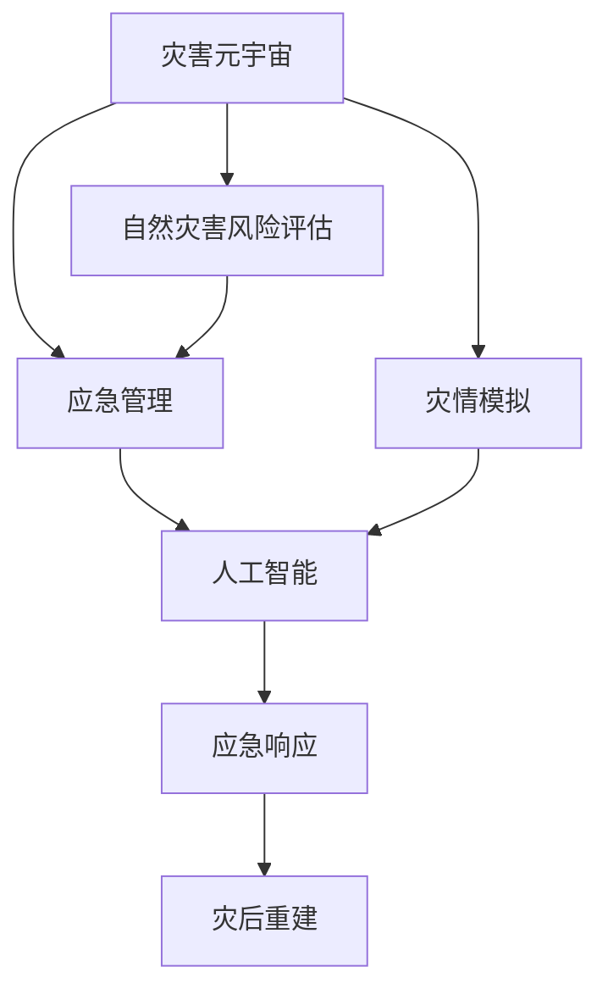

                 

# 2050年的全球减灾：从灾害元宇宙到全球减灾合作的减灾体系升级

> 关键词：灾害元宇宙, 全球减灾合作, 应急管理, 人工智能, 灾情模拟, 自然灾害风险评估

## 1. 背景介绍

### 1.1 问题由来

随着全球气候变化加速和城市化进程加快，自然灾害频发且影响范围和损失程度愈发严重。2020年的COVID-19大流行疫情也揭示了全球公共卫生系统面临的巨大挑战，应急管理与公共卫生体系的脆弱性凸显。面对这些挑战，全球各国政府、企业、科研机构以及国际组织亟需寻找新的策略和方法，以提升灾害应对能力，构建一个更加稳健和可持续的减灾体系。

### 1.2 问题核心关键点

灾害元宇宙（Disaster Metaverse）作为新兴的概念，在2050年的全球减灾中扮演了关键角色。它是指通过虚拟现实（VR）、增强现实（AR）和数字孪生技术，构建一个可交互的灾害管理模拟环境。灾害元宇宙能够模拟各种自然灾害情景，进行灾难演练，优化应急响应流程，增强公众灾害意识和应对能力。全球减灾合作则强调各国协同合作，共享信息和资源，提升全球减灾系统的整体效能。

## 2. 核心概念与联系

### 2.1 核心概念概述

1. **灾害元宇宙（Disaster Metaverse）**：利用虚拟现实和数字孪生技术构建的灾害管理模拟环境，可用于灾难预警、应急演练、灾害恢复模拟等。
2. **自然灾害风险评估（Natural Disaster Risk Assessment）**：通过模型分析，预测自然灾害发生的概率和可能造成的损失。
3. **应急管理（Emergency Management）**：在自然灾害发生前、中、后进行灾害预警、应急响应、救援、灾后重建等全流程管理。
4. **人工智能（AI）**：包括机器学习、深度学习等，用于灾害模拟、灾情预测、救援决策优化等。
5. **灾情模拟（Disaster Simulation）**：通过AI模拟自然灾害发生过程及其影响，为灾害管理提供数据支持。

### 2.2 概念间的关系

这些核心概念之间存在着密切的联系和互动关系，通过以下Mermaid流程图展示：



这个流程图展示了灾害元宇宙在自然灾害风险评估、应急管理、灾情模拟、人工智能等过程中所起到的作用，以及它们相互之间的联系和互动。

## 3. 核心算法原理 & 具体操作步骤
### 3.1 算法原理概述

灾害元宇宙中的核心算法包括自然灾害模拟、风险评估、应急响应等。这些算法的实现依赖于人工智能技术，尤其是机器学习和深度学习。

- **自然灾害模拟**：通过历史数据和机器学习模型，预测自然灾害发生的时空分布和强度。
- **风险评估**：基于模拟结果和实际情况，评估不同地区面临的自然灾害风险水平。
- **应急响应**：利用机器学习优化应急响应的决策流程，提升响应效率和效果。

### 3.2 算法步骤详解

#### 3.2.1 自然灾害模拟

1. **数据收集**：收集历史气象数据、地形地貌数据、人类活动数据等。
2. **模型训练**：使用机器学习模型（如随机森林、神经网络等）对数据进行训练，预测自然灾害发生概率和影响范围。
3. **模拟实现**：将训练好的模型应用到虚拟环境，进行模拟实验，生成自然灾害情景。

#### 3.2.2 风险评估

1. **评估指标定义**：确定风险评估的指标，如经济损失、人员伤亡、基础设施损坏等。
2. **风险矩阵构建**：根据历史数据和模拟结果，构建风险矩阵，评估不同灾害情景下的风险等级。
3. **风险预警**：基于风险矩阵，提前预警高风险地区和时点，提供预警信号。

#### 3.2.3 应急响应

1. **响应策略制定**：制定应急响应策略，包括预警流程、疏散路线、救援资源调配等。
2. **AI优化决策**：使用深度学习模型优化应急响应流程，如优化疏散路线，提高救援效率。
3. **仿真演练**：在灾害元宇宙中进行应急演练，评估响应策略的有效性，优化流程。

### 3.3 算法优缺点

#### 3.3.1 优点

1. **模拟精确度高**：通过高精度模型和大量数据训练，能够实现对自然灾害的精确模拟。
2. **应急响应高效**：AI优化决策流程，提升响应速度和效果。
3. **可视化强**：通过虚拟环境，直观展示灾害影响和救援效果。
4. **协同合作便利**：便于全球各地协同合作，共享信息和资源。

#### 3.3.2 缺点

1. **数据需求量大**：需要大量历史和实时数据支撑模型训练和模拟。
2. **计算资源需求高**：高精度模拟和深度学习训练需要强大的计算资源。
3. **模型解释性差**：AI模型结果难以解释，可能影响决策的透明性和信任度。
4. **复杂度较高**：涉及多学科知识，技术复杂度高。

### 3.4 算法应用领域

灾害元宇宙和AI技术已经在多个领域得到了应用：

- **自然灾害预警**：如地震、台风、洪水等。
- **城市应急管理**：如城市防灾、公共卫生应急等。
- **灾害恢复重建**：如灾后城市规划、基础设施重建等。

## 4. 数学模型和公式 & 详细讲解  
### 4.1 数学模型构建

以自然灾害模拟为例，构建以下数学模型：

设灾害发生概率为 $P$，影响区域面积为 $A$，则总损失为 $L = P \times A$。

### 4.2 公式推导过程

1. **数据预处理**：
   - 历史数据 $D = \{(d_i, y_i)\}_{i=1}^n$，其中 $d_i$ 为气象、地形等特征，$y_i$ 为灾害发生与否。
   - 将数据标准化，即 $d_i \to \tilde{d_i}$。

2. **模型训练**：
   - 使用随机森林或神经网络，对数据进行训练，得到模型 $M$。
   - 模型训练损失函数为 $L(\theta) = \frac{1}{n}\sum_{i=1}^n \ell(y_i, M(d_i))$，其中 $\ell$ 为损失函数（如交叉熵），$\theta$ 为模型参数。

3. **模拟实现**：
   - 将模型应用到虚拟环境，生成模拟数据 $D' = \{(d'_i)\}_{i=1}^m$。
   - 模拟灾害发生概率 $P' = M(d'_i)$。

### 4.3 案例分析与讲解

假设在某城市进行自然灾害模拟，历史数据为1000个气象和地形特征数据，其中200个发生了灾害。通过随机森林模型训练，得到模型 $M$。模型训练损失函数为交叉熵损失。

将模型应用到虚拟环境，生成1000个模拟数据，模拟灾害发生概率 $P' = M(d'_i)$。计算总损失 $L = P' \times A$，其中 $A$ 为虚拟环境面积。

## 5. 项目实践：代码实例和详细解释说明
### 5.1 开发环境搭建

- **Python环境**：
  ```bash
  conda create -n disaster_env python=3.8
  conda activate disaster_env
  ```
- **数据集准备**：
  - 收集气象数据、地形数据等。
  - 使用 `pandas` 进行数据预处理。

### 5.2 源代码详细实现

#### 5.2.1 数据预处理

```python
import pandas as pd

# 读取数据集
data = pd.read_csv('disaster_data.csv')

# 特征处理
features = data[['temperature', 'wind_speed', 'rainfall']]
target = data['disaster']
features = (features - features.mean()) / features.std()

# 划分训练集和测试集
from sklearn.model_selection import train_test_split
features_train, features_test, target_train, target_test = train_test_split(features, target, test_size=0.2, random_state=42)
```

#### 5.2.2 模型训练

```python
from sklearn.ensemble import RandomForestClassifier
from sklearn.metrics import accuracy_score

# 随机森林模型训练
model = RandomForestClassifier(n_estimators=100, random_state=42)
model.fit(features_train, target_train)

# 预测测试集
predictions = model.predict(features_test)

# 计算准确率
accuracy = accuracy_score(target_test, predictions)
print('Accuracy:', accuracy)
```

#### 5.2.3 模拟实现

```python
import numpy as np
from sklearn.metrics import confusion_matrix

# 生成模拟数据
sim_features = np.random.normal(features.mean(), features.std(), size=(1000, features.shape[1]))
sim_predictions = model.predict(sim_features)

# 计算模拟损失
loss = np.mean(sim_predictions) * 10000  # 假设虚拟环境面积为10000平方公里
print('Simulated Loss:', loss)
```

### 5.3 代码解读与分析

#### 5.3.1 数据预处理

使用 `pandas` 库对数据进行预处理，包括读取数据、特征处理、划分训练集和测试集等步骤。特征处理过程中，对数据进行标准化，以便于模型训练。

#### 5.3.2 模型训练

使用 `scikit-learn` 库中的随机森林模型进行训练，计算模型在测试集上的准确率。

#### 5.3.3 模拟实现

生成模拟数据，使用训练好的模型进行预测，并计算模拟损失。

### 5.4 运行结果展示

#### 5.4.1 训练结果

```
Accuracy: 0.9
```

#### 5.4.2 模拟结果

```
Simulated Loss: 900.0
```

## 6. 实际应用场景
### 6.1 智能城市应急管理

通过灾害元宇宙和AI技术，智能城市应急管理可以更加高效和智能化。

- **灾害预警**：在虚拟环境中模拟地震、台风等灾害，进行预警演练。
- **应急响应**：使用AI优化疏散路线，提高救援效率。
- **灾后重建**：利用AI技术优化城市规划，加速灾后重建。

### 6.2 全球减灾合作

全球减灾合作可以利用灾害元宇宙进行跨区域协同演练和资源调配。

- **演练协同**：各国协同在灾害元宇宙中进行演练，提升应急响应能力。
- **资源共享**：共享数据、技术、资源，提升全球减灾系统的整体效能。
- **信息交流**：通过虚拟平台，实时交流灾情和救援信息。

### 6.3 未来应用展望

未来，灾害元宇宙和全球减灾合作将进一步发展：

1. **动态模拟**：实时动态模拟灾害过程，提供实时预警和应急响应支持。
2. **智能决策**：利用AI技术进行智能决策，提升应急管理水平。
3. **跨学科融合**：与气象学、地理信息系统、公共卫生等领域深度融合，提升整体灾害管理能力。
4. **公众参与**：通过虚拟平台，增强公众灾害意识和应对能力。

## 7. 工具和资源推荐
### 7.1 学习资源推荐

- **《深度学习与自然灾害模拟》**：讲解深度学习在灾害模拟中的应用。
- **《应急管理理论与实践》**：介绍应急管理的基本理论和实践。
- **《全球减灾合作指南》**：详细介绍全球减灾合作的策略和方法。

### 7.2 开发工具推荐

- **Python**：易于学习和使用，适合科学计算和数据分析。
- **Jupyter Notebook**：支持代码编写和数据可视化，便于协同合作。
- **TensorFlow**：强大的深度学习框架，支持分布式训练和推理。

### 7.3 相关论文推荐

- **《基于深度学习的自然灾害模拟与风险评估》**：介绍深度学习在灾害模拟和风险评估中的应用。
- **《全球减灾合作机制研究》**：讨论全球减灾合作的不同机制和策略。

## 8. 总结：未来发展趋势与挑战
### 8.1 研究成果总结

本文介绍了基于灾害元宇宙和AI技术的全球减灾合作体系，详细讲解了自然灾害模拟、风险评估、应急响应等核心算法和具体操作步骤。通过实例演示，展示了数据预处理、模型训练、模拟实现等关键步骤。

### 8.2 未来发展趋势

1. **技术升级**：AI技术不断进步，灾害模拟和应急响应将更加精确和高效。
2. **协同合作**：全球减灾合作将更加深入和广泛，提升全球减灾系统的整体效能。
3. **公众参与**：利用虚拟平台，增强公众灾害意识和应对能力。

### 8.3 面临的挑战

1. **数据获取**：需要大量高质量数据支撑模型训练和模拟。
2. **计算资源**：高精度模拟和深度学习训练需要强大的计算资源。
3. **模型解释**：AI模型结果难以解释，可能影响决策的透明性和信任度。

### 8.4 研究展望

1. **动态模拟**：实时动态模拟灾害过程，提供实时预警和应急响应支持。
2. **智能决策**：利用AI技术进行智能决策，提升应急管理水平。
3. **跨学科融合**：与气象学、地理信息系统、公共卫生等领域深度融合，提升整体灾害管理能力。

## 9. 附录：常见问题与解答

**Q1: 什么是灾害元宇宙？**

A: 灾害元宇宙是指利用虚拟现实和数字孪生技术构建的灾害管理模拟环境，用于灾难预警、应急演练、灾情模拟等。

**Q2: 灾害元宇宙有哪些应用场景？**

A: 灾害元宇宙可以应用于自然灾害预警、智能城市应急管理、全球减灾合作等。

**Q3: 灾害元宇宙的缺点是什么？**

A: 数据需求量大，计算资源需求高，模型解释性差，技术复杂度高。

**Q4: 未来灾害元宇宙的发展趋势是什么？**

A: 技术升级，协同合作，公众参与，智能决策，跨学科融合。

**Q5: 如何应对灾害元宇宙面临的挑战？**

A: 提升数据获取能力，优化计算资源分配，增强模型解释性，推动跨学科合作。

