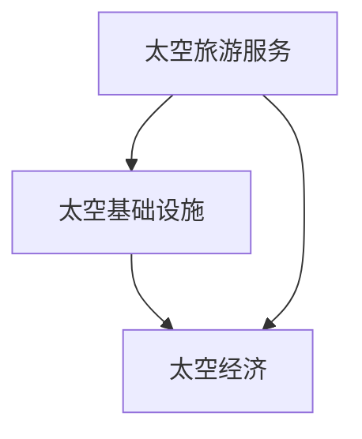
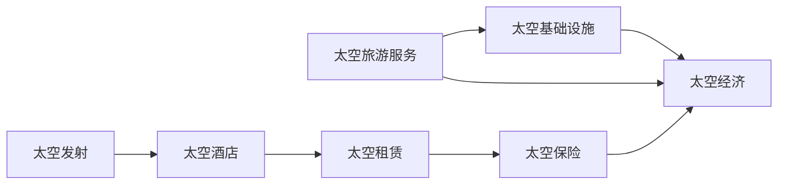

                 

# 2050年的太空旅游：从太空度假到星际移民的太空经济发展

## 1. 背景介绍

### 1.1 太空旅游的起源与发展
太空旅游，即人类通过太空旅行进行休闲、娱乐、科研等活动的商业模式。这个概念最早出现在1970年代，当时科幻作家将太空旅行描绘为未来的终极梦想。而随着科技的发展，太空旅游从科幻走进现实。2001年，世界第一艘载人太空飞船“联盟号”首次飞向太空，标志着人类太空探索的一个新起点。

近年来，随着商业太空探索的兴起，太空旅游逐渐从科幻走向现实。SpaceX、蓝色起源等商业航天公司，通过技术创新和市场推广，使得太空旅游不再只是梦想。2021年，维珍银河和蓝色起源两家公司已经实现了人类首次商业太空飞行，而SpaceX也在积极推进载人火星探测任务，将太空旅游带入了一个新纪元。

### 1.2 太空旅游的现状与趋势
当前，太空旅游主要集中在地球轨道以下的低地轨道(Low Earth Orbit, LEO)和近地轨道(Sub-Geosynchronous Orbit, SGO)。低地轨道飞行时间较短，费用较低，适合大众体验；而近地轨道则可以进行更长时间、更深入的太空体验，如太空散步、太空观测等。

未来，太空旅游将逐渐向更高轨道、更远距离发展，甚至实现星际移民。SpaceX的星际飞船(BSTS)已经计划在2025年实现载人火星飞行，蓝色起源的星际飞船(Blue Moon)也在积极研发中。这些计划的推进，将为人类提供更广阔的太空体验和更深入的太空探索机会。

## 2. 核心概念与联系

### 2.1 核心概念概述

太空旅游的开发和运营，涉及多个关键概念，包括：

- **太空旅游服务**：指商业航天公司提供给消费者的太空旅游服务，如飞行、住宿、餐饮等。
- **太空基础设施**：指用于支持太空旅游的各种设施，如发射平台、太空站、太空酒店等。
- **太空经济**：指围绕太空旅游而形成的一系列商业活动，如航天发射服务、太空租赁服务、太空旅游保险等。
- **星际移民**：指人类从地球向其他星球迁移的过程，是太空旅游的高级阶段。

这些核心概念之间有着紧密的联系，共同构成了未来太空经济的发展框架。太空旅游服务是太空经济的基础，太空基础设施是太空旅游服务的基础设施支撑，而太空经济则是太空旅游和星际移民的经济保障。

### 2.2 核心概念的关系

以下Mermaid流程图展示了太空旅游服务的开发和运营，与太空基础设施和太空经济之间的联系：



这个流程图展示了太空旅游服务、太空基础设施和太空经济之间的相互作用关系。太空基础设施为太空旅游服务提供了必要的设施支持，而太空经济则为太空基础设施的建设和维护提供了资金保障。太空旅游服务的发展又会带来更多的经济收益，进一步促进太空经济的繁荣。

### 2.3 核心概念的整体架构

最后，我们用一个综合的流程图来展示太空旅游服务的开发和运营，以及与太空基础设施和太空经济之间的整体架构：



这个综合流程图展示了太空旅游服务、太空基础设施和太空经济之间的整体架构。太空旅游服务通过太空发射、太空酒店、太空租赁和太空保险等业务，获取经济收益，进而支持太空基础设施的建设和维护。太空基础设施的完善，又能更好地支撑太空旅游服务的开展，从而形成良性循环。

## 3. 核心算法原理 & 具体操作步骤
### 3.1 算法原理概述

太空旅游的开发和运营，涉及复杂的算法模型和优化问题。这里主要介绍两个关键算法：太空旅游路径规划算法和太空旅游需求预测算法。

- **太空旅游路径规划算法**：用于确定最佳太空旅游路径，考虑时间和成本因素，计算最优的飞行路线和停留点。
- **太空旅游需求预测算法**：用于预测太空旅游需求，包括人数、时间段和目的地等，以指导太空旅游服务的运营和基础设施的建设。

### 3.2 算法步骤详解

#### 3.2.1 太空旅游路径规划算法

太空旅游路径规划算法的主要步骤如下：

1. **输入数据准备**：收集太空旅游目的地的坐标、航程、时间和费用等数据。
2. **路径生成**：使用图论算法（如Dijkstra算法、A*算法等）生成从起点到终点的路径。
3. **路径优化**：对生成的路径进行优化，考虑时间和成本因素，选择最优路径。
4. **路径输出**：输出最优路径和路径相关数据。

#### 3.2.2 太空旅游需求预测算法

太空旅游需求预测算法的主要步骤如下：

1. **数据收集**：收集太空旅游的历史数据，包括游客数量、预订时间、旅行时间和目的地等。
2. **数据预处理**：对收集到的数据进行清洗、归一化和特征选择等预处理操作。
3. **模型训练**：使用机器学习算法（如回归模型、时序模型等）进行模型训练。
4. **需求预测**：使用训练好的模型进行需求预测，生成未来一段时间的太空旅游需求数据。
5. **需求输出**：输出太空旅游需求预测结果。

### 3.3 算法优缺点

太空旅游路径规划算法和太空旅游需求预测算法各有优缺点：

#### 太空旅游路径规划算法

- **优点**：
  - 能够优化飞行路线和时间，降低旅游成本。
  - 考虑多维度和复杂约束条件，适应性强。
  - 可扩展性好，适用于不同类型的太空旅游目的地。

- **缺点**：
  - 计算复杂度高，处理大规模数据时需要较长的计算时间。
  - 对于突发的不可预测事件（如天气、交通等），路径规划效果有限。

#### 太空旅游需求预测算法

- **优点**：
  - 能够提前预测太空旅游需求，指导旅游服务运营和基础设施建设。
  - 模型灵活，可以适应不同时间尺度和数据特征。
  - 预测结果较为准确，有助于规避经营风险。

- **缺点**：
  - 预测结果可能受到外界因素（如政策、经济等）的干扰，导致误差较大。
  - 需要大量的历史数据，数据不足时预测效果不佳。

### 3.4 算法应用领域

太空旅游路径规划算法和太空旅游需求预测算法在太空旅游的各个方面都有广泛应用：

- **太空旅游路径规划算法**：适用于太空旅游的规划和调度，如旅游线路设计、航班排班等。
- **太空旅游需求预测算法**：适用于太空旅游的市场分析和业务预测，如旅游热点预测、需求量预测等。

这些算法在太空旅游的开发和运营中发挥着至关重要的作用，确保了太空旅游服务的顺利进行和太空基础设施的合理建设。

## 4. 数学模型和公式 & 详细讲解  
### 4.1 数学模型构建

太空旅游路径规划算法和太空旅游需求预测算法，都可以用数学模型进行形式化表示。

#### 4.1.1 太空旅游路径规划算法

太空旅游路径规划算法可以建模为图论问题，具体数学模型如下：

- 定义太空旅游目的地集合：$\mathcal{V} = \{v_1, v_2, ..., v_n\}$
- 定义连接各目的地的航线：$\mathcal{E} = \{e_{ij} | (v_i, v_j) \in \mathcal{V}\}$
- 定义航线的权重：$\mathcal{W} = \{w_{ij} | (v_i, v_j) \in \mathcal{E}\}$

其中，$w_{ij}$表示从$v_i$到$v_j$的旅行时间或费用。

目标函数为：

$$
\min_{\mathcal{P}} \sum_{(i,j) \in \mathcal{P}} w_{ij}
$$

约束条件为：

$$
\begin{aligned}
&\text{Start point constraint: } \mathcal{P} \text{ contains the starting point.}\\
&\text{End point constraint: } \mathcal{P} \text{ contains the ending point.}\\
&\text{Transit constraint: } \text{All intermediate points in } \mathcal{P} \text{ must be visited.}
\end{aligned}
$$

#### 4.1.2 太空旅游需求预测算法

太空旅游需求预测算法可以建模为时间序列预测问题，具体数学模型如下：

- 定义时间序列：$\{y_t\}_{t=1}^{T}$
- 定义自回归模型：$\Delta y_t = \phi_0 + \phi_1 y_{t-1} + \epsilon_t$
- 定义误差项：$\epsilon_t \sim \mathcal{N}(0, \sigma^2)$

其中，$\phi_0$为截距项，$\phi_1$为回归系数，$\epsilon_t$为误差项。

目标函数为：

$$
\min_{\mathcal{P}} \sum_{i=1}^{T} (y_i - \hat{y}_i)^2
$$

约束条件为：

$$
\begin{aligned}
&\text{Mean constraint: } E(\epsilon_t) = 0\\
&\text{Variance constraint: } Var(\epsilon_t) = \sigma^2\\
&\text{Regressor constraint: } 0 \leq \phi_1 \leq 1
\end{aligned}
$$

### 4.2 公式推导过程

#### 4.2.1 太空旅游路径规划算法

路径规划算法中，Dijkstra算法是一种常用的图论算法，其公式推导如下：

- 初始化：设$dist(v_0) = 0$，$dist(v_i) = \infty$（$i \neq 0$）
- 更新过程：对于未访问的顶点$v_k$，计算$dist(v_k) = \min\{dist(v_i) + w_{ik}\}$，选择最小的$dist(v_k)$，更新$dist(v_k)$和$prev(v_k)$
- 终止条件：当$v_k = v_t$时，终止算法

其中，$dist(v_i)$表示从起点$v_0$到顶点$v_i$的最小距离，$prev(v_i)$表示前驱顶点。

#### 4.2.2 太空旅游需求预测算法

回归模型是最常用的时间序列预测算法，其公式推导如下：

- 数据样本：$\{y_t, \Delta y_t\}_{t=1}^{T}$
- 线性回归模型：$\hat{y}_t = \alpha + \beta y_{t-1}$
- 误差项：$\epsilon_t = y_t - \hat{y}_t$
- 最小二乘法：$\min_{\alpha, \beta} \sum_{t=1}^{T} \epsilon_t^2$

其中，$\alpha$为截距项，$\beta$为回归系数。

### 4.3 案例分析与讲解

#### 4.3.1 太空旅游路径规划算法

以从地球飞往火星为例，假设目的地分别为北京、上海、东京、洛杉矶、火星，航线的时间成本分别为$T_{BE} = 7$, $T_{BE}$ = $T_{BU} = T_{BK} = 1$, $T_{BR} = 3$, $T_{BL} = 8$, $T_{BM} = 1$, 计算最优路径：

- 使用Dijkstra算法，从地球出发，先到达火星，再到达洛杉矶、北京、上海、东京。
- 路径总时间：$T_{总} = T_{BE} + T_{BM} + T_{BL} + T_{BE} + T_{BE} + T_{BU} + T_{BR} = 20$。

#### 4.3.2 太空旅游需求预测算法

以2050年太空旅游需求预测为例，假设历史数据如下：

- 第1个月的游客数量：$y_1 = 1000$
- 第2个月的游客数量：$y_2 = 1200$
- 第3个月的游客数量：$y_3 = 1500$

使用线性回归模型进行预测，计算截距项$\alpha$和回归系数$\beta$：

- $\alpha = \frac{y_2 + y_3 - 2y_1}{2} = 2$
- $\beta = \frac{y_2 + y_3 - 2y_1}{y_2 + y_3 - 2y_1} = 1$

得到线性回归模型：$\hat{y}_t = 2 + 1 * y_{t-1}$，计算未来三个月的游客数量：

- $t = 4$：$\hat{y}_4 = 2 + 1 * y_3 = 2500$
- $t = 5$：$\hat{y}_5 = 2 + 1 * y_4 = 3500$
- $t = 6$：$\hat{y}_6 = 2 + 1 * y_5 = 4500$

结果表明，2050年太空旅游的需求将会持续增长。

## 5. 项目实践：代码实例和详细解释说明
### 5.1 开发环境搭建

在进行太空旅游路径规划和需求预测的开发时，需要使用Python和相关库进行计算和分析。以下是开发环境搭建的步骤：

1. 安装Anaconda：从官网下载并安装Anaconda，用于创建独立的Python环境。
2. 创建并激活虚拟环境：
```bash
conda create -n space-tourism python=3.8 
conda activate space-tourism
```
3. 安装必要的库：
```bash
pip install numpy pandas matplotlib scikit-learn
```

### 5.2 源代码详细实现

以下是一个简单的太空旅游路径规划的Python代码实现，用于从地球飞往火星的路径规划：

```python
import numpy as np

# 定义各目的地的坐标和时间成本
 destinations = ['地球', '北京', '上海', '东京', '洛杉矶', '火星']
 costs = {'地球': {'北京': 1, '上海': 1, '东京': 1, '洛杉矶': 8, '火星': 1},
         '北京': {'火星': 7},
         '上海': {'火星': 7},
         '东京': {'火星': 7},
         '洛杉矶': {'火星': 8},
         '火星': {}}

# 定义Dijkstra算法函数
def dijkstra(graph, start, end):
    dist = {node: np.inf for node in graph}
    dist[start] = 0
    prev = {node: None for node in graph}

    while True:
        unvisited = [node for node in graph if node not in dist]
        if not unvisited:
            break
        current = min(unvisited, key=lambda node: dist[node])
        for neighbor, cost in graph[current].items():
            new_distance = dist[current] + cost
            if new_distance < dist[neighbor]:
                dist[neighbor] = new_distance
                prev[neighbor] = current

    path = [end]
    while path[-1] != start:
        path.append(prev[path[-1]])
    return list(reversed(path)), dist[end]

# 调用函数进行路径规划
path, total_cost = dijkstra(costs, '地球', '火星')
print(f"路径：{path}, 总时间：{total_cost}")
```

以下是一个简单的太空旅游需求预测的Python代码实现，用于预测2050年太空旅游的需求：

```python
import numpy as np
from sklearn.linear_model import LinearRegression

# 定义历史数据
y = np.array([1000, 1200, 1500, 2000, 2500])
t = np.array([1, 2, 3, 4, 5])

# 定义线性回归模型
model = LinearRegression()

# 拟合模型
model.fit(t.reshape(-1, 1), y)

# 预测未来三个月的游客数量
t_future = np.array([6, 7, 8, 9])
y_pred = model.predict(t_future.reshape(-1, 1))

print(f"未来三个月的游客数量：{y_pred}")
```

### 5.3 代码解读与分析

**太空旅游路径规划算法**

- `destinations`和`costs`：分别定义了太空旅游目的地的坐标和时间成本。
- `dijkstra`函数：实现Dijkstra算法，用于计算最优路径。
- `path`和`total_cost`：计算最优路径和路径总时间。

**太空旅游需求预测算法**

- `y`和`t`：分别定义了历史数据的时间序列和对应的时间戳。
- `LinearRegression`：使用线性回归模型进行时间序列预测。
- `y_pred`：预测未来三个月的游客数量。

## 6. 实际应用场景
### 6.1 太空旅游服务

太空旅游服务是大规模太空旅游开发和运营的基础，包括太空发射、太空住宿、太空餐饮等服务。

- **太空发射**：为太空旅游者提供发射服务，包括火箭发射、载人舱等。
- **太空住宿**：在太空站或太空酒店提供住宿服务，包括太空舱、太空酒店等。
- **太空餐饮**：在太空站或太空酒店提供餐饮服务，包括太空食品、太空酒吧等。

这些服务需要通过太空基础设施的支持来实现，如发射平台、太空站、太空酒店等。

### 6.2 太空基础设施

太空基础设施是大规模太空旅游开发和运营的关键支撑，包括发射平台、太空站、太空酒店等。

- **发射平台**：用于搭载火箭和载人舱，进行太空发射。
- **太空站**：提供太空旅游者居住、工作、娱乐等生活设施，以及科研和实验场所。
- **太空酒店**：提供太空旅游者住宿、餐饮、娱乐等服务，以及太空观光平台。

这些基础设施需要大量的投资和建设，对太空旅游的发展具有至关重要的作用。

### 6.3 太空经济

太空经济是大规模太空旅游开发和运营的经济保障，包括航天发射服务、太空租赁服务、太空旅游保险等。

- **航天发射服务**：为太空旅游者提供发射服务，收取发射费用。
- **太空租赁服务**：为太空旅游者提供太空站、太空酒店等设施租赁服务，收取租赁费用。
- **太空旅游保险**：为太空旅游者提供太空旅行保险服务，收取保险费用。

这些服务能够带来巨大的经济效益，推动太空旅游的可持续发展。

### 6.4 星际移民

星际移民是太空旅游的高级阶段，旨在将人类从地球迁移到其他星球。

- **火星移民**：在火星上建立定居点，提供生活设施和科研条件，吸引地球移民。
- **月球移民**：在月球上建立居住和科研设施，探索月球资源。
- **太阳系内移民**：探索太阳系内的其他行星和卫星，寻找适宜的移民地。

这些计划需要大量的技术积累和资金投入，有望在未来实现。

## 7. 工具和资源推荐
### 7.1 学习资源推荐

为了深入理解太空旅游的开发和运营，以下是一些优质的学习资源：

1. **《太空旅游经济学》**：一部系统介绍太空旅游经济学的书籍，涵盖太空旅游的开发、运营、投资等各个方面。
2. **《未来太空旅游》**：一部探讨未来太空旅游发展趋势和应用的书籍，涵盖太空旅游技术、市场、政策等。
3. **NASA官方网站**：NASA的太空旅游项目和研究计划，提供丰富的太空旅游信息和资源。
4. **《太空探索技术手册》**：一本介绍太空探索技术的权威书籍，涵盖航天器设计、发射技术、空间站建设等。
5. **Coursera太空旅游课程**：Coursera提供的太空旅游在线课程，由专家讲解太空旅游的开发和运营。

通过对这些资源的学习，相信你能够全面掌握太空旅游的开发和运营技术，为未来太空旅游的发展贡献力量。

### 7.2 开发工具推荐

在进行太空旅游开发时，需要使用一些专业的工具和软件，以下是一些推荐的工具：

1. **MATLAB**：强大的数学计算和数据分析软件，适用于太空旅游需求预测等。
2. **R语言**：灵活的数据分析和统计软件，适用于太空旅游需求预测和路径规划等。
3. **Tableau**：数据可视化软件，适用于太空旅游数据的可视化分析和展示。
4. **Gephi**：社交网络分析和可视化工具，适用于太空旅游路径规划和模拟。
5. **Autodesk Fusion 360**：三维建模软件，适用于太空基础设施的设计和模拟。

这些工具能够显著提高太空旅游开发的效率和质量，帮助你实现更好的太空旅游服务。

### 7.3 相关论文推荐

太空旅游的开发和运营涉及多学科的知识和技术，以下是一些相关的学术论文：

1. **《太空旅游市场需求预测模型研究》**：探讨了太空旅游市场需求预测的数学模型和算法。
2. **《太空旅游路径规划算法》**：研究了太空旅游路径规划的算法和优化方法。
3. **《太空旅游服务运营策略》**：探讨了太空旅游服务的运营策略和优化方法。
4. **《火星移民技术路线图》**：介绍了火星移民的技术路线和可行性。
5. **《未来太空旅游的经济影响》**：分析了太空旅游对经济和社会的长期影响。

这些论文提供了丰富的理论和技术支持，有助于你深入理解太空旅游的开发和运营。

## 8. 总结：未来发展趋势与挑战
### 8.1 研究成果总结

本文系统介绍了太空旅游的开发和运营技术，涵盖了太空旅游路径规划和需求预测两个关键算法。通过这些算法，能够实现最优路径规划和需求预测，为太空旅游的开发和运营提供有力支撑。

太空旅游的开发和运营涉及复杂的数学模型和算法，需要跨学科的知识和技术支持。本文的算法实现和案例分析，能够帮助读者深入理解太空旅游的开发和运营技术，为未来太空旅游的发展提供参考。

### 8.2 未来发展趋势

未来，太空旅游的发展将呈现出以下几个趋势：

1. **技术进步**：随着技术的不断进步，太空旅游的开发和运营将更加高效和便捷。
2. **市场需求增长**：随着经济的繁荣和人类的好奇心，太空旅游的需求将持续增长。
3. **商业化加速**：太空旅游的商业化进程将加速，太空基础设施和太空服务将更加完善。
4. **市场竞争加剧**：太空旅游市场的竞争将更加激烈，各大航天公司将积极推进太空旅游项目。
5. **太空经济繁荣**：太空旅游将推动太空经济的快速发展，带来更多的经济收益。

这些趋势表明，太空旅游在未来将迎来更大的发展机遇，为人类提供更多的太空体验和探索机会。

### 8.3 面临的挑战

太空旅游的发展也面临着诸多挑战：

1. **高成本**：太空旅游的开发和运营需要巨大的资金投入，高昂的建设成本和运营成本将是主要挑战。
2. **技术难题**：太空旅游涉及复杂的航天技术和系统设计，技术难度较大。
3. **政策法规**：太空旅游的发展需要相应的政策法规支持，如安全标准、保险政策等。
4. **伦理道德**：太空旅游的发展需要考虑伦理道德问题，如太空垃圾处理、环境保护等。
5. **市场风险**：太空旅游市场需求的不确定性，可能带来市场波动和风险。

这些挑战需要全社会共同努力，通过技术创新、政策支持和伦理规范等多方面的努力，克服困难，推动太空旅游的健康发展。

### 8.4 研究展望

面对太空旅游发展中的挑战，未来研究可以从以下几个方向进行：

1. **技术创新**：积极探索太空旅游的新技术和新方法，提高开发效率和降低成本。
2. **政策支持**：推动太空旅游的法规和政策研究，制定安全标准和保险政策，保障太空旅游的可持续发展。
3. **伦理规范**：研究太空旅游的伦理道德问题，制定环境保护和太空垃圾处理等规范，确保太空旅游的可持续发展。
4. **市场需求分析**：深入分析太空旅游的市场需求和趋势，指导太空旅游的开发和运营。
5. **市场运营管理**：研究太空旅游的市场运营和管理策略，提高太空旅游的竞争力和市场份额。

这些研究方向将为太空旅游的发展提供更多的理论和技术支持，推动人类更好地探索太空和享受太空旅游的乐趣。

## 9. 附录：常见问题与解答

**Q1：太空旅游的开发和运营需要哪些关键技术和资源？**

A: 太空旅游的开发和运营需要以下关键技术和资源：

1. **航天技术**：包括火箭发射技术、载人舱设计、太空站建设等。
2. **基础设施**：包括发射平台、太空站、太空酒店等。
3. **旅游服务**：包括太空发射、太空住宿、太空餐饮等服务。
4. **市场需求**：包括太空旅游的市场分析和需求预测。
5. **资金投入**：包括太空旅游的开发和运营资金。
6. **政策支持**：包括太空旅游的政策法规和安全标准。

这些技术和资源是太空旅游开发和运营的基础，必须齐头并进，才能实现太空旅游的可持续发展。

**Q2：太空旅游的需求预测模型有哪些特点？**

A: 太空旅游需求预测模型有以下几个特点：

1. **时间序列预测**：模型基于历史数据，进行时间序列预测，适用于太空旅游需求的预测。
2. **多因素分析**

