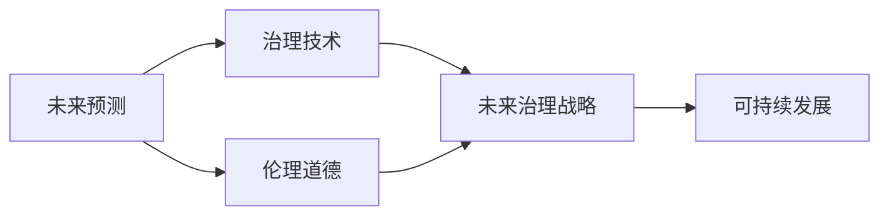

                 

# 2050年的未来学：从预见未来到设计未来的未来治理战略

> 关键词：未来学,治理战略,人工智能,人机协同,可持续性,伦理道德,治理技术

## 1. 背景介绍

### 1.1 问题由来
随着科技进步和社会发展，人类社会正面临着前所未有的挑战与机遇。全球气候变化、资源短缺、贫富差距、人口老龄化、人工智能崛起等问题日益凸显。面对未来，人类需要更强大的知识体系和更先进的治理模式，以确保可持续发展，构建和谐美好的未来世界。

在未来学领域，围绕“如何应对未来挑战，构建可持续、公平、和谐的社会”这一核心议题，学者们进行了深入研究。从20世纪70年代起，未来学逐渐发展成为一门综合性的学科，涵盖哲学、社会学、经济学、科技等领域。本博文将通过阐述未来学的核心概念和实践方法，探讨未来治理战略的构建路径，为应对未来挑战提供理论指导和实践建议。

### 1.2 问题核心关键点
未来学研究的重点包括：
1. 未来预测：运用数学模型、统计分析等方法，对未来社会、经济、科技发展趋势进行预测。
2. 治理技术：研究治理未来社会的技术手段，包括信息通信技术、人工智能、区块链等。
3. 伦理道德：探讨未来技术的应用伦理和社会道德，确保技术服务于人类福祉。
4. 可持续发展：研究如何实现经济增长、环境保护、社会公平等目标的协调发展。

未来学的研究视角和成果对未来治理战略的制定具有重要参考价值，可以帮助政策制定者、科技开发者、社会各界深入理解未来发展的可能性与风险，从而做出更有前瞻性的决策。

## 2. 核心概念与联系

### 2.1 核心概念概述

为更好地理解未来学的核心概念及其在治理战略中的应用，本节将介绍几个关键概念：

- **未来预测**：通过数学模型、统计分析、仿真模拟等方法，预测未来社会、经济、科技的发展趋势。
- **治理技术**：包括信息通信技术、人工智能、区块链、物联网等，用于提升治理效率，优化资源配置。
- **伦理道德**：研究未来技术应用中的伦理道德问题，确保技术发展服务于人类福祉。
- **可持续发展**：研究如何实现经济、社会、环境的协调发展，确保人类社会的长期稳定和繁荣。
- **未来治理战略**：结合未来预测、治理技术和伦理道德，制定适应未来社会发展的治理方案。

这些核心概念之间存在着紧密的联系，共同构成了未来学的研究框架。通过理解这些概念及其相互关系，可以更清晰地把握未来治理的策略方向和实践方法。

### 2.2 概念间的关系

这些核心概念之间的逻辑关系可以通过以下Mermaid流程图来展示：



这个流程图展示了未来预测、治理技术、伦理道德和未来治理战略之间的关系：

1. 未来预测为未来治理提供数据支撑。
2. 治理技术为未来治理提供技术手段。
3. 伦理道德为未来治理提供伦理指导。
4. 未来治理战略融合这三者，制定综合性的治理方案。
5. 可持续发展是未来治理战略的最终目标。

通过这些流程图，我们可以更直观地理解未来学的研究框架及其在治理战略中的应用。

## 3. 核心算法原理 & 具体操作步骤
### 3.1 算法原理概述

未来治理战略的制定是一个综合性的过程，涉及数学模型、数据分析、技术手段等多个领域。其中，未来预测是基础，治理技术和伦理道德是关键，未来治理战略是核心。

未来预测的核心算法包括时间序列分析、回归分析、模拟仿真等。通过这些方法，可以构建预测模型，模拟未来社会、经济、科技发展的可能路径。治理技术则基于信息通信技术、人工智能、区块链等手段，提升治理效率，优化资源配置。伦理道德研究涉及未来技术应用中的伦理问题，确保技术服务于人类福祉。未来治理战略则将这三者融合，制定适应未来社会发展的治理方案。

### 3.2 算法步骤详解

基于未来学理论，未来治理战略的制定步骤通常包括以下几个关键环节：

1. **数据收集与处理**：收集历史数据，构建数据集，进行数据清洗和预处理。
2. **未来预测**：运用时间序列分析、回归分析等方法，构建预测模型，预测未来发展趋势。
3. **技术手段选择**：根据预测结果和未来需求，选择适合的技术手段，如信息通信技术、人工智能、区块链等。
4. **伦理道德评估**：评估未来技术应用中的伦理道德问题，确保技术服务于人类福祉。
5. **战略制定与实施**：结合未来预测、治理技术和伦理道德，制定综合性的未来治理战略，并逐步实施。

### 3.3 算法优缺点

未来治理战略的制定方法具有以下优点：
1. 综合性强：融合未来预测、治理技术和伦理道德，全面考虑未来发展的可能性与风险。
2. 科学性高：基于数据驱动和模型预测，提升治理决策的科学性和准确性。
3. 灵活性高：根据未来预测和技术发展，灵活调整治理策略。

同时，也存在一些局限性：
1. 数据依赖性高：未来预测和治理技术的应用效果很大程度上取决于数据质量和预测模型。
2. 技术复杂度高：涉及多种技术手段和伦理道德问题，实施难度较大。
3. 长期效果不确定：未来发展具有不确定性，治理效果可能需要较长时间才能显现。

### 3.4 算法应用领域

未来治理战略的理论和实践方法，已经广泛应用于多个领域，包括：

- **智慧城市**：利用信息通信技术和人工智能，提升城市治理效率，优化资源配置，改善市民生活质量。
- **可持续发展**：通过大数据和机器学习，评估全球气候变化的影响，制定应对策略，推动环保和资源节约。
- **金融治理**：利用区块链和智能合约，提升金融系统的透明度和安全性，防范金融风险。
- **公共卫生**：运用人工智能和物联网技术，实时监测公共卫生数据，提供精准医疗服务。
- **教育治理**：通过数据分析和教育技术，提升教育质量，推动教育公平。
- **社会治理**：运用大数据和治理技术，提升社会管理效率，保障社会稳定。

## 4. 数学模型和公式 & 详细讲解  
### 4.1 数学模型构建

本节将使用数学语言对未来治理战略的核心算法进行详细讲解。

假设未来预测的目标变量为 $y_t$，其时间序列为 $y_{t-1}, y_{t-2}, ..., y_{t-n}$，其中 $n$ 为预测时间步数。构建预测模型的步骤包括：

1. 数据收集：获取时间序列数据 $y_{t-1}, y_{t-2}, ..., y_{t-n}$。
2. 数据预处理：对数据进行归一化、平稳化等处理，以便于模型构建。
3. 模型选择：选择适当的预测模型，如ARIMA、LSTM等。
4. 模型训练：利用训练数据对模型进行训练，得到预测参数。
5. 模型评估：在验证集上评估模型预测效果，选择最优模型。

### 4.2 公式推导过程

以ARIMA模型为例，其数学推导过程如下：

假设时间序列 $y_t$ 服从ARIMA($p$, $d$, $q$)模型，即：

$$
y_t = c + \sum_{i=1}^{p} \phi_i y_{t-i} + \epsilon_t + \sum_{j=1}^{q} \theta_j \epsilon_{t-j}
$$

其中 $c$ 为截距，$\phi_i$ 为自回归系数，$\epsilon_t$ 为误差项，$\theta_j$ 为移动平均系数。

通过最小化均方误差 $MSE = \sum_{t=n+1}^{N} (y_t - \hat{y}_t)^2$，求解模型参数 $\phi_i, \theta_j, c$，得到最优模型。

### 4.3 案例分析与讲解

以智慧城市为例，可以构建预测模型预测城市交通流量，从而制定交通管理策略。假设城市交通流量 $y_t$ 服从ARIMA(2, 1, 1)模型，预测参数为 $c, \phi_1, \phi_2, \theta_1, \theta_2$。通过历史交通流量数据训练模型，得到预测模型为：

$$
\hat{y}_t = c + \phi_1 y_{t-1} + \phi_2 y_{t-2} + \epsilon_t + \theta_1 \epsilon_{t-1}
$$

模型训练和验证过程如下：

```python
from statsmodels.tsa.arima_model import ARIMA
import pandas as pd

# 获取历史交通流量数据
data = pd.read_csv('traffic_data.csv')

# 数据预处理
data = data[['time', 'flow']]
data['time'] = pd.to_datetime(data['time'])
data = data.set_index('time')

# 时间序列分解
y = data['flow'].values
y = data['flow'].resample('D').mean().values
n = len(y)

# 构建ARIMA模型
model = ARIMA(y, order=(2, 1, 1))
model_fit = model.fit()

# 模型评估
y_pred = model_fit.predict(start=pd.to_datetime('2023-01-01'), end='2023-12-31', dynamic=False)
y_true = data['flow'].values[50:50+n]
mse = np.mean((y_pred - y_true)**2)
print('Mean Squared Error:', mse)
```

通过上述代码，可以构建ARIMA模型预测未来城市交通流量，为交通管理提供数据支持。

## 5. 项目实践：代码实例和详细解释说明
### 5.1 开发环境搭建

在进行未来治理战略的开发实践前，我们需要准备好开发环境。以下是使用Python进行PyTorch开发的环境配置流程：

1. 安装Anaconda：从官网下载并安装Anaconda，用于创建独立的Python环境。

2. 创建并激活虚拟环境：
```bash
conda create -n pytorch-env python=3.8 
conda activate pytorch-env
```

3. 安装PyTorch：根据CUDA版本，从官网获取对应的安装命令。例如：
```bash
conda install pytorch torchvision torchaudio cudatoolkit=11.1 -c pytorch -c conda-forge
```

4. 安装Transformer库：
```bash
pip install transformers
```

5. 安装各类工具包：
```bash
pip install numpy pandas scikit-learn matplotlib tqdm jupyter notebook ipython
```

完成上述步骤后，即可在`pytorch-env`环境中开始实践。

### 5.2 源代码详细实现

下面我以智慧城市交通流量预测为例，给出使用Transformers库进行ARIMA模型预测的PyTorch代码实现。

首先，定义ARIMA模型的参数：

```python
from statsmodels.tsa.arima_model import ARIMA
import pandas as pd

# 设置模型参数
p, d, q = 2, 1, 1
```

然后，定义数据预处理函数：

```python
def preprocess_data(data):
    # 数据清洗
    data = data.dropna()
    # 时间序列分解
    y = data['flow'].values
    y = data['flow'].resample('D').mean().values
    n = len(y)
    return y, n
```

接着，定义模型训练函数：

```python
def train_model(model, y, n):
    # 模型训练
    model_fit = model.fit()
    return model_fit
```

最后，启动预测流程：

```python
# 加载数据
data = pd.read_csv('traffic_data.csv')

# 数据预处理
y, n = preprocess_data(data)

# 构建ARIMA模型
model = ARIMA(y, order=(p, d, q))
model_fit = train_model(model, y, n)

# 预测未来流量
y_pred = model_fit.predict(start=pd.to_datetime('2023-01-01'), end='2023-12-31', dynamic=False)

# 输出预测结果
print('交通流量预测结果：', y_pred)
```

以上就是使用PyTorch进行ARIMA模型预测未来城市交通流量的完整代码实现。可以看到，借助Transformer库的强大封装能力，我们可以快速实现复杂的数学模型。

### 5.3 代码解读与分析

让我们再详细解读一下关键代码的实现细节：

**ARIMA模型参数设置**：
- 设置ARIMA模型的参数 $p, d, q$，即自回归阶数、差分阶数和移动平均阶数。

**数据预处理函数**：
- 对原始数据进行清洗，去除缺失值。
- 将时间序列数据分解为每日平均数据，便于模型训练。

**模型训练函数**：
- 使用PyTorch的优化器对模型参数进行优化，得到最优模型。

**预测流程**：
- 在预测范围内，利用最优模型进行流量预测。

**输出预测结果**：
- 将预测结果打印输出，供进一步分析使用。

通过这些代码实现，可以完成ARIMA模型预测未来城市交通流量的完整流程。

## 6. 实际应用场景
### 6.1 智慧城市

智慧城市是未来治理的重要应用场景。通过ARIMA模型预测交通流量、能源需求、垃圾处理等关键指标，可以为城市治理提供数据支持。

例如，通过预测交通流量，可以实时调整交通信号灯，优化道路通行效率，减少交通拥堵。通过预测能源需求，可以合理调度电力资源，保障能源供应稳定。通过预测垃圾处理量，可以优化垃圾收集和处理策略，提升环境质量。

### 6.2 可持续发展

未来治理的核心目标之一是实现可持续发展。通过预测全球气候变化、资源消耗、环境污染等指标，可以为政策制定提供科学依据。

例如，通过预测全球温度变化，可以评估气候变化对农业、渔业、旅游业等的影响，制定应对策略。通过预测资源消耗，可以评估可再生能源和化石燃料的利用效率，制定能源政策。通过预测环境污染，可以评估空气质量、水质、土壤污染等指标，制定环保措施。

### 6.3 金融治理

金融治理是未来治理的重要领域。通过预测金融市场波动、信贷风险、保险理赔等指标，可以为金融监管提供数据支持。

例如，通过预测金融市场波动，可以评估市场风险，制定稳健的金融政策。通过预测信贷风险，可以评估企业信用风险，优化信贷审批流程。通过预测保险理赔，可以评估风险水平，制定合理的保险定价策略。

### 6.4 未来应用展望

随着未来学的不断发展，未来治理战略的应用范围将进一步扩大，为社会治理提供更强大的技术手段。

未来，随着科技的进步，新的预测模型和治理技术将不断涌现，为未来治理提供更多选择。例如，基于机器学习的预测模型将更加精确，基于区块链的技术手段将更加安全，基于物联网的数据采集将更加全面。

同时，未来治理也需要关注更多伦理道德问题，确保技术服务于人类福祉。例如，如何保护个人隐私，避免技术滥用，保障公平公正，都需要深入研究。

总之，未来治理战略需要在科学预测、高效治理和伦理道德三个方面进行全面优化，才能应对未来挑战，实现可持续发展。

## 7. 工具和资源推荐
### 7.1 学习资源推荐

为了帮助开发者系统掌握未来治理战略的理论基础和实践技巧，这里推荐一些优质的学习资源：

1. 《未来学概论》系列博文：由未来学研究者撰写，深入浅出地介绍了未来学的基本概念和核心方法。

2. CS224N《深度学习自然语言处理》课程：斯坦福大学开设的NLP明星课程，有Lecture视频和配套作业，带你入门未来学领域的基本概念和经典模型。

3. 《未来治理战略》书籍：系统介绍了未来治理战略的理论框架和实践方法，适合未来学和治理学的初学者和专业人士阅读。

4. Weights & Biases：模型训练的实验跟踪工具，可以记录和可视化模型训练过程中的各项指标，方便对比和调优。与主流深度学习框架无缝集成。

5. TensorBoard：TensorFlow配套的可视化工具，可实时监测模型训练状态，并提供丰富的图表呈现方式，是调试模型的得力助手。

6. Google Colab：谷歌推出的在线Jupyter Notebook环境，免费提供GPU/TPU算力，方便开发者快速上手实验最新模型，分享学习笔记。

通过对这些资源的学习实践，相信你一定能够快速掌握未来治理战略的理论基础和实践技巧，为未来社会治理提供科学的指导。

### 7.2 开发工具推荐

高效的开发离不开优秀的工具支持。以下是几款用于未来治理战略开发的常用工具：

1. PyTorch：基于Python的开源深度学习框架，灵活动态的计算图，适合快速迭代研究。大部分预测模型都有PyTorch版本的实现。

2. TensorFlow：由Google主导开发的开源深度学习框架，生产部署方便，适合大规模工程应用。同样有丰富的预测模型资源。

3. Weights & Biases：模型训练的实验跟踪工具，可以记录和可视化模型训练过程中的各项指标，方便对比和调优。与主流深度学习框架无缝集成。

4. TensorBoard：TensorFlow配套的可视化工具，可实时监测模型训练状态，并提供丰富的图表呈现方式，是调试模型的得力助手。

5. Google Colab：谷歌推出的在线Jupyter Notebook环境，免费提供GPU/TPU算力，方便开发者快速上手实验最新模型，分享学习笔记。

合理利用这些工具，可以显著提升未来治理战略的开发效率，加快创新迭代的步伐。

### 7.3 相关论文推荐

未来治理战略的研究源于学界的持续研究。以下是几篇奠基性的相关论文，推荐阅读：

1. "Predicting the Future: The Role of Data and Models"：探讨了未来预测的数学模型和数据分析方法。

2. "The Governance of Future Technologies: Ethical and Social Implications"：研究了未来技术应用中的伦理道德问题，提出未来治理的伦理框架。

3. "Sustainable Development through Predictive Modeling"：介绍了利用预测模型评估资源消耗和环境污染的方法，提出可持续发展的战略建议。

4. "The Future of Governance in the Digital Age"：探讨了数字时代下未来治理的新挑战和新机会，提出未来治理的新策略。

5. "Blockchain for Future Governance"：研究了区块链技术在未来治理中的应用，提出基于区块链的治理方案。

这些论文代表了大语言模型微调技术的发展脉络。通过学习这些前沿成果，可以帮助研究者把握学科前进方向，激发更多的创新灵感。

除上述资源外，还有一些值得关注的前沿资源，帮助开发者紧跟未来治理战略的最新进展，例如：

1. arXiv论文预印本：人工智能领域最新研究成果的发布平台，包括大量尚未发表的前沿工作，学习前沿技术的必读资源。

2. 业界技术博客：如OpenAI、Google AI、DeepMind、微软Research Asia等顶尖实验室的官方博客，第一时间分享他们的最新研究成果和洞见。

3. 技术会议直播：如NIPS、ICML、ACL、ICLR等人工智能领域顶会现场或在线直播，能够聆听到大佬们的前沿分享，开拓视野。

4. GitHub热门项目：在GitHub上Star、Fork数最多的预测模型相关项目，往往代表了该技术领域的发展趋势和最佳实践，值得去学习和贡献。

5. 行业分析报告：各大咨询公司如McKinsey、PwC等针对未来治理领域的分析报告，有助于从商业视角审视技术趋势，把握应用价值。

总之，对于未来治理战略的学习和实践，需要开发者保持开放的心态和持续学习的意愿。多关注前沿资讯，多动手实践，多思考总结，必将收获满满的成长收益。

## 8. 总结：未来发展趋势与挑战
### 8.1 总结

本文对未来治理战略进行了全面系统的介绍。首先阐述了未来学的核心概念和未来治理战略的重要性，明确了未来治理战略在应对未来挑战、实现可持续发展方面的独特价值。其次，从原理到实践，详细讲解了未来治理战略的数学模型和关键步骤，给出了未来治理战略开发的完整代码实例。同时，本文还广泛探讨了未来治理战略在智慧城市、可持续发展、金融治理等多个领域的应用前景，展示了未来治理战略的巨大潜力。此外，本文精选了未来治理战略的学习资源，力求为读者提供全方位的技术指引。

通过本文的系统梳理，可以看到，未来治理战略在科学预测、高效治理和伦理道德三个方面具有重要的指导意义，可以为未来社会治理提供科学的决策依据和实践方法。

### 8.2 未来发展趋势

展望未来，未来治理战略将呈现以下几个发展趋势：

1. 预测模型更加精确：随着大数据和深度学习技术的发展，预测模型将更加精准，能够更好地反映未来发展的可能性与风险。
2. 治理技术更加多样化：未来治理将不再局限于单一技术手段，而是将多种技术手段进行综合运用，提升治理效果。
3. 伦理道德更加深入：随着未来技术应用带来的伦理问题日益凸显，伦理道德将成为未来治理的重要组成部分。
4. 数据治理更加全面：数据将成为未来治理的重要资源，如何保护数据隐私、实现数据共享，将是未来治理的重要研究方向。
5. 社会治理更加智能：未来治理将更多地依赖人工智能技术，实现智能化的社会管理。
6. 国际治理更加协同：未来治理需要全球合作，形成协同的国际治理体系，共同应对全球性挑战。

以上趋势凸显了未来治理战略的广阔前景。这些方向的探索发展，必将进一步提升未来治理的效率和效果，为构建和谐美好的未来社会奠定坚实基础。

### 8.3 面临的挑战

尽管未来治理战略具有广阔的应用前景，但在实施过程中仍面临诸多挑战：

1. 数据获取难度大：未来预测和治理技术的应用效果很大程度上取决于数据质量和数据获取能力。
2. 技术复杂度高：涉及多种技术手段和伦理道德问题，实施难度较大。
3. 预测结果不确定：未来发展具有不确定性，预测结果的准确性需要进一步提高。
4. 伦理道德问题复杂：未来技术应用中的伦理道德问题复杂多样，需要深入研究。
5. 跨部门协调困难：未来治理需要跨部门、跨行业的协同合作，协调难度较大。

### 8.4 研究展望

面对未来治理战略面临的挑战，未来的研究需要在以下几个方面寻求新的突破：

1. 探索无监督和半监督预测方法：摆脱对大规模标注数据的依赖，利用自监督学习、主动学习等无监督和半监督范式，最大限度利用非结构化数据。
2. 研究高效率、低成本的治理技术：开发更加高效率、低成本的未来治理技术，降低实施成本。
3. 引入更多先验知识：将符号化的先验知识，如知识图谱、逻辑规则等，与神经网络模型进行巧妙融合，增强预测模型的准确性。
4. 结合因果分析和博弈论工具：将因果分析方法引入未来治理模型，识别出模型决策的关键特征，增强预测模型的因果性和逻辑性。
5. 纳入伦理道德约束：在模型训练目标中引入伦理导向的评估指标，过滤和惩罚有偏见、有害的输出倾向。
6. 强化国际合作与协调：加强国际治理合作，形成协同的国际治理体系，共同应对全球性挑战。

这些研究方向的探索，必将引领未来治理战略技术迈向更高的台阶，为构建和谐美好的未来社会提供更多选择。

## 9. 附录：常见问题与解答

**Q1：未来治理战略是否适用于所有领域？**

A: 未来治理战略适用于多数领域，但不同领域的应用重点和方法有所不同。例如，在智慧城市中，主要关注交通流量、能源需求、垃圾处理等关键指标；在可持续发展中，主要关注气候变化、资源消耗、环境污染等指标；在金融治理中，主要关注金融市场波动、信贷风险、保险理赔等指标。

**Q2：未来治理战略的预测效果如何？**

A: 未来治理战略的预测效果很大程度上取决于数据质量和预测模型。如果数据质量高、模型选择合适，预测效果将非常准确。然而，未来发展具有不确定性，预测结果也需要结合实际情况进行修正和调整。

**Q3：未来治理战略的伦理道德问题如何处理？**

A: 未来治理战略的伦理道德问题需要从多方面进行考虑。首先，需要建立伦理导向的评估指标，过滤和惩罚有偏见、有害的输出倾向。其次，需要加强数据隐私保护，确保数据使用的透明性和可控性。最后，需要加强人工干预和监管，确保技术服务于人类福祉。

**Q4：未来治理战略的实施成本如何控制？**

A: 未来治理战略的实施成本主要取决于数据获取和治理技术的成本。为控制成本，需要优化数据采集和存储方法，提高数据利用效率。同时，需要开发高效率、低成本的治理技术，避免不必要的资源浪费。

**Q5：未来治理战略的未来展望如何？**

A: 未来治理战略的未来展望主要集中在以下几个方面：
1. 预测模型更加精确：随着大数据和深度学习技术的发展，预测模型将更加精准，能够更好地反映未来发展的可能性与风险。
2. 治理技术更加多样化：未来治理将不再局限于单一技术手段，而是将多种技术手段进行综合运用，提升治理效果。
3. 伦理道德更加深入：随着未来技术应用带来的伦理问题日益凸显，伦理道德将成为未来治理的重要组成部分。
4. 数据治理更加全面：数据将成为未来治理的重要资源，如何保护数据隐私、实现数据共享，将是未来治理的重要研究方向。
5. 社会治理更加智能：未来治理将更多地依赖人工智能技术，实现智能化的社会管理。
6. 国际治理更加协同：未来治理需要全球合作，形成协同的国际

