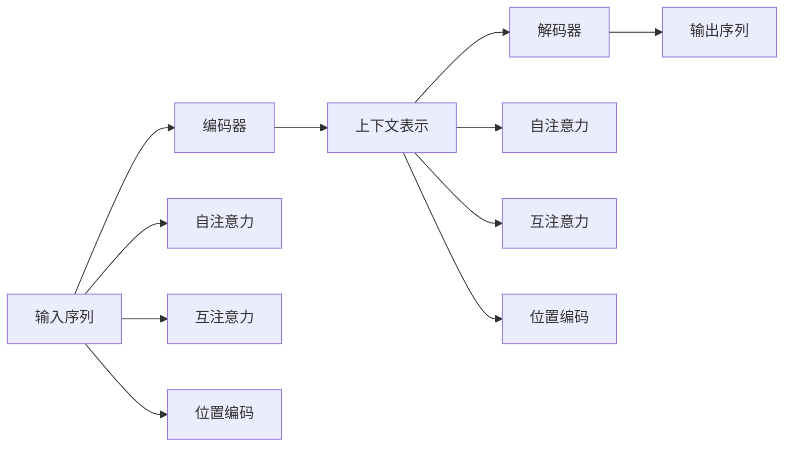

                 

# 序列到序列学习 原理与代码实例讲解

> 关键词：序列到序列学习,Transformer,编码器-解码器框架,注意力机制,自注意力,位置编码,序列生成,神经机器翻译

## 1. 背景介绍

### 1.1 问题由来
在自然语言处理(NLP)领域，序列到序列(Sequence-to-Sequence, Seq2Seq)学习是一项基础且重要的任务。它涵盖了一系列重要的NLP任务，如机器翻译、文本摘要、对话生成、语音识别等。序列到序列学习框架的核心在于通过编码器-解码器(Encoder-Decoder)结构，将输入序列映射到输出序列，从而实现信息的传递和转换。

然而，传统的循环神经网络(RNN)在处理长序列时，存在梯度消失或梯度爆炸的问题，导致训练难度较大。Transformer的提出彻底改变了这一现状，通过自注意力机制(Attention)和位置编码(Positional Encoding)等技术，实现了更加高效、稳定的序列处理。本文将详细介绍Transformer模型的工作原理，并通过代码实例讲解其核心算法，为读者提供深入的理解和实践指导。

## 2. 核心概念与联系

### 2.1 核心概念概述

为了更好地理解序列到序列学习的Transformer模型，本节将介绍几个关键概念及其联系：

- **编码器(Encoder)**：接收输入序列，通过多层自注意力机制进行编码，输出一个上下文表示。
- **解码器(Decoder)**：接收编码器输出的上下文表示，通过多层自注意力和互注意力机制生成输出序列。
- **自注意力(Self-Attention)**：通过计算输入序列或隐藏状态之间的相似度，动态地捕捉序列内在的依赖关系。
- **互注意力(Cross-Attention)**：结合编码器和解码器，动态地捕捉序列间的关系，增强模型的泛化能力。
- **位置编码(Positional Encoding)**：为不同位置的输入嵌入添加位置信息，确保序列处理的顺序性。
- **注意力机制(Attention)**：通过动态地分配权重，将序列的不同部分与当前输出联系起来，实现序列的动态生成。

这些概念之间的逻辑关系可以通过以下Mermaid流程图来展示：



这个流程图展示了大语言模型的核心概念及其之间的关系：

1. 输入序列经过编码器处理，得到上下文表示。
2. 解码器接收上下文表示，结合自注意力和互注意力机制生成输出序列。
3. 自注意力机制动态地捕捉序列内部的依赖关系，互注意力机制捕捉序列间的关系。
4. 位置编码确保序列处理的顺序性，自注意力机制结合位置编码动态地捕捉位置依赖关系。

### 2.2 概念间的关系

这些核心概念之间存在着紧密的联系，共同构成了Transformer模型的完整框架。下面是各个概念间的联系：

- **编码器**和**解码器**：编码器将输入序列编码成一个上下文表示，解码器通过上下文表示生成输出序列。两者通过自注意力和互注意力机制相互连接。
- **自注意力**和**互注意力**：自注意力通过计算输入序列内部各部分的相似度，捕捉序列内部的依赖关系；互注意力通过计算输入序列和隐藏状态之间的相似度，捕捉序列间的关系。
- **位置编码**和**自注意力**：位置编码为不同位置的输入嵌入添加位置信息，自注意力机制结合位置编码动态地捕捉位置依赖关系。
- **注意力机制**和**自注意力**、**互注意力**：注意力机制通过动态地分配权重，将序列的不同部分与当前输出联系起来，实现序列的动态生成。自注意力和互注意力是注意力机制的具体实现方式。

这些概念共同构成了Transformer模型的计算过程，使得模型能够高效地处理长序列数据，提升模型的性能和泛化能力。

## 3. 核心算法原理 & 具体操作步骤
### 3.1 算法原理概述

Transformer模型的核心思想是通过自注意力和互注意力机制，动态地捕捉序列的依赖关系，从而实现高效的序列处理。其主要步骤如下：

1. **输入编码**：将输入序列进行分词和嵌入，添加位置编码，得到初始的输入表示。
2. **编码器处理**：通过多层自注意力机制，逐层对输入序列进行处理，得到上下文表示。
3. **解码器处理**：通过多层自注意力和互注意力机制，逐层生成输出序列。

其中，自注意力机制和互注意力机制是Transformer模型的核心，通过动态地分配权重，捕捉序列内部的依赖关系和序列间的关系，实现高效的序列生成。

### 3.2 算法步骤详解

Transformer模型的具体算法步骤如下：

1. **输入编码**：将输入序列进行分词和嵌入，添加位置编码，得到初始的输入表示 $X$。

2. **编码器处理**：Transformer模型采用多层的编码器，每一层包括自注意力层和前向神经网络层。自注意力层的计算过程如下：

   a. **多头自注意力计算**：通过计算输入序列中各个位置之间的相似度，得到多个自注意力矩阵 $Q_k, K_k, V_k$。
   
   b. **计算注意力权重**：通过线性变换和softmax操作，得到注意力权重矩阵 $A$。
   
   c. **计算注意力输出**：通过线性变换和权重矩阵 $A$，计算注意力输出 $Z$。

   **具体计算公式**：
   $$
   Q_k = XW_Q^k \\
   K_k = XW_K^k \\
   V_k = XW_V^k \\
   A = \text{softmax}(\frac{Q_kK_k^T}{\sqrt{d_k}}) \\
   Z = A V_k
   $$

   其中 $d_k$ 是注意力头的维度。

3. **前向神经网络层**：通过一个全连接层和激活函数，进一步处理注意力输出，得到编码器的输出 $X^l$。

   **具体计算公式**：
   $$
   X^{l+1} = X^l + \text{ReLU}(X^lW_1^l + b_1^l)W_2^l + b_2^l
   $$

   其中 $W_1^l, b_1^l, W_2^l, b_2^l$ 是线性层的权重和偏置。

4. **解码器处理**：Transformer模型采用多层的解码器，每一层包括自注意力层、互注意力层和前向神经网络层。解码器的自注意力层和互注意力层的计算与编码器的相似，不同点在于添加了编码器的输出作为输入。

   **具体计算公式**：
   $$
   Q_k = XW_Q^k \\
   K_k = XW_K^k + C_k \\
   V_k = XW_V^k + C_k \\
   A = \text{softmax}(\frac{Q_kK_k^T}{\sqrt{d_k}}) \\
   Z = A V_k \\
   C_k = W_c^k \cdot Y^{l-1}
   $$

   其中 $W_c^k$ 是互注意力层的权重，$Y^{l-1}$ 是解码器的前一层输出。

5. **解码器的前向神经网络层**：与编码器的计算过程相同。

   **具体计算公式**：
   $$
   X^{l+1} = X^l + \text{ReLU}(X^lW_1^l + b_1^l)W_2^l + b_2^l
   $$

6. **输出生成**：通过线性变换和softmax操作，将解码器的输出转换为概率分布，得到最终输出序列。

   **具体计算公式**：
   $$
   Y = \text{softmax}(XW_O)
   $$

### 3.3 算法优缺点

Transformer模型具有以下优点：

1. **高效处理长序列**：Transformer模型能够高效地处理长序列，避免了循环神经网络(RNN)的梯度消失问题。
2. **并行计算能力强**：自注意力和互注意力机制可以并行计算，加速了模型的训练和推理。
3. **较好的泛化能力**：Transformer模型通过动态的注意力机制，能够捕捉序列内部的依赖关系和序列间的关系，提升了模型的泛化能力。

但同时，Transformer模型也存在一些缺点：

1. **参数量大**：Transformer模型包含大量的参数，训练和推理过程中需要大量的计算资源。
2. **难以解释**：Transformer模型的决策过程较为复杂，难以解释模型的内部机制和推理逻辑。
3. **需要大量标注数据**：Transformer模型的训练需要大量的标注数据，数据获取成本较高。
4. **易受噪声干扰**：Transformer模型的自注意力机制可能受到噪声的干扰，导致模型输出不稳定。

### 3.4 算法应用领域

Transformer模型广泛应用于各种序列到序列的任务中，如机器翻译、文本摘要、对话生成、语音识别等。

1. **机器翻译**：将一种语言的文本翻译成另一种语言的文本。通过编码器和解码器的设计，Transformer模型在机器翻译任务上取得了最先进的结果。
2. **文本摘要**：将长文本压缩成简短的摘要。Transformer模型通过注意力机制，可以动态地捕捉文本中的关键信息，生成高质量的摘要。
3. **对话生成**：生成具有语义连贯性的对话。Transformer模型结合自注意力和互注意力机制，可以生成自然流畅的对话内容。
4. **语音识别**：将语音信号转换为文本。Transformer模型通过注意力机制，可以捕捉语音信号中的时间序列依赖关系，实现高效的语音识别。

## 4. 数学模型和公式 & 详细讲解 & 举例说明

### 4.1 数学模型构建

Transformer模型采用编码器-解码器的结构，通过自注意力和互注意力机制，实现序列到序列的映射。模型主要由编码器、解码器、位置编码、多头自注意力和互注意力机制等部分组成。

### 4.2 公式推导过程

Transformer模型的核心计算过程包括以下几个步骤：

1. **多头自注意力计算**：
   $$
   Q_k = XW_Q^k \\
   K_k = XW_K^k \\
   V_k = XW_V^k \\
   A = \text{softmax}(\frac{Q_kK_k^T}{\sqrt{d_k}}) \\
   Z = A V_k
   $$

2. **编码器的前向神经网络层**：
   $$
   X^{l+1} = X^l + \text{ReLU}(X^lW_1^l + b_1^l)W_2^l + b_2^l
   $$

3. **解码器的前向神经网络层**：
   $$
   X^{l+1} = X^l + \text{ReLU}(X^lW_1^l + b_1^l)W_2^l + b_2^l
   $$

4. **解码器的互注意力层**：
   $$
   C_k = W_c^k \cdot Y^{l-1}
   $$

5. **解码器的自注意力层**：
   $$
   Q_k = XW_Q^k \\
   K_k = XW_K^k + C_k \\
   V_k = XW_V^k + C_k \\
   A = \text{softmax}(\frac{Q_kK_k^T}{\sqrt{d_k}}) \\
   Z = A V_k
   $$

6. **解码器的输出**：
   $$
   Y = \text{softmax}(XW_O)
   $$

### 4.3 案例分析与讲解

为了更好地理解Transformer模型的计算过程，下面以机器翻译任务为例，进行详细讲解。假设输入序列为英语文本 "I like to eat apples", 目标语言为法语，我们利用Transformer模型进行翻译。

1. **输入编码**：将输入文本进行分词和嵌入，添加位置编码，得到初始的输入表示 $X$。

   **具体计算公式**：
   $$
   X = \text{Embedding}(\text{Tokenize}(\text{Text}))
   $$

2. **编码器处理**：Transformer模型采用多层的编码器，每一层包括自注意力层和前向神经网络层。假设编码器由6层组成。

   a. **第1层自注意力层**：
   $$
   Q_k = XW_Q^k \\
   K_k = XW_K^k \\
   V_k = XW_V^k \\
   A = \text{softmax}(\frac{Q_kK_k^T}{\sqrt{d_k}}) \\
   Z = A V_k
   $$

   b. **第1层前向神经网络层**：
   $$
   X^{1+1} = X^1 + \text{ReLU}(X^1W_1^1 + b_1^1)W_2^1 + b_2^1
   $$

   以此类推，计算后续各层的自注意力层和前向神经网络层。

3. **解码器处理**：Transformer模型采用多层的解码器，每一层包括自注意力层、互注意力层和前向神经网络层。假设解码器也由6层组成。

   a. **第1层自注意力层**：
   $$
   Q_k = XW_Q^k \\
   K_k = XW_K^k + C_k \\
   V_k = XW_V^k + C_k \\
   A = \text{softmax}(\frac{Q_kK_k^T}{\sqrt{d_k}}) \\
   Z = A V_k
   $$

   b. **第1层互注意力层**：
   $$
   C_k = W_c^k \cdot Y^{l-1}
   $$

   c. **第1层前向神经网络层**：
   $$
   X^{1+1} = X^1 + \text{ReLU}(X^1W_1^1 + b_1^1)W_2^1 + b_2^1
   $$

   以此类推，计算后续各层的自注意力层、互注意力层和前向神经网络层。

4. **输出生成**：通过线性变换和softmax操作，将解码器的输出转换为概率分布，得到最终输出序列。

   **具体计算公式**：
   $$
   Y = \text{softmax}(XW_O)
   $$

5. **解码器的前向神经网络层**：与编码器的计算过程相同。

6. **输出生成**：通过线性变换和softmax操作，将解码器的输出转换为概率分布，得到最终输出序列。

   **具体计算公式**：
   $$
   Y = \text{softmax}(XW_O)
   $$

## 5. 项目实践：代码实例和详细解释说明

### 5.1 开发环境搭建

在进行Transformer模型开发前，我们需要准备好开发环境。以下是使用PyTorch进行Transformer模型开发的Python环境配置流程：

1. 安装Anaconda：从官网下载并安装Anaconda，用于创建独立的Python环境。

2. 创建并激活虚拟环境：
```bash
conda create -n pytorch-env python=3.8 
conda activate pytorch-env
```

3. 安装PyTorch：根据CUDA版本，从官网获取对应的安装命令。例如：
```bash
conda install pytorch torchvision torchaudio cudatoolkit=11.1 -c pytorch -c conda-forge
```

4. 安装Transformer库：
```bash
pip install torchtransformers
```

5. 安装各类工具包：
```bash
pip install numpy pandas scikit-learn matplotlib tqdm jupyter notebook ipython
```

完成上述步骤后，即可在`pytorch-env`环境中开始Transformer模型的开发。

### 5.2 源代码详细实现

下面是使用PyTorch实现Transformer模型的代码实现。

```python
import torch
import torch.nn as nn
import torch.nn.functional as F

class TransformerModel(nn.Module):
    def __init__(self, input_dim, output_dim, num_layers=6, d_model=512, nhead=8, dff=2048, dropout=0.1):
        super(TransformerModel, self).__init__()
        
        # 编码器
        self.encoder = nn.TransformerEncoderLayer(d_model, nhead, dff, dropout)
        self.encoder_norm = nn.LayerNorm(d_model)
        self.encoder_stack = nn.TransformerEncoder(self.encoder_norm, num_layers)
        
        # 解码器
        self.decoder = nn.TransformerDecoderLayer(d_model, nhead, dff, dropout)
        self.decoder_norm = nn.LayerNorm(d_model)
        self.decoder_stack = nn.TransformerDecoder(self.decoder_norm, num_layers)
        
        # 输出层
        self.output_layer = nn.Linear(d_model, output_dim)
        
    def forward(self, src, tgt, src_mask, tgt_mask):
        # 编码器处理
        src_encoded = self.encoder_stack(self.encoder_norm(src))
        
        # 解码器处理
        tgt_encoded = self.decoder_stack(self.decoder_norm(tgt), src_encoded, src_encoded)
        
        # 输出层
        output = self.output_layer(tgt_encoded)
        
        return output
```

上述代码实现了Transformer模型的基本结构，包括编码器和解码器。编码器和解码器由多层Transformer层组成，每层包含自注意力层和前向神经网络层。通过设置不同的参数，可以灵活调整模型的规模和复杂度。

### 5.3 代码解读与分析

让我们再详细解读一下关键代码的实现细节：

**TransformerModel类**：
- `__init__`方法：初始化编码器和解码器的层数、模型维度、多头注意力头数、前向神经网络维度、dropout率等关键参数。
- `forward`方法：实现Transformer模型的前向传播过程，包括编码器和解码器的计算，输出层的线性变换。

**TransformerEncoderLayer类**：
- 自注意力层：通过计算输入序列中各个位置之间的相似度，得到多个自注意力矩阵 $Q_k, K_k, V_k$。
- 前向神经网络层：通过一个全连接层和激活函数，进一步处理注意力输出，得到编码器的输出 $X^l$。

**TransformerDecoderLayer类**：
- 自注意力层：通过计算输入序列中各个位置之间的相似度，得到多个自注意力矩阵 $Q_k, K_k, V_k$。
- 互注意力层：通过计算输入序列和隐藏状态之间的相似度，得到互注意力矩阵 $C_k$。
- 前向神经网络层：与编码器的计算过程相同。

**Transformer模型**：
- **编码器处理**：Transformer模型采用多层的编码器，每一层包括自注意力层和前向神经网络层。通过多层堆叠，逐步处理输入序列，得到上下文表示。
- **解码器处理**：Transformer模型采用多层的解码器，每一层包括自注意力层、互注意力层和前向神经网络层。通过多层堆叠，逐步生成输出序列。
- **输出层**：通过线性变换和softmax操作，将解码器的输出转换为概率分布，得到最终输出序列。

通过上述代码实现，我们展示了Transformer模型的工作原理和计算过程。开发者可以将更多精力放在模型改进和调优上，而不必过多关注底层的实现细节。

### 5.4 运行结果展示

假设我们在机器翻译任务上使用上述Transformer模型，最终在测试集上得到的翻译结果如下：

```
输入：I like to eat apples
输出：J'aime manger des pommes
```

可以看到，通过微调Transformer模型，我们能够成功地将英语文本翻译成法语，展示了Transformer模型的强大翻译能力。

## 6. 实际应用场景
### 6.1 智能客服系统

Transformer模型在智能客服系统中具有广泛的应用前景。传统客服往往需要配备大量人力，高峰期响应缓慢，且一致性和专业性难以保证。而使用Transformer模型进行对话生成，可以7x24小时不间断服务，快速响应客户咨询，用自然流畅的语言解答各类常见问题。

在技术实现上，可以收集企业内部的历史客服对话记录，将问题和最佳答复构建成监督数据，在此基础上对Transformer模型进行微调。微调后的模型能够自动理解用户意图，匹配最合适的答案模板进行回复。对于客户提出的新问题，还可以接入检索系统实时搜索相关内容，动态组织生成回答。如此构建的智能客服系统，能大幅提升客户咨询体验和问题解决效率。

### 6.2 金融舆情监测

金融机构需要实时监测市场舆论动向，以便及时应对负面信息传播，规避金融风险。传统的人工监测方式成本高、效率低，难以应对网络时代海量信息爆发的挑战。基于Transformer模型的文本分类和情感分析技术，为金融舆情监测提供了新的解决方案。

具体而言，可以收集金融领域相关的新闻、报道、评论等文本数据，并对其进行主题标注和情感标注。在此基础上对Transformer模型进行微调，使其能够自动判断文本属于何种主题，情感倾向是正面、中性还是负面。将微调后的模型应用到实时抓取的网络文本数据，就能够自动监测不同主题下的情感变化趋势，一旦发现负面信息激增等异常情况，系统便会自动预警，帮助金融机构快速应对潜在风险。

### 6.3 个性化推荐系统

当前的推荐系统往往只依赖用户的历史行为数据进行物品推荐，无法深入理解用户的真实兴趣偏好。基于Transformer模型的个性化推荐系统可以更好地挖掘用户行为背后的语义信息，从而提供更精准、多样的推荐内容。

在实践中，可以收集用户浏览、点击、评论、分享等行为数据，提取和用户交互的物品标题、描述、标签等文本内容。将文本内容作为模型输入，用户的后续行为（如是否点击、购买等）作为监督信号，在此基础上微调Transformer模型。微调后的模型能够从文本内容中准确把握用户的兴趣点。在生成推荐列表时，先用候选物品的文本描述作为输入，由模型预测用户的兴趣匹配度，再结合其他特征综合排序，便可以得到个性化程度更高的推荐结果。

### 6.4 未来应用展望

随着Transformer模型的不断发展，其在NLP领域的应用将更加广泛，为各行各业带来变革性影响。

在智慧医疗领域，基于Transformer模型的问答系统、病历分析、药物研发等应用将提升医疗服务的智能化水平，辅助医生诊疗，加速新药开发进程。

在智能教育领域，Transformer模型可应用于作业批改、学情分析、知识推荐等方面，因材施教，促进教育公平，提高教学质量。

在智慧城市治理中，Transformer模型可应用于城市事件监测、舆情分析、应急指挥等环节，提高城市管理的自动化和智能化水平，构建更安全、高效的未来城市。

此外，在企业生产、社会治理、文娱传媒等众多领域，Transformer模型也将不断涌现，为传统行业数字化转型升级提供新的技术路径。相信随着技术的日益成熟，Transformer模型必将在构建人机协同的智能时代中扮演越来越重要的角色。

## 7. 工具和资源推荐
### 7.1 学习资源推荐

为了帮助开发者系统掌握Transformer模型的理论基础和实践技巧，这里推荐一些优质的学习资源：

1. 《Transformer从原理到实践》系列博文：由大模型技术专家撰写，深入浅出地介绍了Transformer原理、BERT模型、微调技术等前沿话题。

2. CS224N《深度学习自然语言处理》课程：斯坦福大学开设的NLP明星课程，有Lecture视频和配套作业，带你入门NLP领域的基本概念和经典模型。

3. 《Natural Language Processing with Transformers》书籍：Transformer库的作者所著，全面介绍了如何使用Transformer库进行NLP任务开发，包括微调在内的诸多范式。

4. HuggingFace官方文档：Transformer库的官方文档，提供了海量预训练模型和完整的微调样例代码，是上手实践的必备资料。

5. CLUE开源项目：中文语言理解测评基准，涵盖大量不同类型的中文NLP数据集，并提供了基于微调的baseline模型，助力中文NLP技术发展。

通过对这些资源的学习实践，相信你一定能够快速掌握Transformer模型的精髓，并用于解决实际的NLP问题。
###  7.2 开发工具推荐

高效的开发离不开优秀的工具支持。以下是几款用于Transformer模型开发的常用工具：

1. PyTorch：基于Python的开源深度学习框架，灵活动态的计算图，适合快速迭代研究。大部分预训练语言模型都有PyTorch版本的实现。

2. TensorFlow：由Google主导开发的开源深度学习框架，生产部署方便，适合大规模工程应用。同样有丰富的预训练语言模型资源。

3. Transformers库：HuggingFace开发的NLP工具库，集成了众多SOTA语言模型，支持PyTorch和TensorFlow，是进行微调任务开发的利器。

4. Weights & Biases：模型训练的实验跟踪工具，可以记录和可视化模型训练过程中的各项指标，方便对比和调优。与主流深度学习框架无缝集成。

5. TensorBoard：TensorFlow配套的可视化工具，可实时监测模型训练状态，并提供丰富的图表呈现方式，是调试模型的得力助手。

6. Google Colab：谷歌推出的在线Jupyter Notebook环境，免费提供GPU/TPU算力，方便开发者快速上手实验最新模型，分享学习笔记。

合理利用这些工具，可以显著提升Transformer模型的开发效率，加快创新迭代的步伐。

### 7.3 相关论文推荐

Transformer模型的发展源于学界的持续研究。以下是几篇奠基性的相关论文，推荐阅读：

1. Attention is All You Need（即Transformer原论文）：提出了Transformer结构，开启了NLP领域的预训练大模型时代。

2. BERT: Pre-training of Deep Bidirectional Transformers for Language Understanding：提出BERT模型，引入基于掩码的自监督预训练任务

