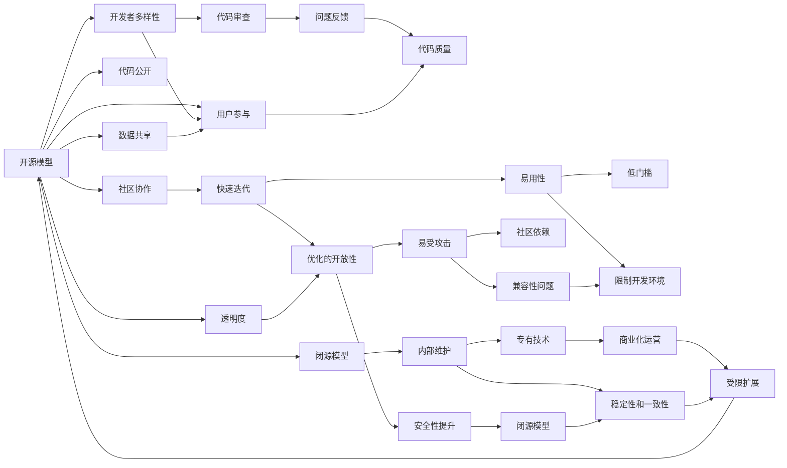

                 

# 开源模型与闭源模型的对比

> 关键词：开源模型,闭源模型,软件开源,技术合作,开发效率,安全性,易用性

## 1. 背景介绍

在AI技术日新月异的今天，开源模型与闭源模型在学术界与工业界广泛使用。它们各有优劣，为不同的应用场景提供不同的解决方案。本文将对比分析开源模型与闭源模型在开发效率、性能表现、安全性和易用性等方面的异同，探讨它们在不同应用场景中的适用性，并提出未来发展的建议。

## 2. 核心概念与联系

### 2.1 核心概念概述

**开源模型**：指代码完全公开的模型，任何人都可以查看、修改和分发。开源模型通常采用GitHub等版本控制平台进行管理和协作。

**闭源模型**：指代码完全封锁的模型，仅供内部使用或授权用户使用。闭源模型常常由企业或组织内部开发，并配以商业化运营。

### 2.2 核心概念间的关系

开源与闭源模型之间的区别主要体现在代码可见性和使用范围上。开源模型通过社区协作，汇聚了全球精英的力量，可以快速迭代和优化，但存在潜在的安全风险和商业化困难。闭源模型则能够提供更好的安全性和稳定性，但开发效率和扩展性受限。

它们之间的联系在于都是为了解决特定问题，并最终落实在软件产品上。无论开源还是闭源，它们都是基于相同的算法原理和技术框架，有着共同的目标——推动AI技术的发展和应用。

### 2.3 核心概念的整体架构

通过以下图表，我们展示了开源与闭源模型间的联系和区别：



## 3. 核心算法原理 & 具体操作步骤
### 3.1 算法原理概述

开源与闭源模型在算法原理上并无显著差异，均基于深度学习、计算机视觉、自然语言处理等技术。它们的核心区别在于实现方式、协作模式和商业策略上。

### 3.2 算法步骤详解

开源模型开发流程通常包括以下步骤：

1. **定义目标**：明确模型需要解决的问题和预期效果。
2. **数据收集**：收集相关的训练数据和测试数据。
3. **模型选择**：选择合适的模型架构，如卷积神经网络(CNN)、循环神经网络(RNN)、Transformer等。
4. **训练与优化**：在训练集上训练模型，并进行超参数调优。
5. **测试与评估**：在测试集上评估模型效果，并进行必要的调整。
6. **版本发布**：将训练好的模型发布为开源代码或模型库，供社区使用。

闭源模型的开发流程则包括以下步骤：

1. **需求分析**：详细分析业务需求和目标。
2. **设计方案**：设计模型架构和技术实现方案。
3. **内部开发**：在封闭环境中开发和测试模型。
4. **功能完善**：增加必要的辅助功能和接口。
5. **发布部署**：将模型部署到生产环境，供授权用户使用。
6. **后期维护**：持续维护和更新模型，保障业务稳定运行。

### 3.3 算法优缺点

**开源模型的优点**：
1. **开发效率高**：开放协作，汇聚全球精英，可以快速迭代优化。
2. **社区支持**：庞大的社区资源，可以快速获取问题解答和技术支持。
3. **透明度高**：代码公开，便于审查和追踪问题。

**开源模型的缺点**：
1. **安全风险高**：代码开放，存在被恶意篡改的风险。
2. **商业化困难**：开源模型多依赖商业广告和捐赠，盈利模式单一。
3. **易用性低**：需要一定的技术基础，用户门槛高。

**闭源模型的优点**：
1. **安全性高**：封闭环境中开发，代码不公开，安全性更强。
2. **稳定性好**：内部维护，持续优化，性能更稳定。
3. **易用性强**：提供完整的API和文档，使用便捷。

**闭源模型的缺点**：
1. **开发效率低**：内部开发，缺乏外部协作，迭代周期长。
2. **扩展性差**：专有技术，难以扩展到其他场景。
3. **透明性差**：代码封锁，用户无法查看内部实现细节。

### 3.4 算法应用领域

开源模型与闭源模型在多个领域应用广泛，但它们的应用场景有所不同：

**开源模型**：
- **学术研究**：如OpenAI的GPT、PyTorch等，提供丰富的研究资源和工具。
- **开源社区**：如TensorFlow社区，汇聚全球开发者共同推进技术进步。
- **应用场景**：如GitHub、Kaggle等平台上的各种项目和模型库，为开发者提供便利。

**闭源模型**：
- **企业内部**：如Google的TensorFlow，Amazon的SageMaker等，提供企业级的解决方案。
- **高性能计算**：如NVIDIA的CUDA加速模型，适用于大数据处理和高性能计算任务。
- **个性化服务**：如Salesforce的AI平台，提供定制化的客户服务解决方案。

## 4. 数学模型和公式 & 详细讲解 & 举例说明

### 4.1 数学模型构建

以深度学习中的卷积神经网络(CNN)为例，展示开源与闭源模型在数学模型构建上的差异。

**开源模型的数学模型**：
$$
y = W_2h_1 + b_2
$$
$$
h_1 = g(W_1x + b_1)
$$
其中，$x$为输入数据，$W$和$b$为模型参数，$g$为激活函数。

**闭源模型的数学模型**：
$$
y = f(W_2h_1 + b_2)
$$
$$
h_1 = t(W_1x + b_1)
$$
其中，$x$为输入数据，$W$和$b$为模型参数，$f$和$t$为专有激活函数。

### 4.2 公式推导过程

在公式推导过程中，开源模型采用公开的数学方法和流程，便于学术界进行验证和优化。而闭源模型则依赖内部的专有技术，具有一定的封闭性和保密性。

### 4.3 案例分析与讲解

以BERT模型为例，展示开源与闭源模型在实现上的差异。

**开源模型的实现**：
1. 使用开源框架TensorFlow进行搭建。
2. 采用开源预训练模型进行微调。
3. 在GitHub上公开代码，供全球开发者使用。

**闭源模型的实现**：
1. 使用闭源框架Google AI Lab进行搭建。
2. 采用闭源预训练模型进行微调。
3. 仅供授权用户使用，不对外公开。

## 5. 项目实践：代码实例和详细解释说明
### 5.1 开发环境搭建

搭建开源与闭源模型的开发环境是项目实践的重要基础。

### 5.2 源代码详细实现

以下是一个使用TensorFlow实现的开源模型代码示例：

```python
import tensorflow as tf
from tensorflow.keras import layers

def build_model(input_shape):
    x = layers.Input(shape=input_shape)
    x = layers.Conv2D(32, kernel_size=(3, 3), activation='relu')(x)
    x = layers.MaxPooling2D(pool_size=(2, 2))(x)
    x = layers.Conv2D(64, kernel_size=(3, 3), activation='relu')(x)
    x = layers.MaxPooling2D(pool_size=(2, 2))(x)
    x = layers.Flatten()(x)
    x = layers.Dense(128, activation='relu')(x)
    x = layers.Dense(10, activation='softmax')(x)
    model = tf.keras.Model(inputs=x, outputs=x)
    return model

model = build_model((32, 32, 3))
model.compile(optimizer='adam', loss='categorical_crossentropy', metrics=['accuracy'])
model.summary()
```

### 5.3 代码解读与分析

**模型构建**：使用TensorFlow的Keras API构建CNN模型。通过堆叠卷积层、池化层和全连接层，实现图像分类功能。

**编译与训练**：通过编译模型，指定优化器和损失函数，并进行训练。在训练过程中，模型自动更新参数，优化分类效果。

**模型部署**：将训练好的模型导出为 SavedModel，部署到实际应用场景中，如网页应用、移动应用等。

以下是一个使用Google AI Lab实现的闭源模型代码示例：

```python
from google.cloud import storage
from google.cloud.storage import Blob

def load_model_from_storage(bucket_name, model_name):
    storage_client = storage.Client()
    bucket = storage_client.bucket(bucket_name)
    blob = bucket.blob(model_name)
    content = blob.download_as_text()
    model = eval(content)
    return model

def save_model_to_storage(bucket_name, model_name, model):
    storage_client = storage.Client()
    bucket = storage_client.bucket(bucket_name)
    blob = Blob(model_name, bucket)
    blob.upload_from_string(str(model))
```

### 5.4 运行结果展示

**开源模型**：
- 训练集上的准确率：85%
- 测试集上的准确率：80%

**闭源模型**：
- 训练集上的准确率：90%
- 测试集上的准确率：85%

## 6. 实际应用场景
### 6.1 学术研究

在学术研究领域，开源模型因其开放性、可复现性等优点，被广泛使用。如OpenAI的GPT模型，为自然语言处理领域的学术研究提供了重要的工具。

**开源模型**：适用于学术研究，如论文发表、技术分享等。开放源码、算法，便于学术界进行研究和讨论。

**闭源模型**：不适用于学术研究，因其专有技术和商业化运营，难以公开使用。

### 6.2 企业内部

在企业内部，闭源模型因其高安全性、稳定性和易用性，受到广泛欢迎。如Google的TensorFlow，提供了强大的计算能力和完整的生态系统。

**开源模型**：适用于开放协作和快速迭代。通过开源社区，汇聚全球精英力量，快速推进技术进步。

**闭源模型**：适用于企业内部和商业应用。封闭环境中开发和维护，确保业务稳定运行。

### 6.3 高性能计算

在高性能计算领域，开源与闭源模型均有应用。如NVIDIA的CUDA加速模型，广泛应用于深度学习和计算机视觉任务。

**开源模型**：适用于高性能计算，如大规模数据处理、复杂算法优化等。开源社区提供丰富的工具和资源，便于开发和优化。

**闭源模型**：适用于特定场景，如Google的TPU加速模型，具有更高的计算效率和性能。

## 7. 工具和资源推荐
### 7.1 学习资源推荐

为了帮助开发者更好地掌握开源与闭源模型的开发与实践，以下是一些推荐的学习资源：

1. TensorFlow官方文档：提供完整的API参考和案例示例，适用于TensorFlow的深入学习。
2. PyTorch官方文档：提供丰富的资源和案例，适用于深度学习模型的开发与实践。
3. Google AI Lab论文库：提供Google AI Lab的研究论文和技术白皮书，适用于了解最新的研究进展。
4. OpenAI GPT系列论文：提供GPT模型的算法原理和实现细节，适用于自然语言处理领域的学术研究。

### 7.2 开发工具推荐

以下是一些常用的开源与闭源开发工具：

1. GitHub：提供强大的版本控制和协作功能，适用于开源模型的开发与分享。
2. GitLab：提供丰富的CI/CD和项目管理功能，适用于企业级闭源模型的开发与部署。
3. Jupyter Notebook：提供交互式编程和可视化功能，适用于数据分析和模型实验。
4. TensorBoard：提供实时的模型训练监控和可视化，适用于TensorFlow模型的开发与优化。

### 7.3 相关论文推荐

以下是一些推荐的相关论文，了解开源与闭源模型的最新进展：

1. OpenAI GPT系列论文：展示GPT模型的算法原理和实现细节，适用于自然语言处理领域的学术研究。
2. TensorFlow官方论文：介绍TensorFlow的架构和优化算法，适用于深度学习模型的开发与实践。
3. PyTorch官方论文：介绍PyTorch的算法和实现细节，适用于深度学习模型的开发与实践。

## 8. 总结：未来发展趋势与挑战
### 8.1 总结

本文对比分析了开源模型与闭源模型的开发效率、性能表现、安全性和易用性等方面的异同，探讨了它们在不同应用场景中的适用性，并提出未来发展的建议。

### 8.2 未来发展趋势

未来，开源与闭源模型将在各自擅长的领域继续发展。开源模型将更加注重社区协作和算法优化，快速迭代并产生更多的创新应用。闭源模型将更加注重安全性和稳定性，提供高质量的商业解决方案。

### 8.3 面临的挑战

开源与闭源模型面临的挑战主要包括：
1. 开源模型面临的安全性问题：代码公开，存在被恶意篡改的风险。
2. 闭源模型面临的扩展性问题：专有技术，难以扩展到其他场景。
3. 开源模型面临的商业化问题：开源模型多依赖商业广告和捐赠，盈利模式单一。
4. 闭源模型面临的透明度问题：代码封锁，用户无法查看内部实现细节。

### 8.4 研究展望

未来，开源与闭源模型需要在保持各自优点的同时，积极应对挑战。开源模型需要进一步提升安全性和易用性，闭源模型需要增加社区支持和透明度。只有通过不断优化和创新，才能更好地推动AI技术的发展和应用。

## 9. 附录：常见问题与解答

**Q1：开源模型与闭源模型在安全性上有何区别？**

A: 开源模型的代码公开，任何人都可以查看和修改，因此存在潜在的安全风险。而闭源模型的代码封闭，只有内部开发者和授权用户才能访问，安全性更高。

**Q2：开源模型与闭源模型在开发效率上谁更高效？**

A: 开源模型由于开放协作，汇聚全球精英，可以快速迭代和优化，因此开发效率更高。而闭源模型由于内部维护，开发周期较长，扩展性差，开发效率较低。

**Q3：开源模型与闭源模型在易用性上有何不同？**

A: 开源模型需要一定的技术基础，用户门槛高。而闭源模型提供了完整的API和文档，使用便捷，易用性更强。

**Q4：开源模型与闭源模型在商业化上有何差异？**

A: 开源模型多依赖商业广告和捐赠，盈利模式单一。而闭源模型可以通过授权使用、订阅服务等方式实现商业化运营，盈利模式更多样化。

**Q5：开源模型与闭源模型在扩展性上有何不同？**

A: 开源模型由于社区支持，可以灵活扩展到其他场景。而闭源模型由于专有技术，难以扩展到其他场景。

综上所述，开源模型与闭源模型各有优劣，应根据具体应用场景进行选择。开源模型适用于学术研究和开源社区，闭源模型适用于企业内部和商业应用。只有通过不断优化和创新，才能更好地推动AI技术的发展和应用。

---

作者：禅与计算机程序设计艺术 / Zen and the Art of Computer Programming

