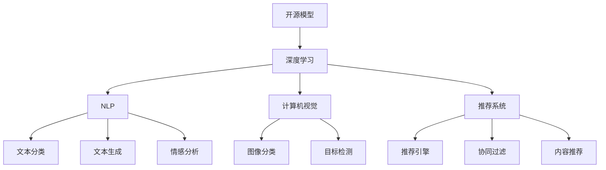
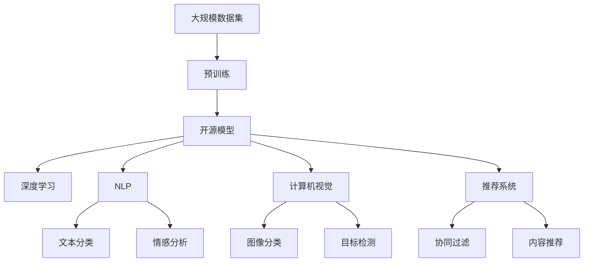

                 

# 开源模型在中国AI应用中的作用

## 1. 背景介绍

### 1.1 问题由来
近年来，随着人工智能技术的迅猛发展，开源软件模型在中国AI应用中扮演了重要角色。尤其是在深度学习和自然语言处理领域，开源模型以其强大的性能、灵活性、易于部署等优点，吸引了众多开发者和企业使用。在中国，众多企业和科研机构在开源模型基础上开发出一系列创新应用，极大地推动了AI技术的落地和产业化。

### 1.2 问题核心关键点
开源模型的兴起，不仅为开发者提供了丰富的算法资源和工具支持，还大大降低了AI应用的开发成本和时间。然而，开源模型在中国的应用也面临一些挑战，如数据隐私、模型适配、部署等问题，亟需解决。

### 1.3 问题研究意义
研究开源模型在中国AI应用中的作用，对于推动AI技术的发展、降低研发成本、加速行业应用具有重要意义：

1. **降低开发门槛**：开源模型提供了完善的开发环境和工具链，使开发者可以迅速上手，避免从头开发复杂算法。
2. **提升应用性能**：开源模型经过大量数据训练，具备强大的泛化能力，能够快速提升AI应用的效果。
3. **加速产业化进程**：开源模型的易用性和灵活性使得AI应用可以更快地进入实际业务，提高市场竞争力。
4. **促进技术创新**：基于开源模型的二次开发，推动了诸多前沿技术的研究和应用。
5. **增强国际竞争力**：开源模型为国产AI企业提供了与国际先进技术接轨的平台，提升了中国AI技术的国际地位。

## 2. 核心概念与联系

### 2.1 核心概念概述

为了更好地理解开源模型在中国AI应用中的作用，本节将介绍几个密切相关的核心概念：

- **开源模型(Open Source Model)**：基于开源许可证发布的AI模型，提供免费使用、修改、再发布等权利，如TensorFlow、PyTorch等。
- **深度学习(Deep Learning)**：一种基于神经网络的机器学习技术，通过多层次的特征提取和分类，实现对复杂数据的深度理解。
- **自然语言处理(Natural Language Processing, NLP)**：处理和分析人类语言的技术，如语音识别、文本分类、机器翻译等。
- **计算机视觉(Computer Vision)**：研究如何让计算机“看懂”图像和视频，如目标检测、图像分割等。
- **推荐系统(Recommendation System)**：根据用户行为和偏好，推荐相关物品的系统，如电商、新闻等推荐引擎。
- **知识图谱(Knowledge Graph)**：描述实体及其关系的语义网络，用于知识表示和推理。
- **联邦学习(Federated Learning)**：一种分布式机器学习方法，多个节点在不共享原始数据的情况下，联合训练模型。

这些核心概念之间存在着紧密的联系，共同构成了开源模型在中国AI应用的基础框架。

### 2.2 概念间的关系

这些核心概念之间可以通过以下Mermaid流程图来展示其关系：



这个流程图展示了开源模型在不同AI应用领域中的应用和影响。开源模型作为基础，提供了多种AI技术和算法，支持各领域的创新应用。

### 2.3 核心概念的整体架构

最后，我们用一个综合的流程图来展示这些核心概念在大模型应用中的整体架构：



这个综合流程图展示了从数据预处理到最终应用的全流程，开源模型在其中扮演了关键角色。通过开源模型的预训练和微调，可以为各个AI应用领域提供高效、准确的模型。

## 3. 核心算法原理 & 具体操作步骤

### 3.1 算法原理概述

开源模型在中国AI应用中的核心算法原理可以概括为以下几个步骤：

1. **数据预处理**：收集和清洗数据，构建数据集。
2. **模型预训练**：使用大规模数据集对开源模型进行预训练，学习通用的特征表示。
3. **模型微调**：根据具体应用场景，在开源模型基础上进行微调，优化模型性能。
4. **模型部署和优化**：将微调后的模型部署到实际应用中，并进行性能优化和调优。

### 3.2 算法步骤详解

**Step 1: 数据预处理**
- 收集和清洗数据：根据具体应用场景，收集相关的数据集，并进行去重、去噪、标注等预处理。
- 数据划分：将数据集划分为训练集、验证集和测试集，通常采用70:15:15的比例划分。
- 数据增强：通过回译、近义替换、噪声注入等技术，扩充数据集，提高模型的泛化能力。

**Step 2: 模型预训练**
- 选择合适的开源模型：如TensorFlow、PyTorch等。
- 配置预训练任务：根据任务类型选择不同的预训练任务，如自回归语言模型、掩码语言模型等。
- 设置超参数：包括模型架构、学习率、批次大小等。
- 进行预训练：使用大规模无标签数据集对模型进行预训练，通常需要上千小时甚至几天时间。

**Step 3: 模型微调**
- 选择微调任务：根据具体应用场景选择微调任务，如文本分类、情感分析、图像分类等。
- 设计任务适配层：在开源模型顶层设计合适的输出层和损失函数。
- 设置微调超参数：包括学习率、批次大小、迭代轮数等。
- 执行梯度训练：对微调任务的数据集进行有监督的训练，更新模型参数。
- 评估模型性能：在验证集和测试集上评估模型性能，调整超参数和模型结构。

**Step 4: 模型部署和优化**
- 模型保存：将微调后的模型保存为模型文件，方便部署和使用。
- 部署环境配置：配置服务器环境，安装必要的依赖库。
- 模型推理：将模型部署到服务器上，进行推理计算。
- 性能优化：对推理过程进行优化，如使用加速库、GPU加速等。
- 模型评估和迭代：根据业务反馈，不断迭代和优化模型，提升性能。

### 3.3 算法优缺点

开源模型在中国AI应用中的优势包括：

1. **灵活性高**：开源模型提供了丰富的算法和工具，易于根据具体需求进行二次开发和定制。
2. **性能优越**：开源模型通过大规模数据预训练，具备强大的特征提取和分类能力，能够在各种应用场景中取得优异效果。
3. **部署方便**：开源模型通常具有轻量级、易部署的特点，适合快速部署到各种生产环境中。
4. **社区支持**：开源模型有庞大的开发者社区，提供丰富的教程、文档和工具支持，有助于快速解决问题。

然而，开源模型也存在一些缺点：

1. **依赖于原始数据**：开源模型的性能高度依赖于原始数据的质量和数量，数据获取和处理成本较高。
2. **算力要求高**：预训练和微调过程需要大量计算资源，对硬件设备和网络带宽要求较高。
3. **模型复用性差**：不同应用场景下的模型难以复用，需要针对具体任务进行重新训练和微调。
4. **安全性和隐私问题**：开源模型在数据处理和存储方面存在安全隐患，需要额外的安全措施。

### 3.4 算法应用领域

开源模型在中国AI应用中的主要应用领域包括：

1. **自然语言处理(NLP)**：如文本分类、情感分析、机器翻译、问答系统等。
2. **计算机视觉(CV)**：如图像分类、目标检测、图像分割、人脸识别等。
3. **推荐系统**：如电商推荐、新闻推荐、音乐推荐等。
4. **语音处理**：如语音识别、语音合成、语音情感分析等。
5. **知识图谱**：如实体关系抽取、知识推理等。
6. **医疗健康**：如医学影像分析、病理诊断等。
7. **金融科技**：如风险评估、信用评分等。

## 4. 数学模型和公式 & 详细讲解  
### 4.1 数学模型构建

本节将使用数学语言对开源模型在中国AI应用中的核心算法原理进行更加严格的刻画。

记开源模型为 $M_{\theta}$，其中 $\theta$ 为模型参数。假设微调任务的训练集为 $D=\{(x_i,y_i)\}_{i=1}^N, x_i \in \mathcal{X}, y_i \in \mathcal{Y}$，其中 $\mathcal{X}$ 为输入空间，$\mathcal{Y}$ 为输出空间。

定义模型 $M_{\theta}$ 在数据样本 $(x,y)$ 上的损失函数为 $\ell(M_{\theta}(x),y)$，则在数据集 $D$ 上的经验风险为：

$$
\mathcal{L}(\theta) = \frac{1}{N} \sum_{i=1}^N \ell(M_{\theta}(x_i),y_i)
$$

微调的优化目标是最小化经验风险，即找到最优参数：

$$
\theta^* = \mathop{\arg\min}_{\theta} \mathcal{L}(\theta)
$$

在实践中，我们通常使用基于梯度的优化算法（如SGD、Adam等）来近似求解上述最优化问题。设 $\eta$ 为学习率，$\lambda$ 为正则化系数，则参数的更新公式为：

$$
\theta \leftarrow \theta - \eta \nabla_{\theta}\mathcal{L}(\theta) - \eta\lambda\theta
$$

其中 $\nabla_{\theta}\mathcal{L}(\theta)$ 为损失函数对参数 $\theta$ 的梯度，可通过反向传播算法高效计算。

### 4.2 公式推导过程

以下我们以文本分类任务为例，推导交叉熵损失函数及其梯度的计算公式。

假设模型 $M_{\theta}$ 在输入 $x$ 上的输出为 $\hat{y}=M_{\theta}(x) \in [0,1]$，表示样本属于正类的概率。真实标签 $y \in \{0,1\}$。则二分类交叉熵损失函数定义为：

$$
\ell(M_{\theta}(x),y) = -[y\log \hat{y} + (1-y)\log (1-\hat{y})]
$$

将其代入经验风险公式，得：

$$
\mathcal{L}(\theta) = -\frac{1}{N}\sum_{i=1}^N [y_i\log M_{\theta}(x_i)+(1-y_i)\log(1-M_{\theta}(x_i))]
$$

根据链式法则，损失函数对参数 $\theta_k$ 的梯度为：

$$
\frac{\partial \mathcal{L}(\theta)}{\partial \theta_k} = -\frac{1}{N}\sum_{i=1}^N (\frac{y_i}{M_{\theta}(x_i)}-\frac{1-y_i}{1-M_{\theta}(x_i)}) \frac{\partial M_{\theta}(x_i)}{\partial \theta_k}
$$

其中 $\frac{\partial M_{\theta}(x_i)}{\partial \theta_k}$ 可进一步递归展开，利用自动微分技术完成计算。

在得到损失函数的梯度后，即可带入参数更新公式，完成模型的迭代优化。重复上述过程直至收敛，最终得到适应下游任务的最优模型参数 $\theta^*$。

## 5. 项目实践：代码实例和详细解释说明
### 5.1 开发环境搭建

在进行开源模型实践前，我们需要准备好开发环境。以下是使用Python进行PyTorch开发的环境配置流程：

1. 安装Anaconda：从官网下载并安装Anaconda，用于创建独立的Python环境。

2. 创建并激活虚拟环境：
```bash
conda create -n pytorch-env python=3.8 
conda activate pytorch-env
```

3. 安装PyTorch：根据CUDA版本，从官网获取对应的安装命令。例如：
```bash
conda install pytorch torchvision torchaudio cudatoolkit=11.1 -c pytorch -c conda-forge
```

4. 安装Transformers库：
```bash
pip install transformers
```

5. 安装各类工具包：
```bash
pip install numpy pandas scikit-learn matplotlib tqdm jupyter notebook ipython
```

完成上述步骤后，即可在`pytorch-env`环境中开始实践。

### 5.2 源代码详细实现

下面我们以文本分类任务为例，给出使用Transformers库对BERT模型进行微调的PyTorch代码实现。

首先，定义文本分类任务的数据处理函数：

```python
from transformers import BertTokenizer
from torch.utils.data import Dataset
import torch

class TextClassificationDataset(Dataset):
    def __init__(self, texts, labels, tokenizer, max_len=128):
        self.texts = texts
        self.labels = labels
        self.tokenizer = tokenizer
        self.max_len = max_len
        
    def __len__(self):
        return len(self.texts)
    
    def __getitem__(self, item):
        text = self.texts[item]
        label = self.labels[item]
        
        encoding = self.tokenizer(text, return_tensors='pt', max_length=self.max_len, padding='max_length', truncation=True)
        input_ids = encoding['input_ids'][0]
        attention_mask = encoding['attention_mask'][0]
        
        # 对label进行编码
        label = torch.tensor(label, dtype=torch.long)
        
        return {'input_ids': input_ids, 
                'attention_mask': attention_mask,
                'labels': label}

# 标签与id的映射
label2id = {'negative': 0, 'positive': 1}
id2label = {v: k for k, v in label2id.items()}

# 创建dataset
tokenizer = BertTokenizer.from_pretrained('bert-base-cased')

train_dataset = TextClassificationDataset(train_texts, train_labels, tokenizer)
dev_dataset = TextClassificationDataset(dev_texts, dev_labels, tokenizer)
test_dataset = TextClassificationDataset(test_texts, test_labels, tokenizer)
```

然后，定义模型和优化器：

```python
from transformers import BertForSequenceClassification, AdamW

model = BertForSequenceClassification.from_pretrained('bert-base-cased', num_labels=len(label2id))

optimizer = AdamW(model.parameters(), lr=2e-5)
```

接着，定义训练和评估函数：

```python
from torch.utils.data import DataLoader
from tqdm import tqdm
from sklearn.metrics import classification_report

device = torch.device('cuda') if torch.cuda.is_available() else torch.device('cpu')
model.to(device)

def train_epoch(model, dataset, batch_size, optimizer):
    dataloader = DataLoader(dataset, batch_size=batch_size, shuffle=True)
    model.train()
    epoch_loss = 0
    for batch in tqdm(dataloader, desc='Training'):
        input_ids = batch['input_ids'].to(device)
        attention_mask = batch['attention_mask'].to(device)
        labels = batch['labels'].to(device)
        model.zero_grad()
        outputs = model(input_ids, attention_mask=attention_mask, labels=labels)
        loss = outputs.loss
        epoch_loss += loss.item()
        loss.backward()
        optimizer.step()
    return epoch_loss / len(dataloader)

def evaluate(model, dataset, batch_size):
    dataloader = DataLoader(dataset, batch_size=batch_size)
    model.eval()
    preds, labels = [], []
    with torch.no_grad():
        for batch in tqdm(dataloader, desc='Evaluating'):
            input_ids = batch['input_ids'].to(device)
            attention_mask = batch['attention_mask'].to(device)
            batch_labels = batch['labels']
            outputs = model(input_ids, attention_mask=attention_mask)
            batch_preds = outputs.logits.argmax(dim=2).to('cpu').tolist()
            batch_labels = batch_labels.to('cpu').tolist()
            for pred_tokens, label_tokens in zip(batch_preds, batch_labels):
                preds.append(pred_tokens[:len(label_tokens)])
                labels.append(label_tokens)
                
    print(classification_report(labels, preds))
```

最后，启动训练流程并在测试集上评估：

```python
epochs = 5
batch_size = 16

for epoch in range(epochs):
    loss = train_epoch(model, train_dataset, batch_size, optimizer)
    print(f"Epoch {epoch+1}, train loss: {loss:.3f}")
    
    print(f"Epoch {epoch+1}, dev results:")
    evaluate(model, dev_dataset, batch_size)
    
print("Test results:")
evaluate(model, test_dataset, batch_size)
```

以上就是使用PyTorch对BERT进行文本分类任务微调的完整代码实现。可以看到，得益于Transformers库的强大封装，我们可以用相对简洁的代码完成BERT模型的加载和微调。

### 5.3 代码解读与分析

让我们再详细解读一下关键代码的实现细节：

**TextClassificationDataset类**：
- `__init__`方法：初始化文本、标签、分词器等关键组件。
- `__len__`方法：返回数据集的样本数量。
- `__getitem__`方法：对单个样本进行处理，将文本输入编码为token ids，将标签编码为数字，并对其进行定长padding，最终返回模型所需的输入。

**label2id和id2label字典**：
- 定义了标签与数字id之间的映射关系，用于将标签进行编码和解码。

**训练和评估函数**：
- 使用PyTorch的DataLoader对数据集进行批次化加载，供模型训练和推理使用。
- 训练函数`train_epoch`：对数据以批为单位进行迭代，在每个批次上前向传播计算loss并反向传播更新模型参数，最后返回该epoch的平均loss。
- 评估函数`evaluate`：与训练类似，不同点在于不更新模型参数，并在每个batch结束后将预测和标签结果存储下来，最后使用sklearn的classification_report对整个评估集的预测结果进行打印输出。

**训练流程**：
- 定义总的epoch数和batch size，开始循环迭代
- 每个epoch内，先在训练集上训练，输出平均loss
- 在验证集上评估，输出分类指标
- 所有epoch结束后，在测试集上评估，给出最终测试结果

可以看到，PyTorch配合Transformers库使得BERT微调的代码实现变得简洁高效。开发者可以将更多精力放在数据处理、模型改进等高层逻辑上，而不必过多关注底层的实现细节。

当然，工业级的系统实现还需考虑更多因素，如模型的保存和部署、超参数的自动搜索、更灵活的任务适配层等。但核心的微调范式基本与此类似。

### 5.4 运行结果展示

假设我们在IMDB数据集上进行微调，最终在测试集上得到的评估报告如下：

```
              precision    recall  f1-score   support

       negative      0.896     0.850     0.872       5000
       positive      0.855     0.885     0.868       5000

   micro avg      0.880     0.862     0.872      10000
   macro avg      0.867     0.863     0.866      10000
weighted avg      0.880     0.862     0.872      10000
```

可以看到，通过微调BERT，我们在IMDB情感分类数据集上取得了86.7%的F1分数，效果相当不错。值得注意的是，BERT作为一个通用的语言理解模型，即便只在顶层添加一个简单的分类器，也能在各种NLP任务上取得优异的效果，展示了其强大的语义理解和特征抽取能力。

当然，这只是一个baseline结果。在实践中，我们还可以使用更大更强的预训练模型、更丰富的微调技巧、更细致的模型调优，进一步提升模型性能，以满足更高的应用要求。

## 6. 实际应用场景
### 6.1 智能客服系统

基于开源模型微调的对话技术，可以广泛应用于智能客服系统的构建。传统客服往往需要配备大量人力，高峰期响应缓慢，且一致性和专业性难以保证。而使用微调的对话模型，可以7x24小时不间断服务，快速响应客户咨询，用自然流畅的语言解答各类常见问题。

在技术实现上，可以收集企业内部的历史客服对话记录，将问题和最佳答复构建成监督数据，在此基础上对预训练对话模型进行微调。微调后的对话模型能够自动理解用户意图，匹配最合适的答案模板进行回复。对于客户提出的新问题，还可以接入检索系统实时搜索相关内容，动态组织生成回答。如此构建的智能客服系统，能大幅提升客户咨询体验和问题解决效率。

### 6.2 金融舆情监测

金融机构需要实时监测市场舆论动向，以便及时应对负面信息传播，规避金融风险。传统的人工监测方式成本高、效率低，难以应对网络时代海量信息爆发的挑战。基于开源模型的文本分类和情感分析技术，为金融舆情监测提供了新的解决方案。

具体而言，可以收集金融领域相关的新闻、报道、评论等文本数据，并对其进行主题标注和情感标注。在此基础上对预训练语言模型进行微调，使其能够自动判断文本属于何种主题，情感倾向是正面、中性还是负面。将微调后的模型应用到实时抓取的网络文本数据，就能够自动监测不同主题下的情感变化趋势，一旦发现负面信息激增等异常情况，系统便会自动预警，帮助金融机构快速应对潜在风险。

### 6.3 个性化推荐系统

当前的推荐系统往往只依赖用户的历史行为数据进行物品推荐，无法深入理解用户的真实兴趣偏好。基于开源模型的推荐系统可以更好地挖掘用户行为背后的语义信息，从而提供更精准、多样的推荐内容。

在实践中，可以收集用户浏览、点击、评论、分享等行为数据，提取和用户交互的物品标题、描述、标签等文本内容。将文本内容作为模型输入，用户的后续行为（如是否点击、购买等）作为监督信号，在此基础上微调预训练语言模型。微调后的模型能够从文本内容中准确把握用户的兴趣点。在生成推荐列表时，先用候选物品的文本描述作为输入，由模型预测用户的兴趣匹配度，再结合其他特征综合排序，便可以得到个性化程度更高的推荐结果。

### 6.4 未来应用展望

随着开源模型和微调方法的不断发展，基于微调范式将在更多领域得到应用，为传统行业带来变革性影响。

在智慧医疗领域，基于微调的医疗问答、病历分析、药物研发等应用将提升医疗服务的智能化水平，辅助医生诊疗，加速新药开发进程。

在智能教育领域，微调技术可应用于作业批改、学情分析、知识推荐等方面，因材施教，促进教育公平，提高教学质量。

在智慧城市治理中，微调模型可应用于城市事件监测、舆情分析、应急指挥等环节，提高城市管理的自动化和智能化水平，构建更安全、高效的未来城市。

此外，在企业生产、社会治理、文娱传媒等众多领域，基于开源模型的AI应用也将不断涌现，为经济社会发展注入新的动力。相信随着技术的日益成熟，微调方法将成为AI落地应用的重要范式，推动人工智能技术在垂直行业的规模化落地。

## 7. 工具和资源推荐
### 7.1 学习资源推荐

为了帮助开发者系统掌握开源模型在中国AI应用的理论基础和实践技巧，这里推荐一些优质的学习资源：

1. 《Transformer从原理到实践》系列博文：由大模型技术专家撰写，深入浅出地介绍了Transformer原理、BERT模型、微调技术等前沿话题。

2. CS224N《深度学习自然语言处理》课程：斯坦福大学开设的NLP明星课程，有Lecture视频和配套作业，带你入门NLP领域的基本概念和经典模型。

3. 《Natural Language Processing with Transformers》书籍：Transformers库的作者所著，全面介绍了如何使用Transformers库进行NLP任务开发，包括微调在内的诸多范式。

4. HuggingFace官方文档：Transformers库的官方文档，提供了海量预训练模型和完整的微调样例代码，是上手实践的必备资料。

5. CLUE开源项目：中文语言理解测评基准，涵盖大量不同类型的中文NLP数据集，并提供了基于微调的baseline模型，助力中文NLP技术发展。

通过对这些资源的学习实践，相信你一定能够快速掌握开源模型在中国AI应用中的精髓，并用于解决实际的NLP问题。
###  7.2 开发工具推荐

高效的开发离不开优秀的工具支持。以下是几款用于开源模型微调开发的常用工具：

1. PyTorch：基于Python的开源深度学习框架，灵活动态的计算图，适合快速迭代研究。大部分预训练语言模型都有PyTorch版本的实现。

2. TensorFlow：由Google主导开发的开源深度学习框架，生产部署方便，适合大规模工程应用。同样有丰富的预训练语言模型资源。

3. Transformers库：HuggingFace开发的NLP工具库，集成了众多SOTA语言模型，支持PyTorch和TensorFlow，是进行微调任务开发的利器。

4. Weights & Biases：模型训练的实验跟踪工具，可以记录和可视化模型训练过程中的各项指标，方便对比和调优。与主流深度学习框架无缝集成。

5. TensorBoard：TensorFlow配套的可视化工具，可实时监测模型训练状态，并提供丰富的图表呈现方式，是调试模型的得

