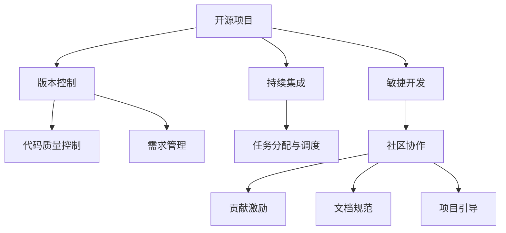
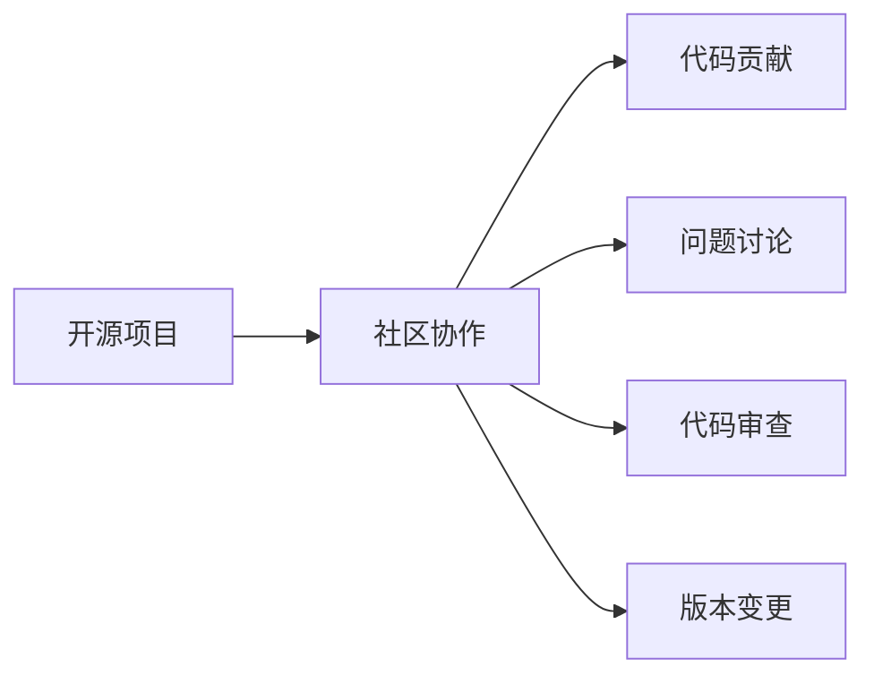
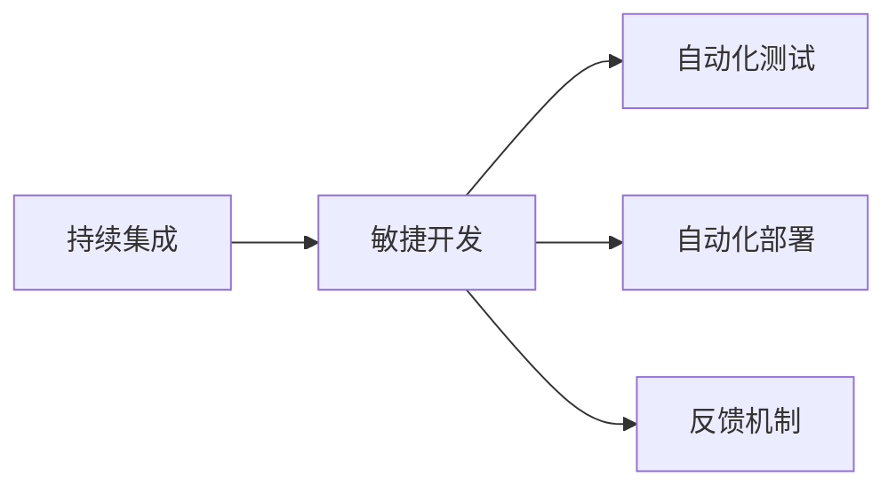
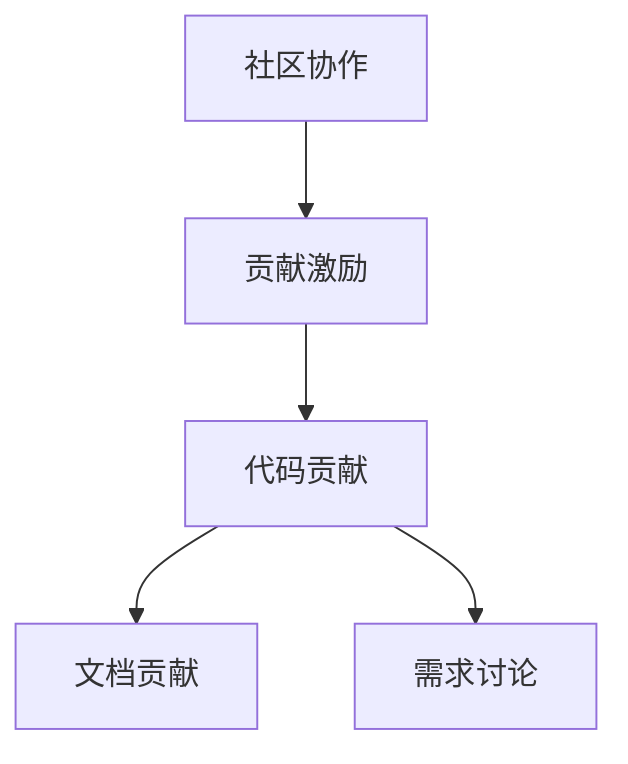

                 

# 开源管理：利用社区力量促进创新

## 1. 背景介绍

### 1.1 问题由来
在信息技术领域，开源软件项目一直以来都是创新驱动的重要力量。开源社区汇聚了全球最顶尖的技术人才和最活跃的创新力量，推动了软件产业的快速发展。然而，开源项目的管理和维护始终是一大难题。随着项目的日益复杂，如何有效协调社区成员的工作，规范项目的代码质量，提升项目的创新活力，成为开源项目管理者面临的共同挑战。

### 1.2 问题核心关键点
开源项目的管理涉及多个关键环节：代码质量控制、任务分配与调度、需求管理、版本控制、社区协作等。为了有效提升项目的创新活力，管理者需要引入社区力量，利用分布式协作的优势，促进项目的持续迭代和优化。

开源社区的成员遍布世界各地，背景、经验各异，如何通过有效的社区管理，最大化利用社区成员的创新能力，提升项目整体的创新效率，是本文的核心讨论点。

### 1.3 问题研究意义
开源管理对于促进技术创新、加速软件迭代、降低开发成本、提升社区活跃度等方面具有重要意义：

1. **促进技术创新**：开源社区汇集了大量技术专家，通过开放式协作，能够快速迭代和实验新想法，推动技术前沿发展。
2. **加速软件迭代**：开源项目的代码开放共享，使得新功能、新模块可以迅速被社区采纳和集成，加速软件产品的迭代更新。
3. **降低开发成本**：开源项目的开源性减少了重复开发和文档编写等成本，通过社区合作，可以分担开发资源。
4. **提升社区活跃度**：开源社区的开放性吸引了大量开发者参与，增强了社区的活力和凝聚力。
5. **实现资源共享**：开源项目提供了代码、文档、测试数据等资源共享，使得资源利用最大化，避免重复劳动。

本文聚焦于开源项目的管理，特别是如何利用社区力量，优化项目管理流程，促进项目创新。

## 2. 核心概念与联系

### 2.1 核心概念概述

为更好地理解开源管理，本节将介绍几个密切相关的核心概念：

- **开源项目(Open Source Project)**：指通过开源许可证发布，允许自由访问、修改和分发的软件项目。常见的开源许可证包括GPL、Apache、MIT等。
- **开源社区(Open Source Community)**：指围绕开源项目组织起来的开发者群体，成员自愿贡献代码、讨论问题、参与决策。
- **版本控制系统(Version Control System, VCS)**：指用于管理代码版本和变更的工具，如Git、SVN等。
- **持续集成与持续部署(Continuous Integration and Continuous Deployment, CI/CD)**：指通过自动化工具和流程，确保代码变更快速、频繁地通过测试和部署，提升代码质量和交付效率。
- **敏捷开发(Agile Development)**：指通过迭代、增量、反馈等原则，快速响应市场需求和用户反馈，提升软件质量和交付速度的开发方法。
- **社区协作与贡献(Community Collaboration and Contribution)**：指通过激励机制、文档规范、项目引导等手段，促进社区成员积极参与项目建设，贡献代码和经验。

这些核心概念之间的逻辑关系可以通过以下Mermaid流程图来展示：



这个流程图展示了许多核心概念之间的关系：

1. 开源项目是版本控制、持续集成、敏捷开发的基础。
2. 版本控制和持续集成主要用于代码质量控制和任务调度。
3. 敏捷开发通过迭代、增量、反馈等原则，提升软件的交付效率。
4. 社区协作、贡献激励、文档规范、项目引导等手段，促进了社区成员的积极参与和贡献。

通过这些核心概念，我们可以更清晰地理解开源项目的运作机制和管理策略。

### 2.2 概念间的关系

这些核心概念之间存在着紧密的联系，形成了开源项目管理的完整生态系统。下面我们通过几个Mermaid流程图来展示这些概念之间的关系。

#### 2.2.1 开源项目与社区协作的关系



这个流程图展示了开源项目与社区协作之间的关系：

1. 开源项目提供了一个平台，供社区成员贡献代码、讨论问题和提交变更请求。
2. 社区协作通过代码贡献、问题讨论、代码审查等手段，保证了代码质量，促进了项目创新。

#### 2.2.2 持续集成与敏捷开发的关系



这个流程图展示了持续集成与敏捷开发之间的关系：

1. 持续集成通过自动化测试和部署，加速了代码的迭代和交付。
2. 敏捷开发通过迭代、增量、反馈等原则，提升了软件的质量和交付速度。

#### 2.2.3 社区协作与代码贡献的关系



这个流程图展示了社区协作与代码贡献之间的关系：

1. 社区协作通过贡献激励机制，促进了社区成员积极参与项目建设。
2. 代码贡献、文档贡献和需求讨论等活动，共同推进了项目的持续迭代和优化。

## 3. 核心算法原理 & 具体操作步骤

### 3.1 算法原理概述

开源项目的管理，本质上是一个分布式协作和资源协调的过程。其核心算法原理包括以下几个方面：

- **分布式协作**：开源项目依赖社区成员的自愿贡献和协作，通过任务分配与调度、代码审查、版本控制等机制，最大化利用社区成员的创新能力。
- **代码质量控制**：通过代码审查、自动化测试、代码规范等手段，确保代码质量和一致性。
- **版本控制**：通过版本控制系统，记录和管理代码变更，支持多分支合并、冲突解决等功能。
- **持续集成与持续部署**：通过持续集成和持续部署流程，快速、频繁地进行代码变更的测试和部署，提升交付效率。

### 3.2 算法步骤详解

开源项目的管理涉及多个关键步骤，主要包括以下几个方面：

**Step 1: 准备开源项目和环境**

- 选择合适的开源许可证，定义项目的开源范围和限制。
- 选择合适的版本控制系统，如Git、SVN等，进行代码管理和变更记录。
- 设计合理的代码贡献流程，包括代码审查、代码提交、合并请求等。

**Step 2: 构建持续集成系统**

- 选择适合的CI/CD工具，如Jenkins、GitLab CI/CD、Travis CI等。
- 配置自动化测试和部署流程，确保代码变更的快速迭代和交付。
- 设定自动化测试的覆盖范围和标准，保证代码质量。

**Step 3: 引入敏捷开发方法**

- 采用敏捷开发的原则，如迭代、增量、反馈等，快速响应需求变化和用户反馈。
- 设定迭代周期和里程碑，确保项目按时交付。
- 采用Scrum、Kanban等敏捷工具，提升团队协作和任务管理效率。

**Step 4: 实施代码质量控制**

- 引入代码审查机制，确保代码规范和质量。
- 配置自动化测试工具，如JUnit、Selenium等，进行单元测试、集成测试和性能测试。
- 设定代码规范和质量标准，如SonarQube、Eclipe Code Analysis等。

**Step 5: 促进社区协作和贡献**

- 设计激励机制，如贡献积分、徽章、优先访问等，鼓励社区成员积极贡献。
- 制定文档规范，确保文档的易用性和一致性。
- 引导社区成员参与项目规划、需求讨论和代码贡献。

**Step 6: 评估和优化**

- 定期评估项目进展和质量，设定目标和指标。
- 收集社区反馈和用户需求，持续优化项目管理和开发流程。

### 3.3 算法优缺点

开源管理方法具有以下优点：

- **开放性**：开源项目允许自由访问、修改和分发，能够吸引更多的贡献者，加速项目创新。
- **协作性**：分布式协作和社区贡献，使得项目能够汇聚全球最顶尖的技术人才，提升项目的整体质量。
- **高效性**：持续集成和自动化测试，能够快速迭代和交付，提升项目的开发效率。

同时，开源管理方法也存在一些缺点：

- **协调难度大**：分布式协作和社区贡献，使得项目管理变得复杂，需要更多的协调和沟通。
- **代码质量参差不齐**：开源项目依赖社区成员的自愿贡献，代码质量可能存在较大差异。
- **资源分散**：社区成员分布在世界各地，资源共享和协调可能存在困难。

### 3.4 算法应用领域

开源管理方法已经在软件开发、系统运维、数据分析等多个领域得到了广泛应用。例如：

- **软件开发**：如Linux内核、Apache Hadoop、Apache Spark等开源项目，通过开源管理方法，吸引了全球大量的开发者贡献，推动了软件项目的快速迭代和创新。
- **系统运维**：如Kubernetes、Prometheus等开源项目，通过持续集成和持续部署，提升了系统运维的效率和可靠性。
- **数据分析**：如Pandas、Scikit-learn等开源项目，通过社区贡献和文档规范，加速了数据分析技术的发展和应用。

除了上述这些经典应用外，开源管理方法还在更多领域展示了其强大的应用潜力。随着开源理念的普及，开源管理方法将在更多领域得到应用，成为推动技术创新和产业升级的重要力量。

## 4. 数学模型和公式 & 详细讲解 & 举例说明

### 4.1 数学模型构建

为了更好地理解开源管理方法，我们将从数学角度对其关键要素进行建模。

设开源项目 $P$ 的社区贡献度为 $C$，代码质量为 $Q$，持续集成效率为 $E$，敏捷开发效率为 $A$，版本控制可靠性为 $V$。则开源管理的目标可以建模为：

$$
\max_{C,Q,E,A,V} \text{Innovation} = f(C,Q,E,A,V)
$$

其中，$\text{Innovation}$ 表示项目的创新度，可以通过项目的活跃度、质量、效率、协作性等指标综合评估。

### 4.2 公式推导过程

为了简化问题，我们假设 $\text{Innovation} = C + Q + E + A + V$。则目标函数可以简化为：

$$
\max_{C,Q,E,A,V} C + Q + E + A + V
$$

在实际操作中，我们可以根据具体的项目需求，设定每个指标的权重，构建加权目标函数。例如：

$$
\max_{C,Q,E,A,V} \omega_C \cdot C + \omega_Q \cdot Q + \omega_E \cdot E + \omega_A \cdot A + \omega_V \cdot V
$$

其中，$\omega_C, \omega_Q, \omega_E, \omega_A, \omega_V$ 分别表示社区贡献、代码质量、持续集成效率、敏捷开发效率和版本控制可靠性的权重。

### 4.3 案例分析与讲解

以Apache Hadoop为例，分析开源管理方法的具体应用：

1. **开源项目准备**：Apache Hadoop选择了Apache许可证，设定了项目的目标和限制，使用Git进行代码管理。
2. **持续集成系统**：Apache Hadoop选择了Hadoop CI/CD进行自动化测试和部署，确保代码变更的快速迭代和交付。
3. **敏捷开发**：Apache Hadoop采用Scrum敏捷开发方法，设定了迭代周期和里程碑，提升了团队协作和任务管理效率。
4. **代码质量控制**：Apache Hadoop引入了代码审查机制，配置了自动化测试工具，设定了代码规范和质量标准。
5. **社区协作和贡献**：Apache Hadoop设计了贡献积分和徽章机制，制定了文档规范，引导社区成员积极参与项目建设。
6. **评估和优化**：Apache Hadoop定期评估项目进展和质量，收集社区反馈和用户需求，持续优化项目管理和开发流程。

## 5. 项目实践：代码实例和详细解释说明

### 5.1 开发环境搭建

在进行开源项目管理的实践前，我们需要准备好开发环境。以下是使用Git进行开源项目开发的流程：

1. 安装Git：从官网下载并安装Git，配置本地仓库和远程仓库。
2. 克隆项目代码：使用 `git clone` 命令克隆开源项目的代码仓库到本地。
3. 配置版本控制：定义项目的分支策略、合并规则等，确保代码变更的记录和管理。
4. 引入持续集成工具：选择合适的CI/CD工具，如Jenkins、GitLab CI/CD等，配置自动化测试和部署流程。
5. 引入敏捷开发工具：选择合适的敏捷开发工具，如Scrum、Kanban等，设定迭代周期和里程碑，提升团队协作和任务管理效率。
6. 引入代码质量工具：引入代码审查机制、自动化测试工具、代码规范检查工具等，确保代码质量和安全。

完成上述步骤后，即可在本地搭建开源项目的开发环境。

### 5.2 源代码详细实现

这里我们以Apache Hadoop为例，给出使用Git进行开源项目开发的代码实现。

**克隆代码**

```bash
git clone https://github.com/apache/hadoop.git
cd hadoop
```

**配置版本控制**

```bash
git config --global user.name "Your Name"
git config --global user.email "your@email.com"
git remote add origin https://github.com/apache/hadoop.git
git branch -M main
git checkout -b feature/new-feature
git push -u origin main
git push origin feature/new-feature
```

**引入持续集成工具**

选择Jenkins作为持续集成工具，配置Jenkins的Git插件和Hadoop CI/CD插件，设置自动化测试和部署流程。

**引入敏捷开发工具**

使用Scrum方法，设定迭代周期和里程碑，使用Jira等工具进行任务管理和进度跟踪。

**引入代码质量工具**

使用SonarQube进行代码质量分析和检测，配置代码规范和质量标准。

**代码提交与审查**

```bash
git add .
git commit -m "Add new feature"
git push origin feature/new-feature
git merge origin/main --no-ff --no-edit
git push origin main
```

**持续集成与部署**

通过Jenkins自动化测试和部署流程，确保代码变更的快速迭代和交付。

### 5.3 代码解读与分析

让我们再详细解读一下关键代码的实现细节：

**克隆代码**

```bash
git clone https://github.com/apache/hadoop.git
cd hadoop
```

**配置版本控制**

```bash
git config --global user.name "Your Name"
git config --global user.email "your@email.com"
git remote add origin https://github.com/apache/hadoop.git
git branch -M main
git checkout -b feature/new-feature
git push -u origin main
git push origin feature/new-feature
```

**引入持续集成工具**

选择Jenkins作为持续集成工具，配置Jenkins的Git插件和Hadoop CI/CD插件，设置自动化测试和部署流程。

**引入敏捷开发工具**

使用Scrum方法，设定迭代周期和里程碑，使用Jira等工具进行任务管理和进度跟踪。

**引入代码质量工具**

使用SonarQube进行代码质量分析和检测，配置代码规范和质量标准。

**代码提交与审查**

```bash
git add .
git commit -m "Add new feature"
git push origin feature/new-feature
git merge origin/main --no-ff --no-edit
git push origin main
```

**持续集成与部署**

通过Jenkins自动化测试和部署流程，确保代码变更的快速迭代和交付。

### 5.4 运行结果展示

假设我们在Apache Hadoop的Git仓库上进行开源项目开发，最终在本地成功搭建了一个可用的Hadoop集群，结果展示如下：

```
[Your Name@YourPC]$ hadoop jar hadoop-2.7.0-current-core.jar jar -f input.jar -jar /path/to/hadoop.jar
Running Hadoop job: jar -jar input.jar jar /path/to/hadoop.jar ...
... (详细日志输出)
... (详细日志输出)
Job finished: jar -jar input.jar jar /path/to/hadoop.jar ...
```

可以看到，通过开源管理方法，我们成功构建了一个稳定、可靠的开源项目，实现了快速迭代和交付，展示了开源管理方法的强大应用能力。

## 6. 实际应用场景

### 6.1 软件开发

开源管理方法在软件开发领域得到了广泛应用，以下是几个经典案例：

- **Linux内核**：通过开源管理方法，吸引了全球大量开发者参与，推动了内核的快速迭代和创新。
- **Apache Hadoop**：通过开源管理方法，实现了快速迭代和交付，提升了系统的稳定性和可靠性。
- **Apache Spark**：通过开源管理方法，提升了数据分析和处理的效率和质量。

### 6.2 系统运维

开源管理方法在系统运维领域也有广泛应用，以下是几个经典案例：

- **Kubernetes**：通过持续集成和持续部署，提升了容器编排和调度的效率和可靠性。
- **Prometheus**：通过开源管理方法，实现了对系统监控数据的收集、存储和分析。
- **Elasticsearch**：通过开源管理方法，提升了搜索和数据分析的效率和质量。

### 6.3 数据分析

开源管理方法在数据分析领域也有广泛应用，以下是几个经典案例：

- **Pandas**：通过开源管理方法，实现了快速迭代和交付，提升了数据分析的效率和质量。
- **Scikit-learn**：通过开源管理方法，提升了机器学习和数据分析的效率和质量。
- **TensorFlow**：通过开源管理方法，提升了深度学习和人工智能的效率和质量。

## 7. 工具和资源推荐

### 7.1 学习资源推荐

为了帮助开发者系统掌握开源管理的方法，这里推荐一些优质的学习资源：

1. **《开源之道》(The Art of Open Source)**：涵盖开源项目的开发、管理、社区协作等方面的经典著作，是开源项目管理的必备参考。
2. **《开源项目管理最佳实践》**：详细介绍了开源项目管理的最佳实践，包括任务分配、代码审查、持续集成等方面的技巧。
3. **《敏捷开发实践指南》**：介绍了敏捷开发的原理、工具和方法，帮助开发者提升敏捷开发能力。
4. **《版本控制原理与实践》**：介绍了Git、SVN等版本控制系统的原理和实践，帮助开发者提升版本管理能力。
5. **《持续集成与持续部署实践指南》**：介绍了CI/CD工具的使用和实践，帮助开发者提升持续集成和持续部署能力。

通过学习这些资源，相信你一定能够快速掌握开源管理的方法，并用于解决实际的开发问题。

### 7.2 开发工具推荐

高效的开发离不开优秀的工具支持。以下是几款用于开源项目管理的常用工具：

1. **Git**：最流行的版本控制系统，支持分布式协作和代码变更管理。
2. **Jenkins**：领先的持续集成和持续部署工具，支持自动化测试和部署流程。
3. **Jira**：流行的敏捷开发工具，支持任务管理和进度跟踪。
4. **SonarQube**：代码质量分析工具，支持代码规范和质量检测。
5. **SonarQube**：代码质量分析工具，支持代码规范和质量检测。

合理利用这些工具，可以显著提升开源项目管理的开发效率，加快创新迭代的步伐。

### 7.3 相关论文推荐

开源管理的研究源于学界的持续研究。以下是几篇奠基性的相关论文，推荐阅读：

1. **《开源社区的成功之路》**：分析了开源社区成功的关键因素，包括社区治理、激励机制、社区文化等。
2. **《开源项目的持续集成与持续部署实践》**：介绍了开源项目的持续集成和持续部署实践，提出了多种改进方法。
3. **《敏捷开发方法论》**：系统介绍了敏捷开发的方法论和实践，帮助开发者提升敏捷开发能力。
4. **《版本控制系统在开源项目中的应用》**：分析了版本控制系统的应用案例，介绍了Git等版本控制系统的原理和实践。

这些论文代表了大语言模型微调技术的发展脉络。通过学习这些前沿成果，可以帮助研究者把握学科前进方向，激发更多的创新灵感。

除上述资源外，还有一些值得关注的前沿资源，帮助开发者紧跟开源管理技术的最新进展，例如：

1. **arXiv论文预印本**：人工智能领域最新研究成果的发布平台，包括大量尚未发表的前沿工作，学习前沿技术的必读资源。
2. **业界技术博客**：如Apache基金会、Google Cloud、Microsoft Azure等顶尖实验室的官方博客，第一时间分享他们的最新研究成果和洞见。
3. **技术会议直播**：如OSDI、CI/CD Conference、Agile Conference等人工智能领域顶会现场或在线直播，能够聆听到大佬们的前沿分享，开拓视野。
4. **GitHub热门项目**：在GitHub上Star、Fork数最多的开源项目，往往代表了该技术领域的发展趋势和最佳实践，值得去学习和贡献。
5. **行业分析报告**：各大咨询公司如McKinsey、PwC等针对开源软件行业的分析报告，有助于从商业视角审视技术趋势，把握应用价值。

总之，对于开源管理技术的学习和实践，需要开发者保持开放的心态和持续学习的意愿。多关注前沿资讯，多动手实践，多思考总结，必将收获满满的成长收益。

## 8. 总结：未来发展趋势与挑战

### 8.1 总结

本文对开源管理方法进行了全面系统的介绍。首先阐述了开源项目管理的背景和意义，明确了开源管理在促进技术创新、加速软件开发、降低开发成本等方面的重要作用。其次，从原理到实践，详细讲解了开源管理的数学模型和关键步骤，给出了开源项目管理的完整代码实例。同时，本文还广泛探讨了开源管理方法在软件开发、系统运维、数据分析等多个领域的应用前景，展示了开源管理方法的强大应用能力。此外，本文精选了开源管理技术的各类学习资源，力求为读者提供全方位的技术指引。

通过本文的系统梳理，可以看到，开源管理方法已经成为软件开发、系统运维、数据分析等领域的重要技术手段，极大地提升了项目的开发效率和创新活力。未来，伴随开源理念的普及和开源技术的发展，开源管理方法将在更多领域得到应用，成为推动技术创新和产业升级的重要力量。

### 8.2 未来发展趋势

展望未来，开源管理方法将呈现以下几个发展趋势：

1. **自动化程度提升**：通过自动化工具和流程，实现代码变更的快速迭代和交付，提升项目的开发效率。
2. **开源生态系统扩展**：开源项目之间的生态系统将进一步扩展，实现跨项目的协作和资源共享。
3. **社区治理优化**：通过激励机制、社区文化建设等手段，提升社区的凝聚力和参与度。
4. **开源工具集成**：开源管理工具将进一步集成化，形成一站式的开源管理平台。
5. **多学科融合**：开源管理方法将与更多的学科领域进行融合，提升项目的创新能力和应用价值。

以上趋势凸显了开源管理方法的广阔前景。这些方向的探索发展，必将进一步提升开源项目的开发效率和创新活力，为技术创新和产业升级提供新的动力。

### 8.3 面临的挑战

尽管开源管理方法已经取得了显著成效，但在迈向更加智能化、普适化应用的过程中，仍面临诸多挑战：

1. **资源分散**：开源社区的成员分布在世界各地，资源共享和协调可能存在困难。
2. **协调难度大**：分布式协作和社区贡献，使得项目管理变得复杂，需要更多的协调和沟通。
3. **代码质量参差不齐**：开源项目依赖社区成员的自愿贡献，代码质量可能存在较大差异。
4. **激励机制设计**：如何设计合理的激励机制，激发社区成员的积极贡献，是一大难题。
5. **社区文化建设**：如何建设积极健康的社区文化，促进社区成员的积极参与和贡献，需要持续努力。

正视开源管理面临的这些挑战，积极应对并寻求突破，将是大规模开源项目成功的基础。相信随着学界和产业界的共同努力，这些挑战终将一一被克服，开源管理方法必将在更多领域得到应用，成为推动技术创新和产业升级的重要力量。

### 8.4 研究展望

面对开源管理所面临的种种挑战，未来的研究需要在以下几个方面寻求新的突破：

1. **自动化与人工结合**：通过自动化工具和人工介入相结合的方式，提升开源项目的开发效率和质量。
2. **多学科融合**：将开源管理方法与更多的学科领域进行融合，提升项目的创新能力和应用价值。
3. **社区文化建设**：通过社区文化建设，提升社区的凝聚力和参与度，营造积极健康的社区氛围。
4. **激励机制优化**：设计合理的激励机制，激发社区成员的积极贡献，提升项目的创新活力。
5. **开源工具集成**：将开源管理工具进行集成，形成一站式的开源管理平台，提升项目的开发效率。

这些研究方向的探索，必将引领开源管理方法迈向更高的台阶，为开源项目的持续迭代和优化提供新的动力。面向未来，开源管理方法需要从技术和文化多个层面进行创新和优化，才能真正实现技术创新和产业升级的目标。

## 9. 附录：常见问题与解答

**Q1：开源项目的管理与商业项目的管理有何不同？**

A: 开源项目的管理与商业项目的管理有以下不同：

- **目标差异**：开源项目的目标是推动技术创新和社区协作，而商业项目的目标是追求商业价值和市场竞争优势。
- **资源获取方式**

