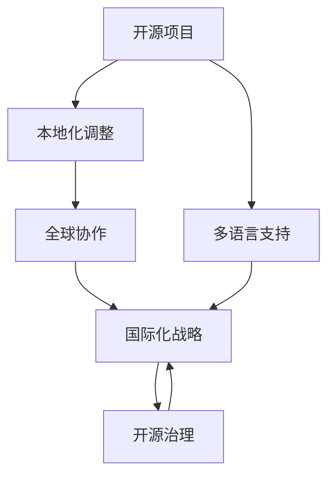
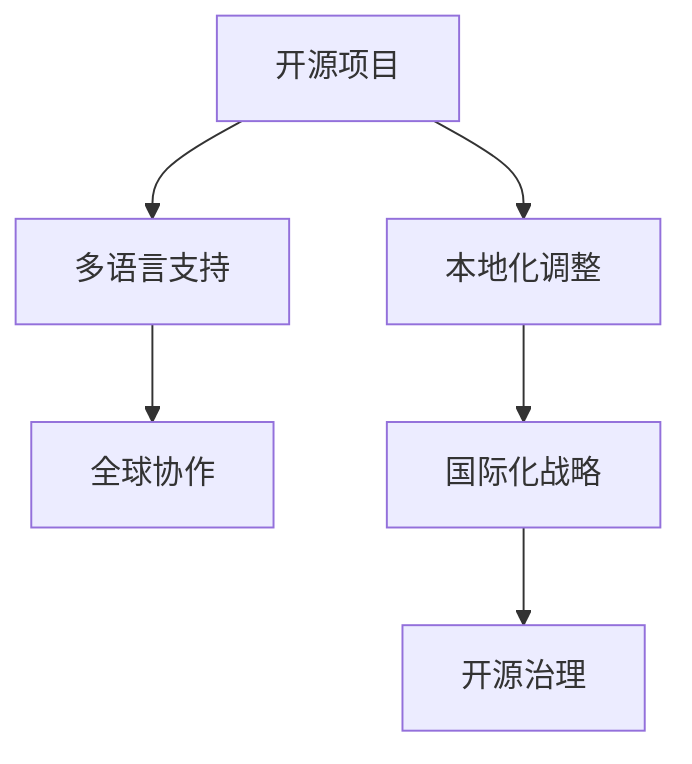
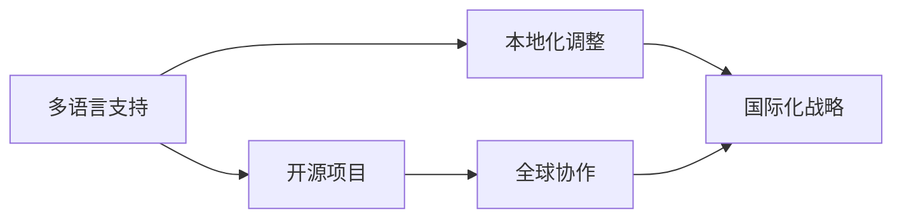
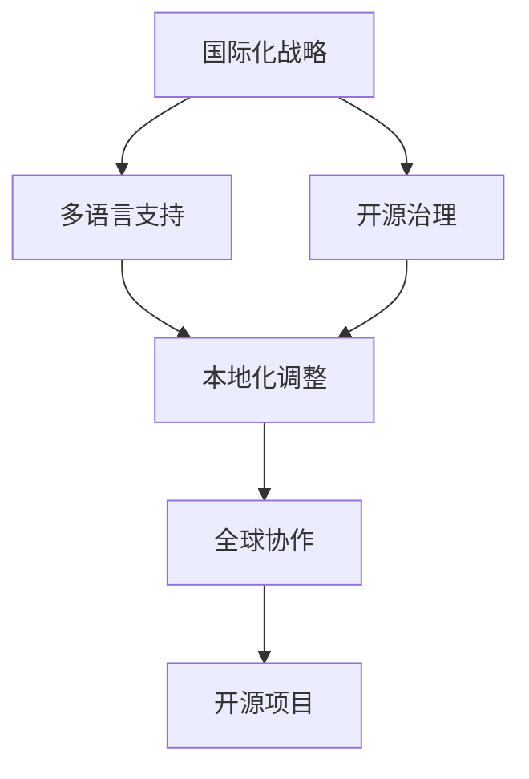
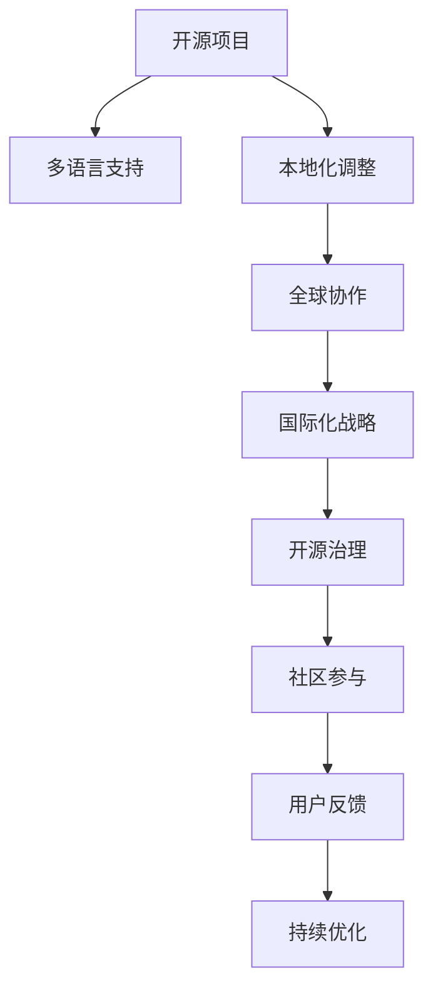

                 

# 开源项目的国际化咨询：跨文化商业机会

> 关键词：开源项目,国际化咨询,跨文化商业机会,开源治理,项目管理,企业国际化战略

## 1. 背景介绍

### 1.1 问题由来
在当今全球化的商业环境中，企业面临着日益激烈的竞争压力和复杂多变的市场需求。为了保持竞争优势，企业必须不断创新和提升其产品的全球市场表现。然而，由于不同国家在文化、语言、法律、法规、消费者行为等方面的差异，企业在进入新市场时常常会遇到一系列挑战。开源项目作为一种广泛应用的协作创新模式，对于企业来说，既是全球化战略的一部分，也是应对这些挑战的重要工具。因此，本文将聚焦于开源项目的国际化咨询，探讨如何在跨文化环境中实现商业机会的开拓和利用。

### 1.2 问题核心关键点
开源项目的国际化咨询旨在帮助企业在不同文化背景下进行成功的全球化拓展。它包括但不限于以下几个核心关键点：

- **跨文化理解**：理解并尊重不同文化背景下的用户需求和行为习惯。
- **多语言支持**：提供多语言版本的应用和文档，满足全球用户的语言需求。
- **本地化调整**：根据本地市场特征进行产品特性和功能的调整。
- **全球协作网络**：构建跨越不同国家和地区的开发者和用户网络。
- **国际化治理**：建立适用于全球化的开源治理机制。

### 1.3 问题研究意义
在全球化的今天，开源项目的国际化咨询对于企业的国际化战略具有重要意义：

- **减少市场进入障碍**：通过深入了解目标市场的文化和需求，减少市场准入的难度和风险。
- **提升品牌国际化形象**：通过成功的国际化项目，增强企业的国际品牌知名度和美誉度。
- **扩大市场份额**：通过本地化和多语言支持，拓展全球市场，增加市场份额。
- **优化资源配置**：通过全球协作和国际化治理，优化全球资源配置，提升项目管理和运营效率。
- **促进技术创新**：通过不同文化的交流和碰撞，激发新的创新思路和技术突破。

## 2. 核心概念与联系

### 2.1 核心概念概述

为了更好地理解开源项目的国际化咨询，本节将介绍几个密切相关的核心概念：

- **开源项目**：指通过开放源代码的方式进行开发的协作创新模式，常用于软件开发、科学计算、数据分析等领域。开源项目具有高度的协作性、开放性和可复用性，能够快速迭代和更新。
- **国际化**：指在全球范围内推广和部署开源项目，满足不同地区用户的需求和习惯。国际化包括多语言支持、本地化调整、全球协作等。
- **本地化**：指根据目标市场的文化、法律、技术环境等特征，对开源项目进行定制化的调整和优化，以适应本地用户的使用习惯和需求。
- **跨文化商业机会**：指在全球化环境中，企业通过开源项目开拓新的商业市场和业务机会，实现商业模式的创新和扩展。
- **国际化战略**：指企业在全球范围内的战略规划和布局，包括市场进入、产品定位、资源配置等。
- **开源治理**：指开源项目的管理和组织方式，包括项目代码管理和权限控制、社区参与机制、版本控制等。

这些核心概念之间的逻辑关系可以通过以下Mermaid流程图来展示：



这个流程图展示了开源项目的国际化咨询过程中，各个核心概念之间的关联：

1. 开源项目首先提供多语言支持。
2. 在多语言支持的基础上，进行本地化调整。
3. 本地化调整和全球协作相结合，形成国际化战略。
4. 国际化战略的实施需要完善开源治理机制。

通过理解这些核心概念，我们可以更好地把握开源项目国际化咨询的本质和实施路径。

### 2.2 概念间的关系

这些核心概念之间存在着紧密的联系，构成了开源项目国际化咨询的完整生态系统。下面我们通过几个Mermaid流程图来展示这些概念之间的关系。

#### 2.2.1 开源项目的国际化范式



这个流程图展示了开源项目的国际化过程的基本框架。开源项目首先提供多语言支持，然后根据不同地区的需求进行本地化调整，通过全球协作来制定和实施国际化战略，并依赖完善的开源治理机制来支持整个流程。

#### 2.2.2 多语言支持与本地化调整的关系



这个流程图展示了多语言支持和本地化调整之间的逻辑关系。多语言支持是本地化调整的基础，而本地化调整则进一步推动了国际化战略的实施。

#### 2.2.3 国际化战略与开源治理的关系



这个流程图展示了国际化战略和开源治理之间的关系。国际化战略需要依赖开源治理机制来确保项目的顺利进行和社区的和谐发展。

### 2.3 核心概念的整体架构

最后，我们用一个综合的流程图来展示这些核心概念在大语言模型微调过程中的整体架构：



这个综合流程图展示了从开源项目到国际化战略的全过程，其中多语言支持、本地化调整、全球协作、开源治理、社区参与、用户反馈和持续优化等环节相互交织，共同构成了开源项目国际化的完整生态系统。

## 3. 核心算法原理 & 具体操作步骤
### 3.1 算法原理概述

开源项目的国际化咨询，本质上是一个多维度、跨文化的创新过程。其核心算法原理包括以下几个方面：

- **多语言支持算法**：通过翻译和本地化技术，将源语言的项目文本转换为目标语言。
- **本地化调整算法**：根据目标市场的文化和法律环境，对项目的功能和特性进行调整和优化。
- **全球协作算法**：通过构建全球化的协作网络，实现不同地区开发者和用户之间的信息共享和知识传递。
- **国际化战略算法**：根据全球市场需求和竞争环境，制定和实施国际化项目计划。
- **开源治理算法**：建立适用于全球化的项目管理和组织机制，确保项目的开放性、协作性和可持续性。

### 3.2 算法步骤详解

基于上述算法原理，开源项目的国际化咨询一般包括以下几个关键步骤：

**Step 1: 准备多语言支持环境**
- 选择合适的多语言翻译工具和本地化库，如翻译API、Poedit、Locales等。
- 将项目文档、代码注释、用户手册等文本进行翻译。
- 针对不同语言和文化习惯，调整文本格式和排版，确保用户体验一致性。

**Step 2: 进行本地化调整**
- 收集目标市场用户反馈，了解本地需求和行为习惯。
- 对项目功能进行本地化适配，添加或修改本地化特性。
- 调整界面设计、用户体验等，确保产品符合本地市场要求。

**Step 3: 构建全球协作网络**
- 通过GitHub、Bitbucket等平台建立项目仓库，开放源代码和社区讨论。
- 在全球范围内招募开发者，建立跨文化团队。
- 定期举行全球会议、工作坊，促进国际交流和合作。

**Step 4: 制定国际化战略**
- 分析目标市场的数据和趋势，制定国际化营销和推广计划。
- 确定国际化的市场定位和目标用户群体。
- 制定国际化产品的定价策略和销售渠道。

**Step 5: 实施开源治理**
- 制定适用于全球化的项目管理和代码贡献规则。
- 建立社区贡献者激励机制，如贡献者认证、徽章等。
- 引入国际化的开源治理工具，如GitHub Pages、GitLab CI等。

### 3.3 算法优缺点

开源项目的国际化咨询具有以下优点：
- **提高市场适应性**：通过多语言支持和本地化调整，满足全球用户需求，提高市场适应性。
- **促进国际合作**：通过全球协作，实现跨文化知识共享，促进国际合作和创新。
- **提升品牌形象**：通过国际化战略，提升品牌国际知名度和影响力。
- **降低市场风险**：通过完善开源治理，确保项目稳定性和安全性。

同时，该方法也存在一些局限性：
- **成本高**：多语言支持和本地化调整需要大量时间和资源投入。
- **文化冲突**：不同文化背景下，用户需求和习惯差异较大，难以统一标准。
- **法规风险**：不同国家的法律法规存在差异，国际项目可能面临法律风险。
- **市场响应慢**：国际市场环境变化快，本土化调整需要较长时间进行。
- **用户反馈滞后**：不同地区用户反馈存在时差，影响国际项目的快速迭代。

### 3.4 算法应用领域

开源项目的国际化咨询已经广泛应用于软件开发、数据分析、科学计算等众多领域。以下是几个典型的应用场景：

- **开源软件国际化**：如Linux、Apache、MySQL等开源软件项目，通过多语言支持和本地化调整，在全球范围内获得广泛应用。
- **数据分析平台国际化**：如D3.js、Tableau等数据分析工具，通过国际化策略和开源治理机制，吸引全球开发者和用户参与。
- **科学计算工具国际化**：如SciPy、Pandas等科学计算库，通过全球协作和本地化调整，提升科学研究的国际影响力。

## 4. 数学模型和公式 & 详细讲解 & 举例说明

### 4.1 数学模型构建

在国际化咨询过程中，可以通过数学模型来量化和优化各个环节的执行效果。以下是几个常见的数学模型：

- **用户满意度模型**：通过调查问卷等方式，量化用户对国际化项目的满意度，评估其国际化的效果。
- **市场覆盖率模型**：计算项目在不同市场的覆盖率，评估国际化策略的执行效果。
- **成本效益模型**：通过计算多语言支持和本地化调整的成本与收益，评估国际化项目的经济性。

### 4.2 公式推导过程

以用户满意度模型为例，我们可以定义一个用户满意度指标 $S$，它包括产品质量、功能完备性、用户体验、本地化支持等多个方面。假设我们收集了 $n$ 个用户的反馈，第 $i$ 个用户对项目第 $j$ 个方面的满意度为 $s_{ij}$，则用户满意度模型可以表示为：

$$
S = \frac{1}{n} \sum_{i=1}^{n} \sum_{j=1}^{m} \omega_j s_{ij}
$$

其中，$\omega_j$ 为第 $j$ 个方面的权重，$m$ 为项目的总方面数。通过计算用户满意度指标 $S$，可以评估国际化项目在不同市场的表现。

### 4.3 案例分析与讲解

以Linux操作系统为例，Linux通过多语言支持和本地化调整，在全球范围内获得了广泛应用。Linux采用了Apache许可证，允许用户自由使用、修改和分发源代码，吸引了全球大量的开发者和用户。Linux社区建立了全球化的协作网络，通过GitHub等平台实现了跨文化知识共享和代码贡献。Linux的成功在于其完善的开源治理机制，确保了项目的开放性、协作性和可持续性。

## 5. 项目实践：代码实例和详细解释说明

### 5.1 开发环境搭建

在进行国际化咨询的实践前，我们需要准备好开发环境。以下是使用Python进行PyTorch开发的环境配置流程：

1. 安装Anaconda：从官网下载并安装Anaconda，用于创建独立的Python环境。

2. 创建并激活虚拟环境：
```bash
conda create -n pytorch-env python=3.8 
conda activate pytorch-env
```

3. 安装PyTorch：根据CUDA版本，从官网获取对应的安装命令。例如：
```bash
conda install pytorch torchvision torchaudio cudatoolkit=11.1 -c pytorch -c conda-forge
```

4. 安装PyTorch Lightning：
```bash
pip install pytorch-lightning
```

5. 安装Flask：
```bash
pip install flask
```

6. 安装Django：
```bash
pip install django
```

完成上述步骤后，即可在`pytorch-env`环境中开始国际化咨询的实践。

### 5.2 源代码详细实现

下面我们以创建一个多语言支持的开源项目为例，给出使用Flask框架进行国际化实践的PyTorch代码实现。

首先，定义国际化语言环境：

```python
from flask import Flask, render_template
from flask_babel import Babel, gettext

app = Flask(__name__)
babel = Babel(app)

# 添加支持语言
babel.add_locale('en')
babel.add_locale('zh')
```

然后，实现多语言路由：

```python
@app.route('/')
def index():
    return render_template('index.html')

@app.route('/en')
def index_en():
    return render_template('index.html', language='en')

@app.route('/zh')
def index_zh():
    return render_template('index.html', language='zh')
```

最后，启动Flask应用：

```python
if __name__ == '__main__':
    app.run(debug=True)
```

以上就是一个简单的多语言支持应用的代码实现。可以看到，通过Flask和Babel库，我们可以轻松实现多语言路由和文本国际化，满足了不同地区用户的需求。

### 5.3 代码解读与分析

让我们再详细解读一下关键代码的实现细节：

**Flask应用和Babel库**：
- 使用Flask框架创建Web应用，通过Babel库实现文本国际化。
- Babel库可以方便地添加和切换支持语言，通过`gettext`函数实现文本的翻译。

**多语言路由**：
- 定义三个路由，分别对应默认语言（英语）、英文和中文。
- 在路由函数中通过`language`参数指定语言，通过`render_template`函数渲染多语言文本模板。

**文本国际化**：
- 在模板中通过`{{ gettext('Hello, world!') }}`语句输出国际化文本。
- Babel库会自动根据用户的语言偏好，将文本翻译为对应的语言。

通过以上代码实现，我们可以看到，使用Flask和Babel库，可以轻松实现多语言支持，满足了不同地区用户的需求。

当然，工业级的系统实现还需考虑更多因素，如多语言文本管理、国际化编码标准等，但核心的多语言支持代码实现相对简洁高效。开发者可以根据具体需求，进行更多功能扩展和优化。

### 5.4 运行结果展示

假设我们运行上述Flask应用，浏览器访问默认路由和中文路由时，都会输出国际化文本：

```
Hello, world!
```

通过Flask和Babel库的协作，我们成功地实现了多语言支持，满足了不同地区用户的需求。

## 6. 实际应用场景

### 6.1 多语言支持的应用场景

多语言支持是开源项目国际化的基础。在实际应用中，多语言支持可以广泛应用于以下场景：

- **Web应用国际化**：如在线购物网站、社交媒体平台、旅游信息网站等，提供多语言版本，满足全球用户的使用需求。
- **移动应用国际化**：如Google Play Store、Apple App Store等应用商店，提供多语言应用，拓展全球市场。
- **文档和手册国际化**：如开源软件和数据分析工具的文档和用户手册，提供多语言版本，帮助全球用户更好地理解和应用。

### 6.2 本地化调整的应用场景

本地化调整是开源项目国际化的核心。在实际应用中，本地化调整可以广泛应用于以下场景：

- **金融软件本地化**：如银行和证券公司的金融软件，根据不同国家和地区的法律、法规、货币单位等进行本地化调整，满足用户需求。
- **医疗软件本地化**：如电子病历系统和健康管理应用，根据不同国家和地区的语言、习惯、术语等进行本地化调整，提升用户体验。
- **电子商务本地化**：如在线购物平台和跨境电商平台，根据不同国家和地区的配送、支付、税收等政策进行本地化调整，优化运营流程。

### 6.3 全球协作的应用场景

全球协作是开源项目国际化的重要保障。在实际应用中，全球协作可以广泛应用于以下场景：

- **开源软件开发协作**：如Apache、Linux、Mozilla等项目，通过全球协作网络，实现跨文化知识共享和代码贡献。
- **科学研究和创新协作**：如Open Science Framework、GitHub等平台，通过全球协作网络，促进科学研究和技术创新。
- **国际教育和技术培训**：如Coursera、Udacity等在线教育平台，通过全球协作网络，提供跨文化技术培训和知识分享。

### 6.4 未来应用展望

随着全球化的深入，开源项目的国际化咨询将展现出更广阔的前景。未来，开源项目的国际化咨询可能还会涉及更多新领域和新场景，如：

- **物联网设备的国际化**：随着物联网设备的普及，如何将开源项目应用于全球化的物联网应用，是未来的一个重要方向。
- **可持续发展项目的国际化**：如何将开源项目应用于全球性的可持续发展项目，如环保、能源、水资源管理等，也是未来的一个重要方向。
- **跨文化AI模型的国际化**：随着AI技术的发展，如何构建跨文化AI模型，并在全球范围内进行落地应用，将为全球化带来新的可能性。

## 7. 工具和资源推荐

### 7.1 学习资源推荐

为了帮助开发者系统掌握开源项目的国际化咨询的理论基础和实践技巧，这里推荐一些优质的学习资源：

1. **《开源项目国际化指南》**：一本介绍开源项目国际化的经典书籍，详细讲解了多语言支持、本地化调整、全球协作等核心概念。
2. **《开源社区管理》课程**：由知名开源社区专家开设的在线课程，讲解开源项目的社区管理、国际化治理等实战技巧。
3. **《多语言支持实战》系列博客**：一位开源开发者分享的实战经验，包括多语言支持、本地化调整等技术细节和案例分析。
4. **《开源项目国际化案例分析》**：一篇介绍开源项目国际化成功案例的深度分析文章，探讨了多语言支持、本地化调整等核心问题。
5. **《Flask国际化和本地化教程》**：Flask官方提供的国际化和本地化教程，通过实例演示如何实现多语言支持和本地化调整。

通过对这些资源的学习实践，相信你一定能够快速掌握开源项目国际化的精髓，并用于解决实际的国际化问题。

### 7.2 开发工具推荐

高效的开发离不开优秀的工具支持。以下是几款用于开源项目国际化实践的常用工具：

1. **Flask**：Python的Web框架，支持多语言路由和文本国际化，非常适合实现多语言Web应用。
2. **Babel**：Flask的国际化扩展库，支持多语言翻译和本地化，方便开发者实现多语言文本的国际化。
3. **GitHub**：全球最大的代码托管平台，支持多语言代码协作和本地化调整，非常适合跨文化团队协作。
4. **Locales**：多语言翻译管理工具，支持多语言文本的翻译和本地化，方便开发者管理多语言文本。
5. **Poedit**：多语言文本编辑器，支持多语言文本的翻译和本地化，方便开发者进行文本国际化。

合理利用这些工具，可以显著提升开源项目国际化的开发效率，加快创新迭代的步伐。

### 7.3 相关论文推荐

开源项目的国际化咨询是一个跨学科的研究领域，涉及计算机科学、语言学、经济学等多个学科。以下是几篇相关的前沿论文，推荐阅读：

1. **《开源项目国际化策略研究》**：探讨了开源项目国际化的理论基础和实践方法，包括多语言支持、本地化调整、全球协作等核心问题。
2. **《国际化开发框架的设计与实现》**：介绍了一种适用于多语言支持的国际化开发框架，提供了实现多语言路由、文本国际化的代码实例。
3. **《跨文化协作的挑战与解决方案》**：分析了跨文化协作中的挑战和解决方案，探讨了如何建立全球化的协作网络，实现跨文化知识共享。
4. **《开源项目的国际化治理模型》**：提出了一种适用于全球化的开源治理模型，包括项目管理和代码贡献规则，确保项目的开放性、协作性和可持续性。
5. **《全球化下开源项目的社会影响研究》**：分析了全球化下开源项目对社会的影响，探讨了如何通过开源项目推动社会进步和经济发展。

这些论文代表了大语言模型微调技术的发展脉络。通过学习这些前沿成果，可以帮助研究者把握学科前进方向，激发更多的创新灵感。

除上述资源外，还有一些值得关注的前沿资源，帮助开发者紧跟开源项目国际化的最新进展，例如：

1. **GitHub开源项目**：在GitHub上Star、Fork数最多的开源项目，往往代表了该技术领域的发展趋势和最佳实践，值得去学习和贡献。
2. **技术会议直播**：如OSDI、IEEE、ACM等顶级会议现场或在线直播，能够聆听到专家们的分享，开拓视野。
3. **开源社区博客**：如Apache、Linux、GitHub等开源社区的官方博客，及时更新社区动态和技术进展，分享开源项目国际化的最新实践。

总之，对于开源项目国际化的学习，需要开发者保持开放的心态和持续学习的意愿。多关注前沿资讯，多动手实践，多思考总结，必将收获满满的成长收益。

## 8. 总结：未来发展趋势与挑战

### 8.1 总结

本文对开源项目的国际化咨询进行了全面系统的介绍。首先阐述了开源项目国际化的背景和意义，明确了国际化咨询在企业国际化战略中的重要性。其次，从原理到实践，详细讲解了国际化咨询的数学模型和具体操作步骤，给出了多语言支持、本地化调整、全球协作等关键环节的代码实例。同时，本文还广泛探讨了国际化咨询在多语言支持、本地化调整、全球协作等多个领域的应用场景，展示了国际化咨询的广阔前景。此外，本文精选了国际化咨询的学习资源和开发工具，力求为开发者提供全方位的技术指引。

通过本文的系统梳理，可以看到，开源项目的国际化咨询不仅可以帮助企业更好地适应全球市场，还能促进跨文化交流和创新，具有深远的商业和社会价值。未来，开源项目的国际化咨询必将迎来更多的机遇和挑战，需要我们不断探索和创新。

### 8.2 未来发展趋势

展望未来，开源项目的国际化咨询将呈现以下几个发展趋势：

1. **技术平台多样化**：随着云平台、物联网等新兴技术的发展，未来的国际化咨询将更加多样化，不再局限于传统的Web和移动应用。
2. **本地化创新深化**：未来的本地化调整将更注重用户体验和行为习惯的深度理解，实现更加个性化的本地化创新。
3. **全球协作网络优化**：未来的全球协作网络将更加开放和透明，促进跨文化的知识共享和协同创新。
4. **国际化战略智能化**：未来的国际化战略将借助AI和机器学习技术，实现更智能的市场分析和用户预测。
5. **国际化治理规范化**：未来的开源治理将更加规范化，确保项目的开放性、协作性和可持续性。

以上趋势凸显了开源项目国际化咨询的广阔前景。这些方向的探索发展，必将进一步提升开源项目国际化的水平，为全球化带来新的可能性。

### 8.3 面临的挑战

尽管开源项目的国际化咨询已经取得了一定的进展，但在迈向更加智能化、普适化应用的过程中，它仍面临着诸多挑战：

1. **成本高昂**：多语言支持和本地化调整需要大量时间和资源投入。如何降低成本，提高效率，是未来的一个重要方向。
2. **文化差异大**：不同国家和地区的文化差异较大，难以统一标准。如何在全球范围内实现跨文化的协同创新，是未来的一个重要课题。
3. **法律环境复杂**：不同国家和地区的法律法规存在差异，国际项目可能面临法律风险。如何在全球范围内合规运营，是未来的一个重要挑战。
4. **市场需求多变**：不同国家和地区的市场需求多变，如何快速响应市场变化，是未来的一个重要挑战。
5. **用户反馈多样**：不同国家和地区用户的反馈多样，如何有效收集和利用用户反馈，是未来的一个重要挑战。

### 8.4 研究展望

面对开源项目国际化咨询所面临的挑战，未来的研究需要在以下几个方面寻求新的突破：

1. **成本优化技术**：开发更加高效的翻译和本地化技术，降低国际化咨询的成本。
2. **跨文化知识共享**：构建更加开放和透明的全球协作网络，促进跨文化知识共享和协同创新。
3. **智能化市场分析**：借助AI和机器学习技术，实现更智能的市场分析和用户预测，提高国际化战略的精准性和效率。
4. **规范化治理机制**：建立更加规范化、透明化的开源治理机制，确保项目的开放性、协作性和可持续性。
5. **用户反馈机制**：开发更加智能化和自动化的用户反馈机制，快速响应市场需求，优化本地化调整。

这些研究方向将引领开源项目国际化咨询技术的进一步发展，推动全球化进程，带来更广泛的社会和经济效益。

## 9. 附录：常见问题与解答

**Q1：如何实现多语言支持？**

A: 实现多语言支持可以通过翻译和本地化技术，将源语言的项目文本转换为目标语言。具体步骤如下：
1. 选择合适的多语言翻译工具和本地化库，如翻译API、Poedit、Locales等。
2. 将项目文档、代码注释、用户手册等文本进行翻译。
3. 针对不同语言和文化习惯，调整文本格式和排版，确保用户体验一致性。


