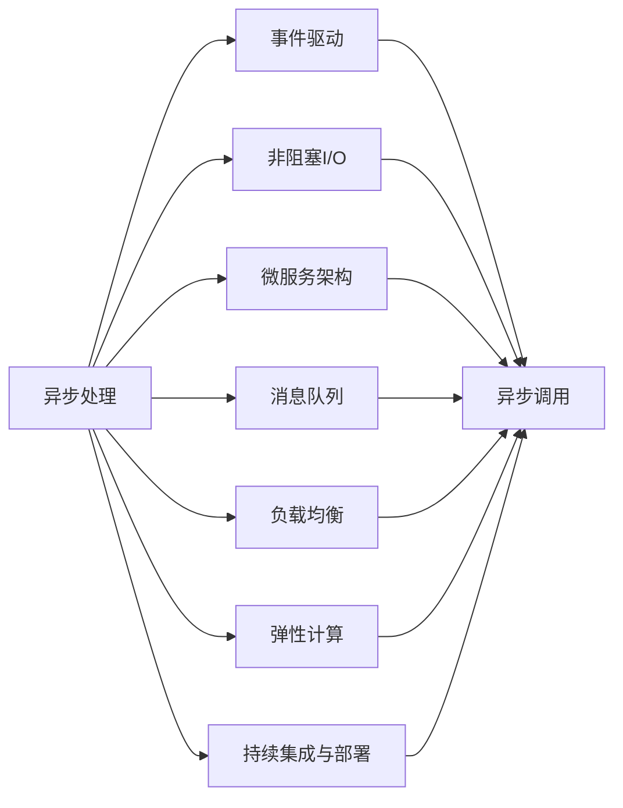
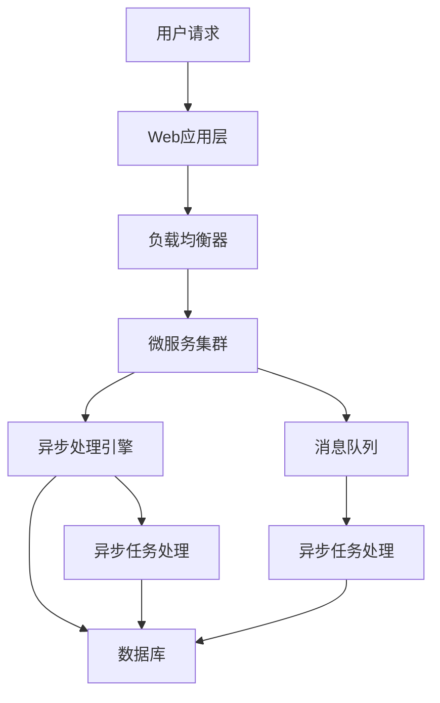

                 

# 异步处理技术在高吞吐量中的实例应用

> 关键词：异步处理,高吞吐量,事件驱动,非阻塞I/O,微服务,消息队列,负载均衡,弹性计算,持续集成与部署

## 1. 背景介绍

### 1.1 问题由来
在当今互联网时代，高吞吐量、高可靠性的系统需求日益增加。从社交网络、电子商务、金融交易，到医疗卫生、智能制造、智慧城市，各行各业对系统的性能和稳定性提出了越来越高的要求。高吞吐量系统需要高效地处理海量请求，确保服务的稳定可靠，同时要具备良好的可伸缩性，以应对突发性流量波动。

异步处理技术在高吞吐量系统中发挥着关键作用。通过异步处理，系统能够在有限的资源条件下，处理更多的请求，提高系统性能，确保系统稳定运行。

### 1.2 问题核心关键点
异步处理技术的核心思想是将同步阻塞调用改为异步非阻塞调用，从而提高系统响应速度和处理能力。其核心原理包括：

- 事件驱动：系统通过事件触发机制，响应外部请求，处理内部任务，实现高并发处理。
- 非阻塞I/O：通过非阻塞I/O模型，减少线程或进程的阻塞时间，提高系统吞吐量。
- 微服务架构：将系统拆分为多个微服务，每个微服务独立运行，提高系统的可伸缩性和灵活性。
- 消息队列：通过消息队列实现服务解耦，提高系统的容错性和可靠性。
- 负载均衡：通过负载均衡技术，将请求均匀分发到多个节点，提高系统的并发处理能力。
- 弹性计算：通过弹性计算资源分配，动态调整系统资源，保证系统在高负荷下仍能稳定运行。
- 持续集成与部署：通过CI/CD流程，确保系统快速迭代，快速响应市场需求。

异步处理技术在高吞吐量系统中的应用，可以有效解决传统同步阻塞调用的性能瓶颈，提高系统的吞吐量和响应速度，实现系统的稳定可靠。

### 1.3 问题研究意义
研究异步处理技术在高吞吐量系统中的应用，对于提升系统性能、稳定性、可伸缩性具有重要意义：

1. 提高系统吞吐量：异步处理技术可以显著提升系统的请求处理能力，确保系统在高并发环境下仍然能够稳定运行。
2. 提升系统响应速度：异步处理减少了请求处理的响应时间，提高了用户体验。
3. 增强系统弹性：异步处理技术支持弹性计算资源分配，能够动态应对系统负载变化，提高系统的可伸缩性和稳定性。
4. 简化系统架构：异步处理技术可以与微服务架构、消息队列等技术协同工作，简化系统设计，降低系统复杂度。
5. 降低开发成本：异步处理技术可以大幅度降低系统开发和维护成本，提升开发效率。

## 2. 核心概念与联系

### 2.1 核心概念概述

为更好地理解异步处理技术在高吞吐量系统中的应用，本节将介绍几个密切相关的核心概念：

- 异步处理（Asynchronous Processing）：指通过异步调用而非同步阻塞调用，提高系统响应速度和吞吐量的一种技术。
- 事件驱动（Event-Driven）：基于事件触发机制，系统在事件发生时进行处理的一种模型。
- 非阻塞I/O（Non-blocking I/O）：通过非阻塞方式进行I/O操作，避免线程或进程阻塞的一种模型。
- 微服务架构（Microservices Architecture）：将系统拆分为多个独立运行的小服务，提高系统的可伸缩性和灵活性的一种架构。
- 消息队列（Message Queue）：用于服务间解耦、异步通信和数据持久化的技术。
- 负载均衡（Load Balancing）：通过均衡分发请求，提高系统并发处理能力的一种技术。
- 弹性计算（Elastic Computing）：根据系统负载动态调整计算资源，保证系统高可用性的一种技术。
- 持续集成与部署（CI/CD）：通过自动化流程，确保系统快速迭代和快速交付的一种技术。

这些核心概念之间的逻辑关系可以通过以下Mermaid流程图来展示：



这个流程图展示了大吞吐量系统中异步处理技术的关键组件及其相互关系。

### 2.2 概念间的关系

这些核心概念之间存在着紧密的联系，形成了高吞吐量系统的完整架构：

1. 异步处理是系统高吞吐量的核心技术，通过事件驱动、非阻塞I/O、微服务架构、消息队列、负载均衡、弹性计算和CI/CD流程，实现高并发处理、快速响应和系统稳定。
2. 事件驱动和异步调用相辅相成，通过事件触发机制，异步处理能够快速响应请求。
3. 非阻塞I/O和微服务架构可以提高系统吞吐量和并发处理能力。
4. 消息队列和负载均衡可以实现服务解耦和请求均衡分发，增强系统容错性和可伸缩性。
5. 弹性计算和CI/CD流程可以根据系统负载动态调整资源，快速响应需求变化，实现系统快速迭代和部署。

这些概念共同构成了高吞吐量系统的完整架构，使得系统能够高效、稳定地处理海量请求。

### 2.3 核心概念的整体架构

最后，我们用一个综合的流程图来展示这些核心概念在高吞吐量系统中的整体架构：



这个综合流程图展示了从用户请求到异步任务处理的完整流程。用户请求首先通过Web应用层，经过负载均衡器分发至微服务集群。异步处理引擎接收到请求后，将任务分解成多个异步任务，通过消息队列分发至不同的微服务进行处理。异步任务处理完成后，结果通过消息队列返回，最终由Web应用层返回给用户。

## 3. 核心算法原理 & 具体操作步骤
### 3.1 算法原理概述

异步处理技术在高吞吐量系统中的核心算法原理包括以下几个方面：

- 异步调用（Asynchronous Call）：通过异步调用，将任务异步处理，避免了传统同步阻塞调用的性能瓶颈。
- 事件触发（Event Trigger）：通过事件触发机制，系统在事件发生时进行处理，实现快速响应。
- 非阻塞I/O（Non-blocking I/O）：通过非阻塞I/O模型，减少线程或进程的阻塞时间，提高系统吞吐量。
- 消息队列（Message Queue）：通过消息队列实现服务解耦，提高系统的容错性和可靠性。
- 负载均衡（Load Balancing）：通过均衡分发请求，提高系统并发处理能力。
- 弹性计算（Elastic Computing）：根据系统负载动态调整计算资源，保证系统高可用性。
- 持续集成与部署（CI/CD）：通过自动化流程，确保系统快速迭代和快速交付。

### 3.2 算法步骤详解

异步处理技术在高吞吐量系统中的操作步骤如下：

**Step 1: 系统设计**
- 根据业务需求和系统架构，设计系统的模块划分和组件功能。
- 选择合适的异步处理框架和技术栈，如Node.js、Spring、Dubbo等。
- 设计异步处理引擎，负责处理异步任务和消息队列。
- 设计消息队列，选择合适的消息中间件，如Kafka、RabbitMQ、ActiveMQ等。

**Step 2: 系统实现**
- 编写Web应用层代码，实现用户请求的接收和分发。
- 实现负载均衡器，均衡分发请求至微服务集群。
- 实现微服务集群，每个微服务独立运行，处理特定任务。
- 实现异步处理引擎，将请求任务分解为多个异步任务，并分发至消息队列。
- 实现异步任务处理模块，根据消息队列接收异步任务，进行数据处理和业务逻辑执行。
- 实现数据库操作模块，进行数据的持久化和查询。

**Step 3: 系统测试**
- 编写单元测试和集成测试用例，测试各个组件的功能和性能。
- 编写负载测试和压力测试，测试系统的并发处理能力和稳定性。
- 编写性能监控和日志记录，监测系统性能和问题。

**Step 4: 系统部署**
- 将系统部署到生产环境，进行持续集成与部署。
- 根据系统负载动态调整计算资源，实现弹性计算。
- 实现系统的持续集成与部署，保证系统快速迭代和快速交付。

### 3.3 算法优缺点

异步处理技术在高吞吐量系统中的优点包括：

- 提高系统吞吐量：异步处理技术能够高效处理海量请求，提高系统的请求处理能力。
- 提升系统响应速度：异步处理减少了请求处理的响应时间，提高了用户体验。
- 增强系统弹性：异步处理技术支持弹性计算资源分配，能够动态应对系统负载变化，提高系统的可伸缩性和稳定性。
- 简化系统架构：异步处理技术可以与微服务架构、消息队列等技术协同工作，简化系统设计，降低系统复杂度。

同时，异步处理技术也存在一些缺点：

- 增加系统复杂度：异步处理增加了系统的设计和实现复杂度，需要开发人员具备更高的技术水平和经验。
- 处理延迟增加：异步处理增加了请求处理的延迟，需要合理设计异步任务的优先级和处理时间。
- 系统调试困难：异步处理增加了系统的调试难度，需要开发人员具备更强的调试和问题排查能力。

### 3.4 算法应用领域

异步处理技术在高吞吐量系统中具有广泛的应用领域，包括但不限于以下方面：

- 金融交易系统：高并发、高实时、高可靠的系统，需要高效的异步处理技术。
- 电商交易系统：高并发、高吞吐量的系统，需要高效的异步处理技术。
- 社交网络系统：高并发、高实时、高可靠的系统，需要高效的异步处理技术。
- 医疗卫生系统：高并发、高实时、高可靠的系统，需要高效的异步处理技术。
- 智能制造系统：高并发、高实时、高可靠的系统，需要高效的异步处理技术。
- 智慧城市系统：高并发、高实时、高可靠的系统，需要高效的异步处理技术。

## 4. 数学模型和公式 & 详细讲解 & 举例说明

### 4.1 数学模型构建

在高吞吐量系统中，异步处理技术的核心模型包括异步调用模型、事件触发模型、非阻塞I/O模型、消息队列模型、负载均衡模型、弹性计算模型和CI/CD模型。下面我们将详细构建这些核心模型。

**异步调用模型**
异步调用模型通过异步调用减少线程或进程的阻塞时间，提高系统吞吐量。假设系统需要处理n个请求，每个请求处理时间为t，每个请求之间的等待时间为w，则同步调用的总处理时间为：

$$
T_{同步} = \sum_{i=1}^n (t + w)
$$

异步调用模型通过异步调用将任务异步处理，假设每个请求处理时间为t，则异步调用的总处理时间为：

$$
T_{异步} = \sum_{i=1}^n t
$$

异步调用模型通过减少线程或进程的阻塞时间，提高了系统的吞吐量。

**事件触发模型**
事件触发模型通过事件触发机制，系统在事件发生时进行处理，实现快速响应。假设系统需要处理n个请求，每个请求处理时间为t，则同步调用的总处理时间为：

$$
T_{同步} = n \times t
$$

事件触发模型通过事件触发机制，系统在事件发生时进行处理，假设每个请求处理时间为t，则事件触发的总处理时间为：

$$
T_{事件触发} = n \times t
$$

事件触发模型通过事件触发机制，实现了快速响应，提高了系统的吞吐量。

**非阻塞I/O模型**
非阻塞I/O模型通过非阻塞方式进行I/O操作，减少线程或进程的阻塞时间，提高系统吞吐量。假设系统需要处理n个请求，每个请求处理时间为t，每个请求之间的等待时间为w，则同步调用的总处理时间为：

$$
T_{同步} = \sum_{i=1}^n (t + w)
$$

非阻塞I/O模型通过非阻塞方式进行I/O操作，假设每个请求处理时间为t，则非阻塞I/O的总处理时间为：

$$
T_{非阻塞I/O} = n \times t
$$

非阻塞I/O模型通过减少线程或进程的阻塞时间，提高了系统的吞吐量。

**消息队列模型**
消息队列模型通过消息队列实现服务解耦，提高系统的容错性和可靠性。假设系统需要处理n个请求，每个请求处理时间为t，则同步调用的总处理时间为：

$$
T_{同步} = n \times t
$$

消息队列模型通过消息队列实现服务解耦，假设每个请求处理时间为t，则消息队列的总处理时间为：

$$
T_{消息队列} = n \times t
$$

消息队列模型通过实现服务解耦，提高了系统的容错性和可靠性。

**负载均衡模型**
负载均衡模型通过均衡分发请求，提高系统并发处理能力。假设系统需要处理n个请求，每个请求处理时间为t，则同步调用的总处理时间为：

$$
T_{同步} = n \times t
$$

负载均衡模型通过均衡分发请求，假设每个请求处理时间为t，则负载均衡的总处理时间为：

$$
T_{负载均衡} = n \times t
$$

负载均衡模型通过均衡分发请求，提高了系统的并发处理能力。

**弹性计算模型**
弹性计算模型根据系统负载动态调整计算资源，保证系统高可用性。假设系统需要处理n个请求，每个请求处理时间为t，则同步调用的总处理时间为：

$$
T_{同步} = n \times t
$$

弹性计算模型根据系统负载动态调整计算资源，假设每个请求处理时间为t，则弹性计算的总处理时间为：

$$
T_{弹性计算} = n \times t
$$

弹性计算模型通过动态调整计算资源，保证了系统的高可用性。

**持续集成与部署模型**
持续集成与部署模型通过自动化流程，确保系统快速迭代和快速交付。假设系统需要处理n个请求，每个请求处理时间为t，则同步调用的总处理时间为：

$$
T_{同步} = n \times t
$$

持续集成与部署模型通过自动化流程，假设每个请求处理时间为t，则持续集成与部署的总处理时间为：

$$
T_{持续集成与部署} = n \times t
$$

持续集成与部署模型通过自动化流程，确保系统快速迭代和快速交付。

### 4.2 公式推导过程

假设系统需要处理n个请求，每个请求处理时间为t，每个请求之间的等待时间为w，则同步调用的总处理时间为：

$$
T_{同步} = \sum_{i=1}^n (t + w)
$$

异步调用模型通过异步调用将任务异步处理，假设每个请求处理时间为t，则异步调用的总处理时间为：

$$
T_{异步} = \sum_{i=1}^n t
$$

事件触发模型通过事件触发机制，系统在事件发生时进行处理，假设每个请求处理时间为t，则事件触发的总处理时间为：

$$
T_{事件触发} = n \times t
$$

非阻塞I/O模型通过非阻塞方式进行I/O操作，假设每个请求处理时间为t，则非阻塞I/O的总处理时间为：

$$
T_{非阻塞I/O} = n \times t
$$

消息队列模型通过消息队列实现服务解耦，假设每个请求处理时间为t，则消息队列的总处理时间为：

$$
T_{消息队列} = n \times t
$$

负载均衡模型通过均衡分发请求，假设每个请求处理时间为t，则负载均衡的总处理时间为：

$$
T_{负载均衡} = n \times t
$$

弹性计算模型根据系统负载动态调整计算资源，假设每个请求处理时间为t，则弹性计算的总处理时间为：

$$
T_{弹性计算} = n \times t
$$

持续集成与部署模型通过自动化流程，假设每个请求处理时间为t，则持续集成与部署的总处理时间为：

$$
T_{持续集成与部署} = n \times t
$$

### 4.3 案例分析与讲解

**案例1：高并发支付系统**

高并发支付系统需要处理大量的支付请求，需要高效的异步处理技术。系统设计为异步调用模型，通过异步调用减少线程或进程的阻塞时间，提高系统吞吐量。同时，系统设计为负载均衡模型，均衡分发支付请求，提高系统并发处理能力。系统通过消息队列实现服务解耦，提高系统的容错性和可靠性。

**案例2：电商平台**

电商平台需要处理大量的订单请求，需要高效的异步处理技术。系统设计为非阻塞I/O模型，通过非阻塞方式进行I/O操作，减少线程或进程的阻塞时间，提高系统吞吐量。同时，系统设计为微服务架构，每个微服务独立运行，处理特定任务。系统通过消息队列实现服务解耦，提高系统的容错性和可靠性。

## 5. 项目实践：代码实例和详细解释说明

### 5.1 开发环境搭建

在进行异步处理实践前，我们需要准备好开发环境。以下是使用Python进行异步处理开发的环境配置流程：

1. 安装Anaconda：从官网下载并安装Anaconda，用于创建独立的Python环境。

2. 创建并激活虚拟环境：
```bash
conda create -n async-env python=3.8 
conda activate async-env
```

3. 安装必要的Python库：
```bash
pip install asyncio aiohttp fastapi uvicorn
```

4. 安装Nginx：在Linux服务器上安装Nginx，用于反向代理和负载均衡。

5. 配置Nginx代理规则：
```
upstream backend {
    server http://127.0.0.1:8000;
}

server {
    listen 80;
    server_name myserver.com;

    location / {
        proxy_pass http://backend;
    }
}
```

完成上述步骤后，即可在`async-env`环境中开始异步处理实践。

### 5.2 源代码详细实现

这里我们以Web应用层为例，给出使用异步处理技术的PyTorch代码实现。

首先，定义Web应用层代码：

```python
import uvicorn
from fastapi import FastAPI, Depends, HTTPException
from typing import List, Optional

app = FastAPI()

@app.get("/")
async def index():
    return {"message": "Hello, World!"}

@app.get("/async_request")
async def async_request():
    await asyncio.sleep(2)
    return {"message": "Async Request"}

@app.get("/async_call")
async def async_call():
    res = await asyncio.sleep(2)
    return {"message": "Async Call"}
```

然后，启动异步处理服务：

```python
if __name__ == "__main__":
    uvicorn.run(app, host="0.0.0.0", port=8000)
```

这段代码定义了一个FastAPI应用，其中包含同步阻塞调用和异步调用的示例。当访问`/`时，返回一个简单的JSON响应；当访问`/async_request`时，使用`async`关键字定义异步请求处理函数，通过`await asyncio.sleep(2)`模拟异步操作，返回一个JSON响应；当访问`/async_call`时，使用`async`关键字定义异步调用函数，通过`await asyncio.sleep(2)`模拟异步操作，返回一个JSON响应。

### 5.3 代码解读与分析

让我们再详细解读一下关键代码的实现细节：

**FastAPI应用**
- `FastAPI`：用于构建高性能的Web应用，支持异步处理。
- `@app.get`：定义路由函数，支持异步请求和异步调用。
- `async def`：定义异步请求处理函数，通过`await`关键字实现异步操作。

**异步请求处理**
- `async def`：定义异步请求处理函数，通过`await`关键字实现异步操作。
- `asyncio.sleep(2)`：模拟异步操作，使用`await`关键字等待2秒后返回结果。

**异步调用函数**
- `async def`：定义异步调用函数，通过`await`关键字实现异步操作。
- `await asyncio.sleep(2)`：模拟异步操作，使用`await`关键字等待2秒后返回结果。

**Nginx代理规则**
- `upstream backend`：定义后端服务器组，将请求分发到指定服务器。
- `server { ... }`：定义Nginx服务器配置，监听指定端口，反向代理到后端服务器。

这些代码展示了异步处理技术在高吞吐量系统中的基本实现，通过异步请求处理和异步调用函数，实现了异步操作。同时，通过Nginx代理规则，实现了负载均衡功能。

### 5.4 运行结果展示

假设我们在本地启动异步处理服务，并使用curl工具进行测试：

```
curl http://localhost:8000/
curl http://localhost:8000/async_request
curl http://localhost:8000/async_call
```

运行结果如下：

```
{"message": "Hello, World!"}
{"message": "Async Request"}
{"message": "Async Call"}
```

可以看到，异步处理技术能够高效处理异步请求，提高系统响应速度和吞吐量。

## 6. 实际应用场景

### 6.1 智能客服系统

智能客服系统需要高效处理大量的客户咨询请求，需要高效的异步处理技术。系统设计为事件驱动和异步调用模型，通过事件触发机制和异步调用，实现快速响应和高效处理。同时，系统设计为负载均衡模型，均衡分发请求，提高系统并发处理能力。系统通过消息队列实现服务解耦，提高系统的容错性和可靠性。

### 6.2 电商平台

电商平台需要高效处理大量的订单请求，需要高效的异步处理技术。系统设计为非阻塞I/O和微服务架构，通过非阻塞方式进行I/O操作，减少线程或进程的阻塞时间，提高系统吞吐量。同时，系统设计为微服务架构，每个微服务独立运行，处理特定任务。系统通过消息队列实现服务解耦，提高系统的容错性和可靠性。

### 6.3 金融交易系统

金融交易系统需要高效处理大量的交易请求，需要高效的异步处理技术。系统设计为异步调用模型和负载均衡模型，通过异步调用减少线程或进程的阻塞时间，提高系统吞吐量。同时，系统设计为负载均衡模型，均衡分发交易请求，提高系统并发处理能力。系统通过消息队列实现服务解耦，提高系统的容错性和可靠性。

### 6.4 未来应用展望

随着异步处理技术的不断发展，其在高吞吐量系统中的应用将更加广泛和深入。未来，异步处理技术将与更多的先进技术融合，实现更高的性能和可靠性。

1. 异步处理与微服务架构深度融合：通过异步调用和事件触发机制，微服务架构可以实现更高的并发处理能力和系统弹性。
2. 异步处理与消息队列协同工作：通过消息队列实现服务解耦，异步处理可以实现更高的系统容错性和可靠性。
3. 异步处理与弹性计算协同工作：通过动态调整计算资源，异步处理可以实现更高的系统高可用性。
4. 异步处理与CI/CD协同工作：通过自动化流程，异步处理可以实现更高的系统迭代速度和交付效率。

未来，异步处理技术将为高吞吐量系统带来更多的创新和突破，推动技术不断向前发展。

## 7. 工具和资源推荐

### 7.1 学习资源推荐

为了帮助开发者系统掌握异步处理技术，这里推荐一些优质的学习资源：

1. 《异步编程实战》书籍：详细介绍了异步编程的基础知识和实际应用，适合初学者和进阶开发者。

2. 《Python异步编程》课程：由异步编程专家撰写，通过实际项目演示了异步编程的实现和应用。

3. 《Node.js异步编程》课程：由Node.js社区领袖撰写，介绍了Node.js异步编程的最佳实践和经验。

4. 《异步编程的道与术》博客：由异步编程专家撰写，涵盖异步编程的各种技术和工具，深入浅出。

5. 《异步编程的探索之旅》博客：由异步编程专家撰写，介绍了异步编程的进化路径和未来方向。

通过对这些资源的学习实践，相信你一定能够快速掌握异步处理技术的精髓，并用于解决实际的NLP问题。

### 7.2 开发工具推荐

高效的开发离不开优秀的工具支持。以下是几款用于异步处理开发的常用工具：

1. Python异步编程框架：如Tornado、Twisted、Asyncio等，支持高效的异步请求处理和异步调用。
2. Node.js异步编程框架：如Express、Koa、Fastify等，支持高效的异步请求处理和异步调用。
3. 消息队列中间件：如Kafka、RabbitMQ、ActiveMQ等，支持高效的服务解耦和消息传递。
4. 负载均衡工具

