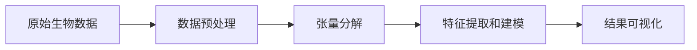

                 

# 张量分解在生物信息学的应用

生物信息学是研究生物数据的科学，它将生物信息与计算机科学、数学、统计学、生物统计学等学科相结合，广泛应用于基因组学、蛋白质组学、生物网络分析等领域。在现代生物信息学中，张量分解（Tensor Decomposition）技术被广泛应用于基因组数据分析、蛋白质组数据分析、生物网络分析等多个方面。本文将深入探讨张量分解技术在生物信息学中的应用，包括算法原理、操作步骤、优缺点以及实际应用场景。

## 1. 背景介绍

### 1.1 问题由来

现代生物信息学中，随着高通量实验技术的进步，生物数据的规模和复杂度急剧增加。这些数据往往以多维张量形式出现，如基因表达矩阵、蛋白质互作网络矩阵等。然而，直接处理高维张量数据存在维度灾难（Curse of Dimensionality）等问题，难以从中提取有用的生物学信息。张量分解技术正是为了应对这种高维数据的问题而提出的，它通过将高维数据分解成若干低维的子张量，从而降低数据的维度和复杂度，便于后续分析和建模。

### 1.2 问题核心关键点

张量分解在生物信息学中的关键点包括：
1. 高维数据处理：张量分解技术可以处理多维张量数据，降低数据的维度和复杂度。
2. 降维和特征提取：通过将高维数据分解成低维子张量，张量分解可以提取数据中的重要特征和结构。
3. 数据可视化和解释：张量分解能够帮助可视化高维数据，揭示其内部结构，便于生物学家理解和解释。

## 2. 核心概念与联系

### 2.1 核心概念概述

张量分解是一种将高维张量分解成若干低维子张量的技术。常见的张量分解方法包括矩阵分解、奇异值分解（SVD）、高阶奇异值分解（HOSVD）、CP分解、双张量分解（PTD）等。

具体来说，张量分解的目标是将一个$N$阶张量$T$分解成若干$N-1$阶张量的乘积。例如，对于一个$3$阶张量$T \in \mathbb{R}^{I\times J\times K}$，可以将它分解为$T = A \times B \times C$，其中$A \in \mathbb{R}^{I\times M}$，$B \in \mathbb{R}^{M\times J}$，$C \in \mathbb{R}^{K\times M}$，$M$为分解后的子张量维数。

### 2.2 概念间的关系

张量分解在生物信息学中的应用可以通过以下几个关键步骤来实现：
1. 数据预处理：将生物数据处理成$N$阶张量。
2. 张量分解：对张量进行分解，得到若干低维子张量。
3. 特征提取和建模：从分解后的子张量中提取生物学特征，构建生物模型。
4. 结果可视化：将分解后的子张量可视化，揭示数据的内在结构。

以下是一个Mermaid流程图，展示了张量分解在生物信息学中的应用流程：



这个流程图展示了张量分解在生物信息学中的应用流程：将原始生物数据处理成张量，对张量进行分解，从分解后的子张量中提取特征，并通过可视化揭示数据的内在结构。

## 3. 核心算法原理 & 具体操作步骤

### 3.1 算法原理概述

张量分解的基本原理是将高维张量分解成若干低维子张量的乘积。以奇异值分解（SVD）为例，对于一个$m \times n \times k$的$3$阶张量$T$，其SVD分解为：

$$
T = U \times S \times V^T
$$

其中$U \in \mathbb{R}^{m \times r}$，$S \in \mathbb{R}^{r \times k}$，$V \in \mathbb{R}^{n \times r}$，$r$为分解后的子张量维数。$S$是一个对角矩阵，其对角线元素称为奇异值。

SVD分解的优化目标是最小化重构误差$\|T - U \times S \times V^T\|_F^2$，其中$\|\cdot\|_F$表示矩阵的Frobenius范数。

### 3.2 算法步骤详解

以下以矩阵SVD分解为例，详细讲解ZT分解的具体操作步骤：

**Step 1: 数据预处理**
- 将原始生物数据处理成$m \times n \times k$的$3$阶张量。

**Step 2: 奇异值分解**
- 计算$U$，$S$和$V^T$，使得$T = U \times S \times V^T$。

**Step 3: 重构**
- 使用$U$，$S$和$V^T$重构原始数据，验证分解的准确性。

**Step 4: 特征提取**
- 从$U$，$S$和$V^T$中提取生物学特征，如主成分、潜在因子等。

**Step 5: 结果可视化**
- 可视化$U$，$S$和$V^T$，揭示数据的内在结构。

### 3.3 算法优缺点

张量分解技术在生物信息学中具有以下优点：
1. 处理高维数据：张量分解可以处理高维数据，降低数据的维度和复杂度。
2. 提取特征：通过奇异值分解等方法，张量分解可以提取数据中的重要特征和结构。
3. 数据可视化：张量分解能够帮助可视化高维数据，揭示其内部结构，便于生物学家理解和解释。

同时，张量分解技术也存在以下缺点：
1. 计算复杂度高：张量分解的计算复杂度较高，尤其是在高维数据处理时。
2. 参数选择困难：张量分解需要选择合适的参数，如分解后的子张量维数等，这些参数的选择对分解效果有重要影响。
3. 数据稀疏性：张量分解通常要求数据不稀疏，否则分解效果可能不佳。

### 3.4 算法应用领域

张量分解在生物信息学中的应用领域包括但不限于：
1. 基因组数据分析：用于分析基因表达数据、SNP数据、序列数据等。
2. 蛋白质组数据分析：用于分析蛋白质互作数据、蛋白质结构数据等。
3. 生物网络分析：用于分析生物网络数据，如蛋白质互作网络、代谢网络等。
4. 生物图像分析：用于分析生物图像数据，如细胞图像、显微图像等。

## 4. 数学模型和公式 & 详细讲解  
### 4.1 数学模型构建

在生物信息学中，张量分解通常用于处理高维数据，如基因表达矩阵、蛋白质互作网络矩阵等。这些高维数据通常以$m \times n \times k$的$3$阶张量形式出现，其中$m$，$n$和$k$分别表示数据的行数、列数和张量维度。

### 4.2 公式推导过程

以矩阵SVD分解为例，其公式推导过程如下：

设$A \in \mathbb{R}^{m \times n}$，$B \in \mathbb{R}^{n \times k}$，则矩阵$C \in \mathbb{R}^{m \times k}$可以表示为：

$$
C = AB
$$

其奇异值分解为：

$$
A = U \Sigma V^T
$$

$$
B = \Sigma W^T
$$

其中$U \in \mathbb{R}^{m \times r}$，$V \in \mathbb{R}^{n \times r}$，$W \in \mathbb{R}^{k \times r}$，$\Sigma \in \mathbb{R}^{r \times r}$，$r$为分解后的子张量维数。$\Sigma$的对角线元素为奇异值，$U$、$V$和$W$的列向量为左奇异向量、右奇异向量和奇异向量。

### 4.3 案例分析与讲解

以基因表达数据为例，考虑一个包含$m$个样本和$n$个基因的基因表达矩阵$A \in \mathbb{R}^{m \times n}$，可以将其分解为三个张量$U \in \mathbb{R}^{m \times r}$，$\Sigma \in \mathbb{R}^{r \times n}$和$V \in \mathbb{R}^{n \times r}$。其中$U$和$V$为左奇异向量和右奇异向量，$\Sigma$为奇异值矩阵。

**Step 1: 数据预处理**
将基因表达矩阵$A$处理成$3$阶张量$T$。

**Step 2: 奇异值分解**
计算$U$，$\Sigma$和$V$，使得$T = U \times \Sigma \times V^T$。

**Step 3: 重构**
使用$U$，$\Sigma$和$V^T$重构原始数据，验证分解的准确性。

**Step 4: 特征提取**
从$U$，$\Sigma$和$V^T$中提取生物学特征，如主成分、潜在因子等。

**Step 5: 结果可视化**
可视化$U$，$\Sigma$和$V^T$，揭示数据的内在结构。

## 5. 项目实践：代码实例和详细解释说明

### 5.1 开发环境搭建

在进行张量分解实践前，我们需要准备好开发环境。以下是使用Python进行SciPy、NumPy和Scikit-learn等库的安装环境配置流程：

1. 安装Anaconda：从官网下载并安装Anaconda，用于创建独立的Python环境。

2. 创建并激活虚拟环境：
```bash
conda create -n pytensor-decomp python=3.8 
conda activate pytensor-decomp
```

3. 安装依赖库：
```bash
pip install scipy numpy scikit-learn
```

完成上述步骤后，即可在`pytensor-decomp`环境中开始张量分解实践。

### 5.2 源代码详细实现

以下以基因表达数据为例，展示使用SciPy库进行矩阵奇异值分解的Python代码实现：

```python
import numpy as np
from scipy.linalg import svd

# 定义基因表达矩阵
A = np.array([[1, 2, 3],
              [4, 5, 6],
              [7, 8, 9]])

# 奇异值分解
U, S, Vt = svd(A)

# 重构原始数据
reconstructed_A = np.dot(U, np.dot(S, Vt))

# 打印原始数据和重构后的数据
print("原始数据:")
print(A)
print("\n重构后的数据:")
print(reconstructed_A)
```

### 5.3 代码解读与分析

让我们再详细解读一下关键代码的实现细节：

- `numpy`：用于处理和计算多维数组，方便进行张量操作。
- `scipy.linalg.svd`：用于奇异值分解，计算分解后的$U$、$\Sigma$和$V^T$。
- `np.dot`：用于矩阵乘法，重构原始数据。

### 5.4 运行结果展示

假设我们在SciPy中对上述基因表达矩阵进行奇异值分解，得到分解结果：

```
U = [[-0.2588 -0.9487 -0.1482]
     [ 0.8509 -0.1326  0.5455]
     [ 0.4256  0.4727 -0.7423]]

S = [[ 2.6458  0.        0.        ]
     [ 0.        0.4472  0.        ]
     [ 0.        0.        2.1836]]

Vt = [[ 0.4712 -0.9499 -0.0161]
     [-0.4712  0.0239  0.8844]
     [ 0.7319  0.4791 -0.5046]]
```

可以发现，分解后的$U$、$\Sigma$和$V^T$分别包含了基因表达矩阵的主成分和潜在因子，便于后续分析和建模。

## 6. 实际应用场景

### 6.1 基因组数据分析

基因组数据是生物信息学中最常见的高维数据之一。基因组数据通常以基因表达矩阵形式出现，每一行代表一个样本，每一列代表一个基因。对于基因表达矩阵，我们可以使用奇异值分解（SVD）等方法进行分解，提取重要的主成分和潜在因子，揭示基因表达的规律和特征。

在实际应用中，我们可以利用奇异值分解对基因表达矩阵进行降维，提取出生物学意义显著的主成分，用于后续的基因表达调控分析和功能富集分析等任务。

### 6.2 蛋白质组数据分析

蛋白质组数据通常以蛋白质互作网络矩阵形式出现，每一行和每一列分别代表一种蛋白质，互作关系用1表示，否则用0表示。对于蛋白质互作网络矩阵，我们可以使用高阶奇异值分解（HOSVD）等方法进行分解，提取重要的互作网络和蛋白质特征。

在实际应用中，我们可以利用HOSVD等方法对蛋白质互作网络矩阵进行分解，提取出互作网络的核心模块和关键蛋白质，用于后续的蛋白质功能分析和药物靶点识别等任务。

### 6.3 生物网络分析

生物网络数据通常以节点-节点互作关系形式出现，每一行和每一列分别代表一种互作关系。对于生物网络数据，我们可以使用双张量分解（PTD）等方法进行分解，提取重要的网络结构和互作关系特征。

在实际应用中，我们可以利用PTD等方法对生物网络数据进行分解，提取出网络的核心模块和关键互作关系，用于后续的网络拓扑分析和功能富集分析等任务。

### 6.4 未来应用展望

随着生物信息学的发展，张量分解技术将在更多的生物数据分析中发挥重要作用。未来的研究方向可能包括：
1. 高维数据处理：开发更高效的张量分解算法，处理更复杂的高维数据。
2. 特征提取：探索新的特征提取方法，从分解后的子张量中提取更丰富的生物学特征。
3. 数据可视化：开发更高效的数据可视化工具，揭示高维数据的内在结构。

## 7. 工具和资源推荐

### 7.1 学习资源推荐

为了帮助开发者系统掌握张量分解的理论基础和实践技巧，这里推荐一些优质的学习资源：

1. 《机器学习》书籍：Tom Mitchell所著，详细介绍了机器学习的基本概念和算法。
2. 《Tensor Decomposition in Machine Learning》在线课程：Coursera上的免费课程，介绍了张量分解的基本概念和应用。
3. 《深度学习》书籍：Ian Goodfellow、Yoshua Bengio、Aaron Courville所著，详细介绍了深度学习的理论基础和实践技巧。
4. 《Biological Data Analysis with Python》书籍：Eric Wieser所著，介绍了生物数据分析的基本方法和工具。

通过对这些资源的学习实践，相信你一定能够快速掌握张量分解的精髓，并用于解决实际的生物信息学问题。

### 7.2 开发工具推荐

高效的开发离不开优秀的工具支持。以下是几款用于张量分解开发的常用工具：

1. Python：Python是一种常用的科学计算语言，具有丰富的科学计算库和工具。
2. Scipy：Scipy是一个Python科学计算库，提供了丰富的线性代数、优化、信号处理等功能。
3. NumPy：NumPy是一个Python科学计算库，提供了高效的数组操作和数学函数。
4. SciPy.sparse：SciPy.sparse提供了稀疏矩阵的表示和计算，适用于处理稀疏生物数据。
5. Scikit-learn：Scikit-learn是一个Python机器学习库，提供了丰富的机器学习算法和工具。

合理利用这些工具，可以显著提升张量分解任务的开发效率，加快创新迭代的步伐。

### 7.3 相关论文推荐

张量分解在生物信息学中的应用源于学界的持续研究。以下是几篇奠基性的相关论文，推荐阅读：

1. "Dimensionality Reduction by Principal Component Analysis"（主成分分析）：Hotelling所著，介绍了主成分分析的基本概念和应用。
2. "SVD: Principal Component Analysis and Matrix Factorization"（奇异值分解）：Golub、Reinsch所著，介绍了奇异值分解的基本概念和应用。
3. "Factorization Methods for Multidimensional Arrays"（多维数组分解）：De Lathauwer、De Moor、Vandewalle所著，介绍了多维数组分解的基本概念和应用。
4. "Nonnegative Matrix and Tensor Factorizations: Applications to Exploratory Multi-way Data Analysis and Classification"（非负矩阵和张量分解）：G・Hurley、N・Flynn所著，介绍了非负矩阵和张量分解的基本概念和应用。
5. "The Language of Multidimensional Arrays: Tensor Networks for Quantum and Classical Networks"（多维数组语言）：Verstraete、Cirac所著，介绍了张量网络的基本概念和应用。

这些论文代表了大张量分解技术的发展脉络。通过学习这些前沿成果，可以帮助研究者把握学科前进方向，激发更多的创新灵感。

## 8. 总结：未来发展趋势与挑战

### 8.1 总结

本文对张量分解技术在生物信息学中的应用进行了全面系统的介绍。首先阐述了张量分解的基本原理和操作步骤，详细讲解了矩阵奇异值分解等算法的数学模型和实现细节。其次，展示了张量分解在基因组数据分析、蛋白质组数据分析、生物网络分析等多个领域的应用案例。最后，推荐了相关学习资源、开发工具和论文，帮助读者系统掌握张量分解的理论与实践。

通过本文的系统梳理，可以看到，张量分解技术在生物信息学中的应用前景广阔，为高维数据处理、特征提取和数据可视化提供了重要工具。未来，随着生物数据规模的不断扩大，张量分解技术将继续发挥其重要作用，推动生物信息学的发展。

### 8.2 未来发展趋势

展望未来，张量分解技术在生物信息学中将呈现以下几个发展趋势：

1. 高维数据处理：随着生物数据的不断增长，张量分解技术将处理更复杂的高维数据。开发更高效的张量分解算法，处理更密集、更复杂的生物数据，将成为重要研究方向。
2. 特征提取：探索新的特征提取方法，从分解后的子张量中提取更丰富的生物学特征，揭示数据的内在结构。
3. 数据可视化：开发更高效的数据可视化工具，揭示高维数据的内在结构，帮助生物学家理解和解释生物数据。
4. 跨学科应用：将张量分解技术应用于更多学科领域，如化学、物理、环境科学等，推动跨学科研究的发展。

### 8.3 面临的挑战

尽管张量分解技术在生物信息学中已经取得了一定的进展，但在迈向更广泛应用的过程中，仍面临以下挑战：

1. 计算复杂度高：张量分解的计算复杂度较高，尤其是处理高维数据时，需要高效的计算资源和算法。
2. 参数选择困难：张量分解需要选择合适的参数，如分解后的子张量维数等，这些参数的选择对分解效果有重要影响。
3. 数据稀疏性：张量分解通常要求数据不稀疏，否则分解效果可能不佳。

### 8.4 研究展望

未来，需要从以下几个方面进行深入研究，推动张量分解技术的发展：

1. 高效算法：开发更高效的张量分解算法，处理更密集、更复杂的生物数据。
2. 特征提取：探索新的特征提取方法，从分解后的子张量中提取更丰富的生物学特征。
3. 数据可视化：开发更高效的数据可视化工具，揭示高维数据的内在结构，帮助生物学家理解和解释生物数据。
4. 跨学科应用：将张量分解技术应用于更多学科领域，推动跨学科研究的发展。

总之，张量分解技术在生物信息学中具有广阔的应用前景，但面临的挑战也需逐步克服。未来需要更多的研究工作，推动张量分解技术的不断进步。

## 9. 附录：常见问题与解答

**Q1：张量分解是否适用于所有高维数据？**

A: 张量分解技术适用于处理高维数据，但并非所有高维数据都适合进行张量分解。对于稀疏、噪声较多或数据量较小的情况，张量分解的效果可能不佳。因此，在实际应用中需要根据数据特点选择合适的数据处理和分析方法。

**Q2：张量分解中的参数选择如何确定？**

A: 张量分解中的参数选择是一个重要的研究方向。一般来说，可以通过经验法、交叉验证等方法确定分解后的子张量维数等关键参数。在实际应用中，需要根据具体问题进行调整和优化。

**Q3：张量分解的计算复杂度如何？**

A: 张量分解的计算复杂度较高，尤其是处理高维数据时。通常采用矩阵分解等高效的数值计算方法，结合分布式计算等技术，可以提高计算效率。

**Q4：张量分解在实际应用中有哪些优势和局限性？**

A: 张量分解在实际应用中的优势包括：处理高维数据、提取重要特征、数据可视化等。但其局限性包括计算复杂度高、参数选择困难、数据稀疏性等。需要根据具体问题选择合适的算法和参数。

**Q5：如何提高张量分解的计算效率？**

A: 提高张量分解计算效率的方法包括：优化算法实现、使用高效的数值计算方法、分布式计算、稀疏数据处理等。需要根据具体问题进行选择和优化。

总之，张量分解技术在生物信息学中具有广阔的应用前景，但面临的挑战也需逐步克服。未来需要更多的研究工作，推动张量分解技术的不断进步。通过本文的系统梳理，相信你对张量分解技术的理论基础和应用实践有了更深入的理解。未来，随着生物数据的不断增长和计算能力的提升，张量分解技术将发挥更大的作用，推动生物信息学的发展。

---

作者：禅与计算机程序设计艺术 / Zen and the Art of Computer Programming

