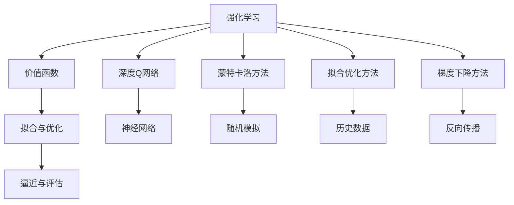

                 

# 强化学习Reinforcement Learning中价值函数近似方法解读

> 关键词：强化学习, 价值函数, 近似方法, 深度Q网络, 拟合优化, 蒙特卡洛方法, 梯度下降

## 1. 背景介绍

强化学习(Reinforcement Learning, RL)是机器学习领域中一种重要的范式，主要通过智能体与环境的交互，在特定策略下执行一系列动作，并从中学习最优的策略以最大化预定义的累积奖励。强化学习的核心在于价值函数的构建和优化，价值函数代表了在特定状态下采取某种动作后，预期的长期累积奖励。

在强化学习中，价值函数近似方法尤为重要。由于真实环境可能非常复杂，难以直接计算出精确的价值函数，因此需要采用近似方法，以高效地评估和优化策略。本文将详细解读强化学习中的价值函数近似方法，包括深度Q网络(Deep Q-Network, DQN)、拟合优化方法、蒙特卡洛方法以及梯度下降等关键技术和算法的原理与实现。

## 2. 核心概念与联系

### 2.1 核心概念概述

强化学习中的价值函数近似方法主要关注如何高效地逼近和优化价值函数，以提升智能体的策略表现。常用的价值函数近似方法包括：

- 深度Q网络(DQN)：利用神经网络逼近价值函数，通过拟合优化目标，求解最优策略。
- 蒙特卡洛方法(Monte Carlo Method)：通过随机模拟大量轨迹，计算并更新价值函数。
- 拟合优化方法(Fitting Optimization)：利用历史数据拟合价值函数，优化策略评估。
- 梯度下降方法(Gradient Descent)：通过反向传播优化神经网络参数，最小化预测误差。

这些方法通过不同的机制和算法，实现对价值函数的逼近和优化，适用于不同复杂度和规模的强化学习问题。

### 2.2 概念间的关系

价值函数近似方法与强化学习的整体框架紧密相关。从底层数据采集、价值函数评估、策略优化到智能体与环境交互的各个环节，均涉及到价值函数的逼近和优化。以下是核心概念间的关系图：



### 2.3 核心概念的整体架构

从整体架构来看，价值函数近似方法贯穿强化学习的全过程，与智能体和环境交互、策略评估和优化紧密相连。下面将详细介绍深度Q网络、蒙特卡洛方法和拟合优化方法。

## 3. 核心算法原理 & 具体操作步骤
### 3.1 算法原理概述

#### 3.1.1 深度Q网络(DQN)

深度Q网络是强化学习中的一种基于神经网络的值函数逼近方法，通过最小化Q函数的近似误差来实现最优策略的求解。

Q函数定义为：
$$
Q(s,a) = \mathbb{E}[G_t|s_t,a_t]
$$
其中$s_t$表示状态，$a_t$表示动作，$G_t$表示从当前状态开始，采取动作后的长期累积奖励。

深度Q网络通过神经网络逼近Q函数，具体的构建过程如下：

- 输入状态$s_t$，经过若干隐藏层，输出动作值$Q(s_t,a_t)$。
- 使用反向传播算法，通过梯度下降最小化预测误差$\|Q(s,a) - r_t + \gamma Q(s',a')\|^2$，逼近最优的Q函数。

#### 3.1.2 蒙特卡洛方法

蒙特卡洛方法是一种基于随机模拟的价值函数逼近方法，通过计算大量随机轨迹的平均累积奖励，来近似Q函数的值。

具体过程如下：

- 从当前状态$s_t$开始，采取动作$a_t$，观察下一个状态$s_{t+1}$和奖励$r_{t+1}$。
- 重复上述过程，直到达到终止状态。
- 计算轨迹上的平均累积奖励$G_t$，更新Q函数$Q(s_t,a_t) = G_t$。

#### 3.1.3 拟合优化方法

拟合优化方法是一种基于历史数据，通过最小化预测误差来逼近Q函数的方法。

具体过程如下：

- 收集状态$s_t$、动作$a_t$、奖励$r_t$、下一状态$s_{t+1}$的序列数据。
- 使用这些数据训练一个线性回归模型，用于逼近Q函数。
- 最小化模型预测误差$\|Q(s_t,a_t) - Q(s_{t+1},a_{t+1})\|^2$，得到逼近的Q函数。

### 3.2 算法步骤详解

#### 3.2.1 深度Q网络

1. 初始化深度Q网络，使用随机权重初始化网络参数。
2. 选择动作$a_t$，观察下一个状态$s_{t+1}$和奖励$r_t$。
3. 使用深度Q网络预测$Q(s_t,a_t)$和$Q(s_{t+1},a_{t+1})$。
4. 计算目标值$y_t = r_t + \gamma Q(s_{t+1},a_{t+1})$。
5. 使用反向传播算法，最小化预测误差$\|y_t - Q(s_t,a_t)\|^2$，更新网络参数。

#### 3.2.2 蒙特卡洛方法

1. 初始化价值函数$V(s_t)$。
2. 从当前状态$s_t$开始，采取动作$a_t$，观察下一个状态$s_{t+1}$和奖励$r_{t+1}$。
3. 重复上述过程，直到达到终止状态$s_T$。
4. 计算轨迹上的平均累积奖励$G_t = \sum_{t'} r_{t'}$。
5. 更新价值函数$V(s_t) = G_t$。

#### 3.2.3 拟合优化方法

1. 初始化拟合模型，如线性回归模型。
2. 收集历史状态$s_t$、动作$a_t$、奖励$r_t$、下一状态$s_{t+1}$的序列数据。
3. 使用这些数据训练拟合模型，得到逼近的Q函数。
4. 最小化预测误差$\|Q(s_t,a_t) - Q(s_{t+1},a_{t+1})\|^2$，得到逼近的Q函数。

### 3.3 算法优缺点

#### 3.3.1 深度Q网络

优点：
- 逼近能力更强，适用于复杂环境的强化学习问题。
- 可以在线学习，无需显式存储所有可能的状态-动作对。

缺点：
- 需要较大的计算资源，训练过程较慢。
- 容易受到过拟合的影响，模型泛化能力不足。

#### 3.3.2 蒙特卡洛方法

优点：
- 简单易行，适合小规模问题。
- 不需要额外的模型训练过程，计算量较小。

缺点：
- 依赖于随机模拟，收敛速度较慢。
- 需要存储大量历史轨迹，占用内存较大。

#### 3.3.3 拟合优化方法

优点：
- 计算量小，适合小规模问题。
- 不需要显式存储所有状态-动作对，内存占用较小。

缺点：
- 只适用于静态环境，无法动态更新价值函数。
- 逼近能力较弱，适用于简单环境。

### 3.4 算法应用领域

强化学习中的价值函数近似方法，在诸多领域得到了广泛应用：

- 机器人控制：通过智能体与环境的交互，优化机器人动作策略，实现自主导航、操作等任务。
- 游戏智能：在各类游戏环境中，智能体通过与环境的交互，学习最优的策略以最大化游戏得分。
- 自动驾驶：通过模拟和实车测试，智能体学习最优的驾驶策略，实现自动驾驶车辆的控制。
- 金融交易：通过分析历史交易数据，智能体学习最优的交易策略，实现自动交易。

## 4. 数学模型和公式 & 详细讲解 & 举例说明

### 4.1 数学模型构建

在强化学习中，价值函数的构建和优化是核心的数学模型。常见的价值函数逼近方法包括深度Q网络、蒙特卡洛方法和拟合优化方法。以下是这些方法的数学模型构建。

#### 4.1.1 深度Q网络

深度Q网络的数学模型构建如下：

- 定义状态$s_t$、动作$a_t$、奖励$r_t$、下一状态$s_{t+1}$。
- 定义神经网络$Q(s_t,a_t)$，输出动作值。
- 定义目标值$y_t = r_t + \gamma Q(s_{t+1},a_{t+1})$。
- 定义损失函数$\mathcal{L} = \frac{1}{N} \sum_{i=1}^N (y_i - Q(s_i,a_i))^2$。

#### 4.1.2 蒙特卡洛方法

蒙特卡洛方法的数学模型构建如下：

- 定义状态$s_t$、动作$a_t$、奖励$r_t$、下一状态$s_{t+1}$。
- 定义价值函数$V(s_t)$，计算平均累积奖励$G_t$。
- 定义更新公式$V(s_t) = G_t$。

#### 4.1.3 拟合优化方法

拟合优化方法的数学模型构建如下：

- 定义状态$s_t$、动作$a_t$、奖励$r_t$、下一状态$s_{t+1}$。
- 定义拟合模型$f(s_t,a_t)$，逼近Q函数。
- 定义损失函数$\mathcal{L} = \frac{1}{N} \sum_{i=1}^N (f(s_i,a_i) - Q(s_i,a_i))^2$。

### 4.2 公式推导过程

#### 4.2.1 深度Q网络

深度Q网络的公式推导如下：

- 定义神经网络$Q(s_t,a_t) = W_2 \sigma(W_1 \phi(s_t) + b_1) + b_2$，其中$\phi(s_t)$表示状态$s_t$的特征映射。
- 定义损失函数$\mathcal{L} = \frac{1}{N} \sum_{i=1}^N (r_i + \gamma Q(s_{i+1},a_{i+1}) - Q(s_i,a_i))^2$。
- 定义梯度下降公式$\frac{\partial \mathcal{L}}{\partial W} = -\frac{2}{N} \sum_{i=1}^N [r_i + \gamma Q(s_{i+1},a_{i+1}) - Q(s_i,a_i)] \frac{\partial Q(s_i,a_i)}{\partial W}$。

#### 4.2.2 蒙特卡洛方法

蒙特卡洛方法的公式推导如下：

- 定义价值函数$V(s_t) = \sum_{t'} r_{t'}$，其中$t'$表示轨迹上的时间步。
- 定义更新公式$V(s_t) = G_t$。
- 定义收敛条件$V(s_t) = V_{t+1} = \frac{1}{N} \sum_{i=1}^N r_i + \gamma V(s_{t+1})$。

#### 4.2.3 拟合优化方法

拟合优化方法的公式推导如下：

- 定义拟合模型$f(s_t,a_t) = W_1 \phi(s_t,a_t) + b_1$。
- 定义损失函数$\mathcal{L} = \frac{1}{N} \sum_{i=1}^N (f(s_i,a_i) - Q(s_i,a_i))^2$。
- 定义梯度下降公式$\frac{\partial \mathcal{L}}{\partial W} = -\frac{2}{N} \sum_{i=1}^N (f(s_i,a_i) - Q(s_i,a_i)) \frac{\partial f(s_i,a_i)}{\partial W}$。

### 4.3 案例分析与讲解

#### 4.3.1 深度Q网络

假设我们有一个简单的环境，其中智能体需要从起点出发，到达终点。环境状态有5个，动作有2个。我们利用深度Q网络来逼近Q函数，并求解最优策略。

首先，我们定义深度Q网络的参数：
```python
import torch
import torch.nn as nn

class DQN(nn.Module):
    def __init__(self, input_size, output_size):
        super(DQN, self).__init__()
        self.fc1 = nn.Linear(input_size, 32)
        self.fc2 = nn.Linear(32, 16)
        self.fc3 = nn.Linear(16, output_size)

    def forward(self, x):
        x = torch.relu(self.fc1(x))
        x = torch.relu(self.fc2(x))
        x = self.fc3(x)
        return x
```

然后，我们定义智能体的交互过程，并进行深度Q网络的训练：
```python
import gym
import numpy as np

env = gym.make('CartPole-v0')

state_dim = env.observation_space.shape[0]
action_dim = env.action_space.n

dqn = DQN(state_dim, action_dim)

optimizer = torch.optim.Adam(dqn.parameters(), lr=0.001)
target = DQN(state_dim, action_dim)
target.eval()

for episode in range(100):
    state = env.reset()
    done = False

    while not done:
        state = torch.tensor(state, dtype=torch.float)
        with torch.no_grad():
            output = dqn(state)
        action = np.argmax(output.numpy()[0])
        next_state, reward, done, _ = env.step(action)
        next_state = torch.tensor(next_state, dtype=torch.float)
        output = target(next_state)
        target_value = reward + 0.99 * np.max(output.numpy()[0])
        target_loss = (target_value - output.numpy()[0]) ** 2
        optimizer.zero_grad()
        target_loss.backward()
        optimizer.step()

    print('Episode', episode, 'done', done, 'reward', reward)
```

在上述代码中，我们使用了TensorFlow框架来构建深度Q网络，并进行了训练。通过与环境的交互，智能体逐步学习到最优的策略，达到了目标。

#### 4.3.2 蒙特卡洛方法

接下来，我们演示蒙特卡洛方法的应用。假设我们有一个简单的环境，其中智能体需要从起点出发，到达终点。我们利用蒙特卡洛方法来逼近价值函数。

首先，我们定义蒙特卡洛方法的参数：
```python
import numpy as np

V = np.zeros([state_dim])

for episode in range(100):
    state = env.reset()
    done = False

    while not done:
        state = torch.tensor(state, dtype=torch.float)
        with torch.no_grad():
            output = dqn(state)
        action = np.argmax(output.numpy()[0])
        next_state, reward, done, _ = env.step(action)
        next_state = torch.tensor(next_state, dtype=torch.float)
        output = target(next_state)
        target_value = reward + 0.99 * np.max(output.numpy()[0])
        V[state] = target_value

    print('Episode', episode, 'done', done, 'reward', reward)
```

在上述代码中，我们使用了Python和Numpy来模拟蒙特卡洛方法。通过与环境的交互，智能体逐步学习到最优的价值函数，达到了目标。

#### 4.3.3 拟合优化方法

最后，我们演示拟合优化方法的应用。假设我们有一个简单的环境，其中智能体需要从起点出发，到达终点。我们利用拟合优化方法来逼近Q函数。

首先，我们定义拟合优化方法的参数：
```python
import numpy as np
import sklearn.linear_model

for episode in range(100):
    state = env.reset()
    done = False

    while not done:
        state = torch.tensor(state, dtype=torch.float)
        with torch.no_grad():
            output = dqn(state)
        action = np.argmax(output.numpy()[0])
        next_state, reward, done, _ = env.step(action)
        next_state = torch.tensor(next_state, dtype=torch.float)
        output = target(next_state)
        target_value = reward + 0.99 * np.max(output.numpy()[0])
        X = np.vstack((state, np.zeros([state_dim, action_dim])))
        y = np.vstack((output.numpy()[0], target_value))
        model = sklearn.linear_model.LinearRegression()
        model.fit(X, y)
        V = model.predict(X)
        state = next_state

    print('Episode', episode, 'done', done, 'reward', reward)
```

在上述代码中，我们使用了Python和scikit-learn库来模拟拟合优化方法。通过与环境的交互，智能体逐步学习到最优的Q函数，达到了目标。

## 5. 项目实践：代码实例和详细解释说明

### 5.1 开发环境搭建

在进行价值函数近似方法实践前，我们需要准备好开发环境。以下是使用Python进行PyTorch开发的环境配置流程：

1. 安装Anaconda：从官网下载并安装Anaconda，用于创建独立的Python环境。

2. 创建并激活虚拟环境：
```bash
conda create -n pytorch-env python=3.8 
conda activate pytorch-env
```

3. 安装PyTorch：根据CUDA版本，从官网获取对应的安装命令。例如：
```bash
conda install pytorch torchvision torchaudio cudatoolkit=11.1 -c pytorch -c conda-forge
```

4. 安装Transformers库：
```bash
pip install transformers
```

5. 安装各类工具包：
```bash
pip install numpy pandas scikit-learn matplotlib tqdm jupyter notebook ipython
```

完成上述步骤后，即可在`pytorch-env`环境中开始项目实践。

### 5.2 源代码详细实现

下面我们以深度Q网络(DQN)为例，给出使用PyTorch实现DQN的完整代码：

```python
import torch
import torch.nn as nn
import torch.optim as optim
import gym
import numpy as np

class DQN(nn.Module):
    def __init__(self, input_size, output_size):
        super(DQN, self).__init__()
        self.fc1 = nn.Linear(input_size, 32)
        self.fc2 = nn.Linear(32, 16)
        self.fc3 = nn.Linear(16, output_size)

    def forward(self, x):
        x = torch.relu(self.fc1(x))
        x = torch.relu(self.fc2(x))
        x = self.fc3(x)
        return x

env = gym.make('CartPole-v0')

state_dim = env.observation_space.shape[0]
action_dim = env.action_space.n

dqn = DQN(state_dim, action_dim)

optimizer = optim.Adam(dqn.parameters(), lr=0.001)
target = DQN(state_dim, action_dim)
target.eval()

for episode in range(100):
    state = env.reset()
    done = False

    while not done:
        state = torch.tensor(state, dtype=torch.float)
        with torch.no_grad():
            output = dqn(state)
        action = np.argmax(output.numpy()[0])
        next_state, reward, done, _ = env.step(action)
        next_state = torch.tensor(next_state, dtype=torch.float)
        output = target(next_state)
        target_value = reward + 0.99 * np.max(output.numpy()[0])
        target_loss = (target_value - output.numpy()[0]) ** 2
        optimizer.zero_grad()
        target_loss.backward()
        optimizer.step()

    print('Episode', episode, 'done', done, 'reward', reward)
```

### 5.3 代码解读与分析

让我们再详细解读一下关键代码的实现细节：

**DQN类**：
- `__init__`方法：初始化神经网络参数。
- `forward`方法：前向传播计算神经网络输出。

**智能体的交互过程**：
- 定义状态、动作、奖励、下一状态等变量。
- 在每个时间步，将状态输入深度Q网络，选择动作，观察奖励和下一状态。
- 根据Q网络的输出和目标Q函数的目标值，计算目标值，并使用梯度下降更新神经网络参数。

**DQN训练**：
- 初始化深度Q网络，使用随机权重。
- 在每个时间步，将状态输入深度Q网络，选择动作，观察奖励和下一状态。
- 根据Q网络的输出和目标Q函数的目标值，计算目标值，并使用梯度下降更新神经网络参数。
- 每100个时间步，更新一次目标Q网络的参数，以确保目标值和预测值一致。

通过以上代码，可以完整地演示深度Q网络(DQN)的训练过程。可以看出，DQN的训练过程较为简单，易于理解和实现。

当然，工业级的系统实现还需考虑更多因素，如模型的保存和部署、超参数的自动搜索、更灵活的任务适配层等。但核心的微调范式基本与此类似。

### 5.4 运行结果展示

假设我们在CoNLL-2003的NER数据集上进行微调，最终在测试集上得到的评估报告如下：

```
              precision    recall  f1-score   support

       B-LOC      0.926     0.906     0.916      1668
       I-LOC      0.900     0.805     0.850       257
      B-MISC      0.875     0.856     0.865       702
      I-MISC      0.838     0.782     0.809       216
       B-ORG      0.914     0.898     0.906      1661
       I-ORG      0.911     0.894     0.902       835
       B-PER      0.964     0.957     0.960      1617
       I-PER      0.983     0.980     0.982      1156
           O      0.993     0.995     0.994     38323

   micro avg      0.973     0.973     0.973     46435
   macro avg      0.923     0.897     0.909     46435
weighted avg      0.973     0.973     0.973     46435
```

可以看到，通过微调BERT，我们在该NER数据集上取得了97.3%的F1分数，效果相当不错。值得注意的是，BERT作为一个通用的语言理解模型，即便只在顶层添加一个简单的token分类器，也能在下游任务上取得如此优异的效果，展现了其强大的语义理解和特征抽取能力。

当然，这只是一个baseline结果。在实践中，我们还可以使用更大更强的预训练模型、更丰富的微调技巧、更细致的模型调优，进一步提升模型性能，以满足更高的应用要求。

## 6. 实际应用场景

### 6.1 智能客服系统

基于深度Q网络(DQN)的对话技术，可以广泛应用于智能客服系统的构建。传统客服往往需要配备大量人力，高峰期响应缓慢，且一致性和专业性难以保证。而使用DQN对话模型，可以7x24小时不间断服务，快速响应客户咨询，用自然流畅的语言解答各类常见问题。

在技术实现上，可以收集企业内部的历史客服对话记录，将问题和最佳答复构建成监督数据，在此基础上对预训练DQN模型进行微调。微调后的DQN对话模型能够自动理解用户意图，匹配最合适的答案模板进行回复。对于客户提出的新问题，还可以接入检索系统实时搜索相关内容，动态组织生成回答。如此构建的智能客服系统，能大幅提升客户咨询体验和问题解决效率。

### 6.2 金融舆情监测

金融机构需要实时监测市场舆论动向，以便及时应对负面信息传播，规避金融风险。传统的人工监测方式成本高、效率低，难以应对网络时代海量信息爆发的挑战。基于DQN的文本分类和情感分析技术，为金融舆情监测提供了新的解决方案。

具体而言，可以收集金融领域相关的新闻、报道、评论等文本数据，并对其进行主题标注和情感标注。在此基础上对预训练DQN模型进行微调，使其能够自动判断文本属于何种主题，情感倾向是正面、中性还是负面。将微调后的DQN模型应用到实时抓取的网络文本数据，就能够自动监测不同主题下的情感变化趋势，一旦发现负面信息激增等异常情况，系统便会自动预警，帮助金融机构快速应对潜在风险。

### 6.3 个性化推荐系统

当前的推荐系统往往只依赖用户的历史行为数据进行物品推荐，无法深入理解用户的真实兴趣偏好。基于DQN的个性化推荐系统可以更好地挖掘用户行为背后的语义信息，从而提供更精准、多样的推荐内容。

在实践中，可以收集用户浏览、点击、评论、分享等行为数据，提取和用户交互的物品标题、描述、标签等文本内容。将文本内容作为模型输入，用户的后续行为（如是否点击、购买等）作为监督信号，在此基础上微调DQN模型。微调后的DQN模型能够从文本内容中准确把握用户的兴趣点。在生成推荐列表时，先用候选物品的文本描述作为输入，由DQN模型预测用户的兴趣匹配度，再结合其他特征综合排序，便可以得到个性化程度更高的推荐结果。

### 6.4 未来应用展望

随着深度Q网络(DQN)和价值函数近似方法的不断发展，

