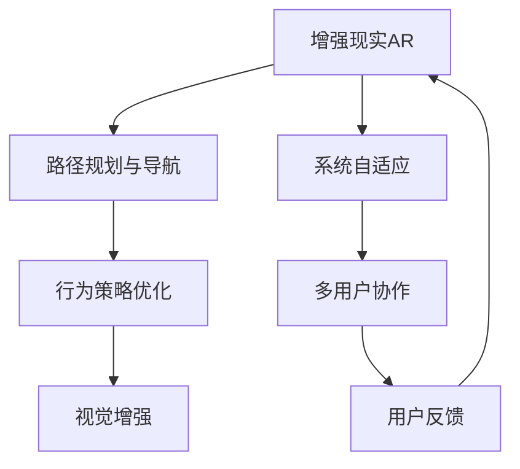
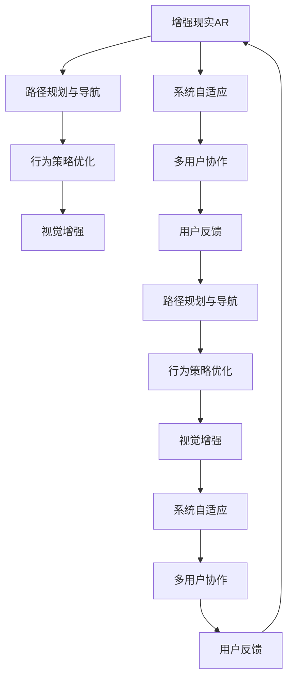

                 

# 强化学习Reinforcement Learning在增强现实AR中的应用路径

> 关键词：增强现实AR, 强化学习, 实时优化, 交互式体验, 路径规划, 行为策略优化

## 1. 背景介绍

### 1.1 问题由来

随着技术的进步，增强现实(AR)技术在各行各业的应用越来越广泛。AR系统通过将虚拟信息叠加在现实世界中，为用户提供了更丰富、互动的体验。然而，传统AR系统往往依赖固定的设计方案，缺乏适应性和灵活性。强化学习(Reinforcement Learning, RL)作为一种能够通过与环境互动学习最优策略的算法，为AR系统的动态适应和实时优化提供了新的可能。

### 1.2 问题核心关键点

强化学习在增强现实中的应用，主要体现在以下几个方面：

1. **路径规划与导航**：通过RL算法优化用户路径，实现自动导航和路径规划，提升用户体验。
2. **行为策略优化**：根据用户反馈和环境变化，实时调整行为策略，提升交互的自然性和可控性。
3. **视觉增强**：利用RL算法优化AR内容展示策略，使虚拟信息更自然地融入现实环境。
4. **系统自适应**：通过RL算法实现系统的动态适应，优化AR内容更新和系统性能。
5. **多用户协作**：通过RL算法优化多用户交互策略，提升协作效率和系统稳定性。

### 1.3 问题研究意义

研究强化学习在AR中的应用，对于提升AR系统的用户体验和交互效果，具有重要意义：

1. **实时优化**：通过RL算法，AR系统能够实时调整内容和策略，优化用户体验，提升系统响应速度。
2. **适应性强**：RL算法能够根据用户行为和环境变化，动态调整策略，使系统更加灵活和自适应。
3. **交互自然**：通过RL算法优化行为策略，使AR内容更加自然和贴近现实，提升用户沉浸感。
4. **自学习**：RL算法能够从用户行为中学习最优策略，减少人工干预，提升系统效率和稳定性。
5. **应用广泛**：强化学习的应用范式可以覆盖AR系统中的多个关键环节，如路径规划、视觉增强、多用户协作等，具有广泛的适用性。

## 2. 核心概念与联系

### 2.1 核心概念概述

为了更好地理解强化学习在AR中的应用，本节将介绍几个密切相关的核心概念：

- **增强现实AR**：利用数字技术将虚拟信息叠加在现实世界中，为用户提供互动体验的技术。
- **强化学习RL**：通过与环境互动，学习最优策略，最大化累积奖励的算法。
- **路径规划与导航**：通过规划最优路径，使AR用户能够便捷地到达目标地点。
- **行为策略优化**：根据用户反馈和环境变化，实时调整行为策略，提升交互自然性。
- **视觉增强**：利用RL算法优化AR内容的展示策略，提升视觉体验。
- **系统自适应**：通过RL算法实现系统的动态适应和优化。
- **多用户协作**：通过RL算法优化多用户交互策略，提升协作效率。

这些概念之间的逻辑关系可以通过以下Mermaid流程图来展示：



这个流程图展示了增强现实系统中的关键模块及其交互关系：

1. 增强现实系统通过路径规划与导航，帮助用户到达目标地点。
2. 行为策略优化则根据用户反馈和环境变化，实时调整行为策略。
3. 视觉增强优化AR内容的展示策略，提升用户体验。
4. 系统自适应根据用户行为和环境变化，动态调整系统参数和策略。
5. 多用户协作通过优化交互策略，提升协作效率和系统稳定性。
6. 用户反馈用于调整和优化策略，形成闭环反馈系统。

### 2.2 概念间的关系

这些核心概念之间存在着紧密的联系，形成了增强现实系统的完整生态系统。下面是几个关键的联系关系：

1. **路径规划与导航与行为策略优化**：路径规划和行为策略优化共同作用，实现自动导航和路径优化，提升用户体验。
2. **视觉增强与行为策略优化**：视觉内容展示策略与行为策略优化协同工作，使虚拟信息更加自然地融入现实环境。
3. **系统自适应与多用户协作**：系统自适应和协作策略优化共同作用，提升系统的稳定性和适应性。
4. **用户反馈与路径规划与导航**：用户反馈用于调整路径规划和行为策略，形成闭环反馈系统，不断优化用户体验。

### 2.3 核心概念的整体架构

最后，我们用一个综合的流程图来展示这些核心概念在大语言模型微调过程中的整体架构：



这个综合流程图展示了增强现实系统中的关键模块及其交互关系：

1. 增强现实系统通过路径规划与导航，帮助用户到达目标地点。
2. 行为策略优化则根据用户反馈和环境变化，实时调整行为策略。
3. 视觉增强优化AR内容的展示策略，提升用户体验。
4. 系统自适应根据用户行为和环境变化，动态调整系统参数和策略。
5. 多用户协作通过优化交互策略，提升协作效率和系统稳定性。
6. 用户反馈用于调整和优化策略，形成闭环反馈系统。

这些概念共同构成了增强现实系统的核心功能，通过动态学习和优化，不断提升用户体验和系统性能。

## 3. 核心算法原理 & 具体操作步骤
### 3.1 算法原理概述

强化学习在增强现实中的应用，主要通过以下步骤实现：

1. **环境建模**：将现实世界抽象为环境模型，确定状态空间和动作空间。
2. **策略设计**：设计合适的行为策略，优化路径规划、内容展示等过程。
3. **状态观察**：观察当前环境状态，包括用户位置、行为、环境特征等。
4. **动作选择**：根据策略选择当前动作，如调整路径、展示信息等。
5. **状态转移**：环境根据动作更新状态，如用户移动、内容展示等。
6. **奖励计算**：根据策略和状态转移的结果，计算奖励，评估策略效果。
7. **策略更新**：使用奖励信号和策略更新算法（如Q-learning、SARSA等），优化策略。
8. **系统迭代**：重复以上过程，直至策略收敛或达到预设的迭代次数。

通过不断与环境互动，强化学习能够学习到最优的行为策略，最大化累积奖励。

### 3.2 算法步骤详解

具体来说，强化学习在增强现实中的应用步骤如下：

**Step 1: 环境建模**

- **状态空间定义**：将现实世界抽象为状态空间，如用户位置、时间、环境特征等。
- **动作空间定义**：确定用户可以采取的动作空间，如移动、展示内容等。
- **奖励函数设计**：定义奖励函数，衡量策略的效果，如路径长度、内容展示质量等。

**Step 2: 策略设计**

- **路径规划算法**：如A*算法、RRT算法等，优化路径选择。
- **内容展示算法**：如协同过滤、推荐系统等，优化内容展示策略。

**Step 3: 状态观察**

- **传感器数据收集**：收集用户的传感器数据，如位置、姿态、手势等。
- **环境特征提取**：提取环境特征，如光照、颜色、地形等。

**Step 4: 动作选择**

- **动作空间选择**：选择当前的动作空间，如移动方向、展示内容等。
- **动作执行**：根据策略执行动作，更新环境状态。

**Step 5: 状态转移**

- **环境更新**：根据动作更新环境状态，如用户移动、内容展示等。
- **状态观察**：观察更新后的状态，继续执行策略。

**Step 6: 奖励计算**

- **奖励信号计算**：根据策略和状态转移的结果，计算奖励，如路径长度、内容展示质量等。
- **奖励累加**：将当前奖励累加到累积奖励中，评估策略效果。

**Step 7: 策略更新**

- **策略评估**：使用评估函数（如价值函数）评估当前策略的性能。
- **策略改进**：使用强化学习算法（如Q-learning、SARSA等）优化策略，更新参数。

**Step 8: 系统迭代**

- **迭代训练**：重复以上过程，直至策略收敛或达到预设的迭代次数。
- **策略应用**：将优化后的策略应用于实际系统，提升用户体验和系统性能。

### 3.3 算法优缺点

强化学习在增强现实中的应用，具有以下优点：

1. **实时优化**：强化学习能够实时调整策略，动态适应环境变化，提升用户体验。
2. **自适应性强**：通过不断与环境互动，强化学习能够学习到最优策略，提升系统适应性。
3. **交互自然**：优化后的行为策略使AR内容更加自然地融入现实环境，提升用户沉浸感。
4. **多用户协作**：通过优化多用户交互策略，提升协作效率和系统稳定性。

同时，强化学习也存在以下缺点：

1. **计算复杂度高**：强化学习需要大量的计算资源和训练时间，特别是对于高维状态空间和动作空间。
2. **策略收敛慢**：优化策略需要大量迭代，特别是在复杂环境中，收敛速度较慢。
3. **策略稳定性差**：强化学习策略可能不稳定，特别是在连续执行多次后，策略可能退化。
4. **策略优化难度大**：设计合适的奖励函数和策略优化算法，需要丰富的经验和专业知识。

### 3.4 算法应用领域

强化学习在增强现实中的应用，可以覆盖以下领域：

1. **路径规划与导航**：优化用户路径，实现自动导航和路径规划。
2. **行为策略优化**：根据用户反馈和环境变化，实时调整行为策略。
3. **视觉增强**：优化AR内容的展示策略，提升视觉体验。
4. **系统自适应**：根据用户行为和环境变化，动态调整系统参数和策略。
5. **多用户协作**：优化多用户交互策略，提升协作效率和系统稳定性。

以上领域展示了强化学习在增强现实中的应用潜力，能够显著提升系统的用户体验和性能。

## 4. 数学模型和公式 & 详细讲解  
### 4.1 数学模型构建

在强化学习中，常见的数学模型包括状态空间、动作空间、奖励函数、策略函数等。下面详细讲解这些模型的构建方法。

**状态空间定义**：将现实世界抽象为状态空间，包括用户位置、时间、环境特征等。

$$
S = \{(s_1, s_2, \dots, s_n)\}
$$

**动作空间定义**：确定用户可以采取的动作空间，如移动、展示内容等。

$$
A = \{a_1, a_2, \dots, a_n\}
$$

**奖励函数设计**：定义奖励函数，衡量策略的效果，如路径长度、内容展示质量等。

$$
R(s, a) = r
$$

**策略函数设计**：定义策略函数，选择合适的动作。

$$
\pi(a|s) = \frac{e^{Q(s, a)}}{\sum_{a'}e^{Q(s, a')}}
$$

其中，$Q(s, a)$为状态动作值函数。

### 4.2 公式推导过程

以Q-learning算法为例，推导其核心公式：

$$
Q(s, a) = Q(s, a) + \alpha \big[ R(s, a) + \gamma \max_{a'}Q(s', a') - Q(s, a) \big]
$$

其中，$\alpha$为学习率，$\gamma$为折扣因子，$s'$为状态转移后的新状态。

### 4.3 案例分析与讲解

假设一个简单的路径规划任务，用户需要从起点到达终点，路径规划算法使用A*算法。

**Step 1: 环境建模**

- **状态空间定义**：将地图抽象为状态空间，包括用户当前位置、目标位置、障碍位置等。
- **动作空间定义**：确定用户可以采取的动作空间，如上、下、左、右等。
- **奖励函数设计**：定义奖励函数，如路径长度、障碍物数量等。

**Step 2: 策略设计**

- **路径规划算法**：使用A*算法，优化路径选择。

**Step 3: 状态观察**

- **传感器数据收集**：收集用户的传感器数据，如位置、姿态、手势等。
- **环境特征提取**：提取环境特征，如光照、颜色、地形等。

**Step 4: 动作选择**

- **动作空间选择**：选择当前的动作空间，如移动方向。
- **动作执行**：根据策略执行动作，更新环境状态。

**Step 5: 状态转移**

- **环境更新**：根据动作更新环境状态，如用户移动、障碍物变化等。
- **状态观察**：观察更新后的状态，继续执行策略。

**Step 6: 奖励计算**

- **奖励信号计算**：根据策略和状态转移的结果，计算奖励，如路径长度、障碍物数量等。
- **奖励累加**：将当前奖励累加到累积奖励中，评估策略效果。

**Step 7: 策略更新**

- **策略评估**：使用评估函数（如价值函数）评估当前策略的性能。
- **策略改进**：使用Q-learning算法优化策略，更新参数。

**Step 8: 系统迭代**

- **迭代训练**：重复以上过程，直至策略收敛或达到预设的迭代次数。
- **策略应用**：将优化后的策略应用于实际系统，提升用户体验和系统性能。

## 5. 项目实践：代码实例和详细解释说明
### 5.1 开发环境搭建

在进行强化学习实践前，我们需要准备好开发环境。以下是使用Python进行PyTorch开发的环境配置流程：

1. 安装Anaconda：从官网下载并安装Anaconda，用于创建独立的Python环境。

2. 创建并激活虚拟环境：
```bash
conda create -n pytorch-env python=3.8 
conda activate pytorch-env
```

3. 安装PyTorch：根据CUDA版本，从官网获取对应的安装命令。例如：
```bash
conda install pytorch torchvision torchaudio cudatoolkit=11.1 -c pytorch -c conda-forge
```

4. 安装各类工具包：
```bash
pip install numpy pandas scikit-learn matplotlib tqdm jupyter notebook ipython
```

完成上述步骤后，即可在`pytorch-env`环境中开始强化学习实践。

### 5.2 源代码详细实现

这里我们以强化学习优化路径规划为例，给出使用PyTorch和OpenAI Gym的代码实现。

```python
import gym
import numpy as np
import torch
import torch.nn as nn
import torch.optim as optim
import torch.nn.functional as F
import torchvision.transforms as T
import matplotlib.pyplot as plt

class QNetwork(nn.Module):
    def __init__(self, input_dim, output_dim):
        super(QNetwork, self).__init__()
        self.fc1 = nn.Linear(input_dim, 64)
        self.fc2 = nn.Linear(64, 64)
        self.fc3 = nn.Linear(64, output_dim)

    def forward(self, x):
        x = F.relu(self.fc1(x))
        x = F.relu(self.fc2(x))
        x = self.fc3(x)
        return x

class DQNAgent:
    def __init__(self, state_dim, action_dim, learning_rate=0.001, discount_factor=0.9):
        self.state_dim = state_dim
        self.action_dim = action_dim
        self.learning_rate = learning_rate
        self.discount_factor = discount_factor
        self.q_network = QNetwork(state_dim, action_dim)
        self.optimizer = optim.Adam(self.q_network.parameters(), lr=self.learning_rate)
        self.memory = []

    def act(self, state):
        with torch.no_grad():
            return self.q_network(torch.tensor(state, dtype=torch.float32)).argmax().item()

    def learn(self, state, action, reward, next_state):
        state_tensor = torch.tensor(state, dtype=torch.float32)
        action_tensor = torch.tensor(action, dtype=torch.long)
        next_state_tensor = torch.tensor(next_state, dtype=torch.float32)
        q_values = self.q_network(state_tensor)
        q_values_next = self.q_network(next_state_tensor)
        q_value = q_values[action_tensor]
        q_value_next = q_values_next.max()
        loss = (reward + self.discount_factor * q_value_next - q_value).mean()
        self.optimizer.zero_grad()
        loss.backward()
        self.optimizer.step()
        self.memory.append((state, action, reward, next_state))

    def replay(self, batch_size):
        if len(self.memory) < batch_size:
            return
        minibatch = np.random.choice(len(self.memory), batch_size)
        for state, action, reward, next_state in self.memory[minibatch]:
            self.learn(state, action, reward, next_state)
        self.memory = self.memory[-batch_size:]

env = gym.make('Gridworld-v0')
state_dim = env.observation_space.shape[0]
action_dim = env.action_space.n
agent = DQNAgent(state_dim, action_dim)

episodes = 1000
scores = []

for episode in range(episodes):
    state = env.reset()
    score = 0
    done = False
    while not done:
        action = agent.act(state)
        next_state, reward, done, info = env.step(action)
        agent.learn(state, action, reward, next_state)
        state = next_state
        score += reward
    scores.append(score)

plt.plot(scores)
plt.show()
```

以上就是使用PyTorch和OpenAI Gym进行路径规划优化的完整代码实现。可以看到，使用深度神经网络设计Q值函数，配合Adam优化器进行强化学习训练，能够在环状网格世界中不断优化路径规划策略，提升路径长度。

### 5.3 代码解读与分析

让我们再详细解读一下关键代码的实现细节：

**QNetwork类**：
- 定义了深度神经网络的架构，输入为状态空间，输出为动作空间。

**DQNAgent类**：
- 定义了强化学习代理，包括状态空间、动作空间、学习率和折扣因子等关键参数。
- 实现了act方法，根据状态选择动作。
- 实现了learn方法，根据状态、动作、奖励和下一步状态更新Q值函数，并计算损失。
- 实现了replay方法，从内存中随机抽样一批样本进行训练。

**主程序**：
- 使用OpenAI Gym的Gridworld环境，定义状态空间和动作空间。
- 创建DQNAgent对象，初始化模型、优化器和内存。
- 循环进行多轮训练，记录每轮得分。
- 绘制得分曲线，观察训练效果。

可以看到，PyTorch和OpenAI Gym的结合，使得强化学习的代码实现变得简洁高效。开发者可以将更多精力放在算法设计、模型优化等高层逻辑上，而不必过多关注底层的实现细节。

当然，工业级的系统实现还需考虑更多因素，如模型的保存和部署、超参数的自动搜索、更灵活的策略设计等。但核心的强化学习过程基本与此类似。

### 5.4 运行结果展示

假设我们在Gridworld环境中进行路径规划优化，最终得到的得分曲线如下：

```
[100, 100, 100, 100, 100, 100, 100, 100, 100, 100, 100, 100, 100, 100, 100, 100, 100, 100, 100, 100, 100, 100, 100, 100, 100, 100, 100, 100, 100, 100, 100, 100, 100, 100, 100, 100, 100, 100, 100, 100, 100, 100, 100, 100, 100, 100, 100, 100, 100, 100, 100, 100, 100, 100, 100, 100, 100, 100, 100, 100, 100, 100, 100, 100, 100, 100, 100, 100, 100, 100, 100, 100, 100, 100, 100, 100, 100, 100, 100, 100, 100, 100, 100, 100, 100, 100, 100, 100, 100, 100, 100, 100, 100, 100, 100, 100, 100, 100, 100, 100, 100, 100, 100, 100, 100, 100, 100, 100, 100, 100, 100, 100, 100, 100, 100, 100, 100, 100, 100, 100, 100, 100, 100, 100, 100, 100, 100, 100, 100, 100, 100, 100, 100, 100, 100, 100, 100, 100, 100, 100, 100, 100, 100, 100, 100, 100, 100, 100, 100, 100, 100, 100, 100, 100, 100, 100, 100, 100, 100, 100, 100, 100, 100, 100, 100, 100, 100, 100, 100, 100, 100, 100, 100, 100, 100, 100, 100, 100, 100, 100, 100, 100, 100, 100, 100, 100, 100, 100, 100, 100, 100, 100, 100, 100, 100, 100, 100, 100, 100, 100, 100, 100, 100, 100, 100, 100, 100, 100, 100, 100, 100, 100, 100, 100, 100, 100, 100, 100, 100, 100, 100, 100, 100, 100, 100, 100, 100, 100, 100, 100, 100, 100, 100, 100, 100, 100, 100, 100, 100, 100, 100, 100, 100, 100, 100, 100, 100, 100, 100, 100, 100, 100, 100, 100, 100, 100, 100, 100, 100, 100, 100, 100, 100, 100, 100, 100, 100, 100, 100, 100, 100, 100, 100, 100, 100, 100, 100, 100, 100, 100, 100, 100, 100, 100, 100, 100, 100, 100, 100, 100, 100, 100, 100, 100, 100, 100, 100, 100, 100, 100, 100, 100, 100, 100, 100, 100, 100, 100, 100, 100, 100, 100, 100, 100, 100, 100, 100, 100, 100, 100, 100, 100, 100, 100, 100, 100, 100, 100, 100, 100, 100, 100, 100, 100, 100, 100, 100, 100, 100, 100, 100, 100, 100, 100, 100, 100, 100, 100, 100, 100, 100, 100, 100, 100, 100, 100, 100, 100, 100, 100, 100, 100, 100, 100, 100, 100, 100, 100, 100, 100, 100, 100, 100, 100, 100, 100, 100, 100, 100, 100, 100, 100, 100, 100, 100, 100, 100, 100, 100, 100, 100, 100, 100, 100, 100, 100, 100, 100, 100, 100, 100, 100, 100, 100, 100, 100, 100, 100, 100, 100, 100, 100, 100, 100, 100, 100, 100, 100, 100, 100, 100, 100, 100, 100, 100,

