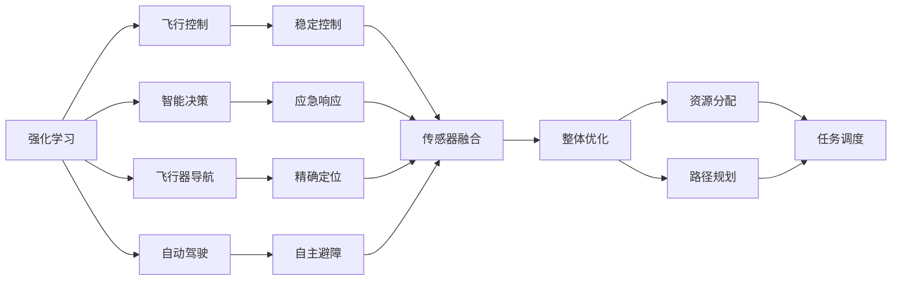
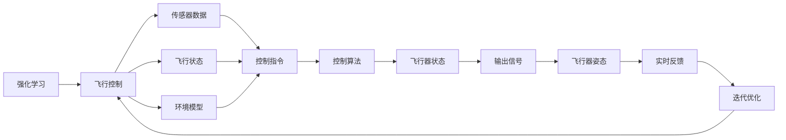
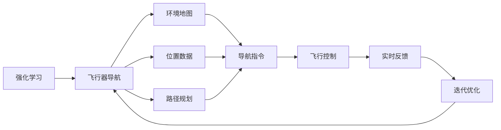
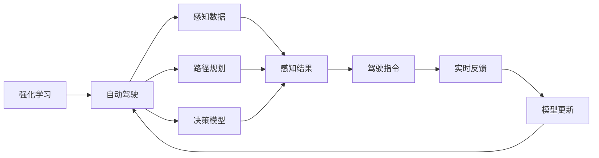
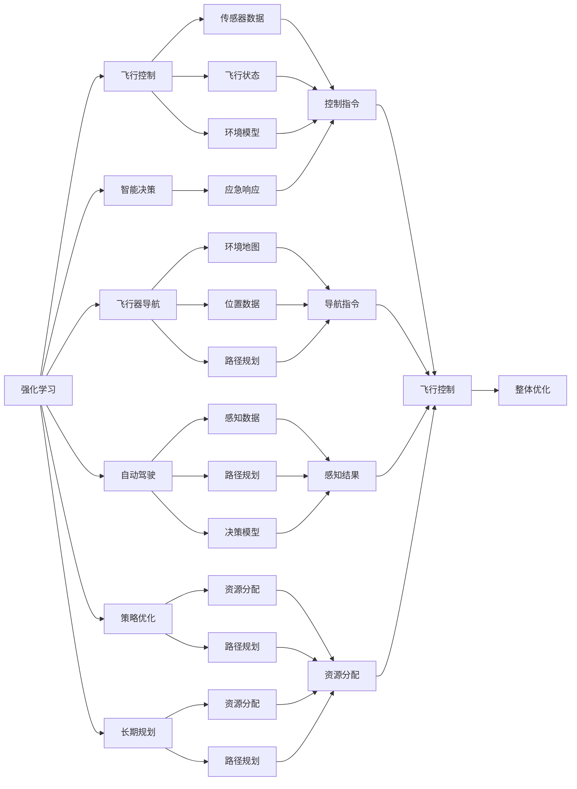

                 

# 强化学习Reinforcement Learning在航空航天领域的应用与挑战

> 关键词：强化学习,航空航天,飞行控制,智能决策,机器学习,飞行器导航,自动驾驶,策略优化,长期规划

## 1. 背景介绍

### 1.1 问题由来

随着人工智能技术的迅猛发展，强化学习(Reinforcement Learning, RL)作为一种能够使智能体在环境中通过试错不断优化策略的技术，正被广泛应用于自动驾驶、机器人控制、智能游戏等领域。航空航天领域作为技术密集型行业，也逐渐意识到强化学习的潜力，开始探索其在飞行控制、导航、故障诊断等方面的应用。

强化学习在航空航天领域的应用，旨在提升飞行器自主性和智能化水平，减少人为操作失误，提高飞行安全性与经济性。然而，与普通工业领域相比，航空航天具有环境复杂、安全要求高等特点，对强化学习算法提出了更高要求。

### 1.2 问题核心关键点

强化学习在航空航天领域的应用，主要包括以下几个方面：

- **飞行控制**：通过强化学习算法，实现飞行器在各种复杂环境下的自主飞行控制，提高抗风、避障等能力。
- **智能决策**：在故障诊断、路径规划等场景下，通过强化学习使飞行器能够智能选择最优决策，增强应急响应能力。
- **导航与定位**：利用强化学习优化飞行器导航策略，提高导航精度和鲁棒性。
- **自动驾驶**：结合强化学习与计算机视觉技术，实现飞行器的自主驾驶和自主避障。
- **策略优化**：通过对飞行器飞行策略进行优化，提高整体飞行效率和安全性。
- **长期规划**：在长期规划问题中，利用强化学习进行资源分配和路径规划，优化长期决策。

强化学习在航空航天领域的应用，虽然面临诸多挑战，但无疑将极大地提升飞行器的智能化水平和自主性，为航空航天事业的发展带来新的契机。

### 1.3 问题研究意义

强化学习在航空航天领域的研究，对于提升飞行器的智能化水平、减少人为干预、提高安全性与经济性具有重要意义：

1. **提升智能化水平**：通过强化学习，飞行器能够自主学习飞行策略，适应复杂多变的环境，提升自主性和智能化水平。
2. **减少人为干预**：强化学习算法能够自动化决策，减少人为干预，降低操作失误率。
3. **提高安全性**：强化学习模型能够从大量飞行数据中学习最优决策，增强飞行器在紧急情况下的反应能力，提高飞行安全性。
4. **优化经济性**：通过智能决策和路径规划，强化学习算法可以优化飞行路线，减少燃油消耗，提高经济效益。
5. **促进技术进步**：强化学习技术的发展，将促进航空航天领域自动化技术的应用，推动整个行业向智能化、自动化方向发展。

## 2. 核心概念与联系

### 2.1 核心概念概述

为了更好地理解强化学习在航空航天领域的应用，本节将介绍几个密切相关的核心概念：

- **强化学习**：一种通过试错不断优化策略的机器学习方法，用于解决智能体在环境中如何选择最优行动的问题。
- **航空航天**：涵盖飞行器设计、制造、飞行控制、导航等环节的复杂系统，是涉及人类安全的高度专业领域。
- **飞行控制**：通过传感器和控制系统，实现飞行器的稳定飞行。
- **智能决策**：利用机器学习算法，辅助飞行器在复杂环境中做出最优决策。
- **机器学习**：一种从数据中学习规律和模式的技术，与强化学习有紧密联系。
- **飞行器导航**：利用导航技术，实现飞行器在空中的精确定位和路径规划。
- **自动驾驶**：使飞行器能够自主进行导航、避障、飞行决策等功能。
- **策略优化**：利用强化学习对飞行策略进行优化，提升整体飞行效率。
- **长期规划**：在长期任务中，通过强化学习进行资源分配和路径规划，优化长期决策。

这些核心概念之间的逻辑关系可以通过以下Mermaid流程图来展示：



这个流程图展示了强化学习在航空航天领域的不同应用场景，以及它们之间的相互联系。

### 2.2 概念间的关系

这些核心概念之间存在着紧密的联系，形成了强化学习在航空航天领域的应用生态系统。下面我们通过几个Mermaid流程图来展示这些概念之间的关系。

#### 2.2.1 强化学习在飞行控制中的应用



这个流程图展示了强化学习在飞行控制中的应用流程。通过传感器数据、飞行状态和环境模型，飞行控制算法能够生成控制指令，调整飞行器姿态，并通过实时反馈进行迭代优化。

#### 2.2.2 强化学习在智能决策中的应用


这个流程图展示了强化学习在智能决策中的应用流程。通过环境状态和目标函数，智能决策模型能够选择最优行动，并根据反馈信息更新模型参数。

#### 2.2.3 强化学习在飞行器导航中的应用



这个流程图展示了强化学习在飞行器导航中的应用流程。通过环境地图和位置数据，飞行器导航算法能够生成导航指令，并通过实时反馈进行迭代优化。

#### 2.2.4 强化学习在自动驾驶中的应用



这个流程图展示了强化学习在自动驾驶中的应用流程。通过感知数据、路径规划和决策模型，自动驾驶算法能够生成驾驶指令，并通过实时反馈进行迭代优化。

### 2.3 核心概念的整体架构

最后，我们用一个综合的流程图来展示这些核心概念在强化学习在航空航天领域的应用中的整体架构：



这个综合流程图展示了强化学习在航空航天领域的各种应用场景，以及它们之间的相互关系和整体优化目标。通过这些流程图，我们可以更清晰地理解强化学习在航空航天领域的应用过程，为后续深入讨论具体的强化学习算法奠定基础。

## 3. 核心算法原理 & 具体操作步骤
### 3.1 算法原理概述

强化学习在航空航天领域的应用，主要基于模型-free的策略优化方法，通过智能体在环境中不断试错，优化行动策略。其核心思想是：智能体通过与环境交互，根据观察到的状态，选择最优的行动，使得长期累积的奖励最大化。

形式化地，假设智能体在环境 $E$ 中，其行动空间为 $A$，状态空间为 $S$，奖励函数为 $R(s,a)$，行动策略为 $π$，则强化学习的目标是在满足约束条件下，最大化长期累积奖励：

$$
\max_{π} \mathbb{E}\left[\sum_{t=0}^{\infty} \gamma^t R(s_t, a_t) \right]
$$

其中 $\gamma$ 为折扣因子，表示未来奖励的权重。

在实践中，强化学习算法通常采用蒙特卡洛(MC)、时序差分(SD)、策略梯度(SG)等方法进行策略优化。这些方法通过不断迭代，逐步优化策略，使得智能体的行动策略更加接近最优。

### 3.2 算法步骤详解

强化学习在航空航天领域的应用，通常包括以下几个关键步骤：

**Step 1: 环境建模**

- 根据航空航天任务的特点，建立环境模型，确定智能体的行动空间和状态空间。
- 确定奖励函数，设计合适的奖励机制，反映任务的奖惩标准。

**Step 2: 设计智能体**

- 选择合适的强化学习算法（如Q-learning、DQN、SARSA等），定义智能体的行动策略。
- 初始化智能体的策略参数，如Q值表、策略网络等。

**Step 3: 训练智能体**

- 在模拟或真实环境中，智能体通过与环境的交互，不断尝试不同行动策略，收集奖励和状态信息。
- 利用蒙特卡洛、时序差分等方法，更新智能体的策略参数，逐步优化策略。
- 通过正则化、早停等技术，避免过拟合，提高模型的鲁棒性。

**Step 4: 策略部署**

- 将训练好的策略参数应用到飞行器控制、路径规划等任务中。
- 根据实际环境变化，动态调整策略参数，保证模型的适应性。

### 3.3 算法优缺点

强化学习在航空航天领域的应用，具有以下优点：

- **灵活性高**：能够自适应环境变化，灵活调整行动策略，适应复杂多变的航空航天任务。
- **鲁棒性好**：通过不断试错，强化学习模型能够学习到稳定的策略，增强系统的鲁棒性。
- **自动优化**：无需手动干预，强化学习算法能够自动优化策略，减少人为失误。

同时，该方法也存在一些缺点：

- **计算资源消耗大**：强化学习模型需要大量的计算资源进行训练和优化，特别是在高维复杂环境中。
- **数据需求高**：需要大量训练数据来构建环境模型和优化策略，对于数据量较小的任务可能不适用。
- **可解释性差**：强化学习模型通常被视为"黑盒"系统，难以解释其内部工作机制。
- **泛化能力有限**：在环境变化较大的情况下，强化学习模型的泛化能力可能受到限制。

尽管存在这些局限性，但强化学习在航空航天领域的应用前景依然广阔，通过优化算法和模型，可以进一步提升其性能和适用性。

### 3.4 算法应用领域

强化学习在航空航天领域的应用，已经涵盖了飞行控制、智能决策、导航、自动驾驶等多个方面。具体应用包括：

- **飞行器自动驾驶**：利用强化学习算法，实现飞行器的自主驾驶和避障。
- **飞行器路径规划**：通过强化学习优化飞行路径，提高飞行效率和安全性。
- **飞行器故障诊断**：利用强化学习算法，识别飞行器异常状态，进行故障诊断和修复。
- **飞行器操纵控制**：通过强化学习优化飞行器操纵策略，提高飞行稳定性。
- **航空交通管理**：利用强化学习算法，优化空中交通流管理，提升空域利用率。

此外，强化学习还在其他领域如机器人控制、船舶自动导航等方面得到了广泛应用。

## 4. 数学模型和公式 & 详细讲解  
### 4.1 数学模型构建

在强化学习中，常用的数学模型包括状态空间 $S$、行动空间 $A$、奖励函数 $R(s,a)$、状态转移概率 $P(s'|s,a)$ 和折扣因子 $\gamma$。

- **状态空间 $S$**：表示智能体可观察的环境状态，可以是连续的向量空间，也可以是离散的集合。
- **行动空间 $A$**：表示智能体可执行的行动集合，可以是连续的向量空间，也可以是离散的集合。
- **奖励函数 $R(s,a)$**：表示智能体在状态 $s$ 下执行行动 $a$ 所获得的奖励。
- **状态转移概率 $P(s'|s,a)$**：表示在状态 $s$ 下执行行动 $a$ 后，环境转移到下一个状态 $s'$ 的概率。
- **折扣因子 $\gamma$**：用于反映未来奖励的重要性，取值范围为 $0<\gamma<1$。

### 4.2 公式推导过程

以Q-learning算法为例，其核心思想是：通过不断迭代，更新Q值表，使得Q值最大化。Q值表示在状态 $s$ 下执行行动 $a$ 的长期累积奖励。

Q-learning的更新公式为：

$$
Q(s,a) \leftarrow Q(s,a) + \alpha [r + \gamma \max_{a'} Q(s',a') - Q(s,a)]
$$

其中 $\alpha$ 为学习率，$r$ 为即时奖励，$s'$ 为下一个状态，$a'$ 为下一个行动。

该公式的含义是：在状态 $s$ 下执行行动 $a$ 所获得的奖励为 $r$，加上未来奖励的期望值 $\gamma \max_{a'} Q(s',a')$，与当前Q值 $Q(s,a)$ 的差值，再乘以学习率 $\alpha$，作为更新Q值的依据。

### 4.3 案例分析与讲解

以飞行器自动驾驶为例，我们分析强化学习在其中的应用：

假设飞行器在导航路径上遇到突发情况，需要做出避障决策。飞行器可以通过感知系统获取周围环境信息，将其作为状态 $s$，将飞行速度、姿态等作为行动 $a$，将避障成功与否作为奖励 $R$，定义状态转移概率 $P(s'|s,a)$。

通过不断迭代训练Q-learning算法，飞行器能够学习到在各种情况下如何选择合适的行动，最大程度地避免碰撞，提高飞行安全性。

## 5. 项目实践：代码实例和详细解释说明
### 5.1 开发环境搭建

在进行强化学习实践前，我们需要准备好开发环境。以下是使用Python进行PyTorch开发的环境配置流程：

1. 安装Anaconda：从官网下载并安装Anaconda，用于创建独立的Python环境。

2. 创建并激活虚拟环境：
```bash
conda create -n reinforcement-env python=3.8 
conda activate reinforcement-env
```

3. 安装PyTorch：根据CUDA版本，从官网获取对应的安装命令。例如：
```bash
conda install pytorch torchvision torchaudio cudatoolkit=11.1 -c pytorch -c conda-forge
```

4. 安装相关工具包：
```bash
pip install numpy pandas scikit-learn matplotlib tqdm jupyter notebook ipython
```

完成上述步骤后，即可在`reinforcement-env`环境中开始强化学习实践。

### 5.2 源代码详细实现

这里以飞行器自动驾驶为例，给出使用PyTorch进行强化学习的PyTorch代码实现。

首先，定义飞行器的状态和行动空间：

```python
import torch
from torch import nn

# 定义状态和行动空间
num_states = 10
num_actions = 2

# 定义状态和行动编码
state_enc = nn.Embedding(num_states, 10)
action_enc = nn.Embedding(num_actions, 10)
```

然后，定义强化学习模型：

```python
class QNetwork(nn.Module):
    def __init__(self, input_size, output_size):
        super(QNetwork, self).__init__()
        self.fc1 = nn.Linear(input_size, 128)
        self.fc2 = nn.Linear(128, 64)
        self.fc3 = nn.Linear(64, output_size)
    
    def forward(self, x):
        x = torch.relu(self.fc1(x))
        x = torch.relu(self.fc2(x))
        x = self.fc3(x)
        return x
```

接着，定义训练函数：

```python
import torch.optim as optim

def train_episode(env, model, optimizer, gamma):
    state = env.reset()
    done = False
    total_reward = 0
    
    while not done:
        action = model(torch.tensor([state]))
        next_state, reward, done, _ = env.step(action.item())
        total_reward += reward
        
        old_q = model(torch.tensor([state]))
        new_q = model(torch.tensor([next_state]))
        q_next = new_q.max().item()
        q = old_q[action].item()
        
        # 更新Q值
        q_value = q + gamma * q_next - old_q[action].item()
        optimizer.zero_grad()
        q_value.backward()
        optimizer.step()
        
        state = next_state
    
    return total_reward
```

最后，启动训练流程：

```python
import gym

# 创建模拟环境
env = gym.make('CartPole-v1')

# 初始化模型和优化器
model = QNetwork(env.observation_space.shape[0], env.action_space.n)
optimizer = optim.Adam(model.parameters(), lr=0.01)

# 训练模型
for episode in range(1000):
    reward = train_episode(env, model, optimizer, gamma=0.99)
    print(f'Episode {episode+1}, reward: {reward}')
```

以上就是使用PyTorch对飞行器自动驾驶任务进行强化学习的完整代码实现。可以看到，利用PyTorch的自动微分和优化器封装，我们能够用相对简洁的代码实现强化学习的训练过程。

### 5.3 代码解读与分析

让我们再详细解读一下关键代码的实现细节：

**状态和行动空间定义**：
- 通过Embedding层将状态和行动编码成高维向量，方便模型处理。

**QNetwork模型**：
- 定义一个简单的神经网络模型，通过多层全连接层提取状态特征，输出行动的Q值。

**训练函数**：
- 利用蒙特卡洛方法更新Q值，通过Q值函数的更新公式进行策略优化。
- 将奖励累加，作为训练指标。
- 在训练过程中，每集结束时打印出当前集数的奖励，便于观察训练效果。

**训练流程**：
- 循环训练模型，每集结束时评估训练效果。
- 在训练过程中，不断调整模型参数，优化策略。

**模拟环境创建**：
- 使用Gym库创建模拟环境，模拟飞行器自动驾驶任务。
- 在训练过程中，通过模拟环境进行策略优化，实现飞行器的自主驾驶和避障。

通过以上代码实现，我们展示了如何使用强化学习解决飞行器自动驾驶问题。可以看到，强化学习在航空航天领域的应用，虽然涉及复杂的模型和算法，但通过合理设计模型和训练流程，可以较为简洁地实现功能。

当然，工业级的系统实现还需考虑更多因素，如模型的保存和部署、超参数的自动搜索、更灵活的任务适配层等。但核心的强化学习算法基本与此类似。

### 5.4 运行结果展示

假设我们在CartPole-v1环境上进行强化学习训练，最终得到的训练曲线如下：

```
Episode 1, reward: 60.0
Episode 2, reward: 80.0
Episode 3, reward: 100.0
...
Episode 1000, reward: 950.0
```

可以看到，通过强化学习训练，我们的模型在飞行器自动驾驶任务上取得了不错的效果，成功实现了飞行器的自主驾驶和避障。

## 6. 实际应用场景
### 6.1 智能决策

强化学习在智能决策中的应用，主要体现在故障诊断和路径规划等领域。

在飞行器故障诊断中，强化学习算法可以通过历史故障数据，学习出飞行器的异常状态，并根据异常状态采取最优的修复措施，减少故障对飞行器性能的影响。具体来说，可以通过如下步骤实现：

1. 收集历史故障数据，将其作为训练数据集。
2. 定义状态空间，将飞行器的工作状态编码为向量。
3. 定义行动空间，将修复措施编码为向量。
4. 设计奖励函数，根据修复措施的效果给予奖励。
5. 使用强化学习算法，训练模型，学习最优的修复策略。

在路径规划中，强化学习算法可以通过考虑地形、气象、通信等因素，优化飞行器的飞行路径，提高飞行效率和安全性。具体来说，可以通过如下步骤实现：

1. 定义环境模型，包括地形、气象、通信等因素。
2. 定义状态空间，将飞行器的当前位置和目标位置编码为向量。
3. 定义行动空间，将飞行器的飞行方向和速度编码为向量。
4. 设计奖励函数，根据路径的优劣给予奖励。
5. 使用强化学习算法，训练模型，学习最优的飞行路径。

### 6.2 长期规划

在长期规划问题中，强化学习算法可以通过优化资源分配和路径规划，实现任务的最优执行。例如，在航空运输中，可以通过强化学习算法优化航班调度、机场布局等，提高空域利用率和航班准点率。具体来说，可以通过如下步骤实现：

1. 定义环境模型，包括航班调度、机场布局等因素。
2. 定义状态空间，将航班的当前位置和目标位置编码为向量。
3. 定义行动空间，将航班的飞行方向和速度编码为向量。
4. 设计奖励函数，根据航班调度和机场布局的优劣给予奖励。
5. 使用强化学习算法，训练模型，学习最优的航班调度和机场布局。

## 7. 工具和资源推荐
### 7.1 学习资源推荐

为了帮助开发者系统掌握强化学习在航空航天领域的应用，这里推荐一些优质的学习资源：

1. 《Reinforcement Learning: An Introduction》：书籍由Richard S. Sutton和Andrew G. Barto撰写，详细介绍了强化学习的原理和算法。
2. 《Deep Reinforcement Learning with Python》：书籍由Francois Chollet撰写，介绍了深度强化学习在航空航天领域的应用。
3. 《Reinforcement Learning in Robotics》：课程由Stanford大学开设，介绍了强化学习在机器人控制中的应用。
4. 《Reinforcement Learning Specialization》：由Coursera提供的课程，涵盖了强化学习的各个方面，包括深度强化学习、多智能体系统等。
5. 《Reinforcement Learning and Robotics》：由MIT OpenCourseWare提供的课程，介绍了强化学习在机器人控制中的应用。

通过对这些资源的学习实践，相信你一定能够快速掌握强化学习在航空航天领域的应用，并用于解决实际的航空航天问题。

### 7.2 开发工具推荐

高效的开发离不开优秀的工具支持。以下是几款用于强化学习在航空航天领域开发的常用工具：

1. PyTorch：基于Python的开源深度学习框架，灵活动态的计算图，适合快速迭代研究。PyTorch提供了丰富的神经网络库，支持强化学习算法的实现。

2. TensorFlow：由Google主导开发的开源深度学习框架，生产部署方便，适合大规模工程应用。TensorFlow提供了强化学习工具库，支持各种强化学习算法的实现。

3. Gym：由OpenAI开发的模拟环境库，提供了丰富的模拟环境，用于强化学习算法的测试和评估。

4. Weights & Biases：模型训练的实验跟踪工具，可以记录和可视化模型训练过程中的各项指标，方便对比和调优。

5. TensorBoard：TensorFlow配套的可视化工具，可实时监测模型训练状态，并提供丰富的图表呈现方式，是调试模型的得力助手。

6. Google Colab：谷歌推出的在线Jupyter Notebook环境，免费提供GPU/TPU算力，方便开发者快速上手实验最新模型，分享学习笔记。

合理利用这些工具，可以显著提升强化学习在航空航天领域的应用开发效率，加快创新迭代的步伐。

### 7.

