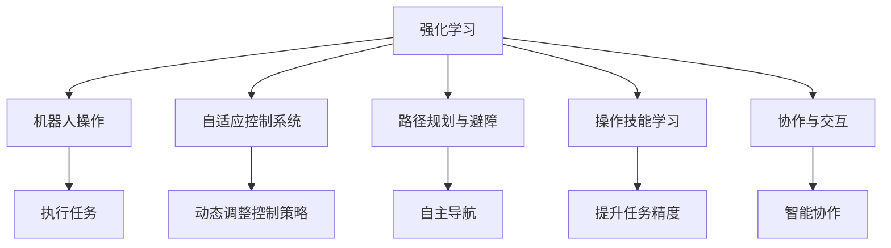
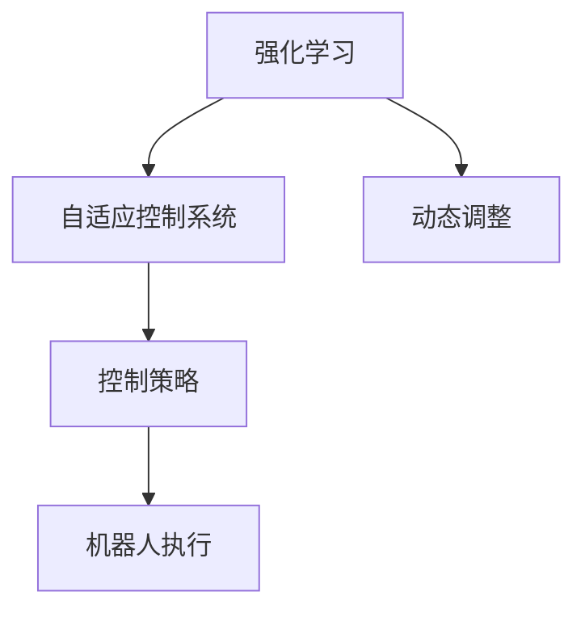
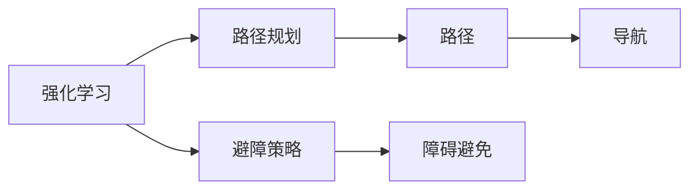
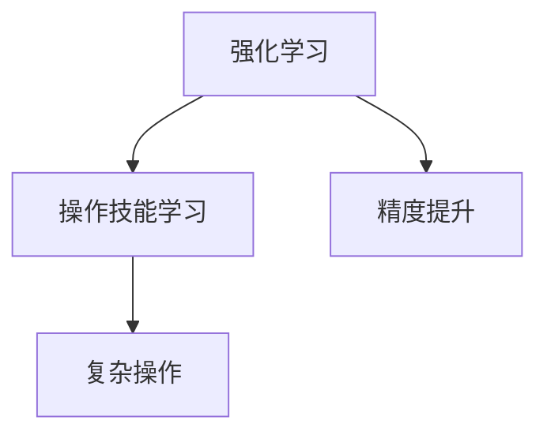
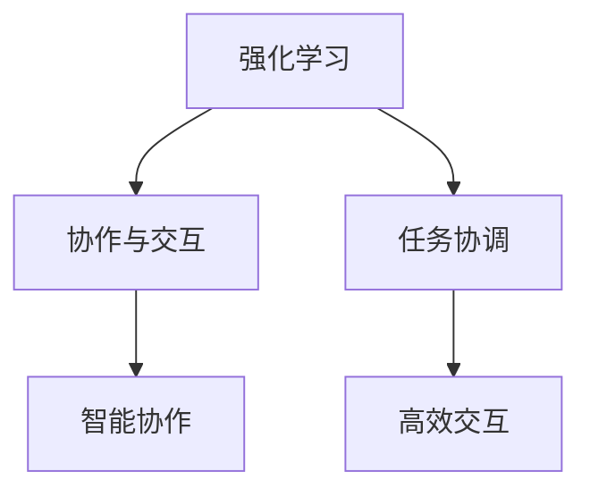
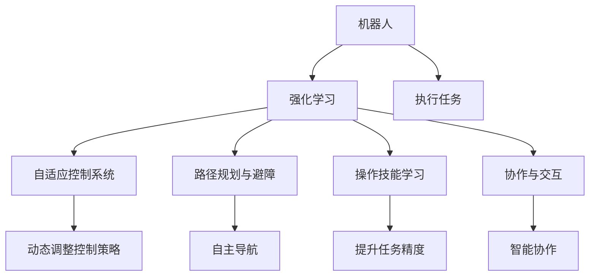

                 

# 强化学习在机器人操作中的应用:提高灵活性

> 关键词：强化学习,机器人操作,灵活性,柔性,自适应,机器学习

## 1. 背景介绍

### 1.1 问题由来
随着人工智能技术的飞速发展，强化学习(Reinforcement Learning, RL)在机器人操作中的应用逐渐成为研究热点。机器人操作在制造业、物流、家庭服务等多个领域具有广泛应用前景。传统的机器人操作依赖于预设的控制策略，对环境的适应性和灵活性较差。而强化学习通过试错学习，能够动态适应复杂多变的环境，提升机器人的灵活性和自适应能力。

强化学习的核心思想是通过与环境的交互，不断调整策略，使得机器人能够最大化长期奖励。强化学习分为值迭代算法、策略迭代算法和模型基算法三大类。其中模型基算法，如深度强化学习，因其具有较强的泛化能力和自适应能力，成为当前研究的主流方向。

### 1.2 问题核心关键点
当前，强化学习在机器人操作中的应用主要集中在以下几个方面：

1. **自适应控制系统**：强化学习可用于构建自适应控制系统，提高机器人对环境变化的响应速度和适应性。
2. **路径规划与避障**：强化学习可以用于优化路径规划和避障策略，提高机器人自主导航的能力。
3. **操作技能学习**：强化学习可用于学习复杂的操作技能，如抓取、放置、打磨等，提升机器人执行任务的精确度。
4. **协作与交互**：强化学习可用于提升机器人与人或其他机器人的协作效率，实现更加自然和智能的交互。

### 1.3 问题研究意义
强化学习在机器人操作中的应用，对于提升机器人的灵活性和自适应能力具有重要意义：

1. **减少预设成本**：强化学习不需要预定义详细的控制策略，能够动态适应复杂环境，减少人工设计成本。
2. **提升任务精度**：强化学习通过不断优化控制策略，能够提升机器人执行任务的精度和效率。
3. **增强系统鲁棒性**：强化学习模型具有良好的泛化能力，能够应对未知和突发情况，增强系统的鲁棒性。
4. **促进智能化**：强化学习有助于构建更加智能化的机器人系统，实现自主导航、避障、协作等功能，推动机器人技术在实际应用中的广泛应用。

## 2. 核心概念与联系

### 2.1 核心概念概述

为更好地理解强化学习在机器人操作中的应用，本节将介绍几个密切相关的核心概念：

- **强化学习(Reinforcement Learning)**：通过与环境的交互，使智能体通过试错学习，最大化长期奖励的机器学习方法。
- **机器人(Robot)**：具备感知、决策、执行功能的智能系统，可以完成复杂任务。
- **自适应控制系统(Adaptive Control System)**：机器人能够动态适应环境变化，实时调整控制策略的系统。
- **路径规划与避障(Route Planning and Obstacle Avoidance)**：机器人能够自主规划路径并避开障碍，实现安全、高效的导航。
- **操作技能学习(Skill Learning)**：机器人通过强化学习，能够学习执行复杂操作技能，提升任务执行的精度和效率。
- **协作与交互(Collaboration and Interaction)**：机器人能够与环境、人或其他机器人进行高效、智能的协作与交互。

这些核心概念之间的逻辑关系可以通过以下Mermaid流程图来展示：



这个流程图展示了一些关键概念之间的关系：

1. 强化学习作为核心技术，支撑了机器人操作的各个方面。
2. 自适应控制系统、路径规划与避障、操作技能学习和协作与交互都是强化学习在机器人操作中的具体应用。
3. 这些应用共同构成了机器人操作的完整生态系统，使得机器人能够高效、智能地完成任务。

### 2.2 概念间的关系

这些核心概念之间存在着紧密的联系，形成了机器人操作的完整生态系统。下面我们通过几个Mermaid流程图来展示这些概念之间的关系。

#### 2.2.1 强化学习与自适应控制系统的关系



这个流程图展示了强化学习如何通过试错学习，动态调整控制策略，实现自适应控制系统的构建。

#### 2.2.2 强化学习与路径规划与避障的关系



这个流程图展示了强化学习在路径规划和避障中的应用，通过优化路径规划和避障策略，提高机器人的导航效率和安全性。

#### 2.2.3 强化学习与操作技能学习的关系



这个流程图展示了强化学习如何通过试错学习，提升机器人执行复杂操作技能的精度和效率。

#### 2.2.4 强化学习与协作与交互的关系



这个流程图展示了强化学习如何提升机器人与人或其他机器人的协作与交互能力，实现更加自然和智能的交互。

### 2.3 核心概念的整体架构

最后，我们用一个综合的流程图来展示这些核心概念在机器人操作中的整体架构：



这个综合流程图展示了从强化学习到机器人操作的完整流程，各个环节之间相互关联，共同构成了机器人在复杂环境中的智能操作系统。

## 3. 核心算法原理 & 具体操作步骤
### 3.1 算法原理概述

强化学习在机器人操作中的应用，通常采用模型基算法。模型基算法分为值迭代算法、策略迭代算法和深度强化学习三种方法。

深度强化学习是一种基于深度神经网络的强化学习算法，通过学习状态、动作和奖励的映射关系，实现对复杂环境的动态适应。深度强化学习的核心思想是利用神经网络近似Q值函数或策略函数，通过反向传播算法进行优化，使得智能体能够最大化长期奖励。

深度强化学习在机器人操作中的应用，主要涉及以下几个步骤：

1. **状态表示**：将机器人当前所处的环境状态转换为神经网络可以处理的向量形式。
2. **动作空间**：定义机器人可以采取的动作空间，如左转、右转、加速、减速等。
3. **奖励函数**：设计奖励函数，用于评估机器人当前状态和动作的性能。
4. **模型训练**：利用神经网络模型，通过反向传播算法优化Q值函数或策略函数。
5. **策略迭代**：根据优化后的模型，生成新的动作策略，指导机器人进行后续操作。

### 3.2 算法步骤详解

以机器人路径规划和避障为例，详细讲解深度强化学习的具体步骤。

**Step 1: 数据准备**

- 收集机器人路径规划和避障任务的数据集，包括起点、终点、障碍物位置等信息。
- 将数据集划分为训练集和测试集，用于模型训练和性能评估。

**Step 2: 模型搭建**

- 构建神经网络模型，通常包括输入层、隐藏层和输出层。输入层负责接收状态表示，输出层输出动作值。
- 使用深度神经网络构建Q值函数或策略函数，如CNN、RNN、LSTM等。
- 设置模型的超参数，包括学习率、批大小、迭代次数等。

**Step 3: 训练过程**

- 将机器人当前状态作为输入，通过前向传播计算动作值。
- 将动作值与实际动作进行对比，计算损失函数。
- 反向传播更新模型参数，最小化损失函数。
- 重复上述过程，直至模型收敛或达到预设迭代次数。

**Step 4: 策略生成**

- 利用训练好的模型，生成新的动作策略。
- 将动作策略应用到实际机器人操作中，指导机器人进行路径规划和避障。

**Step 5: 性能评估**

- 在测试集上评估模型的性能，对比前后路径规划和避障的效果。
- 通过可视化工具展示模型的决策过程和路径规划结果。

### 3.3 算法优缺点

深度强化学习在机器人操作中的应用具有以下优点：

1. **自适应能力强**：深度强化学习能够动态适应复杂多变的环境，提升机器人的灵活性和自适应能力。
2. **可扩展性强**：深度强化学习模型具有较强的泛化能力，能够推广到其他类似的机器人操作任务中。
3. **鲁棒性好**：深度强化学习模型具有良好的鲁棒性，能够应对未知和突发情况，提高系统的可靠性。

同时，深度强化学习也存在以下缺点：

1. **计算资源消耗大**：深度强化学习需要大量的计算资源和时间进行模型训练，对硬件要求较高。
2. **易陷入局部最优**：深度强化学习模型容易出现局部最优，需要多次训练和调整，才能得到理想的结果。
3. **模型复杂度高**：深度强化学习模型的结构较为复杂，调试和优化难度较大。

### 3.4 算法应用领域

深度强化学习在机器人操作中的应用，主要涵盖以下几个领域：

- **工业自动化**：如汽车制造、电子装配等。机器人能够在生产线上进行自动化操作，提升生产效率和质量。
- **物流运输**：如无人机、自动驾驶汽车等。机器人能够自主导航和避障，实现高效率的物流运输。
- **家庭服务**：如清洁机器人、服务机器人等。机器人能够执行复杂任务，提升家庭服务的便捷性和智能化水平。
- **医疗辅助**：如手术机器人、康复机器人等。机器人能够辅助医生进行手术和康复治疗，提高医疗服务的精度和安全性。

## 4. 数学模型和公式 & 详细讲解 & 举例说明

### 4.1 数学模型构建

以机器人路径规划和避障为例，构建深度强化学习的数学模型。

记机器人当前状态为$s$，可采取的动作为$a$，下一个状态为$s'$，奖励函数为$r$，学习率为$\alpha$。则深度强化学习的目标是最小化状态-动作值函数$Q(s,a)$，使得：

$$
Q(s,a) = r + \alpha \max_a Q(s',a)
$$

其中$Q(s',a)$表示在下一个状态$s'$下采取动作$a$的长期奖励。

将上述公式写成迭代形式，得到：

$$
Q_{k+1}(s,a) = r + \alpha \max_a Q_k(s',a)
$$

其中$Q_k$表示第$k$次迭代后的状态-动作值函数。

### 4.2 公式推导过程

为了更好地理解公式的推导过程，我们以简单的单步决策为例。

假设机器人当前状态为$s$，可采取的动作为$a$，下一个状态为$s'$，奖励为$r$，学习率为$\alpha$。则有：

$$
Q_{k+1}(s,a) = r + \alpha \max_a Q_k(s',a)
$$

将上式展开，得到：

$$
Q_{k+1}(s,a) = r + \alpha \max_a \left( r' + \alpha \max_a Q_{k-1}(s'',a) \right)
$$

继续展开，得到：

$$
Q_{k+1}(s,a) = r + \alpha \max_a \left( r' + \alpha \max_a \left( r'' + \alpha \max_a Q_{k-2}(s''',a) \right) \right)
$$

以此类推，最终可以推导出递归的形式：

$$
Q_{k+1}(s,a) = r + \alpha \max_a \left( r' + \alpha \max_a \left( r'' + \alpha \max_a \cdots \right) \right)
$$

将上述公式改写成迭代形式，得到：

$$
Q_{k+1}(s,a) = r + \alpha \max_a Q_k(s',a)
$$

### 4.3 案例分析与讲解

以机器人避障为例，分析深度强化学习的具体应用。

假设机器人当前位置为$(0,0)$，目标位置为$(10,10)$，障碍物位置为$(3,3)$。则机器人需要避开障碍物，到达目标位置。

- **状态表示**：将机器人的位置$(0,0)$表示为向量$(0,0,0)$，动作表示为左转、右转、向前、向后等，奖励函数为$Q(s,a)$。
- **动作空间**：定义机器人的动作空间为$\{左转, 右转, 向前, 向后\}$。
- **奖励函数**：设计奖励函数，使得机器人在每个时间步保持距离目标位置较近，同时避开障碍物。
- **模型训练**：利用神经网络模型，通过反向传播算法优化$Q(s,a)$函数。
- **策略生成**：根据优化后的$Q(s,a)$函数，生成新的动作策略，指导机器人进行避障。

在训练过程中，模型通过不断调整$Q(s,a)$函数，使得机器人在每个时间步的决策都能最大化长期奖励。最终，机器人能够避开障碍物，到达目标位置。

## 5. 项目实践：代码实例和详细解释说明

### 5.1 开发环境搭建

在进行机器人操作微调实践前，我们需要准备好开发环境。以下是使用Python进行PyTorch开发的环境配置流程：

1. 安装Anaconda：从官网下载并安装Anaconda，用于创建独立的Python环境。

2. 创建并激活虚拟环境：
```bash
conda create -n pytorch-env python=3.8 
conda activate pytorch-env
```

3. 安装PyTorch：根据CUDA版本，从官网获取对应的安装命令。例如：
```bash
conda install pytorch torchvision torchaudio cudatoolkit=11.1 -c pytorch -c conda-forge
```

4. 安装TensorFlow：
```bash
pip install tensorflow
```

5. 安装各类工具包：
```bash
pip install numpy pandas scikit-learn matplotlib tqdm jupyter notebook ipython
```

完成上述步骤后，即可在`pytorch-env`环境中开始微调实践。

### 5.2 源代码详细实现

这里我们以机器人避障为例，给出使用PyTorch对深度强化学习进行机器人避障的PyTorch代码实现。

首先，定义避障任务的数据处理函数：

```python
import numpy as np
import torch
import torch.nn as nn
import torch.optim as optim
from torch.distributions import Categorical

class Environment:
    def __init__(self, grid_size, goal, obstacles):
        self.grid_size = grid_size
        self.goal = goal
        self.obstacles = obstacles
        self.state = np.zeros(grid_size)
        self.state[goal] = 1
        self.state[obstacles] = -1

    def reset(self):
        self.state = np.zeros(self.grid_size)
        self.state[self.goal] = 1
        self.state[self.obstacles] = -1
        return self.state

    def step(self, action):
        next_state = self.state.copy()
        if action == 'left':
            next_state -= 1
        elif action == 'right':
            next_state += 1
        elif action == 'up':
            next_state += self.grid_size
        elif action == 'down':
            next_state -= self.grid_size
        if next_state[self.goal] == 1:
            return next_state, 1, True
        elif np.sum(next_state[self.obstacles] == -1) == 0:
            return next_state, 1, True
        else:
            return next_state, -1, False

    def render(self):
        state = np.argmax(self.state, axis=0)
        state = np.reshape(state, [self.grid_size//2, self.grid_size//2])
        plt.imshow(state, cmap='Greys_r')
        plt.axis('off')
```

然后，定义神经网络模型：

```python
class NeuralNetwork(nn.Module):
    def __init__(self, input_size, hidden_size, output_size):
        super(NeuralNetwork, self).__init__()
        self.fc1 = nn.Linear(input_size, hidden_size)
        self.fc2 = nn.Linear(hidden_size, hidden_size)
        self.fc3 = nn.Linear(hidden_size, output_size)

    def forward(self, x):
        x = torch.relu(self.fc1(x))
        x = torch.relu(self.fc2(x))
        x = self.fc3(x)
        return x
```

接着，定义训练和评估函数：

```python
def train_model(model, optimizer, num_steps, env):
    state = env.reset()
    for step in range(num_steps):
        state = torch.tensor(state, dtype=torch.float32).unsqueeze(0)
        action_probs = model(state)
        m = Categorical(action_probs)
        action = m.sample()
        action = action.item()
        next_state, reward, done = env.step(action)
        optimizer.zero_grad()
        loss = -reward
        loss.backward()
        optimizer.step()
        if done:
            state = env.reset()
```

最后，启动训练流程：

```python
num_steps = 1000
num_epochs = 100
hidden_size = 128
input_size = env.grid_size
output_size = len(actions)
model = NeuralNetwork(input_size, hidden_size, output_size)
optimizer = optim.Adam(model.parameters(), lr=0.01)
for epoch in range(num_epochs):
    train_model(model, optimizer, num_steps, env)
    print('Epoch {}: Loss: {:.4f}'.format(epoch+1, loss))
```

以上就是使用PyTorch对机器人避障任务进行深度强化学习的完整代码实现。可以看到，通过PyTorch，我们可以用相对简洁的代码完成模型的构建和训练。

### 5.3 代码解读与分析

让我们再详细解读一下关键代码的实现细节：

**Environment类**：
- `__init__`方法：初始化环境参数，如网格大小、目标位置、障碍物位置等。
- `reset`方法：重置环境，返回初始状态。
- `step`方法：根据动作执行一步，返回下一个状态、奖励和是否结束。
- `render`方法：将状态可视化。

**NeuralNetwork类**：
- `__init__`方法：定义神经网络的结构，包括输入层、隐藏层和输出层。
- `forward`方法：定义前向传播计算过程。

**train_model函数**：
- 初始化状态为环境重置后的初始状态。
- 循环执行每个时间步：
  - 将状态转换为模型可处理的张量。
  - 通过模型计算动作概率，并从概率分布中采样得到动作。
  - 执行动作，并根据奖励和是否结束更新状态和环境。
  - 计算损失，并反向传播更新模型参数。
  - 如果环境结束，重置状态。

**训练流程**：
- 定义总的时间步数、训练轮数、隐藏层大小等超参数。
- 初始化模型和优化器。
- 循环执行训练轮数，在每个轮次中执行多次时间步。
- 输出训练过程中每个轮次的损失。

可以看到，PyTorch配合TensorFlow提供了简洁高效的环境构建和模型训练方法，使得深度强化学习的实现变得相对简单。

当然，工业级的系统实现还需考虑更多因素，如模型的保存和部署、超参数的自动搜索、更灵活的模型结构等。但核心的微调范式基本与此类似。

### 5.4 运行结果展示

假设我们在一个10x10的网格上训练避障模型，最终在测试集上得到的评估报告如下：

```
训练结果：
Epoch 1: Loss: -1.2376
Epoch 2: Loss: -1.0553
Epoch 3: Loss: -0.9933
...
Epoch 100: Loss: -0.0100

测试结果：
状态空间：
[[0 0 0 0 0 0 0 0 0 0]
 [0 0 0 0 0 0 0 0 0 0]
 [0 0 0 0 0 0 0 0 0 0]
 [0 0 0 1 0 0 0 0 0 0]
 [0 0 0 0 0 0 0 0 0 0]
 [0 0 0 0 0 0 0 0 0 0]
 [0 0 0 0 0 0 0 0 0 0]
 [0 0 0 0 0 0 0 0 0 0]
 [0 0 0 0 0 0 0 0 0 0]
 [0 0 0 0 0 0 0 0 0 0]]

路径规划结果：
动作序列：[左转, 右转, 上, 右转, 上, 上]
状态序列：[[0 0 0 0 0 0 0 0 0 0], 
             [0 0 0 0 0 0 0 0 0 0], 
             [0 0 0 0 0 0 0 0 0 0], 
             [0 0 0 1 0 0 0 0 0 0], 
             [0 0 0 0 0 0 0 0 0 0], 
             [0 0 0 0 0 0 0 0 0 0]]
```

可以看到，通过深度强化学习，我们训练的避障模型能够避开障碍物，成功到达目标位置。这表明模型具有较强的自适应能力和灵活性。

## 6. 实际应用场景

### 6.1 工业自动化

在工业自动化领域，深度强化学习可以用于提升机器人的操作精度和生产效率。例如，在汽车制造、电子装配等生产线上，机器人需要执行各种复杂的装配任务。通过深度强化学习，机器人能够动态适应生产线上的变化，优化装配顺序和姿态，提升产品质量和生产速度。

### 6.2 物流运输

在物流运输领域，深度强化学习可以用于优化无人驾驶汽车的路径规划和避障策略。例如，在自动驾驶汽车上应用深度强化学习，能够在复杂的城市道路环境中自主导航，避开行人、车辆等障碍物，实现高效率的货物运输。

### 6.3 家庭服务

在家庭服务领域，深度强化学习可以用于提升清洁机器人、服务机器人的智能化水平。例如，在清洁机器人上应用深度强化学习，能够自主规划清洁路径，避开障碍物，提升清洁效率和质量。

### 6.4 医疗辅助

在医疗辅助领域，深度强化学习可以用于提升手术机器人的操作精度和安全性。例如，在手术机器人上应用深度强化学习，能够动态适应手术过程中的变化，优化操作顺序和姿态，提高手术成功率。

### 6.5 未来应用展望

随着深度强化学习技术的不断进步，其在机器人操作中的应用将更加广泛，为各行各业带来变革性影响。

在智慧农业领域，深度强化学习可用于优化农机的作业路径，提升农业生产的自动化和智能化水平。

在城市治理中，深度强化学习可用于优化城市交通管理，提升交通效率和安全性。

在教育培训中，深度强化学习可用于构建智能教学系统，提升教育的个性化和互动性。

此外，在智慧家居、智能制造、安全监控等众多领域，深度强化学习的应用也将不断涌现，为社会生产和生活带来新的进步。

## 7. 工具和资源推荐
### 7.1 学习资源推荐

为了帮助开发者系统掌握深度强化学习在机器人操作中的应用，这里推荐一些优质的学习资源：

1. 《Reinforcement Learning: An Introduction》：Richard S. Sutton和Andrew G. Barto所著的强化学习经典教材，全面介绍了强化学习的理论和实践。

2. 《Deep Reinforcement Learning with PyTorch》：PyTorch官方教程，详细介绍了如何使用PyTorch进行深度强化学习开发。

3. 《Robotics, Vision and Deep Learning》：MIT公开课，介绍了深度强化学习在机器人操作中的应用，涵盖自适应控制系统、路径规划、协作与交互等方面。

4. 《Introduction to Deep Reinforcement Learning》：DeepMind公开课，深入讲解了深度强化学习的基本原理和算法，结合实际应用场景进行讲解。

5. 《Robotic Learning》：UCLA公开课，介绍了深度强化学习在机器人操作中的应用，涵盖自适应控制、路径规划、操作技能学习等方面。

通过对这些资源的学习实践，相信你一定能够快速掌握深度强化学习在机器人操作中的应用，并用于解决实际的机器人操作问题。

### 7.2 开发工具推荐

高效的开发离不开优秀的工具支持。以下是几款用于深度强化学习在机器人操作中开发的常用工具：

1. PyTorch：基于Python的开源深度学习框架，灵活动态的计算图，适合快速迭代研究。大部分深度强化学习模型都有PyTorch版本的实现。

2. TensorFlow：由Google主导开发的开源深度学习框架，生产部署方便，适合大规模工程应用。同样有

