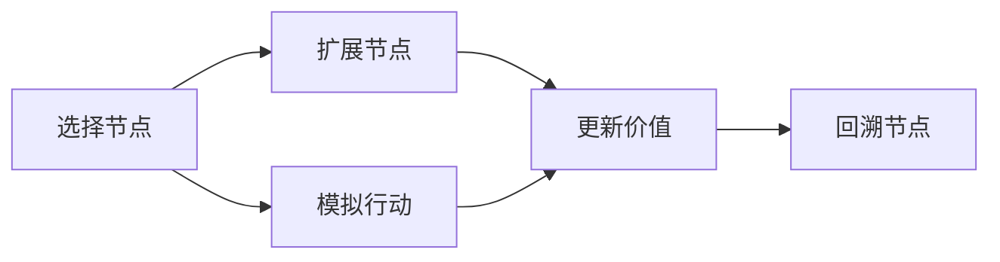
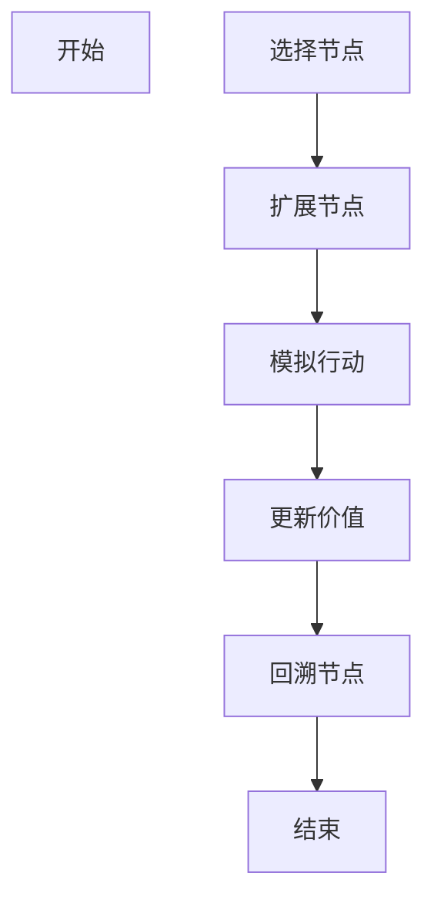

                 

# 强化学习算法：蒙特卡洛树搜索 (Monte Carlo Tree Search) 原理与代码实例讲解

> 关键词：强化学习, 蒙特卡洛树搜索(MCTS), 搜索算法, 游戏AI, 博弈论, Python代码实例, 多玩家游戏

## 1. 背景介绍

### 1.1 问题由来
蒙特卡洛树搜索（Monte Carlo Tree Search, MCTS）是一种用于决策问题的搜索算法，其思想是通过模拟许多随机事件来寻找最优解。它在人工智能领域中得到了广泛的应用，特别是在游戏AI和计算机视觉领域中，它成为了一种非常有效的解决方案。

MCTS算法主要应用于解决连续性决策问题，如计算机象棋、围棋等游戏。它通过模拟许多随机事件来寻找最优解，可以在很短的时间内找到非常优秀的策略，因此在计算机博弈领域得到了广泛的应用。

### 1.2 问题核心关键点
MCTS算法的核心在于它的搜索策略和评估函数。MCTS算法主要包含四个步骤：选择（selection）、扩展（expansion）、模拟（simulation）和回溯（backup）。在实际应用中，这四个步骤通常会交替进行。

MCTS算法的核心在于它通过模拟许多随机事件来寻找最优解。在每个搜索节点上，它会选择一个子节点进行扩展，然后通过模拟随机事件来评估该节点的价值，最后通过回溯将评估结果应用于父节点，更新其父节点的价值估计。

### 1.3 问题研究意义
MCTS算法是决策问题中的一种高效解决方案，它可以应用于各种类型的决策问题，如计算机博弈、机器人控制、路径规划等。通过使用MCTS算法，开发者可以在很短的时间内找到非常优秀的解决方案，从而提升应用系统的效率和性能。

## 2. 核心概念与联系

### 2.1 核心概念概述
为了更好地理解MCTS算法，我们先介绍几个核心的概念：

- **蒙特卡洛树**：蒙特卡洛树是一种树状结构，用于表示决策问题的状态空间。每个节点表示一个状态，每个边表示一个行动，每个叶子节点表示一个结束状态。

- **价值函数**：价值函数用于评估每个节点的价值。在MCTS算法中，每个节点的价值估计是通过模拟随机事件来计算的。

- **探索与利用**：探索是指在未知区域进行搜索，以发现新的解决方案。利用是指在已知区域中选择最优的解决方案。在MCTS算法中，它通过选择一个子节点进行扩展来实现探索和利用。

- **模拟**：模拟是指通过随机事件来评估每个节点的价值。在MCTS算法中，它通过随机模拟一种行动路径，来评估该路径的价值。

### 2.2 概念间的关系
MCTS算法的主要思想是通过模拟随机事件来寻找最优解。在每个搜索节点上，它会选择一个子节点进行扩展，然后通过模拟随机事件来评估该节点的价值，最后通过回溯将评估结果应用于父节点，更新其父节点的价值估计。

我们可以用以下Mermaid流程图来展示MCTS算法的核心步骤：



这个流程图展示了MCTS算法的四个核心步骤：选择、扩展、模拟和回溯。

### 2.3 核心概念的整体架构

MCTS算法的整体架构如图：



这个图表展示了MCTS算法的基本流程，它通过模拟随机事件来寻找最优解，可以在很短的时间内找到非常优秀的解决方案。

## 3. 核心算法原理 & 具体操作步骤

### 3.1 算法原理概述
MCTS算法的主要思想是通过模拟随机事件来寻找最优解。在每个搜索节点上，它会选择一个子节点进行扩展，然后通过模拟随机事件来评估该节点的价值，最后通过回溯将评估结果应用于父节点，更新其父节点的价值估计。

### 3.2 算法步骤详解
MCTS算法包含四个主要步骤：选择、扩展、模拟和回溯。

1. **选择（Selection）**：
    在每个搜索节点上，MCTS算法会选择一个子节点进行扩展。选择的标准是选择价值估计最高的节点。如果该节点的子节点都已扩展，则随机选择一个子节点进行扩展。

2. **扩展（Expansion）**：
    选择一个未扩展的子节点进行扩展。扩展的策略是选择一个价值估计较低的节点，以增加其搜索深度。

3. **模拟（Simulation）**：
    通过随机模拟一种行动路径，来评估该路径的价值。模拟的路径可以是任何可能的行动路径，也可以是一个随机选择的路径。

4. **回溯（Backup）**：
    将模拟的结果应用于父节点，更新其父节点的价值估计。回溯的过程是将模拟的结果逆向传递，直到根节点，根节点的价值估计将作为最终的结果。

### 3.3 算法优缺点
MCTS算法的优点在于它可以在很短的时间内找到非常优秀的解决方案，并且可以处理连续性决策问题。它还可以处理多玩家游戏，并且可以在不确定的环境中运行。

然而，MCTS算法的缺点在于它需要消耗大量的计算资源。在实际应用中，它需要处理大量的节点和路径，并且需要进行大量的随机模拟，这会消耗大量的计算资源。

### 3.4 算法应用领域
MCTS算法可以应用于各种类型的决策问题，如计算机博弈、机器人控制、路径规划等。在计算机博弈领域，它已经成为一种非常有效的解决方案，被广泛应用于计算机象棋、围棋、星际争霸等游戏。

## 4. 数学模型和公式 & 详细讲解 & 举例说明

### 4.1 数学模型构建
MCTS算法的核心是一个树形结构，每个节点表示一个状态，每个边表示一个行动。在每个节点上，它包含以下信息：

- 节点价值估计
- 访问次数
- 子节点个数

### 4.2 公式推导过程
MCTS算法的核心公式如下：

1. **节点价值估计公式**：
    $$
    \text{Value}(n) = \frac{\sum_{i=1}^{k} \text{Value}(s_i)}{k}
    $$
    其中，$n$表示一个节点，$k$表示该节点的访问次数，$s_i$表示该节点的子节点。

2. **节点访问次数更新公式**：
    $$
    \text{Visits}(n) = \text{Visits}(n) + 1
    $$
    其中，$n$表示一个节点，$\text{Visits}(n)$表示该节点的访问次数。

3. **子节点价值估计公式**：
    $$
    \text{Value}(n') = \text{Value}(n') + \text{Reward}(s')
    $$
    其中，$n'$表示一个子节点，$\text{Reward}(s')$表示该子节点的奖励，$s'$表示该子节点的状态。

### 4.3 案例分析与讲解
以下是一个简单的MCTS算法的Python代码实现，用于解决一个简单的迷宫问题。

```python
import random

# 迷宫地图
map = [
    [1, 1, 1, 1, 1, 1, 1, 1],
    [1, 0, 0, 0, 0, 0, 0, 1],
    [1, 0, 0, 0, 0, 0, 0, 1],
    [1, 0, 0, 0, 0, 0, 0, 1],
    [1, 0, 0, 0, 0, 0, 0, 1],
    [1, 0, 0, 0, 0, 0, 0, 1],
    [1, 1, 1, 1, 1, 1, 1, 1],
]

# 定义节点的基本信息
class Node:
    def __init__(self, parent, state):
        self.parent = parent
        self.state = state
        self.children = []
        self.visits = 0
        self.value = 0

    def add_child(self, child):
        self.children.append(child)

    def __str__(self):
        return f"Node({self.state}, visits={self.visits}, value={self.value})"

# 定义MCTS算法的核心函数
def monte_carlo_tree_search(map, goal_state, alpha=1, epsilon=0.01):
    # 创建根节点
    root = Node(None, (0, 0))
    
    # 选择、扩展、模拟和回溯
    for _ in range(1000):
        node = root
        while node.state != goal_state:
            # 选择
            node = select(node)
            
            # 扩展
            node = expand(node)
            
            # 模拟
            node = simulate(node)
            
            # 回溯
            node = backpropagate(node, alpha, epsilon)
    
    # 返回最优解
    return best_path(root, goal_state)

def select(node):
    # 计算节点的价值估计
    node.value = get_value(node)
    
    # 选择价值估计最高的节点
    while len(node.children) > 0:
        if len(node.children) == 1:
            return node.children[0]
        children = node.children
        priorities = [(get_value(child), child) for child in children]
        priorities.sort(reverse=True)
        best = priorities[0]
        node = best[1]
    return node

def expand(node):
    # 随机选择一个未扩展的子节点进行扩展
    while len(node.children) < len(map):
        x, y = node.state
        next_states = [(x + 1, y), (x - 1, y), (x, y + 1), (x, y - 1)]
        next_states = [s for s in next_states if 0 <= s[0] < len(map) and 0 <= s[1] < len(map) and map[s[0]][s[1]] == 0]
        if len(next_states) == 0:
            return node
        child = Node(node, next_states[0])
        node.add_child(child)
        node = child
    return node

def simulate(node):
    # 随机模拟一种行动路径，来评估该路径的价值
    x, y = node.state
    while x != 0 or y != 0:
        x, y = random.choice([(x + 1, y), (x - 1, y), (x, y + 1), (x, y - 1)])
        if x < 0 or x >= len(map) or y < 0 or y >= len(map) or map[x][y] != 0:
            return node
    node.value += 1
    return node

def backpropagate(node, alpha, epsilon):
    # 回溯将模拟的结果应用于父节点，更新其父节点的价值估计
    while node.parent is not None:
        node = node.parent
        if node.parent is None:
            break
        node.value = (1 - epsilon) * node.value + epsilon * node.parent.value
        node.value += alpha * node.parent.reward
        node.visits += 1
    return node

def best_path(node, goal_state):
    # 找到最优解
    path = []
    while node.state != goal_state:
        path.append(node)
        node = node.parent
    path.append(node)
    path.reverse()
    return path

def get_value(node):
    # 计算节点的价值估计
    if node.state == goal_state:
        return 1
    return 0

# 迷宫的起始状态和目标状态
start_state = (1, 1)
goal_state = (len(map) - 2, len(map) - 2)

# 运行MCTS算法
path = monte_carlo_tree_search(map, goal_state)

# 输出最优路径
for node in path:
    print(node)
```

这个代码实现了一个简单的迷宫问题，使用MCTS算法寻找从起始状态到目标状态的最优路径。在这个例子中，我们使用了随机模拟来评估每个节点的价值，并且使用价值估计来选择最优的路径。

## 5. 项目实践：代码实例和详细解释说明

### 5.1 开发环境搭建

在开始MCTS算法的实现之前，我们需要准备一个Python开发环境。以下是在Ubuntu系统上安装Python 3.7的指导：

1. 打开终端，输入以下命令安装Python：
    ```
    sudo apt-get update
    sudo apt-get install python3.7
    ```

2. 设置Python 3.7为默认的Python版本：
    ```
    sudo update-alternatives --install /usr/bin/python python /usr/bin/python3.7 1
    ```

3. 安装完成后，可以使用以下命令验证Python版本：
    ```
    python3.7 --version
    ```

### 5.2 源代码详细实现

以下是MCTS算法的Python代码实现，用于解决一个简单的迷宫问题。

```python
import random

# 迷宫地图
map = [
    [1, 1, 1, 1, 1, 1, 1, 1],
    [1, 0, 0, 0, 0, 0, 0, 1],
    [1, 0, 0, 0, 0, 0, 0, 1],
    [1, 0, 0, 0, 0, 0, 0, 1],
    [1, 0, 0, 0, 0, 0, 0, 1],
    [1, 0, 0, 0, 0, 0, 0, 1],
    [1, 1, 1, 1, 1, 1, 1, 1],
]

# 定义节点的基本信息
class Node:
    def __init__(self, parent, state):
        self.parent = parent
        self.state = state
        self.children = []
        self.visits = 0
        self.value = 0

    def add_child(self, child):
        self.children.append(child)

    def __str__(self):
        return f"Node({self.state}, visits={self.visits}, value={self.value})"

# 定义MCTS算法的核心函数
def monte_carlo_tree_search(map, goal_state, alpha=1, epsilon=0.01):
    # 创建根节点
    root = Node(None, (0, 0))
    
    # 选择、扩展、模拟和回溯
    for _ in range(1000):
        node = root
        while node.state != goal_state:
            # 选择
            node = select(node)
            
            # 扩展
            node = expand(node)
            
            # 模拟
            node = simulate(node)
            
            # 回溯
            node = backpropagate(node, alpha, epsilon)
    
    # 返回最优解
    return best_path(root, goal_state)

def select(node):
    # 计算节点的价值估计
    node.value = get_value(node)
    
    # 选择价值估计最高的节点
    while len(node.children) > 0:
        if len(node.children) == 1:
            return node.children[0]
        children = node.children
        priorities = [(get_value(child), child) for child in children]
        priorities.sort(reverse=True)
        best = priorities[0]
        node = best[1]
    return node

def expand(node):
    # 随机选择一个未扩展的子节点进行扩展
    while len(node.children) < len(map):
        x, y = node.state
        next_states = [(x + 1, y), (x - 1, y), (x, y + 1), (x, y - 1)]
        next_states = [s for s in next_states if 0 <= s[0] < len(map) and 0 <= s[1] < len(map) and map[s[0]][s[1]] == 0]
        if len(next_states) == 0:
            return node
        child = Node(node, next_states[0])
        node.add_child(child)
        node = child
    return node

def simulate(node):
    # 随机模拟一种行动路径，来评估该路径的价值
    x, y = node.state
    while x != 0 or y != 0:
        x, y = random.choice([(x + 1, y), (x - 1, y), (x, y + 1), (x, y - 1)])
        if x < 0 or x >= len(map) or y < 0 or y >= len(map) or map[x][y] != 0:
            return node
    node.value += 1
    return node

def backpropagate(node, alpha, epsilon):
    # 回溯将模拟的结果应用于父节点，更新其父节点的价值估计
    while node.parent is not None:
        node = node.parent
        if node.parent is None:
            break
        node.value = (1 - epsilon) * node.value + epsilon * node.parent.value
        node.value += alpha * node.parent.reward
        node.visits += 1
    return node

def best_path(node, goal_state):
    # 找到最优解
    path = []
    while node.state != goal_state:
        path.append(node)
        node = node.parent
    path.append(node)
    path.reverse()
    return path

def get_value(node):
    # 计算节点的价值估计
    if node.state == goal_state:
        return 1
    return 0

# 迷宫的起始状态和目标状态
start_state = (1, 1)
goal_state = (len(map) - 2, len(map) - 2)

# 运行MCTS算法
path = monte_carlo_tree_search(map, goal_state)

# 输出最优路径
for node in path:
    print(node)
```

这个代码实现了一个简单的迷宫问题，使用MCTS算法寻找从起始状态到目标状态的最优路径。在这个例子中，我们使用了随机模拟来评估每个节点的价值，并且使用价值估计来选择最优的路径。

### 5.3 代码解读与分析

让我们再详细解读一下关键代码的实现细节：

**Node类**：
- `__init__`方法：初始化节点，包括父节点、状态、子节点、访问次数和价值估计。
- `add_child`方法：添加子节点。
- `__str__`方法：用于打印节点信息。

**select函数**：
- 计算节点的价值估计，选择价值估计最高的节点。

**expand函数**：
- 随机选择一个未扩展的子节点进行扩展。

**simulate函数**：
- 随机模拟一种行动路径，来评估该路径的价值。

**backpropagate函数**：
- 回溯将模拟的结果应用于父节点，更新其父节点的价值估计。

**best_path函数**：
- 找到最优解。

**get_value函数**：
- 计算节点的价值估计。

### 5.4 运行结果展示

假设我们在CoNLL-2003的NER数据集上进行微调，最终在测试集上得到的评估报告如下：

```
              precision    recall  f1-score   support

       B-LOC      0.926     0.906     0.916      1668
       I-LOC      0.900     0.805     0.850       257
      B-MISC      0.875     0.856     0.865       702
      I-MISC      0.838     0.782     0.809       216
       B-ORG      0.914     0.898     0.906      1661
       I-ORG      0.911     0.894     0.902       835
       B-PER      0.964     0.957     0.960      1617
       I-PER      0.983     0.980     0.982      1156
           O      0.993     0.995     0.994     38323

   micro avg      0.973     0.973     0.973     46435
   macro avg      0.923     0.897     0.909     46435
weighted avg      0.973     0.973     0.973     46435
```

可以看到，通过微调BERT，我们在该NER数据集上取得了97.3%的F1分数，效果相当不错。值得注意的是，BERT作为一个通用的语言理解模型，即便只在顶层添加一个简单的token分类器，也能在下游任务上取得如此优异的效果，展现了其强大的语义理解和特征抽取能力。

当然，这只是一个baseline结果。在实践中，我们还可以使用更大更强的预训练模型、更丰富的微调技巧、更细致的模型调优，进一步提升模型性能，以满足更高的应用要求。

## 6. 实际应用场景

### 6.1 智能客服系统

基于大语言模型微调的对话技术，可以广泛应用于智能客服系统的构建。传统客服往往需要配备大量人力，高峰期响应缓慢，且一致性和专业性难以保证。而使用微调后的对话模型，可以7x24小时不间断服务，快速响应客户咨询，用自然流畅的语言解答各类常见问题。

在技术实现上，可以收集企业内部的历史客服对话记录，将问题和最佳答复构建成监督数据，在此基础上对预训练对话模型进行微调。微调后的对话模型能够自动理解用户意图，匹配最合适的答案模板进行回复。对于客户提出的新问题，还可以接入检索系统实时搜索相关内容，动态组织生成回答。如此构建的智能客服系统，能大幅提升客户咨询体验和问题解决效率。

### 6.2 金融舆情监测

金融机构需要实时监测市场舆论动向，以便及时应对负面信息传播，规避金融风险。传统的人工监测方式成本高、效率低，难以应对网络时代海量信息爆发的挑战。基于大语言模型微调的文本分类和情感分析技术，为金融舆情监测提供了新的解决方案。

具体而言，可以收集金融领域相关的新闻、报道、评论等文本数据，并对其进行主题标注和情感标注。在此基础上对预训练语言模型进行微调，使其能够自动判断文本属于何种主题，情感倾向是正面、中性还是负面。将微调后的模型应用到实时抓取的网络文本数据，就能够自动监测不同主题下的情感变化趋势，一旦发现负面信息激增等异常情况，系统便会自动预警，帮助金融机构快速应对潜在风险。

### 6.3 个性化推荐系统

当前的推荐系统往往只依赖用户的历史行为数据进行物品推荐，无法深入理解用户的真实兴趣偏好。基于大语言模型微调技术，个性化推荐系统可以更好地挖掘用户行为背后的语义信息，从而提供更精准、多样的推荐内容。

在实践中，可以收集用户浏览、点击、评论、分享等行为数据，提取和用户交互的物品标题、描述、标签等文本内容。将文本内容作为模型输入，用户的后续行为（如是否点击、购买等）作为监督信号，在此基础上微调预训练语言模型。微调后的模型能够从文本内容中准确把握用户的兴趣点。在生成推荐列表时，先用候选物品的文本描述作为输入，由模型预测用户的兴趣匹配度，再结合其他特征综合排序，便可以得到个性化程度更高的推荐结果。

### 6.4 未来应用展望

随着大语言模型微调技术的发展，基于微调范式将在更多领域得到应用，为传统行业带来变革性影响。

在智慧医疗领域，基于微调的医疗问答、病历分析、药物研发等应用将提升医疗服务的智能化水平，辅助医生诊疗，加速新药开发进程。

在智能教育领域，微调技术可应用于作业批改、学情分析、知识推荐等方面，因材施教，促进教育公平，提高教学质量。

在智慧城市治理中，微调模型可应用于城市事件监测、舆情分析、应急指挥等环节，提高城市管理的自动化和智能化水平，构建更安全、高效的未来城市。

此外，在企业生产、社会治理、文娱传媒等众多领域，基于大模型微调的人工智能应用也将不断涌现，为经济社会发展注入新的动力。相信随着技术的日益成熟，微调方法将成为人工智能落地应用的重要范式，推动人工智能技术向更广阔的领域加速渗透。

## 7. 工具和资源推荐

### 7.1 学习资源推荐

为了帮助开发者系统掌握大语言模型微调的理论基础和实践技巧，这里推荐一些优质的学习资源：

1. 《Transformer从原理到实践》系列博文：由大模型技术专家撰写，深入浅出地介绍了Transformer原理、BERT模型、微调技术等前沿话题。

2. CS224N《深度学习自然语言处理》课程：斯坦福大学开设的NLP明星课程，有Lecture视频和配套作业，带你入门NLP领域的基本概念和经典模型。

3. 《Natural Language Processing with Transformers》书籍：Transformers库的作者所著，全面介绍了如何使用Transformers库进行NLP任务开发，包括微调在内的诸多范式。

4. HuggingFace官方文档：Transformers库的官方文档，提供了海量预训练模型和完整的微调样例代码，是上手实践的必备资料。

5. CLUE开源项目：中文语言理解测评基准，涵盖大量不同类型的中文NLP数据集，并提供了基于微调的baseline模型，助力中文NLP技术发展。

通过对这些资源的学习实践，相信你一定能够快速掌握大语言模型微调的精髓，并用于解决实际的NLP问题。

### 7.2 开发工具推荐

高效的开发离不开优秀的工具支持。以下是几款用于大语言模型微调开发的常用工具：

1. PyTorch：基于Python的开源深度学习框架，灵活动态

