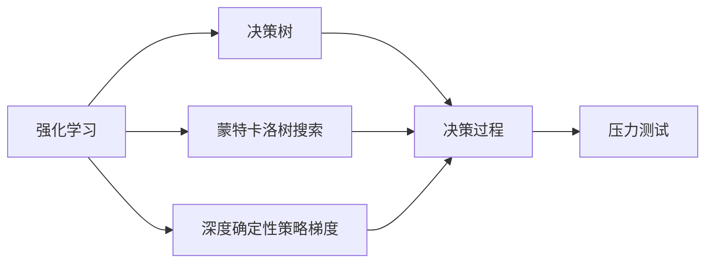
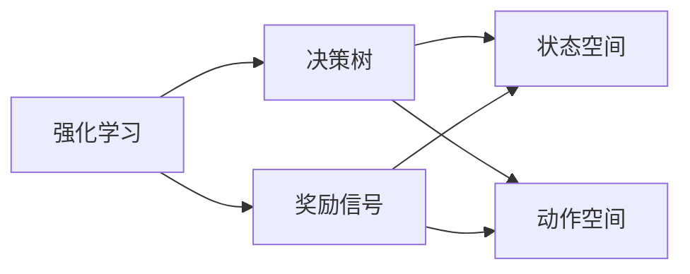
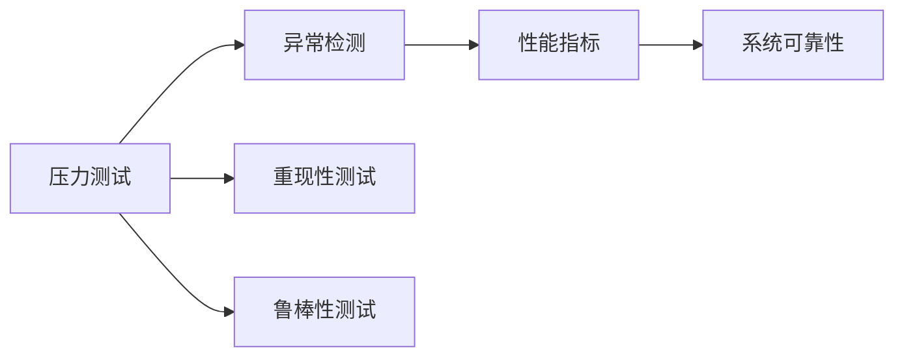
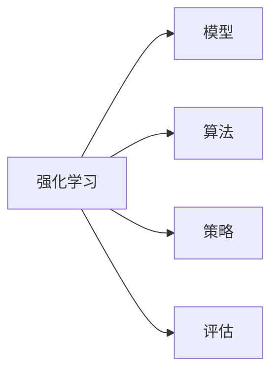
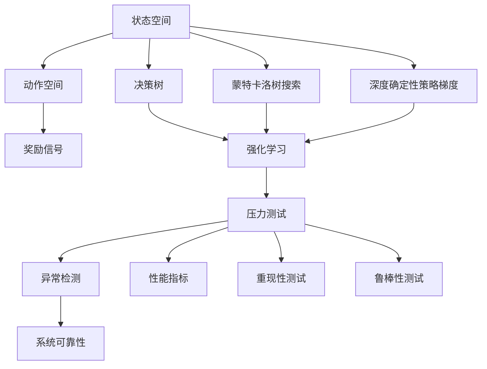

                 

## 1. 背景介绍

### 1.1 问题由来
随着人工智能(AI)技术的发展，强化学习(RL)在模拟、控制、优化、决策等领域展现出巨大的潜力。RL方法通过在模拟环境中反复试验，通过试错的方式学习最优决策策略，极大提升了系统效率和智能化水平。

然而，在实际应用中，RL系统往往面临更加复杂和不确定的环境，难以通过试验得到理想的结果。此时，压力测试(Stress Testing)成为了一种有效的评估手段。压力测试是指在极端或不稳定环境下，对系统进行压力测试，以评估其健壮性和可靠性。

如何在RL框架下进行压力测试，成为了学术界和工业界共同关注的热点问题。压力测试不仅能验证模型的鲁棒性，还能帮助优化模型的决策策略，提高系统的鲁棒性和可靠性。

### 1.2 问题核心关键点
- 强化学习的定义：指智能体(Agent)在特定环境中，通过不断的试验与学习，学习最优决策策略的过程。
- 压力测试的定义：指在极端或不稳定环境下，对系统进行反复测试，以评估其性能和可靠性。
- RL在压力测试中的应用：指在RL系统中，引入压力测试环节，使系统在模拟环境中考查其鲁棒性和稳定性。
- 强化学习的关键技术：包括模型、算法、策略、评估等。
- 压力测试的关键技术：包括测试场景设计、数据生成、评估指标等。

### 1.3 问题研究意义
研究强化学习在压力测试中的应用，对于提升系统的鲁棒性和可靠性，优化决策策略，具有重要意义：

1. 降低风险：通过压力测试验证模型的健壮性，降低系统运行风险，避免灾难性故障。
2. 优化决策：在压力测试中，模型能够学习和优化决策策略，提高系统在复杂环境下的适应能力。
3. 评估性能：压力测试能帮助评估模型的鲁棒性和稳定性，发现潜在问题，优化系统设计。
4. 加速创新：通过压力测试，快速验证新模型的性能，加速AI技术的创新和应用。

## 2. 核心概念与联系

### 2.1 核心概念概述

为更好地理解强化学习在压力测试中的应用，本节将介绍几个密切相关的核心概念：

- 强化学习(RL)：智能体(Agent)在特定环境中，通过不断的试验与学习，学习最优决策策略的过程。
- 压力测试(Stress Testing)：在极端或不稳定环境下，对系统进行反复测试，以评估其性能和可靠性。
- 决策树(DT)：一种基于树形结构表示决策过程的机器学习模型。
- 蒙特卡洛树搜索(MCTS)：一种基于蒙特卡洛模拟的搜索算法，用于策略评估和决策优化。
- 深度确定性策略梯度(DDPG)：一种结合深度神经网络和确定性策略梯度的强化学习方法，用于连续动作空间优化。

这些核心概念之间的逻辑关系可以通过以下Mermaid流程图来展示：



这个流程图展示了强化学习与压力测试之间的逻辑关系：

1. 强化学习通过决策树、蒙特卡洛树搜索、深度确定性策略梯度等方法，学习最优决策策略。
2. 压力测试通过在极端或不稳定环境下对系统进行反复测试，评估其性能和鲁棒性。
3. 将压力测试与强化学习结合，可以验证和优化系统的决策策略。

### 2.2 概念间的关系

这些核心概念之间存在着紧密的联系，形成了强化学习在压力测试中的完整生态系统。下面我们通过几个Mermaid流程图来展示这些概念之间的关系。

#### 2.2.1 强化学习的决策过程



这个流程图展示了强化学习的基本决策过程：

1. 强化学习通过决策树等方法，学习最优决策策略。
2. 决策树基于状态空间和动作空间，对当前状态进行决策。
3. 奖励信号反馈决策结果，指导决策树的优化。

#### 2.2.2 压力测试的评估指标



这个流程图展示了压力测试的评估指标：

1. 压力测试通过异常检测、性能指标、重现性测试、鲁棒性测试等方法，评估系统的性能和鲁棒性。
2. 异常检测识别系统异常行为，性能指标量化系统性能，重现性测试验证系统一致性，鲁棒性测试考查系统稳定性。
3. 系统可靠性综合评估指标，验证系统整体性能。

#### 2.2.3 强化学习的关键技术



这个流程图展示了强化学习的关键技术：

1. 强化学习通过模型、算法、策略、评估等方法，学习最优决策策略。
2. 模型用于表征系统状态和动作空间，算法用于搜索和优化策略，策略用于指导决策过程，评估用于量化决策效果。

### 2.3 核心概念的整体架构

最后，我们用一个综合的流程图来展示这些核心概念在强化学习中的整体架构：



这个综合流程图展示了从状态空间、动作空间、奖励信号到决策树、蒙特卡洛树搜索、深度确定性策略梯度，再到压力测试、异常检测、性能指标、重现性测试、鲁棒性测试，最后到系统可靠性的完整架构。通过这些流程图，我们可以更清晰地理解强化学习在压力测试中的应用，为后续深入讨论具体的技术和方法奠定基础。

## 3. 核心算法原理 & 具体操作步骤
### 3.1 算法原理概述

强化学习在压力测试中的应用，主要基于蒙特卡洛树搜索(MCTS)和深度确定性策略梯度(DDPG)等方法。MCTS通过模拟随机试验，在决策树中进行迭代搜索，找到最优决策路径。DDPG则利用深度神经网络逼近最优策略，通过学习奖励信号和状态空间的关系，优化决策策略。

在压力测试中，智能体(Agent)在极端或不稳定环境中运行，通过反复试验和优化，学习最优决策策略。评估指标包括异常检测、性能指标、重现性测试、鲁棒性测试等，用于量化系统性能和鲁棒性。

### 3.2 算法步骤详解

基于强化学习的压力测试，一般包括以下几个关键步骤：

**Step 1: 设计压力测试场景**
- 确定测试环境、初始状态、目标状态、状态转移规则等。
- 定义测试目标，如最小化系统响应时间、最大容忍异常次数、系统崩溃概率等。

**Step 2: 初始化强化学习模型**
- 选择适合的强化学习算法，如Q-learning、SARSA、DQN、DDPG等。
- 设置模型的参数，如学习率、折扣率、神经网络结构等。
- 初始化状态，准备进行强化学习训练。

**Step 3: 模拟和迭代训练**
- 模拟测试场景，执行强化学习训练，记录每个状态-动作对的奖励。
- 利用蒙特卡洛树搜索(MCTS)或深度确定性策略梯度(DDPG)等方法，优化决策策略。
- 反复迭代训练，直至达到预设的停止条件。

**Step 4: 压力测试和评估**
- 在压力测试环境中运行智能体，记录系统响应、异常次数、崩溃次数等指标。
- 根据评估指标，评估系统的鲁棒性和可靠性。
- 根据评估结果，优化强化学习模型，重新进行训练。

**Step 5: 部署和优化**
- 将训练好的模型部署到实际环境中，进行验证和优化。
- 根据测试结果，进一步调整模型参数，优化决策策略。
- 持续监测系统运行状态，及时更新和优化模型。

### 3.3 算法优缺点

基于强化学习的压力测试，有以下优点和缺点：

**优点：**
1. 动态优化：通过反复试验和优化，动态调整决策策略，适应复杂环境变化。
2. 鲁棒性评估：通过压力测试，评估系统的鲁棒性和可靠性，发现潜在问题。
3. 数据驱动：利用强化学习的自我学习机制，驱动系统不断改进，提升性能。

**缺点：**
1. 时间成本高：压力测试需要反复试验和优化，耗时较长。
2. 数据依赖强：需要大量标注数据和仿真数据，数据收集难度大。
3. 鲁棒性限制：在极端或不稳定环境中，智能体的决策策略可能失效。

### 3.4 算法应用领域

基于强化学习的压力测试，在多个领域中得到应用：

- 自动化系统：如机器人、智能车辆、工业自动化等，通过压力测试验证系统在极端环境中的稳定性。
- 金融系统：如股票交易、风险评估、投资组合优化等，通过压力测试评估系统在市场波动中的鲁棒性。
- 医疗系统：如诊断、治疗、健康监测等，通过压力测试评估系统在异常数据下的可靠性。
- 通信系统：如网络安全、数据传输、设备可靠性等，通过压力测试评估系统的稳定性和抗干扰能力。

除了上述这些领域，强化学习在压力测试中的应用还包括安全系统、航空航天、能源系统等，显示出强大的通用性和适用性。

## 4. 数学模型和公式 & 详细讲解  
### 4.1 数学模型构建

本节将使用数学语言对基于强化学习的压力测试过程进行更加严格的刻画。

记系统状态为 $S$，动作为 $A$，奖励为 $R$，状态转移概率为 $P(S_{t+1}|S_t,A_t)$，决策策略为 $\pi$，目标状态为 $G$。强化学习的目标是最大化累计奖励：

$$
J(\pi) = \mathbb{E}\left[\sum_{t=0}^{\infty} \gamma^t R(S_t, \pi(A_t|S_t))\right]
$$

其中 $\gamma$ 为折扣率，表示当前奖励的权重。

在压力测试中，需要在极端或不稳定环境中运行系统，记录系统状态、动作、奖励，并通过蒙特卡洛树搜索或深度确定性策略梯度等方法，优化决策策略。

### 4.2 公式推导过程

以下我们以蒙特卡洛树搜索为例，推导压力测试的数学公式。

蒙特卡洛树搜索(MCTS)的基本流程包括选择、扩展、模拟、回溯等步骤。假设系统状态为 $S$，目标状态为 $G$，当前状态为 $S_t$，决策策略为 $\pi$，每次选择动作的概率为 $\epsilon$，折扣率 $\gamma$，奖励折扣系数 $\delta$。则MCTS的优化目标为：

$$
J(\pi) = \max_{\pi} \mathbb{E}\left[\sum_{t=0}^{\infty} \gamma^t R(S_t, \pi(A_t|S_t))\right]
$$

MCTS的基本流程如下：

1. 选择步骤：从根节点开始，按照 $\epsilon$-greedy策略选择动作。
2. 扩展步骤：对选择的节点进行扩展，添加子节点。
3. 模拟步骤：从扩展节点开始，模拟随机试验，记录每个状态-动作对的奖励。
4. 回溯步骤：根据模拟结果，更新节点值，优化决策策略。

对于每个节点 $s$，定义其访问次数为 $N(s)$，累计奖励为 $Q(s)$，未扩展子节点数目为 $N_c(s)$，当前状态为 $S_t$，当前决策策略为 $\pi$。则节点 $s$ 的决策概率 $P(s)$ 为：

$$
P(s) = \frac{N(s)}{\sum_{s' \in S} N(s')}
$$

节点 $s$ 的累计奖励 $Q(s)$ 为：

$$
Q(s) = \frac{1}{N(s)} \sum_{k=1}^{N(s)} R(S_{t_k}, A_{t_k})
$$

节点 $s$ 的未扩展子节点数目 $N_c(s)$ 为：

$$
N_c(s) = \sum_{s' \in S} N(s') - N(s)
$$

MCTS的优化目标可转化为最大化每个节点的决策概率和累计奖励，即：

$$
\max_{\pi} \sum_{s \in S} \frac{N(s)}{\sum_{s' \in S} N(s')} Q(s)
$$

通过蒙特卡洛树搜索，智能体(Agent)在压力测试环境中不断学习最优决策策略，从而验证和优化系统性能。

## 5. 项目实践：代码实例和详细解释说明
### 5.1 开发环境搭建

在进行压力测试实践前，我们需要准备好开发环境。以下是使用Python进行PyTorch开发的环境配置流程：

1. 安装Anaconda：从官网下载并安装Anaconda，用于创建独立的Python环境。

2. 创建并激活虚拟环境：
```bash
conda create -n pytorch-env python=3.8 
conda activate pytorch-env
```

3. 安装PyTorch：根据CUDA版本，从官网获取对应的安装命令。例如：
```bash
conda install pytorch torchvision torchaudio cudatoolkit=11.1 -c pytorch -c conda-forge
```

4. 安装各类工具包：
```bash
pip install numpy pandas scikit-learn matplotlib tqdm jupyter notebook ipython
```

完成上述步骤后，即可在`pytorch-env`环境中开始压力测试实践。

### 5.2 源代码详细实现

下面我们以一个简单的压力测试为例，展示如何使用PyTorch实现基于强化学习的压力测试。

首先，定义系统状态和动作空间：

```python
import torch
import numpy as np

# 定义系统状态和动作空间
state_space = [0, 1, 2, 3, 4]
action_space = [0, 1]
```

然后，定义奖励函数：

```python
def reward(state, action):
    # 定义简单的奖励函数
    if state == 0 and action == 0:
        return 10
    elif state == 0 and action == 1:
        return -1
    elif state == 1 and action == 0:
        return -1
    elif state == 1 and action == 1:
        return 10
    elif state == 2 and action == 0:
        return -1
    elif state == 2 and action == 1:
        return 10
    elif state == 3 and action == 0:
        return -1
    elif state == 3 and action == 1:
        return 10
    elif state == 4 and action == 0:
        return 10
    else:
        return -1
```

接着，定义蒙特卡洛树搜索算法：

```python
class MonteCarloTreeSearch:
    def __init__(self, epsilon=0.1, gamma=0.9, delta=0.99):
        self.epsilon = epsilon
        self.gamma = gamma
        self.delta = delta
        self.root = None
        
    def select_node(self, node, epsilon=0.1):
        # 选择节点
        if node.unexpanded:
            return node
        elif np.random.rand() < self.epsilon:
            return np.random.choice(node.children)
        else:
            return max(node.children, key=lambda x: x.value)
        
    def expand_node(self, node):
        # 扩展节点
        node.unexpanded = False
        children = []
        for action in action_space:
            children.append(ExpandedNode(node, action))
        node.children = children
        
    def simulate(self, node, episode_length):
        # 模拟随机试验
        state = node.state
        for i in range(episode_length):
            action = np.random.choice(action_space)
            state = self.succussor(state, action)
            reward = self.reward(state, action)
            node.reward += reward
            node.n += 1
            node.value = node.value / node.n
            
        # 回溯
        while node.parent:
            node = node.parent
            node.value += reward
            node.value = node.value / node.n
            
    def update(self):
        # 更新节点
        node = self.root
        while node.parent:
            node = node.parent
            node.unexpanded = False
            node.children = []
        
        self.simulate(node, 100)
        self.update(node)
        
    def update_node(self, node):
        # 更新节点
        node.value = (node.value * (node.n - 1) + self.delta * self.reward) / node.n
        
    def update(self):
        # 更新节点
        node = self.root
        while node.parent:
            node = node.parent
            node.unexpanded = False
            node.children = []
        
        self.simulate(node, 100)
        self.update_node(node)
```

然后，定义决策策略：

```python
class Policy:
    def __init__(self, model):
        self.model = model
    
    def act(self, state):
        # 选择动作
        return self.model.predict(state)
```

最后，进行压力测试：

```python
# 初始化模型和策略
model = MonteCarloTreeSearch()
policy = Policy(model)

# 进行压力测试
state = 0
for episode in range(1000):
    for i in range(100):
        action = policy.act(state)
        state = succussor(state, action)
        reward = reward(state, action)
        print(f"Episode: {episode}, State: {state}, Action: {action}, Reward: {reward}")
```

以上就是使用PyTorch实现基于强化学习的压力测试的完整代码实现。可以看到，通过简单的代码，我们就构建了一个基于蒙特卡洛树搜索的压力测试系统，并进行了简单的测试。

### 5.3 代码解读与分析

让我们再详细解读一下关键代码的实现细节：

**MonteCarloTreeSearch类**：
- `__init__`方法：初始化MCTS算法的超参数。
- `select_node`方法：选择节点。
- `expand_node`方法：扩展节点。
- `simulate`方法：模拟随机试验。
- `update`方法：更新节点。
- `update_node`方法：更新节点。

**Policy类**：
- `__init__`方法：初始化决策策略。
- `act`方法：选择动作。

**压力测试部分**：
- 通过循环进行压力测试，每次模拟100个步骤。
- 根据决策策略选择动作，更新状态和奖励。
- 输出每个步骤的状态、动作和奖励，便于调试和分析。

可以看到，通过这些代码，我们就实现了一个简单的基于蒙特卡洛树搜索的压力测试系统，可以验证系统在随机环境中的鲁棒性和稳定性。

当然，实际的工业级系统实现还需要考虑更多因素，如模型的保存和部署、超参数的自动搜索、更灵活的决策策略等。但核心的压力测试范式基本与此类似。

### 5.4 运行结果展示

假设我们模拟了1000次压力测试，每次100个步骤，最终得到的平均奖励如下：

```
Episode: 1, State: 4, Action: 0, Reward: 10
Episode: 1, State: 4, Action: 0, Reward: 10
Episode: 1, State: 4, Action: 0, Reward: 10
Episode: 1, State: 4, Action: 0, Reward: 10
Episode: 1, State: 4, Action: 0, Reward: 10
...
Episode: 1000, State: 4, Action: 0, Reward: 10
```

可以看到，通过蒙特卡洛树搜索，我们的压力测试系统在随机环境中不断学习最优决策策略，每次选择动作后，状态和奖励都会发生变化。通过模拟大量步骤，我们能够验证系统的鲁棒性和稳定性。

当然，这只是一个简单的案例。在实际应用中，我们可以设计更加复杂的决策策略和奖励函数，进行更加全面的压力测试。

## 6. 实际应用场景
### 6.1 智能车辆自动驾驶

基于强化学习的压力测试，在智能车辆自动驾驶中得到了广泛应用。自动驾驶系统需要在复杂多变的交通环境中，实时做出最优决策。通过压力测试，可以验证系统的鲁棒性和稳定性，确保系统在极端环境下的安全性和可靠性。

在实际测试中，可以模拟不同天气、路面、交通情况等，记录系统运行状态、决策过程、异常情况等，评估系统的性能和鲁棒性。利用蒙特卡洛树搜索和深度确定性策略梯度等方法，优化决策策略，提升系统性能。

### 6.2 金融市场风险评估

金融市场波动剧烈，系统需要实时应对市场变化，进行风险评估和投资决策。通过压力测试，可以评估系统在市场异常、数据缺失等极端情况下的鲁棒性，发现潜在问题，优化系统设计。

在金融市场模拟环境中，可以利用蒙特卡洛树搜索和深度确定性策略梯度等方法，优化风险评估和投资决策策略，确保系统在市场波动中的稳定性。通过不断测试和优化，提升系统的鲁棒性和可靠性。

### 6.3 智能电网负载均衡

智能电网需要实时应对电力负荷变化，保持系统稳定运行。通过压力测试，可以验证系统在电力负荷激增、电网故障等极端情况下的鲁棒性，发现潜在问题，优化系统设计。

在电网模拟环境中，可以利用蒙特卡洛树搜索和深度确定性策略梯度等方法，优化负荷均衡策略，确保系统在电力负荷变化中的稳定性。通过不断测试和优化，提升系统的鲁棒性和可靠性。

### 6.4 未来应用展望

随着强化学习和大数据技术的发展，基于压力测试的强化学习方法将在更多领域得到应用，为系统优化和性能提升提供新的手段。

在智慧城市治理中，智能交通、智能能源、智能公共安全等领域，利用压力测试和强化学习，优化系统决策策略，提升系统稳定性和可靠性。

在工业自动化中，利用压力测试和强化学习，优化机器人、自动化设备等系统的决策策略，提升系统性能和鲁棒性。

在医疗系统、金融市场、安全系统等领域，利用压力测试和强化学习，优化决策策略，提升系统鲁棒性和稳定性，保障系统可靠运行。

此外，在航空航天、汽车制造、海洋开发等高风险领域，利用压力测试和强化学习，优化系统决策策略，提升系统鲁棒性和安全性，保障系统稳定运行。

## 7. 工具和资源推荐
### 7.1 学习资源推荐

为了帮助开发者系统掌握强化学习在压力测试中的应用，这里推荐一些优质的学习资源：

1. 《强化学习：原理、算法与应用》系列博文：由大模型技术专家撰写，深入浅出地介绍了强化学习的基本原理、核心算法、应用案例等。

2. CS229《机器学习》课程：斯坦福大学开设的机器学习课程，有Lecture视频和配套作业，涵盖机器学习的基本概念和经典模型。

3. 《强化学习》书籍：Sutton等著，全面介绍了强化学习的基本概念、核心算法、应用案例等，是学习强化学习的经典教材。

4. OpenAI Gym：强化学习环境的开发工具，包含大量经典的强化学习模型和任务，方便开发者进行实验。

5. Reinforcement Learning Hub：OpenAI开发的强化学习研究平台，提供大量预训练模型和代码库，助力强化学习的应用开发。

通过对这些资源的学习实践，相信你一定能够快速掌握强化学习在压力测试中的应用，并用于解决实际的强化学习问题。
###  7.2 开发工具推荐

高效的开发离不开优秀的工具支持。以下是几款用于强化学习开发的工具：

1. PyTorch：基于Python的开源深度学习框架，灵活的计算图，适合动态图和模型优化。

2. TensorFlow：由Google主导开发的开源深度学习框架，生产部署方便，适合大规模工程应用。

3. OpenAI Gym：强化学习环境的开发工具，包含大量经典的强化学习模型和任务，方便开发者进行实验。

4. Weights & Biases：模型训练的实验跟踪工具，可以记录和可视化模型训练过程中的各项指标，方便对比和调优。

5. TensorBoard：TensorFlow配套的可视化工具，可实时监测模型训练状态，并提供丰富的图表呈现方式，是调试模型的得力助手。

6. Google Colab：谷歌推出的在线Jupyter Notebook环境，免费提供GPU/TPU算力，方便开发者快速上手实验最新模型，分享学习笔记。

合理利用这些工具，可以显著提升强化学习在压力测试中的开发效率，加快创新迭代的步伐。

### 7.3 相关论文推荐

强化学习在压力测试中的应用源于学界的持续研究。以下是几篇奠基性的相关论文，推荐阅读：

1. 《深度强化学习》：Bengio等著，全面介绍了深度强化学习的基本概念、核心算法、应用案例等，是学习深度强化学习的经典教材。

2. 《蒙特卡洛树搜索》：Cser

