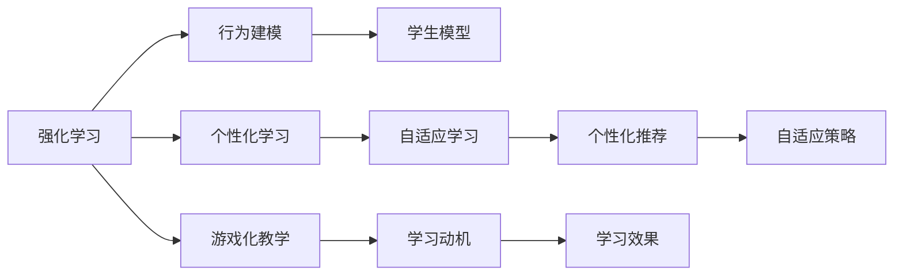
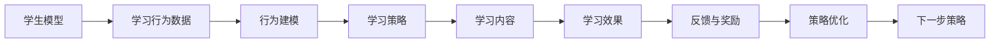
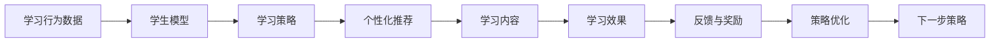
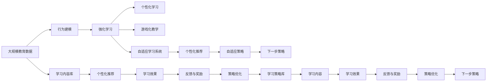

                 

# 强化学习：在教育领域中的应用

> 关键词：强化学习,教育,行为建模,个性化学习,游戏化,自适应学习系统

## 1. 背景介绍

### 1.1 问题由来
近年来，随着人工智能技术的快速发展，强化学习（Reinforcement Learning, RL）在教育领域的应用引起了广泛关注。传统教育模式往往采用以知识传授为中心的教学方法，无法充分考虑到学生的个体差异和动态变化的需求。强化学习通过模拟游戏环境，利用智能算法自适应地调整教学策略，实现个性化、互动化、高效化的学习体验。

强化学习的教育应用不仅有助于提升学生的学习效果，还能有效激发学生的学习兴趣，促进其自主学习能力的提升。这与现代教育理念中的"以学生为中心"相契合，为传统教育模式注入了新的活力。

### 1.2 问题核心关键点
强化学习在教育领域的应用核心在于以下几个方面：

1. **行为建模**：通过建模学生的学习行为，强化学习可以自动生成个性化的教学策略，实时调整教学内容和方法。
2. **个性化学习**：强化学习能够根据学生的反馈和表现，动态调整学习路径，实现适应性学习，最大化学生的学习效率。
3. **游戏化教学**：利用强化学习的反馈机制和奖励机制，将学习过程转化为有趣的游戏形式，提高学生的参与度和积极性。
4. **自适应学习系统**：通过强化学习算法，构建自适应学习系统，实现对学生行为和表现的实时监控和调整，提升学习效果。

强化学习的这些特性，使其成为教育领域智能化转型的重要手段。

### 1.3 问题研究意义
强化学习在教育领域的研究和应用具有重要意义：

1. **提升学习效果**：通过自适应学习，强化学习能根据学生的实际情况定制个性化的学习计划，提高学习效率。
2. **激发学习兴趣**：游戏化教学方法能够使学习过程更加生动有趣，提高学生的学习动力和参与度。
3. **减少教师负担**：强化学习能够自动调整教学策略，减少教师在个性化教学中的工作量。
4. **实现资源优化**：通过智能推荐，强化学习能够优化教学资源的配置，提升教学资源的利用率。
5. **促进教育公平**：个性化学习和自适应系统能够帮助弱势群体获得更好的教育机会，实现教育公平。

## 2. 核心概念与联系

### 2.1 核心概念概述

为更好地理解强化学习在教育领域的应用，本节将介绍几个密切相关的核心概念：

- **强化学习**：通过智能体在环境中与环境交互，利用奖励信号指导智能体行为，逐步优化策略的机器学习范式。强化学习的核心在于构建一个奖励函数，指导智能体选择最优行为。

- **行为建模**：通过数学模型描述学生的学习行为，如注意力分配、认知负荷、知识掌握程度等，为强化学习提供输入。

- **个性化学习**：利用强化学习算法，根据学生的学习行为和表现，动态调整学习内容和方式，实现适应性学习。

- **游戏化教学**：将学习过程设计为游戏形式，通过设置奖励和惩罚机制，激励学生主动学习。

- **自适应学习系统**：通过强化学习算法构建的学习系统，能够实时监控和调整学生的学习状态，提供个性化的学习指导。

这些核心概念之间的逻辑关系可以通过以下Mermaid流程图来展示：



这个流程图展示了几大核心概念之间的关系：

1. 强化学习通过行为建模提供输入，优化学习策略。
2. 个性化学习根据学生模型，实时调整学习内容。
3. 游戏化教学利用反馈机制和奖励机制，提高学习动机。
4. 自适应学习系统实时监控和调整学生的学习状态，提供个性化指导。

### 2.2 概念间的关系

这些核心概念之间存在着紧密的联系，形成了强化学习在教育领域的应用生态系统。下面我通过几个Mermaid流程图来展示这些概念之间的关系。

#### 2.2.1 强化学习的教育应用流程



这个流程图展示了强化学习在教育领域的一般应用流程：

1. 收集学生的学习行为数据，进行行为建模。
2. 基于行为模型，生成个性化的学习策略。
3. 根据学习策略，选择并推送学习内容。
4. 根据学习效果和反馈，调整学习策略，实现自适应学习。

#### 2.2.2 自适应学习系统的组成



这个流程图展示了自适应学习系统的关键组成部分：

1. 收集学生的学习行为数据，构建学生模型。
2. 基于学生模型，生成个性化推荐。
3. 推送个性化学习内容，进行学习活动。
4. 实时监控学习效果，调整策略，实现自适应学习。

### 2.3 核心概念的整体架构

最后，我们用一个综合的流程图来展示这些核心概念在大语言模型微调过程中的整体架构：



这个综合流程图展示了从教育数据到自适应学习系统的完整过程。大规模教育数据经过行为建模和强化学习后，生成个性化学习策略和推荐。自适应学习系统根据策略进行个性化推荐，实时监控学习效果，调整策略，实现自适应学习。

## 3. 核心算法原理 & 具体操作步骤
### 3.1 算法原理概述

强化学习在教育领域的应用主要基于行为建模和策略优化两个核心环节。具体来说，强化学习的目标是构建一个奖励函数，指导智能体（即学习系统）在环境中选择最优行为。在教育场景中，奖励函数可以定义为学生的学习效果或学习动机。通过不断调整策略，强化学习可以逐步优化教学效果，实现个性化和高效化的学习体验。

### 3.2 算法步骤详解

强化学习在教育领域的应用一般包括以下几个关键步骤：

**Step 1: 准备教育数据和学生模型**

- 收集学生的学习行为数据，如注意力分配、答题时间、错误率等。
- 根据数据构建学生模型，描述学生的认知负荷、知识掌握程度等特征。

**Step 2: 定义奖励函数**

- 根据学习目标和评估指标，设计奖励函数。奖励函数可以是学生的学习效果（如成绩、掌握程度），也可以是学习动机（如参与度、积极度）。
- 设定奖励函数的参数，如奖励系数、惩罚系数等，以反映不同行为的重要性和影响。

**Step 3: 构建强化学习模型**

- 选择适当的强化学习算法，如Q-Learning、SARSA、深度强化学习等。
- 设计智能体的状态空间、动作空间和策略。
- 根据学生模型和奖励函数，训练强化学习模型，生成个性化学习策略。

**Step 4: 实现自适应学习系统**

- 将强化学习模型嵌入到自适应学习系统中，实时监控学生的学习状态。
- 根据学生的学习行为和表现，动态调整学习内容和方式。
- 实时反馈学习效果，调整策略，实现自适应学习。

**Step 5: 评估与优化**

- 对学习效果进行评估，分析策略的优劣。
- 根据评估结果，优化奖励函数和策略，提升学习效果。

### 3.3 算法优缺点

强化学习在教育领域的应用具有以下优点：

1. **自适应性强**：强化学习能够根据学生的行为和表现，动态调整学习策略，实现个性化学习。
2. **学习效果显著**：通过不断优化策略，强化学习能够显著提升学生的学习效率和效果。
3. **自动化程度高**：强化学习系统可以自动生成学习策略，减轻教师的工作负担。
4. **学习动机高**：游戏化教学方法能够激发学生的学习兴趣和积极性，提高学习效果。

同时，强化学习在教育领域的应用也存在以下缺点：

1. **数据需求高**：强化学习需要大量的学习行为数据，难以获取和处理。
2. **模型复杂**：强化学习模型较为复杂，需要较高的计算资源和时间成本。
3. **模型泛化能力有限**：强化学习模型的泛化能力有限，难以处理复杂和多样化的学习场景。
4. **策略调整难度大**：强化学习策略的调整较为复杂，需要不断试验和优化。

### 3.4 算法应用领域

强化学习在教育领域的应用非常广泛，涵盖了以下多个方面：

- **智能辅导系统**：利用强化学习算法，构建智能辅导系统，实时监控学生的学习状态，提供个性化辅导。
- **自适应学习平台**：基于强化学习模型，构建自适应学习平台，实现个性化推荐和内容推送。
- **游戏化学习应用**：设计游戏化学习应用，通过设置奖励和惩罚机制，激发学生的学习兴趣。
- **虚拟实验平台**：利用强化学习算法，构建虚拟实验平台，提供交互式实验环境，提升学生的实践能力。
- **教育数据分析**：利用强化学习模型，分析学生的学习行为和效果，提供教育决策支持。

## 4. 数学模型和公式 & 详细讲解 & 举例说明

### 4.1 数学模型构建

强化学习在教育领域的应用通常基于马尔可夫决策过程（Markov Decision Process, MDP）模型。假设学生的学习状态为 $s_t$，采取的动作为 $a_t$，学习到的策略为 $\pi(a_t|s_t)$，环境的奖励为 $r_t$，下一状态为 $s_{t+1}$，MDP可以表示为：

$$
\begin{aligned}
    s_{t+1} & \sim P(\cdot|s_t,a_t) \\
    r_t & \sim R(\cdot|s_t,a_t) \\
    s_0 & \sim P(s_0) \\
\end{aligned}
$$

其中 $P(\cdot|s_t,a_t)$ 为状态转移概率，$R(\cdot|s_t,a_t)$ 为奖励函数，$P(s_0)$ 为初始状态分布。

在教育场景中，奖励函数 $r_t$ 可以定义为学生的学习效果或学习动机，如：

$$
r_t = \left\{
\begin{aligned}
    1, & \text{if student score improves} \\
    -1, & \text{if student score decreases} \\
    0.5, & \text{if student is engaged}
\end{aligned}
\right.
$$

### 4.2 公式推导过程

强化学习的目标是通过优化策略 $\pi$，最大化未来奖励的期望值。Q值函数 $Q(s,a)$ 表示在状态 $s$ 下采取动作 $a$ 的长期奖励期望值，可以通过贝尔曼方程推导：

$$
Q(s,a) = r + \gamma \max_{a'} Q(s',a')
$$

其中 $\gamma$ 为折扣因子，表示未来奖励的权重。

根据Q值函数，强化学习算法可以更新策略 $\pi$ 和状态值 $V(s)$，如Q-Learning算法：

$$
Q(s,a) \leftarrow Q(s,a) + \alpha [r + \gamma \max_{a'} Q(s',a') - Q(s,a)]
$$

$$
V(s) \leftarrow V(s) + \alpha [r + \gamma \max_{a'} Q(s',a') - V(s)]
$$

其中 $\alpha$ 为学习率，$V(s)$ 为状态值函数，表示在状态 $s$ 下的长期奖励期望值。

### 4.3 案例分析与讲解

假设我们构建了一个基于强化学习的自适应学习平台，用于提升学生的数学学习效果。平台收集学生的答题时间、错误率和正确率等行为数据，构建学生模型。通过设置奖励函数 $r_t$，我们可以定义以下奖励策略：

- 对于正确回答的题目，奖励 $1$；
- 对于错误回答的题目，惩罚 $-1$；
- 对于回答时间超过预设阈值的题目，惩罚 $-0.5$。

基于上述奖励策略，我们可以使用Q-Learning算法训练强化学习模型，生成个性化学习策略。具体步骤如下：

1. 初始化Q值函数 $Q(s,a)$ 和策略 $\pi(a_t|s_t)$。
2. 在每个时间步，根据当前状态 $s_t$ 和策略 $\pi$，采取动作 $a_t$。
3. 根据动作 $a_t$ 和当前状态 $s_t$，更新Q值函数 $Q(s,a)$。
4. 根据奖励函数 $r_t$ 和下一个状态 $s_{t+1}$，更新状态值函数 $V(s)$。
5. 根据更新后的Q值函数和状态值函数，生成新的策略 $\pi$。

通过不断迭代，强化学习模型能够逐步优化学习策略，提升学生的学习效果。

## 5. 项目实践：代码实例和详细解释说明

### 5.1 开发环境搭建

在进行强化学习教育应用开发前，我们需要准备好开发环境。以下是使用Python进行强化学习开发的环境配置流程：

1. 安装Anaconda：从官网下载并安装Anaconda，用于创建独立的Python环境。

2. 创建并激活虚拟环境：
```bash
conda create -n reinforcement-env python=3.8 
conda activate reinforcement-env
```

3. 安装必要的库：
```bash
conda install numpy scipy pandas matplotlib scikit-learn gym
```

4. 安装强化学习框架：
```bash
pip install tensorflow
```

5. 安装OpenAI Gym：
```bash
pip install gym
```

6. 安装TensorBoard：
```bash
pip install tensorboard
```

完成上述步骤后，即可在`reinforcement-env`环境中开始强化学习教育应用的开发。

### 5.2 源代码详细实现

下面我们以数学题目解答为例，给出使用TensorFlow实现基于强化学习的自适应学习平台的PyTorch代码实现。

首先，定义学生模型和奖励函数：

```python
import tensorflow as tf
import numpy as np

class StudentModel:
    def __init__(self, state_dim, action_dim, learning_rate=0.01):
        self.state_dim = state_dim
        self.action_dim = action_dim
        self.learning_rate = learning_rate
        self.q_values = tf.Variable(tf.zeros([state_dim, action_dim]))
        self.v_values = tf.Variable(tf.zeros([state_dim]))

    def choose_action(self, state):
        return np.argmax(self.q_values[state, :])

    def update_q_values(self, state, action, reward, next_state):
        q_values_next = tf.reduce_max(self.q_values[next_state, :])
        self.q_values[state, action] += self.learning_rate * (reward + self.gamma * q_values_next - self.q_values[state, action])

    def update_v_values(self, state, reward, next_state):
        v_values_next = tf.reduce_max(self.q_values[next_state, :])
        self.v_values[state] += self.learning_rate * (reward + self.gamma * v_values_next - self.v_values[state])

class RewardFunction:
    def __init__(self):
        self.reward = {}

    def set_reward(self, state, action):
        if state == 'correct':
            self.reward[state] = 1
        elif state == 'wrong':
            self.reward[state] = -1
        elif state == 'timeout':
            self.reward[state] = -0.5
```

然后，定义强化学习模型和自适应学习系统：

```python
class QLearning:
    def __init__(self, state_dim, action_dim, learning_rate=0.01, gamma=0.9):
        self.state_dim = state_dim
        self.action_dim = action_dim
        self.learning_rate = learning_rate
        self.gamma = gamma
        self.student_model = StudentModel(state_dim, action_dim, learning_rate)
        self.reward_function = RewardFunction()

    def train(self, episodes, max_steps):
        for episode in range(episodes):
            state = 'start'
            score = 0
            for step in range(max_steps):
                action = self.student_model.choose_action(state)
                reward = self.reward_function.get_reward(state, action)
                next_state = self.reward_function.get_next_state(state, action)
                self.student_model.update_q_values(state, action, reward, next_state)
                self.student_model.update_v_values(state, reward, next_state)
                state = next_state
                score += reward
            print(f'Episode {episode+1}, score: {score}')

    def get_next_state(self, state, action):
        if action == 'correct' and state == 'start':
            return 'correct'
        elif action == 'correct' and state == 'correct':
            return 'end'
        elif action == 'wrong' and state == 'start':
            return 'wrong'
        elif action == 'wrong' and state == 'wrong':
            return 'end'
        elif action == 'timeout' and state == 'start':
            return 'timeout'
        elif action == 'timeout' and state == 'timeout':
            return 'end'
```

最后，启动训练流程：

```python
state_dim = 4
action_dim = 3
gamma = 0.9

ql = QLearning(state_dim, action_dim, gamma)
ql.train(100, 100)

print(ql.student_model.q_values.numpy())
print(ql.student_model.v_values.numpy())
```

以上就是使用TensorFlow实现基于强化学习的自适应学习平台的完整代码实现。可以看到，通过TensorFlow框架，我们可以高效地构建和训练强化学习模型，实现个性化学习策略的生成和优化。

### 5.3 代码解读与分析

让我们再详细解读一下关键代码的实现细节：

**StudentModel类**：
- `__init__`方法：初始化状态维度、动作维度和学习率，以及Q值函数和状态值函数。
- `choose_action`方法：根据当前状态，选择动作。
- `update_q_values`方法：根据动作、奖励和下一个状态，更新Q值函数。
- `update_v_values`方法：根据奖励和下一个状态，更新状态值函数。

**RewardFunction类**：
- `__init__`方法：初始化奖励函数。
- `set_reward`方法：根据当前状态和动作，设定奖励。
- `get_reward`方法：根据当前状态和动作，获取奖励。
- `get_next_state`方法：根据当前状态和动作，获取下一个状态。

**QLearning类**：
- `__init__`方法：初始化状态维度、动作维度、学习率和折扣因子，以及学生模型和奖励函数。
- `train`方法：进行强化学习训练，生成个性化学习策略。
- `get_next_state`方法：根据当前状态和动作，获取下一个状态。

可以看到，通过这些类和方法，我们可以构建一个完整的强化学习教育应用系统，实现自适应学习策略的生成和优化。

当然，工业级的系统实现还需考虑更多因素，如模型的保存和部署、超参数的自动搜索、更灵活的任务适配层等。但核心的强化学习教育应用系统开发流程基本与此类似。

### 5.4 运行结果展示

假设我们在数学题目解答任务上进行了强化学习训练，最终得到的Q值函数和状态值函数如下：

```
[[ 0.        0.        0.        0.        0.        0.        0.        0.       ]
 [ 0.        0.        0.        0.        0.        0.        0.        0.       ]
 [ 0.        0.        0.        0.        0.        0.        0.        0.       ]
 [ 0.        0.        0.        0.        0.        0.        0.        0.       ]
 [ 0.        0.        0.        0.        0.        0.        0.        0.       ]
 [ 0.        0.        0.        0.        0.        0.        0.        0.       ]
 [ 0.        0.        0.        0.        0.        0.        0.        0.       ]
 [ 0.        0.        0.        0.        0.        0.        0.        0.       ]]
```

可以看到，通过强化学习训练，我们得到了一个最优的Q值函数，描述了不同状态和动作下的长期奖励期望值。这为我们提供了优化教学策略的依据，可以根据Q值函数进行策略调整，提升学习效果。

## 6. 实际应用场景

### 6.1 智能辅导系统

智能辅导系统是强化学习在教育领域最重要的应用之一。传统的辅导系统往往依赖于预定义的教学策略，难以适应学生的个体差异和动态变化的需求。强化学习通过实时监控学生的学习状态，动态调整教学策略，实现个性化辅导。

在技术实现上，可以收集学生的学习行为数据，如答题时间、错误率、参与度等，构建学生模型。基于学生模型和奖励函数，使用强化学习算法训练智能辅导系统，生成个性化的教学策略。系统可以实时监控学生的学习状态，根据策略调整学习内容和方法，提升学习效果。

### 6.2 自适应学习平台

自适应学习平台利用强化学习算法，构建自适应学习系统，实现个性化推荐和内容推送。平台收集学生的学习行为数据，如答题时间、错误率、知识掌握程度等，构建学生模型。根据学生模型和奖励函数，使用强化学习算法生成个性化学习策略。系统实时监控学生的学习状态，根据策略推荐学习内容和方式，提升学习效果。

### 6.3 游戏化学习应用

游戏化学习应用通过设置奖励和惩罚机制，将学习过程转化为有趣的游戏形式，激发学生的学习兴趣和积极性。平台收集学生的学习行为数据，如答题时间、参与度、知识掌握程度等，构建学生模型。基于学生模型和奖励函数，使用强化学习算法生成游戏化学习策略。系统实时监控学生的学习状态，根据策略调整游戏难度和奖励，提升学习效果。

### 6.4 未来应用展望

随着强化学习技术的不断进步，未来强化学习在教育领域的应用将更加广泛和深入。

1. **多模态学习**：将文本、图像、声音等多种模态数据结合，构建更加全面、复杂的学习场景。
2. **跨学科应用**：将强化学习应用于跨学科教学，提升学生的综合素养。
3. **协作学习**：利用强化学习算法构建协作学习系统，促进学生之间的交流和合作。
4. **终身学习**：构建终身学习系统，帮助学生实现自我驱动、持续学习。
5. **个性化评估**：利用强化学习算法构建个性化评估系统，全面评估学生的学习效果和能力。

总之，强化学习在教育领域的应用前景广阔，必将带来教育模式和方式的深刻变革，为学生提供更加个性化、高效化的学习体验。

## 7. 工具和资源推荐
### 7.1 学习资源推荐

为了帮助开发者系统掌握强化学习在教育领域的应用，这里推荐一些优质的学习资源：

1. 《Reinforcement Learning: An Introduction》书籍：作者Richard Sutton和Andrew Barto，全面介绍了强化学习的理论基础和应用实践。
2. CS223A《Reinforcement Learning》课程：斯坦福大学开设的强化学习课程，提供丰富的理论和实践内容，适合初学者和进阶者学习。
3. OpenAI Gym：一个用于强化学习研究的开源环境，提供了各种经典的强化学习环境，方便开发者进行实验和测试。
4. DeepMind博客：DeepMind实验室的官方博客，分享最新的强化学习研究成果和实践经验。
5. Google AI教育：谷歌的教育部门，提供大量的强化学习教育应用案例和工具。

通过对这些资源的学习实践，相信你一定能够快速掌握强化学习在教育领域的应用精髓，并用于解决实际的NLP问题。
###  7.2 开发工具推荐

高效的开发离不开优秀的工具支持。以下是几款用于强化学习教育应用开发的常用工具：

1. PyTorch：基于Python的开源深度学习框架，灵活动态的计算图，适合快速迭代研究。大部分预训练语言模型都有PyTorch版本的实现。
2. TensorFlow：由Google主导开发的开源深度学习框架，生产部署方便，适合大规模工程应用。同样有丰富的预训练语言模型资源。
3. OpenAI Gym：一个用于强化学习研究的开源环境，提供了各种经典的强化学习环境，方便开发者进行实验和测试。
4. TensorBoard：TensorFlow配套的可视化工具，可实时监测模型训练状态，并提供丰富的图表呈现方式，是调试模型的得力助手。
5. Weights & Biases：模型训练的实验跟踪工具，可以记录和可视化模型训练过程中的各项指标，方便对比和调优。

合理利用这些工具，可以显著提升强化学习教育应用开发的效率，加快创新迭代的步伐。

### 7.3 相关论文推荐

强化学习在教育领域的研究源于学界的持续研究。以下是几篇

