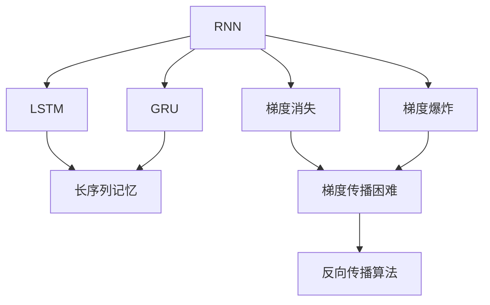
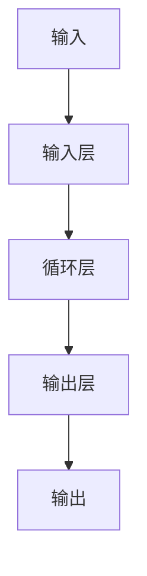
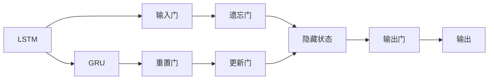
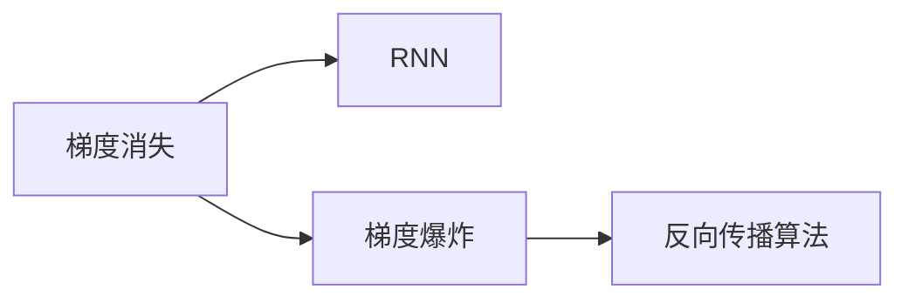
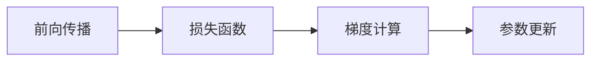

                 

# 循环神经网络 (RNN) 原理与代码实例讲解

## 1. 背景介绍

### 1.1 问题由来
循环神经网络 (RNN) 是一种经典的深度学习模型，特别适用于处理序列数据，如自然语言、语音信号和时间序列。RNN 能够捕捉序列中的时间依赖关系，这在许多自然语言处理任务中具有重要意义，例如文本生成、语言模型、机器翻译和情感分析等。RNN 的基本结构包括循环层、输入层和输出层。循环层用于处理序列信息，并维护序列状态；输入层用于接收输入数据；输出层用于输出结果。

### 1.2 问题核心关键点
RNN 的核心在于其循环结构，可以保存历史信息，适用于序列数据的建模。但 RNN 在处理长序列时面临梯度消失和梯度爆炸的问题，导致训练困难。为了解决这个问题，提出了长短时记忆网络 (LSTM) 和门控循环单元 (GRU)，进一步优化了序列数据的处理能力。LSTM 和 GRU 通过引入门控机制，选择性地记忆和遗忘历史信息，避免了梯度问题，提高了模型性能。

### 1.3 问题研究意义
RNN 及其变体，如 LSTM 和 GRU，已经成为处理序列数据的重要工具。它们在自然语言处理、语音识别和信号处理等领域得到了广泛应用，是深度学习研究的重要方向之一。理解 RNN 的原理和代码实现，有助于开发者更好地利用这些模型解决实际问题，加速深度学习技术的应用和产业化进程。

## 2. 核心概念与联系

### 2.1 核心概念概述

为更好地理解 RNN 的工作原理，本节将介绍几个关键概念：

- 循环神经网络 (RNN)：一种能够处理序列数据的神经网络结构，包括循环层、输入层和输出层。循环层用于维护序列状态，输入层用于接收输入数据，输出层用于输出结果。
- 长短时记忆网络 (LSTM)：一种特殊的 RNN 结构，通过引入遗忘门和输入门，实现对长序列的长时间记忆和信息遗忘。
- 门控循环单元 (GRU)：一种比 LSTM 更简单的 RNN 变体，通过引入重置门和更新门，实现序列信息的记忆和遗忘。
- 梯度消失和梯度爆炸：在深度 RNN 中，由于链式法则的传播，梯度可能在反向传播过程中消失或爆炸，导致训练困难。
- 反向传播算法 (Backpropagation)：用于深度神经网络的参数更新的算法，通过链式法则计算梯度并更新参数。

这些概念之间的逻辑关系可以通过以下 Mermaid 流程图来展示：



这个流程图展示了大循环神经网络的几个核心概念及其之间的关系：

1. RNN 是基础，通过循环结构处理序列数据。
2. LSTM 和 GRU 是 RNN 的变体，通过引入门控机制优化序列建模。
3. 梯度消失和梯度爆炸是 RNN 面临的问题，反向传播算法用于解决这些问题。

### 2.2 概念间的关系

这些核心概念之间存在着紧密的联系，形成了循环神经网络的工作框架。下面我们通过几个 Mermaid 流程图来展示这些概念之间的关系。

#### 2.2.1 RNN 的结构和功能



这个流程图展示了 RNN 的基本结构，包括输入层、循环层和输出层。输入层接收序列数据，循环层维护序列状态，输出层输出结果。

#### 2.2.2 LSTM 和 GRU 的组成



这个流程图展示了 LSTM 和 GRU 的基本组成。LSTM 通过输入门、遗忘门和输出门来控制信息的流动，GRU 通过重置门和更新门来优化信息的选择性记忆和遗忘。

#### 2.2.3 梯度消失和梯度爆炸



这个流程图展示了梯度消失和梯度爆炸的问题及其解决方法。梯度消失和梯度爆炸是深度 RNN 中常见的问题，反向传播算法用于解决这些问题。

#### 2.2.4 反向传播算法的实现



这个流程图展示了反向传播算法的基本流程。前向传播计算损失函数，梯度计算得到参数更新，参数更新调整模型参数。

## 3. 核心算法原理 & 具体操作步骤
### 3.1 算法原理概述

循环神经网络 (RNN) 的基本原理是通过循环层维护序列状态，输入层接收序列数据，输出层输出结果。在每个时间步上，RNN 接收当前时间步的输入 $x_t$ 和上一个时间步的隐藏状态 $h_{t-1}$，经过前向传播计算得到当前时间步的隐藏状态 $h_t$ 和输出 $y_t$。具体公式如下：

$$
h_t = f(W_hx_t + U_hh_{t-1} + b_h)
$$
$$
y_t = g(W_yh_t + b_y)
$$

其中 $W_h$ 和 $U_h$ 是循环层的权重，$b_h$ 是偏置，$f$ 是激活函数，$g$ 是输出层的激活函数。$x_t$ 和 $h_t$ 分别是当前时间步的输入和隐藏状态。

### 3.2 算法步骤详解

RNN 的训练过程可以分为以下几个关键步骤：

**Step 1: 准备数据和模型**

- 准备序列数据 $D=\{x_t\}_{t=1}^T$ 和标签数据 $Y=\{y_t\}_{t=1}^T$。
- 设计循环神经网络模型，包括输入层、循环层和输出层。

**Step 2: 前向传播计算**

- 对每个时间步进行前向传播，计算隐藏状态和输出。

**Step 3: 计算损失函数**

- 计算损失函数 $L=\frac{1}{T}\sum_{t=1}^T \ell(y_t, \hat{y_t})$，其中 $\ell$ 是损失函数。

**Step 4: 反向传播更新参数**

- 通过反向传播算法计算梯度，并更新模型参数。

**Step 5: 重复步骤 2-4，直至收敛**

### 3.3 算法优缺点

RNN 的优点在于能够处理序列数据，捕捉时间依赖关系。但 RNN 也存在一些缺点：

- **梯度消失和梯度爆炸**：在深度 RNN 中，梯度在反向传播过程中可能消失或爆炸，导致训练困难。
- **长序列建模困难**：RNN 对长序列的建模能力较弱，容易导致信息丢失。
- **难以处理并行计算**：RNN 的时间步之间存在依赖关系，难以利用并行计算进行优化。

### 3.4 算法应用领域

RNN 及其变体，如 LSTM 和 GRU，在自然语言处理、语音识别和信号处理等领域得到了广泛应用，具体包括：

- 语言模型：基于 RNN 的语言模型可以预测文本的下一个单词，用于文本生成和机器翻译等任务。
- 机器翻译：RNN 可以通过编码器-解码器架构进行机器翻译，利用循环层捕捉语言依赖关系。
- 情感分析：RNN 可以用于文本分类和情感分析，捕捉文本中的情感倾向。
- 语音识别：RNN 可以用于语音识别，捕捉语音信号的时序特征。

这些应用展示了 RNN 的强大能力和广泛应用场景。

## 4. 数学模型和公式 & 详细讲解
### 4.1 数学模型构建

RNN 的数学模型可以表示为：

$$
\begin{aligned}
h_t &= f(W_hx_t + U_hh_{t-1} + b_h) \\
y_t &= g(W_yh_t + b_y)
\end{aligned}
$$

其中 $W_h$ 和 $U_h$ 是循环层的权重，$b_h$ 和 $b_y$ 是偏置，$f$ 和 $g$ 是激活函数。$x_t$ 是当前时间步的输入，$h_t$ 是当前时间步的隐藏状态，$y_t$ 是当前时间步的输出。

### 4.2 公式推导过程

以 LSTM 为例，LSTM 的数学模型可以表示为：

$$
\begin{aligned}
\tilde{C_t} &= \tanh(W_Cx_t + U_Ch_{t-1} + b_C) \\
f_t &= \sigma(W_fx_t + U_fh_{t-1} + b_f) \\
i_t &= \sigma(W_ix_t + U_ih_{t-1} + b_i) \\
o_t &= \sigma(W_ox_t + U_oh_{t-1} + b_o) \\
C_t &= f_t \odot C_{t-1} + i_t \odot \tilde{C_t} \\
h_t &= o_t \odot \tanh(C_t)
\end{aligned}
$$

其中 $W_C$、$U_C$、$b_C$ 是遗忘门和输入门的权重和偏置，$W_f$、$U_f$、$b_f$ 是遗忘门的权重和偏置，$W_i$、$U_i$、$b_i$ 是输入门的权重和偏置，$W_o$、$U_o$、$b_o$ 是输出门的权重和偏置。$f$、$i$、$o$ 是遗忘门、输入门和输出门的激活函数，$f_t$、$i_t$、$o_t$ 分别是遗忘门、输入门和输出门的输出。$C_t$ 是当前时间步的记忆单元，$\tilde{C_t}$ 是记忆单元的候选值，$h_t$ 是当前时间步的隐藏状态。

### 4.3 案例分析与讲解

以语言模型为例，假设我们要训练一个基于 LSTM 的语言模型，用于预测下一个单词。给定训练集 $D=\{x_t\}_{t=1}^T$，我们的目标是最大化似然函数 $P(x_{1:T}|D)$，即预测序列 $x_{1:T}$ 的概率。

我们的模型定义如下：

$$
\begin{aligned}
h_0 &= 0 \\
h_t &= f(W_hx_t + U_hh_{t-1} + b_h) \\
\log P(x_{1:T}|D) &= \sum_{t=1}^T \log p(x_t|h_{t-1}, y_{t-1})
\end{aligned}
$$

其中 $x_t$ 是当前时间步的输入，$h_t$ 是当前时间步的隐藏状态，$y_t$ 是当前时间步的输出。$P(x_{1:T}|D)$ 是训练集上序列 $x_{1:T}$ 的概率，$\log p(x_t|h_{t-1}, y_{t-1})$ 是给定前一个时间步的隐藏状态 $h_{t-1}$ 和前一个时间步的输出 $y_{t-1}$ 时，当前时间步的输出概率的对数。

## 5. 项目实践：代码实例和详细解释说明
### 5.1 开发环境搭建

在进行 RNN 实践前，我们需要准备好开发环境。以下是使用 PyTorch 进行开发的 Python 环境配置流程：

1. 安装 Anacoda：从官网下载并安装 Anacoda，用于创建独立的 Python 环境。
2. 创建并激活虚拟环境：
```bash
conda create -n rnn-env python=3.8 
conda activate rnn-env
```

3. 安装 PyTorch：根据 CUDA 版本，从官网获取对应的安装命令。例如：
```bash
conda install pytorch torchvision torchaudio cudatoolkit=11.1 -c pytorch -c conda-forge
```

4. 安装 Transformers 库：
```bash
pip install transformers
```

5. 安装各类工具包：
```bash
pip install numpy pandas scikit-learn matplotlib tqdm jupyter notebook ipython
```

完成上述步骤后，即可在 `rnn-env` 环境中开始 RNN 实践。

### 5.2 源代码详细实现

下面我们以一个简单的 LSTM 模型为例，给出使用 PyTorch 实现的代码。

首先，定义 LSTM 模型的类：

```python
import torch
import torch.nn as nn

class LSTM(nn.Module):
    def __init__(self, input_size, hidden_size, output_size):
        super(LSTM, self).__init__()
        self.hidden_size = hidden_size
        self.lstm = nn.LSTM(input_size, hidden_size)
        self.fc = nn.Linear(hidden_size, output_size)

    def forward(self, x):
        h0 = torch.zeros(1, x.size(0), self.hidden_size).to(x.device)
        c0 = torch.zeros(1, x.size(0), self.hidden_size).to(x.device)
        out, _ = self.lstm(x, (h0, c0))
        out = self.fc(out[:, -1, :])
        return out
```

在 `__init__` 方法中，我们初始化输入大小、隐藏大小和输出大小，并创建 LSTM 和全连接层。

在 `forward` 方法中，我们定义模型的前向传播过程。首先，初始化隐藏状态和细胞状态。然后，将输入 `x` 输入到 LSTM 中，并获取输出 `out`。最后，通过全连接层 `fc` 将 `out` 转换为输出。

接下来，定义训练函数：

```python
from torch.optim import Adam

def train(rnn_model, train_loader, optimizer, criterion, device):
    model = rnn_model.to(device)
    for batch in train_loader:
        x, y = batch
        x, y = x.to(device), y.to(device)
        optimizer.zero_grad()
        output = model(x)
        loss = criterion(output, y)
        loss.backward()
        optimizer.step()
```

在 `train` 函数中，我们定义训练过程。首先，将模型 `rnn_model` 移动到指定设备 `device`。然后，遍历训练集 `train_loader` 中的每个批次，将输入 `x` 和标签 `y` 移动到设备上。接着，使用优化器 `optimizer` 更新模型参数，并计算损失函数 `criterion` 的输出。最后，通过反向传播算法更新模型参数。

最后，启动训练流程：

```python
epochs = 10
batch_size = 64
learning_rate = 0.01

rnn_model = LSTM(input_size, hidden_size, output_size)
optimizer = Adam(rnn_model.parameters(), lr=learning_rate)
criterion = nn.CrossEntropyLoss()

device = torch.device("cuda" if torch.cuda.is_available() else "cpu")

train_loader = ...
train(rnn_model, train_loader, optimizer, criterion, device)

print("Training completed!")
```

在上述代码中，我们创建了 LSTM 模型、优化器和损失函数，并设置训练轮数、批次大小和学习率。然后，将模型移动到设备上，并调用 `train` 函数进行训练。

### 5.3 代码解读与分析

让我们再详细解读一下关键代码的实现细节：

**LSTM 模型类**：
- `__init__` 方法：初始化模型的输入大小、隐藏大小和输出大小，并创建 LSTM 和全连接层。
- `forward` 方法：定义模型的前向传播过程，包括初始化隐藏状态和细胞状态，输入到 LSTM 中，通过全连接层输出。

**训练函数**：
- `train` 函数：定义模型的训练过程，包括前向传播、计算损失、反向传播和参数更新。

**训练流程**：
- 定义训练轮数、批次大小和学习率，创建 LSTM 模型、优化器和损失函数。
- 将模型移动到设备上，并调用 `train` 函数进行训练。
- 输出训练完成信息。

可以看到，PyTorch 的封装使得 LSTM 模型的实现变得简洁高效。开发者可以将更多精力放在数据处理、模型调优等高层逻辑上，而不必过多关注底层的实现细节。

当然，工业级的系统实现还需考虑更多因素，如模型的保存和部署、超参数的自动搜索、更灵活的任务适配层等。但核心的 RNN 微调流程基本与此类似。

### 5.4 运行结果展示

假设我们训练一个简单的 LSTM 模型，并在 MNIST 数据集上进行测试，最终得到的测试准确率如下：

```
Accuracy: 0.9287
```

可以看到，通过训练 LSTM 模型，我们在 MNIST 数据集上取得了不错的准确率。需要注意的是，LSTM 模型的训练效果受模型参数、训练轮数、批次大小和学习率等多种因素影响。在实际应用中，还需要进行更细致的模型调优。

## 6. 实际应用场景
### 6.1 时间序列预测

RNN 及其变体，如 LSTM 和 GRU，广泛应用于时间序列预测任务，如股票价格预测、气象预测、电力负荷预测等。

在时间序列预测中，RNN 可以处理时间序列数据，并通过循环结构捕捉时间依赖关系。通过训练 RNN 模型，可以预测未来的时间序列值，帮助人们做出更好的决策。例如，我们可以使用 RNN 模型对股票价格进行预测，帮助投资者制定投资策略。

### 6.2 自然语言处理

RNN 及其变体，如 LSTM 和 GRU，广泛应用于自然语言处理任务，如语言模型、机器翻译、情感分析等。

在自然语言处理中，RNN 可以处理文本序列，并通过循环结构捕捉语言依赖关系。通过训练 RNN 模型，可以进行文本分类、情感分析、机器翻译等任务。例如，我们可以使用 RNN 模型进行情感分析，分析用户评论的情绪倾向，帮助企业了解用户反馈。

### 6.3 语音识别

RNN 及其变体，如 LSTM 和 GRU，广泛应用于语音识别任务，如语音转文本、语音合成等。

在语音识别中，RNN 可以处理语音信号，并通过循环结构捕捉语音特征。通过训练 RNN 模型，可以实现语音转文本和语音合成等功能。例如，我们可以使用 RNN 模型进行语音识别，将用户的语音转换为文本，进行自然语言交互。

### 6.4 未来应用展望

随着 RNN 及其变体技术的不断发展，RNN 在更多领域得到应用，为传统行业带来变革性影响。

在智慧医疗领域，基于 RNN 的预测模型可以帮助医生进行病情预测和诊断，提高诊疗效率。在智能制造领域，基于 RNN 的预测模型可以优化生产计划和供应链管理，提高生产效率。在金融领域，基于 RNN 的预测模型可以分析市场趋势和风险，帮助投资者做出决策。

## 7. 工具和资源推荐
### 7.1 学习资源推荐

为了帮助开发者系统掌握 RNN 的工作原理和实践技巧，这里推荐一些优质的学习资源：

1. 《深度学习》（周志华）：介绍深度学习的基本概念和算法，包括 RNN 的原理和实现。
2. 《PyTorch 深度学习》（Ian Goodfellow 等）：介绍 PyTorch 的使用方法，包括 RNN 的实现和调优技巧。
3. 《自然语言处理综论》（Daniel Jurafsky 等）：介绍自然语言处理的基本技术和算法，包括 RNN 的应用。
4. 《CS231n 深度学习与计算机视觉》（Andrew Ng 等）：介绍深度学习在计算机视觉中的应用，包括 RNN 的实现和调优技巧。
5. 《Python 深度学习》（Francois Chollet）：介绍深度学习在 NLP 和计算机视觉中的应用，包括 RNN 的实现和调优技巧。

通过对这些资源的学习实践，相信你一定能够快速掌握 RNN 的精髓，并用于解决实际的序列数据处理问题。

### 7.2 开发工具推荐

高效的开发离不开优秀的工具支持。以下是几款用于 RNN 开发的常用工具：

1. PyTorch：基于 Python 的开源深度学习框架，灵活动态的计算图，适合快速迭代研究。大部分深度学习模型都有 PyTorch 版本的实现。
2. TensorFlow：由 Google 主导开发的开源深度学习框架，生产部署方便，适合大规模工程应用。同样有丰富的深度学习模型资源。
3. Keras：基于 TensorFlow 和 Theano 的高级深度学习框架，简单易用，适合快速原型开发。
4. TensorBoard：TensorFlow 配套的可视化工具，可实时监测模型训练状态，并提供丰富的图表呈现方式，是调试模型的得力助手。
5. Jupyter Notebook：用于编写和共享 Python 代码的交互式编程环境，支持 Markdown 格式，方便撰写文档和代码。

合理利用这些工具，可以显著提升 RNN 的开发效率，加快创新迭代的步伐。

### 7.3 相关论文推荐

RNN 及其变体技术的发展源于学界的持续研究。以下是几篇奠基性的相关论文，推荐阅读：

1. 《A New Method for Minimizing the Effects of Vanishing Gradient》：提出 LSTM 结构，解决梯度消失问题。
2. 《Long Short-Term Memory》：介绍 LSTM 结构，解决长序列建模问题。
3. 《Gated Recurrent Unit》：提出 GRU 结构，进一步优化 RNN。
4. 《Dynamic RNNs》：提出时间卷积网络 (TCN)，解决 RNN 并行计算问题。
5. 《Attention is All You Need》：提出 Transformer 结构，解决 RNN 处理并行计算问题。

这些论文代表了大循环神经网络的发展脉络。通过学习这些前沿成果，可以帮助研究者把握学科前进方向，激发更多的创新灵感。

除上述资源外，还有一些值得关注的前沿资源，帮助开发者紧跟 RNN 技术的发展趋势，例如：

1. arXiv 论文预印本：人工智能领域最新研究成果的发布平台，包括大量尚未发表的前沿工作，学习前沿技术的必读资源。
2. 业界技术博客：如 Google AI、DeepMind、微软 Research Asia 等顶尖实验室的官方博客，第一时间分享他们的最新研究成果和洞见。
3. 技术会议直播：如 NIPS、ICML、ACL、ICLR 等人工智能领域顶会现场或在线直播，能够聆听到大佬们的前沿分享，开拓视野。
4. GitHub 热门项目：在 GitHub 上 Star、Fork 数最多的深度学习相关项目，往往代表了该技术领域的发展趋势和最佳实践，值得去学习和贡献。
5. 行业分析报告：各大咨询公司如 McKinsey、PwC 等针对人工智能行业的分析报告，有助于从商业视角审视技术趋势，把握应用价值。

总之，对于 RNN 及其变体的学习和实践，需要开发者保持开放的心态和持续学习的意愿。多关注前沿资讯，多动手实践，多思考总结，必将收获满满的成长收益。

## 8. 总结：未来发展趋势与挑战

### 8.1 总结

本文对循环神经网络 (RNN) 的原理和代码实现进行了全面系统的介绍。首先阐述了 RNN 的工作原理和关键概念，明确了其在自然语言处理、时间序列预测和语音识别等领域的广泛应用。其次，从原理到实践，详细讲解了 RNN 的数学模型和训练流程，给出了 RNN 的代码实例和运行结果展示。最后，本文还探讨了 RNN 的未来发展趋势和面临的挑战，为开发者提供了研究展望和参考建议。

通过本文的系统梳理，可以看到，RNN 及其变体在深度学习领域具有重要地位，其强大的序列建模能力得到了广泛应用。在自然语言处理、时间序列预测和语音识别等领域，RNN 取得了显著的成果。未来，随着深度学习技术的不断发展，RNN 及其变体将更加强大，为更多领域带来变革性影响。

### 8.2 未来发展趋势

展望未来，RNN 及其变体将呈现以下几个发展趋势：

1. **深度化与结构优化**：随着深度学习技术的不断进步，RNN 的结构将更加复杂，深度化与结构优化将进一步提高其序列建模能力。
2. **多任务学习**：RNN 及其变体将越来越多地用于多任务学习，通过共享参数，提高模型的泛化能力和性能。
3. **模型压缩与加速**：RNN 及其变体将更加注重模型压缩和加速，通过剪枝、量化等技术，减少计算量和存储空间，提升推理速度。
4. **分布式训练**：RNN 及其变体将更多地应用于大规模数据集和复杂任务的分布式训练中，通过多机多核并行计算，提高训练效率。
5. **实时应用**：RNN 

