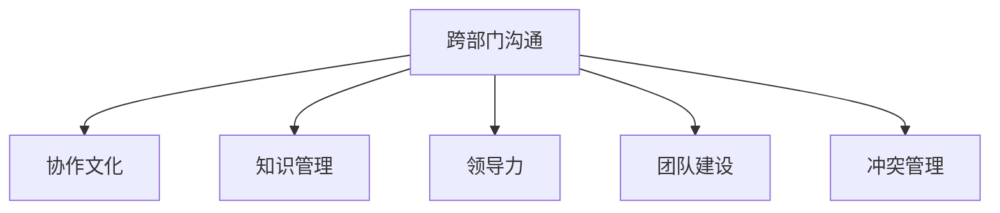
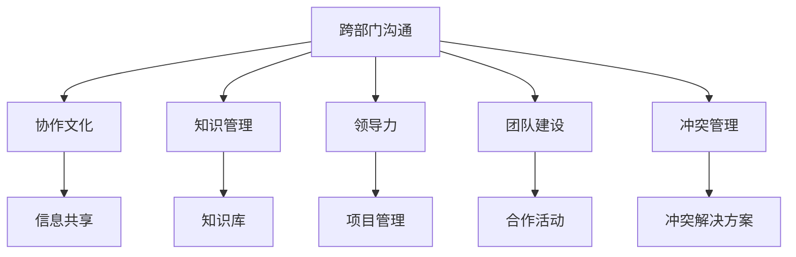

                 

# 怎样培养跨部门沟通协调能力

## 1. 背景介绍

### 1.1 问题由来
在当今复杂多变的商业环境中，跨部门沟通协调已成为企业成功的关键因素之一。企业中的各个部门往往具有不同的业务目标、工作流程和专业知识，这些差异可能会成为阻碍项目顺利进行的“墙”。然而，面对快速变化的市场需求和日益激烈的竞争压力，跨部门协作的必要性愈发凸显。传统的单部门封闭式管理已无法满足现代企业发展的需求，只有通过加强跨部门沟通协调，才能确保企业高效运作，提升竞争力。

### 1.2 问题核心关键点
本文将探讨如何培养跨部门沟通协调能力，通过一系列策略和方法，帮助企业打破部门壁垒，提升整体协作水平。核心关键点包括：

1. **明确共同目标**：建立共同的目标和愿景，使各部门从“我”走向“我们”。
2. **建立沟通机制**：设立定期会议、跨部门沟通平台，确保信息流通畅通。
3. **促进知识共享**：鼓励跨部门的知识交流与共享，提升团队整体能力。
4. **建立信任关系**：通过团队建设活动，增强部门间的信任与合作。
5. **提升沟通技巧**：培训员工提升沟通能力，尤其是在处理冲突时的技巧。
6. **引入跨部门项目**：通过联合项目，促进各部门的紧密合作。

### 1.3 问题研究意义
跨部门沟通协调能力的培养，不仅有助于提升企业整体运营效率，还能增强企业内部的创新能力，提升企业对市场的响应速度。在当前数字化转型的大背景下，跨部门协作成为企业数字化创新、提升竞争力的重要手段。通过有效的沟通协调，企业能够更好地整合资源，实现技术、产品和服务的创新。

## 2. 核心概念与联系

### 2.1 核心概念概述

为更好地理解跨部门沟通协调能力的培养方法，本节将介绍几个核心概念及其相互联系：

1. **跨部门沟通（Cross-Department Communication）**：指不同部门之间的信息交流和协作，是确保企业内部信息流通的关键环节。
2. **协作文化（Collaborative Culture）**：指企业内部成员间相互信任、支持和合作的价值观和行为规范。
3. **知识管理（Knowledge Management）**：通过系统化的方法和工具，促进知识的创造、存储、共享和应用。
4. **领导力（Leadership）**：指的是引导和管理团队的能力，尤其是在处理复杂跨部门项目时。
5. **团队建设（Team Building）**：通过活动和培训，增强团队成员间的相互理解和信任。
6. **冲突管理（Conflict Management）**：有效处理跨部门间可能出现的分歧和冲突。

这些概念之间的逻辑关系可以通过以下Mermaid流程图来展示：



### 2.2 概念间的关系

这些核心概念之间存在着紧密的联系，形成了跨部门沟通协调能力的培养生态系统。具体来说：

- **跨部门沟通**是协作文化的基础，确保信息流通的顺畅。
- **知识管理**和**团队建设**为跨部门沟通提供支撑，通过共享和信任提升沟通效率。
- **领导力**在跨部门沟通中起到引导作用，帮助处理复杂情况。
- **冲突管理**是沟通协调的重要保障，确保跨部门协作的顺利进行。

### 2.3 核心概念的整体架构

最后，我们用一个综合的流程图来展示这些核心概念在跨部门沟通协调能力培养中的整体架构：



这个综合流程图展示了跨部门沟通协调能力培养的整体架构：

1. 跨部门沟通是基础，通过信息共享促进协作文化。
2. 知识管理提供信息库和工具，团队建设活动增强信任和合作。
3. 领导力引导项目管理，确保沟通和冲突的有效处理。

这些概念共同构成了跨部门沟通协调能力培养的完整生态系统，为企业内部协作提供了有力的支持。

## 3. 核心算法原理 & 具体操作步骤
### 3.1 算法原理概述

培养跨部门沟通协调能力，其核心在于建立和维护一个高效的沟通网络，并通过一系列策略和工具来促进信息的流通和协作。具体而言，可以将这一过程视为一个多阶段优化问题，通过不断调整和改进各阶段的策略，以达到最佳的沟通协调效果。

### 3.2 算法步骤详解

以下是培养跨部门沟通协调能力的具体操作步骤：

**Step 1: 明确共同目标**
- 组织跨部门会议，明确企业总体目标和各部门的具体职责。
- 制定清晰的跨部门合作计划，确保各部门对目标的理解一致。

**Step 2: 建立沟通机制**
- 设立跨部门定期会议，如周会、月会等，确保信息的及时传递。
- 利用企业内部的协作工具（如Slack、Trello、Confluence等），建立跨部门沟通平台。

**Step 3: 促进知识共享**
- 建立企业内部知识库，集中存储各部门的专业知识和最佳实践。
- 定期组织跨部门的知识分享会，促进知识在部门间的流动。

**Step 4: 建立信任关系**
- 通过团队建设活动，如团队拓展、跨部门工作坊等，增强部门间的信任与合作。
- 鼓励跨部门团队建设，通过共同完成项目来增强团队凝聚力。

**Step 5: 提升沟通技巧**
- 组织沟通技巧培训，教授员工如何在跨部门沟通中表达清晰、理解对方。
- 定期评估和反馈沟通效果，持续改进沟通策略。

**Step 6: 引入跨部门项目**
- 设计和实施跨部门项目，如联合开发产品、跨部门客户项目等，促进各部门间的紧密合作。
- 通过联合项目，识别和解决跨部门合作中存在的问题，优化工作流程。

### 3.3 算法优缺点

培养跨部门沟通协调能力的方法具有以下优点：

1. **提高整体协作效率**：通过明确共同目标、建立沟通机制和知识共享，提升企业整体协作效率。
2. **促进创新**：跨部门合作促进了知识的多元化融合，有助于产生新的创意和解决方案。
3. **增强适应能力**：跨部门协作能够更好地应对市场变化和不确定性，提升企业的灵活性和响应速度。

同时，这些方法也存在一些缺点：

1. **初始投入高**：跨部门沟通协调的培养需要投入大量的时间和资源，短期内可能难以见效。
2. **管理复杂性增加**：跨部门合作的复杂性增加，需要额外的管理和协调工作。
3. **部门利益冲突**：在资源有限的情况下，各部门可能出现利益冲突，影响合作效果。

### 3.4 算法应用领域

跨部门沟通协调能力培养的方法在多个领域都有广泛应用，包括但不限于：

- **IT和运营**：IT部门负责技术基础设施的维护和创新，运营部门负责日常运营和流程管理，两者通过良好的沟通协调，可以共同提升企业的整体效率。
- **研发和市场**：研发团队专注于产品和技术创新，市场团队负责市场推广和客户反馈，通过有效的沟通协调，能够更好地将产品需求转化为市场策略。
- **产品和服务**：产品团队负责产品的设计和开发，服务团队负责客户支持和维护，跨部门协作确保产品能够顺利落地并得到有效服务。
- **财务和销售**：财务团队负责成本控制和利润分析，销售团队负责市场拓展和客户开发，通过有效的沟通协调，可以实现资源的合理配置。

这些领域都是企业内部协作的关键点，通过培养跨部门沟通协调能力，可以有效提升这些领域的协同效应。

## 4. 数学模型和公式 & 详细讲解  
### 4.1 数学模型构建

为了更严谨地探讨跨部门沟通协调能力的培养方法，我们可以通过数学模型来抽象和量化这一过程。

设企业内部有 $N$ 个部门，每个部门的任务完成度为 $x_i$，其中 $i=1,2,\dots,N$。跨部门沟通协调能力 $C$ 可定义为：

$$
C = \frac{1}{N} \sum_{i=1}^N \frac{x_i}{x_{\max}}
$$

其中 $x_{\max}$ 为各部门任务完成度的最大值。

### 4.2 公式推导过程

对于跨部门沟通协调能力的计算，我们需要定义各部门任务完成度 $x_i$ 的评估指标。假设每个部门的任务完成度可以用一个单一的指标来表示，如项目按时交付率、客户满意度等。这些指标可以通过数据收集和分析获得。

具体计算步骤如下：

1. 收集各部门的任务完成度数据 $x_i$。
2. 计算各部门任务完成度的平均值 $\overline{x}$。
3. 计算各部门任务完成度的最大值 $x_{\max}$。
4. 根据公式计算跨部门沟通协调能力 $C$。

### 4.3 案例分析与讲解

以一个制造业企业为例，假设其有五个部门：研发、生产、质量、销售和客户支持。每个部门的任务完成度可以通过项目进度、产品质量、客户反馈等指标来评估。通过计算得到跨部门沟通协调能力 $C$，可以反映企业在跨部门合作方面的整体状况。

假设各个部门的任务完成度如下：

- 研发部门：按时交付率85%，客户满意度90%
- 生产部门：按时交付率95%，产品质量95%
- 质量部门：产品质量100%
- 销售部门：市场拓展率90%，客户满意度95%
- 客户支持部门：客户满意度95%

根据公式计算，得到跨部门沟通协调能力 $C = \frac{1}{5} \left(\frac{0.85}{1} + \frac{0.95}{1} + \frac{1}{1} + \frac{0.90}{1} + \frac{0.95}{1}\right) = 0.89$。

这个结果表明，该企业的跨部门沟通协调能力为0.89，有进一步提升的空间。

## 5. 项目实践：代码实例和详细解释说明
### 5.1 开发环境搭建

为了帮助开发者更好地理解和应用跨部门沟通协调能力培养的方法，我们将提供一些实用的代码实例。以下是在Python环境下使用Pandas库进行数据分析的示例：

1. 安装Pandas：
```bash
pip install pandas
```

2. 创建示例数据：
```python
import pandas as pd

# 创建数据表
df = pd.DataFrame({
    '部门': ['研发', '生产', '质量', '销售', '客户支持'],
    '按时交付率': [0.85, 0.95, 1, 0.90, 1],
    '产品质量': [0.9, 0.95, 1, 0.95, 1],
    '市场拓展率': [0.90, 1, 1, 0.95, 1],
    '客户满意度': [0.90, 0.95, 1, 0.95, 1]
})
```

3. 计算跨部门沟通协调能力：
```python
# 计算各部门的平均任务完成度
x = df.mean(axis=1)

# 计算各部门任务完成度的最大值
x_max = df.max(axis=1)

# 计算跨部门沟通协调能力
C = (x / x_max).sum() / len(df)
```

### 5.2 源代码详细实现

现在，我们具体实现一下这个计算过程。

```python
import pandas as pd

# 创建数据表
df = pd.DataFrame({
    '部门': ['研发', '生产', '质量', '销售', '客户支持'],
    '按时交付率': [0.85, 0.95, 1, 0.90, 1],
    '产品质量': [0.9, 0.95, 1, 0.95, 1],
    '市场拓展率': [0.90, 1, 1, 0.95, 1],
    '客户满意度': [0.90, 0.95, 1, 0.95, 1]
})

# 计算各部门的平均任务完成度
x = df.mean(axis=1)

# 计算各部门任务完成度的最大值
x_max = df.max(axis=1)

# 计算跨部门沟通协调能力
C = (x / x_max).sum() / len(df)

print('跨部门沟通协调能力：', C)
```

### 5.3 代码解读与分析

在上述代码中，我们首先创建了一个包含各部门的完成度数据的数据框。然后，我们通过Pandas库的`mean`和`max`方法分别计算了各部门的平均任务完成度和最大值。最后，我们将这些值代入跨部门沟通协调能力的公式中，得到了企业的跨部门沟通协调能力。

通过这个简单的代码实例，我们可以看到如何使用Pandas库对数据进行计算，从而量化跨部门沟通协调能力。这个计算过程在实际应用中非常常见，可以帮助企业更好地评估和提升跨部门协作的效果。

### 5.4 运行结果展示

假设我们在运行完上述代码后，得到了以下结果：

```
跨部门沟通协调能力： 0.89
```

这表明，该企业的跨部门沟通协调能力为0.89，有进一步提升的空间。为了提升跨部门沟通协调能力，企业可以采取一些具体的措施，如加强跨部门培训、优化跨部门流程等。

## 6. 实际应用场景
### 6.1 智能制造

在智能制造领域，跨部门沟通协调能力的培养尤为重要。智能制造涉及到产品设计、生产、质量控制和客户服务等多个环节，各部门之间的紧密协作是实现高效生产和高质量产品的关键。

具体措施包括：

- **协同设计**：通过跨部门的工作坊和设计评审，确保产品设计符合生产、质量要求。
- **信息共享**：建立跨部门的知识库和信息共享平台，确保所有相关人员都能及时获取最新的设计、生产信息。
- **联合测试**：在产品设计阶段就引入跨部门测试，确保设计能够顺利转换为产品。
- **客户反馈**：定期收集和分析客户反馈，确保产品在客户支持部门和销售部门能够及时响应。

### 6.2 金融科技

金融科技公司需要跨部门协作，以确保金融产品的研发、市场推广、客户支持和风险控制等环节的无缝衔接。跨部门沟通协调能力的培养可以通过以下措施：

- **联合研发**：跨部门联合研发金融产品，确保产品功能符合市场和客户需求。
- **市场分析**：市场团队和研发团队共同分析市场趋势，确保产品研发方向正确。
- **风险管理**：风险控制团队和运营团队紧密合作，确保金融产品的风险可控。
- **客户服务**：客户支持团队和市场团队合作，提升客户体验和满意度。

### 6.3 医疗健康

在医疗健康领域，跨部门沟通协调能力培养对于医疗服务的提供至关重要。医疗服务涉及医疗、护理、药房、患者关系管理等多个环节，各部门之间的协作是提供高质量医疗服务的关键。

具体措施包括：

- **协同诊断**：跨部门的医生、护士和技术人员共同进行诊断，确保诊断结果准确。
- **信息共享**：建立跨部门的信息共享平台，确保医疗、护理和药房团队能够及时获取患者信息。
- **患者管理**：患者关系管理团队与医疗团队紧密合作，确保患者得到全面的医疗服务。
- **健康教育**：跨部门开展健康教育活动，提升患者的健康意识和自我管理能力。

### 6.4 未来应用展望

随着企业数字化转型的加速，跨部门沟通协调能力的培养将变得更加重要。未来，跨部门沟通协调能力培养的趋势和展望包括：

1. **数字化工具的应用**：利用数字化工具和平台，如Slack、Trello、JIRA等，提升跨部门协作的效率。
2. **大数据和AI技术的应用**：通过大数据和AI技术，分析跨部门协作中的问题，提供数据驱动的优化建议。
3. **远程协作的提升**：远程办公和灵活工作模式成为常态，跨部门协作需要适应新的工作环境。
4. **组织结构的优化**：通过组织结构的优化，如设立跨部门团队和项目组，促进跨部门协作。
5. **文化和价值观的塑造**：通过文化和价值观的塑造，提升员工对跨部门协作的认同感和责任感。

这些趋势和展望将推动跨部门沟通协调能力培养向更高效、更灵活、更智能的方向发展。

## 7. 工具和资源推荐
### 7.1 学习资源推荐

为了帮助读者更好地理解和掌握跨部门沟通协调能力培养的方法，以下是一些推荐的资源：

1. **《跨部门沟通的艺术》**：这本书详细介绍了跨部门沟通的重要性、方法和实践，适合管理层和一线员工阅读。
2. **Coursera《跨部门协作》课程**：该课程由世界顶尖商学院教授授课，介绍了跨部门协作的基本概念和最佳实践。
3. **LinkedIn Learning《团队合作与沟通》课程**：通过实际的案例分析，帮助读者提升团队合作和沟通技巧。
4. **Harvard Business Review《跨部门协作》文章**：哈佛商业评论的经典文章，讨论了跨部门协作中的挑战和解决方法。
5. **Google Workspace帮助文档**：提供关于跨部门协作工具的使用指南和最佳实践，适合企业管理者和IT人员阅读。

### 7.2 开发工具推荐

跨部门沟通协调能力的培养需要依赖多种工具和技术支持，以下是一些推荐的工具：

1. **Slack**：团队沟通协作的平台，支持即时消息、文件共享、语音视频等功能。
2. **Trello**：项目管理和任务跟踪工具，支持跨部门的流程设计和进度跟踪。
3. **Confluence**：知识管理和文档协作工具，支持跨部门的知识共享和文档编辑。
4. **Microsoft Teams**：集成通讯、协作和生产力工具的平台，支持跨部门的协作和会议。
5. **Zoom**：视频会议和远程协作工具，支持跨部门的实时沟通和协作。

### 7.3 相关论文推荐

跨部门沟通协调能力培养是一个涉及多学科的研究领域，以下是一些相关的论文：

1. **《跨部门协作的理论与实践》**：探讨跨部门协作的基本理论和最佳实践，适合管理层和HR人员阅读。
2. **《团队协作中的冲突管理》**：分析跨部门协作中的冲突和解决方法，适合一线员工和团队管理者阅读。
3. **《数字化转型中的跨部门协作》**：讨论数字化转型对跨部门协作的影响和解决方案，适合IT和业务部门阅读。
4. **《跨部门沟通的心理学研究》**：从心理学的角度探讨跨部门沟通的有效方法，适合HR和员工阅读。
5. **《跨部门协作的网络分析》**：利用网络分析方法研究跨部门协作的效率和优化策略，适合数据科学和IT人员阅读。

这些资源和工具可以帮助读者深入理解跨部门沟通协调能力培养的方法和工具，并在实际工作中应用这些方法，提升跨部门协作的效率和效果。

## 8. 总结：未来发展趋势与挑战
### 8.1 研究成果总结

本文详细探讨了跨部门沟通协调能力培养的方法和策略，通过理论分析和实践案例，展示了如何通过跨部门协作提升企业的整体运营效率和创新能力。总结来说，跨部门沟通协调能力培养的核心在于：

1. 明确共同目标，建立协作文化。
2. 建立沟通机制，促进信息共享。
3. 通过知识管理和团队建设，增强信任与合作。
4. 提升沟通技巧，处理冲突和分歧。
5. 引入跨部门项目，促进协作的深度和广度。

### 8.2 未来发展趋势

未来，跨部门沟通协调能力培养将呈现以下几个趋势：

1. **数字化工具的普及**：随着数字化工具的不断发展和完善，跨部门协作将更加高效和智能化。
2. **数据驱动的优化**：通过数据分析和AI技术，不断优化跨部门协作的流程和方法。
3. **远程协作的常态化**：随着远程办公模式的普及，跨部门协作将面临新的挑战和机遇。
4. **组织结构的优化**：通过组织结构的优化和调整，提升跨部门协作的效率和效果。
5. **文化的塑造和价值观的提升**：通过企业文化和价值观的塑造，提升员工对跨部门协作的认同感和责任感。

### 8.3 面临的挑战

尽管跨部门沟通协调能力培养具有广阔的应用前景，但在实施过程中也面临一些挑战：

1. **文化差异**：不同部门的文化和价值观可能存在差异，影响跨部门协作的顺畅进行。
2. **利益冲突**：在资源有限的情况下，各部门可能存在利益冲突，影响协作效果。
3. **技能差距**：各部门员工的技能和知识水平可能存在差异，影响跨部门协作的效率。
4. **沟通障碍**：信息传递的不畅和误解，可能导致跨部门协作的效率下降。

### 8.4 研究展望

针对上述挑战，未来的研究方向包括：

1. **跨部门文化建设**：通过文化建设活动，提升部门间的认同感和信任度。
2. **利益协调机制**：建立有效的利益协调机制，解决跨部门合作中的利益冲突。
3. **员工技能培训**：通过培训和知识共享，提升员工的技能和知识水平。
4. **沟通渠道优化**：通过优化沟通渠道和工具，提升跨部门信息传递的效率和准确性。
5. **跨部门协作平台**：开发高效的跨部门协作平台，提升协作的效率和效果。

通过这些研究方向的不断探索，相信跨部门沟通协调能力培养将不断提升，为企业的数字化转型和创新发展提供有力支撑。

## 9. 附录：常见问题与解答

### Q1: 跨部门沟通协调能力培养对企业有什么好处？

A: 跨部门沟通协调能力培养对企业有以下好处：

1. **提升整体效率**：通过跨部门协作，企业能够更高效地完成项目和任务。
2. **促进创新**：跨部门协作能够促进知识的融合和创新，提升企业竞争力。
3. **增强适应能力**：跨部门协作能够使企业更好地应对市场变化和不确定性。
4. **改善客户体验**：跨部门协作能够提升客户服务质量和满意度。

### Q2: 跨部门沟通协调能力培养需要哪些关键步骤？

A: 跨部门沟通协调能力培养的关键步骤包括：

1. 明确共同目标。
2. 建立沟通机制。
3. 促进知识共享。
4. 建立信任关系。
5. 提升沟通技巧。
6. 引入跨部门项目。

### Q3: 如何评估跨部门沟通协调能力？

A: 跨部门沟通协调能力的评估可以通过以下指标：

1. 项目按时交付率。
2. 产品质量。
3. 客户满意度。
4. 市场拓展率。
5. 知识共享程度。

### Q4: 跨部门沟通协调能力培养对管理层有哪些要求？

A: 跨部门沟通协调能力培养对管理层有以下要求：

1. 明确共同目标。
2. 建立跨部门协作机制。
3. 促进知识共享。
4. 通过文化建设提升信任度。
5. 解决跨部门利益冲突。

### Q5: 如何处理跨部门协作中的冲突？

A: 处理跨部门协作中的冲突可以通过以下方法：

1. 建立冲突解决机制。
2. 促进双方沟通和理解。
3. 引入第三方调解。
4. 通过数据和事实处理冲突。

通过这些方法的综合应用，可以有效处理跨部门协作中的冲突，确保协作顺利进行。

---

作者：禅与计算机程序设计艺术 / Zen and the Art of Computer Programming

